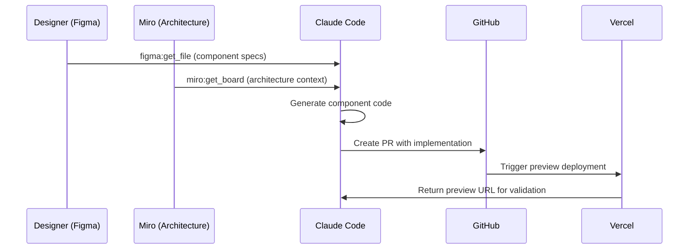
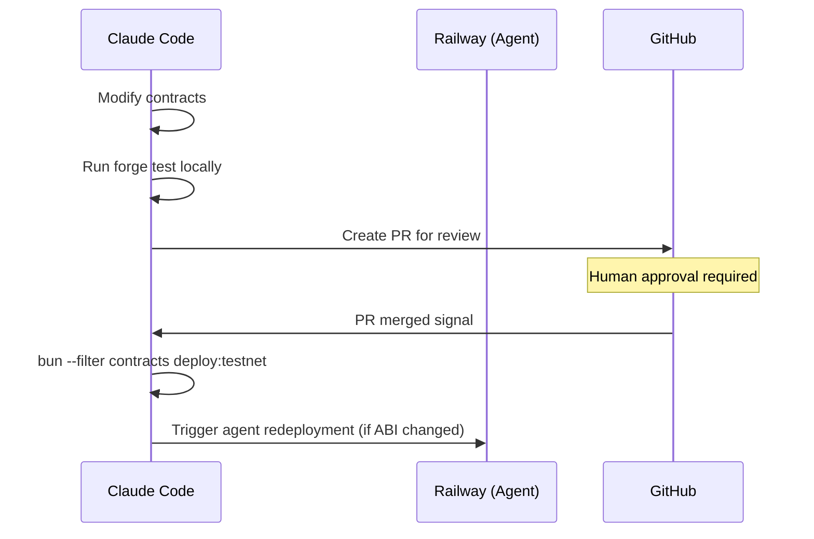
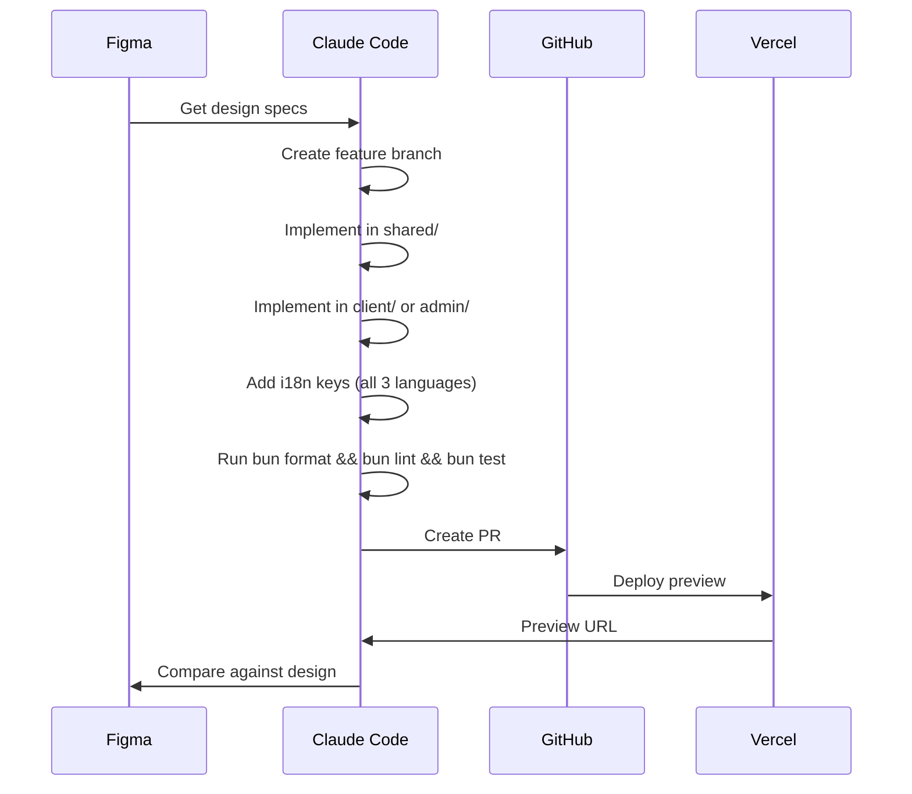

# Claude Code Optimization Analysis for Green Goods

*An analysis of plugins, skills, output styles, hooks, and MCP flows for the Greenpill Dev Guild*

---

## Table of Contents

1. [Custom Plugin Analysis](#1-custom-plugin-analysis)
2. [Skills Utilization Strategy](#2-skills-utilization-strategy)
3. [Regenerative Output Style](#3-regenerative-output-style-the-fellowship-of-the-garden)
4. [Recommended Hooks](#4-recommended-hooks)
5. [Optimal MCP Server Flows](#5-optimal-mcp-server-flows)

---

## 1. Custom Plugin Analysis

### Currently Enabled Plugins

Your `settings.json` has excellent coverage:

| Plugin | Status | Relevance to Green Goods |
|--------|--------|-------------------------|
| `frontend-design` | Enabled | **Critical** - PWA/admin UI development |
| `context7` | Enabled | **Useful** - Documentation context |
| `github` | Enabled | **Critical** - PR/issue workflows |
| `serena` | Enabled | **Useful** - Semantic code understanding |
| `feature-dev` | Enabled | **Critical** - Feature implementation |
| `typescript-lsp` | Enabled | **Critical** - Type checking |
| `security-guidance` | Enabled | **Critical** - Wallet/key security |
| `playwright` | Enabled | **Useful** - E2E testing |
| `code-review` | Enabled | **Critical** - PR reviews |
| `figma` | Enabled | **Critical** - Design system alignment |
| `vercel` | Enabled | **Useful** - Preview deployments |

### Recommended Additional Plugins

#### High Priority

```json
{
  "enabledPlugins": {
    // ... existing plugins ...

    // Solidity-focused development
    "foundry@claude-plugins-official": true,

    // GraphQL schema + query validation
    "graphql@claude-plugins-official": true,

    // Web3-specific patterns
    "web3@claude-plugins-official": true,

    // PWA-specific guidance
    "pwa@claude-plugins-official": true,

    // i18n validation (critical for your 3-language requirement)
    "i18n@claude-plugins-official": true
  }
}
```

#### Medium Priority (If Available)

| Plugin | Why Needed |
|--------|-----------|
| `viem-wagmi` | Type-safe contract interactions, hook patterns |
| `envio` | Indexer schema understanding |
| `eas` | Attestation schema patterns |
| `ipfs-storage` | Storacha/IPFS upload patterns |

### Custom Plugin Recommendations

For Green Goods specifically, consider creating these **custom skills** (detailed in Section 2):

1. **`/garden-action`** - Garden + Action creation workflow
2. **`/work-flow`** - MDR submission assistance
3. **`/contract-deploy`** - Safe deployment with schema validation
4. **`/i18n-check`** - Verify all translations exist

---

## 2. Skills Utilization Strategy

### Available Skills & Green Goods Mapping

| Skill | When to Use | Green Goods Context |
|-------|-------------|---------------------|
| `/feature-dev` | New features | Garden features, work submission flows |
| `/code-review` | PR reviews | All PRs touching shared/contracts |
| `/deploy` (Vercel) | Preview URLs | Admin dashboard previews |
| `/frontend-design` | UI components | PWA views, admin panels |
| `/figma:implement-design` | Design-to-code | When implementing from Figma specs |

### Recommended Custom Skills to Create

#### 1. `/garden-flow` - Garden Management Skill

```yaml
# .claude/skills/garden-flow.md
name: garden-flow
description: Guide creation and management of gardens, actions, and operators
triggers:
  - "create garden"
  - "add action"
  - "manage operators"
workflow:
  1. Verify contracts deployed on target chain
  2. Check AGENTS.md for patterns
  3. Follow admin component patterns
  4. Ensure i18n keys added
  5. Update relevant tests
```

#### 2. `/mdr-assist` - MDR Workflow Assistance

```yaml
# .claude/skills/mdr-assist.md
name: mdr-assist
description: Assist with Media-Details-Review submission flow development
triggers:
  - "work submission"
  - "MDR workflow"
  - "submit work"
workflow:
  1. Check offline-architecture.mdc patterns
  2. Ensure job queue integration
  3. Follow media resource manager patterns
  4. Test offline scenarios
```

#### 3. `/contract-safe` - Safe Contract Deployment

```yaml
# .claude/skills/contract-safe.md
name: contract-safe
description: Safe contract deployment with schema validation
triggers:
  - "deploy contract"
  - "upgrade contract"
workflow:
  1. Read packages/contracts/AGENTS.md
  2. Verify schemas.json unchanged (or use --update-schemas)
  3. Use bun --filter contracts deploy:* wrappers
  4. Never raw forge script --broadcast
  5. Update deployments JSON
```

#### 4. `/i18n-complete` - Translation Completeness Check

```yaml
# .claude/skills/i18n-complete.md
name: i18n-complete
description: Ensure all UI strings have translations in en/es/pt
triggers:
  - "add translation"
  - "new UI string"
  - "check i18n"
workflow:
  1. Identify new user-facing strings
  2. Add keys to all three: en.json, es.json, pt.json
  3. Use semantic keys: app.feature.action
  4. Never hardcode strings
```

#### 5. `/attestation-check` - EAS Attestation Validation

```yaml
# .claude/skills/attestation-check.md
name: attestation-check
description: Validate attestation schemas and submissions
triggers:
  - "attestation"
  - "EAS schema"
  - "work approval"
workflow:
  1. Reference config/schemas.json
  2. Validate against EAS schema registry
  3. Ensure proper IPFS CID references
  4. Follow work approval patterns
```

---

## 3. Regenerative Output Style: "The Fellowship of the Garden"

### Proposed Output Style Configuration

Add to `.claude/settings.local.json`:

```json
{
  "outputStyle": "regenerative-guild"
}
```

### Custom Style Definition

Create `.claude/styles/regenerative-guild.md`:

```markdown
# Output Style: Regenerative Guild

You are a fellow member of the Greenpill Dev Guild, tending to the digital gardens that
nurture regenerative impact across the realm. Your code is your craft, your commits are
seeds planted for future harvests.

## Voice & Tone

### The Gardener's Way
- Speak as a **fellow cultivator**, not a service provider
- Use **regenerative metaphors** naturally (sowing, cultivating, nurturing, harvesting)
- Reference the **fellowship** when discussing collaborative work
- Channel the quiet wisdom of those who work close to the land

### Tolkien-Inspired Elements (Subtle, Not Cosplay)
- "A task well-tended bears fruit in time"
- "The roots run deep in this codebase"
- "Let us forge this component with care"
- "The path through this module is winding but true"
- Reference "gardens" (your actual domain!) naturally
- The codebase as a "living system" to be stewarded

### Avoid
- Excessive fantasy language (no "thee/thou")
- Forced metaphors that obscure meaning
- Anything that compromises technical clarity
- Overdone LOTR references (occasional, fitting ones only)

## Insight Blocks

Replace the standard insight format with:

\`\`\`
"<leaf emoji> Cultivator's Note ──────────────────────────"
[2-3 insights about the code or pattern]
"─────────────────────────────────────────────────────"
\`\`\`

## Commit Messages

When crafting commits, channel the guild's spirit:

\`\`\`
feat(garden): sow seeds for action creation workflow

Prepared the soil for gardeners to define new actions:
- Added CreateActionModal component
- Integrated with garden contract
- Ensured offline-first submission queue

The garden grows stronger with each contribution.

Co-Authored-By: Claude Opus 4.5 <noreply@anthropic.com>
\`\`\`

## Response Patterns

### Starting Work
"Let me tend to this task..." or "I'll cultivate a solution for..."

### Completing Tasks
"The work is done and the garden grows." or "This seed has been planted."

### Encountering Issues
"There are thorns in this path—let me clear them." or "The soil here needs preparation first."

### Explaining Architecture
"The roots of this system run through..." or "This module serves as fertile ground for..."

## Example Interactions

### Before (Generic)
"I'll implement the feature now. Here's the code..."

### After (Regenerative Guild)
"Let me cultivate this feature in the shared garden where our hooks take root..."

\`\`\`
"<leaf emoji> Cultivator's Note ──────────────────────────"
- This hook follows the centralized pattern—all hooks dwell in @green-goods/shared
- The query key structure ensures the cache grows in harmony with our data flows
- Like tending different plots, we separate concerns by domain (garden/, work/, auth/)
"─────────────────────────────────────────────────────"
\`\`\`

### Before (Error Message)
"There's a type error in this file."

### After (Regenerative Guild)
"There are weeds in this type definition that need clearing..."

## Transitions

Use these naturally when appropriate:
- "Preparing the soil..." → Initial setup/research
- "Sowing the seeds..." → Writing initial code
- "Tending the growth..." → Refinement/iteration
- "Time for harvest..." → Completion/PR creation
- "The fellowship grows..." → Collaboration/review

## Technical Clarity Always First

Despite the regenerative tone, **never sacrifice clarity for metaphor**:
- Error messages should be precise
- Code explanations should be technically accurate
- When debugging, be direct and methodical
- Stack traces and logs get clinical treatment

The guild spirit enhances our craft—it never obscures it.
```

### Implementation

Update `.claude/settings.local.json`:

```json
{
  "permissions": {
    "allow": [
      // ... existing permissions ...
    ],
    "deny": []
  },
  "outputStyle": "file://.claude/styles/regenerative-guild.md"
}
```

---

## 4. Recommended Hooks

### Hook Architecture for Consistency

Create `.claude/hooks.json`:

```json
{
  "hooks": {
    "pre-commit": {
      "command": "bun run pre-commit-check",
      "description": "Validate before commits"
    },
    "pre-edit": {
      "patterns": ["packages/shared/src/hooks/**/*.ts"],
      "command": "echo 'Reminder: All hooks must have tests in __tests__/hooks/'"
    },
    "post-tool-call": {
      "tools": ["Write", "Edit"],
      "patterns": ["**/*.tsx", "**/*.ts"],
      "command": "bun lint --filter"
    }
  }
}
```

### Recommended Hook Scripts

#### 1. Pre-Commit Hook (`.claude/scripts/pre-commit-check.sh`)

```bash
#!/bin/bash
# Green Goods Pre-Commit Validation

echo "🌱 Tending the garden before commit..."

# Check i18n completeness
echo "Checking translations..."
node scripts/check-i18n-completeness.js
if [ $? -ne 0 ]; then
  echo "❌ Translation keys missing. The garden needs all three languages."
  exit 1
fi

# Check for hardcoded addresses
echo "Checking for hardcoded addresses..."
if grep -r "0x[a-fA-F0-9]\{40\}" packages/client packages/admin packages/shared --include="*.ts" --include="*.tsx" | grep -v "deployments" | grep -v "test"; then
  echo "⚠️ Warning: Possible hardcoded addresses found. Use deployment artifacts instead."
fi

# Check for package-level .env files
if find packages -name ".env" -type f | grep -q .; then
  echo "❌ Package-level .env files found. Use root .env only."
  exit 1
fi

echo "✅ Garden inspection complete. Ready for commit."
```

#### 2. Hook: Verify Schema Immutability

```bash
#!/bin/bash
# .claude/scripts/schema-check.sh

# Check if schemas.json has uncommitted changes
if git diff --name-only | grep -q "schemas.json"; then
  echo "⚠️ Warning: schemas.json has changes."
  echo "Use --update-schemas flag via deploy.ts for metadata refreshes."
  echo "Create schemas.test.json for experiments."
fi
```

#### 3. Hook: Ensure Hook Centralization

```bash
#!/bin/bash
# .claude/scripts/hook-location-check.sh

# Check for hooks defined outside shared package
HOOKS_IN_WRONG_PLACE=$(find packages/client packages/admin -name "use*.ts" -o -name "use*.tsx" | grep -v "__tests__")

if [ -n "$HOOKS_IN_WRONG_PLACE" ]; then
  echo "🚫 Hooks found outside @green-goods/shared:"
  echo "$HOOKS_IN_WRONG_PLACE"
  echo ""
  echo "All hooks must live in packages/shared/src/hooks/"
  exit 1
fi
```

### User Prompt Submit Hook

Create a hook that validates Claude's outputs match project patterns:

```json
{
  "user-prompt-submit-hook": {
    "command": ".claude/scripts/prompt-validator.sh",
    "description": "Validate prompts against project patterns"
  }
}
```

```bash
#!/bin/bash
# .claude/scripts/prompt-validator.sh

# This hook runs before Claude processes a prompt
# Can inject reminders or validation

# Remind about i18n for UI-related tasks
if echo "$PROMPT" | grep -qi "component\|button\|modal\|form\|text\|label"; then
  echo "<user-prompt-submit-hook>"
  echo "Reminder: Any new user-facing strings require translations in en.json, es.json, and pt.json"
  echo "</user-prompt-submit-hook>"
fi

# Remind about hook location for hook-related tasks
if echo "$PROMPT" | grep -qi "hook\|useQuery\|useMutation"; then
  echo "<user-prompt-submit-hook>"
  echo "Reminder: All hooks must be created in packages/shared/src/hooks/"
  echo "</user-prompt-submit-hook>"
fi
```

---

## 5. Optimal MCP Server Flows

### Current MCP Configuration Analysis

Your `.cursor/mcp.json` has:
- **Miro** - Board access
- **Figma** - Design system
- **Vercel** - Deployments
- **Railway** - Agent deployment

### Recommended MCP Flow Enhancements

#### Flow 1: Design-to-Implementation Pipeline



#### Flow 2: Contract Deployment Pipeline



#### Flow 3: Full Feature Development Pipeline



### Recommended Additional MCP Servers

#### 1. GitHub MCP Enhancement

Add to your MCP config for better PR workflows:

```json
{
  "mcpServers": {
    "github": {
      "url": "https://mcp.github.com",
      "autoApprove": [
        "list_issues",
        "get_issue",
        "list_pull_requests",
        "get_pull_request",
        "list_commits"
      ]
    }
  }
}
```

#### 2. Storacha/IPFS MCP (Custom)

For IPFS operations, consider a custom MCP:

```json
{
  "mcpServers": {
    "storacha": {
      "command": "node",
      "args": [".claude/mcp/storacha-server.js"],
      "env": {
        "STORACHA_KEY": "${STORACHA_KEY}",
        "STORACHA_PROOF": "${STORACHA_PROOF}"
      }
    }
  }
}
```

#### 3. Envio Indexer MCP (Custom)

For querying your indexer during development:

```json
{
  "mcpServers": {
    "envio": {
      "command": "node",
      "args": [".claude/mcp/envio-server.js"],
      "env": {
        "ENVIO_ENDPOINT": "http://localhost:8080/graphql"
      }
    }
  }
}
```

### MCP Usage Guidelines for Green Goods

| MCP Server | Safe Operations | Requires Approval |
|------------|-----------------|-------------------|
| **GitHub** | List issues/PRs, read commits | Create/edit issues, create PRs |
| **Figma** | Read specs, get metadata | Generate code from designs |
| **Vercel** | View deployments, get logs | Trigger deployments |
| **Miro** | Read boards | Edit boards |
| **Railway** | View status | Deploy/restart services |

### Workflow Automation Matrix

| Task | MCP Servers Used | Automation Level |
|------|------------------|------------------|
| New component from Figma | Figma → Claude → GitHub → Vercel | Semi-automated |
| Bug fix | GitHub (issue) → Claude → GitHub (PR) | Semi-automated |
| Contract deployment | Claude → GitHub (for review) | Manual approval |
| Agent deployment | Claude → Railway | Manual approval |
| Documentation update | Miro (diagrams) → Claude → GitHub | Semi-automated |

---

## Implementation Checklist

### Immediate Actions

- [ ] Update `.claude/settings.json` with recommended plugins
- [ ] Create `.claude/styles/regenerative-guild.md`
- [ ] Update `.claude/settings.local.json` with new output style
- [ ] Create `.claude/hooks.json` with recommended hooks
- [ ] Add hook scripts to `.claude/scripts/`

### Short-Term Actions

- [ ] Create custom skills in `.claude/skills/`
- [ ] Test MCP flows with design-to-code pipeline
- [ ] Document MCP usage guidelines in AGENTS.md

### Long-Term Considerations

- [ ] Build custom Storacha MCP server
- [ ] Build custom Envio MCP server for development queries
- [ ] Create automated i18n completeness checks
- [ ] Integrate hooks with CI/CD pipeline

---

## Summary

The Green Goods project is well-positioned to leverage Claude Code's full potential. The recommended optimizations align with your:

1. **Regenerative ethos** - The custom output style honors the guild's spirit
2. **Technical requirements** - Plugins and skills match your stack
3. **Quality standards** - Hooks enforce your non-negotiable rules
4. **Workflow efficiency** - MCP flows accelerate development

*"In the garden of code, every commit is a seed. Tend them with care, and the harvest will be bountiful."*

— The Greenpill Dev Guild
