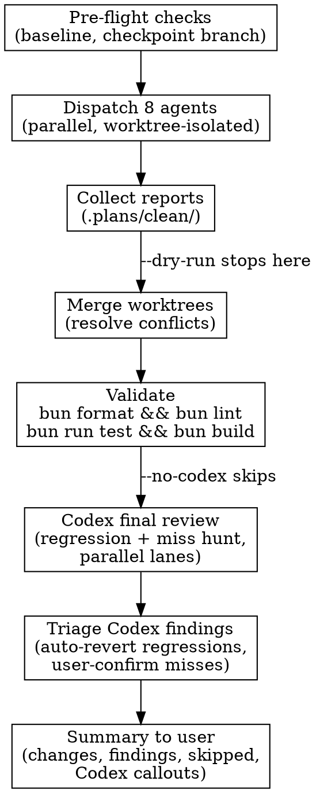

# Clean Skill

Parallel codebase cleanup: 8 focused agents each research, assess, and implement high-confidence improvements. Unlike `/audit` (read-only) and `/principles` (read-only), `/clean` **transforms code**.

**References**: `CLAUDE.md` for invariants. `/audit` for prior findings. `/principles` for design-level context.

---

## Activation

| Trigger | Action |
|---------|--------|
| `/clean` | Full 8-agent cleanup + Codex final review |
| `/clean --dry-run` | Research + assessment only, no implementation, no Codex review |
| `/clean --scope shared` | Limit all agents (and Codex review) to one package |
| `/clean --agents 1,3,5` | Run only specific agents by number; Codex review still runs |
| `/clean --no-codex` | Skip the Codex final review pass |

---

## Pre-Flight

Before dispatching agents:

1. **Check for uncommitted work**: `git status` — warn user if dirty
2. **Run baseline**: `bun format && bun lint && bun run test` — capture pass/fail counts
3. **Load prior audit**: `ls -t .plans/audits/*-audit.md | head -1` — feed findings to relevant agents
4. **Create checkpoint branch**: `git switch -c clean/$(date +%Y%m%d-%H%M%S)` from current HEAD
5. **Record checkpoint SHA**: `CHECKPOINT_SHA="$(git rev-parse HEAD)"` — every agent worktree must be based on this exact checkpoint

---

## The 8 Agents

Dispatch ALL agents in parallel using the Agent tool. Each agent runs in `isolation: "worktree"` to avoid conflicts. Each worktree MUST branch from the checkpoint SHA, not `main`, `origin/main`, or the tool's default branch. Each agent follows the same three-phase protocol:

### Worktree Base Invariant

Before an agent starts implementation, verify its worktree base from the orchestrator:

```bash
test "$(git -C "$WORKTREE" merge-base "$CHECKPOINT_SHA" HEAD)" = "$CHECKPOINT_SHA"
```

If any agent worktree fails this check, stop and re-dispatch that agent from the checkpoint. Do not continue a stale-base run by default.

Salvage is allowed only when the human explicitly approves a stale-base salvage after seeing:
- checkpoint SHA and stale worktree SHA
- commit gap (`git rev-list --count "$STALE_BASE..$CHECKPOINT_SHA"`)
- affected file list
- planned validation and conflict audit steps

When stale-base salvage is approved, create `.plans/clean/merge-audit.md` and record every conflict and every dropped/ported agent insight.

### Agent Protocol (all agents)

```
Phase 1: RESEARCH — Scan the entire codebase for instances of the problem
Phase 2: ASSESS   — Write a critical assessment with findings categorized:
                     HIGH-CONFIDENCE (safe to fix), MEDIUM (needs judgment), LOW (risky/unclear)
Phase 3: IMPLEMENT — Fix all HIGH-CONFIDENCE findings. Skip MEDIUM and LOW.
```

Each agent outputs a report at `.plans/clean/agent-{N}-{name}.md` before implementing. In `--dry-run` mode, agents stop after Phase 2.

Every report must include a provenance block:

```md
## Provenance
- checkpoint_sha:
- worktree_base_sha:
- worktree_head_sha:
- merge_base_with_checkpoint:
- stale_base: yes/no
```

### Agent 1: Deduplication & DRY

```
Scan the codebase for duplicated code patterns. Focus on:

- Duplicated component patterns (similar cards, forms, lists across views)
- Copy-pasted logic between files or packages
- Repeated Tailwind class strings that should be extracted to shared utilities
- Similar utility functions that could be consolidated
- Duplicated type definitions with minor variations

Tools: Use grep/glob to find similar patterns. Compare files side by side.

Rules:
- Only consolidate when it REDUCES complexity (3+ duplicates, or 2 that are nearly identical)
- Respect the hook boundary: consolidated hooks go in @green-goods/shared
- Respect barrel imports: new shared exports must be added to the package index
- Don't create premature abstractions for 2 slightly-different things
- Preserve all existing tests; update imports as needed
```

### Agent 2: Type Consolidation

```
Find all type definitions across the monorepo and consolidate shared types.

Scan for:
- Types defined in multiple packages that represent the same domain concept
- Types in client/admin that should live in @green-goods/shared
- Inline type definitions that duplicate shared types
- Type aliases that add no value over the original
- Inconsistent naming for the same concept (e.g., GardenData vs GardenInfo vs Garden)

Rules:
- Domain types (Garden, Work, Action, Address) MUST live in @green-goods/shared
- Use Address type (not string) for Ethereum addresses
- Preserve backward compatibility: update all import sites when moving types
- Run `bun run test` in affected packages after changes
- Check that barrel exports in shared/src/index.ts include new types
```

### Agent 3: Dead Code Removal (knip)

```
Find and remove all unused code using knip and manual verification.

Steps:
1. Run `bunx knip --reporter compact` to get the full unused report
2. For each finding, VERIFY it's actually unused:
   - Check dynamic imports: grep for string-based imports of the export name
   - Check test files: some exports are only used in tests
   - Check config files: some are referenced in vite.config, vitest.config, etc.
   - Check Envio handlers: runtime-imported, not statically analyzable
   - Check Foundry libs: packages/contracts/lib/ is excluded
3. Remove confirmed dead code: unused files, exports, types, dependencies
4. Run `bun run test` after removals to verify nothing breaks

Rules:
- Trust knip over grep for unused detection (~80% false-positive rate with grep)
- Never remove from packages/contracts/lib/ (Foundry submodules)
- Never remove from packages/indexer/generated/ (Envio generated)
- Double-check test utilities — they may only be used in test files
- Remove the import AND the file/export, not just one
```

### Agent 4: Circular Dependency Resolution (madge)

```
Find and untangle circular dependencies.

Steps:
1. Install and run madge: `npx madge --circular --extensions ts,tsx packages/`
2. For each cycle, understand WHY the cycle exists:
   - Is it a legitimate co-dependency? (rare but possible)
   - Is it an architectural layer violation? (common)
   - Is it a type-only import that could use `import type`?
3. Resolve cycles using these strategies (in order of preference):
   a. Convert to `import type` if only types are needed
   b. Extract shared interface to a third module
   c. Use dependency inversion (depend on abstraction, not concrete)
   d. Merge modules if they're truly one concern
4. Verify: `npx madge --circular --extensions ts,tsx packages/` should show zero cycles

Rules:
- Respect the build order: contracts -> shared -> indexer -> client/admin/agent
- Never create upward dependencies (client importing from admin, shared importing from client)
- Preserve the hook boundary: hooks stay in shared
- Run `bun build` after changes to verify the dependency graph is clean
```

### Agent 5: Type Strengthening

```
Remove all weak types (any, unknown, type assertions) and replace with proper types.

Scan for:
- `any` type annotations
- `unknown` used as a lazy escape (vs legitimate unknown input)
- Type assertions (`as SomeType`) that bypass the type system
- `// @ts-ignore` and `// @ts-expect-error` comments
- Non-null assertions (`!`) used to silence the compiler
- `Record<string, any>` and similar weak generic patterns

For each finding:
1. Research what the actual type should be by reading:
   - The function's callers and call sites
   - The package's type definitions (e.g., wagmi, viem, EAS SDK types)
   - Related test files for usage patterns
2. Replace with the correct strong type
3. Fix any downstream type errors caused by the strengthening

Rules:
- `unknown` is CORRECT at system boundaries (user input, external APIs, JSON.parse)
- `any` in test mocks is acceptable if the mock shape is complex
- Some libraries export weak types — add a local type wrapper rather than using `any`
- Run `bun run test` after changes
- Verify with the TypeScript compiler: no new errors
```

### Agent 6: Defensive Code Removal

```
Remove unnecessary try-catch blocks and defensive programming that hides errors.

Scan for:
- Empty catch blocks: catch (e) {} or catch { }
- Catch blocks that only log: catch (e) { console.log(e) }
- Catch-and-return-default: catch (e) { return null } / catch (e) { return [] }
- Fallback patterns: value ?? defaultValue where value should never be null
- Optional chaining abuse: obj?.prop?.nested when obj is always defined
- Silent error swallowing in mutation handlers

For each finding, classify:
- KEEP: Handles genuinely unknown/unsanitized input (external APIs, user input, file I/O)
- KEEP: Uses parseContractError() + USER_FRIENDLY_ERRORS (the project's error pattern)
- KEEP: Error boundary or explicit error recovery with user feedback
- REMOVE: Hides errors from developers during debugging
- REMOVE: Returns fake success when operation actually failed
- REMOVE: Catches errors just to re-throw them
- SIMPLIFY: Overly broad catch that should be narrowed to specific error types

Rules:
- Respect the project's error handling pattern: parseContractError() + USER_FRIENDLY_ERRORS
- Respect createMutationErrorHandler() in shared mutation hooks
- Use logger from shared (not console.log) if error logging is needed
- Never swallow errors in mutation/transaction paths
- Run `bun run test` after changes
```

### Agent 7: Legacy & Deprecated Code

```
Find and remove deprecated, legacy, or fallback code paths.

Scan for:
- @deprecated JSDoc tags
- TODO/FIXME/HACK comments with stale context
- Feature flags or conditional paths for features that are now always on/off
- Commented-out code blocks (more than 2 lines)
- Migration shims or backward-compatibility wrappers
- Old API endpoints or contract addresses that are no longer used
- Import aliases that map old names to new names
- Fallback code paths for browsers/environments no longer supported
- Version-gated code (if version >= X) where X is long past

For each finding:
1. Verify the code is truly obsolete (check git blame for context)
2. Verify no active code path depends on it
3. Remove the dead path and simplify the remaining code
4. Ensure the remaining code path is clean and singular (no unnecessary branching)

Rules:
- Check git blame before removing — understand WHY it was added
- If a TODO references an issue number, check if the issue is still open
- Don't remove legitimate error recovery or graceful degradation
- Don't remove offline-first fallback paths (they're intentional)
- Run `bun run test` after changes
```

### Agent 8: AI Slop & Comment Cleanup

```
Find and remove AI-generated artifacts, stubs, and unhelpful comments.

Scan for:
- Comments that describe what code does rather than WHY (e.g., "// increment counter")
- Comments referencing in-motion work: "// replaced X with Y", "// new implementation"
- Comments about previous implementations: "// old version used...", "// formerly..."
- Placeholder/stub implementations: functions that just throw or return mock data
- Overly verbose JSDoc that adds no information beyond the function signature
- "AI slop" patterns: unnecessary abstractions, over-engineered wrappers, excessive
  error handling that was generated by AI assistants and not cleaned up
- Comments like "// TODO: implement", "// placeholder", "// stub"
- Unnecessary console.log/console.debug statements left from debugging
- Dead imports (imported but never used in the file)

Rules for comments:
- REMOVE: Comments that describe what (// set x to 5) — the code speaks for itself
- REMOVE: Comments about code history (// replaced old auth with new auth)
- REMOVE: Comments about AI generation (// generated by Claude/GPT/Copilot)
- KEEP: Comments that explain WHY or document non-obvious business logic
- EDIT (concisely): Comments that have useful info but are verbose or outdated
- Any edited comments should be written for a new developer understanding the codebase

Rules for stubs:
- Remove stub functions that throw NotImplementedError or return hardcoded values
- If a stub is referenced, either implement it properly or remove the reference too
- Run `bun run test` after changes
```

---

## Orchestration



### After agents complete:

1. **Collect reports** from `.plans/clean/agent-*.md`
2. **Verify provenance** — each report must show `stale_base: no`; if not, stop for re-dispatch or explicit stale-base salvage approval
3. **Merge worktrees** — if conflicts arise, prefer the agent whose concern is more central (e.g., Agent 2's type move over Agent 1's dedup of that same type), but never apply blanket "take ours" / "take theirs" without a recorded reason
4. **Write merge audit** — if any conflict, stale-base salvage, dropped stash, or no-op cherry-pick occurred, write `.plans/clean/merge-audit.md`
5. **Full validation**: `bun format && bun lint && bun run test && bun build`
6. **Post-merge residue checks**: `git diff --check`, targeted removed-symbol scans, package `bunx tsc --noEmit`, and `bunx knip --reporter compact` for unused export/dependency drift
7. **Fix regressions** — if tests fail, revert the specific change that broke them
8. **Codex final review** — dispatch the two Codex lanes (see § Codex Final Review). Skipped under `--dry-run` or `--no-codex`.
9. **Triage Codex findings** — auto-revert HIGH-confidence regressions; surface miss-hunt findings to the user, do not auto-apply
10. **Summary** — present to user: files changed, findings per agent, what was skipped (MEDIUM/LOW), Codex callouts, merge-audit callouts

---

### Merge Audit Format

Use this format in `.plans/clean/merge-audit.md` whenever a merge is not a clean fast-forward/cherry-pick with no conflicts:

```md
# Clean Merge Audit

## Base Provenance
- checkpoint_sha:
- expected_base:
- stale_agent_worktrees:

## Conflict Resolutions
| Agent | File | Agent intent | Resolution | Develop already covered it? | Follow-up needed |
|-------|------|--------------|------------|-----------------------------|------------------|

## Auto-Merge / Stash Events
| Event | Files | Action | Residual risk |
|-------|-------|--------|---------------|

## Validation
- command:
- result:
```

For each conflict, inspect the agent diff before resolving. "Ours" is valid only when the checkpoint/develop side already contains the same improvement or the agent hunk is obsolete. If it drops a real cleanup, either port the cleanup immediately or record it as a follow-up in the audit.

### Commit Hygiene

Use source-change subjects only when source changes landed. If an agent's final merged diff is report-only or no-op on the checkpoint branch, use a docs/plans subject such as:

```text
docs(plans): record agent-2 type consolidation no-op
```

Avoid `--no-verify`. If a hook is broken or irrelevant for a docs-only commit, run the equivalent manual checks first (`git diff --check` at minimum), record the reason in the commit body, and prefer a normal verified commit whenever possible.

---

## Codex Final Review

A second-opinion pass after Claude's 8 agents merge and validation passes. Codex sees the **merged result**, not partial agent worktrees, so it can catch regressions and cross-cutting misses that no single agent's lane covered. Skipped in `--dry-run` and `--no-codex`.

### Why Codex (not a 9th Claude agent)

- Codex's structural-review and "promptability" lens is independently validated for cleanup-style work (taxonomy, dead code, naming, file/route alignment).
- Two reviewers with different model biases catch different misses; the merged diff is the natural handoff point.
- Codex is weak at visual/UX judgment — that's why it's the **reviewer**, not an implementer of new style.

### Lanes

Both lanes dispatch via `.claude/scripts/dispatch-codex-lane.sh` against the checkpoint branch (`clean/<timestamp>`), with `--phase regression` and `--phase gap`. Run them in parallel as background bash jobs — they don't share state.

**Lane R — Regression hunt (diff-scoped):**

```
You are reviewing the merged diff between $BASE_BRANCH and HEAD on the clean/* checkpoint
branch. Eight cleanup agents just modified this codebase. Your job is to find any change
that alters runtime behavior, NOT to find new cleanup opportunities.

Scan every hunk and classify:

REGRESSION-HIGH  — Behavior change disguised as a refactor. Examples: removed catch block
                    that was actually load-bearing, changed default arg, narrowed a type
                    that callers relied on, dead-code removal that wasn't actually dead.
REGRESSION-MED   — Plausible behavior change but unclear; needs human eye.
REGRESSION-LOW   — Likely safe but worth flagging (e.g., reordered arguments, renamed
                    public symbol without checking external consumers).
SAFE             — Pure refactor / dedup / type tightening with equivalent semantics.

For each non-SAFE finding, output: file:line, the agent's likely intent, why it might
break, and the smallest revert (specific lines).

Honor these invariants from CLAUDE.md — flag if any agent broke them:
- Hook boundary (all hooks live in @green-goods/shared)
- Barrel imports (no deep paths)
- Address type for Ethereum addresses
- parseContractError() + USER_FRIENDLY_ERRORS for contract errors
- Offline-first fallbacks are intentional, not legacy
- Single root .env (no per-package .env)
```

**Lane G — Miss hunt (codebase-wide):**

```
The 8 cleanup agents have just finished. Their reports are at .plans/clean/agent-*.md.
Your job is to find cleanup opportunities they MISSED, especially issues that don't
fit neatly into a single agent's lane.

Read each agent's report first to understand what was already covered. Then scan for:

CROSS-CUTTING — Issues spanning two or more agent domains (e.g., a duplicated type that
                is also dead, a defensive catch around legacy code).
TAXONOMY      — Inconsistent naming, ambiguous file/folder placement, types/components
                whose names lie about what they do. Use the "promptability" lens: would
                an AI agent looking at this codebase confidently know where to put a new
                feature?
PLACEMENT     — Files in the wrong package (e.g., a hook in client/ that should be in
                shared/, a domain type in admin/ that should be in shared/).
SEAM DRIFT    — Public APIs that have grown asymmetric (one helper does X+Y, its sibling
                only does X), barrel exports that don't match what consumers import.
DOC/CODE DRIFT — Comments, JSDoc, or .claude/context/*.md that contradict the current code.

For each finding, output: location, category, concrete fix, and confidence
(HIGH/MED/LOW). Do NOT modify files. Output is a report only.
```

### Outputs

Each lane writes its `codex-result.md` (per `.codex/output-schema.json`) inside its worktree. After dispatch returns, copy both into `.plans/clean/`:

- `.plans/clean/codex-regression.md`
- `.plans/clean/codex-gap.md`

### Triage rules (Claude reads, decides, acts)

- **REGRESSION-HIGH** → auto-revert the cited lines on the checkpoint branch, then re-run validation. If validation now fails, escalate to user.
- **REGRESSION-MED / -LOW** → list in summary, do not auto-revert.
- **Miss-hunt findings (any confidence)** → never auto-apply. Surface in summary, let user pick which to feed into a follow-up `/clean --agents N` or a manual edit.
- If Codex flags an "agent removed dead code that was actually used" and the test suite still passes, trust the test suite first; surface the finding as REGRESSION-LOW for human review.

### When to skip

Use `--no-codex` when:
- Codex binary is unavailable (no `/Applications/Codex.app/...` or `CODEX` env)
- Network/auth is broken on the codex side
- The user already plans to run a full `/review` on the branch
- Time pressure (Codex review adds ~3-5 min sequential after the parallel agent phase)

---

## Post-Clean Validation

```bash
git diff --check              # Whitespace / conflict marker sanity
bun format && bun lint          # Style
bun run test                    # Correctness
bun build                       # Build integrity
npx madge --circular --extensions ts,tsx packages/  # Zero circular deps
bunx knip --reporter compact    # Reduced dead code
```

All must pass or be explicitly documented as a pre-existing/known false-positive before reporting completion. If any fail, fix or revert. Codex regression-revert (above) runs **before** this final validation, so the post-clean numbers reflect the corrected state.

For symbol-removal agents (dead code, legacy, type consolidation), add targeted scans for every removed public symbol across `packages/`, `docs/`, `.plans/`, and active agent guidance. Source references must be fixed; docs references must either be updated or recorded as intentionally historical.

---

## Safety Rules

- **Checkpoint branch** — always create before any changes
- **Checkpoint base** — every agent worktree must use the checkpoint SHA as its merge base
- **Worktree isolation** — each agent works in its own worktree
- **No stale-base default** — re-dispatch stale worktrees unless the human explicitly approves stale-base salvage
- **Test after implement** — each agent runs `bun run test` in affected packages
- **No cross-agent dependencies** — agents don't depend on each other's output
- **HIGH-confidence only** — agents only implement findings they're confident about
- **Preserve invariants** — all CLAUDE.md rules apply (hook boundary, barrel imports, Address types, single .env)
- **Conflict audit** — every conflict resolution records agent intent, chosen side, and whether any cleanup insight was dropped
- **Never remove offline-first code** — the job queue, IndexedDB persistence, and service worker are intentional complexity
- **Codex reviews the merge, not the worktrees** — dispatch only after merge + validation, so Codex sees the same code the user will ship
- **Codex is read-only by default** — only auto-applies regression-reverts (HIGH); miss-hunt findings always go to the user

---

## Scope Limiting

With `--scope`, all agents restrict their scan to the named package:

```
/clean --scope shared    # Only clean packages/shared
/clean --scope client    # Only clean packages/client
```

With `--agents`, only specified agents run:

```
/clean --agents 3,4,5    # Dead code + circular deps + type strengthening
/clean --agents 8        # Just AI slop cleanup
```

Combine both: `/clean --scope shared --agents 1,2,5`

---

## Anti-Patterns

| Don't | Why |
|-------|-----|
| Run without checkpoint branch | No rollback if agents break things |
| Let agent worktrees branch from main/origin/main | Stale diffs can silently drop or obsolete cleanup on develop |
| Resolve conflicts with blanket "take ours" | Can discard the agent's real cleanup insight without audit |
| Skip `bun run test` validation | Silent regressions |
| Skip `git diff --check` after docs/report commits | Plan-file whitespace and conflict-marker residue can bypass source validation |
| Remove offline-first fallbacks | They're intentional, not legacy |
| Consolidate 2 slightly-different things | Premature abstraction; need 3+ duplicates |
| Use grep to find dead code | ~80% false-positive rate; use knip |
| Remove contracts/lib/ files | Foundry git submodules |
| Remove indexer/generated/ files | Envio generated code |
| Remove catch blocks in contract interactions | They use parseContractError() intentionally |
| Strengthen types in test mocks to exact shapes | Test mocks are intentionally partial |
| Run all 8 agents on a tiny change | Use `--agents` to pick relevant ones |
| Use source-change commit subjects for report-only/no-op merges | Misleads reviewers about what actually landed |
| Auto-apply Codex miss-hunt findings | Need human judgment; surface them, don't merge them |
| Run Codex review before merge/validation | Codex needs to see the merged result, not partial worktrees |
| Use Codex review to vet visual/UX cleanup | Codex is weak at visual judgment — that's a Claude job |

---

## Related Skills

- `audit` — Find problems (read-only). Use when you want a report, not fixes.
- `principles` — Evaluate design soundness (SOLID/DRY/KISS compliance).
- `review` — Review specific changes. Use when reviewing a PR or recent commits.
- `testing` — Each agent runs `bun run test` in affected packages after implementing fixes.
- `plan` (`teams.md` § Part 11) — canonical reference for the `dispatch-codex-lane.sh` pattern that the Codex final review reuses.

Recommended flow: `audit` -> review findings -> `clean --agents N` targeting specific issues -> Codex final review (built in) -> `review` the changes.
