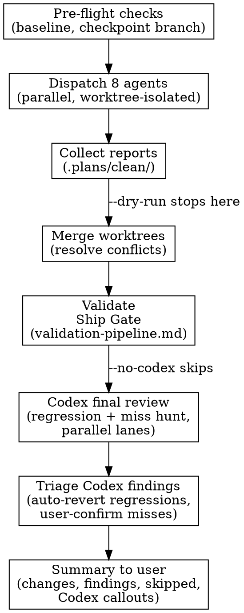

# Clean Skill

Parallel codebase cleanup: 8 focused agents each research, assess, and implement high-confidence improvements. Unlike `/audit` (read-only), `/clean` **transforms code**.

**References**: `CLAUDE.md` and `.claude/context/*.md` for invariants. `/audit` for prior findings.

---

## Activation

| Trigger | Action |
|---------|--------|
| `/clean` | Full 8-agent cleanup + Codex final review |
| `/clean --dry-run` | Research + assessment only, no implementation, no Codex review |
| `/clean --scope shared` | Limit all agents (and Codex review) to one package |
| `/clean --agents 1,3,5` | Run only specific agents by number; Codex review still runs |
| `/clean --no-codex` | Skip the Codex final review pass |

---

## Pre-Flight

Before dispatching agents:

1. **Check for uncommitted work**: `git status` — warn user if dirty
2. **Run baseline**: `bun format && bun lint && bun run test` — capture pass/fail counts
3. **Load prior audit**: `ls -t .plans/audits/*-audit.md | head -1` — feed findings to relevant agents
4. **Create checkpoint branch**: `git switch -c clean/$(date +%Y%m%d-%H%M%S)` from current HEAD
5. **Record checkpoint SHA**: `CHECKPOINT_SHA="$(git rev-parse HEAD)"` — every agent worktree must be based on this exact checkpoint

---

## The 8 Agents

Dispatch ALL agents in parallel using the Agent tool. Each agent runs in `isolation: "worktree"` to avoid conflicts. Each worktree MUST branch from the checkpoint SHA, not `main`, `origin/main`, or the tool's default branch. Each agent follows the same three-phase protocol:

### Worktree Base Invariant

Before an agent starts implementation, verify its worktree base from the orchestrator:

```bash
test "$(git -C "$WORKTREE" merge-base "$CHECKPOINT_SHA" HEAD)" = "$CHECKPOINT_SHA"
```

If any agent worktree fails this check, stop and re-dispatch that agent from the checkpoint. Do not continue a stale-base run by default.

Salvage is allowed only when the human explicitly approves a stale-base salvage after seeing:
- checkpoint SHA and stale worktree SHA
- commit gap (`git rev-list --count "$STALE_BASE..$CHECKPOINT_SHA"`)
- affected file list
- planned validation and conflict audit steps

When stale-base salvage is approved, create `.plans/clean/merge-audit.md` and record every conflict and every dropped/ported agent insight.

### Agent Protocol (all agents)

```
Phase 1: RESEARCH — Scan the entire codebase for instances of the problem
Phase 2: ASSESS   — Write a critical assessment with findings categorized:
                     HIGH-CONFIDENCE (safe to fix), MEDIUM (needs judgment), LOW (risky/unclear)
Phase 3: IMPLEMENT — Fix all HIGH-CONFIDENCE findings. Skip MEDIUM and LOW.
```

Each agent outputs a report at `.plans/clean/agent-{N}-{name}.md` before implementing. In `--dry-run` mode, agents stop after Phase 2.

Every report must include a provenance block:

```md
## Provenance
- checkpoint_sha:
- worktree_base_sha:
- worktree_head_sha:
- merge_base_with_checkpoint:
- stale_base: yes/no
```

Agent missions are short by design — the agents are strong models; give them the lane and the repo-specific rules, not a tutorial. Every agent: respect CLAUDE.md + `.claude/context/*.md` invariants, run `bun run test` in affected packages after implementing.

### Agent 1: Deduplication & DRY

Find and consolidate real duplication (components, logic, utilities, near-identical types). Rules: consolidate only at 3+ duplicates (or 2 nearly identical); consolidated hooks go in `@green-goods/shared`; new shared exports join the barrel; no premature abstractions; preserve existing tests.

### Agent 2: Type Consolidation

Consolidate domain types into shared. Rules: domain types (`Garden`, `Work`, `Action`, `Address`) MUST live in `@green-goods/shared`; `Address` (not `string`) for Ethereum addresses; update all import sites when moving; keep `shared/src/index.ts` barrel exports complete.

### Agent 3: Dead Code Removal (knip)

Remove unused files/exports/types/deps found by `bunx knip --reporter compact`. Rules: trust knip over grep (~80% grep false-positive rate here); verify each finding against dynamic imports, test-only usage, config references, and Envio runtime-imported handlers; never touch `packages/contracts/lib/` (Foundry submodules) or `packages/indexer/generated/`; remove the import AND the file/export together.

### Agent 4: Circular Dependency Resolution (madge)

Zero out cycles from `npx madge --circular --extensions ts,tsx packages/`. Resolution preference: `import type` → extract shared interface → dependency inversion → merge modules. Rules: respect build order `contracts -> shared -> indexer -> client/admin/agent`; never create upward dependencies; hooks stay in shared; `bun build` must pass after.

### Agent 5: Type Strengthening

Replace weak types (`any`, escape-hatch `unknown`, `as` assertions, `@ts-ignore`, compiler-silencing `!`) with real types researched from call sites and library defs (wagmi/viem/EAS). Rules: `unknown` is CORRECT at system boundaries (user input, external APIs, `JSON.parse`); `any` acceptable in complex test mocks; wrap weak library types locally instead of spreading `any`; no new `tsc` errors.

### Agent 6: Defensive Code Removal

Remove error handling that hides failures (empty catches, log-only catches, catch-and-return-default, fake-success paths). KEEP: `parseContractError()` + `USER_FRIENDLY_ERRORS`, `createMutationErrorHandler()` in shared mutation hooks, error boundaries with user feedback, genuine boundary input handling. Rules: never swallow errors in mutation/transaction paths; `logger` from shared, not `console.log`.

### Agent 7: Legacy & Deprecated Code

Remove obsolete paths: `@deprecated` tags, stale TODO/FIXME/HACK, dead feature flags, commented-out blocks, migration shims, long-past version gates. Rules: `git blame` first — understand why it was added; if a TODO references a Linear issue, check whether it's still open; never remove offline-first fallback paths (job queue, IndexedDB persistence, service worker are intentional complexity).

### Agent 8: AI Slop & Comment Cleanup

Remove AI residue: what-comments and code-history comments (keep WHY comments), stub implementations, verbose no-information JSDoc, leftover `console.log` debugging, dead imports, over-engineered single-use wrappers. Edited comments are written for the next developer, not the reviewer.

---

## Orchestration


```dot
digraph clean_flow {
    rankdir=TB;
    preflight [label="Pre-flight checks\n(baseline, checkpoint branch)" shape=box];
    dispatch [label="Dispatch 8 agents\n(parallel, worktree-isolated)" shape=box];
    reports [label="Collect reports\n(.plans/clean/)" shape=box];
    merge [label="Merge worktrees\n(resolve conflicts)" shape=box];
    validate [label="Validate\nShip Gate\n(validation-pipeline.md)" shape=box];
    codex [label="Codex final review\n(regression + miss hunt,\nparallel lanes)" shape=box];
    triage [label="Triage Codex findings\n(auto-revert regressions,\nuser-confirm misses)" shape=box];
    summary [label="Summary to user\n(changes, findings, skipped,\nCodex callouts)" shape=box];

    preflight -> dispatch;
    dispatch -> reports;
    reports -> merge [label="--dry-run stops here"];
    merge -> validate;
    validate -> codex [label="--no-codex skips"];
    codex -> triage;
    triage -> summary;
}
```

### After agents complete:

1. **Collect reports** from `.plans/clean/agent-*.md`
2. **Verify provenance** — each report must show `stale_base: no`; if not, stop for re-dispatch or explicit stale-base salvage approval
3. **Merge worktrees** — if conflicts arise, prefer the agent whose concern is more central (e.g., Agent 2's type move over Agent 1's dedup of that same type), but never apply blanket "take ours" / "take theirs" without a recorded reason
4. **Write merge audit** — if any conflict, stale-base salvage, dropped stash, or no-op cherry-pick occurred, write `.plans/clean/merge-audit.md`
5. **Full validation**: the Ship Gate (`.claude/context/validation-pipeline.md`)
6. **Post-merge residue checks**: `git diff --check`, targeted removed-symbol scans, package `bunx tsc --noEmit`, and `bunx knip --reporter compact` for unused export/dependency drift
7. **Fix regressions** — if tests fail, revert the specific change that broke them
8. **Codex final review** — dispatch the two Codex lanes (see § Codex Final Review). Skipped under `--dry-run` or `--no-codex`.
9. **Triage Codex findings** — auto-revert HIGH-confidence regressions; surface miss-hunt findings to the user, do not auto-apply
10. **Summary** — present to user: files changed, findings per agent, what was skipped (MEDIUM/LOW), Codex callouts, merge-audit callouts

---

### Merge Audit Format

Use this format in `.plans/clean/merge-audit.md` whenever a merge is not a clean fast-forward/cherry-pick with no conflicts:

```md
# Clean Merge Audit

## Base Provenance
- checkpoint_sha:
- expected_base:
- stale_agent_worktrees:

## Conflict Resolutions
| Agent | File | Agent intent | Resolution | Develop already covered it? | Follow-up needed |
|-------|------|--------------|------------|-----------------------------|------------------|

## Auto-Merge / Stash Events
| Event | Files | Action | Residual risk |
|-------|-------|--------|---------------|

## Validation
- command:
- result:
```

For each conflict, inspect the agent diff before resolving. "Ours" is valid only when the checkpoint/develop side already contains the same improvement or the agent hunk is obsolete. If it drops a real cleanup, either port the cleanup immediately or record it as a follow-up in the audit.

### Commit Hygiene

Use source-change subjects only when source changes landed. If an agent's final merged diff is report-only or no-op on the checkpoint branch, use a docs/plans subject such as:

```text
docs(plans): record agent-2 type consolidation no-op
```

Avoid `--no-verify`. If a hook is broken or irrelevant for a docs-only commit, run the equivalent manual checks first (`git diff --check` at minimum), record the reason in the commit body, and prefer a normal verified commit whenever possible.

---

## Codex Final Review

A second-opinion pass after Claude's 8 agents merge and validation passes. Codex sees the **merged result**, not partial agent worktrees, so it can catch regressions and cross-cutting misses that no single agent's lane covered. Skipped in `--dry-run` and `--no-codex`.

### Why Codex (not a 9th Claude agent)

- Codex's structural-review and "promptability" lens is independently validated for cleanup-style work (taxonomy, dead code, naming, file/route alignment).
- Two reviewers with different model biases catch different misses; the merged diff is the natural handoff point.
- Codex is weak at visual/UX judgment — that's why it's the **reviewer**, not an implementer of new style.

### Lanes

Both lanes dispatch via `.claude/scripts/dispatch-codex-lane.sh` against the checkpoint branch (`clean/<timestamp>`), with `--phase regression` and `--phase gap`. Run them in parallel as background bash jobs — they don't share state.

**Lane R — Regression hunt (diff-scoped):**

```
You are reviewing the merged diff between $BASE_BRANCH and HEAD on the clean/* checkpoint
branch. Eight cleanup agents just modified this codebase. Your job is to find any change
that alters runtime behavior, NOT to find new cleanup opportunities.

Scan every hunk and classify:

REGRESSION-HIGH  — Behavior change disguised as a refactor. Examples: removed catch block
                    that was actually load-bearing, changed default arg, narrowed a type
                    that callers relied on, dead-code removal that wasn't actually dead.
REGRESSION-MED   — Plausible behavior change but unclear; needs human eye.
REGRESSION-LOW   — Likely safe but worth flagging (e.g., reordered arguments, renamed
                    public symbol without checking external consumers).
SAFE             — Pure refactor / dedup / type tightening with equivalent semantics.

For each non-SAFE finding, output: file:line, the agent's likely intent, why it might
break, and the smallest revert (specific lines).

Honor these invariants from CLAUDE.md — flag if any agent broke them:
- Hook boundary (all hooks live in @green-goods/shared)
- Barrel imports (no deep paths)
- Address type for Ethereum addresses
- parseContractError() + USER_FRIENDLY_ERRORS for contract errors
- Offline-first fallbacks are intentional, not legacy
- Single root .env (no per-package .env)
```

**Lane G — Miss hunt (codebase-wide):**

```
The 8 cleanup agents have just finished. Their reports are at .plans/clean/agent-*.md.
Your job is to find cleanup opportunities they MISSED, especially issues that don't
fit neatly into a single agent's lane.

Read each agent's report first to understand what was already covered. Then scan for:

CROSS-CUTTING — Issues spanning two or more agent domains (e.g., a duplicated type that
                is also dead, a defensive catch around legacy code).
TAXONOMY      — Inconsistent naming, ambiguous file/folder placement, types/components
                whose names lie about what they do. Use the "promptability" lens: would
                an AI agent looking at this codebase confidently know where to put a new
                feature?
PLACEMENT     — Files in the wrong package (e.g., a hook in client/ that should be in
                shared/, a domain type in admin/ that should be in shared/).
SEAM DRIFT    — Public APIs that have grown asymmetric (one helper does X+Y, its sibling
                only does X), barrel exports that don't match what consumers import.
DOC/CODE DRIFT — Comments, JSDoc, or .claude/context/*.md that contradict the current code.

For each finding, output: location, category, concrete fix, and confidence
(HIGH/MED/LOW). Do NOT modify files. Output is a report only.
```

### Outputs

Each lane writes its `codex-result.md` (per `.codex/output-schema.json`) inside its worktree. After dispatch returns, copy both into `.plans/clean/`:

- `.plans/clean/codex-regression.md`
- `.plans/clean/codex-gap.md`

### Linear follow-up routing

All routing (team, `.plans`/`source:plans`, projects, labels, privacy, prompt-before-create)
follows the shared core: [`.claude/context/linear-routing-rules.md`](../../context/linear-routing-rules.md).
Cleanup-specific delta: mirrored findings come from `.plans/clean/`, which remains the cleanup
execution record.

### Triage rules (Claude reads, decides, acts)

- **REGRESSION-HIGH** → auto-revert the cited lines on the checkpoint branch, then re-run validation. If validation now fails, escalate to user.
- **REGRESSION-MED / -LOW** → list in summary, do not auto-revert.
- **Miss-hunt findings (any confidence)** → never auto-apply. Surface in summary, let user pick which to feed into a follow-up `/clean --agents N` or a manual edit.
- If Codex flags an "agent removed dead code that was actually used" and the test suite still passes, trust the test suite first; surface the finding as REGRESSION-LOW for human review.

### When to skip

Use `--no-codex` when:
- Codex binary is unavailable (no `/Applications/Codex.app/...` or `CODEX` env)
- Network/auth is broken on the codex side
- The user already plans to run a full `/review` on the branch
- Time pressure (Codex review adds ~3-5 min sequential after the parallel agent phase)

---

## Post-Clean Validation

```bash
git diff --check              # Whitespace / conflict marker sanity
bun format && bun lint          # Style
bun run test                    # Correctness
bun build                       # Build integrity
npx madge --circular --extensions ts,tsx packages/  # Zero circular deps
bunx knip --reporter compact    # Reduced dead code
```

All must pass or be explicitly documented as a pre-existing/known false-positive before reporting completion. If any fail, fix or revert. Codex regression-revert (above) runs **before** this final validation, so the post-clean numbers reflect the corrected state.

For symbol-removal agents (dead code, legacy, type consolidation), add targeted scans for every removed public symbol across `packages/`, `docs/`, `.plans/`, and active agent guidance. Source references must be fixed; docs references must either be updated or recorded as intentionally historical.

---

## Safety Rules

- **Checkpoint branch** — always create before any changes
- **Checkpoint base** — every agent worktree must use the checkpoint SHA as its merge base
- **Worktree isolation** — each agent works in its own worktree
- **No stale-base default** — re-dispatch stale worktrees unless the human explicitly approves stale-base salvage
- **Test after implement** — each agent runs `bun run test` in affected packages
- **No cross-agent dependencies** — agents don't depend on each other's output
- **HIGH-confidence only** — agents only implement findings they're confident about
- **Preserve invariants** — all CLAUDE.md rules apply (hook boundary, barrel imports, Address types, single .env)
- **Conflict audit** — every conflict resolution records agent intent, chosen side, and whether any cleanup insight was dropped
- **Never remove offline-first code** — the job queue, IndexedDB persistence, and service worker are intentional complexity
- **Codex reviews the merge, not the worktrees** — dispatch only after merge + validation, so Codex sees the same code the user will ship
- **Codex is read-only by default** — only auto-applies regression-reverts (HIGH); miss-hunt findings always go to the user

---

## Scope Limiting

With `--scope`, all agents restrict their scan to the named package:

```
/clean --scope shared    # Only clean packages/shared
/clean --scope client    # Only clean packages/client
```

With `--agents`, only specified agents run:

```
/clean --agents 3,4,5    # Dead code + circular deps + type strengthening
/clean --agents 8        # Just AI slop cleanup
```

Combine both: `/clean --scope shared --agents 1,2,5`

---

## Anti-Patterns

| Don't | Why |
|-------|-----|
| Run without checkpoint branch | No rollback if agents break things |
| Let agent worktrees branch from main/origin/main | Stale diffs can silently drop or obsolete cleanup on develop |
| Resolve conflicts with blanket "take ours" | Can discard the agent's real cleanup insight without audit |
| Skip `bun run test` validation | Silent regressions |
| Skip `git diff --check` after docs/report commits | Plan-file whitespace and conflict-marker residue can bypass source validation |
| Remove offline-first fallbacks | They're intentional, not legacy |
| Consolidate 2 slightly-different things | Premature abstraction; need 3+ duplicates |
| Use grep to find dead code | ~80% false-positive rate; use knip |
| Remove contracts/lib/ files | Foundry git submodules |
| Remove indexer/generated/ files | Envio generated code |
| Remove catch blocks in contract interactions | They use parseContractError() intentionally |
| Strengthen types in test mocks to exact shapes | Test mocks are intentionally partial |
| Run all 8 agents on a tiny change | Use `--agents` to pick relevant ones |
| Use source-change commit subjects for report-only/no-op merges | Misleads reviewers about what actually landed |
| Auto-apply Codex miss-hunt findings | Need human judgment; surface them, don't merge them |
| Run Codex review before merge/validation | Codex needs to see the merged result, not partial worktrees |
| Use Codex review to vet visual/UX cleanup | Codex is weak at visual judgment — that's a Claude job |

---

## Related Skills

- `audit` — Find problems (read-only). Use when you want a report, not fixes.
- `review` — Review specific changes. Use when reviewing a PR or recent commits.
- `plan` (`teams.md` § Part 11) — canonical reference for the `dispatch-codex-lane.sh` pattern that the Codex final review reuses.

Recommended flow: `audit` -> review findings -> `clean --agents N` targeting specific issues -> Codex final review (built in) -> `review` the changes.
