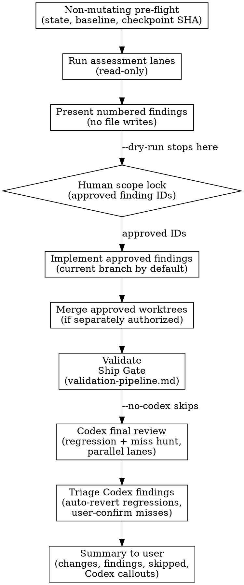

# Clean Skill

Codebase cleanup in two explicit phases: 8 focused lanes assess the code read-only, then the human locks a numbered fix scope before any implementation begins. Unlike `/audit`, `/clean` may transform code, but only inside that approved scope.

**References**: `CLAUDE.md` and `.claude/context/*.md` for invariants. `/audit` for prior findings.

---

## Activation

| Trigger | Action |
|---------|--------|
| `/clean` | Full assessment -> numbered scope lock -> approved implementation -> Codex final review |
| `/clean --dry-run` | Research + assessment only; stop before scope lock or implementation |
| `/clean --scope shared` | Limit all agents (and Codex review) to one package |
| `/clean --agents 1,3,5` | Run only specific agents by number; Codex review still runs |
| `/clean --no-codex` | Skip the Codex final review pass |

---

## Pre-Flight

Before assessment:

1. **Inspect repository state**: `git status --short --branch`. If unrelated or unknown changes overlap the requested scope, stop and surface them; do not format, stash, branch, or edit around them.
2. **Run a non-mutating baseline**: `bun format:check`, `bun lint`, and `bun run test` — capture pass/fail counts without rewriting files.
3. **Load prior accepted findings when requested**: query current Linear issues in the approved scope; do not treat old repo-local reports as a registry.
4. **Stay on the current branch**: never create or switch branches during pre-flight.
5. **Record the assessment base**: `CHECKPOINT_SHA="$(git rev-parse HEAD)"`.

No source, report, branch, worktree, lockfile, or plan mutation is allowed before the human approves the numbered scope lock.

---

## The 8 Agents

Dispatch assessment lanes in parallel only when the user or active agent policy permits subagents. Assessment lanes are read-only and return findings to the lead; they do not create worktrees or report files. After scope lock, implement sequentially on the current branch by default. Isolated worktrees require separate, explicit human approval; when approved, follow [worktree-protocol.md](./worktree-protocol.md) (checkpoint-SHA base invariant, stale-base salvage rules, merge audit) — on any stale base or conflict, stop and show the user.

### Agent Protocol (all agents)

```
Phase 1: RESEARCH — Scan the approved repository scope for instances of the problem
Phase 2: ASSESS   — Return findings categorized as HIGH / MEDIUM / LOW confidence.
                     The lead deduplicates them into a numbered scope-lock proposal.
SCOPE LOCK       — Wait for the human to approve exact finding numbers.
Phase 3: IMPLEMENT — Fix only approved findings. Do not pull in adjacent cleanup.
```

Assessment results stay in the conversation until scope lock. After approval, each
implementation lane returns its approved finding IDs and provenance to the lead. For
plan-backed work, the lead may add a compact result to the existing feature hub's
handoff or report; do not create a generic cleanup-report directory. In `--dry-run`
mode, lanes stop after Phase 2 and do not write files.

Every implementation report records its execution mode plus checkpoint/implementation SHAs — the full provenance block spec lives in [worktree-protocol.md](./worktree-protocol.md).

Agent missions are short by design — the agents are strong models; give them the lane and the repo-specific rules, not a tutorial. Every agent: respect CLAUDE.md + `.claude/context/*.md` invariants, run `bun run test` in affected packages after implementing.

### Agent 1: Deduplication & DRY

Find and consolidate real duplication (components, logic, utilities, near-identical types). Rules: consolidate only at 3+ duplicates (or 2 nearly identical); consolidated hooks go in `@green-goods/shared`; new shared APIs must be added to a declared root or subpath export in `packages/shared/package.json#exports`; no premature abstractions; preserve existing tests.

### Agent 2: Type Consolidation

Consolidate domain types into shared. Rules: domain types (`Garden`, `Work`, `Action`, `Address`) MUST live in `@green-goods/shared`; `Address` (not `string`) for Ethereum addresses; update all import sites when moving; confirm the intended path is declared in `packages/shared/package.json#exports`.

### Agent 3: Dead Code Removal (knip)

Remove unused files/exports/types/deps found by `bunx knip --reporter compact`. Rules: trust knip over grep (~80% grep false-positive rate here); verify each finding against dynamic imports, test-only usage, config references, and Envio runtime-imported handlers; never touch `packages/contracts/lib/` (Foundry submodules) or `packages/indexer/generated/`; remove the import AND the file/export together.

### Agent 4: Circular Dependency Resolution (madge)

Zero out cycles from `npx madge --circular --extensions ts,tsx packages/`. Resolution preference: `import type` → extract shared interface → dependency inversion → merge modules. Rules: respect build order `contracts -> shared -> indexer -> client/admin/agent`; never create upward dependencies; hooks stay in shared; `bun build` must pass after.

### Agent 5: Type Strengthening

Replace weak types (`any`, escape-hatch `unknown`, `as` assertions, `@ts-ignore`, compiler-silencing `!`) with real types researched from call sites and library defs (wagmi/viem/EAS). Rules: `unknown` is CORRECT at system boundaries (user input, external APIs, `JSON.parse`); `any` acceptable in complex test mocks; wrap weak library types locally instead of spreading `any`; no new `tsc` errors.

### Agent 6: Defensive Code Removal

Remove error handling that hides failures (empty catches, log-only catches, catch-and-return-default, fake-success paths). KEEP: `parseContractError()` + `USER_FRIENDLY_ERRORS`, `createMutationErrorHandler()` in shared mutation hooks, error boundaries with user feedback, genuine boundary input handling. Rules: never swallow errors in mutation/transaction paths; `logger` from shared, not `console.log`.

### Agent 7: Legacy & Deprecated Code

Remove obsolete paths: `@deprecated` tags, stale TODO/FIXME/HACK, dead feature flags, commented-out blocks, migration shims, long-past version gates. Rules: `git blame` first — understand why it was added; if a TODO references a Linear issue, check whether it's still open; never remove offline-first fallback paths (job queue, IndexedDB persistence, service worker are intentional complexity).

### Agent 8: AI Slop & Comment Cleanup

Remove AI residue: what-comments and code-history comments (keep WHY comments), stub implementations, verbose no-information JSDoc, leftover `console.log` debugging, dead imports, over-engineered single-use wrappers. Edited comments are written for the next developer, not the reviewer. Judge over-engineering against [`values.md § Implementation Quality Contract`](../../context/values.md) rather than restating principles.

---

## Orchestration


```dot
digraph clean_flow {
    rankdir=TB;
    preflight [label="Non-mutating pre-flight\n(state, baseline, checkpoint SHA)" shape=box];
    dispatch [label="Run assessment lanes\n(read-only)" shape=box];
    reports [label="Present numbered findings\n(no file writes)" shape=box];
    scope [label="Human scope lock\n(approved finding IDs)" shape=diamond];
    implement [label="Implement approved findings\n(current branch by default)" shape=box];
    merge [label="Merge approved worktrees\n(if separately authorized)" shape=box];
    validate [label="Validate\nShip Gate\n(validation-pipeline.md)" shape=box];
    codex [label="Codex final review\n(regression + miss hunt,\nparallel lanes)" shape=box];
    triage [label="Triage Codex findings\n(auto-revert regressions,\nuser-confirm misses)" shape=box];
    summary [label="Summary to user\n(changes, findings, skipped,\nCodex callouts)" shape=box];

    preflight -> dispatch;
    dispatch -> reports;
    reports -> scope [label="--dry-run stops here"];
    scope -> implement [label="approved IDs"];
    implement -> merge;
    merge -> validate;
    validate -> codex [label="--no-codex skips"];
    codex -> triage;
    triage -> summary;
}
```

### After assessment:

1. **Deduplicate findings** and validate each against current source.
2. **Present numbered findings** with evidence, risk, smallest fix, and explicit out-of-scope boundaries.
3. **Wait for scope lock**. The human must approve exact finding IDs before implementation.
4. **Stop in dry-run mode** without writing reports or changing repository state.

### After approved implementation:

1. **Collect implementation results** from the lanes/session, each tied to approved finding IDs.
2. **When worktrees were authorized**, verify provenance, merge, and write the merge audit per [worktree-protocol.md](./worktree-protocol.md); skip for current-branch execution.
3. **Run the non-mutating Review Readiness Gate** from `.claude/context/validation-pipeline.md`. Run the mutating Ship Gate only when the user separately requests ship, PR, commit, merge, or release readiness and its pre-flight passes.
4. **Run residue checks**: `git diff --check`, targeted removed-symbol scans, package TypeScript checks, and locally installed `knip` for unused export/dependency drift.
5. **Revert only the specific approved change** if it caused a regression; do not fix unrelated failures.
6. **Run the Codex final review** unless `--no-codex`; never auto-apply miss-hunt findings.
7. **Summarize** files changed, approved finding IDs, validation, skipped findings, and merge-audit or review callouts.

---

### Commit Hygiene

Use source-change subjects only when source changes landed. A report-only or no-op
lane is summarized to the user and does not earn a repository commit.

Avoid `--no-verify`. If a hook is broken or irrelevant for a docs-only commit, run the equivalent manual checks first (`git diff --check` at minimum), record the reason in the commit body, and prefer a normal verified commit whenever possible.

---

## Codex Final Review

A second-opinion pass after Claude's 8 agents merge and validation passes. Codex sees the **merged result**, not partial agent worktrees, so it can catch regressions and cross-cutting misses that no single agent's lane covered. Skipped in `--dry-run` and `--no-codex`.

### Why Codex (not a 9th Claude agent)

- Codex's structural-review and "promptability" lens is independently validated for cleanup-style work (taxonomy, dead code, naming, file/route alignment).
- Two reviewers with different model biases catch different misses; the merged diff is the natural handoff point.
- Codex is weak at visual/UX judgment — that's why it's the **reviewer**, not an implementer of new style.

### Lanes

Both lanes dispatch via `.claude/scripts/dispatch-codex-lane.sh` against the approved implementation head. Lane R uses `--branch chore/cleanup-regression-review`; Lane G uses `--branch chore/cleanup-gap-review`. Use worktree-backed lanes only when branch/worktree creation was explicitly approved.

The verbatim lane prompts (Lane R — regression hunt, diff-scoped; Lane G — miss hunt,
codebase-wide) live in [codex-prompts.md](./codex-prompts.md) — load them at dispatch time,
not on every activation.

### Outputs

Each lane writes its `codex-result.md` (per `.codex/output-schema.json`) inside its
temporary worktree. Read those results into the session after dispatch; do not copy
them into the repository. Remove the temporary worktrees after the result has been
integrated, unless the user asked to preserve them for debugging.

### Linear follow-up routing

All routing (team, `.plans`/`source:plans`, projects, labels, privacy, prompt-before-create)
follows the shared core: [`.claude/context/linear-routing-rules.md`](../../context/linear-routing-rules.md).
Cleanup-specific delta: accepted findings are tracked in Linear after user approval;
Git/PR history is the implementation record. Do not create a parallel cleanup registry
under `.plans/`.

### Triage rules (Claude reads, decides, acts)

- **REGRESSION-HIGH** → revert only the cited approved lines at the implementation head, then re-run validation. If validation now fails, escalate to user.
- **REGRESSION-MED / -LOW** → list in summary, do not auto-revert.
- **Miss-hunt findings (any confidence)** → never auto-apply. Surface in summary, let user pick which to feed into a follow-up `/clean --agents N` or a manual edit.
- If Codex flags an "agent removed dead code that was actually used" and the test suite still passes, trust the test suite first; surface the finding as REGRESSION-LOW for human review.

### When to skip

Use `--no-codex` when:
- Codex binary is unavailable (no `/Applications/Codex.app/...` or `CODEX` env)
- Network/auth is broken on the codex side
- The user already plans to run a full `/review` on the branch
- Time pressure (Codex review adds ~3-5 min sequential after the parallel agent phase)

---

## Post-Clean Validation

```bash
git diff --check                # Whitespace / conflict marker sanity
bun format:check && bun lint    # Non-mutating style gate
bun run test                    # Correctness
bun build                       # Build integrity
madge --circular --extensions ts,tsx packages/  # Only when locally installed or explicitly approved
bunx knip --reporter compact    # Checked-in dependency; reduced dead code
```

Required checks must pass or be explicitly documented as a pre-existing failure before reporting completion. Optional tooling that is not installed is `UNAVAILABLE`, not permission to install it. If an approved change causes a failure, fix or revert that change. Codex regression-revert (above) runs **before** this final validation, so the post-clean numbers reflect the corrected state.

For symbol-removal agents (dead code, legacy, type consolidation), add targeted scans for every removed public symbol across `packages/`, `docs/`, `.plans/`, and active agent guidance. Source references must be fixed; docs references must either be updated or recorded as intentionally historical.

---

## Safety Rules

- **Current branch safety** — never create or switch branches unless the human explicitly requests it
- **Scope lock** — no source/report/worktree mutation before exact finding IDs are approved
- **Checkpoint base** — every agent worktree must use the checkpoint SHA as its merge base
- **Worktree authorization** — use isolated worktrees only after explicit human approval; otherwise implement sequentially on the current branch
- **No stale-base default** — re-dispatch stale worktrees unless the human explicitly approves stale-base salvage
- **Test after implement** — each agent runs `bun run test` in affected packages
- **No cross-agent dependencies** — agents don't depend on each other's output
- **HIGH-confidence only** — agents only implement findings they're confident about
- **Preserve invariants** — all CLAUDE.md rules apply (hook boundary, declared public imports, Address types, single .env)
- **Conflict audit** — every conflict resolution records agent intent, chosen side, and whether any cleanup insight was dropped
- **Never remove offline-first code** — the job queue, IndexedDB persistence, and service worker are intentional complexity
- **Codex reviews the integrated result** — dispatch only after implementation + validation, so Codex sees the same code the user will ship
- **Codex is read-only by default** — only auto-applies regression-reverts (HIGH); miss-hunt findings always go to the user

---

## Scope Limiting

With `--scope`, all agents restrict their scan to the named package:

```
/clean --scope shared    # Only clean packages/shared
/clean --scope client    # Only clean packages/client
```

With `--agents`, only specified agents run:

```
/clean --agents 3,4,5    # Dead code + circular deps + type strengthening
/clean --agents 8        # Just AI slop cleanup
```

Combine both: `/clean --scope shared --agents 1,2,5`

---

## Anti-Patterns

| Don't | Why |
|-------|-----|
| Create or switch branches before explicit approval | Violates shared-tree safety and mutates state before scope lock |
| Write assessment reports before scope lock | Read-only assessment must not mutate the repository |
| Install missing audit tools implicitly | Supply-chain changes require explicit approval |
| Let agent worktrees branch from main/origin/main | Stale diffs can silently drop or obsolete cleanup on develop |
| Resolve conflicts with blanket "take ours" | Can discard the agent's real cleanup insight without audit |
| Skip `bun run test` validation | Silent regressions |
| Skip `git diff --check` after docs/report commits | Plan-file whitespace and conflict-marker residue can bypass source validation |
| Remove offline-first fallbacks | They're intentional, not legacy |
| Consolidate 2 slightly-different things | Premature abstraction; need 3+ duplicates |
| Use grep to find dead code | High false-positive rate here; use knip (Agent 3) |
| Remove contracts/lib/ files | Foundry git submodules |
| Remove indexer/generated/ files | Envio generated code |
| Remove catch blocks in contract interactions | They use parseContractError() intentionally |
| Strengthen types in test mocks to exact shapes | Test mocks are intentionally partial |
| Run all 8 agents on a tiny change | Use `--agents` to pick relevant ones |
| Use source-change commit subjects for report-only/no-op merges | Misleads reviewers about what actually landed |
| Auto-apply Codex miss-hunt findings | Need human judgment; surface them, don't merge them |
| Run Codex review before merge/validation | Codex needs to see the merged result, not partial worktrees |
| Use Codex review to vet visual/UX cleanup | Codex is weak at visual judgment — that's a Claude job |

---

## Related Skills

- `audit` — Find problems (read-only). Use when you want a report, not fixes.
- `review` — Review specific changes. Use when reviewing a PR or recent commits.
- `plan` (`teams.md` § Part 11) — canonical reference for the `dispatch-codex-lane.sh` pattern that the Codex final review reuses.

Recommended flow: `clean` assessment -> approve numbered finding IDs -> targeted implementation -> Codex final review -> `review` the changes.
