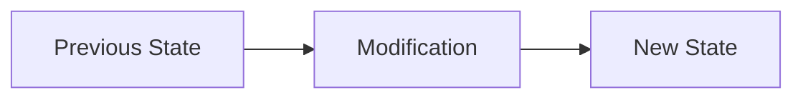

# Code Review Skill

Ultra-critical, multi-pass code review designed to identify and prevent runtime failures, architectural problems, and code quality issues before merge.

## Activation

Use when:
- Reviewing PRs before merge
- After completing implementation
- User requests `/code-review`
- Part of 4-step-program workflow

## Core Principle

> YOU DO NOT LET THINGS SLIP. YOU DESIRE ONLY PERFECTION.
> Your reputation depends on what you catch AND what you miss.

## 6-Pass Protocol

### Pass 0: Change Explanation

Document the changes:
- What was modified
- Why it was modified
- Impact on system behavior

Create Mermaid diagram showing:


### Pass 0.5: Issue Coverage Verification (MANDATORY)

Before technical review:
1. Read the original issue/task
2. Extract EVERY requirement
3. Create coverage table:

| Requirement | Implementation | Status |
|-------------|----------------|--------|
| User can X | `file.ts:42` | DONE |
| API returns Y | Missing | NOT DONE |

**If coverage < 100%: STOP. Request changes immediately.**

### Pass 1: Technical Issues

Hunt for runtime/compile failures:
- Type errors
- Null/undefined handling
- Missing error handling
- API contract violations
- Race conditions
- Memory leaks

### Pass 2: Code Consistency

Check patterns:
- Follows existing codebase style
- Dead code introduced
- Duplicate logic
- Naming conventions
- Import organization

### Pass 3: Architecture & Refactoring

Evaluate:
- Proper abstractions
- Dependency direction
- Layer violations
- Coupling/cohesion
- Green Goods conventions:
  - Hooks in shared package only
  - No package-specific .env
  - Contract addresses from artifacts

### Pass 4: Environment Compatibility

Verify:
- Platform compatibility
- Dependency versions
- Configuration changes
- Browser support (PWA)
- Offline behavior impact

### Pass 5: Verification Strategy

Propose specific commands:
```bash
# Type check
bun run tsc --noEmit

# Lint
bun lint

# Tests
bun test

# Build
bun build

# Green Goods specific
bash .claude/scripts/validate-hook-location.sh
node .claude/scripts/check-i18n-completeness.js
```

### Pass 6: Context Synthesis

Create final summary:
- Overall assessment
- Categorized findings by severity
- Recommendation: APPROVE or REQUEST CHANGES

## Output Format

```markdown
## Code Review: [PR Title]

### Change Explanation
[Summary with Mermaid diagram]

### Issue Coverage
| Requirement | Status |
|-------------|--------|
[Table]

Coverage: X/Y (Z%)

### Suggest Fixing

#### Critical (Blocking)
- [Issue] - `file.ts:123` - [Fix suggestion]

#### High Priority
- [Issue] - `file.ts:456` - [Fix suggestion]

#### Medium Priority
- [Issue] - `file.ts:789` - [Fix suggestion]

### Possible Simplifications
- [Suggestion 1]
- [Suggestion 2]

### Consider Asking User
- [Clarification needed]

### Suggested Checks
```bash
[Commands to run]
```

### Task Summary
**Recommendation**: [APPROVE / REQUEST CHANGES]
**Reason**: [Explanation]
```

## Mandatory GitHub Posting

> Every code review MUST be posted to GitHub as a PR comment.
> This is NOT optional.

```bash
gh pr comment [PR_NUMBER] --body "[review content]"
```

## Final Coverage Gate

Before approving:

| Requirement | File:Line | Verified |
|-------------|-----------|----------|
| [Req 1] | `file.ts:42` | ✓ |
| [Req 2] | `file.ts:89` | ✓ |

**ANY COVERAGE BELOW 100% → DO NOT APPROVE**
**ANY SCORE BELOW 10/10 → DO NOT APPROVE**

## Parallel Review Mode

For high-stakes reviews, launch N reviewers:
```
code-review-3: Launch 3 parallel reviewers
code-review-6X: Launch 6 parallel reviewers
```

Each reviews independently, then synthesize findings.

## Key Rules

- Use absolute counts, never percentages for issues
- Cite specific file:line for every finding
- Include fix suggestions, not just problems
- Never approve with unresolved CRITICAL/HIGH
- Post to GitHub, not just local output
