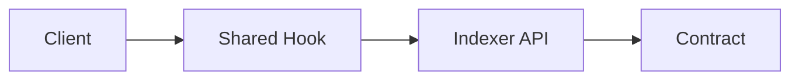

# Create Pull Request Skill

Create pull requests with mandatory issue linking using GitHub's auto-close keywords.

## Activation

Use when:
- Ready to submit changes for review
- User requests `/pr`
- After completing implementation

## Key Requirement

**Every PR MUST link to related issues and use closing keywords.**

## Process

### Step 1: Identify Related Issues

```bash
# List open issues
gh issue list --state open

# Search by keyword
gh issue list --search "keyword"

# Check branch name for hints
git branch --show-current
```

### Step 2: Gather Context

```bash
# View commits on branch
git log main..HEAD --oneline

# View full diff
git diff main...HEAD

# Check files changed
git diff main...HEAD --stat
```

### Step 3: Determine Closing Keywords

Use these keywords to auto-close issues on merge:
- `Closes #123`
- `Fixes #123`
- `Resolves #123`

For related but not closing:
- `Related to #123`
- `See #123`

### Step 4: Create PR

Use this template structure:

```bash
gh pr create --title "feat(package): brief description" --body "$(cat <<'EOF'
## Summary
Brief description of what this PR does.

## Key Changes
- Change 1
- Change 2
- Change 3

## Related Issues
Closes #123
Fixes #456

## Testing
- [ ] TypeScript passes (`bun run tsc --noEmit`)
- [ ] Linting passes (`bun lint`)
- [ ] Tests pass (`bun test`)
- [ ] Build succeeds (`bun build`)

## Screenshots (if UI changes)
[Add screenshots]

## Checklist
- [ ] Conventional commit format
- [ ] i18n for UI strings
- [ ] Hooks in shared package only
- [ ] No hardcoded contract addresses
EOF
)"
```

### Step 5: Verify Links

```bash
gh pr view --json closingIssuesReferences
```

## PR Title Format (Conventional Commits)

```
<type>(<scope>): <description>

Types:
- feat: New feature
- fix: Bug fix
- docs: Documentation only
- style: Formatting, no code change
- refactor: Code restructuring
- perf: Performance improvement
- test: Adding tests
- chore: Maintenance tasks

Scopes (Green Goods):
- client: PWA client
- admin: Admin dashboard
- shared: Shared package
- contracts: Smart contracts
- indexer: Envio indexer
- agent: Bot agent
```

## Mermaid Diagrams (When Helpful)

Include diagrams for:
- Authentication flows
- Data transformations
- Component interactions
- Architecture changes

Example:
```markdown
## Architecture


```

## Anti-Patterns to Avoid

- PRs without issue references
- Using "Related:" instead of closing keywords
- Omitting testing checklist
- Missing type/scope in title
- Hardcoded values in PR

## Green Goods Specific

1. **Check hook location** before PR:
   ```bash
   bash .claude/scripts/validate-hook-location.sh
   ```

2. **Check i18n completeness**:
   ```bash
   node .claude/scripts/check-i18n-completeness.js
   ```

3. **Verify contract artifacts** (if contracts changed):
   ```bash
   cd packages/contracts && bun build
   ```

## Output

After creating PR:
1. Display PR URL
2. Show linked issues
3. Remind to request review
