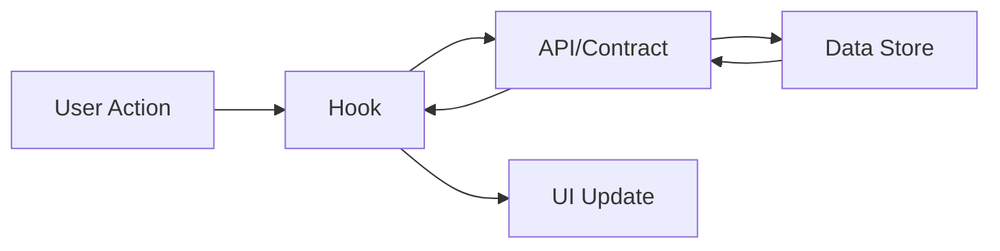
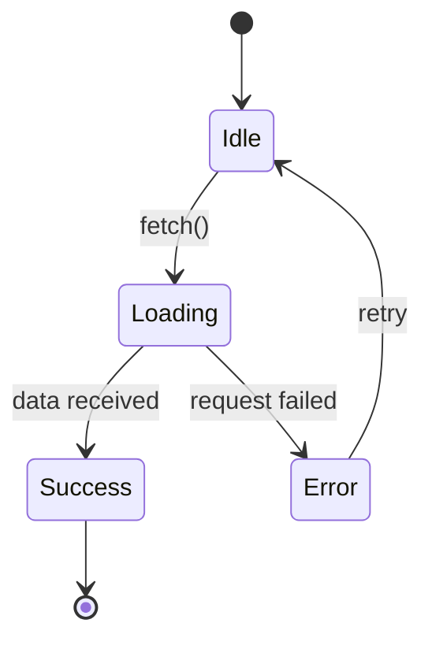
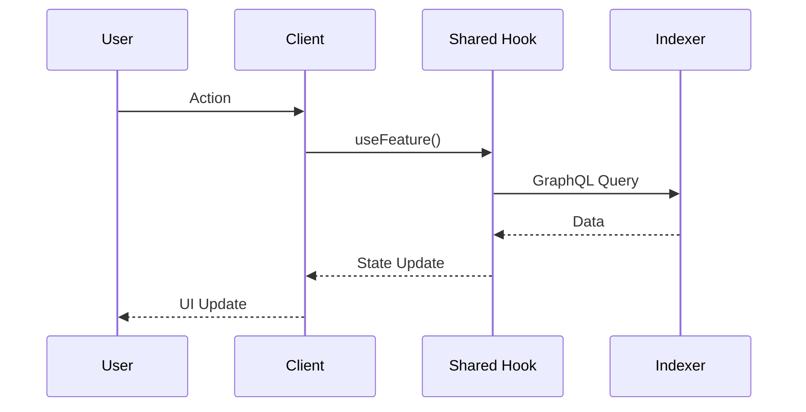

# GitHub Ticket Skill (Enhanced)

Create context-rich GitHub issues that integrate with org templates and AI workflows.

## Activation

Use when:
- Creating new GitHub issues
- User requests `/ticket` or "create an issue"
- After investigation/debugging sessions
- Documenting bugs or features
- Capturing findings that need follow-up

## Core Principle

> The moment you decide to create a ticket, you have MAXIMUM CONTEXT.
> Capture it NOW before it fades. Let AI do the heavy lifting.

## Quick Reference

| Command | Template | Labels | Use For |
|---------|----------|--------|---------|
| `/ticket bug` | Bug Report | `bug`, `triage` | Bug reports with reproduction steps |
| `/ticket feature` | Feature Request | `enhancement` | Simple features (1-2 packages) |
| `/ticket feature --complete` | Feature Complete | `enhancement` | **AI-buildable specs** (3+ packages) |
| `/ticket task` | Engineering Task | `task` | Specific engineering work |
| `/ticket contract` | Smart Contract | `contract` | Contract creation/modification |
| `/ticket hook` | Shared Hook | `component`, `shared` | New hooks in shared package |
| `/ticket story` | User Story | `story` | Product-focused user stories |
| `/ticket spike` | Investigation | `spike` | Research with timebox |

### AI-Buildable Feature Tickets

Use `--complete` flag for features that:
- Span 3+ packages (client, shared, contracts, indexer)
- Require offline support
- Will be assigned to AI agents
- Need complex state management

The complete template includes:
- Testable acceptance criteria (Given/When/Then)
- Full hook API contracts with TypeScript
- GraphQL schema additions
- Test specifications with fixtures
- Error handling matrix
- Offline implementation patterns
- AI self-verification checklist

---

## Workflow

### Step 1: Detect Issue Type

Automatically determine from conversation context:

| Detected Context | Type | Template |
|------------------|------|----------|
| Error, exception, "not working" | Bug | `bug.yml` |
| "add", "implement", "new feature" | Feature | `feature.md` |
| Complex feature (3+ packages, AI agent, offline) | Feature Complete | `feature-complete.md` |
| UI work, component creation | Component | `hook.yml` |
| Contract, Solidity, upgrade | Contract | `contract.yml` |
| Refactor, cleanup, technical debt | Task | `task.yml` |
| "investigate", "research", "spike" | Spike | `spike.yml` |
| User journey, acceptance criteria | Story | `story.yml` |

### Step 1.5: Feature Complexity Check

For feature requests, assess complexity to choose template:

```
Is this feature...?
├── Spanning 3+ packages → Use feature-complete.md
├── Requiring offline support → Use feature-complete.md
├── Being assigned to AI agent → Use feature-complete.md
├── Needing complex state management → Use feature-complete.md
└── Simple (1-2 packages, online-only) → Use feature.md
```

**Feature Complete template includes:**
- Testable acceptance criteria (Given/When/Then tables)
- Full TypeScript API contracts for hooks
- GraphQL schema additions for indexer
- Complete test specifications with fixtures
- Error handling matrix with codes and messages
- Offline job queue implementation patterns
- AI self-verification checklist

### Step 2: Gather Codebase Context

```bash
# Identify affected packages from recent work
git diff --stat HEAD~5 | grep packages/

# Find related files by keyword
grep -r "keyword" packages/*/src --include="*.ts" -l | head -10

# Check existing patterns for reference
ls packages/shared/src/hooks/

# Get recent commits for context
git log --oneline -5
```

### Step 3: Auto-Detect Package Labels

Map file paths to labels:

| Path Pattern | Label |
|--------------|-------|
| `packages/client/*` | Add label: (none - implied) |
| `packages/admin/*` | Add label: (none - implied) |
| `packages/shared/*` | Add label: (none - implied) |
| `packages/contracts/*` | Add label: `contract` |
| `packages/indexer/*` | Add label: `api` |
| `packages/agent/*` | Add label: (none - implied) |
| `docs/*` | Add label: `documentation` |

### Step 4: Build Issue Content

#### For Bug Reports
```markdown
## Bug Description
[Clear description from investigation]

## Steps to Reproduce
1. [Step from debugging session]
2. [Step 2]
3. [Step 3]

## Expected Behavior
[What should happen]

## Current Behavior
[What actually happens]

## Environment
- Package: [detected from files]
- Browser/OS: [if known]
- Offline Related: [Yes/No]

## AI Investigation Notes

### Files Analyzed
- `packages/[package]/src/[file].ts` - [what was found]

### Error Details
```
[Error message/stack trace if available]
```

### Relevant Code
```typescript
// Code snippet from investigation
```

### Root Cause Analysis
[What was discovered during investigation]

### Suggested Fix
[If fix approach is known]
```

#### For Feature Requests
```markdown
## Problem Statement
As a [user type], I want to [action] so that [benefit].

## Proposed Solution
[Description of solution]

## Acceptance Criteria
- [ ] Criterion 1
- [ ] Criterion 2
- [ ] Criterion 3

## AI Implementation Notes

### Suggested Approach
1. [Step 1]
2. [Step 2]
3. [Step 3]

### Files to Create/Modify
- [ ] `packages/shared/src/hooks/use[Feature].ts` - New hook
- [ ] `packages/client/src/views/[Feature]/index.tsx` - New view
- [ ] `packages/shared/src/stores/[feature]Store.ts` - If state needed

### Pattern Reference
See `packages/shared/src/hooks/useGarden.ts` for similar implementation

### Dependencies
- @tanstack/react-query for data fetching
- Zustand for local state (if needed)

### Offline Consideration
- [ ] Not applicable
- [ ] Queue for sync when online
- [ ] Full offline support with IndexedDB
```

#### For Engineering Tasks
```markdown
## Summary
[What needs to be done]

## Done State
- [ ] Task 1 completed
- [ ] Task 2 completed
- [ ] Tests added/updated
- [ ] Documentation updated (if needed)

## Technical Requirements
- [Requirement 1]
- [Requirement 2]

## AI Implementation Notes

### Files to Modify
- `packages/[package]/src/[file].ts` - [what to change]

### Existing Patterns
See `packages/[package]/src/[reference].ts` for example

### Testing Strategy
```bash
cd packages/[package] && bun test [file]
```

## Resources
- [Related docs](link)
- Related to #[issue]
```

#### For Smart Contracts
```markdown
## Summary
[Contract work description]

## Done State
- [ ] Contract implemented/modified
- [ ] Unit tests (100% coverage)
- [ ] Fuzz tests for parameters
- [ ] Gas snapshot updated
- [ ] NatSpec documentation complete
- [ ] Security checklist verified

## Security Checklist
- [ ] CEI pattern followed
- [ ] Reentrancy guards where needed
- [ ] Access control on state-changing functions
- [ ] Events emitted for state changes
- [ ] No tx.origin for authorization
- [ ] Input validation

## Upgrade Impact
- [ ] New contract (no upgrade)
- [ ] Safe upgrade (storage compatible)
- [ ] Breaking change (migration needed)

## AI Implementation Notes

### Contract Location
`packages/contracts/src/[path]/[Contract].sol`

### Inheritance
- Extends: [OpenZeppelin contracts, etc.]
- Interfaces: [IContract]

### Testing
```bash
cd packages/contracts && forge test --match-contract [TestContract] -vvv
```

### Gas Considerations
[Any gas optimization notes]
```

#### For Shared Hooks
```markdown
## Hook Name
`use[FeatureName]`

## Purpose
[What this hook does]

## API Design
```typescript
function use[Feature](options?: {
  // options
}): {
  data: [Type] | undefined;
  isLoading: boolean;
  error: Error | null;
  // other returns
}
```

## Done State
- [ ] Hook implemented in `packages/shared/src/hooks/`
- [ ] TypeScript types exported
- [ ] Unit tests (80%+ coverage)
- [ ] Re-exported from package index
- [ ] Used in at least one view

## AI Implementation Notes

### Data Source
- [ ] GraphQL (Indexer)
- [ ] Contract Read
- [ ] IndexedDB / Local Storage
- [ ] Zustand Store
- [ ] Computed

### Pattern Reference
Follow `packages/shared/src/hooks/useGarden.ts`

### TanStack Query Integration
- Query key: `['[feature]', id]`
- Stale time: [appropriate duration]

### Testing
```bash
cd packages/shared && bun test use[Feature]
```
```

### Step 5: Green Goods Compliance

Always include for Green Goods issues:

```markdown
## Compliance Checklist
- [ ] Hooks in `@green-goods/shared` only (if new hook)
- [ ] i18n keys added to en.json, es.json, pt.json (if new UI strings)
- [ ] No hardcoded contract addresses (use deployment artifacts)
- [ ] Tests meet coverage targets (Client/Admin: 70%, Shared: 80%, Contracts: 100%)
- [ ] Follows existing patterns in codebase
```

### Step 6: Create the Issue

```bash
# Write issue body to temp file
cat << 'EOF' > /tmp/issue-body.md
[Generated issue content]
EOF

# Create issue with appropriate template labels
gh issue create \
  --repo greenpill-dev-guild/green-goods \
  --title "[TYPE]: Brief description" \
  --label "label1,label2" \
  --body-file /tmp/issue-body.md

# Add to Green Goods project board
gh project item-add 4 --owner greenpill-dev-guild --url [issue-url]
```

### Step 7: Verify & Report

After creating:
1. ✅ Display issue URL
2. 📋 Show issue number
3. 🏷️ List labels applied
4. 📊 Confirm project board addition
5. 🔗 Note any related issues

---

## Mermaid Diagrams

Include diagrams for complex flows:

### Architecture Diagram
```markdown

```

### State Flow Diagram
```markdown

```

### Sequence Diagram
```markdown

```

---

## Available Labels

### Type Labels
- `bug` - Something isn't working
- `enhancement` - New feature or request
- `task` - General engineering task
- `story` - User story
- `spike` - Research/investigation

### Package Labels
- `contract` - Smart contract work
- `api` - Indexer/API work
- `component` - UI component
- `design` - Design needed
- `documentation` - Docs updates

### Status Labels
- `triage` - Needs review
- `good first issue` - Good for newcomers
- `help wanted` - Extra attention needed

---

## Quality Checklist

Before creating ticket:
- [ ] Summary is clear and specific
- [ ] Context explains why this matters
- [ ] Acceptance criteria are verifiable
- [ ] AI notes include file paths and patterns
- [ ] Compliance checklist included
- [ ] Related issues linked
- [ ] Appropriate labels selected
- [ ] Diagrams added for complex flows

---

## Examples

### Quick Bug Ticket
```bash
/ticket bug "Login button not responding on mobile Safari"
```

### Quick Feature Ticket
```bash
/ticket feature "Add dark mode toggle to settings" --package client,shared
```

### Quick Task Ticket
```bash
/ticket task "Refactor useGarden hook to use new GraphQL schema"
```

### Contract Ticket
```bash
/ticket contract "Add batch approval function to WorkApproval resolver"
```

---

## Output Format

```
✅ Issue created successfully!

📋 Issue: #265
🔗 URL: https://github.com/greenpill-dev-guild/green-goods/issues/265
🏷️ Labels: bug, triage
📊 Added to: Green Goods project board

🔗 Related Issues:
- #123 - Similar bug reported
- #200 - Parent feature
```
