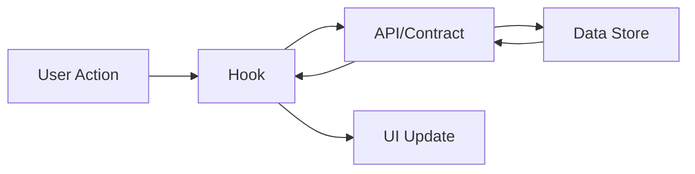
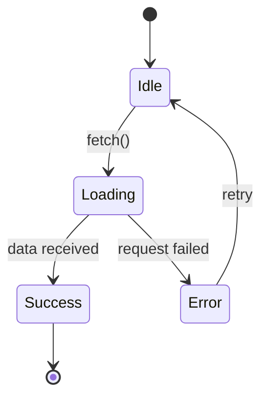
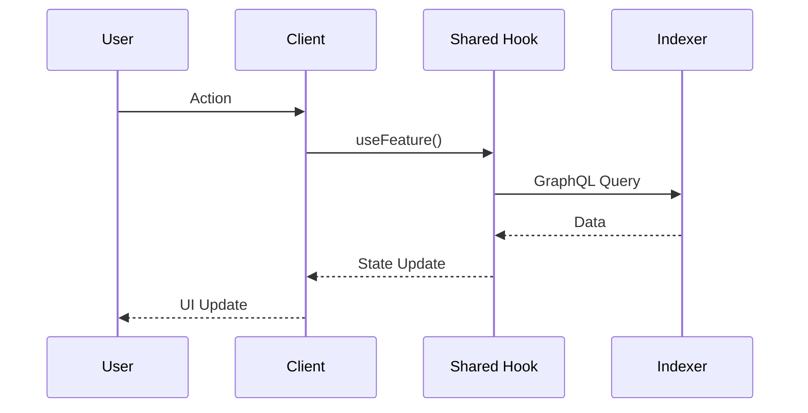
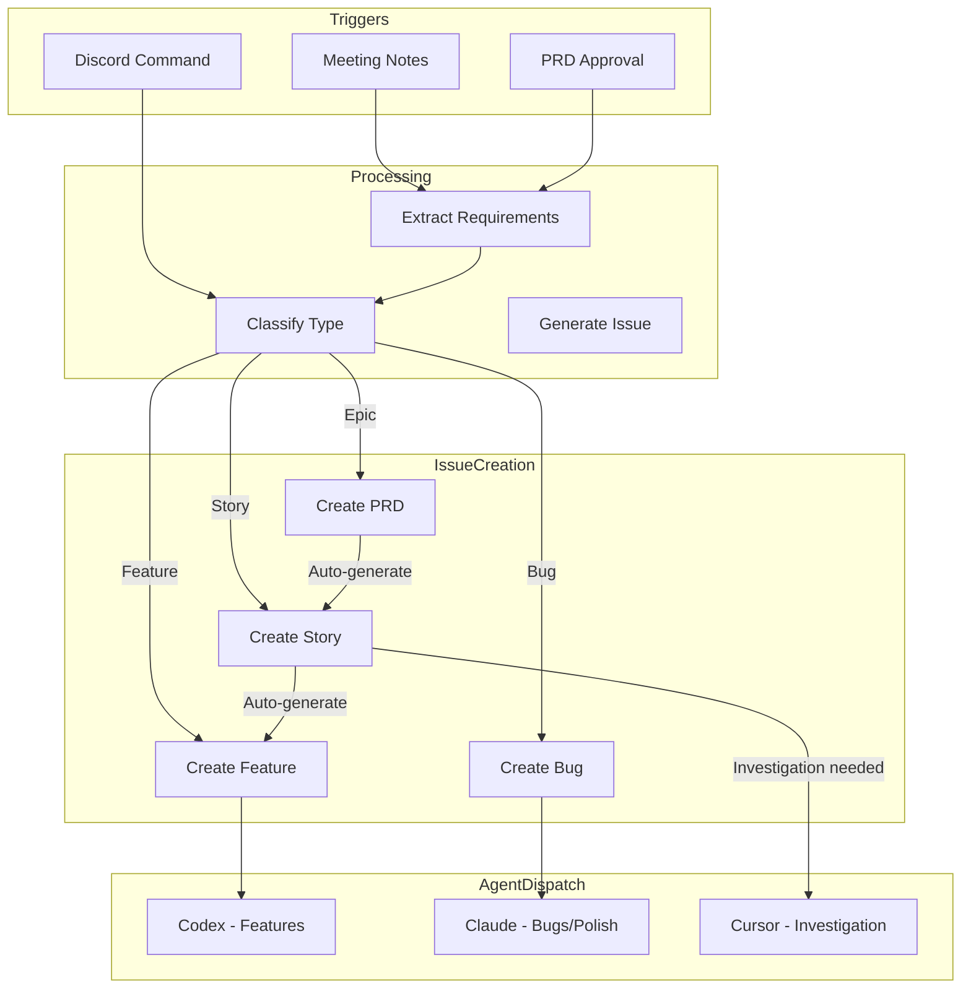

# GitHub Ticket Skill (Enhanced)

Create context-rich GitHub issues that integrate with org templates and AI workflows.

## Activation

Use when:
- Creating new GitHub issues
- User requests `/ticket` or "create an issue"
- After investigation/debugging sessions
- Documenting bugs or features
- Capturing findings that need follow-up

## Core Principle

> The moment you decide to create a ticket, you have MAXIMUM CONTEXT.
> Capture it NOW before it fades. Let AI do the heavy lifting.

## Document Ecosystem

Documents are stored in your **database + docs system** and **referenced** in GitHub issues.

| Document | Cadence | Storage | GitHub |
|----------|---------|---------|--------|
| **PRD** | Quarterly | Database + Docs | Epic (reference) |
| **Feature Spec** | Per PRD feature | Database + Docs | Story (linked) |
| **Tech Spec** | Per feature | Database + Docs | Story (linked) |
| **QA Test Cases** | Per feature | Database + Docs | Story (checklist) |
| **GTM** | Per launch | Database + Docs | Milestone |

## Issue Hierarchy

```
PRD (Quarterly)              → Database + Docs
  └── Epic Issue             → GitHub reference to PRD
      │
      └── Feature Spec       → Database + Docs
          └── Story Issue    → GitHub (links to specs)
              │
              ├── Tech Spec  → Database + Docs (linked)
              ├── QA Cases   → Database + Docs (linked)
              │
              └── Tasks      → GitHub Issues
                  ├── [FEATURE] Implementation
                  ├── [POLISH] Refinement
                  ├── [DOCS] Documentation
                  └── [BUG] Defect
```

### Hierarchy Relationships

| Relationship | Example | Linking |
|--------------|---------|---------|
| PRD → Epic | PRD doc → Epic #100 | `--prd-url {url}` |
| Epic → Stories | Epic #100 → Stories #101, #102 | `--epic #100` |
| Feature Spec → Story | Spec doc → Story #101 | `--spec-url {url}` |
| Tech Spec → Story | Tech doc → Story #101 | `--tech-spec-url {url}` |
| Story → Tasks | Story #101 → Tasks #102, #103 | `--story #101` |

---

## Quick Reference

### Epic & Story Commands (Linked to Docs)

| Command | Labels | Use For |
|---------|--------|---------|
| `/ticket epic --prd-url {url}` | `epic`, `prd`, `Q{N}` | Create epic referencing quarterly PRD |
| `/ticket story --epic #N --spec-url {url}` | `story` | Story for feature spec implementation |
| `/ticket story --epic #N --spec-url {url} --tech-spec-url {url}` | `story` | Story with tech spec |

### Task Commands (Under Stories)

| Command | Labels | Use For |
|---------|--------|---------|
| `/ticket feature --story #N` | `task`, `feature` | Feature implementation task |
| `/ticket feature --story #N --complete` | `task`, `feature` | **AI-buildable** feature task |
| `/ticket polish --story #N` | `task`, `polish` | UI/UX refinement task |
| `/ticket docs --story #N` | `task`, `documentation` | Documentation task |
| `/ticket bug --story #N` | `bug` | Bug related to story |
| `/ticket bug` | `bug`, `triage` | Standalone bug report |

### Specialized Commands

| Command | Labels | Use For |
|---------|--------|---------|
| `/ticket contract --story #N` | `task`, `contract` | Smart contract work |
| `/ticket hook --story #N` | `task`, `component`, `shared` | New hook in shared package |
| `/ticket spike` | `spike` | Research/investigation |

### Estimation Flags

| Flag | Values | Use |
|------|--------|-----|
| `--expected-hours {N}` | Number | Time estimate |
| `--effort {size}` | `XS`, `S`, `M`, `L`, `XL` | T-shirt sizing |
| `--priority {P}` | `P0`, `P1`, `P2`, `P3` | Priority level |
| `--scope {pkg}` | `client`, `admin`, `shared`, `contracts`, `indexer`, `multi` | Package scope |

### Story-Based Workflow

**PRDs (Epics)** break down into **Stories**, which spawn **Feature Tasks**:

```bash
# 1. Create a PRD for major initiative
/ticket prd "Garden Management System"

# 2. Create stories linked to PRD
/ticket story --prd #100 "As a gardener, I want to create a garden"
/ticket story --prd #100 "As a gardener, I want to invite members"

# 3. Create features linked to stories
/ticket feature --story #101 --complete "useCreateGarden hook"
/ticket feature --story #101 "Garden creation view"

# 4. Batch create stories from PRD
/ticket story --prd #100 --batch "
  Create garden profile
  Invite garden members
  Set garden permissions
"
```

### AI-Buildable Feature Tickets

Use `--complete` flag for features that:
- Span 3+ packages (client, shared, contracts, indexer)
- Require offline support
- Will be assigned to AI agents
- Need complex state management

The complete template includes:
- Testable acceptance criteria (Given/When/Then)
- Full hook API contracts with TypeScript
- GraphQL schema additions
- Test specifications with fixtures
- Error handling matrix
- Offline implementation patterns
- AI self-verification checklist

### Agent Assignment by Issue Type

| Issue Type | Primary Agent | Fallback | Trigger |
|------------|---------------|----------|---------|
| Feature (complete) | **Codex** | Claude Code | `@codex` |
| Feature (simple) | **Codex** | Cursor | `@codex` |
| Bug | **Claude Code** | Cursor | `@claude` |
| Polish | **Claude Code** | Cursor | `@claude` |
| Documentation | **Claude Code** | - | `@claude` |
| Contract | **Claude Code** | Human | `@claude` |
| Investigation/Spike | **Cursor** | Claude Code | `@cursor` |

---

## Workflow

### Step 1: Detect Issue Type

Automatically determine from conversation context:

| Detected Context | Type | Template |
|------------------|------|----------|
| Error, exception, "not working" | Bug | `bug.yml` |
| "add", "implement", "new feature" | Feature | `feature.md` |
| Complex feature (3+ packages, AI agent, offline) | Feature Complete | `feature-complete.md` |
| UI work, component creation | Component | `hook.yml` |
| Contract, Solidity, upgrade | Contract | `contract.yml` |
| Refactor, cleanup, technical debt | Task | `task.yml` |
| "investigate", "research", "spike" | Spike | `spike.yml` |
| User journey, acceptance criteria | Story | `story.yml` |

### Step 1.5: Feature Complexity Check

For feature requests, assess complexity to choose template:

```
Is this feature...?
├── Spanning 3+ packages → Use feature-complete.md
├── Requiring offline support → Use feature-complete.md
├── Being assigned to AI agent → Use feature-complete.md
├── Needing complex state management → Use feature-complete.md
└── Simple (1-2 packages, online-only) → Use feature.md
```

**Feature Complete template includes:**
- Testable acceptance criteria (Given/When/Then tables)
- Full TypeScript API contracts for hooks
- GraphQL schema additions for indexer
- Complete test specifications with fixtures
- Error handling matrix with codes and messages
- Offline job queue implementation patterns
- AI self-verification checklist

### Step 2: Gather Codebase Context

```bash
# Identify affected packages from recent work
git diff --stat HEAD~5 | grep packages/

# Find related files by keyword
grep -r "keyword" packages/*/src --include="*.ts" -l | head -10

# Check existing patterns for reference
ls packages/shared/src/hooks/

# Get recent commits for context
git log --oneline -5
```

### Step 3: Auto-Detect Package Labels

Map file paths to labels:

| Path Pattern | Label |
|--------------|-------|
| `packages/client/*` | Add label: (none - implied) |
| `packages/admin/*` | Add label: (none - implied) |
| `packages/shared/*` | Add label: (none - implied) |
| `packages/contracts/*` | Add label: `contract` |
| `packages/indexer/*` | Add label: `api` |
| `packages/agent/*` | Add label: (none - implied) |
| `docs/*` | Add label: `documentation` |

### Step 4: Build Issue Content

#### For Bug Reports
```markdown
## Bug Description
[Clear description from investigation]

## Steps to Reproduce
1. [Step from debugging session]
2. [Step 2]
3. [Step 3]

## Expected Behavior
[What should happen]

## Current Behavior
[What actually happens]

## Environment
- Package: [detected from files]
- Browser/OS: [if known]
- Offline Related: [Yes/No]

## AI Investigation Notes

### Files Analyzed
- `packages/[package]/src/[file].ts` - [what was found]

### Error Details
```
[Error message/stack trace if available]
```

### Relevant Code
```typescript
// Code snippet from investigation
```

### Root Cause Analysis
[What was discovered during investigation]

### Suggested Fix
[If fix approach is known]
```

#### For Feature Requests
```markdown
## Problem Statement
As a [user type], I want to [action] so that [benefit].

## Proposed Solution
[Description of solution]

## Acceptance Criteria
- [ ] Criterion 1
- [ ] Criterion 2
- [ ] Criterion 3

## AI Implementation Notes

### Suggested Approach
1. [Step 1]
2. [Step 2]
3. [Step 3]

### Files to Create/Modify
- [ ] `packages/shared/src/hooks/use[Feature].ts` - New hook
- [ ] `packages/client/src/views/[Feature]/index.tsx` - New view
- [ ] `packages/shared/src/stores/[feature]Store.ts` - If state needed

### Pattern Reference
See `packages/shared/src/hooks/useGarden.ts` for similar implementation

### Dependencies
- @tanstack/react-query for data fetching
- Zustand for local state (if needed)

### Offline Consideration
- [ ] Not applicable
- [ ] Queue for sync when online
- [ ] Full offline support with IndexedDB
```

#### For Engineering Tasks
```markdown
## Summary
[What needs to be done]

## Done State
- [ ] Task 1 completed
- [ ] Task 2 completed
- [ ] Tests added/updated
- [ ] Documentation updated (if needed)

## Technical Requirements
- [Requirement 1]
- [Requirement 2]

## AI Implementation Notes

### Files to Modify
- `packages/[package]/src/[file].ts` - [what to change]

### Existing Patterns
See `packages/[package]/src/[reference].ts` for example

### Testing Strategy
```bash
cd packages/[package] && bun test [file]
```

## Resources
- [Related docs](link)
- Related to #[issue]
```

#### For Smart Contracts
```markdown
## Summary
[Contract work description]

## Done State
- [ ] Contract implemented/modified
- [ ] Unit tests (100% coverage)
- [ ] Fuzz tests for parameters
- [ ] Gas snapshot updated
- [ ] NatSpec documentation complete
- [ ] Security checklist verified

## Security Checklist
- [ ] CEI pattern followed
- [ ] Reentrancy guards where needed
- [ ] Access control on state-changing functions
- [ ] Events emitted for state changes
- [ ] No tx.origin for authorization
- [ ] Input validation

## Upgrade Impact
- [ ] New contract (no upgrade)
- [ ] Safe upgrade (storage compatible)
- [ ] Breaking change (migration needed)

## AI Implementation Notes

### Contract Location
`packages/contracts/src/[path]/[Contract].sol`

### Inheritance
- Extends: [OpenZeppelin contracts, etc.]
- Interfaces: [IContract]

### Testing
```bash
cd packages/contracts && forge test --match-contract [TestContract] -vvv
```

### Gas Considerations
[Any gas optimization notes]
```

#### For Shared Hooks
```markdown
## Hook Name
`use[FeatureName]`

## Purpose
[What this hook does]

## API Design
```typescript
function use[Feature](options?: {
  // options
}): {
  data: [Type] | undefined;
  isLoading: boolean;
  error: Error | null;
  // other returns
}
```

## Done State
- [ ] Hook implemented in `packages/shared/src/hooks/`
- [ ] TypeScript types exported
- [ ] Unit tests (80%+ coverage)
- [ ] Re-exported from package index
- [ ] Used in at least one view

## AI Implementation Notes

### Data Source
- [ ] GraphQL (Indexer)
- [ ] Contract Read
- [ ] IndexedDB / Local Storage
- [ ] Zustand Store
- [ ] Computed

### Pattern Reference
Follow `packages/shared/src/hooks/useGarden.ts`

### TanStack Query Integration
- Query key: `['[feature]', id]`
- Stale time: [appropriate duration]

### Testing
```bash
cd packages/shared && bun test use[Feature]
```
```

### Step 5: Green Goods Compliance

Always include for Green Goods issues:

```markdown
## Compliance Checklist
- [ ] Hooks in `@green-goods/shared` only (if new hook)
- [ ] i18n keys added to en.json, es.json, pt.json (if new UI strings)
- [ ] No hardcoded contract addresses (use deployment artifacts)
- [ ] Tests meet coverage targets (Client/Admin: 70%, Shared: 80%, Contracts: 100%)
- [ ] Follows existing patterns in codebase
```

### Step 6: Create the Issue

```bash
# Write issue body to temp file
cat << 'EOF' > /tmp/issue-body.md
[Generated issue content]
EOF

# Create issue with appropriate template labels
gh issue create \
  --repo greenpill-dev-guild/green-goods \
  --title "[TYPE]: Brief description" \
  --label "label1,label2" \
  --body-file /tmp/issue-body.md

# Add to Green Goods project board
gh project item-add 4 --owner greenpill-dev-guild --url [issue-url]
```

### Step 7: Verify & Report

After creating:
1. ✅ Display issue URL
2. 📋 Show issue number
3. 🏷️ List labels applied
4. 📊 Confirm project board addition
5. 🔗 Note any related issues

---

## Mermaid Diagrams

Include diagrams for complex flows:

### Architecture Diagram
```markdown

```

### State Flow Diagram
```markdown

```

### Sequence Diagram
```markdown

```

---

## Available Labels

### Type Labels
- `bug` - Something isn't working
- `enhancement` - New feature or request
- `task` - General engineering task
- `story` - User story
- `spike` - Research/investigation

### Package Labels
- `contract` - Smart contract work
- `api` - Indexer/API work
- `component` - UI component
- `design` - Design needed
- `documentation` - Docs updates

### Status Labels
- `triage` - Needs review
- `good first issue` - Good for newcomers
- `help wanted` - Extra attention needed

---

## Quality Checklist

Before creating ticket:
- [ ] Summary is clear and specific
- [ ] Context explains why this matters
- [ ] Acceptance criteria are verifiable
- [ ] AI notes include file paths and patterns
- [ ] Compliance checklist included
- [ ] Related issues linked
- [ ] Appropriate labels selected
- [ ] Diagrams added for complex flows

---

## Examples

### Quick Bug Ticket
```bash
/ticket bug "Login button not responding on mobile Safari"
```

### Quick Feature Ticket
```bash
/ticket feature "Add dark mode toggle to settings" --package client,shared
```

### Quick Task Ticket
```bash
/ticket task "Refactor useGarden hook to use new GraphQL schema"
```

### Contract Ticket
```bash
/ticket contract "Add batch approval function to WorkApproval resolver"
```

---

## Output Format

```
✅ Issue created successfully!

📋 Issue: #265
🔗 URL: https://github.com/greenpill-dev-guild/green-goods/issues/265
🏷️ Labels: bug, triage
📊 Added to: Green Goods project board

🔗 Related Issues:
- #123 - Similar bug reported
- #200 - Parent feature
```

---

## Story Workflow

### Creating a PRD (Epic)

```bash
/ticket prd "Feature Initiative Name"
```

This creates an epic-level issue with:
- Executive summary
- User personas
- Functional requirements table
- Story map placeholder
- Architecture overview
- Release plan

### Creating Stories from PRD

```bash
# Single story
/ticket story --prd #100 "As a gardener, I want to create a garden so that I can track conservation work"

# Batch create from requirements
/ticket story --prd #100 --from-requirements

# With type specification
/ticket story --prd #100 --type technical "Enable offline sync for garden data"
```

Story types:
- `user-facing`: Direct user value (default)
- `technical`: Infrastructure/enablement
- `enabler`: Enables future stories

### Creating Features from Stories

```bash
# Simple feature
/ticket feature --story #101 "Garden creation form"

# AI-buildable feature
/ticket feature --story #101 --complete "useCreateGarden hook with offline support"

# Hook specifically
/ticket hook --story #101 "useGardenMembers"

# Contract work
/ticket contract --story #101 "Add createGarden function to GardenToken"
```

### Hierarchy Visualization

After creating issues, verify hierarchy:

```bash
# View PRD with all linked stories
gh issue view #100 --comments

# View story with all linked features
gh issue view #101 --comments
```

---

## n8n Automation Integration

### Trigger Sources

| Source | Trigger | Issue Types |
|--------|---------|-------------|
| Google Meet | Gemini notes saved | Bugs, Stories |
| Discord | `/issue` command | Any |
| Discord | Meeting summary post | Bugs, Stories |
| Manual | `/ticket` command | Any |

### Automated Story Flow



### Discord Integration Commands

In Discord, users can trigger issue creation:

```
/issue bug Loading spinner missing on mobile
/issue story As a gardener, I want to track my work history
/issue feature Add export functionality to reports
```

The bot will:
1. Parse the request
2. Search for related issues
3. Create with appropriate template
4. Link to parent PRD/Story if context available
5. Dispatch to appropriate agent

### Agent Routing Logic

```javascript
function routeToAgent(issue) {
  const { type, complexity, packages, hasOffline } = issue;

  // Features → Codex
  if (type === 'feature' || type === 'story-implementation') {
    if (complexity === 'XL' || packages.length > 3) {
      return { agent: 'codex', mode: 'supervised' };
    }
    return { agent: 'codex', mode: 'autonomous' };
  }

  // Bugs → Claude Code
  if (type === 'bug') {
    if (issue.severity === 'high' || issue.area === 'contracts') {
      return { agent: 'claude', mode: 'supervised' };
    }
    return { agent: 'claude', mode: 'autonomous' };
  }

  // Polish/Docs → Claude Code
  if (type === 'polish' || type === 'documentation') {
    return { agent: 'claude', mode: 'autonomous' };
  }

  // Investigation → Cursor
  if (type === 'spike' || issue.needsInvestigation) {
    return { agent: 'cursor', mode: 'investigate-only' };
  }

  // Default: human triage
  return { agent: null, mode: 'manual' };
}
```

### Post-Creation Hooks

After issue creation, n8n can:

1. **For Stories**: Auto-create feature task scaffolds
2. **For Features**: Dispatch to Codex with full context
3. **For Bugs**: Dispatch to Claude Code with investigation prompt
4. **For All**: Add to project board, assign sprint

---

## Templates Reference

### GitHub Issue Templates

| Template | File | Use Case |
|----------|------|----------|
| Epic | `templates/epic.md` | PRD tracking issue |
| Story | `templates/story.md` | Feature spec implementation |
| Feature Task | `templates/feature-complete.md` | AI-buildable implementation tasks |
| Polish Task | `templates/polish.md` | UI/UX refinements |
| Docs Task | `templates/docs.md` | Documentation updates |
| Bug Report | `templates/bug.md` | Defect documentation |

### Document Templates (for Database/Docs)

| Template | File | Use Case |
|----------|------|----------|
| PRD | `templates/prd.md` | Quarterly product requirements |
| Feature Spec | `templates/feature-spec.md` | Feature requirements |
| Tech Spec | `templates/tech-spec.md` | Technical design |
| QA Test Cases | `templates/qa-test-cases.md` | Testing documentation |

## Supporting Documentation

| Document | File | Purpose |
|----------|------|---------|
| **Ecosystem** | `ecosystem.md` | **Complete document & issue system overview** |
| Ideal Flow | `ideal-flow.md` | End-to-end workflow with context optimization |
| Agent Routing | `agent-routing.md` | Decision tree for Codex/Claude/Cursor dispatch |
| n8n Workflow | `docs/developer/n8n-story-workflow.md` | Automation pipeline configuration |
