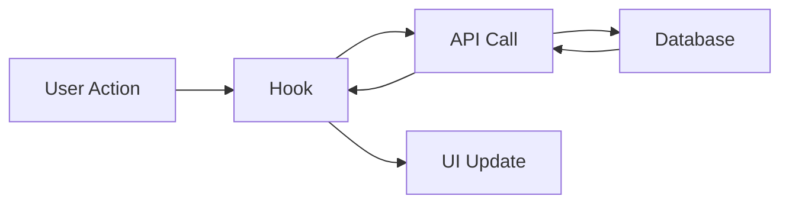
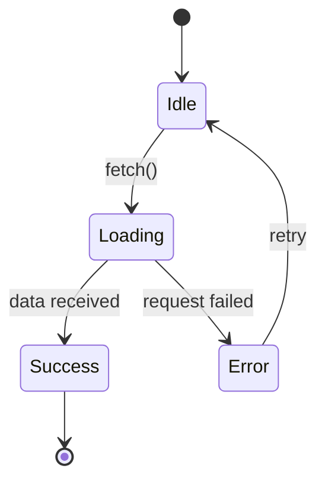

# GitHub Ticket Skill

Create comprehensive GitHub issues that capture maximum context.

## Activation

Use when:
- Creating new GitHub issues
- Documenting bugs or features
- User requests `/ticket` or "create an issue"
- Capturing investigation findings

## Core Principle

> The moment you decide to create a ticket, you have MAXIMUM CONTEXT.
> Capture it NOW before it fades.

## Why This Matters

| Ticket Quality | Implementation Cost |
|----------------|---------------------|
| Vague ticket | 10x clarification time |
| Detailed ticket | Immediate start |

## Process

### Phase 1: Context Dump

Before structuring, dump everything you know:

- What triggered this?
- What did you discover?
- What files are involved?
- What's the current state?
- What's the desired state?
- What have you already tried?

### Phase 2: Requirements Extraction

Convert knowledge into checklist:

- [ ] Functional requirement 1
- [ ] Functional requirement 2
- [ ] Edge case handling
- [ ] Error handling
- [ ] Test coverage

Each item must be:
- **Specific** - Not "improve performance"
- **Testable** - Clear pass/fail criteria
- **Independent** - Can verify in isolation

### Phase 3: Implementation Guidance

Provide specific locations:

```markdown
## Implementation Notes

### Files to Modify
- `packages/shared/src/hooks/useAuth.ts` - Add new method
- `packages/client/src/views/Login.tsx` - Use new hook

### Existing Patterns
See `packages/shared/src/hooks/useGarden.ts` for similar implementation

### Dependencies
- Requires `@tanstack/react-query` for data fetching
- Uses existing `useGraphQL` provider

### Suggested Approach
1. Start with hook implementation
2. Add tests
3. Integrate in views
```

### Phase 4: Structure Ticket

Use this template:

```markdown
## Summary
[One sentence describing the issue/feature]

## Context
[Why this is needed, what triggered it]

## Current Behavior
[What happens now - for bugs]

## Expected Behavior
[What should happen]

## Requirements
- [ ] Requirement 1
- [ ] Requirement 2
- [ ] Requirement 3

## Acceptance Criteria
- [ ] Criterion 1 (how to verify)
- [ ] Criterion 2 (how to verify)

## Implementation Notes

### Files to Modify
- `path/to/file.ts` - [what to change]

### Existing Patterns
- See `path/to/example.ts` for reference

### Dependencies
- [List any dependencies]

## Out of Scope
- [What this ticket does NOT cover]

## Related
- Closes #123 (if applicable)
- Related to #456
```

### Phase 5: Add Visuals

Include Mermaid diagrams for complex flows:

```markdown
## Architecture



## State Flow


```

## Green Goods Ticket Additions

For Green Goods issues, include:

**Package scope**:
```markdown
## Affected Packages
- [ ] shared
- [ ] client
- [ ] admin
- [ ] contracts
- [ ] indexer
```

**Compliance checklist**:
```markdown
## Compliance
- [ ] Hook in shared package (if new hook)
- [ ] i18n keys added (if new UI strings)
- [ ] No hardcoded addresses (if contract interaction)
- [ ] Tests added (coverage target met)
```

**Offline considerations** (if applicable):
```markdown
## Offline Behavior
- How should this work offline?
- Job queue integration needed?
- IndexedDB storage needed?
```

## Ticket Quality Checklist

Before submitting:

- [ ] Summary is clear and specific
- [ ] Context explains why this matters
- [ ] Requirements are testable
- [ ] Acceptance criteria are verifiable
- [ ] Implementation notes provide starting points
- [ ] Out of scope is defined
- [ ] Related issues are linked
- [ ] Diagrams added for complex flows

## Creating the Ticket

```bash
gh issue create \
  --title "[type]: Brief description" \
  --body "$(cat <<'EOF'
[Ticket content here]
EOF
)" \
  --label "type:feature" \
  --assignee "@me"
```

## Output

After creating ticket:
1. Display issue URL
2. Show issue number
3. Confirm labels applied
4. Ready for implementation
