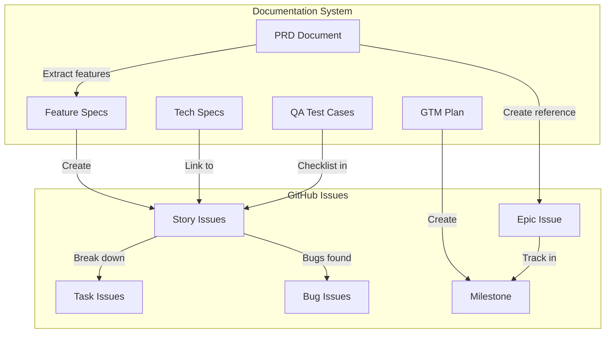
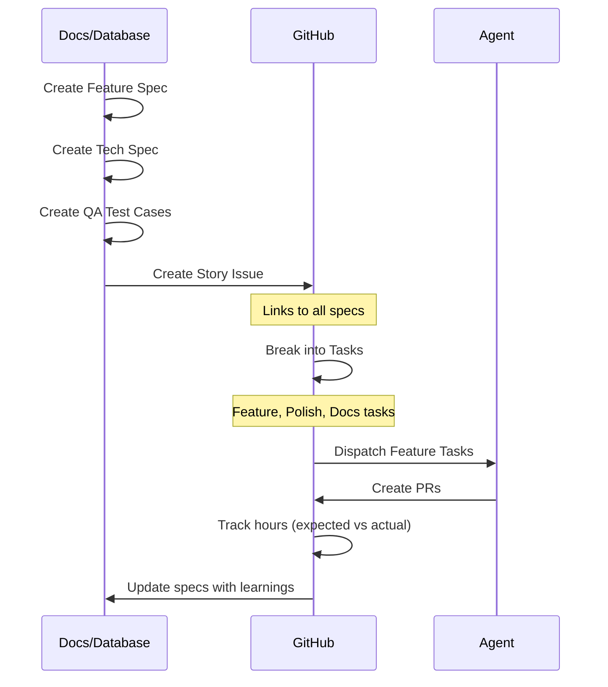

# Green Goods Documentation & Issue Ecosystem

## Document Types & Storage

| Document | Cadence | Storage | GitHub Link |
|----------|---------|---------|-------------|
| **PRD** | Quarterly | Database + Docs | Epic issue (reference) |
| **Feature Spec** | Per feature in PRD | Database + Docs | Story issue (embedded/linked) |
| **Tech Spec** | As needed per feature | Database + Docs | Story issue (embedded/linked) |
| **QA Test Cases** | Per feature | Database + Docs | Story issue checklist |
| **GTM** | Per product launch | Database + Docs | Milestone + tracking issue |

---

## Complete Hierarchy

```
PRD (Quarterly)                    [Database + Docs]
│   └── Reference: Epic Issue      [GitHub - tracking only]
│
├── Feature Spec                   [Database + Docs]
│   └── Story Issue                [GitHub - work tracking]
│       ├── Tech Spec              [Database + Docs, linked in Story]
│       ├── QA Test Cases          [Database + Docs, linked in Story]
│       │
│       └── Tasks                  [GitHub Issues]
│           ├── Feature Task       [implementation work]
│           ├── Polish Task        [refinement]
│           ├── Docs Task          [documentation]
│           └── Bug                [defect]
│
└── GTM                            [Database + Docs]
    └── Release Milestone          [GitHub Milestone]
```

---

## GitHub Issue Types

### Epic (PRD Reference)
**Purpose**: Tracks quarterly PRD progress in GitHub
**Labels**: `epic`, `prd`, `Q1-2026` (quarter label)

```markdown
# [EPIC]: {PRD Title} - Q{N} {Year}

## PRD Reference
📄 **Full PRD**: [Link to docs/database]

## Quarterly Objectives
- [ ] {Objective 1}
- [ ] {Objective 2}
- [ ] {Objective 3}

## Feature Specs (Stories)
- [ ] #{story_1} - {Feature Name}
- [ ] #{story_2} - {Feature Name}
- [ ] #{story_3} - {Feature Name}

## Progress
| Metric | Target | Current |
|--------|--------|---------|
| Stories Completed | {N} | {current} |
| Bugs Closed | - | {count} |
| Total Hours | {estimate} | {actual} |
```

---

### Story (Feature Spec Implementation)
**Purpose**: Tracks a feature from spec to delivery
**Labels**: `story`, `{priority}`, `{scope}`, `{quarter}`

```markdown
# [STORY]: {Feature Name}

## Spec References
📄 **Feature Spec**: [Link to docs/database]
📄 **Tech Spec**: [Link to docs/database]
📄 **QA Test Cases**: [Link to docs/database]

## Parent
**Epic**: #{epic_number} - {PRD Title}

## Scope
`{scope-label}` - {package(s) affected}

## Acceptance Criteria
From Feature Spec:
- [ ] {criterion_1}
- [ ] {criterion_2}
- [ ] {criterion_3}

## QA Checklist
From QA Test Cases:
- [ ] {test_case_1}
- [ ] {test_case_2}
- [ ] {test_case_3}

## Tasks
- [ ] #{task_1} - [FEATURE] {implementation task}
- [ ] #{task_2} - [POLISH] {refinement task}
- [ ] #{task_3} - [DOCS] {documentation task}

## Estimation
| Type | Expected | Actual |
|------|----------|--------|
| Hours | {expected_hrs} | {actual_hrs} |
| Effort | {S/M/L/XL} | - |
| Story Points | {points} | - |

## Definition of Done
- [ ] All tasks completed
- [ ] QA test cases passing
- [ ] Feature spec requirements met
- [ ] Documentation updated
- [ ] Deployed to staging
- [ ] Product sign-off
```

---

### Task Types

#### Feature Task
**Labels**: `task`, `feature`, `{priority}`, `{scope}`, `{effort}`

```markdown
# [FEATURE]: {Task Title}

## Parent Story
**Story**: #{story_number} - {Story Title}

## Spec Context
📄 **Tech Spec Section**: [Link to relevant section]

## Scope
`{scope-label}`

## Implementation
{Description of what to implement}

## Files to Create/Modify
- [ ] `path/to/file.ts` - {change description}

## Estimation
| Expected Hours | Actual Hours | Effort |
|----------------|--------------|--------|
| {expected} | {actual} | {S/M/L/XL} |

## Checklist
- [ ] Implementation complete
- [ ] Tests added/updated
- [ ] PR created
- [ ] Code reviewed
```

#### Polish Task
**Labels**: `task`, `polish`, `{priority}`, `{scope}`, `{effort}`

```markdown
# [POLISH]: {Task Title}

## Parent Story
**Story**: #{story_number} - {Story Title}

## Scope
`{scope-label}`

## Refinements
- {Refinement 1}
- {Refinement 2}

## Before/After
| Aspect | Before | After |
|--------|--------|-------|
| {aspect} | {current} | {target} |

## Estimation
| Expected Hours | Actual Hours | Effort |
|----------------|--------------|--------|
| {expected} | {actual} | {XS/S/M} |
```

#### Docs Task
**Labels**: `task`, `documentation`, `{priority}`, `{scope}`, `{effort}`

```markdown
# [DOCS]: {Task Title}

## Parent Story
**Story**: #{story_number} - {Story Title}

## Documentation Updates
- [ ] {Doc location 1} - {update description}
- [ ] {Doc location 2} - {update description}

## Estimation
| Expected Hours | Actual Hours | Effort |
|----------------|--------------|--------|
| {expected} | {actual} | {XS/S/M} |
```

#### Bug
**Labels**: `bug`, `{severity}`, `{priority}`, `{scope}`, `{effort}`

```markdown
# [BUG]: {Bug Title}

## Related Story (if applicable)
**Story**: #{story_number} - {Story Title}

## Severity
`{severity-label}` - {critical/high/medium/low}

## Scope
`{scope-label}`

## Description
{Bug description}

## Steps to Reproduce
1. {Step 1}
2. {Step 2}

## Expected vs Actual
| Expected | Actual |
|----------|--------|
| {expected} | {actual} |

## Estimation
| Expected Hours | Actual Hours | Effort |
|----------------|--------------|--------|
| {expected} | {actual} | {XS/S/M/L} |
```

---

## Label System

### Type Labels
| Label | Color | Use For |
|-------|-------|---------|
| `epic` | Purple | PRD tracking issues |
| `story` | Blue | Feature spec implementations |
| `task` | Gray | Work items under stories |
| `feature` | Green | Feature implementation tasks |
| `polish` | Cyan | Refinement tasks |
| `documentation` | Yellow | Doc update tasks |
| `bug` | Red | Defects |

### Scope Labels
| Label | Packages Affected |
|-------|-------------------|
| `scope:client` | packages/client |
| `scope:admin` | packages/admin |
| `scope:shared` | packages/shared |
| `scope:contracts` | packages/contracts |
| `scope:indexer` | packages/indexer |
| `scope:agent` | packages/agent |
| `scope:multi` | Multiple packages |
| `scope:full-stack` | All layers |

### Priority Labels
| Label | Meaning | SLA |
|-------|---------|-----|
| `P0` | Critical blocker | Immediate |
| `P1` | High priority | This sprint |
| `P2` | Normal priority | Next 2 sprints |
| `P3` | Low priority | Backlog |

### Severity Labels (Bugs)
| Label | Meaning |
|-------|---------|
| `severity:critical` | System down, data loss |
| `severity:high` | Major functionality broken |
| `severity:medium` | Degraded experience |
| `severity:low` | Minor annoyance |

### Effort Labels
| Label | Hours | Description |
|-------|-------|-------------|
| `effort:XS` | < 1hr | Quick fix |
| `effort:S` | 1-4hr | Small task |
| `effort:M` | 4-8hr | Medium task |
| `effort:L` | 1-3 days | Large task |
| `effort:XL` | 3+ days | Very large task |

### Quarter Labels
| Label | Period |
|-------|--------|
| `Q1-2026` | Jan-Mar 2026 |
| `Q2-2026` | Apr-Jun 2026 |
| `Q3-2026` | Jul-Sep 2026 |
| `Q4-2026` | Oct-Dec 2026 |

---

## Custom Fields (GitHub Projects)

| Field | Type | Options | Use For |
|-------|------|---------|---------|
| `Expected Hours` | Number | - | Time estimate |
| `Actual Hours` | Number | - | Time tracking |
| `Story Points` | Single Select | 1,2,3,5,8,13,21 | Relative sizing |
| `Sprint` | Iteration | 2-week sprints | Sprint planning |
| `Quarter` | Single Select | Q1-Q4 | Quarterly tracking |

---

## Document-to-GitHub Flow

### Quarterly PRD Flow



### Feature Spec → Story → Tasks Flow



---

## n8n Automation Hooks

### 1. PRD Published → Create Epic

```javascript
// Trigger: PRD published in docs system
on('prd.published', async (prd) => {
  // Create epic issue
  const epic = await github.createIssue({
    title: `[EPIC]: ${prd.title} - ${prd.quarter}`,
    labels: ['epic', 'prd', prd.quarterLabel],
    body: generateEpicBody(prd),
  });

  // Create milestone
  const milestone = await github.createMilestone({
    title: `${prd.title} - ${prd.quarter}`,
    due_on: prd.quarterEnd,
  });

  // Link epic to milestone
  await github.updateIssue(epic.number, { milestone: milestone.number });
});
```

### 2. Feature Spec Published → Create Story

```javascript
// Trigger: Feature spec published
on('featureSpec.published', async (spec) => {
  // Find parent epic
  const epic = await findEpicByPrd(spec.prdId);

  // Create story issue
  const story = await github.createIssue({
    title: `[STORY]: ${spec.title}`,
    labels: ['story', spec.priority, spec.scope],
    body: generateStoryBody(spec),
    milestone: epic.milestone,
  });

  // Update epic with story link
  await addStoryToEpic(epic.number, story.number);

  // Auto-generate task scaffolds
  const tasks = analyzeSpecForTasks(spec);
  for (const task of tasks) {
    await createTask(task, story.number);
  }
});
```

### 3. Story Created → Generate Tasks

```javascript
// Trigger: Story issue created
on('issue.created', async (issue) => {
  if (!issue.labels.includes('story')) return;

  // Parse spec references
  const specs = extractSpecReferences(issue.body);

  // Generate tasks from tech spec
  if (specs.techSpec) {
    const techTasks = await generateTasksFromTechSpec(specs.techSpec);
    for (const task of techTasks) {
      await createLinkedTask(task, issue.number, 'feature');
    }
  }

  // Generate QA tasks
  if (specs.qaTestCases) {
    const qaTasks = await generateQATasks(specs.qaTestCases);
    for (const task of qaTasks) {
      await createLinkedTask(task, issue.number, 'task');
    }
  }
});
```

### 4. Task Completed → Update Hours

```javascript
// Trigger: Task closed
on('issue.closed', async (issue) => {
  if (!issue.labels.includes('task')) return;

  // Prompt for actual hours (via bot comment or UI)
  const actualHours = await promptForActualHours(issue.number);

  // Update custom field
  await github.updateProjectItem(issue.number, {
    'Actual Hours': actualHours,
  });

  // Update parent story progress
  const parentStory = findParentStory(issue);
  await updateStoryProgress(parentStory);

  // Update epic metrics
  const parentEpic = findParentEpic(parentStory);
  await updateEpicMetrics(parentEpic);
});
```

---

## Agent Dispatch with Spec Context

When dispatching to agents, include full spec context:

```markdown
@{agent} Implement this {task_type}.

## Spec Context

### From Feature Spec
📄 Link: {feature_spec_url}

**Requirements**:
{extracted requirements}

### From Tech Spec
📄 Link: {tech_spec_url}

**API Contract**:
{extracted API}

**Data Model**:
{extracted model}

### From QA Test Cases
📄 Link: {qa_spec_url}

**Must Pass**:
{extracted test cases}

## Implementation
{task description}

## Estimation
- Expected: {expected_hours} hours
- Effort: {effort_label}

## Validation
{validation commands}
```

---

## Reporting Queries

### Quarterly Progress
```
is:issue label:epic label:Q1-2026
```

### Story Velocity
```
is:issue label:story is:closed closed:>2026-01-01
```

### Hours Tracking
```
is:issue label:task project:green-goods has:actual-hours
```

### Bug Trends
```
is:issue label:bug created:>2026-01-01
```

### Effort Accuracy
```sql
-- In database/reporting
SELECT
  issue_number,
  expected_hours,
  actual_hours,
  (actual_hours - expected_hours) as variance,
  (actual_hours / expected_hours) as accuracy_ratio
FROM issues
WHERE type = 'task'
  AND actual_hours IS NOT NULL
ORDER BY variance DESC
```
