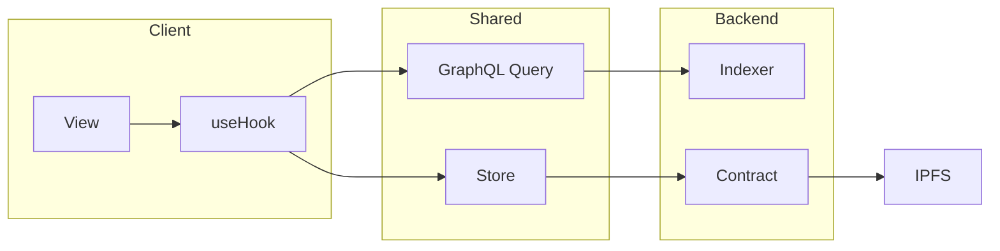
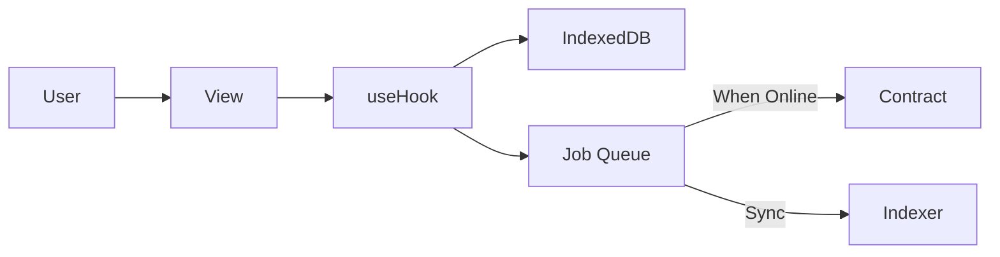
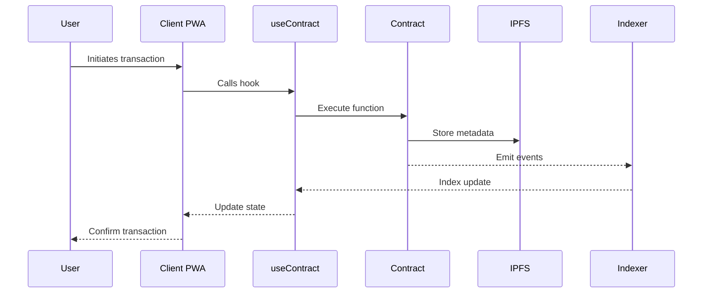
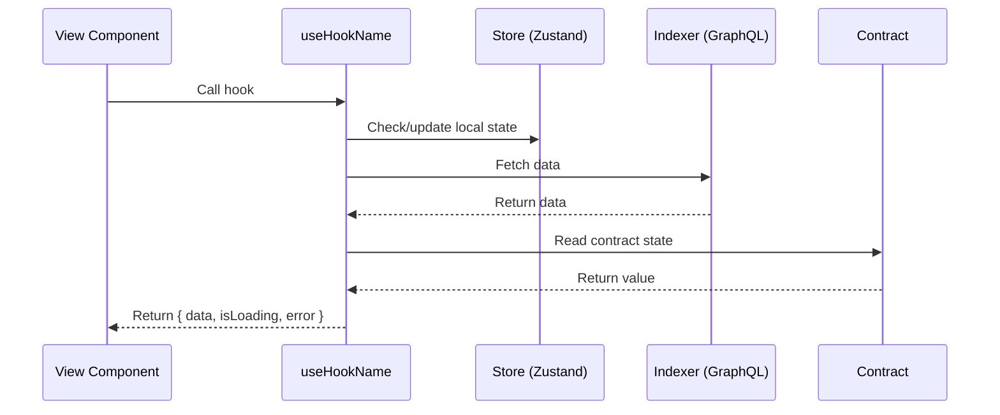
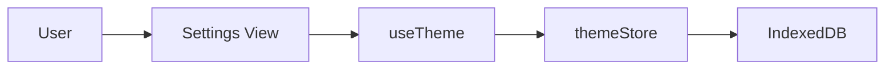

# Green Goods Entity Set for Mermaid Diagrams

> **Purpose**: Standard entities for generating dynamic Mermaid diagrams in Green Goods issues.
> When generating diagrams, use these consistent entity names and node formats.

## Entity Reference

| Entity | Description | Mermaid Node | Alias |
|--------|-------------|--------------|-------|
| User | End user interacting with app | `U[User]` | `U` |
| Client | PWA frontend (port 3001) | `C[Client PWA]` | `C` |
| Admin | Admin dashboard (port 3002) | `A[Admin Dashboard]` | `A` |
| View | React view/page component | `V[ViewName]` | `V` |
| Hook | Shared React hook | `H[useHookName]` | `H` |
| Store | Zustand store | `S[storeName]` | `S` |
| Indexer | Envio GraphQL API (port 8080) | `I[Indexer]` | `I` |
| Contract | Solidity smart contract | `SC[ContractName]` | `SC` |
| IPFS | Storacha/IPFS storage | `IPFS[IPFS]` | `IPFS` |
| JobQueue | Offline job queue | `JQ[Job Queue]` | `JQ` |
| IndexedDB | Local database | `IDB[IndexedDB]` | `IDB` |

## Standard Flow Patterns

### Full Stack Flow (Feature Implementation)


### Offline-First Flow


### Contract Interaction Flow


### Hook Data Flow


## Usage Guidelines

### When to Use Which Pattern

| Issue Type | Recommended Diagram |
|------------|---------------------|
| Bug (UI) | Hook Data Flow |
| Bug (Contract) | Contract Interaction Flow |
| Bug (Offline) | Offline-First Flow |
| Feature (Full Stack) | Full Stack Flow + Sequence |
| Feature (Hook Only) | Hook Data Flow |
| Feature (Contract) | Contract Interaction Flow |
| Polish | Usually no diagram needed |
| Docs | Architecture diagrams as needed |

### Dynamic Generation

When generating diagrams based on issue context:

1. **Identify involved entities** from the issue description
2. **Select appropriate base pattern** from above
3. **Customize entity names** to match actual components
4. **Add/remove nodes** based on what's actually involved

Example transformation:
```
Issue: "Add dark mode toggle that persists preference"

Entities detected: User, View (Settings), Hook (useTheme), Store (themeStore), IndexedDB

Generated diagram:


## Related Files

- Pattern reference: `packages/shared/src/hooks/garden/useGarden.ts`
- Store example: `packages/shared/src/stores/gardenStore.ts`
- Contract hook: `packages/shared/src/hooks/contracts/useWorkApproval.ts`
