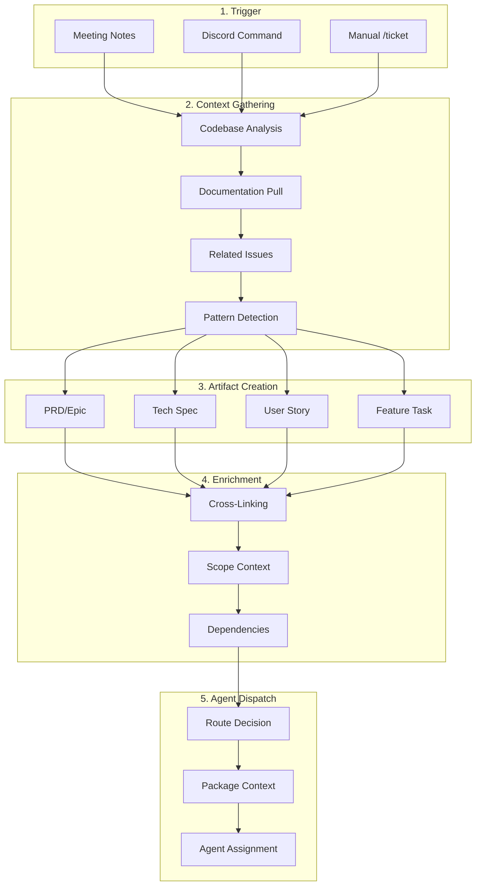

# Ideal Issue Creation Flow

This document describes the optimal end-to-end workflow for creating issues with maximum context at each stage.

---

## The Golden Rule

> **Every artifact should reference its upstream documents and provide context for downstream consumers.**

```
PRD ←→ Tech Spec ←→ Story ←→ Feature Task → Implementation
 ↑         ↑          ↑           ↑              ↑
 └─────────┴──────────┴───────────┴──────────────┘
              Bidirectional linking
```

---

## Complete Flow Overview



---

## Stage 1: Trigger Sources

### Meeting Notes → Issues

When Gemini meeting notes are processed:

**Context to Extract**:
- Action items with owners
- Bug reports with reproduction hints
- Feature requests with user context
- Decisions made and rationale
- Blockers mentioned

**Auto-Classification**:
```javascript
const classifyFromMeeting = (content) => {
  const patterns = {
    bug: /bug|broken|not working|error|crash|fix/i,
    feature: /add|implement|create|build|new feature/i,
    story: /user wants|as a|so that|acceptance/i,
    spike: /investigate|research|explore|understand/i,
    prd: /initiative|roadmap|q[1-4]|major feature/i,
  };

  for (const [type, pattern] of Object.entries(patterns)) {
    if (pattern.test(content)) return type;
  }
  return 'task';
};
```

### Discord → Issues

**Command Format**:
```
/issue <type> "<title>" [--flags]

Examples:
/issue prd "Garden Management Overhaul" --priority P1
/issue story "As a gardener, I want to export my work history" --prd 100
/issue feature "useExportWork hook" --story 101 --complete
/issue bug "Photos not uploading on iOS Safari" --severity high
```

**Context from Discord**:
- Channel context (which area/team)
- Thread history (related discussion)
- User role (product, engineering, design)
- Attachments (screenshots, logs)

### Manual `/ticket` → Issues

**Best Practice**: Provide maximum context upfront:

```bash
# Good: Rich context
/ticket feature --complete "Implement work export functionality" \
  --story 101 \
  --packages client,shared,indexer \
  --offline yes \
  --context "Users have requested CSV and PDF export of their conservation work history"

# Basic: Will require AI to gather context
/ticket feature "Add export button"
```

---

## Stage 2: Context Gathering

### 2.1 Codebase Analysis

**For every issue, gather**:

```javascript
async function gatherCodebaseContext(title, type) {
  const context = {};

  // 1. Extract keywords from title
  const keywords = extractKeywords(title);

  // 2. Find related files
  context.relatedFiles = await grep(keywords, {
    include: '*.ts,*.tsx,*.sol',
    limit: 20,
  });

  // 3. Detect affected packages
  context.packages = detectPackages(context.relatedFiles);

  // 4. Find similar patterns
  context.patterns = await findPatterns(type, context.packages);

  // 5. Check for existing implementations
  context.existing = await findExisting(keywords);

  return context;
}
```

### 2.2 Documentation Pull

**Pull relevant docs based on type**:

| Issue Type | Documentation to Pull |
|------------|----------------------|
| Any | `CLAUDE.md` (project patterns) |
| Feature/Hook | `packages/shared/src/hooks/README.md` |
| Contract | `packages/contracts/README.md`, Security checklist |
| Offline | Job queue patterns, IndexedDB patterns |
| API | GraphQL schema, Indexer handlers |
| UI | Component library, Design system |

**Context Injection**:
```javascript
async function injectDocContext(issueType) {
  const docs = [];

  // Always include project guidelines
  docs.push(await read('CLAUDE.md'));

  // Type-specific docs
  const docMap = {
    hook: ['packages/shared/src/hooks/README.md'],
    contract: [
      'packages/contracts/README.md',
      'packages/contracts/SECURITY.md',
    ],
    feature: [
      'packages/shared/src/hooks/README.md',
      'packages/client/src/views/README.md',
    ],
  };

  if (docMap[issueType]) {
    for (const path of docMap[issueType]) {
      docs.push(await read(path));
    }
  }

  return docs.join('\n\n---\n\n');
}
```

### 2.3 Related Issues Search

**Search Strategy**:
```javascript
async function findRelatedIssues(title, type) {
  const keywords = extractKeywords(title);

  // Search open issues
  const openIssues = await github.searchIssues({
    repo: 'greenpill-dev-guild/green-goods',
    query: `is:issue is:open ${keywords.join(' OR ')}`,
    limit: 10,
  });

  // Search closed issues for prior art
  const closedIssues = await github.searchIssues({
    repo: 'greenpill-dev-guild/green-goods',
    query: `is:issue is:closed ${keywords.join(' OR ')}`,
    limit: 5,
  });

  // Search PRDs for parent context
  const prds = await github.searchIssues({
    repo: 'greenpill-dev-guild/green-goods',
    query: `is:issue label:prd ${keywords.slice(0, 3).join(' ')}`,
    limit: 3,
  });

  return {
    potentialDuplicates: openIssues.filter(i => similarity(i.title, title) > 0.7),
    relatedOpen: openIssues,
    priorArt: closedIssues,
    parentPRDs: prds,
  };
}
```

### 2.4 Pattern Detection

**Detect existing patterns to follow**:

```javascript
async function detectPatterns(packages, type) {
  const patterns = {};

  if (packages.includes('shared') && type === 'hook') {
    // Find similar hooks
    const hooks = await glob('packages/shared/src/hooks/**/*.ts');
    patterns.hookPattern = await analyzeHookPatterns(hooks);
  }

  if (packages.includes('contracts')) {
    // Find similar contracts
    const contracts = await glob('packages/contracts/src/**/*.sol');
    patterns.contractPattern = await analyzeContractPatterns(contracts);
  }

  if (packages.includes('client')) {
    // Find similar views
    const views = await glob('packages/client/src/views/**/*.tsx');
    patterns.viewPattern = await analyzeViewPatterns(views);
  }

  return patterns;
}
```

---

## Stage 3: Artifact Creation

### 3.1 PRD Creation

**When to create PRD**:
- Major initiative (2+ sprints)
- Multiple user stories needed
- Cross-team coordination required
- Significant architecture changes

**Required Context for PRD**:
```markdown
## Context Sources (AI Must Gather)

### From Codebase
- [ ] Current implementation of related features
- [ ] Existing architecture diagrams
- [ ] Technical constraints

### From Documentation
- [ ] CLAUDE.md patterns
- [ ] Package READMEs
- [ ] Existing tech specs

### From Issues
- [ ] Related open issues
- [ ] Prior art (closed issues)
- [ ] User feedback issues

### From External
- [ ] Figma designs (if available)
- [ ] User research (if available)
- [ ] Market analysis (if relevant)
```

### 3.2 Tech Spec Creation

**When to create Tech Spec**:
- New API or contract interface
- Database/schema changes
- Complex state management
- Security-sensitive features
- Performance-critical features

**Required Context for Tech Spec**:
```markdown
## Context Sources (AI Must Gather)

### From PRD
- [ ] Functional requirements
- [ ] Non-functional requirements
- [ ] Success metrics

### From Codebase
- [ ] Existing similar implementations
- [ ] Current architecture
- [ ] Dependencies

### From External
- [ ] Library documentation
- [ ] Best practices
- [ ] Security guidelines
```

### 3.3 Story Creation

**When to create Story**:
- User-deliverable value
- Breaking down PRD
- Product requirement

**Required Context for Story**:
```markdown
## Context Sources (AI Must Gather)

### From PRD
- [ ] Parent PRD reference
- [ ] Relevant requirements
- [ ] Acceptance criteria patterns

### From Tech Spec (if exists)
- [ ] Technical constraints
- [ ] API contracts
- [ ] Data models

### From Codebase
- [ ] Affected packages
- [ ] Similar user flows
- [ ] UI patterns
```

### 3.4 Feature Task Creation

**When to create Feature Task**:
- Implementation work
- Breaking down stories
- Technical tasks

**Required Context for Feature Task**:
```markdown
## Context Sources (AI Must Gather)

### From Story
- [ ] Parent story reference
- [ ] Acceptance criteria
- [ ] User context

### From Tech Spec (if exists)
- [ ] API contracts
- [ ] Data models
- [ ] Error handling spec

### From Codebase
- [ ] Pattern references
- [ ] File inventory
- [ ] Test patterns

### From Documentation
- [ ] CLAUDE.md compliance
- [ ] Package conventions
- [ ] Testing requirements
```

---

## Stage 4: Enrichment

### 4.1 Cross-Linking

**Every artifact must link**:

```markdown
## Artifact Links

### PRD Links
- **Tech Specs**: #{spec_1}, #{spec_2}
- **Stories**: #{story_1}, #{story_2}, #{story_3}

### Tech Spec Links
- **Parent PRD**: #{prd_number}
- **Stories Using**: #{story_1}, #{story_2}
- **Supersedes**: #{old_spec} (if applicable)

### Story Links
- **Parent PRD**: #{prd_number}
- **Tech Spec**: #{spec_number}
- **Feature Tasks**: #{feature_1}, #{feature_2}
- **Sibling Stories**: #{story_a}, #{story_b}

### Feature Task Links
- **Parent Story**: #{story_number}
- **Tech Spec**: #{spec_number}
- **Related Features**: #{feature_a}
- **Blocks/Blocked By**: #{issue_x}
```

### 4.2 Scope Context

**Include scope boundaries in every artifact**:

```markdown
## Scope

### In Scope
- {Explicit inclusion 1}
- {Explicit inclusion 2}

### Out of Scope
- {Explicit exclusion 1}
- {Explicit exclusion 2}
- {Deferred to #{future_issue}}

### Assumptions
- {Assumption 1}
- {Assumption 2}

### Dependencies
| Item | Type | Status | Notes |
|------|------|--------|-------|
| #{dep_1} | Blocks | In Progress | Needed for X |
| #{dep_2} | Related | Complete | Reference for Y |
```

### 4.3 Dependencies Resolution

**Before finalizing, verify**:

```javascript
async function resolveDependencies(issue) {
  const deps = [];

  // Check for blocking issues
  const blockers = await findBlockers(issue);
  for (const blocker of blockers) {
    deps.push({
      type: 'blocks',
      issue: blocker.number,
      status: blocker.state,
      critical: true,
    });
  }

  // Check for related tech specs
  if (issue.type === 'feature' || issue.type === 'story') {
    const specs = await findRelatedSpecs(issue);
    for (const spec of specs) {
      deps.push({
        type: 'spec',
        issue: spec.number,
        status: spec.labels.includes('status:approved') ? 'approved' : 'draft',
        critical: spec.labels.includes('status:draft'),
      });
    }
  }

  // Check for parent artifacts
  if (issue.parentStory) {
    const story = await github.getIssue(issue.parentStory);
    deps.push({
      type: 'parent',
      issue: story.number,
      status: story.state,
    });
  }

  return deps;
}
```

---

## Stage 5: Agent Dispatch

### 5.1 Pre-Dispatch Context Package

**Build comprehensive context for agent**:

```javascript
async function buildAgentContext(issue) {
  const context = {
    // Issue details
    issue: {
      number: issue.number,
      title: issue.title,
      body: issue.body,
      labels: issue.labels,
    },

    // Upstream artifacts
    upstream: {
      prd: issue.prdNumber ? await fetchPRD(issue.prdNumber) : null,
      techSpec: issue.specNumber ? await fetchSpec(issue.specNumber) : null,
      story: issue.storyNumber ? await fetchStory(issue.storyNumber) : null,
    },

    // Codebase context
    codebase: {
      patterns: await fetchPatternExamples(issue.type),
      relatedFiles: await fetchRelatedFiles(issue.title),
      recentChanges: await fetchRecentChanges(issue.packages),
    },

    // Documentation
    docs: {
      claudeMd: await read('CLAUDE.md'),
      packageDocs: await fetchPackageDocs(issue.packages),
    },

    // Constraints
    constraints: {
      compliance: extractComplianceChecklist(),
      testTargets: getTestTargets(issue.packages),
      conventions: getConventions(issue.type),
    },
  };

  return context;
}
```

### 5.2 Dispatch Template with Context

```markdown
@{agent} Implement this {type}.

## Context Summary

### Upstream References
- **PRD**: #{prd} - {prd_title}
- **Tech Spec**: #{spec} - {spec_title}
- **Story**: #{story} - {story_title}

### Key Requirements
{extracted from upstream artifacts}

### Technical Constraints
{from tech spec}

### Pattern Reference
Follow: `{pattern_file_path}`

### Files to Create/Modify
{from issue body}

## Implementation Context

### Relevant Code
```typescript
// Key pattern from {file}
{code_snippet}
```

### API Contracts
{from tech spec}

### Test Expectations
{from story acceptance criteria}

## Validation

```bash
{validation_commands}
```

## Compliance Checklist
{from CLAUDE.md}
```

### 5.3 Agent Selection with Context Awareness

```javascript
function selectAgentWithContext(issue, context) {
  const decision = {
    agent: null,
    mode: 'manual',
    reason: '',
    contextQuality: 'low',
  };

  // Assess context quality
  const hasUpstream = !!(context.upstream.prd || context.upstream.story);
  const hasSpec = !!context.upstream.techSpec;
  const hasPatterns = context.codebase.patterns.length > 0;
  const hasDocs = !!context.docs.packageDocs;

  const contextScore = [hasUpstream, hasSpec, hasPatterns, hasDocs]
    .filter(Boolean).length;

  decision.contextQuality = contextScore >= 3 ? 'high' :
                            contextScore >= 2 ? 'medium' : 'low';

  // Routing based on context quality
  if (issue.type === 'feature') {
    if (decision.contextQuality === 'high') {
      decision.agent = 'codex';
      decision.mode = 'autonomous';
      decision.reason = 'High context quality enables autonomous implementation';
    } else if (decision.contextQuality === 'medium') {
      decision.agent = 'codex';
      decision.mode = 'supervised';
      decision.reason = 'Medium context requires checkpoints';
    } else {
      decision.agent = 'cursor';
      decision.mode = 'investigate-only';
      decision.reason = 'Low context - investigate first';
    }
  }

  // Similar logic for other types...

  return decision;
}
```

---

## Recommendations

### 1. Always Start with Context

**Before creating any issue**:
1. Search for existing issues (avoid duplicates)
2. Find parent PRD/Story if applicable
3. Check for relevant tech specs
4. Identify pattern references

### 2. Link Bidirectionally

**When creating artifacts**:
- Child references parent (`Parent Story: #N`)
- Update parent to reference child (add to task list)
- Cross-link related specs

### 3. Include Pattern References

**Every implementation issue should include**:
```markdown
## Pattern Reference

Follow implementation pattern in:
- Hook: `packages/shared/src/hooks/garden/useGarden.ts`
- Store: `packages/shared/src/stores/gardenStore.ts`
- View: `packages/client/src/views/Garden/index.tsx`
```

### 4. Explicit Scope Boundaries

**Prevent scope creep**:
```markdown
## Scope

### In Scope
- Create useExportWork hook
- Add CSV export format
- Add PDF export format

### Out of Scope (Future Issues)
- Email export delivery → #{future_1}
- Scheduled exports → #{future_2}
- Export templates → #{future_3}
```

### 5. Context Quality Gates

**Don't dispatch to agents with low context**:

| Context Quality | Agent Action |
|-----------------|--------------|
| High (spec + story + patterns) | Autonomous dispatch |
| Medium (story + patterns) | Supervised dispatch |
| Low (missing key context) | Investigate first |

### 6. Continuous Context Updates

**As implementation progresses**:
1. Update issue with findings
2. Link to PRs
3. Add blockers discovered
4. Update estimates

---

## Quick Reference: Context Checklist

### For PRD
- [ ] Market/user context
- [ ] Technical landscape
- [ ] Related existing features
- [ ] Team capacity

### For Tech Spec
- [ ] PRD requirements
- [ ] Current architecture
- [ ] Library documentation
- [ ] Security guidelines

### For Story
- [ ] PRD context
- [ ] Tech spec (if exists)
- [ ] User persona details
- [ ] Similar user flows

### For Feature
- [ ] Story acceptance criteria
- [ ] Tech spec API contracts
- [ ] Pattern references
- [ ] Test requirements
- [ ] CLAUDE.md compliance

---

## Anti-Patterns to Avoid

### ❌ Creating Issues Without Context
```bash
# Bad
/ticket feature "Add export"
```

### ✅ Creating Issues With Full Context
```bash
# Good
/ticket feature "useExportWork hook" \
  --story 101 \
  --complete \
  --context "Export gardener work history to CSV/PDF per Story #101"
```

### ❌ Orphan Features
Features without parent stories or PRD links.

### ✅ Linked Features
Every feature traces back to a story and PRD.

### ❌ Dispatching Without Patterns
Sending agents to implement without reference code.

### ✅ Pattern-Guided Implementation
Including explicit pattern references in dispatch.
