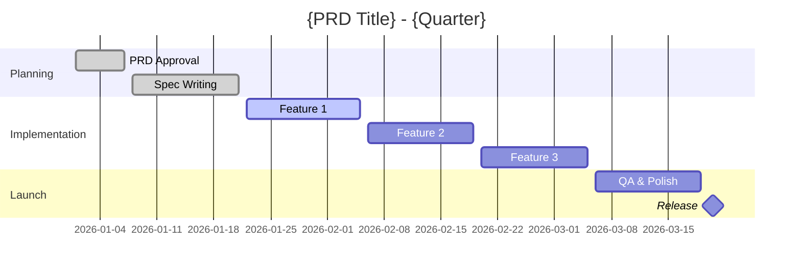

# Epic Issue Template

> **Purpose**: GitHub issue that tracks a quarterly PRD. The PRD lives in docs/database.
> **Use when**: PRD is approved and ready for implementation tracking.
> **Note**: This is a tracking issue—the actual PRD document lives elsewhere.

---

## Template Structure

```markdown
# [EPIC]: {PRD Title} - {Quarter} {Year}

## PRD Reference

📄 **Full PRD Document**: [{PRD Title}]({prd_url})

| Field | Value |
|-------|-------|
| Quarter | {Q1/Q2/Q3/Q4} {Year} |
| PRD Status | `approved` |
| Product Owner | {name} |
| Tech Lead | {name} |

---

## Quarterly Objectives

From PRD:

1. {Objective 1}
2. {Objective 2}
3. {Objective 3}

---

## Success Metrics

| Metric | Target | Current | Status |
|--------|--------|---------|--------|
| {metric_1} | {target} | {current} | 🔴/🟡/🟢 |
| {metric_2} | {target} | {current} | 🔴/🟡/🟢 |
| {metric_3} | {target} | {current} | 🔴/🟡/🟢 |

---

## Feature Specs (Stories)

| # | Feature | Spec | Story | Status | Hours |
|---|---------|------|-------|--------|-------|
| 1 | {Feature Name} | [Spec]({url}) | #{story_num} | 🔴 Not Started | {est} |
| 2 | {Feature Name} | [Spec]({url}) | #{story_num} | 🟡 In Progress | {est} |
| 3 | {Feature Name} | [Spec]({url}) | #{story_num} | 🟢 Complete | {act} |

### Story Checklist
- [ ] #{story_1} - {Feature 1}
- [ ] #{story_2} - {Feature 2}
- [ ] #{story_3} - {Feature 3}

---

## Progress Summary

### By Status
| Status | Count | % |
|--------|-------|---|
| Not Started | {N} |  |
| Complete | {N} |  |

---

## Timeline



---

## Risks & Blockers

| Risk/Blocker | Impact | Status | Mitigation |
|--------------|--------|--------|------------|
| {risk_1} | {H/M/L} | 🔴 Active | {mitigation} |
| {risk_2} | {H/M/L} | 🟢 Resolved | {resolution} |

---

## Dependencies

### Internal
| Dependency | Type | Status |
|------------|------|--------|
| #{issue} | Blocks | {status} |

### External
| Dependency | Owner | Status |
|------------|-------|--------|
| {external_dep} | {team} | {status} |

---

## GTM Reference (if applicable)

📄 **GTM Plan**: [{GTM Title}]({gtm_url})

| Milestone | Target Date | Status |
|-----------|-------------|--------|
| Alpha | {date} | {status} |
| Beta | {date} | {status} |
| GA | {date} | {status} |

---

## Weekly Updates

### Week of {date}
- ✅ {Completed item}
- 🔄 {In progress item}
- ⚠️ {Blocker/risk}

### Week of {date}
- {Updates}

---

## Related

- **Milestone**: [{Quarter} Release]({milestone_url})
- **Project Board**: [Green Goods]({board_url})
- **Previous Quarter**: #{prev_epic}
```

---

## Labels

Required:
- `epic`
- `prd`
- `{quarter}` (e.g., `Q1-2026`)

Optional:
- `priority:P{N}`

---

## Commands

### Create Epic from PRD

```bash
/ticket epic \
  --prd-url "https://docs.example.com/prd/garden-v2" \
  --quarter Q1-2026 \
  --owner "@product-owner" \
  "Garden Management V2"
```

### Add Story to Epic

```bash
/ticket story \
  --epic #{epic_number} \
  --spec-url "https://docs.example.com/spec/garden-creation" \
  --tech-spec-url "https://docs.example.com/tech/garden-api" \
  --expected-hours 40 \
  --effort L \
  "Garden Creation Flow"
```

---

## Automation Hooks

### On Epic Creation
1. Create GitHub Milestone for the quarter
2. Notify team in Discord
3. Add to project board

### On Story Linked
1. Update Epic's story checklist
2. Recalculate total expected hours

### On Story Completed
1. Update Epic's progress metrics
2. Check if all stories complete → close Epic
3. Update milestone progress

### Weekly
1. Post progress summary to Discord
2. Flag at-risk stories
3. Update accuracy metrics
