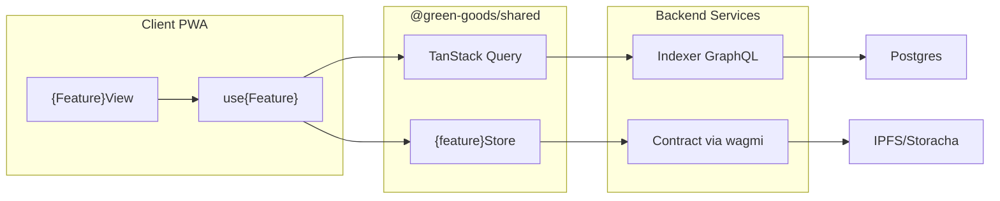
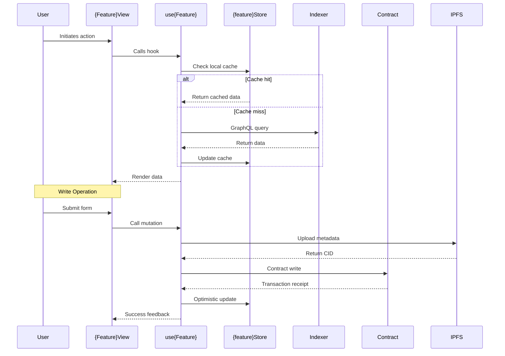
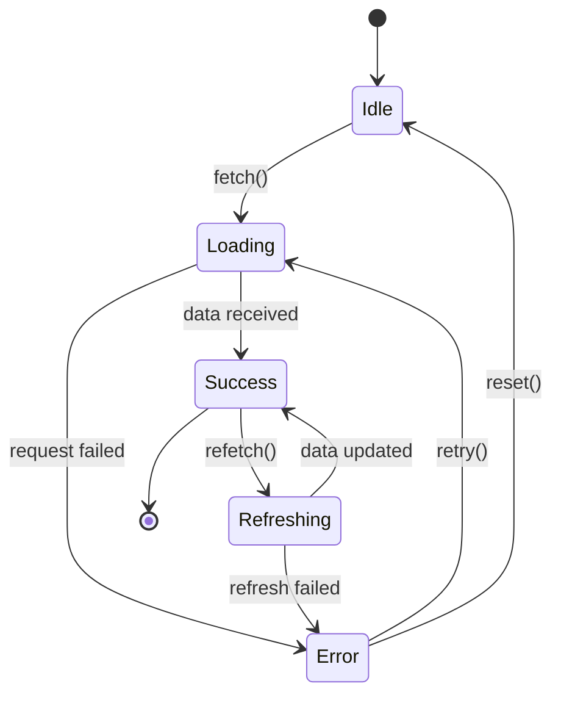

# Feature Complete Template - AI-Buildable Specification

> **Purpose**: This template produces GitHub issues that an AI agent can implement end-to-end without clarification.
> **Use when**: Feature requires multiple packages, complex logic, or will be assigned to AI agents.
> **For simpler features**: Use `feature.md` template instead.

---

## Template Structure

```markdown
# [FEATURE]: {Title}

## Priority
`critical` | `high` | `medium` | `low`

## Problem Statement
As a **{user type}**, I want **{action}** so that **{benefit}**.

**Current behavior**: {What happens now}
**Desired behavior**: {What should happen}

---

## Acceptance Criteria (Testable)

### Happy Path
| Given | When | Then |
|-------|------|------|
| User is authenticated with role `{role}` | User calls `use{Feature}({ param: value })` | Returns `{ data: {Type}, isLoading: false }` |
| Feature data exists in indexer | User navigates to `/{feature}/{id}` | UI renders with correct data |
| {Precondition} | {Action} | {Expected result} |

### Error Cases
| Given | When | Then |
|-------|------|------|
| Invalid `{param}` format (not hex address) | User calls `use{Feature}({ param: "invalid" })` | Throws `ValidationError` with code `INVALID_PARAM` |
| Network unavailable | User attempts to fetch | Returns cached data with `stale: true` |
| Contract call reverts | User submits transaction | Shows error toast with revert reason |

### Edge Cases
| Given | When | Then |
|-------|------|------|
| Empty result set | Query returns `[]` | Shows empty state UI component |
| User has no permissions | User attempts action | Redirects to `/unauthorized` or disables action |
| Offline mode active | User queues action | Shows pending indicator, syncs when online |

---

## Package Detection
- [ ] client - PWA (port 3001)
- [ ] admin - Dashboard (port 3002)
- [ ] shared - Hooks & modules (REQUIRED for any new hooks)
- [ ] contracts - Solidity
- [ ] indexer - Envio GraphQL (port 8080)
- [ ] agent - Telegram bot

---

## Architecture Overview

### Data Flow


### User Interaction Sequence


### State Machine (if applicable)


---

## File Inventory

### Files to Create

| Type | Path | Pattern Reference | Test File |
|------|------|-------------------|-----------|
| Hook | `packages/shared/src/hooks/{domain}/use{Name}.ts` | `useGarden.ts` | `use{Name}.test.ts` |
| Hook Types | `packages/shared/src/hooks/{domain}/types.ts` | `garden/types.ts` | - |
| View | `packages/client/src/views/{Feature}/index.tsx` | `Garden/index.tsx` | - |
| View Components | `packages/client/src/views/{Feature}/components/*.tsx` | `Garden/components/` | - |
| Store (if needed) | `packages/shared/src/stores/{feature}Store.ts` | `gardenStore.ts` | `{feature}Store.test.ts` |
| Contract (if needed) | `packages/contracts/src/{path}/{Feature}.sol` | Existing module | `{Feature}.t.sol` |
| Indexer Schema (if needed) | `packages/indexer/ponder.schema.ts` | Existing tables | - |
| Indexer Handler (if needed) | `packages/indexer/src/{Feature}.ts` | Existing handlers | - |

### Files to Modify

| File | Change | Validation |
|------|--------|------------|
| `packages/shared/src/hooks/index.ts` | Export `use{Name}` | Import resolves |
| `packages/shared/src/index.ts` | Re-export from hooks | Package exports |
| `packages/client/src/routes.tsx` | Add route `/{feature}` | Route accessible |
| `packages/shared/src/i18n/en.json` | Add keys under `{feature}.*` | Keys present |
| `packages/shared/src/i18n/es.json` | Add keys under `{feature}.*` | Keys present |
| `packages/shared/src/i18n/pt.json` | Add keys under `{feature}.*` | Keys present |

### Files to Delete (if any)

| File | Reason |
|------|--------|
| - | - |

---

## Technical Specification

### GraphQL Schema & Queries

#### Indexer Schema Addition
```typescript
// File: packages/indexer/ponder.schema.ts
// Add to existing schema exports

export const {Feature} = onchainTable("{feature}", (t) => ({
  id: t.text().primaryKey(),
  gardenId: t.text().notNull().references(() => Garden.id),
  creatorAddress: t.hex().notNull(),
  {field1}: t.text().notNull(),
  {field2}: t.bigint(),
  {field3}: t.boolean().default(false),
  createdAt: t.bigint().notNull(),
  updatedAt: t.bigint().notNull(),
}));

// Add index for common queries
export const {feature}GardenIdx = index("{feature}_garden_idx")
  .on({Feature}.gardenId);
```

#### GraphQL Queries (generated after build)
```graphql
# Get single {feature} by ID
query Get{Feature}($id: String!) {
  {feature}(id: $id) {
    id
    gardenId
    creatorAddress
    {field1}
    {field2}
    {field3}
    createdAt
    updatedAt
  }
}

# Get all {features} for a garden
query Get{Feature}sByGarden($gardenId: String!) {
  {feature}s(
    where: { gardenId: $gardenId }
    orderBy: "createdAt"
    orderDirection: "desc"
  ) {
    items {
      id
      gardenId
      creatorAddress
      {field1}
      {field2}
      {field3}
      createdAt
    }
  }
}

# Get paginated {features}
query Get{Feature}sPaginated($gardenId: String!, $limit: Int!, $after: String) {
  {feature}s(
    where: { gardenId: $gardenId }
    limit: $limit
    after: $after
    orderBy: "createdAt"
    orderDirection: "desc"
  ) {
    items {
      id
      {field1}
    }
    pageInfo {
      hasNextPage
      endCursor
    }
  }
}
```

### Hook API Contract

```typescript
// File: packages/shared/src/hooks/{domain}/types.ts

export interface {Feature}Data {
  id: string;
  gardenId: string;
  creatorAddress: `0x${string}`;
  {field1}: string;
  {field2}: bigint | null;
  {field3}: boolean;
  createdAt: bigint;
  updatedAt: bigint;
}

export interface {Feature}Input {
  gardenId: string;
  {field1}: string;
  {field2}?: bigint;
  metadata?: {Feature}Metadata;
}

export interface {Feature}Metadata {
  name: string;
  description: string;
  image?: string;
}

export interface Use{Feature}Options {
  /** ID of the {feature} to fetch */
  {feature}Id?: string;
  /** Garden ID to scope queries */
  gardenId?: string;
  /** Enable/disable the query */
  enabled?: boolean;
  /** Stale time override in ms */
  staleTime?: number;
}

export interface Use{Feature}Return {
  /** Single {feature} data (when {feature}Id provided) */
  {feature}: {Feature}Data | undefined;
  /** List of {features} (when gardenId provided without {feature}Id) */
  {feature}s: {Feature}Data[];
  /** Loading state */
  isLoading: boolean;
  /** Fetching state (includes background refetch) */
  isFetching: boolean;
  /** Error object if query failed */
  error: Error | null;
  /** Refetch function */
  refetch: () => Promise<void>;
  /** Create mutation */
  create: (input: {Feature}Input) => Promise<{Feature}Data>;
  /** Update mutation */
  update: (id: string, input: Partial<{Feature}Input>) => Promise<{Feature}Data>;
  /** Delete mutation */
  delete: (id: string) => Promise<void>;
  /** Mutation loading state */
  isMutating: boolean;
}
```

### Hook Implementation Skeleton

```typescript
// File: packages/shared/src/hooks/{domain}/use{Feature}.ts

import { useQuery, useMutation, useQueryClient } from '@tanstack/react-query';
import { useGraphQL } from '../useGraphQL';
import { use{Feature}Store } from '../../stores/{feature}Store';
import { useJobQueue, JobType } from '../../stores/jobStore';
import type {
  {Feature}Data,
  {Feature}Input,
  Use{Feature}Options,
  Use{Feature}Return
} from './types';

// Query keys for cache management
export const {feature}Keys = {
  all: ['{feature}'] as const,
  lists: () => [...{feature}Keys.all, 'list'] as const,
  list: (gardenId: string) => [...{feature}Keys.lists(), gardenId] as const,
  details: () => [...{feature}Keys.all, 'detail'] as const,
  detail: (id: string) => [...{feature}Keys.details(), id] as const,
};

export function use{Feature}(options: Use{Feature}Options = {}): Use{Feature}Return {
  const { {feature}Id, gardenId, enabled = true, staleTime = 5 * 60 * 1000 } = options;

  const queryClient = useQueryClient();
  const { request } = useGraphQL();
  const store = use{Feature}Store();
  const { addJob, isOnline } = useJobQueue();

  // Single item query
  const singleQuery = useQuery({
    queryKey: {feature}Keys.detail({feature}Id ?? ''),
    queryFn: async () => {
      const result = await request(GET_{FEATURE}_QUERY, { id: {feature}Id });
      return result.{feature} as {Feature}Data;
    },
    enabled: enabled && !!{feature}Id,
    staleTime,
  });

  // List query
  const listQuery = useQuery({
    queryKey: {feature}Keys.list(gardenId ?? ''),
    queryFn: async () => {
      const result = await request(GET_{FEATURE}S_BY_GARDEN_QUERY, { gardenId });
      return result.{feature}s.items as {Feature}Data[];
    },
    enabled: enabled && !!gardenId && !{feature}Id,
    staleTime,
  });

  // Create mutation
  const createMutation = useMutation({
    mutationFn: async (input: {Feature}Input) => {
      if (!isOnline) {
        // Queue for offline sync
        await addJob({
          type: JobType.CREATE_{FEATURE},
          data: input,
          retries: 3,
        });
        // Return optimistic data
        return { ...input, id: `pending-${Date.now()}` } as {Feature}Data;
      }

      // Online: execute immediately
      // 1. Upload metadata to IPFS if present
      // 2. Call contract
      // 3. Return result
      throw new Error('TODO: Implement create');
    },
    onSuccess: (data) => {
      // Invalidate and refetch
      queryClient.invalidateQueries({ queryKey: {feature}Keys.lists() });
      // Optimistic update
      store.add{Feature}(data);
    },
  });

  return {
    {feature}: singleQuery.data,
    {feature}s: listQuery.data ?? [],
    isLoading: singleQuery.isLoading || listQuery.isLoading,
    isFetching: singleQuery.isFetching || listQuery.isFetching,
    error: singleQuery.error || listQuery.error,
    refetch: async () => {
      if ({feature}Id) await singleQuery.refetch();
      if (gardenId) await listQuery.refetch();
    },
    create: createMutation.mutateAsync,
    update: async () => { throw new Error('TODO'); },
    delete: async () => { throw new Error('TODO'); },
    isMutating: createMutation.isPending,
  };
}
```

### Store Schema (if state management needed)

```typescript
// File: packages/shared/src/stores/{feature}Store.ts

import { create } from 'zustand';
import { persist, createJSONStorage } from 'zustand/middleware';
import type { {Feature}Data } from '../hooks/{domain}/types';

interface {Feature}State {
  // Data
  {feature}s: Map<string, {Feature}Data>;
  selected{Feature}Id: string | null;

  // UI State
  isCreating: boolean;
  filter: {Feature}Filter;
}

interface {Feature}Filter {
  status?: 'all' | 'active' | 'completed';
  search?: string;
}

interface {Feature}Actions {
  // CRUD
  add{Feature}: (data: {Feature}Data) => void;
  update{Feature}: (id: string, data: Partial<{Feature}Data>) => void;
  remove{Feature}: (id: string) => void;

  // Selection
  setSelected: (id: string | null) => void;

  // UI
  setFilter: (filter: Partial<{Feature}Filter>) => void;
  setCreating: (isCreating: boolean) => void;

  // Bulk
  hydrate: (data: {Feature}Data[]) => void;
  clear: () => void;
}

const initialState: {Feature}State = {
  {feature}s: new Map(),
  selected{Feature}Id: null,
  isCreating: false,
  filter: { status: 'all' },
};

export const use{Feature}Store = create<{Feature}State & {Feature}Actions>()(
  persist(
    (set, get) => ({
      ...initialState,

      add{Feature}: (data) => set((state) => {
        const updated = new Map(state.{feature}s);
        updated.set(data.id, data);
        return { {feature}s: updated };
      }),

      update{Feature}: (id, data) => set((state) => {
        const existing = state.{feature}s.get(id);
        if (!existing) return state;
        const updated = new Map(state.{feature}s);
        updated.set(id, { ...existing, ...data });
        return { {feature}s: updated };
      }),

      remove{Feature}: (id) => set((state) => {
        const updated = new Map(state.{feature}s);
        updated.delete(id);
        return { {feature}s: updated };
      }),

      setSelected: (id) => set({ selected{Feature}Id: id }),
      setFilter: (filter) => set((state) => ({
        filter: { ...state.filter, ...filter }
      })),
      setCreating: (isCreating) => set({ isCreating }),

      hydrate: (data) => set({
        {feature}s: new Map(data.map((d) => [d.id, d])),
      }),

      clear: () => set(initialState),
    }),
    {
      name: '{feature}-storage',
      storage: createJSONStorage(() => localStorage),
      partialize: (state) => ({
        {feature}s: Array.from(state.{feature}s.entries()),
        selected{Feature}Id: state.selected{Feature}Id,
      }),
    }
  )
);
```

---

## Error Handling Specification

### Error Types & Codes

```typescript
// File: packages/shared/src/errors/{feature}Errors.ts

export enum {Feature}ErrorCode {
  // Validation errors (4xx)
  INVALID_ID = '{FEATURE}_INVALID_ID',
  INVALID_INPUT = '{FEATURE}_INVALID_INPUT',
  NOT_FOUND = '{FEATURE}_NOT_FOUND',
  UNAUTHORIZED = '{FEATURE}_UNAUTHORIZED',

  // Network errors
  NETWORK_ERROR = '{FEATURE}_NETWORK_ERROR',
  TIMEOUT = '{FEATURE}_TIMEOUT',

  // Contract errors
  CONTRACT_REVERT = '{FEATURE}_CONTRACT_REVERT',
  INSUFFICIENT_GAS = '{FEATURE}_INSUFFICIENT_GAS',
  USER_REJECTED = '{FEATURE}_USER_REJECTED',

  // System errors (5xx)
  INDEXER_ERROR = '{FEATURE}_INDEXER_ERROR',
  IPFS_ERROR = '{FEATURE}_IPFS_ERROR',
  UNKNOWN = '{FEATURE}_UNKNOWN',
}

export class {Feature}Error extends Error {
  constructor(
    public code: {Feature}ErrorCode,
    message: string,
    public recoverable: boolean = true,
    public retryable: boolean = false,
    public cause?: Error
  ) {
    super(message);
    this.name = '{Feature}Error';
  }
}
```

### Error Matrix

| Scenario | Error Code | User Message (i18n key) | Recovery Action |
|----------|------------|-------------------------|-----------------|
| Invalid ID format | `INVALID_ID` | `{feature}.errors.invalidId` | Show inline validation |
| Network unavailable | `NETWORK_ERROR` | `{feature}.errors.networkError` | Return cached + retry button |
| {Feature} not found | `NOT_FOUND` | `{feature}.errors.notFound` | Redirect to list view |
| User not authorized | `UNAUTHORIZED` | `{feature}.errors.unauthorized` | Redirect to connect wallet |
| Contract reverts | `CONTRACT_REVERT` | `{feature}.errors.transactionFailed` | Show error toast + retry |
| User rejects tx | `USER_REJECTED` | `{feature}.errors.userRejected` | Reset form state |
| IPFS upload fails | `IPFS_ERROR` | `{feature}.errors.uploadFailed` | Retry upload button |
| Indexer unavailable | `INDEXER_ERROR` | `{feature}.errors.dataUnavailable` | Show cached data warning |

### Error Handling Implementation

```typescript
// In hook: wrap all async operations
try {
  const result = await request(QUERY);
  return result;
} catch (error) {
  if (error instanceof NetworkError) {
    throw new {Feature}Error(
      {Feature}ErrorCode.NETWORK_ERROR,
      'Unable to connect to server',
      true, // recoverable
      true  // retryable
    );
  }
  // ... handle other cases
  throw new {Feature}Error(
    {Feature}ErrorCode.UNKNOWN,
    'An unexpected error occurred',
    false,
    false,
    error as Error
  );
}
```

---

## Test Specification

### Unit Tests (Required)

```typescript
// File: packages/shared/src/__tests__/hooks/use{Feature}.test.ts

import { renderHook, waitFor } from '@testing-library/react';
import { QueryClient, QueryClientProvider } from '@tanstack/react-query';
import { describe, it, expect, vi, beforeEach } from 'vitest';
import { use{Feature} } from '../../hooks/{domain}/use{Feature}';
import { mock{Feature}Data, mock{Feature}List } from '../fixtures/{feature}Fixtures';

// Test wrapper with providers
const createWrapper = () => {
  const queryClient = new QueryClient({
    defaultOptions: { queries: { retry: false } },
  });
  return ({ children }: { children: React.ReactNode }) => (
    <QueryClientProvider client={queryClient}>
      {children}
    </QueryClientProvider>
  );
};

describe('use{Feature}', () => {
  beforeEach(() => {
    vi.clearAllMocks();
  });

  describe('fetching single {feature}', () => {
    it('should return {feature} data when {feature}Id is valid', async () => {
      // Setup
      vi.mocked(useGraphQL().request).mockResolvedValueOnce({
        {feature}: mock{Feature}Data,
      });

      // Execute
      const { result } = renderHook(
        () => use{Feature}({ {feature}Id: '0x123' }),
        { wrapper: createWrapper() }
      );

      // Assert loading state
      expect(result.current.isLoading).toBe(true);

      // Wait for data
      await waitFor(() => {
        expect(result.current.isLoading).toBe(false);
      });

      // Assert data
      expect(result.current.{feature}).toEqual(mock{Feature}Data);
      expect(result.current.error).toBeNull();
    });

    it('should return error when {feature}Id is invalid', async () => {
      // Setup
      vi.mocked(useGraphQL().request).mockRejectedValueOnce(
        new Error('Not found')
      );

      // Execute
      const { result } = renderHook(
        () => use{Feature}({ {feature}Id: 'invalid' }),
        { wrapper: createWrapper() }
      );

      // Wait for error
      await waitFor(() => {
        expect(result.current.error).not.toBeNull();
      });

      expect(result.current.{feature}).toBeUndefined();
    });
  });

  describe('fetching {feature} list', () => {
    it('should return {feature}s list when gardenId provided', async () => {
      // Setup
      vi.mocked(useGraphQL().request).mockResolvedValueOnce({
        {feature}s: { items: mock{Feature}List },
      });

      // Execute
      const { result } = renderHook(
        () => use{Feature}({ gardenId: '0x456' }),
        { wrapper: createWrapper() }
      );

      await waitFor(() => {
        expect(result.current.isLoading).toBe(false);
      });

      expect(result.current.{feature}s).toHaveLength(mock{Feature}List.length);
    });

    it('should return empty array when no {feature}s exist', async () => {
      // Setup
      vi.mocked(useGraphQL().request).mockResolvedValueOnce({
        {feature}s: { items: [] },
      });

      // Execute
      const { result } = renderHook(
        () => use{Feature}({ gardenId: '0x456' }),
        { wrapper: createWrapper() }
      );

      await waitFor(() => {
        expect(result.current.isLoading).toBe(false);
      });

      expect(result.current.{feature}s).toEqual([]);
    });
  });

  describe('offline behavior', () => {
    it('should queue create action when offline', async () => {
      // Setup
      const addJob = vi.fn();
      vi.mocked(useJobQueue).mockReturnValue({
        addJob,
        isOnline: false,
      });

      const { result } = renderHook(
        () => use{Feature}({ gardenId: '0x456' }),
        { wrapper: createWrapper() }
      );

      // Execute
      await result.current.create({
        gardenId: '0x456',
        {field1}: 'test',
      });

      // Assert job was queued
      expect(addJob).toHaveBeenCalledWith(
        expect.objectContaining({
          type: JobType.CREATE_{FEATURE},
          data: expect.objectContaining({ {field1}: 'test' }),
        })
      );
    });
  });

  describe('mutations', () => {
    it('should invalidate cache after successful create', async () => {
      // Setup
      const invalidateQueries = vi.fn();
      // ... mock query client

      const { result } = renderHook(
        () => use{Feature}({ gardenId: '0x456' }),
        { wrapper: createWrapper() }
      );

      // Execute create
      await result.current.create({
        gardenId: '0x456',
        {field1}: 'test',
      });

      // Assert cache invalidation
      expect(invalidateQueries).toHaveBeenCalledWith({
        queryKey: {feature}Keys.lists(),
      });
    });
  });
});
```

### Test Fixtures

```typescript
// File: packages/shared/src/__tests__/fixtures/{feature}Fixtures.ts

import type { {Feature}Data, {Feature}Input } from '../../hooks/{domain}/types';

export const mock{Feature}Data: {Feature}Data = {
  id: '0x123abc',
  gardenId: '0x456def',
  creatorAddress: '0x742d35Cc6634C0532925a3b844Bc9e7595f1e123',
  {field1}: 'Test {Feature} Name',
  {field2}: BigInt(1000),
  {field3}: false,
  createdAt: BigInt(1706140800), // 2024-01-25
  updatedAt: BigInt(1706140800),
};

export const mock{Feature}List: {Feature}Data[] = [
  mock{Feature}Data,
  {
    ...mock{Feature}Data,
    id: '0x456def',
    {field1}: 'Second {Feature}',
    createdAt: BigInt(1706227200),
  },
  {
    ...mock{Feature}Data,
    id: '0x789ghi',
    {field1}: 'Third {Feature}',
    {field3}: true,
    createdAt: BigInt(1706313600),
  },
];

export const mock{Feature}Input: {Feature}Input = {
  gardenId: '0x456def',
  {field1}: 'New {Feature}',
  {field2}: BigInt(500),
  metadata: {
    name: 'New {Feature}',
    description: 'Description for testing',
  },
};

export const invalidInputs = {
  emptyField1: { ...mock{Feature}Input, {field1}: '' },
  invalidGardenId: { ...mock{Feature}Input, gardenId: 'not-an-address' },
  negativeField2: { ...mock{Feature}Input, {field2}: BigInt(-1) },
};
```

### Integration Test Outline

```typescript
// File: tests/e2e/{feature}.spec.ts (Playwright)

import { test, expect } from '@playwright/test';

test.describe('{Feature} E2E', () => {
  test.beforeEach(async ({ page }) => {
    // Setup: Connect wallet, navigate to garden
    await page.goto('/garden/0x123');
  });

  test('should display {feature} list', async ({ page }) => {
    await expect(page.getByTestId('{feature}-list')).toBeVisible();
    await expect(page.getByTestId('{feature}-item')).toHaveCount.greaterThan(0);
  });

  test('should create new {feature}', async ({ page }) => {
    await page.getByRole('button', { name: 'Create {Feature}' }).click();
    await page.getByLabel('{Field1}').fill('Test {Feature}');
    await page.getByRole('button', { name: 'Submit' }).click();

    // Verify success toast
    await expect(page.getByText('{Feature} created')).toBeVisible();
  });

  test('should handle offline mode', async ({ page, context }) => {
    // Go offline
    await context.setOffline(true);

    // Attempt create
    await page.getByRole('button', { name: 'Create {Feature}' }).click();
    await page.getByLabel('{Field1}').fill('Offline {Feature}');
    await page.getByRole('button', { name: 'Submit' }).click();

    // Verify queued indicator
    await expect(page.getByText('Queued for sync')).toBeVisible();
  });
});
```

---

## Offline Implementation (if applicable)

### Job Type Registration

```typescript
// File: packages/shared/src/stores/jobStore.ts
// Add to existing JobType enum

export enum JobType {
  // ... existing types
  CREATE_{FEATURE} = 'CREATE_{FEATURE}',
  UPDATE_{FEATURE} = 'UPDATE_{FEATURE}',
  DELETE_{FEATURE} = 'DELETE_{FEATURE}',
}
```

### Job Handler

```typescript
// File: packages/shared/src/jobs/{feature}Jobs.ts

import { JobType, type Job } from '../stores/jobStore';
import type { {Feature}Input } from '../hooks/{domain}/types';

interface Create{Feature}JobData {
  input: {Feature}Input;
  optimisticId: string;
}

export async function handle{Feature}Job(job: Job): Promise<void> {
  switch (job.type) {
    case JobType.CREATE_{FEATURE}: {
      const data = job.data as Create{Feature}JobData;
      // 1. Upload metadata to IPFS
      // 2. Call contract
      // 3. Update optimistic record with real ID
      break;
    }
    // ... other cases
  }
}
```

### IndexedDB Cache (if needed)

```typescript
// File: packages/shared/src/storage/{feature}Storage.ts

import localForage from 'localforage';
import type { {Feature}Data } from '../hooks/{domain}/types';

const {FEATURE}_STORE = localForage.createInstance({
  name: 'green-goods',
  storeName: '{feature}s',
});

export const {feature}Storage = {
  async get(id: string): Promise<{Feature}Data | null> {
    return {FEATURE}_STORE.getItem(id);
  },

  async getByGarden(gardenId: string): Promise<{Feature}Data[]> {
    const all: {Feature}Data[] = [];
    await {FEATURE}_STORE.iterate<{Feature}Data, void>((value) => {
      if (value.gardenId === gardenId) {
        all.push(value);
      }
    });
    return all;
  },

  async set(data: {Feature}Data): Promise<void> {
    await {FEATURE}_STORE.setItem(data.id, data);
  },

  async remove(id: string): Promise<void> {
    await {FEATURE}_STORE.removeItem(id);
  },

  async clear(): Promise<void> {
    await {FEATURE}_STORE.clear();
  },
};
```

### Sync Strategy

| Operation | Online Behavior | Offline Behavior | Sync on Reconnect |
|-----------|-----------------|------------------|-------------------|
| Read | Fetch from indexer | Return IndexedDB cache | Background refresh |
| Create | IPFS + Contract tx | Queue job + optimistic UI | Process queue |
| Update | Contract tx | Queue job + optimistic UI | Process queue |
| Delete | Contract tx | Queue job + hide from UI | Process queue |

---

## i18n Keys

```json
// File: packages/shared/src/i18n/en.json (add to existing)

{
  "{feature}": {
    "title": "{Feature}s",
    "create": "Create {Feature}",
    "edit": "Edit {Feature}",
    "delete": "Delete {Feature}",
    "empty": "No {feature}s yet",
    "loading": "Loading {feature}s...",

    "fields": {
      "{field1}": "{Field1}",
      "{field1}Placeholder": "Enter {field1}...",
      "{field2}": "{Field2}",
      "{field3}": "{Field3}"
    },

    "actions": {
      "save": "Save {Feature}",
      "cancel": "Cancel",
      "confirm": "Confirm"
    },

    "messages": {
      "created": "{Feature} created successfully",
      "updated": "{Feature} updated successfully",
      "deleted": "{Feature} deleted successfully",
      "queued": "Action queued for sync"
    },

    "errors": {
      "invalidId": "Invalid {feature} ID",
      "notFound": "{Feature} not found",
      "unauthorized": "You don't have permission to access this {feature}",
      "networkError": "Unable to connect. Please check your connection.",
      "transactionFailed": "Transaction failed: {reason}",
      "userRejected": "Transaction cancelled",
      "uploadFailed": "Failed to upload. Please try again.",
      "dataUnavailable": "Data temporarily unavailable. Showing cached version."
    }
  }
}
```

---

## Related Issues
{AI searches existing issues and links relevant ones}

- #{issue} - {title} (relevance: high/medium/low)
- #{issue} - {title} (relevance: high/medium/low)

## Dependencies / Blockers

| Dependency | Status | Notes |
|------------|--------|-------|
| {Dependency 1} | {status} | {notes} |
| {Dependency 2} | {status} | {notes} |

---

## Effort Estimate

| Component | Estimate | Confidence |
|-----------|----------|------------|
| Hook implementation | X hours | High |
| Store (if needed) | X hours | Medium |
| View implementation | X hours | Medium |
| Tests | X hours | High |
| i18n | 0.5 hours | High |
| **Total** | **X hours** | Medium |

**AI Suggested:** {X hours / Y story points}
**Final Estimate:** {user confirms}

---

## CLAUDE.md Compliance Checklist

- [ ] Hooks ONLY in `packages/shared/src/hooks/` (never in client/admin)
- [ ] Contract addresses imported from `deployments/{chainId}-latest.json`
- [ ] i18n keys added to all 3 language files (en, es, pt)
- [ ] Test coverage meets targets:
  - Client/Admin: 70%
  - Shared: 80%
  - Contracts: 100%
- [ ] Conventional commit format: `feat({scope}): {description}`
- [ ] No package-specific .env files created
- [ ] Build order respected if adding dependencies

---

## AI Self-Verification Checklist

Before marking implementation complete, verify:

- [ ] All files in "Files to Create" exist
- [ ] All files in "Files to Modify" have been updated
- [ ] `bun install` succeeds (if dependencies added)
- [ ] `bun build` succeeds in affected packages
- [ ] `bun test` passes in affected packages
- [ ] `npx tsc --noEmit` shows no TypeScript errors
- [ ] Hook is importable: `import { use{Feature} } from '@green-goods/shared'`
- [ ] i18n keys are accessible in all 3 languages
- [ ] No console errors in browser dev tools
- [ ] Offline scenario tested (if applicable)

---

## Best Practices Reference

- [TanStack Query Patterns](https://tanstack.com/query/latest/docs/react/guides/queries)
- [Wagmi Hooks](https://wagmi.sh/react/hooks)
- [Zustand Best Practices](https://docs.pmnd.rs/zustand/getting-started/introduction)
- [React 19 Patterns](https://react.dev/learn)
- [Conventional Commits](https://www.conventionalcommits.org/)
- [Clean Code JavaScript](https://github.com/ryanmcdermott/clean-code-javascript)
```

---

## When to Use This Template

| Scenario | Use This Template? |
|----------|-------------------|
| Feature spans 3+ packages | ✅ Yes |
| Feature requires offline support | ✅ Yes |
| Assigning to AI agent | ✅ Yes |
| Complex state management | ✅ Yes |
| Simple UI-only change | ❌ Use feature.md |
| Single file bug fix | ❌ Use bug.md |
| Research task | ❌ Use spike.md |

## Multi-Issue Breakdown

For very large features, this template can be broken into:

```
├── #{parent} [FEATURE]: Parent - {Feature Name}
│   ├── #{parent+1} [CONTRACT]: {Feature} smart contract
│   ├── #{parent+2} [TASK]: {Feature} indexer schema
│   ├── #{parent+3} [HOOK]: use{Feature} hook
│   ├── #{parent+4} [TASK]: {Feature} view implementation
│   └── #{parent+5} [DOCS]: {Feature} documentation
```

Use GitHub's "Tasklist" feature to link child issues to parent.
