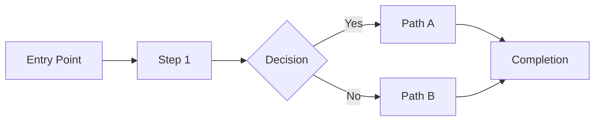

# Feature Spec Template

> **Purpose**: Define feature requirements before implementation. Lives in docs/database.
> **Use when**: Breaking down PRD features into implementable specifications.
> **Storage**: Database + Docs (referenced in GitHub Story issue)

---

## Template Structure

```markdown
# Feature Spec: {Feature Name}

## Metadata

| Field | Value |
|-------|-------|
| **Status** | `draft` / `review` / `approved` / `implemented` |
| **Author** | {name} |
| **PRD** | {PRD Title} - {Quarter} |
| **Created** | {date} |
| **Last Updated** | {date} |
| **GitHub Story** | #{story_number} (created after approval) |

---

## Executive Summary

### Problem
{1-2 sentences: What problem does this feature solve?}

### Solution
{1-2 sentences: How does this feature solve it?}

### Success Metrics

| Metric | Target | Measurement |
|--------|--------|-------------|
| {metric_1} | {target} | {how measured} |
| {metric_2} | {target} | {how measured} |

---

## User Context

### Primary User
| Attribute | Value |
|-----------|-------|
| Persona | {Gardener / Operator / Admin / Steward} |
| Goal | {What they want to achieve} |
| Current Pain | {What's frustrating now} |

### User Story
**As a** {persona}
**I want to** {capability}
**So that** {benefit}

### User Journey

| Step | Action | System Response | Notes |
|------|--------|-----------------|-------|
| 1 | {user action} | {system response} | {notes} |
| 2 | {user action} | {system response} | {notes} |
| 3 | {user action} | {system response} | {notes} |

---

## Functional Requirements

### Must Have (P0)
| ID | Requirement | Acceptance Criteria |
|----|-------------|---------------------|
| FR-1 | {requirement} | {how to verify} |
| FR-2 | {requirement} | {how to verify} |

### Should Have (P1)
| ID | Requirement | Acceptance Criteria |
|----|-------------|---------------------|
| FR-3 | {requirement} | {how to verify} |

### Could Have (P2)
| ID | Requirement | Acceptance Criteria |
|----|-------------|---------------------|
| FR-4 | {requirement} | {how to verify} |

### Won't Have (Out of Scope)
- {Explicit exclusion 1}
- {Explicit exclusion 2}

---

## Non-Functional Requirements

| Requirement | Target | Validation |
|-------------|--------|------------|
| Performance | {metric} | {how tested} |
| Accessibility | WCAG 2.1 AA | Axe audit |
| Offline Support | {Yes/No/Partial} | {how tested} |
| i18n | 3 languages | Key presence |

---

## Design

### Wireframes
{Link to Figma wireframes}

### User Flow


### Key Screens

| Screen | Purpose | Figma Link |
|--------|---------|------------|
| {Screen 1} | {purpose} | {link} |
| {Screen 2} | {purpose} | {link} |

---

## Data Requirements

### Inputs
| Field | Type | Validation | Required |
|-------|------|------------|----------|
| {field_1} | {type} | {rules} | Yes/No |
| {field_2} | {type} | {rules} | Yes/No |

### Outputs
| Data | Format | Use |
|------|--------|-----|
| {output_1} | {format} | {use} |
| {output_2} | {format} | {use} |

---

## Integration Points

### APIs
| API | Purpose | Owner |
|-----|---------|-------|
| {API 1} | {purpose} | {team} |

### External Systems
| System | Integration Type | Notes |
|--------|------------------|-------|
| {system} | {type} | {notes} |

---

## Edge Cases & Error Handling

| Scenario | Expected Behavior |
|----------|-------------------|
| {edge case 1} | {behavior} |
| {edge case 2} | {behavior} |
| {error condition} | {recovery} |

---

## Dependencies

| Dependency | Type | Status | Blocks |
|------------|------|--------|--------|
| {dep 1} | Internal | {status} | Yes/No |
| {dep 2} | External | {status} | Yes/No |

---

## Estimation

| Aspect | Estimate |
|--------|----------|
| Expected Hours | {hours} |
| Effort | {S/M/L/XL} |
| Sprints | {count} |
| Confidence | {High/Medium/Low} |

---

## Risks

| Risk | Probability | Impact | Mitigation |
|------|-------------|--------|------------|
| {risk 1} | {H/M/L} | {H/M/L} | {mitigation} |

---

## Related Documents

- **PRD**: {link}
- **Tech Spec**: {link} (if exists)
- **QA Test Cases**: {link} (if exists)
- **Design Mockups**: {figma link}

---

## Approval

| Role | Name | Date | Status |
|------|------|------|--------|
| Product Owner | {name} | {date} | {approved/pending} |
| Tech Lead | {name} | {date} | {approved/pending} |
| Design | {name} | {date} | {approved/pending} |

---

## Change Log

| Date | Author | Change |
|------|--------|--------|
| {date} | {author} | Initial draft |
```

---

## Feature Spec → GitHub Story

When a Feature Spec is approved, create a GitHub Story issue:

```bash
/ticket story --epic #{epic} \
  --spec-url "{feature_spec_url}" \
  --priority P1 \
  --scope multi \
  --expected-hours 40 \
  --effort L \
  "{Feature Name}"
```

The Story issue will:
1. Link to this Feature Spec
2. Include acceptance criteria from FR table
3. Track implementation tasks
4. Report estimated vs actual hours
