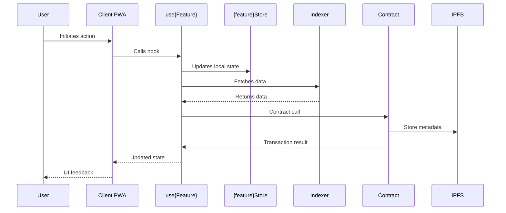

# Feature Template - Green Goods Extension

> This template extends the generic org-level feature template with Green Goods-specific sections.

## Template Structure

```markdown
# [FEATURE]: {Title}

## Priority
`critical` | `high` | `medium` | `low`

## Problem Statement
As a **{user type}**, I want **{action}** so that **{benefit}**.

## Acceptance Criteria
- [ ] {Criterion 1}
- [ ] {Criterion 2}
- [ ] {Criterion 3}

---

## Green Goods Context

### Package Detection
- [ ] client - PWA (port 3001)
- [ ] admin - Dashboard (port 3002)
- [ ] shared - Hooks & modules
- [ ] contracts - Solidity
- [ ] indexer - Envio GraphQL (port 8080)
- [ ] agent - Telegram bot

### Architecture Overview
```mermaid
flowchart LR
    subgraph Client
        V[{FeatureName} View] --> H[use{Feature} Hook]
    end
    subgraph Shared
        H --> S[{feature}Store]
        H --> GQL[GraphQL Query]
    end
    subgraph Backend
        GQL --> I[Indexer]
        S --> SC[Contract]
    end
    SC --> IPFS[IPFS]
```

### User Flow


---

## File Inventory

### Files to Create
| Type | Path | Pattern Reference | Validated |
|------|------|-------------------|-----------|
| Hook | `packages/shared/src/hooks/{domain}/use{Name}.ts` | `useGarden.ts` | ✓ |
| Hook Test | `packages/shared/src/__tests__/hooks/use{Name}.test.ts` | `useGarden.test.ts` | ✓ |
| View | `packages/client/src/views/{Feature}/index.tsx` | `Garden/index.tsx` | ✓ |
| Store | `packages/shared/src/stores/{name}Store.ts` | `gardenStore.ts` | ✓ |

### Files to Modify
| File | Change |
|------|--------|
| `packages/shared/src/hooks/index.ts` | Export new hook |
| `packages/client/src/routes.tsx` | Add route (if new view) |
| `packages/shared/src/i18n/en.json` | Add i18n keys |
| `packages/shared/src/i18n/es.json` | Add i18n keys |
| `packages/shared/src/i18n/pt.json` | Add i18n keys |

### Files to Delete
| File | Reason |
|------|--------|
| {none or list} | {reason} |

---

<details>
<summary>Technical Specification</summary>

### API Contracts

#### GraphQL Schema (if applicable)
```graphql
type {Feature} {
  id: ID!
  # ... fields
}

query Get{Feature}($id: ID!) {
  {feature}(id: $id) {
    id
  }
}
```

#### Hook API
```typescript
export interface Use{Name}Options {
  enabled?: boolean;
}

export interface Use{Name}Return {
  data: {Type} | undefined;
  isLoading: boolean;
  error: Error | null;
}

export function use{Name}(options?: Use{Name}Options): Use{Name}Return;
```

#### Store Schema (if applicable)
```typescript
interface {Feature}State {
  items: {Feature}[];
  selectedId: string | null;
}

interface {Feature}Actions {
  setSelected: (id: string) => void;
}
```

</details>

<details>
<summary>AI Implementation Notes</summary>

### Suggested Approach
1. {Step 1}
2. {Step 2}
3. {Step 3}

### GG Architecture Docs
- [Package Structure](CLAUDE.md#high-level-architecture)
- [Hook Boundary Rule](CLAUDE.md#key-architectural-patterns)
- [Contract Integration](packages/contracts/README.md)
- [Indexer Schema](packages/indexer/README.md)

### Deployment Artifacts
- Contracts: `packages/contracts/deployments/{chainId}-latest.json`
- Indexer: `https://indexer.green-goods.xyz/graphql`
- Supported chains: Base Sepolia (84532), Arbitrum (42161), Celo (42220)

### External Best Practices
- [TanStack Query Patterns](https://tanstack.com/query/latest/docs/react/guides/queries)
- [Wagmi Hooks](https://wagmi.sh/react/hooks)
- [Zustand Patterns](https://docs.pmnd.rs/zustand/getting-started/introduction)

</details>

---

## Offline Consideration
- [ ] Not applicable (online only)
- [ ] Queue action for sync when online
- [ ] Full offline support with IndexedDB

{If offline support needed:}
**Offline Implementation Notes:**
- Job type: `JobType.{FEATURE_ACTION}`
- Storage: IndexedDB table `{feature}`
- Sync strategy: {describe}

---

## Related Issues
{AI searches existing issues}
- #{issue} - {title} (relevance: high/medium/low)

---

## Effort Estimate
**AI Suggested:** {X hours / Y story points}
**Final Estimate:** {user confirms}

---

## CLAUDE.md Compliance
- [ ] Hooks ONLY in `packages/shared/src/hooks/`
- [ ] Contract addresses from deployment artifacts
- [ ] i18n keys in en.json, es.json, pt.json
- [ ] Test coverage: Client 70%, Shared 80%, Contracts 100%
- [ ] Conventional commit: `feat({scope}): {description}`

---

## Best Practices Reference
- [Clean Code Principles](https://github.com/ryanmcdermott/clean-code-javascript)
- [React Patterns](https://www.patterns.dev/react)
- [TanStack Query](https://tanstack.com/query/latest)
- [Conventional Commits](https://www.conventionalcommits.org/)
```

## Section Visibility

| Section | Visibility |
|---------|------------|
| Priority, Problem Statement | Always visible |
| Acceptance Criteria | Always visible |
| GG Context (Package) | Always visible |
| Architecture diagrams | Always visible |
| File Inventory | Always visible |
| Technical Specification | Collapsible |
| AI Implementation Notes | Collapsible |
| Offline Consideration | Always visible |
| Related Issues | Always visible |
| Effort Estimate | Always visible |
| Compliance | Always visible |

## Multi-Issue Breakdown Detection

If the feature involves multiple packages (e.g., contract + hook + UI), offer breakdown:

```
AI Analysis:
This feature has multiple distinct components:
1. Contract changes (contracts)
2. Hook implementation (shared)
3. UI implementation (client)
4. Documentation (docs)

Suggested breakdown:
├── #XXX [FEATURE]: Parent - {Feature Name}
│   ├── #XXX+1 [FEATURE]: {Feature} contract
│   ├── #XXX+2 [FEATURE]: use{Feature} hook
│   ├── #XXX+3 [FEATURE]: {Feature} view
│   └── #XXX+4 [DOCS]: {Feature} documentation
```
