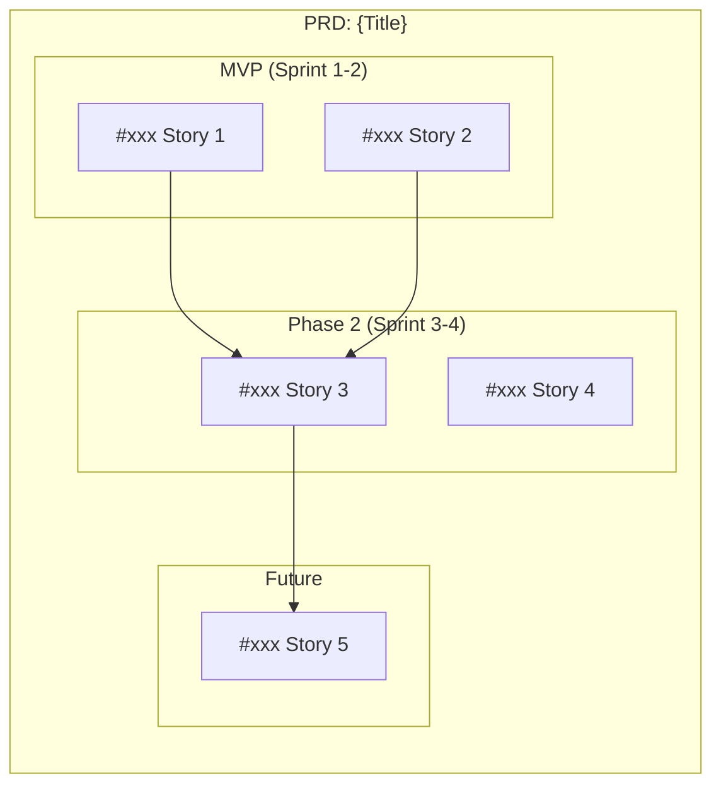
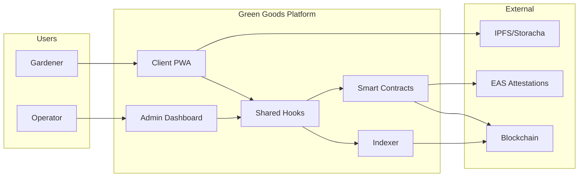
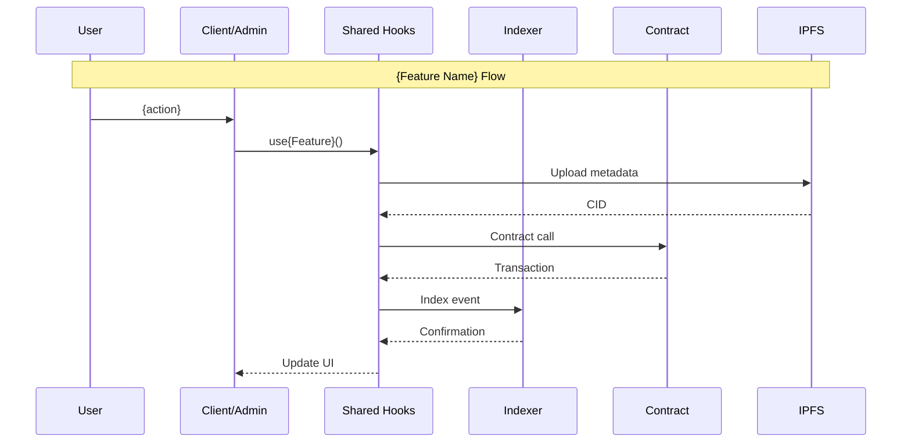
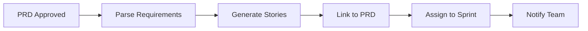
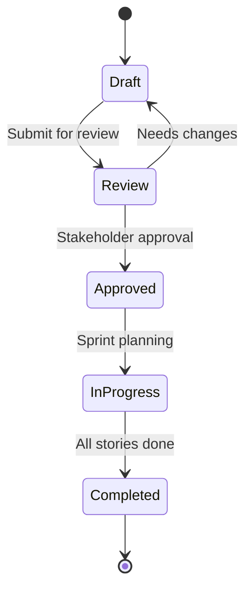

# PRD (Product Requirements Document) Template

> **Purpose**: Epic-level planning document that breaks down into user stories.
> **Use when**: Planning major features, initiatives, or product areas.
> **Hierarchy**: **PRD (Epic)** → Story → Feature Task(s)

---

## Template Structure

```markdown
# [PRD]: {Feature/Initiative Name}

## Metadata

| Field | Value |
|-------|-------|
| **Status** | `draft` / `review` / `approved` / `in-progress` / `completed` |
| **Owner** | {Product Owner} |
| **Tech Lead** | {Technical Lead} |
| **Target Release** | {Sprint/Quarter} |
| **Last Updated** | {Date} |

## Labels
`epic`, `prd`, `{priority}`, `{area}`

---

## Executive Summary

### Problem Statement
{2-3 sentences describing the problem this PRD solves}

### Proposed Solution
{2-3 sentences describing the high-level solution}

### Success Metrics

| Metric | Current | Target | Measurement |
|--------|---------|--------|-------------|
| {metric_1} | {baseline} | {goal} | {how to measure} |
| {metric_2} | {baseline} | {goal} | {how to measure} |
| {metric_3} | {baseline} | {goal} | {how to measure} |

---

## Background & Context

### Why Now?
{Business/product context driving this initiative}

### User Research
{Key findings from user interviews, feedback, analytics}

### Market Context
{Competitive landscape, industry trends if relevant}

### Technical Context
{Existing system constraints, dependencies, tech debt considerations}

---

## User Personas

### Primary Persona: {Name}

| Attribute | Description |
|-----------|-------------|
| **Role** | {Gardener / Operator / Admin / Steward} |
| **Goals** | {Primary objectives} |
| **Pain Points** | {Current frustrations} |
| **Technical Level** | {Low / Medium / High} |
| **Frequency of Use** | {Daily / Weekly / Monthly} |

### Secondary Personas
- **{Persona 2}**: {Brief description}
- **{Persona 3}**: {Brief description}

---

## Requirements

### Functional Requirements

| ID | Requirement | Priority | Story Link |
|----|-------------|----------|------------|
| FR-1 | {requirement} | Must | #{story_num} |
| FR-2 | {requirement} | Must | #{story_num} |
| FR-3 | {requirement} | Should | #{story_num} |
| FR-4 | {requirement} | Could | #{story_num} |

### Non-Functional Requirements

| ID | Requirement | Target | Validation |
|----|-------------|--------|------------|
| NFR-1 | Performance | {metric} | {test method} |
| NFR-2 | Accessibility | WCAG 2.1 AA | Axe audit |
| NFR-3 | Offline Support | {level} | Manual test |
| NFR-4 | Security | {standard} | Security review |

---

## User Stories

### Story Map



### Story Breakdown

| # | Story | Type | Points | Sprint | Status |
|---|-------|------|--------|--------|--------|
| #{num} | {Story title} | user-facing | {1-13} | {sprint} | {status} |
| #{num} | {Story title} | technical | {1-13} | {sprint} | {status} |
| #{num} | {Story title} | enabler | {1-13} | {sprint} | {status} |

### Story Creation Commands

```bash
# Create stories from this PRD
/ticket story --prd #{this_issue} "{Story title}"

# Batch create MVP stories
/ticket story --prd #{this_issue} --batch "
  Story 1 title
  Story 2 title
  Story 3 title
"
```

---

## Architecture Overview

### System Context



### Data Flow



### Package Impact Matrix

| Package | Impact | Changes |
|---------|--------|---------|
| `contracts` | {High/Medium/Low/None} | {summary} |
| `indexer` | {High/Medium/Low/None} | {summary} |
| `shared` | {High/Medium/Low/None} | {summary} |
| `client` | {High/Medium/Low/None} | {summary} |
| `admin` | {High/Medium/Low/None} | {summary} |
| `agent` | {High/Medium/Low/None} | {summary} |

---

## Technical Considerations

### New Components

| Component | Package | Pattern Reference |
|-----------|---------|-------------------|
| `use{Feature}` | shared | `useGarden.ts` |
| `{Feature}View` | client | `Garden/index.tsx` |
| `{Feature}Store` | shared | `gardenStore.ts` |
| `{Feature}.sol` | contracts | Existing module |

### Database/Indexer Schema

```typescript
// packages/indexer/ponder.schema.ts additions

export const {Feature} = onchainTable("{feature}", (t) => ({
  id: t.text().primaryKey(),
  // ... fields
}));
```

### API Changes

| Endpoint/Query | Type | Description |
|----------------|------|-------------|
| `get{Feature}` | GraphQL Query | {description} |
| `get{Feature}s` | GraphQL Query | {description} |

### Security Considerations

| Risk | Mitigation | Owner |
|------|------------|-------|
| {risk_1} | {mitigation} | {owner} |
| {risk_2} | {mitigation} | {owner} |

---

## Design

### Design Assets

| Asset | Link | Status |
|-------|------|--------|
| User Flows | {Figma link} | {status} |
| Wireframes | {Figma link} | {status} |
| High-Fidelity Mockups | {Figma link} | {status} |
| Prototype | {Figma link} | {status} |

### Key Screens

> Reference Figma designs. Extract with:
> `/figma:implement-design {Figma URL}`

---

## Release Plan

### MVP (Minimum Viable Product)

**Goal**: {What MVP achieves}

**Stories Included**:
- #{story_1}
- #{story_2}

**Not Included**:
- {Deferred feature 1}
- {Deferred feature 2}

### Milestones

| Milestone | Target Date | Stories | Status |
|-----------|-------------|---------|--------|
| Design Complete | {date} | - | {status} |
| MVP Development | {date} | #{s1}, #{s2} | {status} |
| MVP Testing | {date} | - | {status} |
| Phase 2 | {date} | #{s3}, #{s4} | {status} |
| Full Release | {date} | All | {status} |

### Rollout Strategy

| Phase | Audience | Criteria |
|-------|----------|----------|
| Alpha | Internal team | {criteria} |
| Beta | Select gardens | {criteria} |
| GA | All users | {criteria} |

---

## Risks & Mitigations

| Risk | Probability | Impact | Mitigation | Owner |
|------|-------------|--------|------------|-------|
| {risk_1} | {H/M/L} | {H/M/L} | {mitigation} | {owner} |
| {risk_2} | {H/M/L} | {H/M/L} | {mitigation} | {owner} |
| {risk_3} | {H/M/L} | {H/M/L} | {mitigation} | {owner} |

---

## Dependencies

### Internal Dependencies

| Dependency | Type | Status | Blocks |
|------------|------|--------|--------|
| #{issue} - {title} | PRD/Story | {status} | {stories} |

### External Dependencies

| Dependency | Type | Owner | Status |
|------------|------|-------|--------|
| {service/API} | External | {owner} | {status} |

---

## Estimation Summary

| Metric | Value |
|--------|-------|
| **Total Story Points** | {sum} |
| **Estimated Sprints** | {count} |
| **Team Size** | {count} |
| **Confidence** | {High/Medium/Low} |

### Breakdown by Phase

| Phase | Points | Hours | Sprints |
|-------|--------|-------|---------|
| MVP | {pts} | {hrs} | {sprints} |
| Phase 2 | {pts} | {hrs} | {sprints} |
| Future | {pts} | {hrs} | {sprints} |

---

## Appendix

### Glossary

| Term | Definition |
|------|------------|
| {term_1} | {definition} |
| {term_2} | {definition} |

### References

- [Related PRD/Epic](link)
- [Design System](link)
- [Technical Spec](link)
- [User Research](link)

### Change Log

| Date | Author | Change |
|------|--------|--------|
| {date} | {author} | Initial draft |
| {date} | {author} | {change description} |

---

## Agent Workflow

### Story Generation Flow

When this PRD is approved, n8n triggers automatic story generation:



### Auto-Generated Stories

Based on functional requirements, the system will create:

| FR ID | Generated Story | Agent Action |
|-------|-----------------|--------------|
| FR-1 | #{auto} | Create feature tasks |
| FR-2 | #{auto} | Create feature tasks |

### Manual Story Creation

```bash
# Create a story linked to this PRD
/ticket story --prd #{this_issue} "As a gardener, I want to..."

# Create a technical story
/ticket story --prd #{this_issue} --type technical "Enable offline sync for {feature}"
```
```

---

## PRD Status Workflow



---

## When to Use This Template

| Scenario | Use PRD Template? |
|----------|-------------------|
| Major new feature (2+ sprints) | Yes |
| Cross-team initiative | Yes |
| Significant user journey change | Yes |
| Simple feature (1 sprint) | No - use story directly |
| Bug fix | No - use bug.md |
| Technical debt | Maybe - if large scope |

---

## Labels

Primary: `epic`, `prd`

Additional:
- Status: `status:draft`, `status:approved`, `status:in-progress`
- Priority: `P0`, `P1`, `P2`, `P3`
- Area: Package labels based on impact
