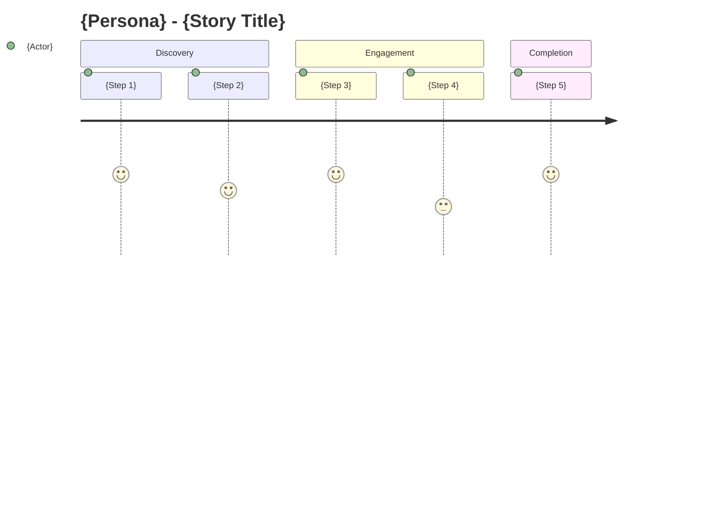

# User Story Template

> **Purpose**: Create product-focused user stories that link to PRDs and spawn feature tasks.
> **Use when**: Breaking down PRDs into user-deliverable value, capturing product requirements.
> **Hierarchy**: PRD (Epic) → **Story** → Feature Task(s)

---

## Template Structure

```markdown
# [STORY]: {Title}

## Epic/PRD Reference
- **Epic**: #{prd_issue_number} - {PRD Title}
- **Epic URL**: {link to PRD issue}

## Story Type
`user-facing` | `technical` | `enabler`

## Priority
`critical` | `high` | `medium` | `low`

---

## User Story

**As a** {persona}
**I want to** {action/capability}
**So that** {benefit/value}

### Persona Definition
| Attribute | Value |
|-----------|-------|
| Role | {Gardener / Operator / Admin / Steward} |
| Technical Level | {Low / Medium / High} |
| Primary Goal | {What they're trying to achieve} |
| Key Frustration | {Pain point this story addresses} |

---

## Acceptance Criteria

### Functional Requirements

| # | Given | When | Then | Priority |
|---|-------|------|------|----------|
| 1 | {precondition} | {action} | {expected result} | Must |
| 2 | {precondition} | {action} | {expected result} | Must |
| 3 | {precondition} | {action} | {expected result} | Should |
| 4 | {precondition} | {action} | {expected result} | Could |

### Non-Functional Requirements

| Requirement | Target | Measurement |
|-------------|--------|-------------|
| Performance | {e.g., < 2s load time} | Lighthouse score / manual |
| Accessibility | WCAG 2.1 AA | Axe audit |
| Offline Support | {Yes/No/Partial} | Manual test |
| i18n | 3 languages (en, es, pt) | Key presence check |

---

## User Journey



### Journey Touchpoints

| Step | Screen/View | User Action | System Response |
|------|-------------|-------------|-----------------|
| 1 | {view} | {action} | {response} |
| 2 | {view} | {action} | {response} |
| 3 | {view} | {action} | {response} |

---

## Scope Boundaries

### In Scope
- {Specific functionality 1}
- {Specific functionality 2}
- {Specific functionality 3}

### Out of Scope
- {Explicitly excluded 1}
- {Explicitly excluded 2}
- {Deferred to future story}

### Dependencies
| Dependency | Type | Status | Blocks |
|------------|------|--------|--------|
| {Story/Feature} | Internal | {status} | {Yes/No} |
| {External API} | External | {status} | {Yes/No} |
| {Design} | Design | {status} | {Yes/No} |

---

## Feature Tasks

> Stories break down into Feature Tasks for implementation.
> Each task should be independently shippable or testable.

### Task Breakdown

| Task | Type | Complexity | Assignee | Status |
|------|------|------------|----------|--------|
| #{task_1} | `hook` | S | {agent/human} | pending |
| #{task_2} | `view` | M | {agent/human} | pending |
| #{task_3} | `contract` | M | {agent/human} | pending |
| #{task_4} | `test` | S | {agent/human} | pending |

### Task Creation Commands

```bash
# Create feature task linked to this story
/ticket feature --story #{this_issue} "{Task title}"

# Create hook task
/ticket hook --story #{this_issue} "Create use{Feature} hook"

# Create contract task
/ticket contract --story #{this_issue} "Add {function} to {Contract}"
```

---

## Package Impact

- [ ] `packages/client` - {specific changes}
- [ ] `packages/admin` - {specific changes}
- [ ] `packages/shared` - {specific changes}
- [ ] `packages/contracts` - {specific changes}
- [ ] `packages/indexer` - {specific changes}
- [ ] `packages/agent` - {specific changes}

---

## Design Assets

| Asset | Link | Status |
|-------|------|--------|
| Figma Mockup | {link} | {Ready/In Progress/Needed} |
| User Flow | {link} | {Ready/In Progress/Needed} |
| Prototype | {link} | {Ready/In Progress/Needed} |

---

## Definition of Done

- [ ] All acceptance criteria verified
- [ ] Feature tasks completed and merged
- [ ] Tests passing (coverage targets met)
- [ ] i18n keys added for all 3 languages
- [ ] Design reviewed and approved
- [ ] Product Owner sign-off
- [ ] Documentation updated (if user-facing)
- [ ] Deployed to staging for UAT

---

## Effort Estimate

| Dimension | Estimate |
|-----------|----------|
| Story Points | {1/2/3/5/8/13} |
| Total Hours | {X hours} |
| Sprint Fit | {Yes - single sprint / No - needs breakdown} |

**Sizing Rationale**: {Why this size}

---

## Related Items

### Parent Epic/PRD
- #{prd_issue} - {PRD Title}

### Sibling Stories (same epic)
- #{story_1} - {title}
- #{story_2} - {title}

### Child Feature Tasks
- #{feature_1} - {title}
- #{feature_2} - {title}

### Related Issues
- #{issue} - {title} (relevance: {high/medium/low})

---

## Agent Assignment

| Agent | Use For | Trigger |
|-------|---------|---------|
| **Codex** | Feature implementation | `@codex` comment |
| **Claude Code** | Bugs, polish, docs | `@claude` comment |
| **Cursor** | Investigation, scaffolding | `@cursor` comment |

### Auto-Dispatch Rules

Story complexity determines agent assignment:
- **Simple** (1-2 tasks, S/M complexity) → Auto-dispatch to Codex
- **Medium** (3-4 tasks, M complexity) → Codex with human review
- **Complex** (5+ tasks, L/XL complexity) → Human breakdown first

---

## CLAUDE.md Compliance

- [ ] Hooks ONLY in `packages/shared/src/hooks/`
- [ ] Contract addresses from deployment artifacts
- [ ] i18n keys in en.json, es.json, pt.json
- [ ] Test coverage targets met
- [ ] Conventional commit format used
- [ ] No package-specific .env files
```

---

## Story Types

| Type | Description | Example |
|------|-------------|---------|
| `user-facing` | Direct user value delivery | "Submit conservation work" |
| `technical` | Infrastructure/enablement | "Add offline sync for work" |
| `enabler` | Enables future stories | "Set up garden permissions" |

---

## Relationship Patterns

### One Story → One Feature
```
PRD #100: Garden Management
└── Story #101: Create garden
    └── Feature #102: useCreateGarden hook
```

### One Story → Multiple Features
```
PRD #100: Work Documentation
└── Story #110: Submit work with photos
    ├── Feature #111: useWork hook
    ├── Feature #112: Work submission view
    └── Feature #113: IPFS photo upload
```

### Multiple Stories → Shared Feature
```
PRD #100: Offline Support
├── Story #120: Offline work submission
│   └── Feature #125: Job queue system (shared)
└── Story #121: Offline garden viewing
    └── Feature #125: Job queue system (shared)
```

---

## When to Use This Template

| Scenario | Use Story Template? |
|----------|---------------------|
| Breaking down PRD into deliverables | Yes |
| User-focused product increment | Yes |
| Multiple features needed | Yes |
| Single isolated bug fix | No - use bug.md |
| Quick polish/refinement | No - use polish.md |
| Pure technical task | Maybe - consider task.md |

---

## Labels

Primary: `story`

Additional (auto-detected):
- `user-facing`, `technical`, or `enabler`
- Package labels based on impact
- Priority label (P0-P3)
