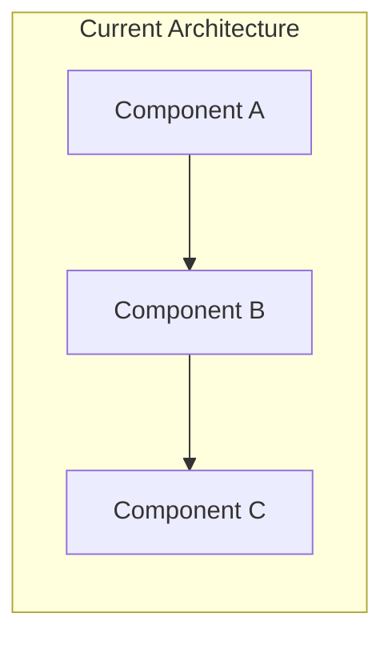
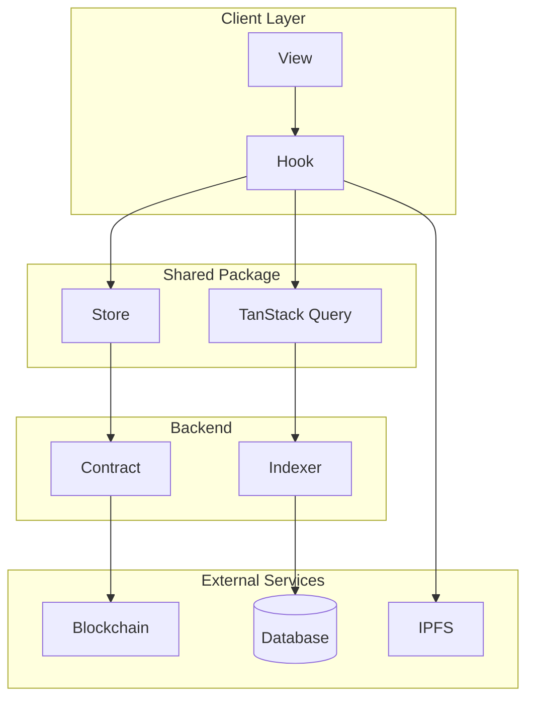

# Technical Specification Template

> **Purpose**: Detailed technical design document linked to PRDs/Stories before implementation.
> **Use when**: Complex features need architectural decisions documented before coding.
> **Hierarchy**: PRD → **Tech Spec** → Story → Feature Task

---

## Template Structure

```markdown
# [SPEC]: {Feature Name} - Technical Specification

## Metadata

| Field | Value |
|-------|-------|
| **Status** | `draft` / `review` / `approved` / `implemented` |
| **Author** | {name} |
| **Reviewers** | {names} |
| **PRD** | #{prd_number} |
| **Stories** | #{story_1}, #{story_2} |
| **Created** | {date} |
| **Last Updated** | {date} |

## Labels
`tech-spec`, `{area}`, `{priority}`

---

## Overview

### Problem Summary
{1-2 paragraphs describing the technical problem to solve}

### Goals
- {Goal 1}
- {Goal 2}
- {Goal 3}

### Non-Goals
- {Explicitly not solving X}
- {Out of scope: Y}

### Success Criteria
| Metric | Target | Measurement |
|--------|--------|-------------|
| {metric} | {target} | {how to measure} |

---

## Background

### Current State
{Description of how the system works today}



### Pain Points
1. {Current limitation 1}
2. {Current limitation 2}
3. {Current limitation 3}

### Prior Art / Research
| Solution | Pros | Cons | Link |
|----------|------|------|------|
| {option 1} | {pros} | {cons} | {link} |
| {option 2} | {pros} | {cons} | {link} |

---

## Proposed Solution

### Architecture Overview



### Component Design

#### {Component 1}: {Name}

**Purpose**: {What this component does}

**Location**: `packages/{package}/src/{path}/{file}.ts`

**Interface**:
```typescript
interface {Component}Props {
  // Props definition
}

interface {Component}Return {
  // Return type definition
}
```

**Behavior**:
1. {Behavior 1}
2. {Behavior 2}
3. {Behavior 3}

**Error Handling**:
| Error | Code | Recovery |
|-------|------|----------|
| {error} | {code} | {recovery action} |

---

#### {Component 2}: {Name}

{Repeat structure for each component}

---

### Data Model

#### New Entities

```typescript
// Entity: {Name}
interface {Entity} {
  id: string;
  // fields...
  createdAt: bigint;
  updatedAt: bigint;
}
```

#### Schema Changes

```typescript
// packages/indexer/ponder.schema.ts

export const {Entity} = onchainTable("{entity}", (t) => ({
  id: t.text().primaryKey(),
  // fields...
}));

// Indexes
export const {entity}Idx = index("{entity}_idx")
  .on({Entity}.fieldName);
```

#### Migrations (if applicable)
```sql
-- Migration: add_{entity}_table
CREATE TABLE {entity} (
  id TEXT PRIMARY KEY,
  -- fields...
);
```

---

### API Design

#### GraphQL Queries

```graphql
# Get single {entity}
query Get{Entity}($id: String!) {
  {entity}(id: $id) {
    id
    # fields...
  }
}

# List {entities}
query List{Entities}($filter: {Entity}Filter, $limit: Int, $after: String) {
  {entities}(where: $filter, limit: $limit, after: $after) {
    items {
      id
      # fields...
    }
    pageInfo {
      hasNextPage
      endCursor
    }
  }
}
```

#### Contract Interface

```solidity
// packages/contracts/src/interfaces/I{Feature}.sol

interface I{Feature} {
    /// @notice {Description}
    /// @param {param} {description}
    /// @return {return description}
    function {functionName}({params}) external returns ({returnType});

    /// @notice Emitted when {event description}
    event {EventName}({params});
}
```

---

### State Management

#### Zustand Store

```typescript
// packages/shared/src/stores/{feature}Store.ts

interface {Feature}State {
  // State shape
  items: Map<string, {Entity}>;
  selectedId: string | null;
  filter: {Feature}Filter;
}

interface {Feature}Actions {
  // Actions
  setSelected: (id: string | null) => void;
  setFilter: (filter: Partial<{Feature}Filter>) => void;
  hydrate: (items: {Entity}[]) => void;
}
```

#### Query Keys

```typescript
export const {feature}Keys = {
  all: ['{feature}'] as const,
  lists: () => [...{feature}Keys.all, 'list'] as const,
  list: (filter: string) => [...{feature}Keys.lists(), filter] as const,
  details: () => [...{feature}Keys.all, 'detail'] as const,
  detail: (id: string) => [...{feature}Keys.details(), id] as const,
};
```

---

### Offline Support

#### Job Queue Integration

```typescript
// New job types
export enum JobType {
  // ... existing
  CREATE_{FEATURE} = 'CREATE_{FEATURE}',
  UPDATE_{FEATURE} = 'UPDATE_{FEATURE}',
}

// Job handler
export async function handle{Feature}Job(job: Job): Promise<void> {
  switch (job.type) {
    case JobType.CREATE_{FEATURE}:
      // Handle offline create
      break;
  }
}
```

#### IndexedDB Cache

```typescript
// Cache strategy
const cacheConfig = {
  storeName: '{feature}',
  maxAge: 24 * 60 * 60 * 1000, // 24 hours
  syncOnReconnect: true,
};
```

#### Sync Strategy

| Operation | Online | Offline | Reconnect |
|-----------|--------|---------|-----------|
| Read | Fetch fresh | Return cache | Background refresh |
| Create | Immediate | Queue job | Process queue |
| Update | Immediate | Queue job | Process queue |
| Delete | Immediate | Queue job | Process queue |

---

### Security Considerations

#### Authentication & Authorization

| Action | Required Role | Check Location |
|--------|---------------|----------------|
| {action} | {role} | {hook/contract} |

#### Input Validation

| Field | Validation | Error Code |
|-------|------------|------------|
| {field} | {rules} | {code} |

#### Contract Security

- [ ] CEI pattern followed
- [ ] Reentrancy protection
- [ ] Access control implemented
- [ ] Input validation
- [ ] Event emission
- [ ] No tx.origin usage

---

### Performance Considerations

#### Expected Load

| Metric | Expected | Peak |
|--------|----------|------|
| Queries/sec | {value} | {value} |
| Data size | {value} | {value} |

#### Optimization Strategies

1. **Caching**: {strategy}
2. **Pagination**: {approach}
3. **Indexing**: {indexes needed}

#### Gas Optimization (contracts)

| Function | Expected Gas | Optimization |
|----------|--------------|--------------|
| {function} | {gas} | {optimization} |

---

### Testing Strategy

#### Unit Tests

| Component | File | Coverage Target |
|-----------|------|-----------------|
| Hook | `use{Feature}.test.ts` | 80% |
| Store | `{feature}Store.test.ts` | 80% |
| Contract | `{Feature}.t.sol` | 100% |

#### Integration Tests

| Scenario | Test File |
|----------|-----------|
| {scenario} | `{file}.test.ts` |

#### E2E Tests

| Flow | Test File |
|------|-----------|
| {user flow} | `{feature}.spec.ts` |

---

### Rollout Plan

#### Feature Flags

```typescript
const FEATURE_FLAGS = {
  {FEATURE}_ENABLED: process.env.VITE_{FEATURE}_ENABLED === 'true',
};
```

#### Phases

| Phase | Scope | Criteria |
|-------|-------|----------|
| Alpha | Internal | {criteria} |
| Beta | 10% users | {criteria} |
| GA | All users | {criteria} |

#### Rollback Plan

1. {Step 1}
2. {Step 2}
3. {Step 3}

---

### Alternatives Considered

#### Option A: {Name}

**Description**: {description}

**Pros**:
- {pro 1}
- {pro 2}

**Cons**:
- {con 1}
- {con 2}

**Why not chosen**: {reason}

#### Option B: {Name}

{Same structure}

---

### Open Questions

| # | Question | Owner | Status | Resolution |
|---|----------|-------|--------|------------|
| 1 | {question} | {owner} | {open/resolved} | {resolution} |
| 2 | {question} | {owner} | {open/resolved} | {resolution} |

---

### Dependencies

#### Internal

| Dependency | Type | Status |
|------------|------|--------|
| #{issue} | PRD/Story | {status} |

#### External

| Dependency | Owner | Status |
|------------|-------|--------|
| {service} | {team} | {status} |

---

### Timeline

| Milestone | Target Date | Stories |
|-----------|-------------|---------|
| Spec approved | {date} | - |
| Implementation start | {date} | #{stories} |
| Alpha release | {date} | - |
| GA release | {date} | - |

---

### References

- [PRD](#{prd_number})
- [Design Mockups]({figma_link})
- [Related Spec]({link})
- [External Documentation]({link})

---

### Appendix

#### Glossary

| Term | Definition |
|------|------------|
| {term} | {definition} |

#### Change Log

| Date | Author | Change |
|------|--------|--------|
| {date} | {author} | Initial draft |
```

---

## When to Create a Tech Spec

| Scenario | Tech Spec Needed? |
|----------|-------------------|
| New API/contract interface | ✅ Yes |
| Database schema changes | ✅ Yes |
| Complex state management | ✅ Yes |
| Security-sensitive feature | ✅ Yes |
| Multi-package feature | ✅ Yes |
| Simple UI change | ❌ No |
| Bug fix | ❌ No |
| Documentation update | ❌ No |

---

## Linking Convention

```markdown
**Tech Spec**: #{spec_number}
**PRD**: #{prd_number}
**Stories**: #{story_1}, #{story_2}
```

---

## Labels

Primary: `tech-spec`

Additional:
- Status: `status:draft`, `status:review`, `status:approved`
- Area: Package labels based on impact
- Priority: `P0`, `P1`, `P2`, `P3`
