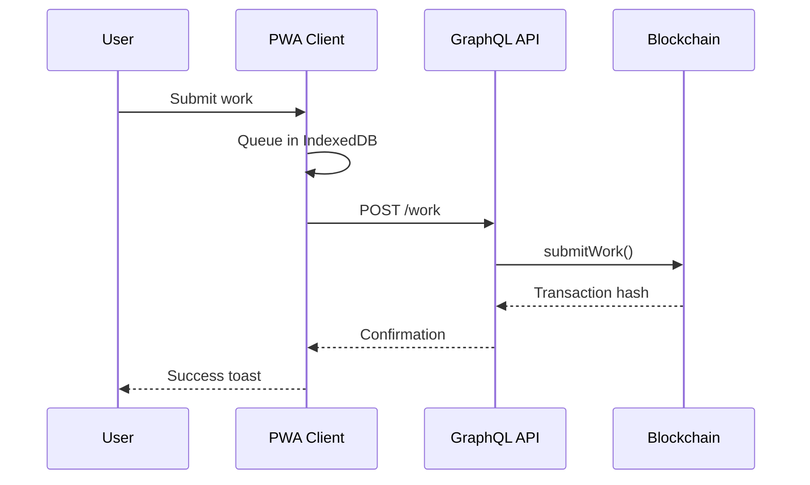
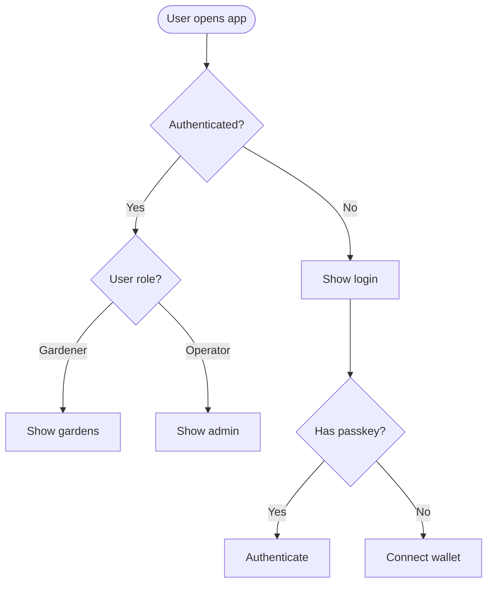
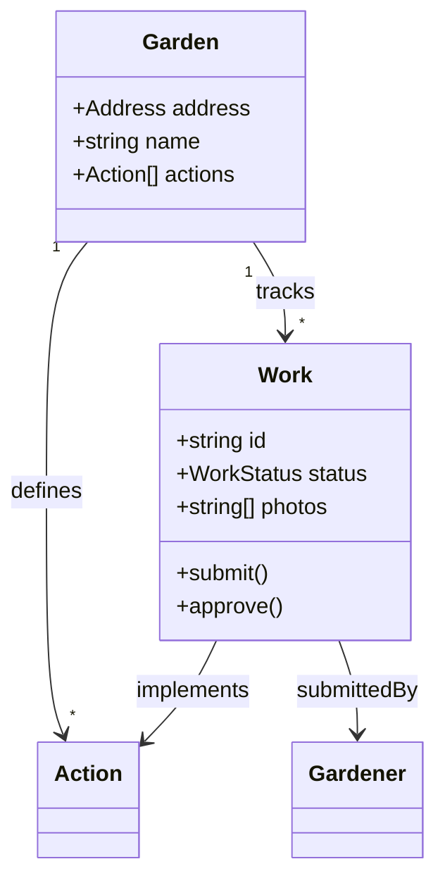
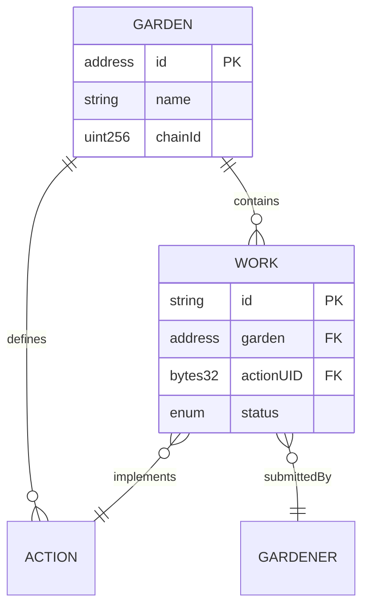
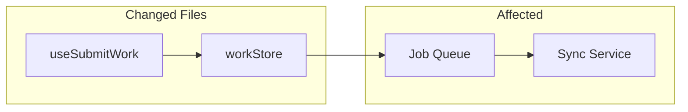

# Mermaid Diagramming

Create professional software diagrams using Mermaid's text-based syntax. Diagrams are version-controllable and maintainable alongside code.

## Activation

When invoked:
- Pick a diagram type that matches the question (sequence, flowchart, state).
- Keep labels short and unambiguous.
- Prefer simple diagrams unless the user requests detail.

## Diagram Type Selection

**All diagram types render in Markdown** (GitHub, GitLab, docs, PRs):

| Type | Use Case |
|------|----------|
| **Flowchart/Graph** | Processes, algorithms, decision trees |
| **Sequence Diagram** | API flows, authentication, component interactions |
| **State Diagram** | State machines, lifecycle states |
| **Gantt** | Timelines, project scheduling |
| **Class Diagram** | Domain modeling, OOP design, entity relationships |
| **ERD** | Database schemas, table relationships |

## Quick Examples

### Sequence Diagram (API Flow)



### Flowchart (User Journey)



### Class Diagram (Domain Model)



### ERD (Database Schema)



## Green Goods Integration

### Use in Code Review (Pass 0)

When reviewing changes, create a diagram showing:
- What components are affected
- How data flows through the system
- What dependencies are involved



### Canonical Diagrams Reference

When documenting cross-package flows, reference or update the centralized diagrams:

**Location:** `docs/developer/architecture/diagrams.md`

Before creating new diagrams, check if an existing one covers the flow:
- System Context → Package relationships
- Work Submission → `useSubmitWork`, `workStore`, offline queue
- Work Approval → Admin flows, resolver changes
- Auth Flow → Passkey/wallet authentication

Update the canonical diagrams when architectural changes are made.

### Use in Planning

Before implementing a feature, diagram:
- Component interactions
- State transitions
- API flow

## Decision Tree

```
What diagram?
│
├─► API/component interaction? ──► Sequence Diagram
│                                   → Participants = services/components
│                                   → Arrows = calls/responses
│
├─► Process/algorithm/decision? ─► Flowchart (graph)
│                                   → Nodes = steps/decisions
│                                   → Edges = flow direction
│                                   → Use LR for horizontal, TD for vertical
│
├─► Lifecycle/state transitions? ► State Diagram
│                                   → States = entity states
│                                   → Transitions = events/actions
│                                   → Good for job queue, work status
│
├─► Domain modeling/types? ──────► Class Diagram
│                                   → Classes = domain entities
│                                   → Relationships = associations
│
├─► Database schema? ────────────► ERD
│                                   → Entities = tables/collections
│                                   → Relationships = foreign keys
│
└─► Timeline/schedule? ──────────► Gantt
                                    → Tasks = milestones
                                    → Sections = phases
```

## Best Practices

1. **Start simple** - Core entities first, details later
2. **Clear labels** - Self-documenting names
3. **One concept per diagram** - Split large diagrams
4. **Comment complex parts** - Use `%%` for explanations
5. **Version with code** - Store `.mmd` files alongside source

## Rendering

**Supported platforms:**
- GitHub/GitLab Markdown (native)
- VS Code (with Mermaid extension)
- Notion, Obsidian, Confluence
- [Mermaid Live Editor](https://mermaid.live) - Interactive preview

**Export options:**
- [Mermaid Live Editor](https://mermaid.live) - PNG/SVG export
- CLI: `npx @mermaid-js/mermaid-cli -i input.mmd -o output.png`
- Miro MCP: Available for architecture diagrams and collaborative planning (via `miro` MCP server)

## Related Skills

- `architecture` — System design decisions that diagrams document
- `review` — Change impact diagrams used in Pass 0 of code reviews
- `xstate` — State machine diagrams for workflow visualization
- `plan` — Diagrams used in implementation plans
