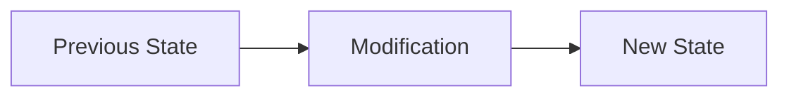

# Review Skill

Complete code review workflow: request reviews, perform 6-pass analysis, and process feedback with technical rigor.

## Activation

Use when:
- Reviewing PRs before merge (`/review`)
- After completing implementation
- Processing PR feedback
- Before marking task complete

## Agent Routing

| Scenario | Agent | Why |
|----------|-------|-----|
| PR review with GitHub posting | `code-reviewer` | 6-pass protocol, auto-posts to GitHub |
| Need to understand code first | `oracle` | Research before reviewing |
| Fixing review feedback | `cracked-coder` | Implementation with tracking |
| Simple feedback fixes | Direct (no agent) | Faster turnaround |

**Invocation**: Say "use code-reviewer for PR #X" or spawn via Task tool.

---

## Progress Tracking (REQUIRED)

**Every review workflow MUST use TodoWrite for visibility and session continuity.**

### For Code Reviews
```
1. Todo: "Reviewing PR #X - Pass 0: Change explanation" → in_progress
2. After each pass: mark completed, start next pass
3. Todo: "Post review to GitHub" → in_progress → completed
```

### For Processing Feedback
```
1. Todo: "Review feedback item 1: [summary]" → in_progress
2. After addressing: mark completed
3. Continue through all feedback items
```

### Why This Matters
- **Team visibility**: Others see review progress
- **Resumable**: Can continue review if interrupted
- **Audit trail**: Shows what was checked

---

## Part 1: Perform Code Review (6-Pass Protocol)

### Core Principle

> YOU DO NOT LET THINGS SLIP. YOU DESIRE ONLY PERFECTION.

### Pass 0: Change Explanation

Document the changes with Mermaid diagram:


### Pass 0.5: Issue Coverage (MANDATORY)

Before technical review:

| Requirement | Implementation | Status |
|-------------|----------------|--------|
| User can X | `file.ts:42` | DONE |
| API returns Y | Missing | NOT DONE |

**If coverage < 100%: STOP. Request changes immediately.**

### Pass 1: Technical Issues

Hunt for runtime/compile failures:
- Type errors
- Null/undefined handling
- Missing error handling
- API contract violations
- Race conditions

### Pass 2: Code Consistency

- Follows existing codebase style
- Dead code introduced
- Duplicate logic
- Naming conventions

### Pass 3: Architecture

- Proper abstractions
- Layer violations
- Green Goods conventions:
  - Hooks in shared package only
  - No package-specific .env
  - Contract addresses from artifacts

### Pass 4: Environment Compatibility

- Platform compatibility
- Browser support (PWA)
- Offline behavior impact

### Pass 5: Verification Strategy

```bash
bun run tsc --noEmit
bun lint
bun test
bun build
bash .claude/scripts/validate-hook-location.sh
node .claude/scripts/check-i18n-completeness.js
```

### Pass 6: Synthesis

**Recommendation**: APPROVE or REQUEST CHANGES

---

## Part 2: Review Output Format

```markdown
## Code Review: [PR Title]

### Change Explanation
[Summary with Mermaid diagram]

### Issue Coverage
| Requirement | Status |
|-------------|--------|
Coverage: X/Y (Z%)

### Critical (Blocking)
- [Issue] - `file.ts:123` - [Fix suggestion]

### High Priority
- [Issue] - `file.ts:456` - [Fix suggestion]

### Medium Priority
- [Issue] - `file.ts:789` - [Fix suggestion]

### Suggested Checks
```bash
[Commands to run]
```

### Recommendation
**[APPROVE / REQUEST CHANGES]**
**Reason**: [Explanation]
```

### Mandatory GitHub Posting

```bash
gh pr comment [PR_NUMBER] --body "[review content]"
```

---

## Part 3: Request Review

### When Mandatory
- After completing major features
- Before merge to main
- After contract changes (always)

### Prepare for Review

```bash
git log main..HEAD --oneline
bun build
bun test
bun lint
```

### Link to GitHub Issue

If work addresses an issue:

1. **Find related issue**:
   ```bash
   gh issue list --search "[keywords]"
   gh issue view [NUMBER] --json title,body,labels
   ```

2. **Include in PR description**:
   ```markdown
   ## Related Issue
   Closes #123

   ## Issue Acceptance Criteria Coverage
   | AC | Description | Status |
   |----|-------------|--------|
   | 1  | User can X  | ✅     |
   | 2  | System does Y | ✅   |
   ```

3. **Use conventional commit with issue**:
   ```bash
   git commit -m "feat(scope): description

   Closes #123"
   ```

4. **Create PR with issue link**:
   ```bash
   gh pr create \
     --title "feat(scope): description" \
     --body "$(cat <<'EOF'
   ## Summary
   [Brief description]

   ## Related Issue
   Closes #123

   ## Changes
   - [Change 1]
   - [Change 2]

   ## Testing
   - [ ] Tests pass
   - [ ] Manual verification done
   EOF
   )"
   ```

### Review Request Template

```markdown
## Review Request

### Related Issue
Closes #234

### Issue Acceptance Criteria Coverage
| AC | Description | Status |
|----|-------------|--------|
| 1  | User can X  | ✅     |
| 2  | System does Y | ✅   |

### Commits
[git log output]

### Context
[What was implemented]

### Packages Affected
- packages/shared
- packages/client

### Specific Concerns
[Areas needing extra attention]

### Testing Done
- [ ] Unit tests pass
- [ ] Integration tests pass
- [ ] Manual testing complete
```

---

## Part 4: Receive & Process Feedback

### Evaluation Framework

1. **Read completely** - Don't react to individual points
2. **Restate requirements** - In your own words
3. **Verify against codebase** - Does suggestion fit?
4. **Evaluate technical soundness** - Is it correct?
5. **Respond appropriately**

### Response Types

**If valid**: Implement
```
Updating the error handling as suggested.
```

**If unclear**: Ask
```
Which specific line/assertion should be addressed?
```

**If incorrect**: Push back with evidence
```
This conflicts with offline-first requirement because...
Here's the relevant code: `file.ts:123`
```

### Critical Prohibitions

**NEVER respond with**:
- "You're absolutely right!"
- "Great point!"
- "Thanks for catching that!"

**INSTEAD respond with**:
- "I'll update the error handling as suggested"
- "Checking the existing pattern..."
- "This conflicts with X because..."

### Green Goods Verification Before Implementing

1. **Hook Location** - Must be in shared
2. **Environment** - No package-specific .env
3. **Contract Addresses** - Use deployment artifacts
4. **i18n** - Ensure translation keys added

### When to Push Back

- Breaks existing functionality
- Lacks codebase context
- Violates YAGNI principle
- Conflicts with architecture
- Violates Green Goods conventions

---

## Severity Response Guide

| Severity | Action |
|----------|--------|
| CRITICAL | Fix immediately, block merge |
| HIGH | Fix before proceeding |
| MEDIUM | Fix before merge |
| LOW | Consider for future |

## Final Gates

- **ANY COVERAGE BELOW 100% → DO NOT APPROVE**
- **ANY UNRESOLVED CRITICAL/HIGH → DO NOT APPROVE**
- **ALWAYS POST TO GITHUB**
