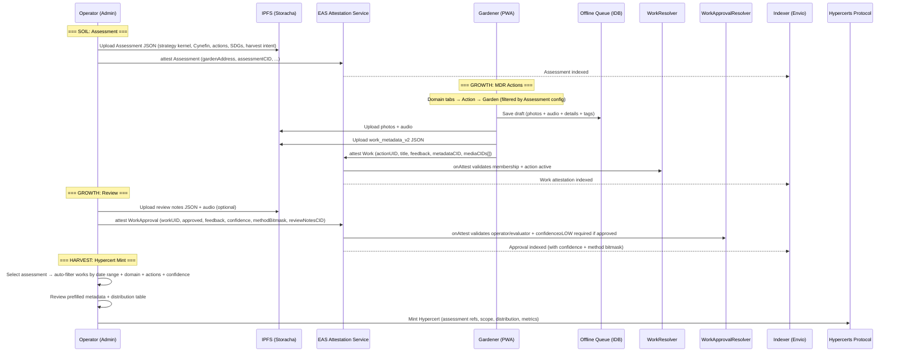

# Green Goods Action Domain Upgrade v1 — Aligned Plan

**Branch**: `feature/action-domains`
**Status**: ACTIVE (contracts done, UI in progress)
**Dependencies**: Conviction voting (COMPLETE), Octant vaults (COMPLETE)
**Created**: 2026-02-13
**Last Updated**: 2026-02-15
**Supersedes**: Original "Action Finalization v1" plan

### Implementation Notes
Contracts phase complete: `Domain` enum, `gardenDomains` bitmask, 22-action config in `actions.json`, `ActionRegistry` domain functions all on `feature/action-domains`. Client domain filtering (Phase 3, decisions 13-14) is the primary remaining work — garden filtering by domain mask, domain tabs from union of gardens' domains.

---

## Decision Log

| # | Decision | Rationale |
|---|----------|-----------|
| 1 | 22-action v1 set across 4 domains (Solar, Agro, Edu, Waste) | All actions registered equally; ≤3 required details beyond timeSpent |
| 2 | Fixed `Domain` enum on-chain: `Solar(0), Agro(1), Edu(2), Waste(3)` | On-chain for indexer queryability + Action SignalPool filtering |
| 3 | Each action belongs to exactly 1 domain (required field) | Clean, unambiguous. Cross-domain needs → separate actions |
| 4 | Domain data lives on `ActionRegistry` (not IPFS) | Registry already owns actions; keeps domain logic co-located |
| 5 | Gardens have a domain bitmask (`uint8`) on ActionRegistry | 4-bit mask, gas-cheap bitwise AND for domain checks |
| 6 | Garden operators set their own domain mask (Hats role check) | Cross-contract call to HatsModule. Decentralized per-garden |
| 7 | Domain mask set at mint time, updatable by operator later | `GardenToken._initializeGardenModules()` calls ActionRegistry |
| 8 | Registry is closed — only Green Goods team registers actions | `onlyOwner` on `registerAction()` (already the case) |
| 9 | Admin wizard kept as super-admin tool (role-gated) | Team manages 22 actions via admin UI; operators never see it |
| 10 | Audio notes in Media step only, max 4:20, WebM/Opus | ~200-400KB, offline-friendly. Contained in existing MDR flow |
| 11 | Both client PWA + admin have approval UI with confidence | Client PWA already has approve/reject + feedback drawer; admin adds a new review page. Both get confidence selector |
| 12 | Assessments linked to hypercert reports at mint time; assessment config drives prefill | Operator selects assessment → wizard auto-filters works, prefills distribution + metadata. NOT in work metadata |
| 13 | Client domain tabs: union of all gardener's gardens' domains | Hidden if single domain. Domain → action → garden flow |
| 14 | Action/garden selection: 1-row carousel, 2 cards visible at a time | Keeps existing Embla carousel pattern, just adds domain filtering above |
| 15 | `WorkSubmission` generalized: remove hardcoded planting fields | Generic `details: Record<string, unknown>` + `tags` + `audioNoteCids` |
| 16 | Confidence merged into WorkApproval (no separate WorkVerification) | One page, one action, one transaction. Eliminates a whole attestation layer |
| 17 | 4-value confidence: NONE / LOW / MEDIUM / HIGH | Simple for field operators. NONE for rejections, LOW+ required for approvals. Off-chain scoring maps to numeric weights |
| 18 | `schemaVersion: "work_metadata_v2"` for metadata evolution | Indexer/frontend can decode old vs new metadata safely |
| 19 | Prefer multi-select tags over free text, bands over exact numbers | Low-friction "clicky" inputs for field conditions |
| 20 | Repeater component for multi-row numeric entries | Waste category breakdown, species mix counts |
| 21 | Confidence required when approving (min LOW), defaults to NONE for rejections | Rejections don't need evidence quality assessment |
| 22 | Fresh deployment (clean slate, all 22 actions registered equally) | No storage layout compat needed. No core/optional distinction. New indexer start blocks |
| 23 | Action slug stored on-chain in Action struct | Indexer reads slug from ActionRegistered event. No fragile derivation from title |
| 24 | Form config (WorkInput[], tagSets, bands) stays in `config/actions.json` | Frontend maps UID → config. No on-chain cost for metadata. Config is the source of truth |
| 25 | No rating on WorkApproval — confidence alone captures evidence quality | Rating removed to simplify operator UX; confidence (None/Low/Medium/High) is sufficient signal |
| 26 | `audioNotes: File[]` stays as array, UI recorder captures 1 live note but file picker allows multiple | Gardener may attach existing audio files from device. Single-recorder, multi-attach UX |
| 27 | GPS capture is optional, user-triggered ("Share location" toggle in Details step) | Privacy-first. Coarse GPS via browser Geolocation API. Stored in WorkMetadata if enabled. Omit if denied |
| 28 | Basic video capture included in v1 (max 30s, `accept="video/*"`, client-side compress) | "1-3 photos OR 1 short video" per Universal MDR. Video is an alternative to photos, not additive |
| 29 | No separate rating component — confidence enum (None/Low/Medium/High) replaces rating | Fewer UI elements, faster operator flow. Confidence is the only quality signal needed |
| 30 | Domain icon + color stored in `config/actions.json` alongside action configs | Co-locates all domain metadata. Components read from config, not hardcoded |
| 31 | Rejections always use `Confidence.NONE` — selector disabled, not optional | Simpler UX. Feedback text covers any rejection nuance. No need to rate rejection confidence |
| 32 | Approval types/enums/encoder moved to Phase 0 (not Phase 4) | Unblocks both Phase 3 (client) and Phase 4 (admin) to build approval UI in parallel |
| 33 | Client PWA hardcodes `verificationMethod = HUMAN` — no MethodSelector in PWA | Only human operators review via PWA. Admin keeps full multi-select |
| 34 | Client approval drawer: expand + scrollable (confidence above feedback above buttons) | Keeps existing drawer pattern. Scrollable if content overflows on small screens |
| 35 | VerificationMethod simplified to 4 values: HUMAN, IOT, ONCHAIN, AGENT | Covers all real verification sources. HUMAN = any human-driven review (photos, receipts, witnesses, onsite). Bitmask still used for multi-select |
| 36 | GIF alignment: Purpose → Assessment, Practice → MDR, Progress → Impact Reporting | Maps the 3s framework cleanly onto Green Goods product surfaces |
| 37 | GIF seasonal cycle: Soil → Assessment, Roots → Setup, Growth → MDR, Harvest → Hypercert | Same fractal cell logic at action, garden, and network level |
| 38 | Assessment IS the Season Config — `GardenAssessment` type expanded with strategy kernel, domain+action set, SDG alignment, harvest intent (no separate SeasonConfig type) | One type, one IPFS document, one attestation. No wrapper indirection. Existing assessment fields preserved |
| 39 | Cynefin phase captured in assessment — Clear/Complicated/Complex/Chaotic | Informs confidence interpretation: "Complex" work may warrant lower confidence thresholds since outcomes are harder to verify |
| 40 | Impact Reporting + Badges deferred to post-v1 plans | v1 focuses on Assessment → Harvest pipeline. Reporting and gamification are additive, not blocking |
| 41 | ~~ReviewModel is informational only~~ → superseded by decision 57 (dropped entirely) | Verification is per-review, not per-assessment |
| 42 | Assessment is editable with versioning — new IPFS CID per update, old versions in attestation history | Operators can pivot strategy mid-season. Attestation chain preserves full history |
| 43 | Assessment wizard is admin-only — client PWA stays focused on MDR | Strategic planning needs full screen + stable connection. No client PWA scope increase |
| 44 | Drop `assessmentType` — replaced by `domain` + `cynefinPhase` | Free-text methodology field no longer needed. New structured fields capture the same intent |
| 45 | Strategy kernel simplified to 3: `diagnosis` + `smartOutcomes[]` + `cynefinPhase`. Coherent actions = domain + selectedActionUIDs | Drop `guidingPolicy`, `assumptions`, `coherentActions[]`. The action registry IS the coherent actions |
| 46 | `startDate`/`endDate` and `reportingPeriod` are different — keep both | startDate/endDate = when assessment was conducted. reportingPeriod = harvest window for hypercert mint |
| 47 | Remove `targetConfidence` — no per-action or per-assessment confidence target | Simplifies assessment. Confidence is purely a reviewer-level signal, not an assessment-level goal |
| 48 | Drop `capitals` from assessment — domain replaces it | Eight Capitals too abstract for field operators. Domain (Solar/Agro/Edu/Waste) is the primary categorization axis |
| 49 | ~~Keep `evidenceMedia`, `reportDocuments`, `impactAttestations` on assessment~~ → superseded by decision 56 (merged into `attachments[]`) | Garden-level artifacts kept, but as single `attachments[]` array with type discriminator |
| 50 | SmartOutcome `metric` from fixed list per domain — enables cross-garden aggregation | Each domain has known metrics (e.g., Solar: kWh, panels; Agro: trees, area). Dashboard/reports can aggregate meaningfully |
| 51 | Remove `recognizedRoles` from assessment | Roles already managed by Hats Protocol. Assessment doesn't need to duplicate role tracking |
| 52 | Drop `metrics` and `metricsCid` from assessment — SMART outcomes replace them | Fixed domain metrics + target in SmartOutcome is the structured replacement |
| 53 | Drop `distributionPreference` — distribution decided manually at hypercert mint time | No need for an assessment-level hint. Operator chooses distribution when minting |
| 54 | SmartOutcome unit auto-derived from metric — `{ description, metric, target }` only | Each domain metric has a known unit (kWh, trees, kg). No override needed |
| 55 | Replace free-form `tags` with `sdgTargets: number[]` — UN SDG numbers (1-17) | Global taxonomy for impact categorization. Meaningful for reporting and cross-garden aggregation |
| 56 | Merge `evidenceMedia`, `reportDocuments`, `impactAttestations` into `attachments[]` with type discriminator | Single array: `{ type: 'media' \| 'document' \| 'attestation', cid: string }`. Simpler, more flexible |
| 57 | Drop `reviewModel` — verification is per-review, not per-assessment | Confidence + method bitmask on each WorkApproval is the real verification. Assessment-level hints add no value |
| 58 | Remove Reporting Plan from property groups — no placeholder groups with zero fields | Add it back when Impact Reporting has actual fields. Avoids aspirational clutter |

---

## Executive Summary

Green Goods documents conservation work via an offline-first **Media → Details → Review (MDR)** flow, producing on-chain EAS attestations. This plan upgrades the action domain from 6 generic planting-focused actions to **22 domain-specific actions** across 4 domains, with on-chain domain awareness, audio note support, and 4-value verification confidence (NONE/LOW/MEDIUM/HIGH) merged into the WorkApproval flow.

**Key changes from original plan:**
- Domains stored **on-chain** (ActionRegistry), not IPFS metadata
- `assessmentUID` **removed** from work metadata — assessments link at hypercert report mint
- ActionRegistry is **closed** — protocol team curates actions
- Client flow reversed: **domain → action → garden** (not garden → action)
- Admin wizard kept as super-admin tool (role-gated, not removed)
- 4-value verification confidence (NONE / LOW / MEDIUM / HIGH) merged into WorkApproval — no separate attestation
- UX optimized for field use: multi-select tags, bands (not exact numbers), repeater for breakdowns
- **GIF alignment**: Assessment expanded with strategy kernel + Cynefin + domain selection + SDG alignment + harvest intent, driving the full Soil → Roots → Growth → Harvest cycle

---

## GIF Alignment — Fractal Operating System

The Greenpill Impact Framework (GIF) provides the conceptual architecture that Green Goods implements as a product. This plan aligns the two explicitly.

### 3s → Product Surfaces

| GIF Pillar | Green Goods Surface | What It Captures |
|-------------|---------------------|------------------|
| **Purpose** | Assessment | Why this garden exists, what it's trying to change, Cynefin posture, domain choice |
| **Practice** | MDR (Media → Details → Review) | The daily "quest loop" — gardeners document work, operators verify |
| **Progress** | Impact Reporting + Scorecards | Repeatable cadence, aggregated outcomes, confidence-weighted quality *(post-v1)* |

### 4s → Seasonal Cycle

| GIF Phase | Green Goods Flow | Key Artifacts |
|------------|------------------|---------------|
| **Soil** | Assessment + Baseline | Strategy kernel (diagnosis, SMART outcomes, Cynefin phase) |
| **Roots** | Season Setup | Domain + action set, SDG alignment, harvest window |
| **Growth** | MDR Actions (field work) | Work attestations, media, details, tags, confidence-scored approvals |
| **Harvest** | Impact Report + Hypercert mint | Aggregated metrics, curated proofs, distribution, linked assessments |

> This is the "fractal cell" concept: the same Soil → Roots → Growth → Harvest logic operates at action-level (single work submission), garden-level (season), and network-level (cross-garden reporting).

### Assessment Property Groups (4)

One type, one IPFS document, one attestation. When an operator creates or updates a garden assessment, it captures **4 property groups** that drive MDR + reporting + minting downstream:

| # | Property Group | Assessment Fields | Drives |
|---|----------------|-------------------|--------|
| 1 | **Strategy Kernel** | `diagnosis`, `smartOutcomes[]`, `cynefinPhase` | Assessment display, report narrative, confidence interpretation |
| 2 | **Domain + Action Set** (= coherent actions) | `domain`, `selectedActionUIDs` | MDR action filtering (Intro.tsx domain tabs), action registry queries |
| 3 | **Impact Alignment** | `sdgTargets` | Hypercert metadata scope tags, cross-garden aggregation, global taxonomy |
| 4 | **Harvest Intent** | `reportingPeriod` | Hypercert mint wizard date filter |

> **v1 scope**: All 4 property groups are direct fields on `GardenAssessment`. Verification is handled per-review (confidence + method on WorkApproval). Reporting Plan deferred to post-v1.

---

## Contract Changes

### ActionRegistry.sol — Domain Awareness

**File**: `packages/contracts/src/registries/Action.sol`

Add `Domain` enum and per-garden domain bitmask:

```solidity
// New enum
enum Domain {
    SOLAR,        // 0
    AGRO,         // 1
    EDU,          // 2
    WASTE         // 3
}

// Updated Action struct
struct Action {
    uint256 startTime;
    uint256 endTime;
    string title;
    string slug;            // NEW: e.g., "waste.cleanup_event" (on-chain for indexer)
    string instructions;
    Capital[] capitals;
    string[] media;
    Domain domain;          // NEW: exactly 1 domain per action
}

// New storage
mapping(address garden => uint8 domainMask) public gardenDomains;
address public hatsModule;  // For operator role checks

// New events
event GardenDomainsUpdated(address indexed garden, uint8 indexed domainMask);
event HatsModuleUpdated(address indexed oldModule, address indexed newModule);

// New errors
error NotGardenOperator();
error InvalidDomainMask();
```

**New functions:**

```solidity
/// @notice Sets the domain bitmask for a garden. Callable by garden operators.
/// @param garden The garden address
/// @param _domainMask Bitmask of enabled domains (bit 0=Solar, 1=Agro, 2=Edu, 3=Waste)
function setGardenDomains(address garden, uint8 _domainMask) external {
    // Validate: only lower 4 bits allowed
    if (_domainMask > 0x0F) revert InvalidDomainMask();
    // Check caller is operator via HatsModule
    if (!IHatsModule(hatsModule).isOperatorOf(garden, _msgSender())) revert NotGardenOperator();
    gardenDomains[garden] = _domainMask;
    emit GardenDomainsUpdated(garden, _domainMask);
}

/// @notice Checks if a garden has a specific domain enabled
function gardenHasDomain(address garden, Domain _domain) external view returns (bool) {
    return (gardenDomains[garden] & (1 << uint8(_domain))) != 0;
}

/// @notice Sets the HatsModule address (owner only)
function setHatsModule(address _hatsModule) external onlyOwner {
    address oldModule = hatsModule;
    hatsModule = _hatsModule;
    emit HatsModuleUpdated(oldModule, _hatsModule);
}
```

**Updated `registerAction`:**

```solidity
function registerAction(
    uint256 _startTime,
    uint256 _endTime,
    string calldata _title,
    string calldata _slug,      // NEW: on-chain slug (e.g., "waste.cleanup_event")
    string calldata _instructions,
    Capital[] calldata _capitals,
    string[] calldata _media,
    Domain _domain              // NEW parameter
) external onlyOwner { ... }
```

**Storage layout note:** Fresh deployment — no storage layout compat needed. Adding `slug` (string) and `Domain domain` to the Action struct, plus `gardenDomains` mapping and `hatsModule` address as new top-level storage. Reserve appropriate gap slots.

### GardenToken.sol — Domain Initialization at Mint

**File**: `packages/contracts/src/tokens/Garden.sol`

The `GardenConfig` struct already includes `weightScheme`. Add `domainMask`:

```solidity
struct GardenConfig {
    address communityToken;
    string name;
    string description;
    string location;
    string bannerImage;
    string metadata;
    bool openJoining;
    IGardensModule.WeightScheme weightScheme;
    uint8 domainMask;           // NEW: initial domain bitmask
}
```

In `_initializeGardenModules()`, after existing module calls:

```solidity
// Set initial garden domains on ActionRegistry
if (config.domainMask > 0) {
    try ActionRegistry(actionRegistry).setGardenDomainsFromMint(
        gardenAccount, config.domainMask
    ) {} catch {
        // Non-blocking
    }
}
```

**Notes:**
- Need a `setGardenDomainsFromMint()` on ActionRegistry that's callable by GardenToken (not just operators). This is a privileged initialization path — use an `onlyGardenToken` modifier or `onlyOwner`.
- `GardenToken.sol` needs a new `actionRegistry` state variable + `setActionRegistry(address)` setter (onlyOwner). This uses 1 additional gap slot → update `__gap` from `uint256[44]` to `uint256[43]`.

### WorkApproval Schema — Extended with Confidence (Merged)

> **Key design decision:** Verification confidence is merged into the WorkApproval attestation, not a separate attestation. One page, one action, one transaction. No separate `WorkVerification.sol` needed.

**Updated EAS Schema**: `"Green Goods Work Approval"`

```
uint256 actionUID, bytes32 workUID, bool approved, string feedback,
uint8 confidence, uint8 verificationMethod, string reviewNotesCID
```

**New fields added to WorkApproval:**

```solidity
/// @notice 4-value verification confidence
/// Simple for field operators. Off-chain scoring maps these to numeric weights.
enum Confidence {
    NONE,     // 0 — not assessed (default for rejections)
    LOW,      // 1 — minimal evidence, trust-based
    MEDIUM,   // 2 — photo/document evidence reviewed by operator
    HIGH      // 3 — strong proof (receipt, IoT, on-chain tx, witness)
}

/// @notice How the verification was performed — stored as bitmask (uint8)
/// Multiple methods can apply to a single review (e.g., human + IoT).
/// On-chain: uint8 bitmask. Off-chain: array of method names.
///
/// Bit mapping:
///   bit 0 (1) = HUMAN     — human-driven review (photos, receipts, witnesses, onsite)
///   bit 1 (2) = IOT       — sensor/meter/inverter data
///   bit 2 (4) = ONCHAIN   — blockchain transaction proof
///   bit 3 (8) = AGENT     — automated/AI verification
///
/// Example: human + IoT = 0b0000_0011 = 3
```

**Confidence scoring (off-chain, for hybrid scoring model):**

| Tier | Enum | Suggested Score | When to Use | Example Evidence |
|------|------|-----------------|-------------|------------------|
| None | `NONE (0)` | 0.0 | Not assessed (rejections only) | Rejection — no quality assessment needed |
| Low | `LOW (1)` | 0.3–0.5 | Minimal evidence, operator trusts submitter | No photo, or blurry/unclear media |
| Medium | `MEDIUM (2)` | 0.5–0.8 | Operator reviewed media, evidence matches claim | Clear before/after photos, plausible quantities |
| High | `HIGH (3)` | 0.8–1.0 | Strong proof beyond media | Receipt, meter reading, on-chain tx, third-party witness |

> Score ranges are intentional — the exact weight within a tier can be tuned by the scoring model based on action type, domain, and method. The 4-value enum is the on-chain signal; the float is computed off-chain.

**WorkApprovalResolver changes** (`packages/contracts/src/resolvers/WorkApproval.sol`):

Since we're doing a **fresh deployment**, the resolver decodes the extended schema:
1. Existing validation stays: attester must be evaluator/operator, work attestation valid
2. New: `confidence` must be `NONE`, `LOW`, `MEDIUM`, or `HIGH` (≤3)
3. New: `verificationMethod` must be valid bitmask (≤15, only lower 4 bits: HUMAN|IOT|ONCHAIN|AGENT)
4. `confidence` required when `approved == true` (confidence ≥ LOW)
5. `confidence` can be `NONE` when `approved == false` (rejections don't need it)
6. `reviewNotesCID` optional — if non-empty, points to IPFS JSON with review audio + notes

**Review Notes IPFS JSON** (optional, referenced by `reviewNotesCID`):

```json
{
  "schemaVersion": "review_notes_v1",
  "audioNoteCids": ["bafy..."],
  "reviewerComments": "Good evidence set. Weight is an estimate; accept for v1.",
  "checklist": {
    "mediaClear": true,
    "matchesAction": true,
    "reasonableQuantities": true
  },
  "riskFlags": ["estimate_only_weight"]
}
```

### Work Review Page UX — Admin

**Route**: `/gardens/:id/work/:workId` (NEW — does not exist yet)

**Page layout (responsive 2-column, matches admin grid pattern):**

Uses `PageHeader` (existing admin component) for back navigation + title.
Desktop: 2-column grid — evidence/details (left, scrollable) + review form (right, sticky).
Mobile (<768px): Single column, review form below evidence.

```
Desktop (≥768px):
┌─────────────────────────────────────────────────────────────────┐
│ PageHeader: ← Back to Garden  |  "Review Work Submission"       │
├───────────────────────────────┬─────────────────────────────────┤
│ MEDIA EVIDENCE                │ OPERATOR REVIEW (sticky top-24) │
│ ┌─────┐ ┌─────┐ ┌─────┐      │                                 │
│ │ img │ │ img │ │ img │      │ Confidence: (ConfidenceSelector) │
│ └─────┘ └─────┘ └─────┘      │ ┌──────┬───────┬────────┬──────┐│
│ AudioPlayer (if audio exists) │ │ None │  Low  │ Medium │ High ││
│                               │ └──────┴───────┴────────┴──────┘│
│ SUBMISSION DETAILS            │ Hint: "Evidence reviewed..."    │
│ Action: Cleanup Event (Waste) │                                 │
│ Garden: Community Garden #3   │ Methods: (multi-select chips)   │
│ Gardener: 0xabc...123         │ ┌───────┐┌─────┐┌───────┐┌─────┐│
│ Time Spent: 75 min            │ │☑Human ││ IoT ││Onchain││Agent││
│ Participants: 12              │ └───────┘└─────┘└───────┘└─────┘│
│ Bags/Loads: 8                 │                                 │
│ Est. Weight: 32.5 kg          │ Feedback (optional):            │
│ Tags: riverbank, plastic      │ ┌─────────────────────────────┐ │
│ Submitted: Feb 12, 2026       │ │                             │ │
│                               │ └─────────────────────────────┘ │
│                               │                                 │
│                               │ AudioRecorder (optional)        │
│                               │                                 │
│                               │ ┌──────────┐  ┌──────────┐     │
│                               │ │ Approve  │  │  Reject  │     │
│                               │ └──────────┘  └──────────┘     │
├───────────────────────────────┴─────────────────────────────────┤

Mobile (<768px): Single column, stacked:
  MEDIA → DETAILS → REVIEW FORM (same components, full-width)
```

**Confidence selector behavior (Radix ToggleGroup, `role="radiogroup"`):**
- 4 equally-sized segments: **None** | **Low** | **Medium** | **High**
- Built as shared `ConfidenceSelector` component (Phase 0, task 0.14)
- `aria-required="true"` when approving (must select Low or higher); disabled when rejecting (defaults to None)
- Arrow key navigation between options
- Selected state: filled `bg-primary` background, `text-white` bold text, `aria-checked="true"`
- Unselected: `bg-bg-weak-50`, `text-text-sub-600` (matches existing card pattern)
- Each segment shows hint below on selection:
  - None: "Not assessed"
  - Low: "Minimal evidence, trust-based"
  - Medium: "Evidence reviewed, matches claim"
  - High: "Strong proof (receipt, meter, witness)"

**Method multi-select (always visible, chip/tag buttons):**
- Multiple methods can apply to a single review (e.g., Human + IoT)
- Rendered as selectable chips/tags (Radix ToggleGroup with `type="multiple"`)
- Stored on-chain as a `uint8` bitmask (4 bits, one per method)
- At least 1 method required when approving
- Options: **Human** | **IoT** | **Onchain** | **Agent**
  - Human: any human-driven review (photos, receipts, witnesses, onsite visits)
  - IoT: sensor, meter, or inverter data
  - Onchain: blockchain transaction proof
  - Agent: automated/AI verification
- Domain context highlights likely methods (e.g., solar → IoT pre-selected; edu → Onchain highlighted)

**Audio recording:**
- Same MediaRecorder component as client (shared)
- Max 4:20, WebM/Opus
- Uploaded to IPFS on submit → CID stored in `reviewNotesCID` JSON

**Submit flow:**
1. Operator sets confidence (None/Low/Medium/High) + method(s) as multi-select chips (all required for approval)
2. Optionally adds text feedback and/or audio review
3. Clicks Approve or Reject
4. If audio exists: upload to IPFS → build review notes JSON → upload JSON → get CID
5. `encodeWorkApprovalData()` now includes `confidence`, `verificationMethod` (bitmask), `reviewNotesCID`
6. Single transaction via `useWorkApproval()` hook

---

## Final v1 Action Set (22 Actions)

### Design Rules

- **Required details ≤3 beyond `timeSpentMinutes`** (timeSpent always required)
- **Feedback optional** (freeform text note from gardener)
- **Audio note optional** in Media step (max 4:20, WebM/Opus)
- **Multi-select tags** for most non-numeric fields (keep forms "clicky")
- **Bands instead of exact numbers** when precision is unrealistic (uptime band, site size band, attendee band)
- **Repeater component** for multi-row numeric entries (waste category breakdown, species mix)
- Each action belongs to exactly **1 domain**
- Confidence (NONE/LOW/MEDIUM/HIGH) set by operator at approval time (min LOW required for approvals)
- GPS is opt-in via "Share location" toggle (privacy-first, not automatic)
- Auto-captured: timestamp, submitter address (implicit in EAS attestation)

### Universal MDR Form Block (applies to every action)

**Media (required) — Gardener PWA:**
- 1–3 photos OR 1 short video (max 30s, `accept="video/*"`, client-side compressed)
- Optional audio notes (recorder captures 1 live; file picker allows attaching multiple existing files)
- Max 4:20 per audio note, WebM/Opus

**Details (defaults) — Gardener PWA:**
- `timeSpentMinutes` (required, always first field)
- `feedback` (optional freeform text note)
- "Share location" toggle (optional, user-triggered) — coarse GPS via Geolocation API, stored in WorkMetadata
- Auto-captured: timestamp, submitter address (implicit in EAS attestation)

**Review (operator) — Client PWA + Admin review page:**
- View all evidence (photos/video, audio, details, tags)
- Set confidence: **None** | **Low** | **Medium** | **High** (required for approval, min LOW)
- Set verification method(s) (multi-select chips, at least 1 required for approval)
- Optional text feedback + optional audio review note
- Approve / Reject

---

### Solar Hub Development (Domain: SOLAR) — 5 actions

| Action | Slug | Media (M) | Details (D) — required (≤3 beyond time) | Details (D) — select/tags | Quant Outputs | Review (R) |
|--------|------|-----------|----------------------------------------|--------------------------|---------------|------------|
| **Site & Readiness Setup** | `solar.site_setup` | Site photos; permission proof (if any) | Readiness score (0–100 or 4-step) | Agreement type; site type; blocker tags | hubs onboarded; readiness % | Evidence present; confidence tier |
| **Infrastructure Milestone** | `solar.install_milestone` | Install photos; invoice optional | Milestone value (number) | Milestone type (solar kW / battery kWh / internet Mbps / retrofit / commissioning); measurement method | Installed capacity (kW); battery (kWh); internet (Mbps); progress count | Value ↔ media consistency; confidence tier |
| **Hub Service Session** | `solar.service_session` | Photo of hub in use (privacy-safe) | Hours open; users served | Service tags (charging / internet / class / repairs); session type | Hours open; users served; sessions count | Outlier check; confidence tier |
| **Energy & Uptime Check** | `solar.energy_uptime_check` | Meter/inverter photo | kWh generated (period); uptime band (select) | Issue tags (maintenance / outage / weather); measurement method | kWh; uptime% (band); downtime frequency | Meter proof?; confidence tier (IoT raises) |
| **Node Operation Log** | `solar.node_ops` | Dashboard screenshot / on-chain proof | Uptime band; yield (ETH) | Network; proof type (on-chain tx / dashboard); validator count band | Node uptime; ETH yield | Proof type can justify 1.0 confidence |

---

### Agroforestry (Domain: AGRO) — 6 actions

> Caretaker assignment removed. "Learning Reflection" separated from maintenance. Site assessment/species plan is a planning action.

| Action | Slug | Media (M) | Details (D) — required (≤3 beyond time) | Details (D) — select/tags | Quant Outputs | Review (R) |
|--------|------|-----------|----------------------------------------|--------------------------|---------------|------------|
| **Site Assessment & Species Plan** | `agro.site_species_plan` | Baseline photos | Planned seedlings (#); site area band | Species tags (multi-select); terrain/soil tags | Planned trees; planned area band | Completeness; confidence tier |
| **Planting Event** | `agro.planting_event` | Planting photos | Seedlings planted (#); participants (#) | Species tags; planting method | Trees planted; participation | Plausibility; confidence tier |
| **Survival Check** | `agro.survival_check` | Repeat-angle plot photos | Alive (#); checked (#); checkpoint (select) | Issue tags (drought/pests/grazing) | Survival % (derived); survival over time | Survival math; continuity; confidence tier |
| **Maintenance Activity** | `agro.maintenance_activity` | Maintenance photo | Area maintained band; activity count (optional #) | Activity tags (watering/weeding/mulching/fencing/pest); inputs tags | Maintenance frequency; area maintained | Evidence present; confidence tier |
| **Learning Reflection** | `agro.learning_reflection` | Optional photo | Insight count (select 1–3) | Lesson tags (what worked/failed); next-step tags | learn logs count; themes frequency | Low burden; operator spot check |
| **Harvest & Yield Record** | `agro.harvest_yield` | Harvest photo; scale photo optional | Yield (kg); harvest count (#) | Crop tags; distribution tags | Yield kg; harvest events | Scale proof increases confidence |

> Supports hybrid scoring: actions earn base score, survival + yield + verification confidence upgrade credibility over time.

---

### Ethereum Education (Domain: EDU) — 5 actions

> Badge issuance removed as an action — treated as system automation triggered by thresholds (attendance verified + assessment passed). "Outcome & Learning Check" replaced by "Follow-up Action Logged" which captures actionable proof.

| Action | Slug | Media (M) | Details (D) — required (≤3 beyond time) | Details (D) — select/tags | Quant Outputs | Review (R) |
|--------|------|-----------|----------------------------------------|--------------------------|---------------|------------|
| **Publish Session & Open Roster** | `edu.publish_session` | Flyer optional | Planned duration (min); capacity (#) | Session type; track tags; venue type (incl solar hub) | Sessions planned; capacity | Completeness; confidence tier |
| **Workshop Delivered** | `edu.deliver_session` | Room/materials photo | Delivered duration (min); facilitators (#) | Track tags; format tags (workshop/office hours/etc.) | Sessions delivered; facilitator count | Evidence present; confidence tier |
| **Attendance Verified** | `edu.verify_attendance` | Roster export / QR screenshot | Attendees (#); method (select) | Unique-count band; privacy mode (hashed IDs) | Participants trained; attendance rate | Dedupe check; confidence tier |
| **Follow-up Action Logged** | `edu.followup_action` | Screenshot/proof | Follow-up type (select); proof count band | Proof type (on-chain tx / wallet setup / repo); difficulty tag | follow-ups count; conversion rate | Proof quality; confidence tier (on-chain can be 1.0) |
| **Learning Assessment** | `edu.learning_assessment` | Quiz/project screenshot | Result (pass/fail); score band | Assessment type (quiz/project); topic tags | Completion rate; score distribution | Consistency; confidence tier |

---

### Waste Management (Domain: WASTE) — 6 actions

| Action | Slug | Media (M) | Details (D) — required (≤3 beyond time) | Details (D) — select/tags | Quant Outputs | Review (R) |
|--------|------|-----------|----------------------------------------|--------------------------|---------------|------------|
| **Site Assessment (Before)** | `waste.site_assessment` | Before photo | Site size band; waste level (low/med/high) | Site type; common waste tags | Sites assessed; baseline severity | Evidence present; confidence tier |
| **Cleanup Event** | `waste.cleanup_event` | Before/after photos | Participants (#); duration (min); amount removed (kg/bags) | Unit type; method (scale/estimate) | Waste removed; participation; effort mins | Outlier check; confidence tier |
| **Sorting & Breakdown** | `waste.sorting_breakdown` | Sorted piles photo | Total amount (kg); category breakdown (repeater) | Category tags; method | Kg by category; diversion potential | Totals sum check; confidence tier |
| **Recycler/Disposal Transfer** | `waste.transfer_receipt` | Receipt/facility proof | Amount transferred (kg); disposition (select) | Facility type; trip count band | Verified diversion kg; disposal kg | Receipt boosts confidence |
| **Compost/Upcycle Batch** | `waste.upcycle_batch` | Batch photo | Input (kg); output (kg) | Batch type (compost/upcycle); material tags | Compost produced; upcycle output | Plausibility; confidence tier |
| **Recurring Maintenance Check** | `waste.maintenance_check` | Site photo | Amount removed (kg/bags); site size band | Condition tags; issue tags | Maintenance frequency; residual waste | Continuity vs site ID; confidence tier |

---

### Action Summary

| Domain | Count | Slugs |
|--------|-------|-------|
| Solar | 5 | `solar.site_setup`, `solar.install_milestone`, `solar.service_session`, `solar.energy_uptime_check`, `solar.node_ops` |
| Agro | 6 | `agro.site_species_plan`, `agro.planting_event`, `agro.survival_check`, `agro.maintenance_activity`, `agro.learning_reflection`, `agro.harvest_yield` |
| Edu | 5 | `edu.publish_session`, `edu.deliver_session`, `edu.verify_attendance`, `edu.followup_action`, `edu.learning_assessment` |
| Waste | 6 | `waste.site_assessment`, `waste.cleanup_event`, `waste.sorting_breakdown`, `waste.transfer_receipt`, `waste.upcycle_batch`, `waste.maintenance_check` |
| **Total** | **22** | |

### UX Implementation Rules

1. **Tags over text**: Make most non-numeric fields multi-select tags (track, method, issues, activity types). Controlled vocabularies per action.
2. **Bands over numbers**: Use select bands instead of exact numbers when precision is unrealistic: uptime band, site size band, unique attendee band, validator count band, proof count band.
3. **Repeater component**: For the few places that truly need multiple numeric rows: waste category kg breakdown, species mix (if capturing counts per species).
4. **Verification always**: Operator Review always sets verification confidence tier — it meaningfully affects the hybrid scoring model.
5. **Proof raises confidence**: Certain methods automatically suggest higher confidence tiers (IoT → 0.85, Onchain → 1.0). UI should hint this to the operator.

### Registry-Ready Schema (per action)

Each action in `config/actions.json` should define:

```typescript
interface ActionRegistrySchema {
  slug: string;                         // e.g., "waste.cleanup_event"
  domain: Domain;                       // WASTE
  title: string;                        // "Cleanup Event"
  requiredMediaCount: number;           // 1-3
  requiredDetailsFields: DetailField[]; // max 3 beyond timeSpent
  tagSets: Record<string, string[]>;    // controlled vocabularies per tag field
  bandFields: BandField[];              // fields that use bands instead of numbers
  repeaterFields: RepeaterField[];      // fields with multi-row entries
  metricOutputs: MetricOutput[];        // what this action produces for reporting
  reviewFields: {
    confidenceTier: true;               // always
    flags: string[];                    // optional flag types
  };
}

interface DetailField {
  key: string;                          // e.g., "participantsCount"
  type: "number" | "select" | "multi-select" | "band";
  required: boolean;
  options?: string[];                   // for select/multi-select
  bands?: string[];                     // for band type (e.g., ["1-5", "6-20", "21-50", "50+"])
  unit?: string;                        // e.g., "kg", "kWh", "min"
}

interface MetricOutput {
  key: string;                          // e.g., "wasteRemovedKg"
  unit: string;                         // e.g., "kg"
  aggregation: "sum" | "avg" | "count" | "rate" | "latest";
  derivedFrom?: string[];              // which detail fields feed this metric
}
```

---

## Shared Package Changes

### Type Generalization

**File**: `packages/shared/src/types/domain.ts`

```typescript
// NEW: Domain enum (mirrors Solidity)
export enum Domain {
  SOLAR = 0,
  AGRO = 1,
  EDU = 2,
  WASTE = 3,
}

// UPDATED: WorkSubmission — remove hardcoded planting fields
export interface WorkSubmission {
  actionUID: number;
  title: string;
  timeSpentMinutes: number;            // required for ALL actions
  feedback: string;
  media: File[];
  details: Record<string, unknown>;    // domain-specific fields from action config
  tags?: string[];                     // optional standardized tags
  audioNotes?: File[];                 // optional audio recordings
}

// UPDATED: WorkMetadata — generic
export interface WorkMetadata {
  schemaVersion: "work_metadata_v2";
  domain: Domain;                      // e.g., Domain.WASTE (numeric on-chain, string in JSON)
  actionSlug: string;                  // e.g., "waste.cleanup_event"
  timeSpentMinutes: number;
  details: Record<string, unknown>;    // domain-specific values
  tags?: string[];
  audioNoteCids?: string[];
  clientWorkId: string;
  submittedAt: string;
}

// BACKWARD COMPAT: v1 metadata shape for old works
export interface WorkMetadataV1 {
  plantCount: number;
  plantSelection: string[];
  timeSpentMinutes?: number;
}

// UPDATED: Action — add domain + slug
export interface ActionCard {
  id: string;
  slug: string;                        // NEW: e.g., "waste.cleanup_event"
  startTime: number;
  endTime: number;
  title: string;
  instructions?: string;
  capitals: Capital[];
  media: string[];
  domain: Domain;                      // NEW
  createdAt: number;
}

// UPDATED: WorkApprovalDraft — extended with confidence + method fields
export interface WorkApprovalDraft {
  actionUID: number;
  workUID: string;
  approved: boolean;
  feedback?: string;
  confidence: Confidence;              // NEW: required when approved=true (min LOW)
  verificationMethod: number;          // NEW: bitmask of VerificationMethod flags
  reviewNotesCID?: string;             // NEW: optional IPFS JSON with audio + notes
}

/** 4-value verification confidence — simple for field operators */
export enum Confidence {
  NONE = 0,     // not assessed (valid only for rejections)
  LOW = 1,      // minimal evidence, trust-based
  MEDIUM = 2,   // photo/document evidence reviewed by operator
  HIGH = 3,     // strong proof (receipt, IoT, on-chain tx, witness)
}

/** Verification method flags — used as bitmask (multiple can apply per review) */
export enum VerificationMethod {
  HUMAN   = 1 << 0,  // 1 — human-driven review (photos, receipts, witnesses, onsite)
  IOT     = 1 << 1,  // 2 — sensor/meter/inverter data
  ONCHAIN = 1 << 2,  // 4 — blockchain transaction proof
  AGENT   = 1 << 3,  // 8 — automated/AI verification
}

// ============================================
// GIF Assessment Types
// ============================================

/** Cynefin framework phase — characterizes the nature of the work */
export enum CynefinPhase {
  CLEAR = 0,         // known inputs → known outputs (e.g., standard planting)
  COMPLICATED = 1,   // expert analysis needed (e.g., solar engineering)
  COMPLEX = 2,       // emergent, requires probing (e.g., ecosystem restoration)
  CHAOTIC = 3,       // crisis response (e.g., disaster cleanup)
}

// ReviewModel removed — verification is per-review (confidence + method on WorkApproval), not per-assessment
// DistributionPreference removed — operator decides distribution manually at hypercert mint time

export interface AssessmentAttachment {
  type: "media" | "document" | "attestation";
  cid: string;                         // IPFS CID or external URL
  label?: string;                      // optional display name
}

export interface SmartOutcome {
  description: string;                 // e.g., "Plant 500 trees by Q3"
  metric: string;                      // from fixed domain list (e.g., "treesPlanted")
  target: number;                      // e.g., 500
  // unit auto-derived from metric definition (e.g., "treesPlanted" → "trees")
}

/**
 * GardenAssessment — expanded with strategy kernel, SDG alignment, and harvest intent.
 * Editable, versioned via IPFS CID chain (new CID per update).
 */
export interface GardenAssessment {
  id: string;
  schemaVersion: "assessment_v2";
  gardenAddress: string;
  authorAddress: string;

  // --- Core fields ---
  title: string;
  description: string;
  location: string;
  attachments: AssessmentAttachment[]; // baseline photos, reports, external attestations
  sdgTargets: number[];                // UN SDG numbers (1-17)
  startDate: number | null;            // when assessment was conducted
  endDate: number | null;
  createdAt: number;

  // --- Strategy Kernel (Soil) ---
  diagnosis: string;                   // root problem this garden addresses
  smartOutcomes: SmartOutcome[];       // measurable goals (metric from fixed domain list, unit auto-derived)
  cynefinPhase: CynefinPhase;          // nature of the work

  // --- Domain + Action Set (Roots = Coherent Actions) ---
  domain: Domain;                      // primary domain for this season
  selectedActionUIDs: number[];        // which actions are active — these ARE the coherent actions

  // --- Harvest Intent ---
  reportingPeriod: { start: number; end: number }; // harvest window (distinct from startDate/endDate)
}
```

### Encoder Changes

**File**: `packages/shared/src/utils/eas/encoders.ts`

```typescript
// UPDATED: encodeWorkData() — generic details, audio support
export async function encodeWorkData({
  actionUID,
  title,
  feedback,
  media,           // photos
  audioNotes,      // audio files (new)
  details,         // generic Record<string, unknown>
  tags,
  domain,          // Domain enum value
  actionSlug,
  timeSpentMinutes,
  ...
}) {
  // 1. Upload photos to IPFS (existing)
  // 2. Upload audio files to IPFS (NEW)
  // 3. Build metadata JSON with schemaVersion: "work_metadata_v2"
  // 4. Upload metadata JSON to IPFS
  // 5. Encode EAS payload (unchanged schema: actionUID, title, feedback, metadata, media[])
}

// UPDATED: encodeWorkApprovalData() — extended with confidence + method fields
export function encodeWorkApprovalData({
  actionUID,
  workUID,
  approved,
  feedback,
  confidence,          // NEW: Confidence enum (NONE/LOW/MEDIUM/HIGH)
  verificationMethod,  // NEW: uint8 bitmask of VerificationMethod flags
  reviewNotesCID,      // NEW: optional IPFS CID for review audio + notes
}) {
  // Uses updated EAS schema with 3 new fields
  // confidence + verificationMethod are uint8 on-chain
  // reviewNotesCID is string (empty string if none)
}
```

### WorkInput Type Update

**File**: `packages/shared/src/types/domain.ts`

Extend `WorkInput` to support bands, multi-select, repeaters:

```typescript
export interface WorkInput {
  key: string;
  title: string;
  placeholder: string;
  type: "text" | "textarea" | "select" | "multi-select" | "number" | "band" | "repeater";
  required: boolean;
  options: string[];          // for select/multi-select
  bands?: string[];           // for band type (e.g., ["1-5", "6-20", "21-50", "50+"])
  unit?: string;              // e.g., "kg", "kWh", "min"
  repeaterFields?: WorkInput[]; // nested fields for repeater rows
}
```

### Work Form Generalization

**File**: `packages/shared/src/hooks/work/useWorkForm.ts`

The current form validates `plantSelection` and `plantCount` specifically. Generalize to:

```typescript
// Dynamic Zod schema built from action's WorkInput[] config
export function buildWorkFormSchema(inputs: WorkInput[]) {
  const shape: Record<string, z.ZodTypeAny> = {
    feedback: z.string().optional(),
    timeSpentMinutes: z.preprocess(normalizeMinutes, z.number().min(1)),
  };

  for (const input of inputs) {
    switch (input.type) {
      case "number":
        shape[input.key] = input.required
          ? z.preprocess(Number, z.number().min(0))
          : z.preprocess(Number, z.number().min(0)).optional();
        break;
      case "select":
      case "band":
        shape[input.key] = input.required
          ? z.string().min(1)
          : z.string().optional();
        break;
      case "multi-select":
        shape[input.key] = input.required
          ? z.array(z.string()).min(1)
          : z.array(z.string()).optional();
        break;
      case "repeater":
        // Array of objects with nested field validation
        const rowShape: Record<string, z.ZodTypeAny> = {};
        for (const field of input.repeaterFields ?? []) {
          rowShape[field.key] = buildFieldValidator(field);
        }
        shape[input.key] = z.array(z.object(rowShape));
        break;
      default: // text, textarea
        shape[input.key] = input.required
          ? z.string().min(1)
          : z.string().optional();
    }
  }

  return z.object(shape);
}
```

---

## Client PWA Changes

### Domain-Centric Action Selection

**File**: `packages/client/src/views/Garden/Intro.tsx` (FULL REBUILD)

**Current flow**: Action carousel (Embla, h-60 cards) → Garden carousel (Embla, h-72 cards) → next
**New flow**: Domain tabs → Action carousel (2 visible) → Garden carousel (2 visible) → next

> **Scope note:** This keeps the existing Embla carousel interaction pattern (swipe horizontal, 2 cards visible at a time) but adds domain filtering above. It's a full rebuild because the data flow changes (domain → action → garden) and `WorkIntroProps` changes entirely.

```
┌─────────────────────────────────────┐
│  Domain tabs (Radix Tabs, inline)   │  Hidden if single domain
│  ┌──────┐ ┌──────┐ ┌──────┐ ┌─────┐│  across all user's gardens
│  │ Agro │ │Waste │ │Solar │ │ Edu ││  Horizontal tab bar, arrow-key nav
│  └──────┘ └──────┘ └──────┘ └─────┘│  Each tab shows icon + label from config
├─────────────────────────────────────┤
│  Actions (Embla carousel, 1 row)    │  Filtered by selected domain
│  ← ┌──────────┐  ┌──────────┐  →   │  2 cards visible at a time
│    │ Planting │  │ Monitor  │       │  Horizontal swipe/drag
│    │  Event   │  │ Activity │       │  Selected: border-primary ring
│    └──────────┘  └──────────┘       │  ActionCard (existing h-60 size)
├─────────────────────────────────────┤
│  Gardens (Embla carousel, 1 row)    │  Filtered: garden has this domain
│  ← ┌──────────┐  ┌──────────┐  →   │  2 cards visible at a time
│    │ Garden 1 │  │ Garden 2 │       │  GardenCard (existing h-72 size)
│    └──────────┘  └──────────┘       │
└─────────────────────────────────────┘
```

**Key logic (single useMemo per Rule 9):**
```typescript
const { availableDomains, filteredActions, filteredGardens } = useMemo(() => {
  const domains = new Set(gardens.flatMap(g => getDomainsFromMask(g.domainMask)));
  const actions = allActions.filter(a => a.domain === selectedDomain);
  const filtered = gardens.filter(g => hasDomain(g.domainMask, selectedDomain));
  return { availableDomains: [...domains], filteredActions: actions, filteredGardens: filtered };
}, [gardens, allActions, selectedDomain]);
```
- If `availableDomains.length === 1` → auto-select, hide tabs
- `selectedDomain` stored in `WorkSelectionContext` (not local state)

### Audio Recording in Media Step

**File**: `packages/client/src/views/Garden/Media.tsx` (MODIFY)

Integrate shared `AudioRecorder` + `AudioPlayer` components (built in Phase 0, tasks 0.12–0.13) alongside existing camera/gallery buttons.

**AudioRecorder component spec (shared, `packages/shared/src/components/Audio/AudioRecorder.tsx`):**
- `MediaRecorder` API with `mimeType: "audio/webm;codecs=opus"` (fallback: `audio/webm`)
- Max duration: 260 seconds (4:20) — auto-stops with `aria-live="polite"` announcement
- Visual: countdown timer + simple level indicator (AnalyserNode for real-time amplitude)
- States: idle → requesting-permission → recording → preview → confirmed
- Permission handling: `navigator.mediaDevices.getUserMedia({ audio: true })` with graceful fallback (hide recorder if denied, show toast)
- Cancel: revokes intermediate chunk blobs, resets to idle
- Output: single `File` with stable filename (`audio-note-{timestamp}.webm`)
- Props: `onRecordingComplete(file: File)`, `maxDuration`, `disabled`
- Accessibility: `aria-pressed` toggle on record button, timer announced via `aria-live`

**AudioPlayer component spec (shared, `packages/shared/src/components/Audio/AudioPlayer.tsx`):**
- Play/pause toggle, progress bar (range input or Radix Slider), elapsed/total time
- Accepts `src: string` (blob URL or IPFS gateway URL) or `file: File`
- Compact variant for inline use in cards; full variant for review page
- Props: `src`, `file`, `compact`, `onDelete?`, `className`

**Integration in Media.tsx:**
- Audio recorder appears below photo section, above the "needed/optional" badges
- Recorder captures 1 live note at a time; file picker allows attaching multiple existing audio files from device
- `audioNotes: File[]` — array type supports both recorded and attached files
- Track blob URLs via `mediaResourceManager` (same tracking ID as photos: `"work-draft"`)
- Offline: serialize `File[]` into job queue alongside image files
- Footer buttons unchanged — camera/gallery refs still work; recorder is inline, not in footer

### Details Step — Dynamic Form

**File**: `packages/client/src/views/Garden/Details.tsx` (MODIFY)

Currently renders fixed fields (`timeSpentMinutes`, `feedback`) plus dynamic `WorkInput[]`. The generalization is mostly done — the main change is:
- Remove hardcoded `plantSelection` and `plantCount` rendering
- Rely entirely on `action.inputs` (WorkInput[]) for dynamic fields
- Add `tags` multi-select field (optional, from action config)

---

## Admin UI Changes

### Super-Admin Action Wizard

**File**: `packages/admin/src/views/Actions/CreateAction.tsx` (MODIFY)

- Gate behind protocol admin role check (not garden operator)
- Add `Domain` selector as first field in Step 0 (Basics)
- Action slug auto-generated from domain + title

### Work Review — Audio Playback + Recording

**File**: `packages/admin/src/views/Gardens/Garden/WorkDetail.tsx` (NEW)

Uses shared `AudioPlayer` and `AudioRecorder` components (Phase 0, tasks 0.12–0.13):
- `AudioPlayer` renders gardener's audio note from IPFS CID (fetched via gateway URL)
- `AudioRecorder` allows operator to record review audio (same 4:20 max)
- Submit flow uploads review audio → builds review notes JSON → uploads JSON → CID stored in `reviewNotesCID`
- Loading states on Approve/Reject buttons during 3-step async chain (IPFS audio → IPFS JSON → EAS tx)
- Error recovery: toast on IPFS failure before tx, no partial state committed

### Assessment Creation (Admin) — Expanded Wizard

**File**: `packages/admin/src/views/Assessments/` (expanded wizard steps)

- Assessment creation becomes a multi-step wizard: Strategy Kernel → Domain + Actions → SDG + Harvest
- All fields stored directly on the `GardenAssessment` type (no separate config object)
- Assessment JSON uploaded to IPFS, CID in assessment attestation
- Editable with versioning: updates produce a new IPFS CID, old version preserved in attestation history

**Wizard steps:**
1. **Strategy Kernel**: diagnosis (textarea), SMART outcomes (repeater: description + metric dropdown from domain list + target), Cynefin phase (4-value radio)
2. **Domain + Actions**: domain selector (from garden's domain bitmask) + action multi-select (filtered by domain) — these ARE the coherent actions
3. **SDG + Harvest**: SDG multi-select (17 goals as icon+label chips) + reporting period (date range for harvest window)

### Assessment → Hypercert Linking (Harvest)

**File**: `packages/admin/src/views/Hypercerts/` (enriched mint flow)

- At mint time, operator selects assessment from dropdown
- Wizard auto-filters work attestations by: `assessment.reportingPeriod` + `assessment.domain` + `assessment.selectedActionUIDs`
- Metadata prefilled from assessment: scope (WHAT from `diagnosis` + `domain` + SDGs), stakeholders (WHO from garden roster via Hats), metrics (HOW MUCH from `smartOutcomes`)
- Distribution table configured manually by operator at mint time
- Single decision: "Are we ready to mint this Harvest?"
- Assessment IDs stored in hypercert metadata (not in individual work attestations)

---

## Indexer Changes

### ActionRegistry Events

**File**: `packages/indexer/schema.graphql`

```graphql
enum Domain {
  SOLAR
  AGRO
  EDU
  WASTE
  UNKNOWN
}

type Action {
  id: ID!
  chainId: Int!
  ownerAddress: String!
  startTime: BigInt!
  endTime: BigInt!
  title: String!
  slug: String!                 # NEW: on-chain slug (e.g., "waste.cleanup_event")
  instructions: String!
  capitals: [Capital!]!
  media: [String!]!
  domain: Domain!               # NEW
  createdAt: Int!
}

# NEW entity
type GardenDomains {
  id: ID!                       # gardenAddress
  garden: Garden!
  domainMask: Int!
  domains: [Domain!]!           # Expanded for query convenience
  updatedAt: Int!
}

# UPDATED: WorkApproval gains confidence + method fields (no separate WorkVerification entity)
type WorkApproval {
  id: ID!
  actionUID: Int!
  workUID: String!
  approved: Boolean!
  feedback: String
  confidence: Int!              # NEW: 0=NONE, 1=LOW, 2=MEDIUM, 3=HIGH
  verificationMethod: Int!      # NEW: bitmask (1=HUMAN, 2=IOT, 4=ONCHAIN, 8=AGENT)
  reviewNotesCID: String        # NEW: optional IPFS CID
  attesterAddress: String!
  gardenAddress: String!
  createdAt: Int!
}
```

**File**: `packages/indexer/config.yaml`

Add `GardenDomainsUpdated` event to ActionRegistry source.
Update WorkApproval event handling to decode confidence + method + reviewNotesCID fields.

**File**: `packages/indexer/src/EventHandlers.ts`

New/updated handlers:
- `ActionRegistered` — now includes `domain` field
- `GardenDomainsUpdated` — creates/updates `GardenDomains` entity
- WorkApproval attestation handler — decode extended fields (confidence, method bitmask, reviewNotesCID)

---

## Lifecycle Diagram (Updated)



---

## Implementation Phases

### Phase 0: Type System + Encoder Generalization

**Goal**: Remove hardcoded planting fields, enable multi-domain metadata.

| # | Task | File(s) | Depends |
|---|------|---------|---------|
| 0.1 | Add `Domain` enum to shared types | `types/domain.ts` | — |
| 0.2 | Generalize `WorkSubmission`: remove `plantSelection`/`plantCount`, add `details`, `tags`, `audioNotes` | `types/domain.ts` | — |
| 0.3 | Add `WorkMetadata` v2 with `schemaVersion`, keep v1 type for backward compat | `types/domain.ts` | 0.2 |
| 0.4 | Add `domain` and `slug` fields to `ActionCard` and `Action` types | `types/domain.ts` | 0.1 |
| 0.5 | Extend `WorkInput` type — add `multi-select`, `band`, `repeater` types + `bands`, `unit`, `repeaterFields` | `types/domain.ts` | — |
| 0.6 | Generalize `encodeWorkData()` — generic details, audio upload, v2 metadata | `utils/eas/encoders.ts` | 0.2, 0.3 |
| 0.7 | Generalize `useWorkForm` — dynamic Zod schema from `WorkInput[]` config with band/repeater support | `hooks/work/useWorkForm.ts` | 0.2, 0.5 |
| 0.8 | Update `useWorkMutation` for new `WorkSubmission` shape | `hooks/work/useWorkMutation.ts` | 0.2, 0.6 |
| 0.9 | Fix offline job queue serialization for audio files | `modules/job-queue/db.ts` | 0.2 |
| 0.10 | Update `WorkFlowStore` — replace `plantSelection`/`plantCount` with generic `details`, `tags`, `audioNotes` | `stores/useWorkFlowStore.ts` | 0.2 |
| 0.11 | Update `WorkProvider` contexts — generalize `WorkFormContext`/`WorkSelectionContext` interfaces, add `selectedDomain` to selection context | `providers/Work.tsx` | 0.2, 0.10 |
| 0.12 | Build `AudioRecorder` shared component — MediaRecorder API, timer, max-duration guard, WebM/Opus encoding, mic permission handling, cancel cleanup | `shared/src/components/Audio/AudioRecorder.tsx` | — |
| 0.13 | Build `AudioPlayer` shared component — play/pause, progress bar, duration display, blob URL + IPFS CID support | `shared/src/components/Audio/AudioPlayer.tsx` | — |
| 0.14 | Build `ConfidenceSelector` shared component — Radix ToggleGroup, `role="radiogroup"`, 4-value (None/Low/Medium/High), hint text, disabled state for rejections | `shared/src/components/Form/ConfidenceSelector.tsx` | — |
| 0.15 | Build `MethodSelector` shared component — Radix ToggleGroup `type="multiple"`, 4 chip/tag buttons (Human/IoT/Onchain/Agent), bitmask value, at least 1 required for approvals | `shared/src/components/Form/MethodSelector.tsx` | — |
| 0.16 | Add `domainConfig` to `config/actions.json` — icon (Remix Icon name), color (theme token), label, emoji per domain | `contracts/config/actions.json` | — |
| 0.17 | Add optional `location` field to `WorkMetadata` v2 — `{ lat: number, lng: number, accuracy: number } | null` | `types/domain.ts` | 0.3 |
| 0.18 | Update `WorkApprovalDraft` type with confidence + method bitmask + reviewNotesCID fields | `types/domain.ts` | 0.1 |
| 0.19 | Add `Confidence` enum (NONE/LOW/MEDIUM/HIGH) and `VerificationMethod` bitmask enum to shared types | `types/domain.ts` | — |
| 0.20 | Update `encodeWorkApprovalData()` for extended schema (confidence uint8 + verificationMethod uint8 bitmask + reviewNotesCID string) | `utils/eas/encoders.ts` | 0.18, 0.19 |
| 0.21 | Update `useWorkApproval` hook for extended `WorkApprovalDraft` shape | `hooks/work/useWorkApproval.ts` | 0.18, 0.20 |
| 0.22 | Update barrel exports | `index.ts` | all above |

**Validation**: `bun format && bun lint && bun --filter shared run test && bun --filter shared build`

### Phase 1: ActionRegistry Contract Changes

**Goal**: On-chain domain awareness.

| # | Task | File(s) | Depends |
|---|------|---------|---------|
| 1.1 | Add `Domain` enum + `domain` and `slug` fields to Action struct | `Action.sol` | — |
| 1.2 | Add `gardenDomains` mapping + `setGardenDomains()` | `Action.sol` | 1.1 |
| 1.3 | Add `gardenHasDomain()` view function | `Action.sol` | 1.2 |
| 1.4 | Add `hatsModule` reference for operator role checks | `Action.sol` | 1.2 |
| 1.5 | Update `registerAction()` to require `slug` and `Domain` parameters | `Action.sol` | 1.1 |
| 1.6 | Add `setGardenDomainsFromMint()` (callable by GardenToken) | `Action.sol` | 1.2 |
| 1.7 | Add `actionRegistry` state variable + `setActionRegistry()` setter to `Garden.sol` (uses 1 gap slot → `__gap` to `uint256[43]`) | `Garden.sol` | 1.6 |
| 1.8 | Update `GardenConfig` struct with `domainMask` | `Garden.sol` | 1.7 |
| 1.9 | Call domain initialization in `_initializeGardenModules()` — `ActionRegistry(actionRegistry).setGardenDomainsFromMint(gardenAccount, config.domainMask)` | `Garden.sol` | 1.7, 1.8 |
| 1.10 | Update ActionRegistry unit tests | `test/unit/ActionRegistry.t.sol` | all above |
| 1.11 | Update E2E and integration tests | `test/` | 1.10 |
| 1.12 | Update deploy script for domain parameter + actionRegistry setup | `Deploy.s.sol` | 1.5 |

**Validation**: `cd packages/contracts && bun run test && bun build`

### Phase 2: 22-Action Content + Config

**Goal**: Define and seed the full v1 action set (22 actions).

| # | Task | File(s) | Depends |
|---|------|---------|---------|
| 2.1 | Update `config/actions.json` with 22 domain-specific actions (use registry-ready schema) | `config/actions.json` | Phase 1 |
| 2.2 | Define controlled tag vocabularies per action (tagSets) | `config/actions.json` | 2.1 |
| 2.3 | Define band options per field (bandFields) | `config/actions.json` | 2.1 |
| 2.4 | Define metric outputs per action with aggregation rules | `config/actions.json` | 2.1 |
| 2.5 | Create `ActionInstructionConfig` JSON for each action (IPFS upload) | IPFS JSON files | 2.1 |
| 2.6 | Update `templates.ts` with domain-specific templates (Solar, Agro, Edu, Waste) | `utils/action/templates.ts` | 2.1 |
| 2.7 | Update deploy script `_deployCoreActions()` for domain param + 22 actions | `Deploy.s.sol` | 2.1 |

### Phase 3: Client UI — Domain Tabs + Audio

**Goal**: New domain-centric action selection + audio recording.

| # | Task | File(s) | Depends |
|---|------|---------|---------|
| 3.1 | Rebuild `Intro.tsx` — add domain tabs (Radix Tabs, horizontal bar) above existing Embla carousels; keep 1-row, 2-cards-visible carousel pattern for actions and gardens; domain filtering drives which cards appear | `client/views/Garden/Intro.tsx` | Phase 0 |
| 3.2 | Domain tab logic: single `useMemo` computes union of gardens' domains + filtered actions + filtered gardens; auto-hide tabs if 1 domain; domain icon+color from `domainConfig` | `Intro.tsx` | 3.1 |
| 3.3 | Wire `selectedDomain` state through `WorkSelectionContext` → `Intro.tsx` → filtering | `providers/Work.tsx`, `Intro.tsx` | Phase 0 (0.11), 3.1 |
| 3.4 | Integrate `AudioRecorder` + `AudioPlayer` into `Media.tsx` alongside camera/gallery buttons; track via `mediaResourceManager` | `client/views/Garden/Media.tsx` | Phase 0 (0.12, 0.13) |
| 3.5 | Audio preview/playback in Media step + delete with blob cleanup | `Media.tsx` | 3.4 |
| 3.6 | Update `Details.tsx` — remove hardcoded `plantSelection`/`plantCount` rendering; rely entirely on `action.inputs` (WorkInput[]) for dynamic fields | `client/views/Garden/Details.tsx` | Phase 0 |
| 3.7 | Update `Review.tsx` + `WorkView` — remove hardcoded plant-specific FormCard entries; show generic details + audio playback indicator; update `WorkReviewProps` interface | `client/views/Garden/Review.tsx` | Phase 0 |
| 3.8 | Add basic video capture to `Media.tsx` — `accept="video/*"` file input, max 30s guard, client-side compression, mutually exclusive with multi-photo (photos OR video) | `client/views/Garden/Media.tsx` | Phase 0 |
| 3.9 | Add "Share location" toggle to `Details.tsx` — Geolocation API, coarse accuracy, stores lat/lng/accuracy in form state → WorkMetadata | `client/views/Garden/Details.tsx` | Phase 0 (0.17) |
| 3.10 | Update client `Work.tsx` approval flow — integrate `ConfidenceSelector` (shared) into existing approve/reject drawer (scrollable); hardcode `verificationMethod = VerificationMethod.HUMAN`; confidence required for approval (min LOW); expand drawer layout with confidence above feedback above buttons | `client/views/Home/Garden/Work.tsx` | Phase 0 (0.14, 0.21) |
| 3.11 | Update client approval offline support — extend `WorkApprovalDraft` in job queue payload to include confidence (verificationMethod hardcoded to HUMAN); test offline → sync flow | `modules/job-queue/` | 3.10 |

**Validation**: `bun format && bun lint && bun --filter client run test && bun --filter client build`

### Phase 4: Work Review Page + Confidence UI

**Goal**: Build the admin work review page with merged confidence scoring.

| # | Task | File(s) | Depends |
|---|------|---------|---------|
| 4.1 | Update `config/schemas.json` with extended WorkApproval schema (confidence + method bitmask + reviewNotesCID) | `config/schemas.json` | Phase 0 (0.20) |
| 4.2 | Update `WorkApprovalResolver.sol` to decode new fields (confidence ≤3, verificationMethod ≤15, confidence≥LOW when approved) | `contracts/src/resolvers/WorkApproval.sol` | 4.1 |
| 4.3 | Register `/gardens/:id/work/:workId` route in admin router; create `WorkDetail.tsx` view using `PageHeader` (back to garden) + 2-column responsive grid (evidence left, review form right on desktop; stacked on mobile) | `admin/src/router.tsx`, `admin/src/views/Gardens/Garden/WorkDetail.tsx` | Phase 0 |
| 4.4 | Build media evidence section — photo grid with lightbox + `AudioPlayer` (shared) for gardener audio notes; accessible `alt` text on images | `admin/src/components/Work/MediaEvidence.tsx` | 4.3, Phase 0 (0.13) |
| 4.5 | Integrate `ConfidenceSelector` (shared, built in 0.14) into review form; wire `aria-required` when approved=true, default NONE when rejecting | `admin/src/views/Gardens/Garden/WorkDetail.tsx` | 4.3, Phase 0 (0.14) |
| 4.6 | Integrate `MethodSelector` (shared, built in 0.15) into review form; 4 chips (Human/IoT/Onchain/Agent), at least 1 required when approving; domain context pre-selects likely methods | `admin/src/views/Gardens/Garden/WorkDetail.tsx` | 4.5, Phase 0 (0.15) |
| 4.7 | Integrate `AudioRecorder` (shared) for operator review notes in review form | `admin/src/views/Gardens/Garden/WorkDetail.tsx` | 4.3, Phase 0 (0.12) |
| 4.8 | Review notes IPFS upload chain (audio → JSON → CID) with loading states + error recovery toast on partial failure | `utils/eas/encoders.ts` | 4.7 |
| 4.9 | Wire approval form: React Hook Form + Zod schema for confidence + method bitmask + feedback + audio → `useWorkApproval()` → single EAS tx; loading state on approve/reject buttons | `admin/src/views/Gardens/Garden/WorkDetail.tsx` | all above |
| 4.10 | Update indexer: WorkApproval entity gains confidence + method + reviewNotesCID fields | `indexer/` | 4.1 |

### Phase 5: Assessment Expansion + Harvest Pipeline

**Goal**: Assessment captures strategy kernel, domain+action set, SDG alignment, and harvest intent — driving MDR filtering and hypercert prefill. Implements GIF property groups 1–4.

| # | Task | File(s) | Depends |
|---|------|---------|---------|
| 5.1 | Expand `GardenAssessment` type in shared — add strategy kernel (diagnosis, smartOutcomes, cynefinPhase), domain + selectedActionUIDs, harvest intent (reportingPeriod), sdgTargets, attachments, `schemaVersion: "assessment_v2"`. Drop `assessmentType`, `capitals`, `metrics`, `metricsCid`, `tags`, `evidenceMedia`, `reportDocuments`, `impactAttestations` | `types/domain.ts` | Phase 0 |
| 5.2 | Add `CynefinPhase` enum to shared types: `CLEAR`, `COMPLICATED`, `COMPLEX`, `CHAOTIC` | `types/domain.ts` | — |
| 5.3 | Add SDG target constants — numbers 1-17 with labels for UI display (e.g., `{ id: 7, label: "Affordable and Clean Energy" }`) | `config/sdg.ts` | — |
| 5.4 | Add `AssessmentAttachment` type and `SmartOutcome` type to shared | `types/domain.ts` | — |
| 5.5 | Update `AssessmentDraft` type — add strategy kernel, harvest intent, sdgTargets, attachments. Remove dropped fields | `types/domain.ts` | 5.1 |
| 5.6 | Update assessment creation flow (admin) — 3-step wizard: strategy kernel → domain + action selection → SDG + harvest | `admin/views/Assessments/` | 5.1–5.5, Phase 2 |
| 5.7 | Strategy kernel step — form fields: diagnosis (textarea), SMART outcomes (repeater: description + metric dropdown from domain list + target), Cynefin phase selector (4-value radio) | `admin/views/Assessments/` | 5.6 |
| 5.8 | Domain + action set step — domain selector (from garden's domain bitmask) + action multi-select (filtered by chosen domain, from action registry). These ARE the coherent actions | `admin/views/Assessments/` | 5.6 |
| 5.9 | SDG alignment + harvest intent step — SDG multi-select (17 goals as icon+label chips) + reporting period (date range for harvest window) | `admin/views/Assessments/` | 5.6 |
| 5.10 | Store full assessment as IPFS JSON, CID in assessment attestation metadata | `utils/eas/encoders.ts` | 5.5 |
| 5.11 | Update hypercert mint wizard — assessment dropdown filters by garden; auto-filter work attestations by assessment's `reportingPeriod` + `domain` + `selectedActionUIDs` | `admin/views/Hypercerts/` | 5.5 |
| 5.12 | Hypercert metadata prefill from assessment — scope tags (WHAT from diagnosis + domain + SDGs), outcome metrics (HOW MUCH from SMART outcomes), stakeholder tags (WHO from garden roster via Hats) | `admin/views/Hypercerts/` | 5.11 |
| 5.13 | "Are we ready to mint?" confirmation — preview shows verification summary (confidence distribution across included works) + assessment link + SDG alignment | `admin/views/Hypercerts/` | 5.12 |
| 5.14 | Update indexer: `GardenAssessment` entity gains strategy kernel + harvest intent + sdgTargets fields (or store as `assessmentConfigCID` referencing the IPFS JSON) | `indexer/` | 5.10 |

### Phase 6: Indexer + Deploy

**Goal**: Full indexer support for domains + verification.

| # | Task | File(s) | Depends |
|---|------|---------|---------|
| 6.1 | Update indexer schema with Domain enum, GardenDomains entity | `schema.graphql` | Phase 1 |
| 6.2 | Update indexer config for new events | `config.yaml` | 6.1 |
| 6.3 | Add event handlers | `EventHandlers.ts` | 6.1, 6.2 |
| 6.4 | Update deploy.ts for full deployment | `deploy.ts` | all |

---

## Prerequisite Fixes (from Action Audit)

These findings from `.plans/action-creation-flow-audit.md` should be fixed first or alongside Phase 0:

| Finding | Fix | Phase |
|---------|-----|-------|
| FINDING-2: useActionOperations 539-line duplication | Use factory pattern from `createGardenOperation.ts` | Before Phase 0 |
| FINDING-3: Zod schema inline in CreateAction view | Extract to shared `useActionForm.ts` | Phase 0 |
| FINDING-6: FileUploadField blob URL leak | Track URLs in useRef<Map>, cleanup effect | Phase 3 |
| FINDING-8: No per-step wizard validation | Add `form.trigger()` before step advance | Phase 3 |
| FINDING-9: EditAction async IPFS fetch unsafety | Use `useAsyncEffect()` | Phase 3 |

---

## Migration Strategy

> **Fresh deployment** — clean slate. No storage layout compat needed.

- **Fresh ActionRegistry**: Deploy new contract with Domain support baked in. All 22 actions registered from `config/actions.json`. No legacy action UIDs to preserve.
- **Fresh EAS Schemas**: Register updated WorkApproval schema with confidence + method bitmask + reviewNotesCID fields. Work submission schema unchanged.
- **Fresh indexer start blocks**: Point indexer at new contract addresses. No re-indexing of old events.
- **Existing 6 actions**: Modified to fit new domain structure:
  - `Planting` → AGRO (`agro.planting_event`) — update inputs to match new MDR spec
  - `Identify Plant` → AGRO — merge into `agro.site_species_plan`
  - `Waste Cleanup` → WASTE (`waste.cleanup_event`) — update inputs
  - `Watering` → AGRO — merge into `agro.maintenance_activity`
  - `Harvesting` → AGRO (`agro.harvest_yield`) — update inputs
  - `Web3 Workshop` → EDU (`edu.deliver_session`) — update inputs
- **Metadata versioning**: New works use `schemaVersion: "work_metadata_v2"`. Old works on previous deployment are not migrated (separate chain of attestations).
- **All 22 actions registered equally**: No core/optional distinction. All actions available to any garden with the matching domain enabled.

---

## Validation

```bash
# Contracts
cd packages/contracts
forge test --match-path "test/unit/ActionRegistry.t.sol"
forge test --match-path "test/unit/WorkApproval.t.sol"
forge build --sizes

# Shared
cd packages/shared
bun run test

# Client
cd packages/client
bun run test && bun build

# Admin
cd packages/admin
bun run test && bun build

# Full
bun format && bun lint && bun run test && bun build
```

---

## Future Phases (Post-v1)

> These are **not in v1 scope** but are documented here for architectural alignment. Each should have its own plan when prioritized.

### Impact Reporting (GIF Artifact 3 + 5)

**Goal**: Auto-generate repeatable impact reports from MDR data, using `metricOutputs` from `config/actions.json` as the aggregation source.

**Key features:**
- **Report generator**: "Select period → auto-aggregate metrics by action type → operator edits narrative/proof highlights → export"
- **Two outputs per cycle**: Human-readable (PDF/HTML) + machine-readable (CSV + JSON)
- **CIDS mapping** (from Assessment): WHAT (impact scope tags + SDG targets), WHO (stakeholder tags + location), HOW MUCH (chosen metrics)
- **Reporting plan** (from Assessment): cadence-driven reminders, must-include fields, primary audience

**Report sections (minimal but credible):**
1. Context: garden, location, domain, reporting period
2. Strategy recap: diagnosis → what changed since last report
3. Outputs table: aggregated metrics by action type (auto from MDR Details)
4. Outcome progress: SMART outcomes status + evidence (from assessment strategy kernel)
5. Proof highlights: 3-10 curated media items (auto-suggest + operator picks)
6. Verification summary: confidence distribution + method breakdown + reviewer roles
7. Partners & contributors: from garden roster/roles
8. Risks & learnings: what failed, what changed, next steps
9. Appendix: CSV link + raw metric totals

**Architecture note**: The `metricOutputs` field already defined in `ActionRegistrySchema` (config/actions.json) is the single source of truth for reporting aggregation. Each domain becomes "reportable by default."

### Badges & Gamification (Unlock Protocol)

**Goal**: Non-transferable credential badges for participation, roles, milestones, skills, and impact thresholds.

**Pilot data signals (from CSV):**
- Badge models: Participation (9/9), Role-based (6/9), Milestone (5/9)
- Earning: Steward approval (7/9), volunteer hours (6/9), completing actions (6/9)
- Unlock: Public recognition (9/9), microgrant eligibility (8/9)
- Transferability: Non-transferable preferred (8/9) → treat as reputation/credentials

**Badge categories (v0 scope):**

| Category | Examples | Trigger |
|----------|----------|---------|
| **Role** | Garden Operator, Steward, Verifier, Educator, Solar Tech | Role assigned via Hats Protocol |
| **Participation** | "1 verified action," "5 actions," "Season contributor" | Approved work count threshold |
| **Milestone** | First planting event, First cleanup, Hub launch, First report | Specific action slug approved for first time |
| **Skill** | Safety checklist passed, Workshop track completed, Quiz passed | EDU domain assessment + approval |
| **Impact threshold** | 100kg diverted, 100 seedlings planted, 50 users served | Aggregated metric from `metricOutputs` crosses threshold |

**Anti-badge-farming mechanics:**
- Badge mint requires **approved work** (confidence ≥ LOW)
- Streak badges require **time separation** (weekly cadence minimum, not spam)
- Reputation can **decay** (contributions fade if you stop — GIF principle)
- Random audit queue for anomaly patterns (future: agent-based detection)

**Architecture**: Use Unlock Protocol for non-transferable badge NFTs. Badge minting triggered by indexer-computed thresholds or operator manual award. Domain-flavored naming (localizable): Trash Collector, Solar Sentinel, Compost Captain, with apprentice → intern → mentor → partner progression ladders.

### MDR → Reporting Bridge

**Goal**: Ensure every action's `metricOutputs` feeds cleanly into report aggregation.

**Key requirement**: The action registry schema (`config/actions.json`) must define `metricOutputs` with `aggregation` rules (`sum`, `avg`, `count`, `rate`, `latest`) so the report generator can auto-compute period totals without custom logic per action.

This is already specified in Phase 2 (task 2.4: "Define metric outputs per action with aggregation rules") — the reporting system consumes it.
