# Green Goods reporting: a conversation around a trustworthy publication core

2026-10-04 · Architecture and experience review · Updated 2026-10-07 with owner feedback · No implementation changes

## 1. Summary

**Change the dialogue design. Keep the publication core.** Better wording will help, but another list of phrases will not make the bot understand a story, an interruption or a correction. Introduce a bounded dialogue planner that proposes several facts and the next useful question. Let existing deterministic code validate every change. Keep consent, account control, confirmation, signing and publication outcomes outside the model.

Five findings matter most:

1. **The bot follows the open form question more strongly than the person's message. [Verified]** In the local driver, “12 baobab seedlings, 3 hours” at the count question becomes an invalid unit. A complete opening story still leads to separate garden, activity, count, species and time questions. **[Inferred]** This is not only a models-off limitation: plain numeric questions bypass interpretation, and the extractor cannot extract activity fields before the activity is selected. Fix turn interpretation and catalogue resolution before spending more on friendly prose. [T2](#t2-a-complete-story), [T6](#t6-a-correction-after-the-summary).[^turn][^extract]
2. **Several reported failures have already been patched. [Verified]** “hello” now offers help and optional connection. “I would like to log in” escapes a garden question. Switching accounts has a browser control, and cancelled reviews no longer count as open work for switching. Keep these repairs. They are useful safety and usability foundations, not a conversational architecture. Independent real-device verification remains **[Unknown]**; the owner subsequently reported successful account creation, garden joining and work upload on October 7, with remaining onboarding and logout friction. [F1–F6](#october-7-live-feedback). [T1](#t1-hello), [T3](#t3-login-during-a-garden-question), [T7](#t7-switching-accounts).[^switch][^browser]
3. **Identity is safe but costly to navigate. [Verified]** Linking, proving the account, returning a pairing code, confirming the author and opening another signing page are separate acts. A returning browser can avoid another proof, but the chat/page split persists. **[Recommendation]** Offer connection when useful, require it only before publication, and combine account-bound summary approval and signing in one browser visit. Keep a code fallback. Do not equate Telegram identity with account ownership. [T8](#t8-steward-review-and-the-publication-tail).[^authority][^recognition]
4. **The safety core is substantially stronger than the dialogue, but its privacy claim needs enforcement. [Verified]** Revision checks, leases, exact confirmation and one unresolved send protect publication. However, raw user text, saved description and raw media can reach model adapters. Omitting dedicated address fields does not remove an address or phone number typed into a story or photographed on an invoice. This conflicts with the review's strict model-input boundary. Add a real privacy boundary before expanding model use. [^commit][^attempts][^modelprivacy][^media]
5. **The proof and operations layers cannot yet explain a failed real journey. [Verified]** The driver completes a report and review with fixture settlement; it does not exercise the website's active account, hardware passkey or live sponsorship. The worker also processes conversations, jobs and outbound delivery serially. **[Unknown]** Three restarts in forty minutes and current production logging coverage could not be independently checked. Make a staging bot, device tests and a redacted conversation trace part of completion. [^driver][^worker][^liveproof]

**Full scope is now tracked:** [the coverage map](#full-report-linear-coverage) connects all actionable recommendations to 51 estimated work issues and their dependencies, including the broader redesign, safety, operations and evaluation work.

**Updated near-term priority:** make account creation and profile logout clear, scope reporting choices to the linked account’s gardens, and lead publication results with the attestation. Add steward-reviewed join requests as a distinct delivery slice. These improvements should not wait for the dialogue redesign. [Proposed issues](#proposed-linear-issues-from-the-october-7-feedback).

**Recommended sequence for the broader redesign:** first make failures visible and questions understandable; then collect several facts per message with a bounded planner; then simplify account handoffs. Pilot in English, Spanish and Portuguese together. Add voice only after consent, privacy and transcription checks pass. Defer a Telegram Mini App until it proves a smaller journey on real phones. Preserve a useful models-off path throughout.

### Scope and evidence

At the October 4 review, the supplied checkout was on `develop` at `c4a948735` and did not contain the reporting implementation. This review uses the locally available, merged source snapshot **`66c926153e99c04dce94588c9f50226356fccac5`**, which includes PR #1012. No branch was changed. Sources were read from a temporary archive, with secrets excluded. Existing unrelated working-tree changes were left untouched. All code links below pin that snapshot. This is a review of that source, **not a claim that the same revision is currently deployed**.

**Verified** means observed in source or in the fixture driver. **Inferred** means a consequence of that evidence, without a live observation. **Unknown** means not established. Proposed designs and “after” transcripts are labelled recommendations, not observed behaviour. Official documentation was checked on 2026-10-04. Provider prices are estimates, not invoices. The October 7 amendment incorporates reported product experience and recommendations; it does not revalidate current code, deployment, provider documentation or prices.

The design brief was read before the specification and implementation. Its opening amendments explicitly supersede older sections. The original specification identifies itself as historical. Treating the oldest diagrams as the current target would produce false drift findings. [^brief]

### October 7 live feedback

**Source: owner feedback in this chat on 2026-10-07.** These are redacted product observations, not a new captured transcript or an independently reproduced test. **Verified** below means the owner reported that observation; the deployed revision, device, exact garden identity and chain receipt remain **Unknown** to this review. “Community Garden” is used as a generic description, not verification of the garden’s exact displayed name. Original October 4 source findings and transcripts remain historical evidence.

| ID | Reported observation or requested outcome | Assessment and recommendation |
|---|---|---|
| F1 | A new account was created, the community garden was joined, and work was uploaded. | **Verified as reported.** Record successful progress through that journey. This does not independently establish receipt contents, signing method, permission activation or repeat delegated publishing. |
| F2 | Selecting Use Passkey produced a no-passkeys-available message; the subsequent recovery route was confusing. | **Verified as reported.** Explain account creation before recovery. Offer Create an account and Use an existing account; if no usable credential is available, keep both paths clear. Do not automatically create a duplicate account or equate a dismissed/unavailable prompt with having no account. |
| F3 | Reporting should show the linked account’s few gardens, and select its sole eligible garden automatically. | **Verified as a requested outcome; live filtering behaviour not independently reproduced.** Use the verified linked account’s eligible reporting memberships. With one, state the chosen garden and continue; with several, show only those choices. Keep discovery/joining separate. Filtering reduces unnecessary disclosure in chat; it does not make public onchain membership private or replace authorization checks. |
| F4 | Joining should include requests to gardens where a steward decides admission. | **Verified as a requested outcome.** Offer Join another garden separately from report selection. Distinguish immediate joining from Request to join, preserve the draft, and show pending/approved/declined status. A pending request is not membership and must not authorize reporting. |
| F5 | The publication result provided a transaction link; an attestation link should come first, with both available. | **Verified as reported.** Lead with View attestation, then View transaction. Resolve the attestation identifier from verified publication evidence. If the attestation viewer is still catching up, explain that state without inventing a link or making the person republish. |
| F6 | Disconnecting was not accessible immediately through the profile; Continue had to be pressed before account confirmation/switching appeared. | **Verified as reported.** Show the current browser account and Sign out in the profile from the initial ceremony page. Do not require Continue or a signature just to sign out. Keep browser sign-out, chat disconnect and onchain permission removal explicitly separate. An already submitted operation stays attached to its original author. |

The successful journey narrows the earlier evidence gap, but does not close every test requirement. The priority is now to remove the friction around a working path and then improve conversational understanding. Suggested implementation slices and acceptance checks are listed in the roadmap section.

## 2. As built

### What differs from the brief

| Finding | Evidence and implication |
|---|---|
| **Verified: Telegram is the implemented entry channel, rather than the original WhatsApp-first route.** | Already recorded in the brief's amendments. Telegram is wired to the durable core. WhatsApp and voice start disabled. This is an accepted evolution, not an unexplained violation. [^brief][^runtime] |
| **Verified: model routing and extraction run together, not as a dependent routing-then-extraction conversation.** | Jev wins intent and catalogue choices whenever it returns a result, including `unclear` or null choices. OpenAI supplies facts only for content/correction intent. A garden discovered by the model loads its catalogue after those calls; there is no second extraction against that catalogue in the turn. [^interpret][^turn] |
| **Verified: conversational phrasing contemplated in the brief is absent.** | The interpreter returns intent, choices and facts. Replies come from coordinator calls into EN/ES/PT copy. The brief's optional follow-up judgement and phrasing have not become a general dialogue layer. [^briefmodels][^interpret][^copy] |
| **Verified: first permission activation now includes the actual first report.** | The browser owns the enable signature and sends the first operation. Earlier separate-enable-signature diagrams are superseded by the brief amendment. Later reports can use the bounded delegate. [^brief][^grant] |
| **Verified: deployment readiness is narrower than the full design.** | The handoff records reporting permission support for passkey accounts, not wallet accounts or steward-review permissions. Its fork proof uses a software passkey and stand-in paymaster. A real-device, live sponsored first report is explicitly still unproven there. [^liveproof] |
| **Verified: local encrypted delegate custody replaces the originally proposed non-exportable custody.** | Per-grant wrapped keys are an implementation compromise, with a different host-compromise risk. Preserve strict caps and deletion/revocation controls; do not describe this as KMS-isolated signing. [^delegate] |
| **Verified: account creation and browser switching expanded the original existing-account ceremony.** | The page now supports account creation, finding an existing passkey account and “Use a Different Account.” New accounts may still need garden membership and deployment before delegated reporting is available. [^browser][^liveproof] |
| **Verified: the claimed model snapshot boundary is incomplete.** | Structured identifiers are restricted, but user-authored text and media are not comprehensively redacted before provider submission. This requires a deliberate design decision, not a wording change. [^modelprivacy][^media] |

### A1 — System context

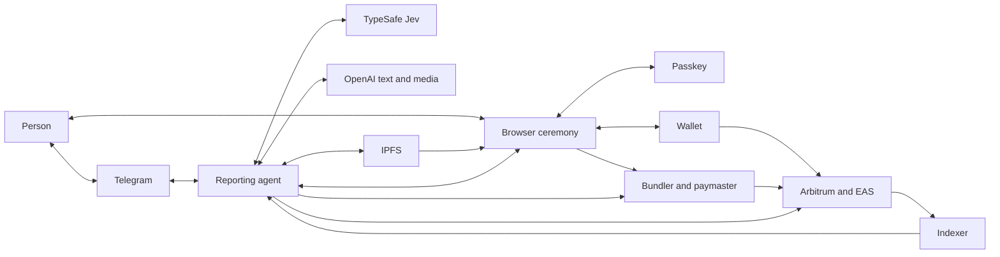

**Verified:** the agent receives chat, prepares publication and reconciles chain evidence. The person signs owner actions in the browser.
The indexer supplies discovery and work context, not the final authority to announce a successful send. [^runtime][^authority][^settlement]

### A2 — Parts and stores

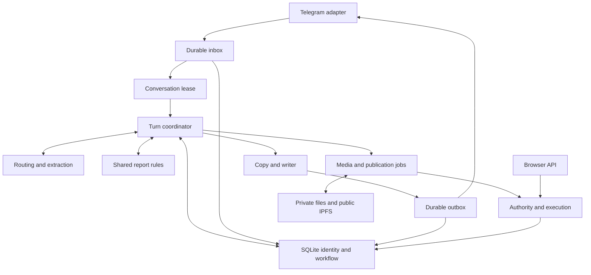

**Verified:** there are real seams between intake, dialogue, domain rules and execution. SQLite ties their state changes together.
The main dialogue weakness is the coordinator's question policy. Shared already owns required fields, provenance and confirmation digests. [^inbox][^commit][^schemas][^worker][^domain]

### A3 — One chat turn

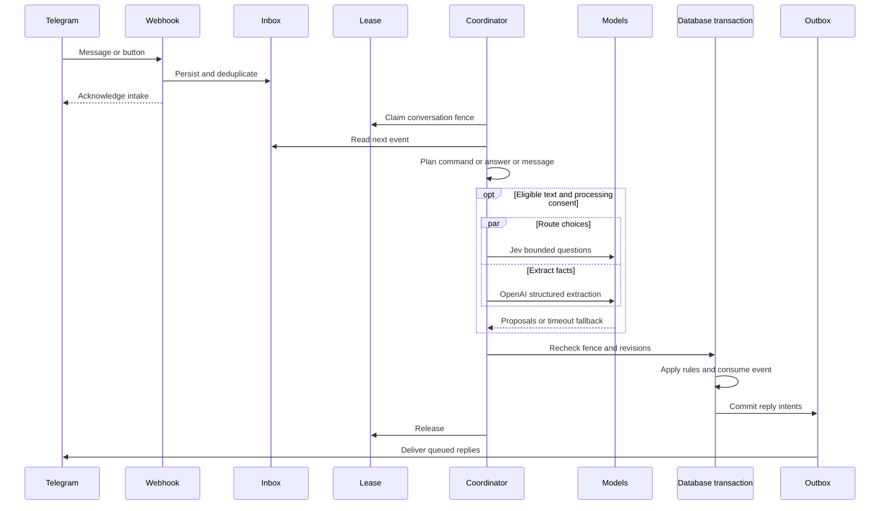

**Verified:** external work happens outside the committing transaction, then revisions and the lease fence are checked again.
The configured interpretation deadline is 12 seconds; the single tick waits through conversations and jobs before dispatching replies. [^turn][^commit][^worker][^deadline]

### A4 — Report life

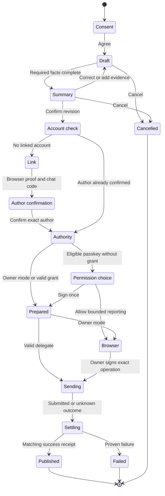

**Verified:** account proof, publication consent and transaction authority are distinct. Membership may block the Authority step.
Unknown sends remain in settlement; a new attempt is not offered just because a request timed out. This diagram compresses storage states into user-facing stages. [^authority][^attempts][^settlement][^grant]

### A5 — Link and switch

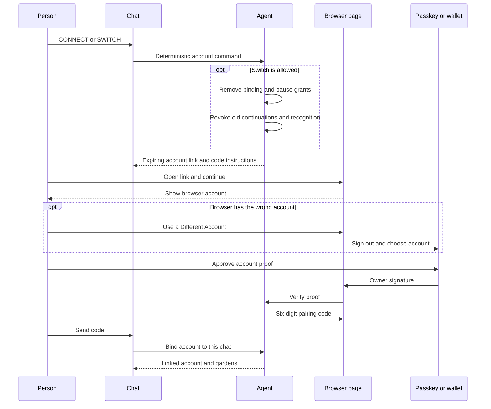

**Verified:** a browser's remembered account is separate from the chat binding. The new page control addresses that mismatch.
Disconnect pauses server use of permissions; it is not an onchain revocation or a universal browser logout. [^switch][^browser][^recognition][^pairing]

### A6 — Owner and permission publishing

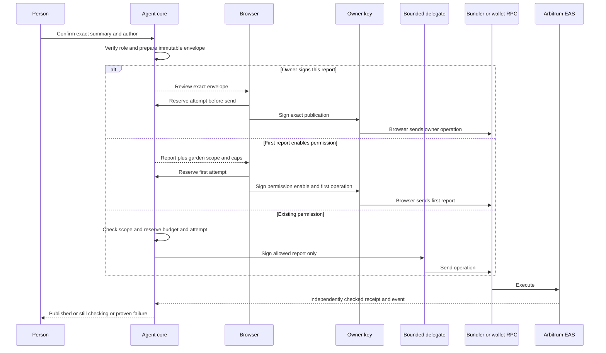

**Verified:** owner signatures remain in the browser, while delegated keys have report, garden, count, time and gas restrictions.
Only reconciliation can turn a send into a published outcome. Review-permission rollout is narrower than this general mechanism. [^grant][^delegate][^attempts][^settlement][^liveproof]

### A7 — Identity and conversation data

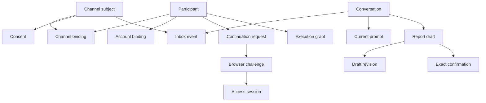

**Verified:** a channel subject, participant, account and browser session are different identities. Epochs and binding state limit stale access.
Arrows show ownership or references, not cardinality. Unique live prompts, account bindings and open drafts constrain their histories. [^schemas][^pairing][^recognition]

## 3. Why it feels like a robot

### Ranked causes

| Rank | Cause and evidence | Consequence |
|---|---|---|
| 1 | **Verified:** the open question captures text before general interpretation. Numeric and time answers have dedicated parsers. [T2](#t2-a-complete-story). [^context][^turn][^answers] | An understandable sentence becomes the wrong kind of answer. Adding greeting phrases does not change this ownership. |
| 2 | **Verified:** the extractor only allows detail fields from the selected activity in the supplied catalogue. Routing and extraction share an earlier snapshot. On an ordinary message with an existing activity snapshot, `needsCatalog` is false and the request supplies an empty activity list. **Inferred:** both opening-story detail capture and later free-text detail correction can miss their field schema even with models on. [T2](#t2-a-complete-story). [^extract][^turn] | “I already told you” is structurally likely even with models enabled. Preserve pending evidence and re-extract once the schema is known. |
| 3 | **Verified:** one missing requirement drives one prompt. There is a special unitless-number ordering heuristic, not explicit dependencies or related question groups. [T9](#t9-infrastructure-milestone-reconstructed). [^prompting] | Good data entry becomes a long interview. The single live prompt is useful for safety; it need not mean one fact per turn. |
| 4 | **Verified:** form titles and placeholders become chat questions. [T9](#t9-infrastructure-milestone-reconstructed). [^activity][^prompting] | “Milestone Value” exposes the data model instead of explaining what the gardener should say. |
| 5 | **Verified:** acknowledgements are mostly generic templates. Jev has a finite intent taxonomy; its result controls whether extraction facts survive. [T4](#t4-which-one-is-mine). [^routing][^interpret][^copy] | The user cannot tell which facts were understood or why a question matters. A closed action vocabulary is desirable; a small phrase/intent vocabulary should not be the whole conversation. |
| 6 | **Verified:** draft state, provenance, prompt state and recognition exist, but the model request contains no recent dialogue and no previous-report preferences. [T6](#t6-a-correction-after-the-summary). [^turn][^work][^recognition] | “No memory” is too broad. What is missing is conversational context and carefully scoped defaults, not durable storage. |
| 7 | **Verified:** several sends can follow one input. Switching produces four messages; photo intake plus consent can produce three. [T5](#t5-a-photo-with-no-words), [T7](#t7-switching-accounts). [^transport] | Instructions and the next action scatter through the thread. Acknowledgement, fact delta and next question should usually be one reply. |
| 8 | **Verified:** the review has its own decision, confidence and feedback questionnaire; the generic consent acknowledgement addresses a gardener. [T8](#t8-steward-review-and-the-publication-tail). [^review] | Review intent is lost in the transition through account linking. Keep the pending goal across interruptions. |

### Before transcripts and reproduction

**Verified, fixture driver, models off.** I started `bun run --cwd packages/agent reporting:driver` from the pinned temporary source and ran its documented `walkthrough.ts` against loopback. I also ran a temporary harness through the same driver's HTTP endpoints for the eight requested scenarios. Both runs exited successfully. The final fixture state contained one published work and one published review. The additional harness exercised actual inbox/coordinator/outbox code, not hand-written replies.

The initial sandbox refused local listener/network operations; the loopback-only run succeeded with the required execution permission. Dependencies already on disk were reused. No package installation, provider keys, `.env`, production calls or real publications were involved. The fixture catalogue contains only Tree planting and Weeding. The synthetic photograph was a solid-colour test image. No vision quality claim follows from it. [^driver]

The following are excerpts. `[…]` omits material; `[code]`, `[account]` and `[transaction]` replace random fixture identifiers. Each `Bot` paragraph is a separate emitted message. The excerpts are retained here so the report does not depend on temporary transcript files.

#### T1: hello

```text
Person: hello
Bot: Hi! I'm the Green Goods reporting assistant. To help you report garden work,
     I store and read the messages and files you send here. Nothing becomes public
     until you confirm a report. […] Do you agree?
Person: I agree
Bot: Thank you! Tell me about the work you did. You can send text and photos.
Bot: Hi! I help you report garden work on Green Goods. Want to connect your account
     first, so I can show your gardens? You can also just tell me what you did,
     and I'll ask you to connect when you publish.
     [Connect account]
```

**Verified:** “hello opens a report and asks for a garden” is stale for this revision. Two overlapping welcomes remain.

#### T2: a complete story

```text
Person: At TAS today I planted 12 baobab seedlings by the fence. It took 3 hours.
Bot: [Processing consent notice]
Person: I agree
Bot: Thank you! Tell me about the work you did. You can send text and photos.
Bot: Which garden is this report for? [TAS / Aiyeloja Family Garden]
Person: TAS
Bot: Which activity in TAS best matches your work? [Tree planting / Weeding]
Person: Tree planting
Bot: Got it: Tree planting at TAS. 3 quick questions, then a summary to check.
Bot: 1 of 3 · Seedlings planted? Send just the number (seedlings).
Person: 12 baobab seedlings, 3 hours
Bot: This is counted in seedlings, but you wrote baobab seedlings, 3 hours.
     Could you give it in seedlings?
```

**Verified:** this is the fallback experience. **Inferred from the dispatch code:** a numeric prompt without options also bypasses the model when providers are on. The opening story with models on was not measured. [^turn]

#### T3: login during a garden question

```text
Bot: Which garden is this report for? [TAS / Aiyeloja Family Garden]
Person: I would like to log in
Bot: To connect your Green Goods account (wallet or passkey), verify it here.
     The link expires in 10 minutes and never moves funds.
     Open it in Safari or Chrome. […] [Verify account]
Bot: When the page shows a code, send the six digits alone here.
```

**Verified:** the phrase now interrupts the question correctly. Account phrases run before question parsing. [^commands]

#### T4: which one is mine?

```text
Bot: Which garden is this report for? [TAS / Aiyeloja Family Garden]
Person: which one is mine?
Bot: A garden is the community or place your work belongs to. Pick the one where
     you did this work, or send CONNECT to link your account and see your own
     gardens first.
Bot: Which garden is this report for? [TAS / Aiyeloja Family Garden]
```

**Verified:** the unlinked fallback explains the concept instead of answering the ownership question. **Recommendation:** state the missing account knowledge directly, then offer connection or manual choice.

#### T5: a photo with no words

```text
Person: [photo]
Bot: [Processing consent notice]
Person: I agree
Bot: Thank you! Tell me about the work you did. You can send text and photos.
Bot: Photo added to your report.
Bot: Which garden is this report for? [TAS / Aiyeloja Family Garden]
```

**Verified:** intake works. **Unknown:** what a live model would infer from a real photograph. Do not treat a photo as proof of a count, time spent or who performed the work.

#### T6: a correction after the summary

```text
Bot: Please check your report for TAS:
     • Activity: Tree planting
     • Time spent: 3 h
     • Description: At TAS today I planted 12 baobab seedlings by the fence.
       It took 3 hours.
     • Seedlings planted: 12 seedlings
     • Main species: Baobab
     • Photos: 1
     […] [Confirm / Edit / Cancel]
Person: Actually it was 14 seedlings, not 12.
Bot: What would you like to change? Just tell me, for example: “time was 3 hours”.
```

**Verified:** this free-text fallback does not apply the correction. **Inferred for models-on:** a correction after the summary takes the ordinary-message path. With an existing activity snapshot, that path passes no catalogue to extraction, so `allowedFields` excludes the activity details. This is a concrete contract gap, not just a copy problem. [^turn][^extract] In the separate walkthrough, `Edit → Seedlings planted → 14` updates the numeric field, but the description still says “twelve.” A contradiction survives into the displayed summary. Correction must invalidate confirmation and reconcile overlapping statements, while letting the person approve revised wording. [^work][^message]

#### T7: switching accounts

```text
Person: switch
Bot: Done. This chat is no longer connected to [old account], and any chat
     reporting permission you approved for it is paused. Send CONNECT to link an account.
Bot: To connect your Green Goods account (wallet or passkey), verify it here. […]
Bot: When the page shows a code, send the six digits alone here.
Bot: The page opens with the account your browser last used. To link another,
     tap “Use a different account” there.
Fixture page: account proof verified, pairing code displayed
Person: [six digits]
Bot: Your account [new account] is now linked. Your gardens: TAS.
```

**Verified:** the fixture can switch the binding. It does not run the browser's account selector. The browser control is source-verified only. “Cancelling a review did not free switching” is addressed by the current open-state checks, but I did not repeat that case on a real device. [^switch][^browser]

#### T8: steward review and the publication tail

```text
Steward: REVIEW
Bot: [Processing consent notice]
Steward: I agree
Bot: Thank you! Tell me about the work you did. You can send text and photos.
Bot: To review work, verify your existing Green Goods account […]
Bot: When the page shows a code, send the six digits alone here.
Steward: PAIR [code]
Bot: Your account [steward account] is now linked. Your gardens: TAS.
Steward: REVIEW
Bot: Work waiting for your review in TAS. Choose one to start: [Tree planting]
Steward: 1
Bot: Do you approve or reject “Tree planting” by [gardener account]?
Steward: Approve
Bot: How confident are you in this work? [Low / Medium / High]
Steward: High
Bot: Add feedback for the gardener (it will be public).
     For an approval you can reply SKIP.
Steward: Clear photos and counts, thank you
Bot: [Exact review summary, public disclosure, Confirm / Edit / Cancel]
Steward: CONFIRM [code]
Bot: Open this page to check and sign your decision with your wallet. […]
Fixture browser: signs review envelope
Bot: Your review is recorded ✅ Transaction: [fixture transaction]
```

The preceding report in that walkthrough needed `CONFIRM → browser proof → PAIR → PUBLISH → browser signing`. Its outcome was “Your report is published ✅”, followed by a work identifier and an Arbiscan transaction URL. **Verified:** settlement and notification work in the fixture; no wallet UI, passkey hardware, public transaction or sponsorship was tested. [^driver]

#### T9: Infrastructure Milestone, reconstructed

**Verified source reconstruction, not a driver or model transcript.** Given a selected activity, its patched question order asks `milestoneType` before the unitless `milestoneValue`. The following uses the checked-in labels and copy. Question counters are omitted. [^activity][^prompting][^copy]

```text
Bot: Milestone Type: Select the type of milestone.
     [Solar kW installed / Battery kWh added / Internet Mbps provisioned /
      Retrofit completed / Commissioning]
Person: Solar kW installed
Bot: Milestone Value: Enter the numeric value for this milestone.
     Send just the number.
```

**Verified:** the order patch helps, but the second question still lacks a conversational explanation or an explicit derived unit. **Unknown:** the intended numeric meaning for Retrofit completed and Commissioning. Do not invent “1” or a percentage without an activity-owner decision.

## 4. Journeys today

### Counting the friction

**Inferred from source and the observed walkthrough, not measured on phones.** These are reproducible path counts, not a claim about every device. A *step* is a meaningful user stage. A *tap-equivalent* is a send, button press or authenticator approval. Typing characters, paste gestures, scrolling and app-switch gestures are excluded. Automatic redirects are not taps. App switches count moving between Telegram, an external browser and a separate wallet app. Returning to Telegram to see the result is included in switches. Hardware and wallet prompts can add actions. [^browser][^ceremony][^driver]

The reference report starts unlinked, with a multi-garden catalogue, and uses the models-off Tree planting flow. It supplies no optional photo or correction. Its ten chat actions are: story, processing consent, garden, activity, count, species, duration, summary confirmation, pairing code, account-bound publication confirmation. The driver permits this activity without a photo; Infrastructure Milestone requires one. [T2](#t2-a-complete-story), [T8](#t8-steward-review-and-the-publication-tail). [^activity]

| Person or action | Steps to first publication | Tap-equivalents under these assumptions | App switches | Additional condition |
|---|---:|---:|---:|---|
| Existing passkey, browser signed out | 11: eight chat stages, link/prove/pair, author confirmation, sign publication | **20** = 10 chat + 2 link taps + 2 page Continue + Use Passkey + sign-in approval + Sign to Continue + proof approval + Publish + publication approval | **4**: Telegram → browser → Telegram → browser → Telegram | Same browser recognition still valid for second page. [^recognition] |
| Existing passkey, already connected in browser | 11 | **18**, omitting Use Passkey and sign-in approval | **4** | A connected account still proves ownership for the new linking challenge. [^browser] |
| Newcomer with no account, Community Garden path | 13, adding account creation and joining | **About 23**: replace two sign-in actions with Create, name submission and passkey creation, then add Join and its approval | **4**, plus any unsupported-browser escape | Conditional path only. Real account creation/join was not run. For an ordinary garden needing a steward's admission, time and actions to publication are **Unknown**. [^browser][^authority] |
| Existing wallet, signed out, separate wallet app | 11 | **About 21–25**: passkey path with wallet choice/connect approval and provider-specific prompts | **About 10**: four chat/browser switches plus three browser ↔ wallet round trips | A desktop extension may have zero extra app switches, but still has approval dialogs. [^ceremony] |
| Switch passkey accounts, no unresolved publication | 4: switch request, browser selection, proof, chat pairing | **About 10–12**: SWITCH, link, Continue, switch control, account selection/authentication, proof button/approval, code send, possibly account-sheet open/name lookup | **2**: Telegram → browser → Telegram | Does not publish. Account-sheet placement and passkey chooser vary. [T7](#t7-switching-accounts). [^browser] |
| Switch wallet accounts | Same four stages | **About 11–15** | **About 6**, if connecting and proving each opens the wallet app | Wallet's own account selection adds provider-specific actions. [^browser][^ceremony] |
| Linked person with a valid report permission | Eight fallback chat stages become seven because processing consent already exists | **7** for a fresh fallback report: story, garden, activity, count, species, duration, Confirm | **0** | Auto-selection can remove garden/activity actions. Permissions do not remove exact report confirmation. [^work][^authority] |

Add one send for a separate photo. Add two proof actions if browser recognition has expired. Add external-browser escape actions if Telegram first opens an embedded browser. For a newly deployed eligible passkey account choosing permission activation, add the chat permission choice; the browser's **Allow and Publish** replaces ordinary Publish, rather than requiring a separate empty permission transaction. An undeployed account is a known edge: the handoff says chat can offer a permission that the page refuses. Its safe fallback is the owner-signed first report. [^grant][^recognition][^liveproof]

These counts intentionally expose uncertainty. A single “three taps to publish” claim would hide linking, author consent, device authentication and membership.

### Shortest safe journeys to aim for

**Recommendation — account entry:** before invoking a passkey prompt for a newcomer, explain “New to Green Goods? Create an account” and “Already have an account? Use your passkey.” If Use Passkey is the entry button, it should open this choice when account status is unknown. No available credential should lead to a clear create-or-existing-account choice, not an unexplained recovery screen. Preserve the draft and offer another device or wallet where supported. Account creation always needs an explicit choice. [F2](#october-7-live-feedback)

**Recommendation — garden selection:** after linking, load the account’s eligible reporting gardens. Zero: explain there is no reporting membership yet and offer joining. One: select it, say “I’ll use [garden] for this report,” and provide Change garden / Join another garden. Several: show only those gardens. An unavailable membership lookup is an error/retry state, not zero memberships or permission to show the whole catalogue. Recheck authority before publication. A join request follows the garden’s admission policy; pending admission never becomes reporting authority. [F3–F4](#october-7-live-feedback)

**Recommendation — newcomer:** consent → tell the story → correct the understood facts → connect/create when ready → see the exact report and author → sign → receive a clear result. Explain “your Green Goods account” before wallet terminology. If the selected garden cannot admit the new account immediately, say so before asking for publication signatures. Offer the Community Garden only as an explicit choice, never silently move work there.

**Recommendation — passkey:** after linking, keep the exact account visible and reuse short-lived recognition within its current constraints. For an eligible deployed account, offer “Publish this report only” or “Allow up to five reports for this garden until [time], including this one.” Default to one report. Owner approval stays in the browser. A later complete report can become **story → exact summary → Confirm**, with zero app switches while its permission is valid.

**Recommendation — wallet:** one exact publication approval in the wallet after the necessary browser/account checks. Do not market chat-only repeat publishing to EOAs while the supported permission mechanism is passkey-account-only. Keep provider-specific wallet prompts in the measured acceptance matrix. [^liveproof]

**Recommendation — profile access:** show the browser account and Sign out immediately when the ceremony opens, including before Continue. Signing out must not require account proof first. Explain that this ends browser access; a separate Disconnect chat action ends the chat binding, and removing an onchain permission is a separate owner-authorized action. Preserve any submitted operation and its outcome tracking. [F6](#october-7-live-feedback)

**Recommendation — account switch:** expose `/account`, `/switch` and `/disconnect` in the menu and an Account button in help/status. Explain the distinction between disconnecting chat, signing out of the page and removing an onchain permission. When safe, suspend the draft and connect the replacement account. Recheck its garden role and reissue the summary bound to the new author. If a send is unresolved, keep that publication attached to its original author and explain that it is still being checked. Never label a server pause as onchain revocation.

**A limit worth accepting:** with the current external-browser proof plus chat pairing boundary, first linking still needs a return to chat. Keep the same browser ceremony resumable after pairing instead of issuing a second unrelated page. That reduces page setup and lost state, but **does not honestly reduce four app switches to two**. A verified Mini App binding can potentially remove the code round trip; it needs its own evidence before becoming the default.

### Mini App, passkeys and handoffs

| Decision | Official documentation and assessment | Recommendation |
|---|---|---|
| Telegram Mini App | Telegram requires server validation of raw `initData`; `initDataUnsafe` is not trustworthy. Validate the signature/hash, expected bot, freshness and available subject fields. This authenticates Telegram-provided launch data. It does **not** prove account ownership, membership, owner consent or transaction success. [Telegram Mini Apps](https://core.telegram.org/bots/webapps) | Treat validated launch data as channel proof only. Bind a one-use server challenge to subject, nonce, purpose, draft revision and identity epoch. Still prove the Green Goods account and show exact publication consent. A stolen or replayed launch must not link a different account. |
| Passkeys in Telegram's browser | WebAuthn binds credentials to relying-party/origin rules. Android WebView support requires host-app integration; platform capability does not prove Telegram enabled it. Telegram's biometric token API is not a Green Goods WebAuthn signature. [WebAuthn](https://www.w3.org/TR/webauthn-3/), [Android WebView integration](https://developer.android.com/identity/sign-in/credential-manager-webview), [Telegram Mini Apps](https://core.telegram.org/bots/webapps) | Keep the person's browser as the default until iOS/Android Telegram builds pass real creation, sign-in and transaction tests. Capability detection alone is insufficient. Offer Open in browser and Copy link. Do not claim every embedded browser fails. |
| Beta versus public website | **Verified:** the agent allows one configured site, with beta selected in checked-in Fly configuration. **Unknown:** actual deployed RP-ID settings and portability of each existing credential were not tested. [^site] | Verify the application's actual RP ID and origins. A passkey can be scoped to a permitted parent domain; do not assume either cross-subdomain portability or incompatibility solely from the URL. Show the correct site before authentication. |
| Desktop to phone | Telegram supports bot deep-link payloads with a 64-character limit. WebAuthn supports cross-device authentication mechanisms, but available UX depends on the platform. [Telegram bot features](https://core.telegram.org/bots/features#deep-linking), [WebAuthn](https://www.w3.org/TR/webauthn-3/) | Offer a QR containing a short-lived HTTPS continuation, and a separate return-to-chat link. Neither QR nor deep link is account proof. Bind redemption to the pending subject/purpose, expire/revoke it, and prevent concurrent redemption. Keep manual code fallback for poor handoffs. Never put owner signatures, account authority or private report text in URLs. |
| Link at first contact | **Verified:** greeting now offers optional connection, while reporting can begin before linking. [T1](#t1-hello). [^switch] | Keep it optional. Offer it when asked “which garden is mine?” or when it saves ambiguity. Require it before author-bound confirmation, not before telling a story. |
| Permission up front or at first report | **Verified:** the current design already combines eligible first-report activation with the actual publication. [^grant] | Prefer the first real report, with one-report signing equally prominent. Do not ask an unfamiliar person to approve abstract future powers on arrival. Gate the option on account deployment and supported module state. |

## 5. Options compared

Effort is a planning estimate for one engineer familiar with this code, including focused proof, not a delivery promise. Latency is a **target added server delay for a model-eligible text turn**, not a measurement or chain-confirmation estimate. No live provider benchmark was run. Today's 12-second model deadline and serial worker can make end-to-end delay materially worse. [^deadline][^worker]

| Design | Code changes and effort | Gain | Main risk and containment | Illustrative model cost per eligible text turn | Delay target and proof |
|---|---|---|---|---|---|
| **1. Rules plus better wording/questions** | Chat metadata, `prompting`, `report-answer`, copy, transport composition. **1–2 weeks**, in small releases. | Clearer questions, fewer messages, dependable fallback. Limited understanding of arbitrary corrections and mixed requests. | Coverage grows into more rules. Reject unknown input honestly and offer choices. Protect with transcript/state tests. | **$0** without models. Existing dual-call example **$0.00148** when invoked. | Deterministic processing target **<0.2 s**, plus queue/network. Model-assisted turns **2–5 s** target. |
| **2. Hybrid generated acknowledgements/clarifications** | Add a structured reply proposal and grounded composer around current extraction; keep fixed disclosures, summaries and outcomes. **2–3 weeks**. | Feels warmer and explains understood facts. Does not by itself repair question-first dispatch or catalogue blindness. | Invented facts/outcomes and wrong language in prose. Facts rendered by code, allowlisted question references, locale checks, deterministic fallback. Evaluate unsupported claims and repeated questions. | Example 2,500 input + 550 output tokens and Jev: **$0.00192**. A separate writing call would cost more. | **2–5 s** if combined into extraction; roughly **4–8 s** if sequential. Must benchmark. |
| **3. Model chooses validated dialogue actions** | Replace question-first arbitration with proposal validation; add action schema, context and catalogue resolution. Reuse core writers/authority. **3–5 weeks**, staged. | Multi-field stories, corrections, interruptions, related questions and fewer wasted turns. | Valid JSON can still choose the wrong action or fact. No authority/consent/outcome actions, strict revisions and candidates, bounded calls, evidence and contradiction checks. Replay and adversarial evaluations. | Example 3,000 input + 700 output tokens: **$0.00232**. A needed catalogue-resolution pass adds **$0.00136**, total **$0.00368**. | **2–5 s** one pass, **4–8 s** two-pass target. Hard deadline then fallback. |
| **4. Recommended: bounded planner plus fact-based response composition** | Design 3 for understanding and next-question proposals. Deterministic acknowledgements from accepted changes and all consequential statements. Optional generated connective wording only after evaluation. **Same staged 3–5 week scope**, excluding HA migration. | Most of the conversational gain with a smaller invented-claim surface and a strong models-off path. | Overtrust in the planner, privacy leakage, stale state. Enforce a model gateway, action validator, immutable confirmations and fallback planner. | Same as design 3 initially. Do not add a second prose model by default. | Same budget as design 3. Measure p50/p95 and abandonment by locale/device. |

**Cost basis:** GPT-4.1 mini is listed at $0.40 per million input tokens and $1.60 per million output tokens. Jev 1.13 is listed at $0.042 per million input tokens with no output-token charge. The existing example assumes 2,000 OpenAI input, 400 output and 1,000 Jev input tokens: `(2000 × .40 + 400 × 1.60 + 1000 × .042) / 1,000,000`. Proposed examples use the same OpenAI model to make comparisons fair; design 3/4 do not assume an additional Jev call. [OpenAI model pricing](https://developers.openai.com/api/docs/models/gpt-4.1-mini), [TypeSafe models](https://docs.typesafe.ai/models)

These figures exclude retries, infrastructure, storage, sponsorship and media. A one-minute transcription is approximately **$0.003** at the listed mini-transcribe rate, before extraction. Images and PDFs add input usage dependent on size/detail/pages; measure actual token usage rather than price them as plain text. A five-call report at the recommended one-pass example is about **$0.0116** in text inference. Ordinary commands and consent should cost zero model tokens. [OpenAI pricing](https://developers.openai.com/api/docs/pricing)

TypeSafe documents independent questions over the same state, and its model catalogue cautions about non-English performance. It is a useful optional classifier, not a dialogue manager or a source of truth. Keep it only if comparative English/Spanish/Portuguese evaluations show it improves quality or cost. Its precedence over a useful extraction should become an explicit, tested policy. [TypeSafe state](https://docs.typesafe.ai/concepts/state), [TypeSafe models](https://docs.typesafe.ai/models)

## 6. Recommended design

### The proposed contract

The planner receives a privacy-filtered, bounded snapshot: language, active goal, current canonical fields with provenance, the last two to four relevant redacted turns, the exact outstanding question, allowable gardens/activities/questions, unresolved conflicts and limited preferences. It gets opaque local IDs, not account addresses, phone numbers, continuation links, signatures or provider identifiers.

It returns a proposal such as:

```json
{
  "goal": "report",
  "changes": [
    {"field": "seedlings", "value": 12, "source": "message_7", "span": "12 baobab seedlings"},
    {"field": "species", "value": "baobab", "source": "message_7", "span": "baobab"},
    {"field": "timeSpentMinutes", "value": 180, "source": "message_7", "span": "3 hours"}
  ],
  "next": {"kind": "ask", "questionIds": ["work_photo"]}
}
```

This is an illustrative schema, not a new field contract for existing activities. `species` values must come from the selected activity's actual options. The core checks every field, value, unit, source span, role, catalogue version and revision. A source span supports traceability; it is not proof that a model interpreted it correctly.

Allow a small set of proposals: **select an offered garden/activity, propose field changes, request an allowed question/group, show the summary, request an account-link step, or explain validated state**. The model never gets a capability to sign, send, confirm, consent, delete, revoke or report an outcome. A proposed link becomes a deterministic request for a server-created link after policy checks; the model never writes the URL. STOP, DELETE, commands, button confirmation and account switching remain deterministic interrupts.

Resolve garden/activity before extracting their fields. If already known, one call can fill many fields. If not, do one bounded catalogue-selection step, then at most one extraction pass against the chosen schema, reusing the original redacted evidence. Cache only public, versioned catalogue data. Never let the model browse arbitrary URLs to “find” activities. Limit the total deadline and token budget; no autonomous loop.

Preserve one **interaction** and one confirmation revision per conversation, but let that interaction ask two related things: “How many seedlings, and which species?” Answers can fill either, both or other valid fields. Ask only for requirements still missing after validation. If the model is unavailable, accept exact choices and simple multi-field labelled answers, then fall back to a clear single question. Do not promise free-text understanding that the fallback lacks.

For corrections, retain the person's original source privately, update canonical facts and rebuild the proposed public description. If “14” conflicts with “twelve” in the description, show the change and ask for approval of the revised summary. An explicit user correction may replace an earlier user value; a model observation from a photograph may not silently do so. Every material correction invalidates the old confirmation and any unsent preparation.

Defaults should save effort without inventing work: suggest the last garden/activity only for the same linked account and current eligible catalogue. Say “TAS again?” Let users disable/forget preferences. Never copy counts, time, photos, completion claims or review decisions from the last report. Clear or detach account-scoped preferences on switching, STOP and DELETE according to the disclosed retention policy.

### B1 — System context

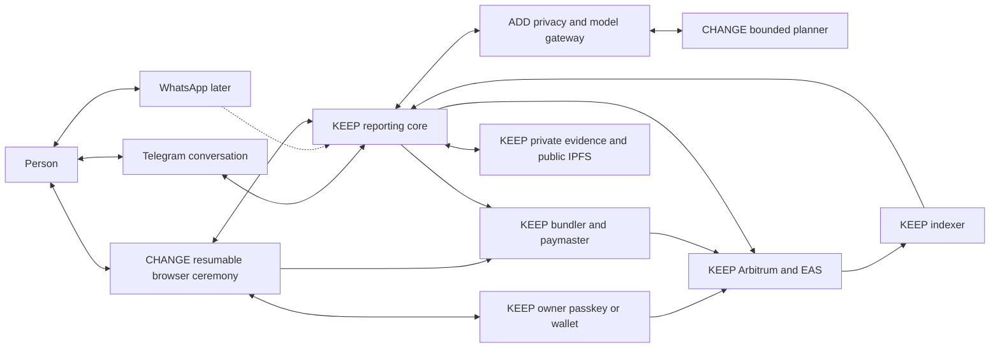

**Proposal:** change the conversation and handoff while keeping the chain and owner-signing boundary.
The model sits behind a privacy gateway and cannot reach execution systems. Compare A1. Target seams: runtime wiring, interpretation and browser ceremonies. [^runtime][^ceremony]

### B2 — Parts and stores

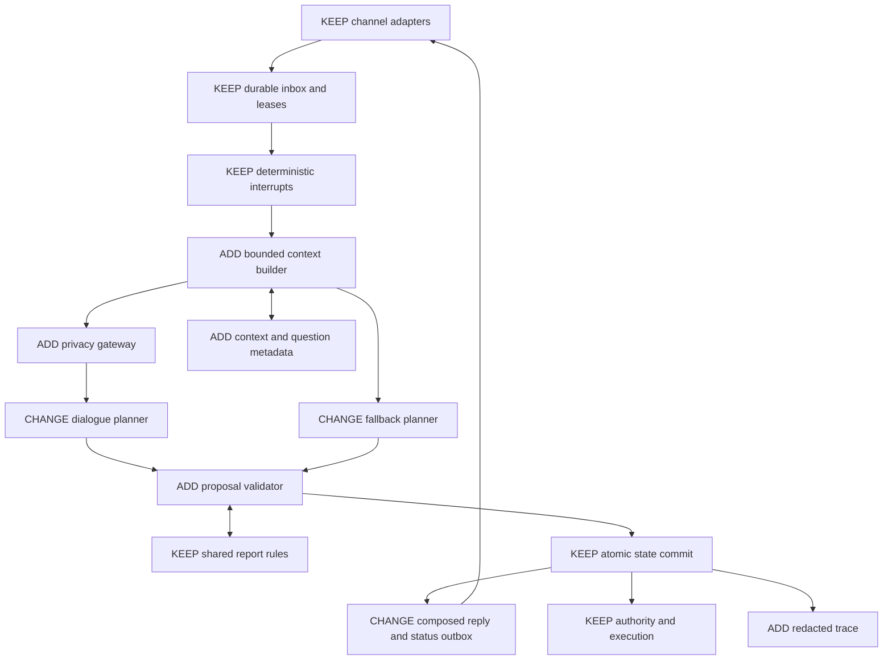

**Proposal:** replace question-first arbitration with a validated proposal pipeline. Remove intent-specific phrasing branches as their behaviour becomes covered.
Keep a deterministic fallback planner using the same validator, metadata and writer. Compare A2. [^context][^answers][^work]

### B3 — One chat turn

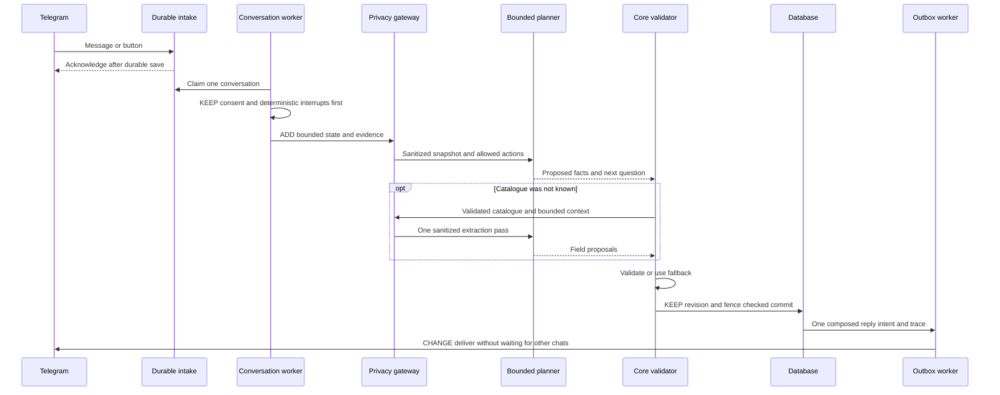

**Proposal:** run limited concurrent conversations while retaining one worker per conversation and atomic fencing. Separate outbound delivery from slow model/media work.
Do not hold a database transaction over a model call. Late responses cannot revive cancelled or superseded work. Compare A3. [^commit][^worker]

### B4 — Report life

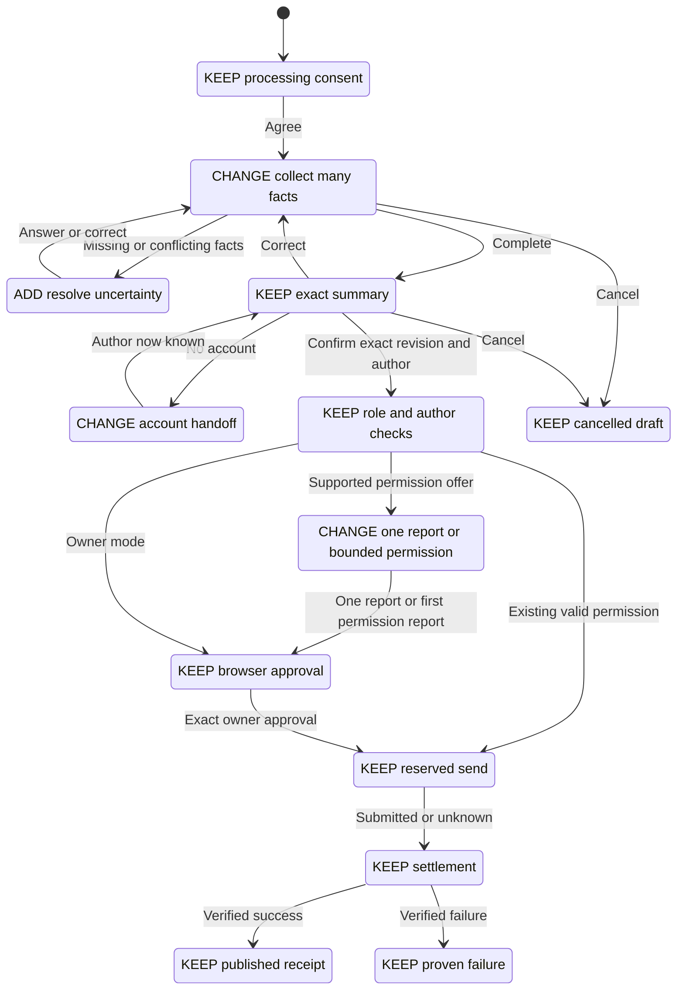

**Proposal:** make collection conversational without merging the safety states. Unknown remains a settlement state, not an invitation to retry.
Remove redundant navigation around account linking, not the requirement to confirm the final author and exact content. Compare A4. [^authority][^settlement]

### B5 — Link and switch

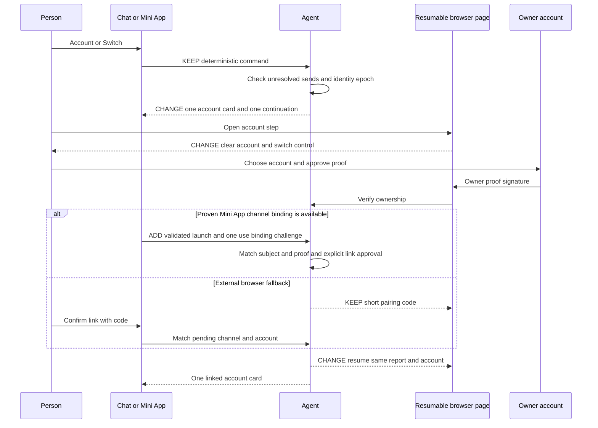

**Proposal:** preserve both proofs, with a Mini App shortcut only after its subject binding is independently tested.
External-browser users keep code pairing and resume the same page; account switching rechecks the report author. Compare A5. [^pairing][^browser]

### B6 — Publishing

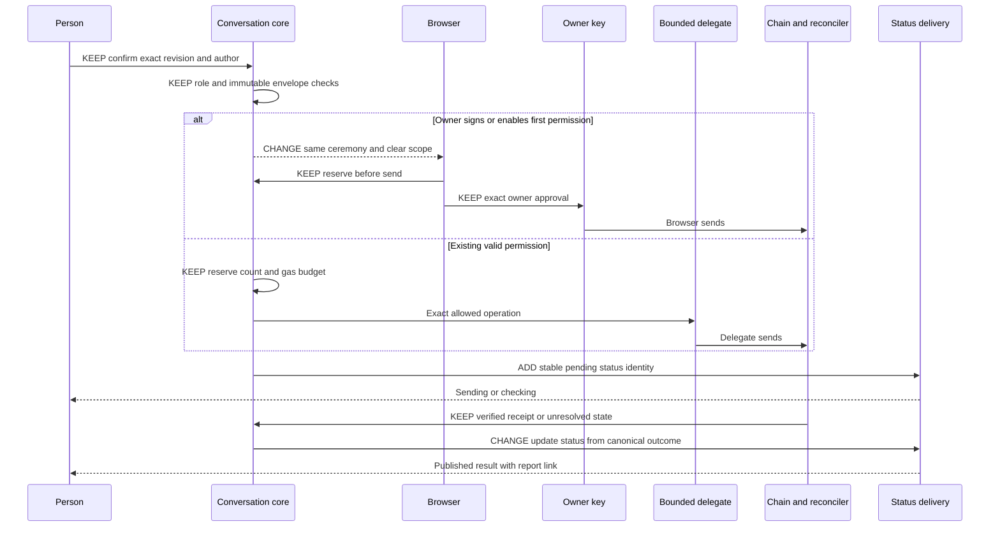

**Proposal:** execution changes little. Improve permission eligibility, presentation and status delivery around it.
The planner cannot access this path or author “published” wording. Compare A6. [^attempts][^settlement][^outbox]

### B7 — Identity and conversation data

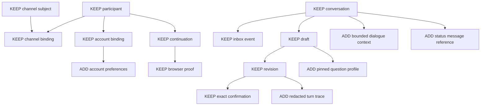

**Proposal:** add bounded context, account-scoped preferences, versioned questions, redacted traces and replaceable status-message references.
Keep the unchanged consent, grant and access-session tables from A7, omitted here for space. Chat history never grants publication permission. Compare A7. [^schemas]

### A chat-ready activity layer

**Recommendation:** begin with an **Agent-owned presentation overlay**, keyed by immutable activity identity/version and field key. Keep units, valid values, requiredness and conditional business meaning authoritative in the shared activity contract. Presentation metadata may live in the overlay; it must not silently invent new business rules.

A question profile should contain:

- EN/ES/PT question, short example and explanation of why it is needed.
- References to canonical units and allowed values, with localised display labels.
- Explicit dependencies such as `milestoneValue after milestoneType`, not “first select field anywhere.”
- Related-field groups, maximum two ordinary questions per reply, and a deterministic fallback.
- Evidence prompts, safe defaults policy and public/private display guidance.
- Version and source-schema digest so a draft retains the question meaning it started with.

For Infrastructure Milestone, propose these reviewed prompts:

| Field context | English | Spanish | Portuguese |
|---|---|---|---|
| Type | What did you install or finish? | ¿Qué instalaste o terminaste? | O que você instalou ou concluiu? |
| Solar value | How much solar capacity did you install, in kW? For example, 5 kW. | ¿Qué potencia solar instalaste, en kW? Por ejemplo, 5 kW. | Qual foi a potência solar instalada, em kW? Por exemplo, 5 kW. |
| Battery value | How much battery capacity did you add, in kWh? | ¿Cuánta capacidad de batería añadiste, en kWh? | Quanta capacidade de bateria você adicionou, em kWh? |
| Evidence | Add a photo of the installation. Check that it contains nothing private. | Añade una foto de la instalación. Comprueba que no incluya información privada. | Adicione uma foto da instalação. Confira se ela não contém informações privadas. |

These translations are proposals for native-speaker review. The solar/battery units are suggested by the current option labels, but making them conditional field semantics needs an activity-owner decision and shared validation. Retrofit/Commissioning needs a business definition before any numeric example. [^activity]

Migrate incrementally: add overlays for the most-used activities, validate their keys against catalogue snapshots, retain improved generic questions for the rest, and pin overlay versions per draft. When the same metadata proves useful in several clients, move its schema to Shared and publish it alongside activity definitions. Do not require a contract redeploy merely to improve a sentence. Do not make the public Agent configuration a second, diverging list of business constraints.

### Telegram fit and WhatsApp portability

**Verified current surface:** the private command menu exposes Start, Connect, Switch, Disconnect, Status and Help in three languages. Parsing supports more commands than that menu reveals. Replies use inline buttons, optional URL/copy buttons and separate `sendMessage` calls. Callback clicks are durably ingested, then acknowledged and their keyboard cleared. There is no typing call, album grouping or location-to-report handling in this adapter. [^menu][^transport][^normalizer]

**Official constraints checked:** Telegram callback data is **1–64 bytes**, not 64 characters. Copy buttons accept **1–256 characters**. Typing status lasts at most five seconds and is cleared when a message arrives. The API supports message editing. Design for provider throttling rather than assuming unlimited bursts. [Telegram Bot API](https://core.telegram.org/bots/api), [Telegram FAQ](https://core.telegram.org/bots/faq)

**Recommendations:**

- Keep inline choices attached to the relevant question. A persistent reply keyboard can displace normal typing and leave stale labels behind; use it sparingly, perhaps for explicit location sharing. Make `/new`, `/review`, `/account`, `/switch`, `/disconnect`, `/cancel`, `/status`, `/language`, `/help`, `/stop` and `/delete` discoverable, with clear translated descriptions. The command names can stay stable across languages. Natural language supplements them.
- Send one message containing what changed and the next question. Keep ordinary conversational messages readable in history. Edit **one operation status message** from “Sending” to “Checking” to the final outcome. Never mutate a confirmed summary into different content while keeping its confirmation button valid. A revised summary gets a new revision/token and old controls become inert.
- Extend the transport with capabilities for create/update status and transient typing, rather than importing Telegram methods into the core. Persist provider message ID and status revision. Retry safe edits, handle “not modified,” and fall back to a new status if editing is unavailable. Treat an ambiguous initial send as ambiguous delivery, not permission to duplicate it blindly.
- Show typing while actual work is in progress, with a bounded refresh. Do not write typing events to the durable publication log. If work exceeds the response budget, acknowledge receipt and explain the delay; do not repeatedly post “thinking.”
- Group albums by provider group ID within a small bounded window, attach all accepted media to the same draft, then acknowledge once. Handle late items and duplicate updates idempotently. Do not wait indefinitely for an album “end” event.
- Voice should become text evidence after explicit voice consent. Show what was heard when uncertain, preserve language, ask about unclear numbers, and never assume speaker identity. Location is optional and sensitive: ask why it is needed, do not infer garden membership from proximity, and do not publish exact coordinates by default.
- Use compact opaque callback handles looked up server-side. Bind them to subject, prompt, revision and expiry. Test UTF-8 byte lengths. Never put a full action document, address or permission in a callback. Copy buttons help move short ceremony links and codes to a browser; keep manual fallback.
- Announce success in human terms: “Published: 14 baobab seedlings at TAS.” Lead with **View attestation**, followed by **View transaction**. An optional **View report** link can open the Green Goods presentation, but should not replace the requested attestation detail link. Use the verified attestation UID and chain to construct the attestation URL; do not confuse a work identifier with an attestation identifier. [F5](#october-7-live-feedback) Only verified receipt state supplies that wording. If the indexer has not caught up, show the confirmed receipt and say the report page is updating. Do not wait on indexing to know the transaction succeeded.

**WhatsApp recommendation:** preserve the same event, action and reply-intent core, with channel-specific rendering. Do not assume a Telegram menu, editable status bubble or embedded Mini App exists. Support button/list limits through capability negotiation and short text fallbacks. WhatsApp's customer-service window permits free-form replies for 24 hours after a user message; outside it, approved templates are needed. That matters when settlement completes late. [Twilio WhatsApp concepts](https://www.twilio.com/docs/whatsapp/key-concepts)

Meta's current Cloud API guide could not be retrieved in this review. Its archived official SDK documents three reply buttons and ten list items; Twilio's current cards documentation also limits in-session WhatsApp cards to three buttons. Treat these as adapter constraints to revalidate against the actual selected provider before shipping, not universal limits for every template type. [Meta archived SDK](https://whatsapp.github.io/WhatsApp-Nodejs-SDK/api-reference/messages/interactive/), [Twilio cards](https://www.twilio.com/docs/content/twiliocard)

## 7. After transcripts

**Proposed acceptance examples, not generated or observed behaviour.** Bracketed buttons are deterministic actions. Names are fixture labels. These examples assume applicable processing consent; where it is new, the consent disclosure comes first. The authoritative summary always contains every public field, media reference/preview and author, even where an excerpt below abbreviates it.

### T1 — Hello

```text
Person: hello
Bot: Hi, I help you report work with your garden. Before I read your story or files,
     may I process and store them to prepare a report? Nothing is published until
     you approve the exact report. [Full reviewed privacy notice]
     [I agree] [No thanks]
Person: [I agree]
Bot: What did you work on? You can tell me in your own words or add a photo.
     If you already use Green Goods, connecting helps me find your gardens.
     [Connect account] [Help]
```

No report is created merely to answer a greeting. Keep STOP/DELETE instructions in the reviewed notice and accessible help.

### T2 — A complete story

```text
Person: At TAS today I planted 12 baobab seedlings by the fence. It took 3 hours.
Bot: I have 12 baobab seedlings at TAS, with 3 hours of work.
     [Exact proposed summary, author and disclosure]
     Is this right? [Confirm] [Change something] [Cancel]
```

For an activity that requires a photo, ask for that missing evidence before the summary. If TAS or the activity is ambiguous, ask only that choice, then reprocess the preserved story against its valid schema. Do not ask the count again.

Models-off fallback:

```text
Bot: I saved your story. Automatic understanding is unavailable right now.
     Choose the garden, then I'll help you check the details. [TAS] [Aiyeloja]
```

Later numeric questions accept simple supported forms such as “12 seedlings”; if a mixed sentence cannot be parsed, show what was accepted and offer the remaining choices. Never falsely claim all fields were understood.

### T3 — Login during a garden question

```text
Bot: Which garden was this for? [TAS] [Aiyeloja]
Person: I would like to log in
Bot: Your draft is saved. Connect your account so I can show your gardens.
     [Connect account] [Keep reporting without connecting yet]
Person: [Connect account]
[Account proof and channel binding completed]
Bot: Connected as Ada. TAS is your only reporting garden, so I’ll use it for this
     report. Your draft is saved. [Change garden] [Join another garden]
```

This proposed branch assumes a successful lookup found exactly one eligible reporting garden. With several, show only those gardens; with none, offer joining. The label “Ada” is shown only if trusted profile data supplies it. Account identifiers remain available on the exact signing page.

### T4 — Which one is mine?

```text
Person: which one is mine?
Bot: I don't know which gardens belong to your account yet.
     Connect to see them, or choose where you worked.
     [Connect account] [Choose a garden]
```

For an already linked account, use verified eligible-garden data. Distinguish “none found” from “I couldn't load your gardens.” Do not invent membership from a previous story or location.

### T5 — Photo only

```text
Person: [photo]
Bot: I received your photo. What work does it show, and which garden was it for?
Person: We planted 12 baobab seedlings at TAS.
Bot: I have the planting details and one photo. How long did you spend on the work?
Person: 3 hours
Bot: [Exact summary and photo preview] [Confirm] [Edit] [Cancel]
```

This path works without model vision. If approved, privacy-screened extraction later finds a possible label or count, present it as a suggestion to check. Do not assert that the gardener completed work simply because an image resembles it.

### T6 — Free correction

```text
Person: Actually it was 14 seedlings, not 12.
Bot: Changed the count to 14. The description also said 12, so the proposed
     description now says “Planted 14 baobab seedlings by the fence.”
     [Full revised summary with author and public disclosure]
     [Confirm revised report] [Edit] [Cancel]
```

The old Confirm button no longer authorizes publication. If a send has already begun, the response instead says that this submitted report cannot be changed while its outcome is being checked. Do not claim to have edited an immutable publication.

### T7 — Account switch

```text
Person: switch account
Bot: This chat is disconnected from Ada's account. Its chat reporting permission
     is paused. Your unfinished report is saved.
     [Connect another account] [What happens to the permission?]
Page, immediately on opening: [Profile: current browser account → Sign out]
Page: Choose the Green Goods account to connect.
      [Create an account] [Use an existing passkey] [Use wallet]
[New owner proof and channel binding]
Bot: Connected as Bea. Before publishing, please check the report with Bea as
     the author. [Review report]
```

Only say “disconnected” after that state change commits. If safe switching is blocked by an unresolved send, show its status and an explanation instead. The page must not promise that changing the chat account signed the website out everywhere.

### T8 — Steward review

```text
Steward: I'd like to review the planting report.
Bot: [Processing consent if needed, then account proof if needed]
Bot: Here is the report waiting for your review in TAS.
     [Report summary and evidence link]
     Do you approve it? You can also tell me your confidence and feedback together.
Steward: Approve. High confidence. Clear photos and counts, thank you.
Bot: [Exact review: Approve, High, public feedback, reviewer account]
     This decision and feedback will be public. [Confirm review] [Edit] [Cancel]
Steward: [Confirm review]
Bot: Check and sign your decision. [Open review]
[Verified settlement]
Bot: Your review is recorded. [View attestation] [View transaction]
     [View reviewed report]
```

Do not ask the steward to repeat REVIEW after linking. A rejection still requires whatever reason the shared review rules require. Never infer confidence or approval from politeness.

### T9 — Infrastructure Milestone

```text
Person: We installed 5 kW of solar at TAS today.
Bot: I have a solar installation at TAS, with 5 kW installed.
     Add a photo of the installation, and tell me how long the work took.
Person: [photo] 6 hours
Bot: [Exact report, including Solar kW installed, value 5, unit kW and photo]
     [Confirm] [Edit] [Cancel]
```

This depends on reviewed conditional-unit semantics and a matching offered activity. The planner cannot manufacture that activity or decide the meaning of Retrofit completed.

### Publication result — attestation first

```text
Bot: Published: 14 baobab seedlings at TAS.
     [View attestation] [View transaction]
```

**Proposal:** both links refer to the same verified publication. If no verified attestation identifier is available yet, show “The transaction is confirmed. I’m checking the attestation details” with the verified transaction link, then update the result when the identifier is known. Do not ask for another signature or send. This extends T2/T6 through the result requested in F5.

## 8. Roadmap

Each phase is independently releasable behind existing or new narrowly scoped controls. The duration is a planning estimate of working days. A phase ends when its acceptance evidence passes, not when its calendar allocation expires. Deployment is proposed here, not performed by this review.

| Phase | Duration | Shippable change | Acceptance check and evidence |
|---|---:|---|---|
| 1. Make failures explainable | 3–5 days | Redacted request/turn/ceremony correlation, page failure codes, measured queue/outbound timing, deployment marker. | Reproduce wrong account, expired link and unknown send. One trace explains each without raw text, URLs, signatures or phone numbers. Restart during a held event: it resumes once. |
| 2. Useful fallback conversations | 3–5 days | Question overlay for highest-use activities, explicit dependencies, grouped acknowledgements, full menu, clear account card, simple supported multi-field fallback. | T1–T9 state assertions in all three locales with models off. Milestone asks for the right quantity/unit. No repeated filled fields, stale confirmation or false “understood.” |
| 3. Bounded dialogue planner | 5 days for a narrow pilot | Privacy gateway, proposal contract, catalogue-resolution pass and multi-field/correction handling for planting and one milestone activity. | Same transcripts with recorded model responses plus adversarial and live model evaluation. Every authority mutation remains unreachable. Hold rollout if privacy or semantic thresholds fail. |
| 4. Repair browser continuity | 3–5 days | Same continuation resumes across linking, visibly selected account, typed recovery messages, permission eligibility before offering it. | Real account A → account B with a saved draft. Old summary cannot publish under B. Undeployed account has a working owner-sign path. Network interruption never invites duplicate send. |
| 5. Prove real publication | 3–5 days | Isolated staging bot and release smoke procedure using real browser signing. No real mainnet publication required by an ordinary unit suite. | Wallet and hardware passkey each complete an exact report on the chosen test environment; account mismatch is rejected. Separate authorised live-beta proof covers sponsorship, first permission report, next delegated report and revocation. Keep release blocked on required missing evidence. |
| 6. Telegram polish | 2–4 days | Stable edited status, album aggregation, bounded typing, result deep link, accessible copy/fallback controls. | Record phone runs on weak network. Ten-photo album attaches correctly without ten questionnaires. Old buttons are harmless. Rate-limit retries do not duplicate status/publication. |
| 7. Voice pilot, optional | 3–5 days | Voice consent, bounded transcription, language and numeric uncertainty handling, supported privacy policy. | EN/ES/PT recordings, background noise, decimal commas and mixed speech. No transcription before consent. No voice identity assumption. Pause this phase until the media privacy decision is resolved. |

Do not bundle an HA database migration into a five-day dialogue feature. Use separate releases: **HA1, 3–5 days:** introduce a storage boundary and run invariant contract tests against the proposed shared store; leave production on SQLite. **HA2, up to 5 days:** provision an isolated staging topology and prove migrations, restore and mixed-version compatibility. **HA3, up to 5 days:** rehearse and then, separately authorised, cut over the publication ledger and intake under a controlled freeze/drain. If any phase is larger after a spike, split it again. A stateful cutover is not honestly “shippable alone” as an untested partial migration.

### Proposed Linear issues from the October 7 feedback

**Created with owner authorization on October 7, 2026.** All six issues are Todo in Product’s Agent Messaging Channels (WhatsApp + SMS) project, assigned to upcoming Cycle 12, October 8–21. The estimates total **15 points**. Matching work was inspected; related existing issues are linked without changing their scope. The acceptance issue links all five delivery issues. Every issue carries the resolved `source:plans` label and a plan-hub reference; the report itself remains local and uncommitted. No private session evidence was copied.

| Issue | Scope | Estimate |
|---|---|---:|
| [PRD-1159](https://linear.app/greenpill-dev-guild/issue/PRD-1159) | Passkey creation entry | 2 points |
| [PRD-1160](https://linear.app/greenpill-dev-guild/issue/PRD-1160) | Profile sign-out before Continue | 2 points |
| [PRD-1161](https://linear.app/greenpill-dev-guild/issue/PRD-1161) | Membership-scoped garden selection | 2 points |
| [PRD-1162](https://linear.app/greenpill-dev-guild/issue/PRD-1162) | Steward-reviewed join requests from chat | 4 points |
| [PRD-1163](https://linear.app/greenpill-dev-guild/issue/PRD-1163) | Attestation-first result links | 1 point |
| [PRD-1164](https://linear.app/greenpill-dev-guild/issue/PRD-1164) | Real-device acceptance | 4 points |

Read-back verification on 2026-10-08 at 02:39:35 UTC confirmed all six estimates, cycle assignments, Todo states, project, labels and relations. The descriptions below retain the agreed scope; Linear owns execution tracking.

#### 1. Make passkey account creation clear for newcomers

**Suggested priority: high. Owning surfaces: Client and Shared account entry.** A person without an available passkey reaches a confusing recovery route instead of understanding how to create an account. Present creation and existing-account access as clear choices.

**Done when**
- Account entry offers Create an account and Use an existing account before an unexplained recovery path.
- A missing credential, a cancelled prompt and an unavailable authenticator each have accurate next steps; none silently creates an account.
- A newcomer can create an account and return to the saved reporting journey, with reviewed EN/ES/PT wording and real-device proof.

Source: [F2](#october-7-live-feedback).

#### 2. Make profile sign-out available before Continue

**Suggested priority: high. Owning surfaces: Client ceremony and Shared auth/session hooks.** A person opening a reporting page with the wrong browser account must be able to sign out from the profile immediately, without advancing into the ceremony.

**Done when**
- The initial page’s profile identifies the current account and offers Sign out without Continue or an owner signature.
- Signing out clears the intended browser access and allows another account to connect; copy distinguishes this from Disconnect chat and onchain permission removal.
- Account A’s proof/confirmation cannot authorize account B, and a pending send retains its original author and settlement tracking.

Source: [F6](#october-7-live-feedback).

#### 3. Offer only the account’s reporting gardens and select a sole match

**Suggested priority: high. Owning surfaces: Agent garden selection and membership lookup.** Reporting should use the linked account’s eligible gardens instead of making the person navigate the global catalogue. A sole eligible garden should be selected visibly without an extra question.

**Done when**
- Zero, one and multiple eligible memberships produce the join prompt, an announced automatic selection, and a scoped choice list respectively.
- Lookup failures are distinguished from no memberships; switching accounts refreshes the list and clears incompatible selections.
- Change garden and Join another garden remain available, and publication still rechecks membership/role. No model or client-side filter grants authority.

Source: [F3](#october-7-live-feedback).

#### 4. Let people request to join a garden from the reporting chat

**Suggested priority: normal. Owning surfaces: Agent, existing garden-join APIs and browser ceremony.** People need a clear path to join both open-admission gardens and gardens whose stewards review requests. Reuse the existing join capability after inspecting its current contract rather than creating parallel membership rules.

**Done when**
- Join another garden opens a separate, permitted discovery flow that explains Join versus Request to join.
- Required account proof and admission decisions use the existing authoritative flow; duplicate requests have a clear existing-status response.
- Pending/approved/declined states are understandable, the reporting draft survives the handoff, and only approved membership enters the reporting choices.

Source: [F4](#october-7-live-feedback).

#### 5. Lead publication results with the attestation link

**Suggested priority: normal; early delivery if bounded. Owning surfaces: Agent reconciliation and result copy/transport.** A transaction link shows execution details, but the person also wants to inspect the attested data. Show the attestation first and keep the transaction available.

**Done when**
- A verified work-publication result provides View attestation first and View transaction second, both for the correct chain and publication.
- Delayed receipt/attestation indexing shows truthful progress and later updates the result without requesting another send.
- Tests distinguish attestation UID, work identifier and transaction hash; EN/ES/PT labels are reviewed and a real result is inspected.

Source: [F5](#october-7-live-feedback). Review-result parity can be included if it uses the same bounded result presenter; otherwise track it separately rather than expanding this issue unnoticed.

#### 6. Verify the complete reporting journey on real devices

**Suggested priority: high acceptance work. Owning surfaces: QA across Agent, Client and Shared.** The reported successful upload is a useful starting point. Protect it with reproducible acceptance evidence covering the five improvements, without substituting fixture signing for real account behaviour.

**Done when**
- A newcomer completes account creation, open-garden joining, reporting and both result links; a returning user can sign out before Continue and switch accounts safely.
- Zero/one/multiple memberships, steward-reviewed requests and temporary lookup failures are covered, with a private evidence record of device, browser, revision and outcome.
- Wallet and passkey paths are tested separately; any missing path stays explicitly pending, and no test uses real publication without the relevant authorization.

Source: [F1–F6](#october-7-live-feedback) and the [evaluation plan](#9-risks-guardrails-and-evaluation).

**Suggested order:** issues 1 and 2 remove account friction first. Issue 3 makes ordinary reporting shorter and less noisy. Issue 5 is a useful small slice that can ship independently. Issue 4 adds the admission journey without overloading reporting selection. Start issue 6 alongside delivery and close it only with the linked acceptance evidence. Track the broader conversational planner as separate work from these fixes; do not make any of these UX improvements depend on a wholesale redesign.

### Full-report Linear coverage

**Approved full-report scope, October 7, 2026.** The original six issues covered only the latest feedback. A second pass mapped every actionable recommendation throughout this report, reused matching work and created **33 additional issues: 28 Product delivery/QA issues and five Research decisions**. Twelve existing issues were refined or linked into the plan; the original six remain tracked. The full map contains **51 work issues**, plus the existing [PRD-998 roadmap tracker](https://linear.app/greenpill-dev-guild/issue/PRD-998).

**Scheduling and estimates:** all 45 Product work issues are in Cycle 12, October 8–21. All six Research work issues are in that team's next cycle, Q4 November, starting October 29 and ending November 26. Every mapped issue has a non-zero estimate: **166 Product points and 18 Research points**, with the two-point roadmap tracker excluded. The additional issues account for 113 points. These are backlog estimates and cycle assignments, not a promise to complete the full redesign, decision work and HA migration in one fortnight. Dependencies keep gated and later-phase work visibly blocked.

Linear read-back on **2026-10-08 at 03:00:30 UTC** confirmed all 51 estimates, project/cycle assignments and source labels, and the prerequisite edges on all 14 updated dependent issues. Completed earlier repairs are retained as historical evidence and regression cases, not reopened as new defects. Writing these issues does not grant a privacy-policy exception or authorize live signatures, publication, provisioning, deployment or production cutover.

#### Decisions, privacy and durable evidence

| Issue | Work owned | Report coverage | Points |
|---|---|---|---:|
| [RESR-79](https://linear.app/greenpill-dev-guild/issue/RESR-79/decide-which-models-may-read-a-gardeners-report-and-on-what-terms) | Decide which models may read a gardener's report, and on what terms | Model/provider/media policy, retention and chosen dialogue design | 4 |
| [RESR-88](https://linear.app/greenpill-dev-guild/issue/RESR-88/decide-what-reporting-intake-may-retain-before-consent) | Decide what reporting intake may retain before consent | Consent interpretation; owner decision 3 | 2 |
| [RESR-89](https://linear.app/greenpill-dev-guild/issue/RESR-89/define-what-each-infrastructure-milestone-measures) | Define what each infrastructure milestone measures | Activity definitions; owner decision 6 | 2 |
| [RESR-90](https://linear.app/greenpill-dev-guild/issue/RESR-90/evaluate-a-telegram-mini-app-for-account-linking) | Evaluate a Telegram Mini App for account linking | Mini App/passkeys; owner decision 4 | 4 |
| [RESR-91](https://linear.app/greenpill-dev-guild/issue/RESR-91/choose-the-reporting-service-availability-target) | Choose the reporting service availability target | Operations and HA roadmap; owner decision 7 | 2 |
| [RESR-92](https://linear.app/greenpill-dev-guild/issue/RESR-92/review-delegate-key-custody-before-wider-reporting-rollout) | Review delegate key custody before wider reporting rollout | As-built software-custody drift and permission risk | 4 |
| [PRD-1166](https://linear.app/greenpill-dev-guild/issue/PRD-1166/enforce-the-reporting-model-input-privacy-boundary) | Enforce the reporting model-input privacy boundary | Privacy finding and model-input guardrails | 4 |
| [PRD-1089](https://linear.app/greenpill-dev-guild/issue/PRD-1089/fix-the-open-review-findings-on-chat-reporting) | Fix the open review findings on chat reporting | Intake abuse limits and existing publication/recovery hardening | 8 |
| [PRD-944](https://linear.app/greenpill-dev-guild/issue/PRD-944/keep-whatsapp-drafts-and-photos-safe-until-the-gardener-finishes) | Keep WhatsApp drafts and photos safe until the gardener finishes | Private evidence, quarantine/expiry and durable draft lifecycle | 4 |
| [PRD-956](https://linear.app/greenpill-dev-guild/issue/PRD-956/strip-location-metadata-from-photos-before-they-are-published) | Strip location metadata from photos before they are published | Photo location-metadata removal before publication | 2 |

#### Conversational collection and correction

| Issue | Work owned | Report coverage | Points |
|---|---|---|---:|
| [PRD-1099](https://linear.app/greenpill-dev-guild/issue/PRD-1099/the-chat-asks-one-form-field-at-a-time-and-refuses-answers-that-say) | The chat asks one form field at a time and refuses answers that say more | Versioned chat question layer, grouped fallback and acknowledgements | 8 |
| [PRD-1165](https://linear.app/greenpill-dev-guild/issue/PRD-1165/extract-whole-stories-against-the-selected-activity-schema) | Extract whole stories against the selected activity schema | Ranked causes 1–2; whole-story extraction | 4 |
| [PRD-1167](https://linear.app/greenpill-dev-guild/issue/PRD-1167/give-dialogue-planning-a-bounded-view-of-the-conversation) | Give dialogue planning a bounded view of the conversation | Bounded snapshot, active goal and dialogue memory | 4 |
| [PRD-1168](https://linear.app/greenpill-dev-guild/issue/PRD-1168/run-reporting-dialogue-through-validated-action-proposals) | Run reporting dialogue through validated action proposals | Options comparison and recommended validated actions | 8 |
| [PRD-1169](https://linear.app/greenpill-dev-guild/issue/PRD-1169/apply-free-text-corrections-to-a-consistent-report-summary) | Apply free-text corrections to a consistent report summary | T6; consistent public summary and confirmation invalidation | 4 |
| [PRD-1170](https://linear.app/greenpill-dev-guild/issue/PRD-1170/suggest-safe-reporting-defaults-from-the-last-report) | Suggest safe reporting defaults from the last report | Safe defaults; owner decision 9 | 2 |
| [PRD-1171](https://linear.app/greenpill-dev-guild/issue/PRD-1171/let-stewards-give-a-review-in-one-conversational-answer) | Let stewards give a review in one conversational answer | T8; grouped review answers and resuming after linking | 4 |
| [PRD-970](https://linear.app/greenpill-dev-guild/issue/PRD-970/finish-a-whatsapp-report-without-leaving-the-chat) | Finish a WhatsApp report without leaving the chat | Existing deterministic reporting core and WhatsApp baseline | 4 |

#### Account, admission and owner-signing journeys

| Issue | Work owned | Report coverage | Points |
|---|---|---|---:|
| [PRD-1159](https://linear.app/greenpill-dev-guild/issue/PRD-1159/make-passkey-account-creation-clear-for-newcomers) | Make passkey account creation clear for newcomers | October 7 F2: newcomer passkey/create entry | 2 |
| [PRD-1160](https://linear.app/greenpill-dev-guild/issue/PRD-1160/make-profile-sign-out-available-before-continue) | Make profile sign-out available before Continue | October 7 F6: profile sign-out before Continue | 2 |
| [PRD-1161](https://linear.app/greenpill-dev-guild/issue/PRD-1161/show-only-the-accounts-reporting-gardens-and-select-a-sole-match) | Show only the account’s reporting gardens and select a sole match | October 7 F3: membership-scoped choices and sole-garden selection | 2 |
| [PRD-1162](https://linear.app/greenpill-dev-guild/issue/PRD-1162/let-people-request-to-join-a-garden-from-the-reporting-chat) | Let people request to join a garden from the reporting chat | October 7 F4: open/reviewed joining with saved draft | 4 |
| [PRD-1172](https://linear.app/greenpill-dev-guild/issue/PRD-1172/offer-reporting-permissions-only-when-the-account-is-eligible) | Offer reporting permissions only when the account is eligible | First-report permission choice and deployment eligibility | 4 |
| [PRD-1173](https://linear.app/greenpill-dev-guild/issue/PRD-1173/resume-the-same-browser-ceremony-after-chat-account-pairing) | Resume the same browser ceremony after chat account pairing | Account linking and resumable external-browser journey | 4 |
| [PRD-1174](https://linear.app/greenpill-dev-guild/issue/PRD-1174/offer-safe-desktop-to-phone-signing-handoffs) | Offer safe desktop-to-phone signing handoffs | Desktop-to-phone QR/deep links and pairing fallback | 2 |
| [PRD-1117](https://linear.app/greenpill-dev-guild/issue/PRD-1117/finish-account-switching-for-chat-reporting) | Finish account switching for chat reporting | Existing channel/account switching gaps and phone passkey proof | 4 |
| [PRD-945](https://linear.app/greenpill-dev-guild/issue/PRD-945/send-the-gardener-from-whatsapp-to-the-right-browser-step) | Send the gardener from WhatsApp to the right browser step | Purpose-bound browser access, origin and forwarded-link safeguards | 4 |
| [PRD-947](https://linear.app/greenpill-dev-guild/issue/PRD-947/review-and-sign-a-confirmed-whatsapp-report-in-the-browser) | Review and sign a confirmed WhatsApp report in the browser | Exact browser publication and real owner-signature acceptance | 4 |

#### Telegram presentation and WhatsApp portability

| Issue | Work owned | Report coverage | Points |
|---|---|---|---:|
| [PRD-1175](https://linear.app/greenpill-dev-guild/issue/PRD-1175/make-reporting-commands-discoverable-in-telegram) | Make reporting commands discoverable in Telegram | Menu, slash commands, inline/reply keyboard choice | 2 |
| [PRD-1176](https://linear.app/greenpill-dev-guild/issue/PRD-1176/bind-reporting-buttons-to-the-current-question) | Bind reporting buttons to the current question | Callback byte bounds, stale control binding and copy fallback | 2 |
| [PRD-1177](https://linear.app/greenpill-dev-guild/issue/PRD-1177/keep-one-accurate-publication-status-message-in-telegram) | Keep one accurate publication status message in Telegram | One edited status and channel capability abstraction | 4 |
| [PRD-1178](https://linear.app/greenpill-dev-guild/issue/PRD-1178/show-bounded-telegram-typing-feedback-during-real-work) | Show bounded Telegram typing feedback during real work | Bounded transient typing and delay acknowledgement | 1 |
| [PRD-1179](https://linear.app/greenpill-dev-guild/issue/PRD-1179/attach-telegram-photo-albums-as-one-reporting-interaction) | Attach Telegram photo albums as one reporting interaction | Album grouping, caption handling and late evidence | 2 |
| [PRD-1180](https://linear.app/greenpill-dev-guild/issue/PRD-1180/pilot-consented-voice-reporting-in-three-languages) | Pilot consented voice reporting in three languages | Voice consent, transcription and three-language pilot | 4 |
| [PRD-1181](https://linear.app/greenpill-dev-guild/issue/PRD-1181/make-location-sharing-an-explicit-private-reporting-choice) | Make location sharing an explicit private reporting choice | Optional location, purpose and public precision | 2 |
| [PRD-1163](https://linear.app/greenpill-dev-guild/issue/PRD-1163/lead-reporting-results-with-the-attestation-link) | Lead reporting results with the attestation link | October 7 F5: attestation-first verified result links | 1 |
| [PRD-943](https://linear.app/greenpill-dev-guild/issue/PRD-943/connect-the-reporting-agent-to-whatsapp) | Connect the reporting agent to WhatsApp | WhatsApp adapter, button/list limits and late-template delivery | 8 |
| [PRD-948](https://linear.app/greenpill-dev-guild/issue/PRD-948/confirm-in-whatsapp-once-the-work-is-on-chain) | Confirm in WhatsApp once the work is on chain | Receipt-based outcomes and uncertain-send delivery behaviour | 2 |

#### Operations and staged availability work

| Issue | Work owned | Report coverage | Points |
|---|---|---|---:|
| [PRD-1098](https://linear.app/greenpill-dev-guild/issue/PRD-1098/a-failed-chat-report-cant-be-traced-from-message-to-browser-page) | A failed chat report can't be traced from message to browser page | Redacted request/turn/page tracing, support codes and queue/model metrics | 4 |
| [PRD-1182](https://linear.app/greenpill-dev-guild/issue/PRD-1182/keep-slow-reporting-jobs-from-delaying-other-conversations) | Keep slow reporting jobs from delaying other conversations | Serial worker bottleneck and independent delivery | 4 |
| [PRD-1183](https://linear.app/greenpill-dev-guild/issue/PRD-1183/replay-a-redacted-reporting-conversation-without-external-effects) | Replay a redacted reporting conversation without external effects | Private redacted replay tools with no external effects | 4 |
| [PRD-1184](https://linear.app/greenpill-dev-guild/issue/PRD-1184/drain-reporting-work-safely-during-a-server-restart) | Drain reporting work safely during a server restart | Graceful shutdown and durable recovery | 4 |
| [PRD-1185](https://linear.app/greenpill-dev-guild/issue/PRD-1185/preserve-reporting-invariants-behind-a-shared-storage-boundary) | Preserve reporting invariants behind a shared-storage boundary | HA1: shared-ledger invariant/storage contract | 4 |
| [PRD-1186](https://linear.app/greenpill-dev-guild/issue/PRD-1186/prove-a-rolling-reporting-deployment-on-an-isolated-topology) | Prove a rolling reporting deployment on an isolated topology | HA2: mixed-version, failover and restore proof | 4 |
| [PRD-1187](https://linear.app/greenpill-dev-guild/issue/PRD-1187/cut-over-the-reporting-ledger-with-a-rehearsed-rollback) | Cut over the reporting ledger with a rehearsed rollback | HA3: controlled production migration and rollback | 4 |

#### Independent acceptance and evaluation

| Issue | Work owned | Report coverage | Points |
|---|---|---|---:|
| [PRD-1188](https://linear.app/greenpill-dev-guild/issue/PRD-1188/protect-reporting-conversations-with-semantic-transcript-tests) | Protect reporting conversations with semantic transcript tests | T1–T9 semantic regressions and interruptions | 4 |
| [PRD-1189](https://linear.app/greenpill-dev-guild/issue/PRD-1189/evaluate-dialogue-quality-and-inference-cost-in-three-languages) | Evaluate dialogue quality and inference cost in three languages | Model quality, injections, languages, cost/latency and thresholds | 4 |
| [PRD-1190](https://linear.app/greenpill-dev-guild/issue/PRD-1190/provide-an-isolated-staging-bot-for-reporting-acceptance) | Provide an isolated staging bot for reporting acceptance | Isolated Telegram bot and explicit test environment | 2 |
| [PRD-1191](https://linear.app/greenpill-dev-guild/issue/PRD-1191/verify-bounded-reporting-permissions-through-real-sponsorship) | Verify bounded reporting permissions through real sponsorship | Real first permission report, subsequent report and revocation | 4 |
| [PRD-1192](https://linear.app/greenpill-dev-guild/issue/PRD-1192/verify-reporting-safety-across-crashes-and-competing-turns) | Verify reporting safety across crashes and competing turns | Crashes, lost responses, races, STOP/DELETE and uncertain sends | 4 |
| [PRD-1164](https://linear.app/greenpill-dev-guild/issue/PRD-1164/verify-the-complete-reporting-journey-on-real-devices) | Verify the complete reporting journey on real devices | October 7 F1–F6 and real phone/browser acceptance matrix | 4 |

#### Owner-decision coverage

All nine original owner decisions now have explicit tracking: dialogue design/provider choice → RESR-79 and PRD-1168; strict model privacy → RESR-79 and PRD-1166; quarantine → RESR-88 and PRD-944; browser versus Mini App handoff → RESR-90 and PRD-1173/1174; optional first-report permission → PRD-1172 and PRD-1191; milestone meaning → RESR-89 and PRD-1099; service target → RESR-91 and PRD-1184–1187; real-device proof → PRD-1164 and PRD-1190/1191; preferences → PRD-1170. RESR-92 additionally owns the software-custody risk identified in the as-built comparison.

**Dependency order:** privacy enforcement and the consented-provider decision precede expanded model work; schema/context and deterministic questions precede the planner; the planner precedes richer steward/voice dialogue. Permissions and isolated staging precede real sponsorship proof. Availability selection precedes storage contract → staging topology → controlled cutover. Graceful restart and the ordinary UX fixes can proceed independently of the HA decision. Native-language review, provenance, exact confirmation, owner authority and safe settlement are acceptance conditions across the relevant issues, not separate replacement authority systems.

**Coverage limits:** diagrams describe retained or recommended boundaries, not 14 separate deliverables. The before transcripts and already-fixed prompt claims are inputs to regression coverage. Unknown live revision, model quality, price/latency and phone/provider behaviour are assigned to tracing, model evaluations, staged real-device proof and the decision issues. Alternatives rejected in the report stay alternatives; they are not silently promoted into parallel implementation projects. The report’s original source claims remain pinned to October 4 and were not re-audited during backlog creation.

### Operations design

**Verified current facts:** the Telegram webhook authenticates the provider secret, then calls the adapter. Durable inbox deduplication, database audit records, jobs and outbox attempts already exist. The Hono error handler logs errors. The ceremony now records errors with context and has a specific wrong-account path. Therefore “no logs and no record of clicks” is too broad as a source claim. What is missing from the inspected path is a coherent request-to-turn-to-page trace with measured latency and useful failure explanation. Actual retained production logs are **Unknown**. [^webhook][^inbox][^schemas][^ceremony]

**Verified deployment evidence:** checked-in Fly configuration uses a local `/data/agent.db` volume, a 30-second termination window and minimum one machine. Minimum one is not proof of the live machine count. The inspected Agent CI workflow runs checks; it does not itself establish that every merge deploys. The owner's three restarts remain a reported observation, not independently verified telemetry. [^fly][^ci]

**Recommendation — logs and tracing:** attach a random request ID to intake and an internal conversation/turn ID to subsequent work. Record channel, operation kind, status, latency, queue age, model/version, token usage, fallback reason, draft revision, delivery result and deployment revision. Record button/action IDs and state transitions, not raw callback payloads or message content. Correlate browser failures through a short support code bound server-side to the operation. Hash external subject identifiers with a rotating keyed scheme where correlation is necessary. Keep operational logs private, access-controlled and short-lived.

**Recommendation — page recovery:** say what failed and what is safe next. Examples: “This report belongs to another account. Use [account] or change accounts”; “The link expired. Return to the chat for a new one”; “We sent the request and are checking it. Do not sign again.” Show a support code and current durable status. Record stage, failure category, request ID and whether sending was reserved. Do not log owner signatures, continuation tokens, account proof bodies or full report content. Preserve the same operation on reload.

**Recommendation — intake protection:** apply body-size/content limits before expensive work, provider authentication, update deduplication, per-subject quotas, maximum outstanding events/media bytes and bounded worker concurrency. Return success only after durable acceptance. Apply graceful backpressure rather than accepting then dropping. Honour provider retry signals. Allow STOP/DELETE and account-recovery controls through the relevant participant quota, while retaining coarse abuse protection. Browser challenge/proof limits and Telegram message limits are different budgets. Do not mistake unrelated HTTP route rate limits for reporting-intake protection. [^webhook][^transport]

**Recommendation — replay:** export a redacted event bundle with catalogue/question versions, seed clock, state revisions and recorded provider responses. Replay into a fresh fixture database using fake delivery and fixture settlement. Default to no external network and no execution keys. Compare canonical state, asked questions and authority transitions, not just strings. Keep real QA evidence in the private evidence store; commit only synthetic fixtures. A replay must never send the original person's message or retry their transaction.

**Recommendation — deployment continuity:** first add readiness-driven drain, stop claiming new turns, finish or abandon fenced work safely, persist pending events/outbox and verify crash recovery. This reduces interruption but **does not provide zero downtime with one local database machine**. Fly volumes attach to one machine and are not automatically replicated. Starting a second machine with its own unsynchronised volume would split the publication ledger. [Fly volume documentation](https://fly.io/docs/volumes/overview/)

For true rolling deployment, use a shared durable store with transactional equivalents of the existing uniqueness/fence invariants and two stateless intake instances. Keep one logical owner per conversation/attempt via database claims. Separate bounded worker pools for turns, media, delivery and reconciliation. Use expand/contract migrations and prove mixed-version behaviour before rolling. A replicated SQLite design is also possible, but needs its own leader/failover proof; do not call it a simpler zero-downtime fix without that proof. Independent durable ingress can buffer through a writer restart, but the writer remains a recovery dependency. Choose the service target explicitly.

## 9. Risks, guardrails and evaluation

### The invariants to keep

| Risk | Required guardrail | Evidence that would count |
|---|---|---|
| Invented publication or permission | Consequential statements come only from deterministic state. No model outcome, consent or execution action exists. | A model returning “published,” a fake transaction or “permission granted” cannot change state or reach the user as an outcome. |
| Instructions hidden in text, captions, PDFs or tables | Treat every source as data, including activity descriptions. No model tools/network. Validate proposed fields and choices against the current schema and role. | Injection corpus in three languages and image/document fixtures cannot send, switch accounts, bypass consent or add catalogue values. |
| Leaking identifiers or private files to providers | Dedicated model-input policy on latest text, persisted text, catalogue labels and media derivatives. No raw authority data. | Capture outbound requests in tests and assert forbidden data absent. Include embedded addresses, phone numbers, URLs and signatures in every input location. |
| Wrong language or regional numbers | Explicit conversation locale, locale-aware parsing and reviewed question metadata. No automatic locale flip because a quoted document is another language. | Native review plus EN/ES/PT cases: `1,5 kW`, accented names, mixed language, units, malformed numbers. |
| Stale corrections or photos arriving after confirmation | Revision-bound proposals, confirmation invalidation, immutable prepared envelopes and unsent-preparation invalidation. | Race correction/media/confirm/cancel across worker restarts. Nothing publishes an unseen revision. |
| Duplicate or uncertain send | Reserve before sending. One unresolved attempt per publication. Reconcile on chain. | Cut network before/after submission and lose callbacks. No second send until evidence establishes a safe state. |
| Browser account drift | Match proof, selected account, author, binding epoch and exact envelope; recheck before signing. | A selected B account cannot sign A's report. Switching during every ceremony stage has a defined outcome. |
| Model outage or slowness | Deterministic interrupts and fallback questions, deadline, bounded queue, isolated workers. | With both models unavailable, all control commands and a full ordinary report/review remain completable. |
| Permission misuse | Reporting-only, one garden, supported account/module, short expiry, count/gas caps, owner approval and revocation. | Real module refuses another garden, unsupported action and exhausted/expired permission. Software tests alone do not prove live sponsorship. |

**Privacy decision that cannot be hidden:** a prompt telling a model to ignore secrets is not redaction. `store: false` is also not a promise of zero provider retention; OpenAI documents separate abuse-monitoring retention and eligibility for retention controls. [OpenAI data controls](https://developers.openai.com/api/docs/guides/your-data)

The strict requirement “models receive no phone numbers, addresses, links or signatures” cannot be guaranteed for arbitrary raw photos, documents or recordings by the current code. A general-purpose detector is not a perfect guarantee either. **Recommendation:** immediately make the contract explicit, sanitise text at the gateway and keep uninspectable media out of model calls under the strict policy. Photo attachment can still work without model vision. Before enabling broad media inference, the owner must either approve a narrower, consented evidence-processing boundary with an approved provider, or retain strict exclusions and use reviewed/redacted derivatives only. This report does not assume that exception has been granted.

**Consent interpretation:** current intake stores encrypted, quarantined events before processing consent so it can hold the first story, then process it after agreement. [^inbox] If “before any processing” means no transport parsing or storage whatsoever, that is stricter than the built design and needs an owner decision. Recommended language distinguishes minimal delivery/quarantine from reading content for report/model processing. Decline, STOP and DELETE remain deterministic and must invalidate pending jobs and contexts. No retrospective model processing of declined material.

OpenAI structured outputs constrain output shape, not factual truth. Refusals and incomplete responses still need handling. Keep application validation and a fallback even when the schema is strict. [OpenAI structured outputs](https://developers.openai.com/api/docs/guides/structured-outputs)

### Proof that a broken journey cannot pass quietly

1. **Transcript contract tests.** Use T1–T9 as seeds, with state assertions after each input: understood fields, unresolved facts, next question, linked account, draft revision, invalidated confirmations and number of bot messages. Cover commands at every open prompt, cancellation during review, album arrival, interruption/resumption, two users, two languages in one chat and old buttons. Assert semantic content rather than every comma. Keep deterministic fallback tests separate from recorded-model tests.
2. **Model evaluations.** Start with at least 30 distinct scenarios per locale, each paraphrased and perturbed, including irrelevant questions, indirect corrections, ambiguous quantities and injection attempts. Use a held-out set. Compare rule baseline, current dual-provider pipeline and proposed planner on the same data. Measure field precision/recall, invalid choice rate, correction accuracy, needless questions, unsupported statements, completion turns, cost and p50/p95 latency. All safety/authority violations must be zero in the release set. Proposed quality thresholds: at least 95% correct extraction on unambiguous cases, at least 95% successful explicit corrections, and no required-field omission hidden by confident prose. Native reviewers adjudicate ambiguous cases. These thresholds are proposed gates, not achieved scores.
3. **Real-browser signature tests.** The driver verifies real EIP-191 fixture proofs, so “it accepts any signature” is inaccurate. Its chosen test signer and fixture sender bypass the real website account/provider integration; its smart-account stand-in does not establish hardware passkey success. [^driver] Add rendered browser tests using the production account hooks, an actual supported wallet extension and a hardware-backed passkey on real devices. Never replace the account signer with `proveAs` in the acceptance path. Verify attester, target, chain, calldata/envelope, content digest and receipt, not just a green page.
4. **Cross-device matrix.** Test iOS Telegram → Safari and Android Telegram → the supported browser, with passkey creation, returning sign-in, existing wrong account, cancellation, expiration, denied permissions and poor network. Test an external wallet and desktop-to-phone QR. Mini App passkeys get a separate matrix; no success by inference from another browser. Label fixture driver, CI clean-room, authenticated browser and real-device evidence separately. Repository release attestations must use its accepted engine/session format.
5. **Staging bot and controlled end-to-end smoke.** Use a separate bot, database, encryption domain, public test catalogue and explicit test accounts. Keep model settings pinned. Use the intended chain/test environment honestly: a fork can verify policy mechanics but cannot prove real sponsor service behaviour. Complete first owner report, first permission report, second delegated report, revoke and refusal after revocation. A real-beta/mainnet smoke needs separate explicit authorisation and a known public-safe report. This review performs none.
6. **Operational fault tests.** Crash after inbox save, after state commit, after attempt reservation and after broadcast. Run concurrent clicks, stale leases, provider 429s and one slow model while another person sends STOP. Prove no lost accepted event, no cross-account mutation, no duplicate publication and bounded time to control-command handling. Reconcile after deployment without needing a new user message.

**Completion evidence should be a small bundle:** exact revision, environment, catalogue/model versions, redacted transcript, device/browser labels, canonical state/receipt checks, latency/cost observations and known gaps. Existing unit, SQLite and fork checks remain necessary. They cannot be relabelled as real-user journey evidence. When running repository checks, use the selected Bun wrappers, including `bun run test`, never the raw Bun test runner. No test suite was rerun in this review beyond the driver executions and document checks reported below.

## 10. Decisions for the owner

**October 7 direction:** the owner requested a clear account-creation route, immediate profile logout, membership-scoped garden choices with a sole-garden default, steward-reviewed join requests, and attestation-first results. These outcomes are captured above. The six feedback issues and full-report coverage were subsequently authorized and created as recorded above. Tracking includes the decisions still needed before dependent implementation; no implementation was performed by this report update.

1. **Approve a dialogue redesign, not an open-ended autonomous agent.** Recommendation: option 4, delivered through the early roadmap phases. Keep the current safety core and phrase-command patches.
2. **Define the strict model privacy boundary.** Recommendation: sanitised bounded text, no authority identifiers, and no uninspectable raw media under the current rule. Decide explicitly whether consented media processing may use an approved provider under a narrower policy. Until then, attach photos without model vision and keep voice inference gated.
3. **Clarify pre-consent quarantine.** Recommendation: permit the minimum encrypted holding needed to acknowledge and retain the first event, with a short documented expiry, while prohibiting report/model interpretation until consent. If this is unacceptable, discard first content and ask the person to resend after agreement.
4. **Choose the first-publication handoff target.** Recommendation: improve the external-browser ceremony first and accept its pairing round trip. Prototype Mini App channel proof separately; adopt it only after the full real-phone matrix passes. Do not trade account proof for fewer taps.
5. **Keep permissions optional and tied to a real report.** Recommendation: one-report signing by default. Offer bounded repeat reporting only for a verified eligible account and show expiry, remaining count and garden. Do not offer review delegation until independently approved and tested.
6. **Own the milestone semantics.** Recommendation: define quantity/unit by milestone type in the domain contract, especially Retrofit completed and Commissioning. The Agent overlay should explain that meaning, never invent it.
7. **Choose a service target.** Recommendation: fix tracing and graceful restart immediately. If uninterrupted intake and rolling deploys are required, fund the shared-store/HA work as a separate project with publication-ledger migration proof. A second independent SQLite machine is not acceptable.
8. **Fund real-device proof as a release requirement.** Recommendation: one named acceptance owner, a staging bot, wallet and passkey devices, and private evidence storage. Passing simulated signing is not a substitute.
9. **Allow small, visible preferences.** Recommendation: last eligible garden/activity only, per account, opt-out and deletable. No inferred personal biography or copied work quantities. Review usefulness before adding broader memory.

No recommendation changes the boundary that the person's account publishes, owner signatures remain in their browser, exact public content needs their confirmation, uncertain sends settle on chain, or STOP/DELETE must work without models.

## 11. What could not be verified

- **Deployed revision, live controls and provider availability:** no secrets, production database, Fly account, Telegram bot token or live runtime were accessed. Checked-in configuration and dated handoffs are evidence about intended/recorded state, not proof of today's deployment.
- **The owner's exact failures and timing:** no private live-session transcript or deployment logs were supplied. Three restarts in forty minutes, the original click sequence and “Something went wrong” are reported observations. The patched source and fixture behaviour were checked separately.
- **Live model quality, latency and billed cost:** models were off in the driver. Jev/OpenAI behaviour discussed above is inferred from contracts and code, or explicitly proposed. No hallucination, language or extraction success rate was measured.
- **Real Telegram rendering and transport delivery:** driver outbox records are not a Telegram phone session. Albums, keyboard ergonomics, copy buttons, edits and provider throttling need adapter/device proof.
- **Real account selection, wallet/passkey signing and live sponsorship:** the owner reported successful new-account creation, community-garden joining and work upload on October 7. Device, signing method and receipt evidence were not supplied here. No authenticated browser ceremony was run by the reviewer. The source changes and historical fork proof do not close that gap. The reviewed handoff expressly leaves real passkey and sponsorship acceptance pending. [^liveproof]
- **Infrastructure Milestone execution:** T9 is a source reconstruction. That activity is absent from the driver's two-activity catalogue. Its deployed IPFS definition may differ from the checked-in config.
- **Current Meta guide and Telegram passkey compatibility:** the Meta Cloud API page was inaccessible. Current official Twilio guidance and an explicitly archived Meta SDK were used with qualifications. Telegram documentation does not establish WebAuthn support across current iOS/Android clients; no such compatibility is claimed. Apple’s general passkey documentation/video does not prove Telegram embedded-browser behaviour.
- **Whole-repository correctness:** this review inspected the requested design, current relevant reports/handoffs and mapped implementation boundaries. It is not a full contract audit, an exhaustive reading of every historical report, or a fresh CI run. Existing unrelated changes were not evaluated.

**Full-report tracking validation:** issue read-back verified 51 estimates/cycles and 14 dependency sets. Report coverage and internal links were checked; the 14 Mermaid blocks and original source references remain unchanged. No application runtime checks were rerun for issue creation.

**October 7 amendment validation:** report structure, feedback coverage and links were checked; the 14 Mermaid blocks are unchanged from the original review. No application tests, new driver run or independent live reproduction were performed for this amendment.

**Original October 4 document validation:** all 14 Mermaid diagrams rendered successfully with Mermaid 11.12.2 in an isolated headless Chromium session. All 129 pinned source references were checked for file existence and valid line numbers. Both fixture-driver runs completed. Browser evidence for the application is **none**. Diagram rendering is document evidence only.

### Source evidence index

All source references below resolve at the reviewed commit. Line references identify the entry point or narrow relevant block; they are not assertions that an entire mechanism fits on one line.

[^activity]: [packages/contracts/config/actions.json:283](https://github.com/greenpill-dev-guild/green-goods/blob/66c926153e99c04dce94588c9f50226356fccac5/packages/contracts/config/actions.json#L283).

[^answers]: [packages/agent/src/services/reporting/coordinator/report-answer.ts:46](https://github.com/greenpill-dev-guild/green-goods/blob/66c926153e99c04dce94588c9f50226356fccac5/packages/agent/src/services/reporting/coordinator/report-answer.ts#L46), [packages/agent/src/services/reporting/coordinator/report-answer.ts:158](https://github.com/greenpill-dev-guild/green-goods/blob/66c926153e99c04dce94588c9f50226356fccac5/packages/agent/src/services/reporting/coordinator/report-answer.ts#L158).

[^attempts]: [packages/agent/src/services/reporting/attempts.ts:99](https://github.com/greenpill-dev-guild/green-goods/blob/66c926153e99c04dce94588c9f50226356fccac5/packages/agent/src/services/reporting/attempts.ts#L99), [packages/agent/src/services/reporting/schema-workflow.ts:244](https://github.com/greenpill-dev-guild/green-goods/blob/66c926153e99c04dce94588c9f50226356fccac5/packages/agent/src/services/reporting/schema-workflow.ts#L244).

[^authority]: [packages/agent/src/services/reporting/authority.ts:48](https://github.com/greenpill-dev-guild/green-goods/blob/66c926153e99c04dce94588c9f50226356fccac5/packages/agent/src/services/reporting/authority.ts#L48), [packages/agent/src/services/reporting/authority.ts:103](https://github.com/greenpill-dev-guild/green-goods/blob/66c926153e99c04dce94588c9f50226356fccac5/packages/agent/src/services/reporting/authority.ts#L103), [packages/agent/src/services/reporting/authority.ts:153](https://github.com/greenpill-dev-guild/green-goods/blob/66c926153e99c04dce94588c9f50226356fccac5/packages/agent/src/services/reporting/authority.ts#L153).

[^brief]: [.plans/active/agent-messaging-channels/technical-brief.md:1](https://github.com/greenpill-dev-guild/green-goods/blob/66c926153e99c04dce94588c9f50226356fccac5/.plans/active/agent-messaging-channels/technical-brief.md#L1), [.plans/active/agent-messaging-channels/spec.md:1](https://github.com/greenpill-dev-guild/green-goods/blob/66c926153e99c04dce94588c9f50226356fccac5/.plans/active/agent-messaging-channels/spec.md#L1).

[^briefmodels]: [.plans/active/agent-messaging-channels/technical-brief.md:411](https://github.com/greenpill-dev-guild/green-goods/blob/66c926153e99c04dce94588c9f50226356fccac5/.plans/active/agent-messaging-channels/technical-brief.md#L411).

[^browser]: [packages/client/src/views/Public/AgentReporting/CeremonyView.tsx:108](https://github.com/greenpill-dev-guild/green-goods/blob/66c926153e99c04dce94588c9f50226356fccac5/packages/client/src/views/Public/AgentReporting/CeremonyView.tsx#L108), [packages/client/src/views/Public/AgentReporting/CeremonyView.tsx:154](https://github.com/greenpill-dev-guild/green-goods/blob/66c926153e99c04dce94588c9f50226356fccac5/packages/client/src/views/Public/AgentReporting/CeremonyView.tsx#L154), [packages/client/src/views/Public/AgentReporting/CeremonyActs.tsx:46](https://github.com/greenpill-dev-guild/green-goods/blob/66c926153e99c04dce94588c9f50226356fccac5/packages/client/src/views/Public/AgentReporting/CeremonyActs.tsx#L46), [packages/shared/src/hooks/agent-reporting/useCeremonyAccount.ts:92](https://github.com/greenpill-dev-guild/green-goods/blob/66c926153e99c04dce94588c9f50226356fccac5/packages/shared/src/hooks/agent-reporting/useCeremonyAccount.ts#L92).

[^ceremony]: [packages/shared/src/hooks/agent-reporting/useAgentReportingCeremony.ts:94](https://github.com/greenpill-dev-guild/green-goods/blob/66c926153e99c04dce94588c9f50226356fccac5/packages/shared/src/hooks/agent-reporting/useAgentReportingCeremony.ts#L94), [packages/shared/src/hooks/agent-reporting/useAgentReportingCeremony.ts:257](https://github.com/greenpill-dev-guild/green-goods/blob/66c926153e99c04dce94588c9f50226356fccac5/packages/shared/src/hooks/agent-reporting/useAgentReportingCeremony.ts#L257), [packages/shared/src/hooks/agent-reporting/useAgentReportingCeremony.ts:287](https://github.com/greenpill-dev-guild/green-goods/blob/66c926153e99c04dce94588c9f50226356fccac5/packages/shared/src/hooks/agent-reporting/useAgentReportingCeremony.ts#L287), [packages/shared/src/hooks/agent-reporting/useAgentReportingCeremony.ts:304](https://github.com/greenpill-dev-guild/green-goods/blob/66c926153e99c04dce94588c9f50226356fccac5/packages/shared/src/hooks/agent-reporting/useAgentReportingCeremony.ts#L304), [packages/shared/src/hooks/agent-reporting/useCeremonyAccount.ts:117](https://github.com/greenpill-dev-guild/green-goods/blob/66c926153e99c04dce94588c9f50226356fccac5/packages/shared/src/hooks/agent-reporting/useCeremonyAccount.ts#L117).

[^ci]: [.github/workflows/agent.yml:3](https://github.com/greenpill-dev-guild/green-goods/blob/66c926153e99c04dce94588c9f50226356fccac5/.github/workflows/agent.yml#L3), [.github/workflows/agent.yml:47](https://github.com/greenpill-dev-guild/green-goods/blob/66c926153e99c04dce94588c9f50226356fccac5/.github/workflows/agent.yml#L47).

[^commands]: [packages/agent/src/services/reporting/coordinator/commands.ts:88](https://github.com/greenpill-dev-guild/green-goods/blob/66c926153e99c04dce94588c9f50226356fccac5/packages/agent/src/services/reporting/coordinator/commands.ts#L88), [packages/agent/src/services/reporting/coordinator/commands.ts:150](https://github.com/greenpill-dev-guild/green-goods/blob/66c926153e99c04dce94588c9f50226356fccac5/packages/agent/src/services/reporting/coordinator/commands.ts#L150), [packages/agent/src/services/reporting/coordinator/context.ts:149](https://github.com/greenpill-dev-guild/green-goods/blob/66c926153e99c04dce94588c9f50226356fccac5/packages/agent/src/services/reporting/coordinator/context.ts#L149).

[^commit]: [packages/agent/src/services/reporting/coordinator/turn.ts:305](https://github.com/greenpill-dev-guild/green-goods/blob/66c926153e99c04dce94588c9f50226356fccac5/packages/agent/src/services/reporting/coordinator/turn.ts#L305), [packages/agent/src/services/reporting/coordinator/turn.ts:342](https://github.com/greenpill-dev-guild/green-goods/blob/66c926153e99c04dce94588c9f50226356fccac5/packages/agent/src/services/reporting/coordinator/turn.ts#L342).

[^context]: [packages/agent/src/services/reporting/coordinator/context.ts:128](https://github.com/greenpill-dev-guild/green-goods/blob/66c926153e99c04dce94588c9f50226356fccac5/packages/agent/src/services/reporting/coordinator/context.ts#L128), [packages/agent/src/services/reporting/coordinator/context.ts:164](https://github.com/greenpill-dev-guild/green-goods/blob/66c926153e99c04dce94588c9f50226356fccac5/packages/agent/src/services/reporting/coordinator/context.ts#L164).

[^copy]: [packages/agent/src/services/reporting/copy/en.ts:30](https://github.com/greenpill-dev-guild/green-goods/blob/66c926153e99c04dce94588c9f50226356fccac5/packages/agent/src/services/reporting/copy/en.ts#L30), [packages/agent/src/services/reporting/copy/en.ts:103](https://github.com/greenpill-dev-guild/green-goods/blob/66c926153e99c04dce94588c9f50226356fccac5/packages/agent/src/services/reporting/copy/en.ts#L103), [packages/agent/src/services/reporting/copy/es.ts:1](https://github.com/greenpill-dev-guild/green-goods/blob/66c926153e99c04dce94588c9f50226356fccac5/packages/agent/src/services/reporting/copy/es.ts#L1), [packages/agent/src/services/reporting/copy/pt.ts:1](https://github.com/greenpill-dev-guild/green-goods/blob/66c926153e99c04dce94588c9f50226356fccac5/packages/agent/src/services/reporting/copy/pt.ts#L1).

[^deadline]: [packages/agent/src/runtime/reporting.ts:201](https://github.com/greenpill-dev-guild/green-goods/blob/66c926153e99c04dce94588c9f50226356fccac5/packages/agent/src/runtime/reporting.ts#L201), [packages/agent/src/services/reporting/interpretation.ts:72](https://github.com/greenpill-dev-guild/green-goods/blob/66c926153e99c04dce94588c9f50226356fccac5/packages/agent/src/services/reporting/interpretation.ts#L72).

[^delegate]: [packages/agent/src/services/reporting/signer-custody.ts:8](https://github.com/greenpill-dev-guild/green-goods/blob/66c926153e99c04dce94588c9f50226356fccac5/packages/agent/src/services/reporting/signer-custody.ts#L8), [packages/agent/src/services/reporting/live-delegation.ts:33](https://github.com/greenpill-dev-guild/green-goods/blob/66c926153e99c04dce94588c9f50226356fccac5/packages/agent/src/services/reporting/live-delegation.ts#L33), [packages/agent/src/services/reporting/delegated.ts:1](https://github.com/greenpill-dev-guild/green-goods/blob/66c926153e99c04dce94588c9f50226356fccac5/packages/agent/src/services/reporting/delegated.ts#L1), [packages/agent/src/services/reporting/grants-store.ts:8](https://github.com/greenpill-dev-guild/green-goods/blob/66c926153e99c04dce94588c9f50226356fccac5/packages/agent/src/services/reporting/grants-store.ts#L8).

[^driver]: [packages/agent/src/__tests__/reporting/driver/README.md:1](https://github.com/greenpill-dev-guild/green-goods/blob/66c926153e99c04dce94588c9f50226356fccac5/packages/agent/src/__tests__/reporting/driver/README.md#L1), [packages/agent/src/__tests__/reporting/driver/server.ts:89](https://github.com/greenpill-dev-guild/green-goods/blob/66c926153e99c04dce94588c9f50226356fccac5/packages/agent/src/__tests__/reporting/driver/server.ts#L89), [packages/agent/src/__tests__/reporting/driver/server.ts:159](https://github.com/greenpill-dev-guild/green-goods/blob/66c926153e99c04dce94588c9f50226356fccac5/packages/agent/src/__tests__/reporting/driver/server.ts#L159), [packages/agent/src/__tests__/reporting/driver/walkthrough.ts:1](https://github.com/greenpill-dev-guild/green-goods/blob/66c926153e99c04dce94588c9f50226356fccac5/packages/agent/src/__tests__/reporting/driver/walkthrough.ts#L1), [packages/agent/src/__tests__/reporting/support/browser.ts:78](https://github.com/greenpill-dev-guild/green-goods/blob/66c926153e99c04dce94588c9f50226356fccac5/packages/agent/src/__tests__/reporting/support/browser.ts#L78), [packages/agent/src/__tests__/reporting/support/harness.ts:109](https://github.com/greenpill-dev-guild/green-goods/blob/66c926153e99c04dce94588c9f50226356fccac5/packages/agent/src/__tests__/reporting/support/harness.ts#L109).

[^extract]: [packages/agent/src/services/reporting/model-extraction.ts:40](https://github.com/greenpill-dev-guild/green-goods/blob/66c926153e99c04dce94588c9f50226356fccac5/packages/agent/src/services/reporting/model-extraction.ts#L40), [packages/agent/src/services/reporting/model-extraction.ts:48](https://github.com/greenpill-dev-guild/green-goods/blob/66c926153e99c04dce94588c9f50226356fccac5/packages/agent/src/services/reporting/model-extraction.ts#L48), [packages/agent/src/services/reporting/model-extraction.ts:113](https://github.com/greenpill-dev-guild/green-goods/blob/66c926153e99c04dce94588c9f50226356fccac5/packages/agent/src/services/reporting/model-extraction.ts#L113).

[^fly]: [fly.toml:29](https://github.com/greenpill-dev-guild/green-goods/blob/66c926153e99c04dce94588c9f50226356fccac5/fly.toml#L29), [fly.toml:63](https://github.com/greenpill-dev-guild/green-goods/blob/66c926153e99c04dce94588c9f50226356fccac5/fly.toml#L63).

[^grant]: [packages/agent/src/services/reporting/grant-activation.ts:153](https://github.com/greenpill-dev-guild/green-goods/blob/66c926153e99c04dce94588c9f50226356fccac5/packages/agent/src/services/reporting/grant-activation.ts#L153), [packages/agent/src/services/reporting/grant-activation.ts:243](https://github.com/greenpill-dev-guild/green-goods/blob/66c926153e99c04dce94588c9f50226356fccac5/packages/agent/src/services/reporting/grant-activation.ts#L243), [packages/agent/src/services/reporting/grants.ts:119](https://github.com/greenpill-dev-guild/green-goods/blob/66c926153e99c04dce94588c9f50226356fccac5/packages/agent/src/services/reporting/grants.ts#L119), [packages/agent/src/services/reporting/coordinator/account-steps.ts:303](https://github.com/greenpill-dev-guild/green-goods/blob/66c926153e99c04dce94588c9f50226356fccac5/packages/agent/src/services/reporting/coordinator/account-steps.ts#L303), [packages/client/src/views/Public/AgentReporting/CeremonyView.tsx:255](https://github.com/greenpill-dev-guild/green-goods/blob/66c926153e99c04dce94588c9f50226356fccac5/packages/client/src/views/Public/AgentReporting/CeremonyView.tsx#L255).

[^inbox]: [packages/agent/src/services/reporting/inbox.ts:9](https://github.com/greenpill-dev-guild/green-goods/blob/66c926153e99c04dce94588c9f50226356fccac5/packages/agent/src/services/reporting/inbox.ts#L9), [packages/agent/src/services/reporting/inbox.ts:38](https://github.com/greenpill-dev-guild/green-goods/blob/66c926153e99c04dce94588c9f50226356fccac5/packages/agent/src/services/reporting/inbox.ts#L38), [packages/agent/src/services/reporting/inbox.ts:106](https://github.com/greenpill-dev-guild/green-goods/blob/66c926153e99c04dce94588c9f50226356fccac5/packages/agent/src/services/reporting/inbox.ts#L106).

[^interpret]: [packages/agent/src/services/reporting/interpretation.ts:101](https://github.com/greenpill-dev-guild/green-goods/blob/66c926153e99c04dce94588c9f50226356fccac5/packages/agent/src/services/reporting/interpretation.ts#L101), [packages/agent/src/services/reporting/interpretation.ts:135](https://github.com/greenpill-dev-guild/green-goods/blob/66c926153e99c04dce94588c9f50226356fccac5/packages/agent/src/services/reporting/interpretation.ts#L135).

[^liveproof]: [.plans/active/agent-messaging-channels/handoffs/codex-telegram-readiness.md:325](https://github.com/greenpill-dev-guild/green-goods/blob/66c926153e99c04dce94588c9f50226356fccac5/.plans/active/agent-messaging-channels/handoffs/codex-telegram-readiness.md#L325).

[^media]: [packages/agent/src/services/reporting/media/extract.ts:125](https://github.com/greenpill-dev-guild/green-goods/blob/66c926153e99c04dce94588c9f50226356fccac5/packages/agent/src/services/reporting/media/extract.ts#L125), [packages/agent/src/services/reporting/media/commit.ts:98](https://github.com/greenpill-dev-guild/green-goods/blob/66c926153e99c04dce94588c9f50226356fccac5/packages/agent/src/services/reporting/media/commit.ts#L98), [packages/agent/src/services/reporting/media/voice.ts:75](https://github.com/greenpill-dev-guild/green-goods/blob/66c926153e99c04dce94588c9f50226356fccac5/packages/agent/src/services/reporting/media/voice.ts#L75).

[^menu]: [packages/agent/src/platforms/telegram-commands.ts:12](https://github.com/greenpill-dev-guild/green-goods/blob/66c926153e99c04dce94588c9f50226356fccac5/packages/agent/src/platforms/telegram-commands.ts#L12), [packages/agent/src/platforms/telegram-commands.ts:38](https://github.com/greenpill-dev-guild/green-goods/blob/66c926153e99c04dce94588c9f50226356fccac5/packages/agent/src/platforms/telegram-commands.ts#L38).

[^message]: [packages/agent/src/services/reporting/coordinator/report-message.ts:68](https://github.com/greenpill-dev-guild/green-goods/blob/66c926153e99c04dce94588c9f50226356fccac5/packages/agent/src/services/reporting/coordinator/report-message.ts#L68), [packages/agent/src/services/reporting/coordinator/report-message.ts:104](https://github.com/greenpill-dev-guild/green-goods/blob/66c926153e99c04dce94588c9f50226356fccac5/packages/agent/src/services/reporting/coordinator/report-message.ts#L104).

[^modelprivacy]: [packages/agent/src/services/reporting/coordinator/turn.ts:138](https://github.com/greenpill-dev-guild/green-goods/blob/66c926153e99c04dce94588c9f50226356fccac5/packages/agent/src/services/reporting/coordinator/turn.ts#L138), [packages/agent/src/services/reporting/model-routing.ts:92](https://github.com/greenpill-dev-guild/green-goods/blob/66c926153e99c04dce94588c9f50226356fccac5/packages/agent/src/services/reporting/model-routing.ts#L92), [packages/agent/src/services/reporting/model-extraction.ts:113](https://github.com/greenpill-dev-guild/green-goods/blob/66c926153e99c04dce94588c9f50226356fccac5/packages/agent/src/services/reporting/model-extraction.ts#L113), [packages/agent/src/services/reporting/openai-responses.ts:57](https://github.com/greenpill-dev-guild/green-goods/blob/66c926153e99c04dce94588c9f50226356fccac5/packages/agent/src/services/reporting/openai-responses.ts#L57).

[^normalizer]: [packages/agent/src/platforms/telegram-reporting.ts:55](https://github.com/greenpill-dev-guild/green-goods/blob/66c926153e99c04dce94588c9f50226356fccac5/packages/agent/src/platforms/telegram-reporting.ts#L55), [packages/agent/src/platforms/telegram-reporting.ts:120](https://github.com/greenpill-dev-guild/green-goods/blob/66c926153e99c04dce94588c9f50226356fccac5/packages/agent/src/platforms/telegram-reporting.ts#L120), [packages/agent/src/platforms/telegram-reporting.ts:339](https://github.com/greenpill-dev-guild/green-goods/blob/66c926153e99c04dce94588c9f50226356fccac5/packages/agent/src/platforms/telegram-reporting.ts#L339).

[^outbox]: [packages/agent/src/services/reporting/outbox.ts:8](https://github.com/greenpill-dev-guild/green-goods/blob/66c926153e99c04dce94588c9f50226356fccac5/packages/agent/src/services/reporting/outbox.ts#L8), [packages/agent/src/services/reporting/outbox.ts:62](https://github.com/greenpill-dev-guild/green-goods/blob/66c926153e99c04dce94588c9f50226356fccac5/packages/agent/src/services/reporting/outbox.ts#L62).

[^pairing]: [packages/agent/src/services/reporting/channel-pairing.ts:1](https://github.com/greenpill-dev-guild/green-goods/blob/66c926153e99c04dce94588c9f50226356fccac5/packages/agent/src/services/reporting/channel-pairing.ts#L1), [packages/agent/src/services/reporting/continuations.ts:1](https://github.com/greenpill-dev-guild/green-goods/blob/66c926153e99c04dce94588c9f50226356fccac5/packages/agent/src/services/reporting/continuations.ts#L1), [packages/agent/src/services/reporting/browser-access.ts:1](https://github.com/greenpill-dev-guild/green-goods/blob/66c926153e99c04dce94588c9f50226356fccac5/packages/agent/src/services/reporting/browser-access.ts#L1), [packages/agent/src/services/reporting/schema-delivery.ts:31](https://github.com/greenpill-dev-guild/green-goods/blob/66c926153e99c04dce94588c9f50226356fccac5/packages/agent/src/services/reporting/schema-delivery.ts#L31).

[^prompting]: [packages/agent/src/services/reporting/coordinator/prompting.ts:95](https://github.com/greenpill-dev-guild/green-goods/blob/66c926153e99c04dce94588c9f50226356fccac5/packages/agent/src/services/reporting/coordinator/prompting.ts#L95), [packages/agent/src/services/reporting/coordinator/prompting.ts:103](https://github.com/greenpill-dev-guild/green-goods/blob/66c926153e99c04dce94588c9f50226356fccac5/packages/agent/src/services/reporting/coordinator/prompting.ts#L103), [packages/agent/src/services/reporting/coordinator/prompting.ts:129](https://github.com/greenpill-dev-guild/green-goods/blob/66c926153e99c04dce94588c9f50226356fccac5/packages/agent/src/services/reporting/coordinator/prompting.ts#L129), [packages/agent/src/services/reporting/coordinator/prompting.ts:443](https://github.com/greenpill-dev-guild/green-goods/blob/66c926153e99c04dce94588c9f50226356fccac5/packages/agent/src/services/reporting/coordinator/prompting.ts#L443), [packages/agent/src/services/reporting/coordinator/prompting.ts:459](https://github.com/greenpill-dev-guild/green-goods/blob/66c926153e99c04dce94588c9f50226356fccac5/packages/agent/src/services/reporting/coordinator/prompting.ts#L459).

[^recognition]: [packages/agent/src/services/reporting/recognition.ts:6](https://github.com/greenpill-dev-guild/green-goods/blob/66c926153e99c04dce94588c9f50226356fccac5/packages/agent/src/services/reporting/recognition.ts#L6), [packages/agent/src/services/reporting/recognition.ts:78](https://github.com/greenpill-dev-guild/green-goods/blob/66c926153e99c04dce94588c9f50226356fccac5/packages/agent/src/services/reporting/recognition.ts#L78).

[^review]: [packages/agent/src/services/reporting/coordinator/review-prompts.ts:24](https://github.com/greenpill-dev-guild/green-goods/blob/66c926153e99c04dce94588c9f50226356fccac5/packages/agent/src/services/reporting/coordinator/review-prompts.ts#L24), [packages/agent/src/services/reporting/coordinator/review-prompts.ts:77](https://github.com/greenpill-dev-guild/green-goods/blob/66c926153e99c04dce94588c9f50226356fccac5/packages/agent/src/services/reporting/coordinator/review-prompts.ts#L77).

[^routing]: [packages/agent/src/services/reporting/model-routing.ts:28](https://github.com/greenpill-dev-guild/green-goods/blob/66c926153e99c04dce94588c9f50226356fccac5/packages/agent/src/services/reporting/model-routing.ts#L28), [packages/agent/src/services/reporting/model-routing.ts:54](https://github.com/greenpill-dev-guild/green-goods/blob/66c926153e99c04dce94588c9f50226356fccac5/packages/agent/src/services/reporting/model-routing.ts#L54), [packages/agent/src/services/reporting/model-routing.ts:92](https://github.com/greenpill-dev-guild/green-goods/blob/66c926153e99c04dce94588c9f50226356fccac5/packages/agent/src/services/reporting/model-routing.ts#L92).

[^runtime]: [packages/agent/src/runtime/reporting-live.ts:22](https://github.com/greenpill-dev-guild/green-goods/blob/66c926153e99c04dce94588c9f50226356fccac5/packages/agent/src/runtime/reporting-live.ts#L22), [packages/agent/src/runtime/reporting-live.ts:66](https://github.com/greenpill-dev-guild/green-goods/blob/66c926153e99c04dce94588c9f50226356fccac5/packages/agent/src/runtime/reporting-live.ts#L66), [packages/agent/src/services/reporting/config.ts:49](https://github.com/greenpill-dev-guild/green-goods/blob/66c926153e99c04dce94588c9f50226356fccac5/packages/agent/src/services/reporting/config.ts#L49), [packages/agent/src/services/reporting/config.ts:91](https://github.com/greenpill-dev-guild/green-goods/blob/66c926153e99c04dce94588c9f50226356fccac5/packages/agent/src/services/reporting/config.ts#L91).

[^schemas]: [packages/agent/src/services/reporting/schema-identity.ts:15](https://github.com/greenpill-dev-guild/green-goods/blob/66c926153e99c04dce94588c9f50226356fccac5/packages/agent/src/services/reporting/schema-identity.ts#L15), [packages/agent/src/services/reporting/schema-identity.ts:70](https://github.com/greenpill-dev-guild/green-goods/blob/66c926153e99c04dce94588c9f50226356fccac5/packages/agent/src/services/reporting/schema-identity.ts#L70), [packages/agent/src/services/reporting/schema-workflow.ts:10](https://github.com/greenpill-dev-guild/green-goods/blob/66c926153e99c04dce94588c9f50226356fccac5/packages/agent/src/services/reporting/schema-workflow.ts#L10), [packages/agent/src/services/reporting/schema-workflow.ts:43](https://github.com/greenpill-dev-guild/green-goods/blob/66c926153e99c04dce94588c9f50226356fccac5/packages/agent/src/services/reporting/schema-workflow.ts#L43), [packages/agent/src/services/reporting/schema-workflow.ts:124](https://github.com/greenpill-dev-guild/green-goods/blob/66c926153e99c04dce94588c9f50226356fccac5/packages/agent/src/services/reporting/schema-workflow.ts#L124), [packages/agent/src/services/reporting/schema-delivery.ts:9](https://github.com/greenpill-dev-guild/green-goods/blob/66c926153e99c04dce94588c9f50226356fccac5/packages/agent/src/services/reporting/schema-delivery.ts#L9), [packages/agent/src/services/reporting/schema-delivery.ts:95](https://github.com/greenpill-dev-guild/green-goods/blob/66c926153e99c04dce94588c9f50226356fccac5/packages/agent/src/services/reporting/schema-delivery.ts#L95).

[^settlement]: [packages/agent/src/services/reporting/reconciliation.ts:38](https://github.com/greenpill-dev-guild/green-goods/blob/66c926153e99c04dce94588c9f50226356fccac5/packages/agent/src/services/reporting/reconciliation.ts#L38), [packages/agent/src/services/reporting/reconciliation.ts:100](https://github.com/greenpill-dev-guild/green-goods/blob/66c926153e99c04dce94588c9f50226356fccac5/packages/agent/src/services/reporting/reconciliation.ts#L100), [packages/agent/src/services/reporting/preparation.ts:56](https://github.com/greenpill-dev-guild/green-goods/blob/66c926153e99c04dce94588c9f50226356fccac5/packages/agent/src/services/reporting/preparation.ts#L56).

[^site]: [packages/agent/src/services/reporting/config.ts:59](https://github.com/greenpill-dev-guild/green-goods/blob/66c926153e99c04dce94588c9f50226356fccac5/packages/agent/src/services/reporting/config.ts#L59), [fly.toml:43](https://github.com/greenpill-dev-guild/green-goods/blob/66c926153e99c04dce94588c9f50226356fccac5/fly.toml#L43).

[^switch]: [packages/agent/src/services/reporting/coordinator/account-steps.ts:70](https://github.com/greenpill-dev-guild/green-goods/blob/66c926153e99c04dce94588c9f50226356fccac5/packages/agent/src/services/reporting/coordinator/account-steps.ts#L70), [packages/agent/src/services/reporting/coordinator/account-steps.ts:104](https://github.com/greenpill-dev-guild/green-goods/blob/66c926153e99c04dce94588c9f50226356fccac5/packages/agent/src/services/reporting/coordinator/account-steps.ts#L104), [packages/agent/src/services/reporting/coordinator/account-steps.ts:174](https://github.com/greenpill-dev-guild/green-goods/blob/66c926153e99c04dce94588c9f50226356fccac5/packages/agent/src/services/reporting/coordinator/account-steps.ts#L174), [packages/agent/src/services/reporting/coordinator/account-steps.ts:220](https://github.com/greenpill-dev-guild/green-goods/blob/66c926153e99c04dce94588c9f50226356fccac5/packages/agent/src/services/reporting/coordinator/account-steps.ts#L220).

[^transport]: [packages/agent/src/platforms/telegram-reporting.ts:153](https://github.com/greenpill-dev-guild/green-goods/blob/66c926153e99c04dce94588c9f50226356fccac5/packages/agent/src/platforms/telegram-reporting.ts#L153), [packages/agent/src/platforms/telegram-reporting.ts:183](https://github.com/greenpill-dev-guild/green-goods/blob/66c926153e99c04dce94588c9f50226356fccac5/packages/agent/src/platforms/telegram-reporting.ts#L183).

[^turn]: [packages/agent/src/services/reporting/coordinator/turn.ts:86](https://github.com/greenpill-dev-guild/green-goods/blob/66c926153e99c04dce94588c9f50226356fccac5/packages/agent/src/services/reporting/coordinator/turn.ts#L86), [packages/agent/src/services/reporting/coordinator/turn.ts:130](https://github.com/greenpill-dev-guild/green-goods/blob/66c926153e99c04dce94588c9f50226356fccac5/packages/agent/src/services/reporting/coordinator/turn.ts#L130), [packages/agent/src/services/reporting/coordinator/turn.ts:164](https://github.com/greenpill-dev-guild/green-goods/blob/66c926153e99c04dce94588c9f50226356fccac5/packages/agent/src/services/reporting/coordinator/turn.ts#L164).

[^webhook]: [packages/agent/src/index.ts:258](https://github.com/greenpill-dev-guild/green-goods/blob/66c926153e99c04dce94588c9f50226356fccac5/packages/agent/src/index.ts#L258), [packages/agent/src/api/server.ts:56](https://github.com/greenpill-dev-guild/green-goods/blob/66c926153e99c04dce94588c9f50226356fccac5/packages/agent/src/api/server.ts#L56).

[^work]: [packages/agent/src/services/reporting/coordinator/report-work.ts:27](https://github.com/greenpill-dev-guild/green-goods/blob/66c926153e99c04dce94588c9f50226356fccac5/packages/agent/src/services/reporting/coordinator/report-work.ts#L27), [packages/agent/src/services/reporting/coordinator/report-work.ts:91](https://github.com/greenpill-dev-guild/green-goods/blob/66c926153e99c04dce94588c9f50226356fccac5/packages/agent/src/services/reporting/coordinator/report-work.ts#L91), [packages/agent/src/services/reporting/coordinator/report-work.ts:115](https://github.com/greenpill-dev-guild/green-goods/blob/66c926153e99c04dce94588c9f50226356fccac5/packages/agent/src/services/reporting/coordinator/report-work.ts#L115), [packages/agent/src/services/reporting/coordinator/report-work.ts:170](https://github.com/greenpill-dev-guild/green-goods/blob/66c926153e99c04dce94588c9f50226356fccac5/packages/agent/src/services/reporting/coordinator/report-work.ts#L170).

[^worker]: [packages/agent/src/services/reporting/worker.ts:90](https://github.com/greenpill-dev-guild/green-goods/blob/66c926153e99c04dce94588c9f50226356fccac5/packages/agent/src/services/reporting/worker.ts#L90).

[^domain]: [packages/shared/src/modules/agent-reporting/report.ts:12](https://github.com/greenpill-dev-guild/green-goods/blob/66c926153e99c04dce94588c9f50226356fccac5/packages/shared/src/modules/agent-reporting/report.ts#L12), [packages/shared/src/modules/agent-reporting/report-summary.ts:35](https://github.com/greenpill-dev-guild/green-goods/blob/66c926153e99c04dce94588c9f50226356fccac5/packages/shared/src/modules/agent-reporting/report-summary.ts#L35), [packages/shared/src/modules/agent-reporting/report-summary.ts:186](https://github.com/greenpill-dev-guild/green-goods/blob/66c926153e99c04dce94588c9f50226356fccac5/packages/shared/src/modules/agent-reporting/report-summary.ts#L186), [packages/shared/src/modules/agent-reporting/review.ts:1](https://github.com/greenpill-dev-guild/green-goods/blob/66c926153e99c04dce94588c9f50226356fccac5/packages/shared/src/modules/agent-reporting/review.ts#L1).
