# Green Goods — WhatsApp impact reporting

**Date:** 26 September 2026
**Product:** Green Goods
**WhatsApp operating organization:** WEFA during the initial integration
**Audience:** Product, engineering, garden stewards and hackathon collaborators
**Status:** Architecture specification for review; implementation and live compatibility remain unproven
**Repository inspected:** `da329c99e556ad248dded850efc1f8e6cc0c75be`

**Final document review:** [26 September review and closure record](reports/2026-09-26-final-brief-review.md), with [completed validation results](reports/2026-09-26-final-brief-validation.md). The current specification is ready to guide the API-harness slice. Live processing, account permissions and deployment remain gated by section 12.2.

**Accepted review decisions:** [Support, ownership and reliability updates](reports/2026-09-26-accepted-review-decisions.md). Afolabi owns prototype support; Opus 5.5 builds and Astra reviews. The current handoffs reflect these decisions; tracker reconciliation remains before implementation.

## 1. Product contract and delivery decision

Green Goods meets gardeners in WhatsApp. A gardener describes their work, adds evidence, corrects the agent and confirms a report in chat. A steward reviews that work and records their decision in chat. A public browser page provides account linking and the final wallet or passkey ceremony when required. Installing the Green Goods PWA is never a prerequisite.

### Accepted direction

- Green Goods owns the product experience. WEFA operates the initial WhatsApp integration and its participant-data arrangements. TAS is the initial participant community; Aiyeloja Family Garden is also available as a prototype garden.
- The prototype uses pre-enrolled members and their existing EOA or Kernel passkey accounts, with verified garden roles. Passkey-first onboarding for everyone and optional Profile wallet linking are future work only; they are not prerequisites or implementation tasks for this prototype.
- Direct messages are acceptable for the hackathon. Recommend the existing Meta Cloud API direct integration direction for this slice.
- EOA users authorize each publication/review with their existing wallet. Existing Kernel passkey users should be able to grant bounded reporting permission and a separate limited review permission, then confirm subsequent actions in WhatsApp. This is the target; Kernel compatibility remains a required implementation gate.
- EIP-7702 and EOA account upgrades remain excluded. Removing them did not exclude delegation from an existing Kernel account. Record through WhatsApp Web; show both account paths when proven.
- Browser ceremonies use the PWA design system without requiring installation. Use two reusable, platform-neutral views driven by server-validated purpose and state. WhatsApp is the first transport; Telegram and other adapters reuse the same ceremonies.
- A future WhatsApp group is bound to a garden by a garden steward. The group supplies context; the individual supplies identity and authority.
- Recovery and channel relinking are required. A phone number never recovers an EOA private key.
- The user accepted the Jev/LLM division, reproducible API harness first, and ERD simplifications. Document processing, photo interpretation and spreadsheet intake are required capabilities alongside conversation; OpenAI is selected for content processing; exact models still need evaluation. Jev retains its typed decision role. Automatic Office-to-PDF/image conversion is included.

### Recommended hackathon boundary

Build transport-independent reporting first, then DM intake, text/photo/document/spreadsheet handling, chat correction, account linking, EOA exact signing, Kernel reporting and separate review permissions, receipt reconciliation and channel relinking. Offer Kernel permission at the first confirmed submission, with an explicit “Publish this report only” alternative. Passkey stewards can opt into a separate, limited review permission at their first confirmed decision; it never follows automatically from reporting permission. EOA stewards and sign-once choices use exact owner authorization. Add Jev, the chosen multimodal conversation model and document processor after the applicable WhatsApp processing arrangements are approved. Voice transcription is a separately tested extension. Use deterministic questions whenever model processing is unavailable or not yet enabled.

The prototype garden choices are TAS and Aiyeloja Family Garden on Arbitrum One, chain `42161`. Configure and verify each garden's actual onchain address before enabling it; a display name alone is not a deployment identifier. The user supplied `afo.eth` and `0x2aa64E6d80390F5C017F0313cB908051BE2FD35e`; ownership, ENS resolution, account code and garden roles have not been checked live. Do not infer a steward role from this document. Use explicitly consented demonstration evidence in the selected prototype garden. A real tester's phone number or photograph is personal data even in a test garden.

Group transport, financial commitments and legacy Telegram account migration are later milestones. The schema below includes future group context without changing who owns a report. It does not require implementing every future table in the first slice.

Section 12 is the current implementation sequence. Dated dispatch lists in the companion files are historical references and must not be executed as a second plan.

This brief supersedes older target assumptions about PWA-centered reporting, the operating entity being undecided, and model interpretation being outside the desired architecture. It does not mark the older implementation tasks or processor gates complete. Local lane handoffs are reconciled; existing tracker scope still requires reconciliation before dispatch. That bookkeeping does not change the API-harness completion boundary.

## 2. Account authorization: EOA signing and Kernel permissions

The earlier version incorrectly made every account sign every submission. The intended architecture has two publication paths. A browser login, a browser access grant and a Kernel execution permission are three different capabilities.

| Account / capability | First confirmed report | Later confirmed reports |
| --- | --- | --- |
| Existing EOA wallet | Link the account if needed; review and authorize the exact transaction in the wallet | Authorize each exact transaction; reuse a valid application session for API access |
| Existing Kernel account with passkey | Link if needed; offer a limited reporting permission with a passkey ceremony | Agent submits after explicit chat confirmation while the permission, channel binding and garden role remain valid |
| Kernel owner declines permission, or compatibility is unproven | Offer “Publish this report only” using the existing owner-authorized sender | Ask for owner authorization again; never silently create a broader grant |
| Short-lived browser application access | Read only the named resources and prepare/check their operations | Does not confer chain signing authority |

The passkey is an owner credential; Kernel is the account that can delegate. An account proved through a passkey is not automatically eligible for delegation. Check the actual deployed account/version, installed validators and supported permissions. The repository constructs Kernel **0.3.1**, EntryPoint **0.7**, through `permissionless`, with a WebAuthn owner and Pimlico infrastructure. It does not currently install the proposed permissions stack. [Current passkey adapter](../../../packages/shared/src/workflows/auth-passkey-adapters.ts)

ZeroDev documents Kernel v3 permissions and an agent-created signer whose public address the owner authorizes. This supports the proposed direction, but does not prove interoperability with our existing factory/validator configuration. Pin and test the complete account/module/SDK combination; preserve the existing account address and owner recovery. Do not follow the legacy Kernel v2 session-key recipe. [Kernel version distinction](https://docs.zerodev.app/smart-accounts/permissions/session-keys), [automation flow](https://docs.zerodev.app/smart-accounts/permissions/transaction-automation)

**EOA execution:** the Agent prepares consented public evidence and an immutable envelope. The browser validates the exact `EAS.attest` call, then uses the Shared sender/checkpoint path. The user authorizes the call in their wallet and pays displayed gas unless an independently supported sponsorship path applies. Account-proof signing is separate and does not publish work.

**Kernel execution:** after owner-approved permission setup, the Agent's restricted executor validates the same envelope and signs a UserOperation using the delegated signer. No browser is required for each subsequent report. Require a current, revision-bound chat confirmation, active binding/epoch, current role, unexpired permission and budget, and independent receipt verification. The human's Kernel account remains the attester. Section 9 defines the accepted demo limits, custody proposal and revocation requirements.

Use the existing AppKit connection stack for EOA desktop extensions and supported mobile wallets. Rabby and MetaMask remain test candidates, not universal compatibility guarantees. Existing passkey users choose “Use passkey”; wallet users choose “Use existing wallet.” Generic prompts say “Continue” or “Verify your account.” Never present a Kernel permission as an ordinary login signature.

**Contextual permission request:** collect and clarify the first report before presenting the choice. Explain the selected garden, actions, expiry and limits, with “Allow reporting in WhatsApp” and “Publish this report only.” Subsequent report confirmation stays in chat. Permission renewal, account recovery and higher-risk actions can still require the owner. A phone compromise could misuse a still-active reporting grant within its limits; this is the central ease-of-use/security tradeoff.

## 3. System architecture

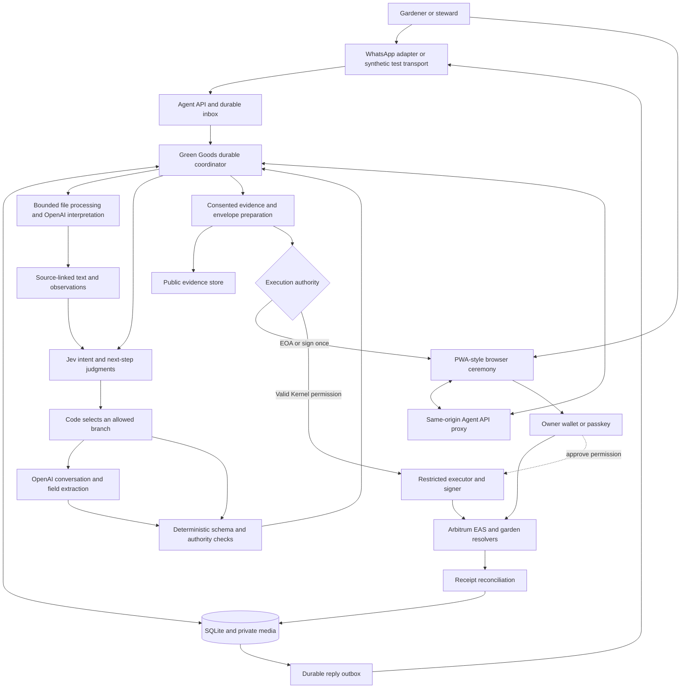
```mermaid
flowchart TB
  Person[Gardener or steward] --> Transport[WhatsApp adapter or synthetic test transport]
  Transport --> Inbox[Agent API and durable inbox]
  Inbox --> Coordinator[Green Goods durable coordinator]
  Coordinator <--> Store[(SQLite and private media)]
  Coordinator --> Media[Bounded file processing and OpenAI interpretation]
  Media --> Observations[Source-linked text and observations]
  Observations --> Jev[Jev intent and next-step judgments]
  Coordinator --> Jev
  Jev --> Branch[Code selects an allowed branch]
  Branch --> LLM[OpenAI conversation and field extraction]
  LLM --> Validate[Deterministic schema and authority checks]
  Branch --> Validate
  Validate --> Coordinator
  Coordinator --> Publisher[Consented evidence and envelope preparation]
  Publisher --> IPFS[Public evidence store]
  Publisher --> Authority{Execution authority}
  Authority -->|EOA or sign once| Browser[PWA-style browser ceremony]
  Browser <--> Proxy[Same-origin Agent API proxy]
  Proxy <--> Coordinator
  Person --> Browser
  Browser --> Owner[Owner wallet or passkey]
  Owner --> Chain[Arbitrum EAS and garden resolvers]
  Authority -->|Valid Kernel permission| Executor[Restricted executor and signer]
  Owner -. approve permission .-> Executor
  Executor --> Chain
  Chain --> Receipt[Receipt reconciliation]
  Receipt --> Store
  Store --> Outbox[Durable reply outbox]
  Outbox --> Transport

```

The agent package owns transport, persistence, media I/O and external model calls. Shared owns pure report rules, schema interpretation, machine definitions and publication builders usable by browser and server. The client owns the browser ceremony. Contracts own garden membership and approval authority. The indexer provides projections; a verified chain receipt is the immediate publication authority.

Reuse [InboundMessage](../../../packages/agent/src/types.ts), [the Hono composition root](../../../packages/agent/src/api/server.ts), [existing signature verification](../../../packages/agent/src/api/routes/garden-join-request-auth.ts), [Action.inputs and WorkSubmission](../../../packages/shared/src/types/domain.ts), [EAS builders](../../../packages/shared/src/utils/eas/transaction-builder.ts), and [the browser work queue](../../../packages/shared/src/modules/work/work-submission.ts). Their gaps include WhatsApp transport, durable conversation records, public ceremonies, prepared-envelope execution and bounded Kernel permissions. No owner key is held by the Agent; delegated-key custody is a separate proposed capability. Add these capabilities at their owning boundaries.

The browser work queue depends on IndexedDB and browser services. Do not import its default instance into the agent. Share pure call construction through a declared server-safe Shared export; the agent's durable operation store owns server retries.

### Publication ownership and exact payload contract

**Agent owns media preparation and public upload for messaging reports.** It downloads provider media, validates and sanitizes bytes, stores private copies, and records the user's publication consent for a particular revision. After account and action eligibility checks, it uploads those exact sanitized assets and canonical metadata. Each completed upload has a durable checkpoint. An upload job rechecks the revision and consent before each external write. If a correction wins the race, it cannot attach old upload results to the new revision; any already-public CID remains recorded on the old revision. The browser receives authenticated previews and the prepared envelope; it never imports raw WhatsApp attachments into the ordinary composer or independently republishes them.

The envelope carries `operationId`, `revision`, `clientWorkId`, `accountAddress`, `chainId`, garden address, action UID, confirmed Action-definition digest, deployed EAS address, schema UID, media digests/CIDs, metadata digest/CID, exact schema fields, encoded call and zero native value. Generate its payload digest from a versioned canonical encoding. The browser independently checks deployment configuration, account, chain, schema, recipient, `refUID`, revocability and encoded data, and compares the displayed report to that envelope. Reject arbitrary targets, extra calls and payload differences. Freeze the envelope on the operation before any wallet request; persist the broadcast attempt before sending.

The Agent already owns [Pinata upload signing](../../../packages/agent/src/services/pinata-upload-signer.ts); that service issues upload URLs and does not itself persist report media or metadata. Add an Agent-owned uploader using the configured Pinata service credentials and bounded native fetch, while sharing pure metadata construction/schema encoding. The browser-oriented [IPFS uploader](../../../packages/shared/src/modules/data/ipfs/upload.ts) depends on client configuration and telemetry, so it is not a drop-in server module. Do not expose a provider JWT or signed upload URL to the language model. Prove the server upload adapter against the chosen provider before real evidence is published.

**Reuse has a required adaptation.** The current [work executor](../../../packages/shared/src/modules/job-queue/job-executors.ts) calls `encodeWorkData`, which uploads evidence. Its existing `WorkJobPayload` is not a verified remote-envelope contract. Extend the owning Shared publication boundary to accept the prepared messaging envelope, with a separate validated preparation path; reuse [TransactionSender](../../../packages/shared/src/hooks/blockchain/useTransactionSender.ts) and [sendWithCheckpoint](../../../packages/shared/src/modules/work/send-with-checkpoint.ts). Reuse JobQueue's operation association and recovery where appropriate, but do not pass fake empty files or fabricated upload checkpoints to skip its encoder. The default composer path remains unchanged. No additional general-purpose transaction queue is required.

For the owner-signing branch, a before-send callback persists the server attempt under the active session and acquires its versioned send reservation. Failure to acknowledge that intent prevents the wallet call. Persist the local broadcast reference immediately and send it to the API as soon as the wallet supplies it. If the wallet response is lost, retain an uncertain attempt and reconcile; a reservation timeout never proves that no transaction was sent. Only the explicit sign button invokes sending. Rehydration, session renewal and background jobs may prepare or reconcile, but may not open wallet prompts or send passkey transactions. Mounting the full existing JobQueue provider would also enable unrelated commitment flush behavior, so the ceremony must expose only its scoped work/review execution capability.

For the delegated branch, the executor persists its attempt and reserves the account nonce before signing. It persists the encrypted signed operation and locally derived UserOperation hash before handing it to the bundler; after a crash it queries the same hash and may rebroadcast identical bytes only while the grant, consent, epoch and send policy still allow it, without allocating a fresh nonce or resetting the budget. A paused or expired grant permits reconciliation reads only. A modified replacement is a versioned replacement of that attempt, requires policy checks and cannot coexist as an independent publication. It reads a confirmed operation ID from its durable queue; it does not accept arbitrary calldata or digest requests from a model. Browser session expiry does not expire an independent Kernel permission. After restarts, reconcile the same reserved UserOperation before preparing another.

Preflight occurs before public upload and again before either owner or delegated signing. It checks member/operator roles, action existence, active dates and domain eligibility, required fields, configured schemas and gas availability. For reviews it checks operator authority, no self-review, matching work/action/garden and the action's expiry. Simulation is a preflight observation, not a reservation of chain state. Public upload may succeed even when a later wallet prompt is declined; this is disclosed before chat publication consent.

### Required report and review content

An Action supplies domain-specific inputs, but it is not the whole WorkSubmission. The agent must also collect and confirm the selected garden/Action, title, `timeSpentMinutes`, feedback, required evidence and supported `details`. Time spent comes from the gardener or an explicitly identified source; it cannot be inferred from a photograph. Normalize stated time into minutes, preserve the original unit in provenance and validate using Shared work rules. An unavailable or untrusted catalog is a recoverable context failure, not permission to invent an Action. [WorkSubmission and WorkInput](../../../packages/shared/src/types/domain.ts), [current submission validation](../../../packages/shared/src/modules/work/work-submission.ts)

**Confirmed Action snapshot:** the immutable Action definition used in the gardener's confirmed revision is authoritative for that report's input validation. Before asking for confirmation, resolve and persist the complete definition/metadata bytes, source reference, observed block and canonical digest; include that digest in the confirmation and prepared-envelope binding. A digest alone cannot reconstruct the required fields. Subsequent instruction/metadata updates do not retroactively invalidate that revision or reinterpret a pending transaction. An explicit correction that adopts a newer definition creates a new revision and requires confirmation; preserve any unresolved earlier attempt until reconciled.

This snapshot applies to offchain field requirements, not live chain eligibility. Recheck membership, Action existence, dates and garden domain before upload/send; the resolver enforces its supported eligibility checks at inclusion. [ActionRegistry](../../../packages/contracts/src/registries/Action.sol) updates instructions immediately, and [WorkResolver](../../../packages/contracts/src/resolvers/Work.sol) receives no expected definition digest. Accordingly, the prototype makes no inclusion-time guarantee that an Action still has the latest metadata. If instructions change between reservation, wallet approval and inclusion, reconcile a successful receipt against the frozen envelope and label it with its confirmed snapshot; do not announce failure or submit a replacement solely because metadata changed. Retain the snapshot with the validation/operation record under its separate retention policy, independently of private source-file cleanup. Test this race for both owner and delegated execution. Requiring the latest definition at inclusion would need a separately approved contract/schema guard and is outside this slice.

A review confirms work UID, Action UID, garden, approve/reject, feedback, confidence and verification method. Approvals need an explicitly selected confidence from LOW through HIGH; rejections use NONE. Human steward reviews include HUMAN and never acquire AGENT from using this messaging tool. For this prototype, review feedback is text and `reviewNotesCID` is empty; audio or separate review-note publication requires a later explicit evidence path. Both feedback and the decision fields are public, which the summary must explain. Preserve any prior review intent revision before editing; a hash alone is not enough to reconstruct what the steward approved. The resolver checks numeric ranges but does not enforce every stronger application rule, so the shared command validator and restricted executor enforce them too. [Review type](../../../packages/shared/src/types/domain.ts), [review validator](../../../packages/shared/src/modules/work/work-submission.ts), [resolver](../../../packages/contracts/src/resolvers/WorkApproval.sol)

Use the existing Work metadata shape. Document/table observations map into the supported report fields; approved page/chart excerpts become sanitized images in the existing media manifest. Do not add arbitrary PDF/workbook attachments or a new public metadata schema as an implicit part of this integration. Keep extraction provenance private unless an explicitly supported public field is reviewed for publication.

The exact work/review EAS request uses the configured schema and garden recipient, `expirationTime = 0`, `revocable = false`, `refUID = 0x00…00`, zero request value and zero transaction value. The review’s `workUID` is inside encoded schema data, not the outer `refUID`. Validate these fields before upload/signing and on receipt. [Canonical builders](../../../packages/shared/src/utils/eas/transaction-builder.ts)

### DM and future group context

For the demo, a DM offers the enabled prototype gardens, TAS and Aiyeloja Family Garden, and asks the participant to select or confirm one. A configured single-garden entry link may preselect that garden, but the agent still names it before confirmation. Pre-enrollment in TAS does not imply membership or reviewer authority in Aiyeloja Family Garden: verify roles independently for the selected garden, and preserve the draft if access is missing. A garden-specific click-to-chat link can prefill a garden code; it is a hint, never proof of membership. Record the selected chain/garden on each draft. Changing a DM's current garden leaves earlier drafts in their original garden.

Fewer than ten people does not establish official group eligibility: the documented limit is eight, and business-account eligibility and existing-group attachment still need proof. DMs avoid those dependencies and remain usable as TAS membership grows. [Current Groups API limits](https://bird.com/docs/guides/whatsapp/groups)

Later, identify groups using stable provider IDs, not names. A steward proves their account and authority before binding or changing a group. Rebinding requires authority for the old and new garden, or an explicit separately audited transfer process. New drafts use the new binding version. Existing drafts retain their original garden and need reconfirmation if the context change makes their destination ambiguous. Never move published work by changing a group binding.

## 4. Agent API dependencies and operating services

This is an installation proposal. No package installation or upgrade is part of this documentation change. Versions below are observed source versions, not a claim that a new dependency passed this repository's release-age or runtime gates.

| Dependency | Current position | Proposed use and installation boundary |
| --- | --- | --- |
| Bun, `bun:sqlite`, native `fetch`, `node:crypto` | Existing runtime | Durable SQLite inbox/state/outbox, HTTPS calls, HMAC and encryption. No SQLite package or Meta SDK required. |
| `hono` 4.13.5 | Agent dependency | Extend existing API routes; preserve raw webhook bytes before JSON parsing. |
| `viem` 2.55.0 | Agent dependency | Chain reads, simulation, calldata and receipt verification. |
| `@green-goods/shared` | Agent workspace dependency | Pure domain validation, account-proof contracts and server-safe EAS builders. Add explicit leaf exports where needed. |
| `xstate` ^5.32.4 | Shared dependency | Reuse for pure hierarchical machine definitions in Shared. Persist plain versioned snapshots in SQLite. No React actors on the server. |
| `zod` 4.4.3 | Shared/client already use it | Recommend declaring it directly in Agent if Agent imports it for webhook and API validation. Do not depend on accidental transitive availability. |
| `@typesafe-ai/sdk` 0.6.0 | Not installed; official package verified | Proposed Agent dependency for Jev. Prove Bun compatibility, timeouts and retry behavior before adoption; documented HTTP API is an alternative using native fetch. |
| OpenAI Responses | Selected content provider; new integration for this flow | Conversation, structured extraction, PDF/scan reading and photo/figure interpretation. Evaluate and pin a vision-capable model; native HTTP is sufficient initially. |
| OpenAI Audio transcriptions | Selected provider when voice input is enabled | File transcription after bounded audio normalization; pin the model and record language/quality proof. No separate hosted OCR or transcription provider. |
| Isolated Office/PDF conversion worker | New required capability; no binary installed | Recommend pinned LibreOffice headless plus a proven PDF inspection/rasterizer. No provider/signing credentials or network in its sandbox. Conversion quality and image footprint need proof. |
| `exceljs` 4.4.0 | Existing root dependency, not declared in Agent | Proposed direct Agent dependency for XLSX/CSV reading, with bounded parsing, cell provenance and code-owned arithmetic. No formula execution. |
| `sharp` 0.35.3 | Present at repository root | Declare directly in Agent if it owns image decoding, re-encoding and metadata removal. Prove the Fly image contains its native runtime. |
| Pino, Sentry, PostHog | Existing Agent dependencies | Operational telemetry with content/identifier redaction. Use the Agent PostHog project. |
| Reown AppKit 1.8.23, existing wallet/passkey stack | Shared/client dependencies | Browser-only account connection; nothing to install in Agent for displaying wallet UI. |
| Kernel permissions stack | New conditional dependency | Evaluate `@zerodev/permissions` with compatible `@zerodev/sdk` and any required WebAuthn adapter in Shared/Agent. Exact packages/versions depend on proving reuse of the existing owner and account address. No automatic upgrade. |
| Remote signer / KMS client | New if selected | Agent executor only. Provider client, workload identity and signature-format proof; never in the browser or model runtime. |

Jev package/API evidence: [JavaScript SDK](https://docs.typesafe.ai/sdk/javascript), [package manifest](https://raw.githubusercontent.com/typesafe-ai/typesafe-sdk-js/main/package.json), [HTTP API](https://docs.typesafe.ai/api). Existing versions: [Agent manifest](../../../packages/agent/package.json), [Shared manifest](../../../packages/shared/package.json), [root manifest](../../../package.json).

**Initial infrastructure:** one Fly agent machine, attached SQLite volume, bounded encrypted media storage, the fixed same-origin browser API proxy, one Meta business sender, the canonical Green Goods browser origin, Arbitrum RPC, and existing public evidence publication services. SQLite has one writing process for this deployment. Concurrent leased jobs inside that process use short transactions; adding another writing process or machine requires a database/lease deployment review first.

**External setup dependencies:** WEFA's Meta business app and webhook credentials; test-recipient provisioning; approved templates for messages outside the customer-service window; domain/TLS; usable RPC and deployed schema addresses; selected garden and roles; model credentials and data-processing approval. A steward can open a DM to retrieve pending reviews if proactive delivery is unavailable. No unlimited out-of-window messaging assumption.

Use root environment configuration and deployment secrets. Keep Meta credentials, subject-encryption keys, model API credentials and API session credentials separate. None enter a browser bundle. Do not install Redis, BullMQ, Temporal, LangChain, Twilio or an unofficial WhatsApp adapter for this DM slice; none is required by this design.

### 4.1 What is actually new

**Already present:** Hono, Viem, SQLite, XState, AppKit, permissionless, telemetry, Telegraf, and `@huggingface/transformers` 4.2.0. Their presence does not mean the new flow is implemented.

**New declarations or integrations:** Jev SDK (or native HTTP), OpenAI Responses and Audio adapters, direct Agent declarations for Zod, Sharp and ExcelJS if imported, a Kernel permissions adapter/package set, and a scoped signing service if delegation is enabled. Shared owns reusable client hooks; the browser receives only the permission-approval adapter, not model or private signing clients.

**New operating dependencies:** media storage/cleanup, public upload adapter, same-origin proxy, model credentials/processing terms, delegation key custody and signing policy, grant revocation, bundler/paymaster access from the server, and isolated bounded document/workbook decoding. A private PDF/Office render worker is required for automatic visual conversion; it is not an existing Agent capability. These need owners and proof even when they add no npm package.

### 4.2 Audio and media dependency gaps

[The current AI service](../../../packages/agent/src/services/ai.ts) loads `Xenova/whisper-tiny.en` and invokes `ffmpeg` for filenames ending in `.ogg`. [The Agent Dockerfile](../../../packages/agent/Dockerfile) does not explicitly install or verify that binary. Existing code is not evidence of a production-ready WhatsApp voice pipeline; its regex work parser also does not implement `Action.inputs`.

| Capability | Recommended prototype treatment | Dependency / tradeoff |
| --- | --- | --- |
| Photos | Include byte validation, bounded decoding, re-encoding and metadata removal | Direct Agent Sharp dependency and native runtime proof; existing root installation is insufficient |
| Voice notes | Separately tested capability using OpenAI Audio; transcribe, show the interpretation and allow correction | Pin an evaluated transcription model; raw audio never goes to Jev. No local Whisper model in the selected path |
| Audio normalization | Inspect and convert unsupported containers before OpenAI transcription | Pin and verify `ffmpeg`/`ffprobe` in the worker image; bound decoding time, decoded bytes and concurrency. Do not assume WhatsApp Ogg/Opus is accepted natively |
| Audio decoding | Validate actual format, duration, channels and decoded size before processing | Do not route by filename extension; no arbitrary URL fetch, bounded subprocess timeout/output and temporary-file cleanup |
| PDF / DOCX / scanned reports | Required; read text/tables and preserve source references | OpenAI file/vision adapter plus explicit completeness checks; see section 4.3 |
| Photo and figure interpretation | Required; propose observations and ask about uncertainty | Vision-capable model behind the same Agent model boundary; no raw images go to Jev |
| XLSX / CSV | Required; preserve sheets, cells, types and calculation inputs | Bounded workbook/CSV parser; code computes accepted totals, model proposes mappings |
| Video / legacy binary Office / macro-enabled files | Separate later format work | Return a supported-format request and retain the report; do not silently process active content |
| Spoken replies | Not required for voice-note intake | No text-to-speech dependency in the prototype |

Proposed voice starting limits: 2 minutes, 10 MiB compressed input, one active transcription per worker, and a bounded queue. Evaluate short accented English recordings first; do not infer Spanish/Portuguese accuracy from English tests. Store source audio privately only for the approved retention interval; preserve transcript provenance and mark uncertain numbers/units for confirmation. Voice input need not become public audio evidence: obtain separate publication consent if audio itself is to be published.

### 4.3 Document, visual and spreadsheet processing

**Required input set confirmed by the user:** PDFs, Word documents, photographs and spreadsheets. Receipts, forms, scans and garden reports are evaluation examples. Start with PDF, DOCX, JPEG/PNG/WebP, XLSX and CSV. A supported extension is not enough: validate bytes, size, container contents and processing limits. Password-protected files, macros, external resource fetching and unsupported formats receive an explicit limitation without losing the draft.

**Selected content-processing provider: OpenAI.** Use Responses for conversation, document/visual interpretation and structured field extraction, and Audio transcriptions for voice input. Mistral OCR, Gemini and Docling are not selected dependencies. Exact models remain subject to quality, latency and cost evaluation. The user confirmed that Jev keeps its typed decision role; OpenAI handles content processing. Green Goods continues to own state, authorization, validation and arithmetic.

| Input / task | Selected path | Required boundary |
| --- | --- | --- |
| PDF and scanned documents | OpenAI Responses with a vision-capable model, using text and page images | Bounded page coverage, source references and review of uncertain extraction. Generated coordinates or confidence are model claims, not verified OCR geometry |
| Photographs | Sharp normalization, then OpenAI vision | Visible observations only; no inferred duration, location or ecological impact without evidence |
| Word documents | Native OpenAI text extraction; PDF/image conversion when visual content matters | Native DOCX ingestion omits embedded visuals. Automatic isolated conversion is included; requesting an export is a recoverable failure fallback |
| XLSX and CSV | ExcelJS cell/range extraction; OpenAI maps meaning; code computes selected totals | Exact cell provenance and coverage. Native model spreadsheet ingestion alone is insufficient for complete totals |
| Spreadsheet charts | OpenAI vision over a controlled PDF/image representation | Automatic conversion is included; parsed cells alone do not prove chart coverage |
| Voice notes | OpenAI Audio after bounded normalization | Validate the actual container, duration and language. Current documented formats do not list Ogg; prove conversion instead of relying on the filename |
| Conversation and field extraction | OpenAI Responses, constrained output validated against the selected Action | No model-generated permission, chain target or unsupported field becomes authoritative |

Sources: [OpenAI file behavior](https://developers.openai.com/api/docs/guides/file-inputs), [OpenAI vision](https://developers.openai.com/api/docs/guides/images-vision), [OpenAI transcription](https://developers.openai.com/api/docs/guides/speech-to-text), [ExcelJS 4.4.0](https://raw.githubusercontent.com/exceljs/exceljs/v4.4.0/README.md).

**One content provider still needs ordinary file-handling code.** Normalize photos locally; inspect documents and send bounded PDFs/pages or text to OpenAI. Parse spreadsheet cells locally and send explicitly selected ranges for meaning and Action-field mapping. Compute accepted totals in code. Keep original source bytes/digests private and separate from model output. This removes an external OCR provider without treating model extraction as deterministic parsing. PDF/Office rendering is a required deployment dependency; no binary or new package is installed by this document.

**Automatic conversion contract:** recommend LibreOffice headless for DOCX/XLSX-to-PDF, with a pinned PDF inspection/rasterizer for page previews. LibreOffice documents [batch conversion](https://help.libreoffice.org/latest/en-US/text/shared/guide/start_parameters.html) and [PDF export parameters](https://help.libreoffice.org/latest/en-US/text/shared/guide/pdf_params.html); those interfaces do not establish isolation or fidelity. The worker is a disposable restricted process/container with a fresh profile, no network, disabled macros/external-resource updates, no signing/provider credentials and no access to the Agent database or other users’ files. An approved controller supplies only job-specific bytes and receives bounded output. Apply CPU, memory, output-size, page-count and time limits; clean up on success, cancellation and timeout. Headless mode alone is not a sandbox.

Inspect hidden content and obtain the selected sheet/range scope before rendering spreadsheets. Render only the authorized content into the derivative sent to OpenAI; never upload the complete workbook merely to create a chart preview. Include fixtures for clipped print areas, off-page charts, missing fonts and converted totals that differ from original cached cells. A renderer may recalculate formulas, so its output is visual evidence, never the authoritative arithmetic result. Unsupported external formulas or chart references must produce an explicit limitation. Preserve original and derivative digests, converter version and original-to-rendered page/sheet mapping. Native PDF inputs also need bounded page inspection; model-reported coverage alone cannot prove all pages were supplied.

A failed or incomplete conversion preserves the draft, retries only within the fixed processing budget and explains what could not be read. Ask for an export only after that automatic path fails; never silently drop figures or send a partially converted document as complete. The file worker performs no state transitions: the Agent owns the durable processing job, lease, cancellation and revision check. The deterministic harness uses a fake converter; real conversion fixtures separately prove isolation, cleanup and fidelity before enabling it.

**Spreadsheet completeness:** enumerate sheets and used ranges, retain sheet names/cell coordinates, and ask which ranges belong to the report when ambiguous. Detect hidden sheets/rows, filters, merged headings, locale-specific decimals, dates and units. Exclude hidden data from model/public output until deliberately included; show that something was excluded. Treat formulas and cached results separately, do not run macros or external links, and never silently accept a cached total as freshly computed. OpenAI’s native spreadsheet input processes a bounded row subset, so it is not the sole correctness path for impact totals. Images/charts embedded in workbooks require a separately proven extraction/render path; do not infer visual coverage from parsed cells.

**Meaning and confidence:** store `reported`, `transcribed`, `observed` or `computed` alongside each proposed fact. Photo interpretation may describe visible planting activity; it cannot establish elapsed labor, exact tree counts in an obscured scene, location or ecological impact without supporting input. Preserve contradictions and ask the gardener. Every accepted field links to a source message, asset digest and page/region/cell range where available. Visual/OCR suggestions never authorize an action or turn a human review into an AGENT verification flag.

**Files stay private during interpretation.** Prefer controlled byte uploads or provider file IDs over making an evidence URL public. Track uploaded provider objects and expiry/deletion jobs; disabling response storage is not a universal zero-retention guarantee. Raw documents can contain unrelated names, signatures or hidden content. Publish only the reviewed evidence manifest: selected sanitized images and explicit text/table excerpts supported by the Work metadata schema. Publishing an original PDF/DOCX/XLSX is not automatic. If a required public excerpt/page cannot be produced safely, ask for a supported export; do not publish the raw file as a shortcut. Plain text/escaped previews must not execute provider-produced HTML. Provider terms and image/file retention require explicit configuration review. [OpenAI data controls](https://developers.openai.com/api/docs/guides/your-data)

Proposed starting bounds are 10 MiB/file, 20 PDF pages, 5 sheets and 10,000 populated cells across a selected workbook, plus a fixed image/pixel budget and one expensive decode at a time. These are product defaults to tune, not provider ceilings. Inspect archive/decompressed-size limits, bound CPU/RAM/time in the decoding worker and reject zip bombs or external relationships. Never silently truncate: name incomplete coverage and ask for fewer pages, an export or a selected range. Page-rendering and Office conversion binaries are required dependencies to pin and isolate; model processing is not a sanitization engine.

### 4.4 Media interpretation lifecycle

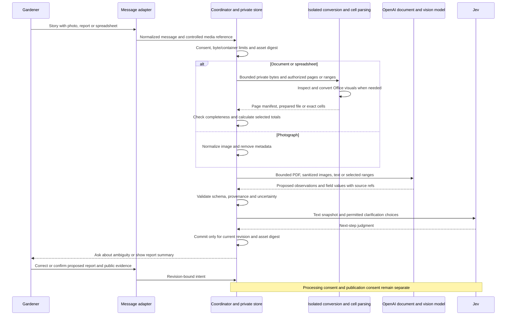
```mermaid
sequenceDiagram
  participant U as Gardener
  participant T as Message adapter
  participant A as Coordinator and private store
  participant P as Isolated conversion and cell parsing
  participant V as OpenAI document and vision model
  participant J as Jev
  U->>T: Story with photo, report or spreadsheet
  T->>A: Normalized message and controlled media reference
  A->>A: Consent, byte/container limits and asset digest
  alt Document or spreadsheet
    A->>P: Bounded private bytes and authorized pages or ranges
    P->>P: Inspect and convert Office visuals when needed
    P-->>A: Page manifest, prepared file or exact cells
    A->>A: Check completeness and calculate selected totals
  else Photograph
    A->>A: Normalize image and remove metadata
  end
  A->>V: Bounded PDF, sanitized images, text or selected ranges
  V-->>A: Proposed observations and field values with source refs
  A->>A: Validate schema, provenance and uncertainty
  A->>J: Text snapshot and permitted clarification choices
  J-->>A: Next-step judgment
  A->>A: Commit only for current revision and asset digest
  A-->>U: Ask about ambiguity or show report summary
  U->>T: Correct or confirm proposed report and public evidence
  T->>A: Revision-bound intent
  Note over A,J: Processing consent and publication consent remain separate
```

Persist asset processing state as `received -> quarantined -> inspecting -> converting (when needed) -> extracting -> ready`, with `needs_clarification`, `failed`, `unsupported` and `deleted` outcomes. Keep a bounded versioned processing manifest on MediaAsset for model/version, source/output digests, coverage, warnings and provider object cleanup; place accepted facts/provenance in DraftRevision. Original bytes, extracted observations and published evidence have separate references and consent. The accepted ERD simplification remains: no table per model call or processing stage.

## 5. Durable state and Jev decision trees

**Green Goods owns state transitions. Jev evaluates a snapshot.** The API accepts structured state and typed questions; it is not a persistence engine or workflow scheduler. It currently accepts text, not images, audio or video. Transcription must produce text before Jev can use a voice note. Its response types include Choice, Score and Noul. [State](https://docs.typesafe.ai/concepts/state), [typed primitives](https://docs.typesafe.ai/primitives)

### 5.1 Reporting machine

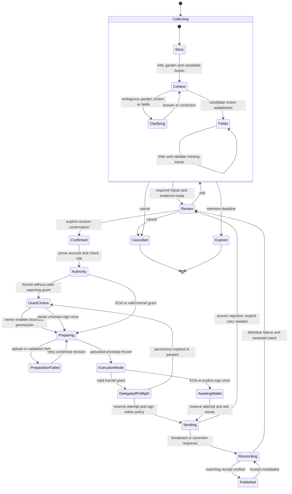
```mermaid
stateDiagram-v2
  [*] --> Collecting
  state Collecting {
    [*] --> Story
    Story --> Context: infer garden and candidate Action
    Context --> Clarifying: ambiguous garden, Action or fields
    Clarifying --> Context: answer or correction
    Context --> Fields: candidate Action established
    Fields --> Fields: infer and validate missing inputs
  }
  Collecting --> Review: required inputs and evidence ready
  Review --> Collecting: edit
  Review --> Confirmed: explicit revision confirmation
  Confirmed --> Authority: prove account and check role
  Authority --> GrantChoice: Kernel without valid reporting grant
  GrantChoice --> Preparing: owner enables bounded permission
  GrantChoice --> Preparing: owner chooses sign once
  Authority --> Preparing: EOA or valid Kernel grant
  Preparing --> PreparationFailed: upload or validation fails
  PreparationFailed --> Preparing: retry confirmed revision
  Preparing --> ExecutionMode: uploaded envelope frozen
  ExecutionMode --> AwaitingWallet: EOA or explicit sign once
  ExecutionMode --> DelegatedPreflight: valid Kernel grant
  DelegatedPreflight --> GrantChoice: permission expired or paused
  DelegatedPreflight --> Sending: reserve attempt and sign within policy
  AwaitingWallet --> Sending: reserve attempt and ask owner
  Sending --> Review: proven rejection, explicit retry needed
  Sending --> Reconciling: broadcast or uncertain response
  Reconciling --> Published: matching receipt verified
  Reconciling --> Review: definitive failure and renewed intent
  Review --> Cancelled: cancel
  Collecting --> Cancelled: cancel
  Collecting --> Expired: retention deadline
  Published --> Reconciling: receipt invalidated
  Cancelled --> [*]
  Expired --> [*]

```

The diagram shows the principal path. Gardeners can start with any supported story/photo/voice input; they do not have to name an Action. Candidate Actions come from the selected garden’s active, eligible catalog. Ask for clarification only when the match is ambiguous or absent; do not invent an Action. Required fields still come from `Action.inputs`. The final summary names the inferred Action and garden before confirmation. General chat commands can cancel any unreserved operation; a reserved execution must reconcile. `AwaitingWallet` is the EOA/sign-once branch, not the default for a granted Kernel account. Before an execution attempt is reserved, a material edit increments the revision, invalidates confirmation and the prepared envelope, and returns to collection/review. Once `Sending` begins, freeze that revision until rejection or reconciliation proves the outcome; a correction is saved separately and cannot replace the in-flight operation. After publication, an edit starts a new draft. An open wallet prompt cannot be remotely cancelled by changing server state, so never label its old payload as impossible to publish. Upload failure resumes preparation. A rejected signature leaves a recoverable draft. Publication already performed on IPFS cannot be made private by cancelling a later wallet prompt.

### 5.2 Review machine

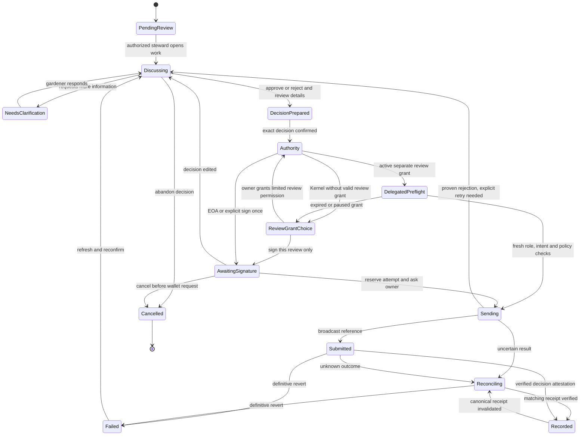
```mermaid
stateDiagram-v2
  [*] --> PendingReview
  PendingReview --> Discussing: authorized steward opens work
  Discussing --> NeedsClarification: requests more information
  NeedsClarification --> Discussing: gardener responds
  Discussing --> DecisionPrepared: approve or reject and review details
  DecisionPrepared --> Authority: exact decision confirmed
  Authority --> ReviewGrantChoice: Kernel without valid review grant
  ReviewGrantChoice --> Authority: owner grants limited review permission
  ReviewGrantChoice --> AwaitingSignature: sign this review only
  Authority --> AwaitingSignature: EOA or explicit sign once
  Authority --> DelegatedPreflight: active separate review grant
  DelegatedPreflight --> Sending: fresh role, intent and policy checks
  DelegatedPreflight --> ReviewGrantChoice: expired or paused grant
  AwaitingSignature --> Discussing: decision edited
  AwaitingSignature --> Sending: reserve attempt and ask owner
  Sending --> Discussing: proven rejection, explicit retry needed
  Sending --> Submitted: broadcast reference
  Sending --> Reconciling: uncertain result
  Submitted --> Reconciling: unknown outcome
  Reconciling --> Recorded: matching receipt verified
  Submitted --> Failed: definitive revert
  Reconciling --> Failed: definitive revert
  Failed --> Discussing: refresh and reconfirm
  Submitted --> Recorded: verified decision attestation
  Discussing --> Cancelled: abandon decision
  AwaitingSignature --> Cancelled: cancel before wallet request
  Recorded --> Reconciling: canonical receipt invalidated
  Cancelled --> [*]
```

Approve and reject both require the authorized steward account, through exact owner signing or its separate active review grant. Reporting permission alone always rejects a review operation. Offer review permission contextually at the first confirmed decision. An expired grant leads to renewal or “Confirm this review only”; neither action is automatic. The decision includes work UID, garden, action UID, result, feedback, confidence and verification method. Jev confidence is not automatically copied to the onchain review confidence field. Another decision may supersede an earlier one. Refresh onchain decision events before preparation and immediately before sending. `expected_decision_sequence` is an advisory observation, not an onchain compare-and-swap argument: the current resolver increments its sequence only when the commitment module is configured. Use canonical block/transaction/log order when that sequence is unavailable. A concurrent external decision can still land first; preserve both decisions and report the actual latest result. Decisions cannot be revoked; changing one requires a new signed attestation. Existing Karma or commitment hooks may run, so the demo uses work unlinked to financial commitments and records which hooks are configured.

### 5.3 Identity and permission machines

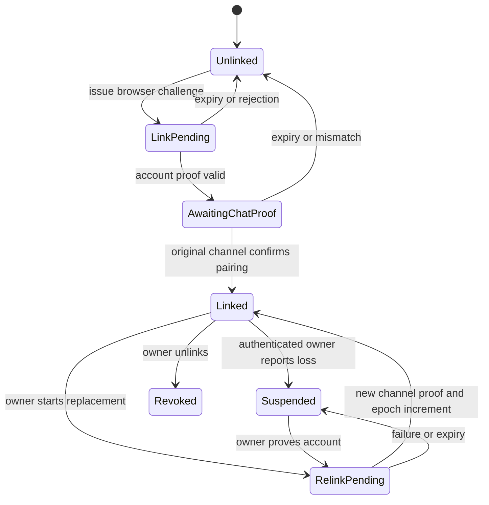
```mermaid
stateDiagram-v2
  [*] --> Unlinked
  Unlinked --> LinkPending: issue browser challenge
  LinkPending --> AwaitingChatProof: account proof valid
  AwaitingChatProof --> Linked: original channel confirms pairing
  LinkPending --> Unlinked: expiry or rejection
  AwaitingChatProof --> Unlinked: expiry or mismatch
  Linked --> Suspended: authenticated owner reports loss
  Linked --> RelinkPending: owner starts replacement
  Suspended --> RelinkPending: owner proves account
  RelinkPending --> Linked: new channel proof and epoch increment
  RelinkPending --> Suspended: failure or expiry
  Linked --> Revoked: owner unlinks
```

Browser access separately moves through `requested -> active -> expired` or `active -> revoked`. The API enforces its scope, identity epoch and expiry on every request. It provides no onchain execution permission.

A Kernel execution grant has its own lifecycle: `proposed -> owner_authorization_pending -> enabling -> active -> expired`, or `active -> paused -> revocation_pending -> revoked`. Authorization can be deferred until a first UserOperation where supported; `active` means the chosen module's enforceable validity has been established, not merely a successful HTTP response. An uncertain enable/revoke transaction stays reconciling. An API pause stops our executor immediately; only verified onchain revocation/expiry removes the key's chain authority. Relinking pauses grants and requires fresh owner approval to bind future execution to the new identity epoch.

### 5.4 Jev decision tree

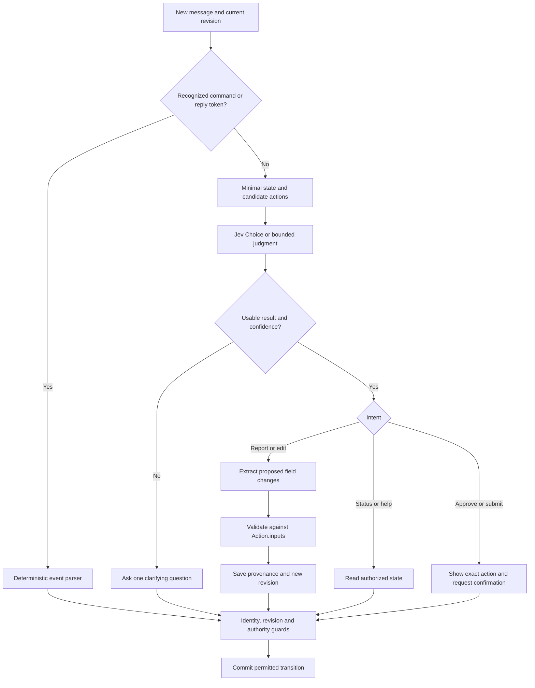
```mermaid
flowchart TB
  Input[New message and current revision] --> Explicit{Recognized command or reply token?}
  Explicit -->|Yes| Command[Deterministic event parser]
  Explicit -->|No| Snapshot[Minimal state and candidate actions]
  Snapshot --> Jev[Jev Choice or bounded judgment]
  Jev --> Certain{Usable result and confidence?}
  Certain -->|No| Clarify[Ask one clarifying question]
  Certain -->|Yes| Intent{Intent}
  Intent -->|Report or edit| Extract[Extract proposed field changes]
  Intent -->|Status or help| Read[Read authorized state]
  Intent -->|Approve or submit| Confirm[Show exact action and request confirmation]
  Extract --> Validate[Validate against Action.inputs]
  Validate --> Revision[Save provenance and new revision]
  Revision --> Guards
  Read --> Guards
  Clarify --> Guards
  Command --> Guards[Identity, revision and authority guards]
  Confirm --> Guards
  Guards --> Transition[Commit permitted transition]
```

**Recommended interaction loop (proposal):** use Jev as the bounded decision layer inside a code-owned coordinator. On each meaningful free-text turn, it classifies report/edit/help/review and selects a permitted next step. For a report or correction, the extraction model proposes open-text fields and candidate Action evidence; code validates them, then commits with a revision check. If the next question depends on those new fields, call Jev again with the updated snapshot. Questions within one Jev request are independent; they cannot use another question's newly generated answer. The conversation model may word the permitted question, while the final summary comes from validated state. Explicit reply tokens, status webhooks and receipts use code directly.

This gives Jev a coordinating role in conversation without assigning it database locks, authorization or signing. A valid typed decision can still be semantically wrong. Evaluate the loop against a simpler LLM-plus-deterministic-rules baseline; keep Jev where routing/clarification quality or cost is measurably better. Start with at most one Jev routing evaluation, one OpenAI extraction/conversation call and one optional Jev follow-up judgment per text turn. Use localized templates for the resulting question/summary; model wording must fit that same OpenAI call budget. Media extraction has its own bounded per-asset budget and cached digest/version result. Clarification ends the turn rather than starting an unbounded tool loop. [TypeSafe state semantics](https://docs.typesafe.ai/concepts/state), [Jev product description](https://typesafe.ai/blog/introducing-system-one-models-and-jev)

Jev never chooses an arbitrary RPC method, constructs transaction calldata, grants a role, or establishes consent. A conversational “yes” is interpreted against one outstanding prompt; ambiguous replies trigger clarification. Final confirmation uses a revision-bound reply token or an explicit command referencing the report identifier.

Send Jev a bounded snapshot containing `workflowVersion`, `draftRevision`, `phase`, selected garden/action labels, allowed intent labels, required input definitions, already confirmed fields, the relevant message excerpt and explicitly permitted next steps. Exclude phone numbers, wallet addresses, authentication links, signatures, secrets and unrelated chat history.

The extraction model proposes values with source-message IDs. Preserve each original source entry and per-field provenance; a gardener's explicit correction wins over a model proposal. Validate choices, units, bounds and required evidence in code. The action's existing `Action.inputs` is the field contract. Unsupported input types receive an honest limitation or a separately designed chat subflow; never silently omit a required repeater.

**Persistence rule:** read revision N; make bounded external calls outside the transaction; atomically apply their result only if revision N is still current. Commit the new snapshot, consumed event and outbox entries together. A stale model result is discarded without marking an unapplied source event consumed; re-evaluate pending input against the current revision, preserving the causal order of explicit corrections. A machine snapshot alone does not provide transactional guarantees. External work runs from leased jobs and durable operation records, not from uncontrolled side effects during actor rehydration.

## 6. Updated logical ERD

These are proposed server records, not tables already implemented. Existing onchain Work, WorkApproval, Garden and Action meanings remain authoritative. The ERDs show the core records; operational fields such as versions, creation/deletion times and the additional constraints below are part of the physical schema contract. `AccountBinding` means proven control of an address, not delegated signing authority.

### 6.1 Identity and garden context

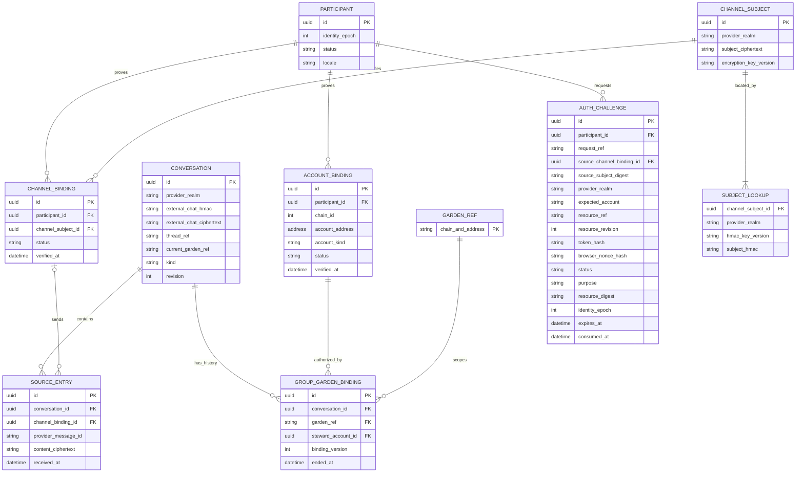
```mermaid
erDiagram
  PARTICIPANT ||--o{ CHANNEL_BINDING : proves
  PARTICIPANT ||--o{ ACCOUNT_BINDING : proves
  CONVERSATION ||--o{ SOURCE_ENTRY : contains
  CHANNEL_BINDING o|--o{ SOURCE_ENTRY : sends
  CONVERSATION ||--o{ GROUP_GARDEN_BINDING : has_history
  ACCOUNT_BINDING ||--o{ GROUP_GARDEN_BINDING : authorized_by
  GARDEN_REF ||--o{ GROUP_GARDEN_BINDING : scopes
  PARTICIPANT ||--o{ AUTH_CHALLENGE : requests
  PARTICIPANT {
    uuid id PK
    int identity_epoch
    string status
    string locale
  }
  CHANNEL_SUBJECT ||--o{ CHANNEL_BINDING : identifies
  CHANNEL_SUBJECT ||--|{ SUBJECT_LOOKUP : located_by
  CHANNEL_SUBJECT {
    uuid id PK
    string provider_realm
    string subject_ciphertext
    string encryption_key_version
  }
  SUBJECT_LOOKUP {
    uuid channel_subject_id FK
    string provider_realm
    string hmac_key_version
    string subject_hmac
  }
  CHANNEL_BINDING {
    uuid id PK
    uuid participant_id FK
    uuid channel_subject_id FK
    string status
    datetime verified_at
  }
  ACCOUNT_BINDING {
    uuid id PK
    uuid participant_id FK
    int chain_id
    address account_address
    string account_kind
    string status
    datetime verified_at
  }
  CONVERSATION {
    uuid id PK
    string provider_realm
    string external_chat_hmac
    string external_chat_ciphertext
    string thread_ref
    string current_garden_ref
    string kind
    int revision
  }
  GROUP_GARDEN_BINDING {
    uuid id PK
    uuid conversation_id FK
    string garden_ref FK
    uuid steward_account_id FK
    int binding_version
    datetime ended_at
  }
  GARDEN_REF {
    string chain_and_address PK
  }
  AUTH_CHALLENGE {
    uuid id PK
    uuid participant_id FK
    string request_ref
    uuid source_channel_binding_id FK
    string source_subject_digest
    string provider_realm
    string expected_account
    string resource_ref
    int resource_revision
    string token_hash
    string browser_nonce_hash
    string status
    string purpose
    string resource_digest
    int identity_epoch
    datetime expires_at
    datetime consumed_at
  }
  SOURCE_ENTRY {
    uuid id PK
    uuid conversation_id FK
    uuid channel_binding_id FK
    string provider_message_id
    string content_ciphertext
    datetime received_at
  }
```

`SOURCE_ENTRY.channel_binding_id` may be null during initial unlinked intake; preserve a protected provider subject reference until pairing. Create provisional participants only after the first-contact notice/consent policy is satisfied. Store provider realms so identical IDs from different business senders cannot collide. Conversation identity is unique by platform/provider realm plus external chat ID (and thread ID where the adapter supports threads). The sender belongs to SourceEntry/ChannelBinding, not the conversation key: a future group must share one garden-binding history across all its senders. Chat membership never supplies garden authority. Draft author account is fixed when linked publication authority is confirmed; changing it then requires a new confirmed revision and eligibility proof. An unlinked gardener can confirm the report content first, but publication waits for account pairing and explicit consent tying that unchanged content to the chosen account and garden. The pairing reply may capture both only when its prompt clearly names both decisions. `AUTH_CHALLENGE.resource_digest` binds a link to its purpose, draft/review revision, garden and expected account where known.

**Stable identity and rotation:** `CHANNEL_SUBJECT.id` is the canonical internal sender identity within a provider realm. `SUBJECT_LOOKUP` stores versioned HMAC aliases with `UNIQUE(provider_realm, hmac_key_version, subject_hmac)` and a foreign key to that same subject. Keep the provider identifier encrypted and normalize it consistently before hashing. On intake, look up all accepted key versions inside the serialized lookup/create transaction; if any alias matches, reuse the subject and add the current alias. A uniqueness conflict retries lookup rather than creating another participant. Relinking closes the prior binding and attaches the new subject under the existing participant/epoch rules; it does not merge participants automatically.

Rotation first dual-reads retained versions, then backfills current aliases from protected identifiers, verifies complete coverage and only then retires old lookup keys. A lookup/decryption failure blocks new identity creation; it must not create a second identity. Apply the same stable-ID and alias-migration rule to conversation lookup. Prove a new message and concurrent insert during/after rotation retain the same subject, binding, participant, consent and draft. Provisional subject/lookup rows follow the pre-consent expiry and are deleted when no retained authorized record needs them.

### 6.2 Drafts, evidence and execution

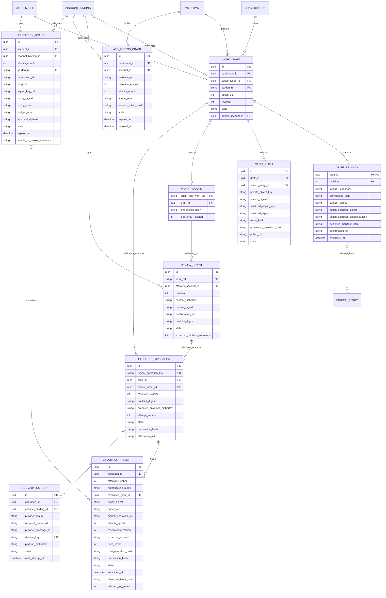
```mermaid
erDiagram
  PARTICIPANT ||--o{ WORK_DRAFT : authors
  CONVERSATION ||--o{ WORK_DRAFT : starts
  GARDEN_REF ||--o{ WORK_DRAFT : receives
  WORK_DRAFT ||--|{ DRAFT_REVISION : versions
  DRAFT_REVISION }o--o{ SOURCE_ENTRY : derives_from
  WORK_DRAFT ||--o{ MEDIA_ASSET : collects
  WORK_DRAFT o|--o| WORK_RECORD : publishes
  WORK_RECORD ||--o{ REVIEW_INTENT : reviewed_by
  ACCOUNT_BINDING o|--o{ WORK_DRAFT : authorizes
  ACCOUNT_BINDING ||--o{ REVIEW_INTENT : signs
  ACCOUNT_BINDING ||--o{ APP_ACCESS_GRANT : authorizes
  PARTICIPANT ||--o{ APP_ACCESS_GRANT : holds
  ACCOUNT_BINDING ||--o{ EXECUTION_GRANT : delegates
  EXECUTION_GRANT o|--o{ EXECUTION_ATTEMPT : authorizes
  GARDEN_REF ||--o{ EXECUTION_GRANT : scopes
  WORK_DRAFT o|--o{ EXECUTION_OPERATION : publication_attempts
  REVIEW_INTENT o|--o{ EXECUTION_OPERATION : decision_attempts
  EXECUTION_OPERATION ||--o{ EXECUTION_ATTEMPT : tracks
  EXECUTION_OPERATION o|--o{ DELIVERY_OUTBOX : reports
  WORK_DRAFT {
    uuid id PK
    uuid participant_id FK
    uuid conversation_id FK
    string garden_ref FK
    int action_uid
    int revision
    string state
    uuid author_account_id FK
  }
  DRAFT_REVISION {
    uuid draft_id PK,FK
    int revision PK
    string content_ciphertext
    string provenance_json
    string content_digest
    string action_definition_digest
    string action_definition_snapshot_json
    string evidence_manifest_json
    string confirmation_ref
    datetime confirmed_at
  }
  MEDIA_ASSET {
    uuid id PK
    uuid draft_id FK
    uuid source_entry_id FK
    string private_object_key
    string source_digest
    string sanitized_object_key
    string sanitized_digest
    string asset_kind
    string processing_manifest_json
    string public_cid
    string state
  }
  WORK_RECORD {
    string chain_and_work_uid PK
    uuid draft_id FK
    string transaction_hash
    int published_revision
  }
  REVIEW_INTENT {
    uuid id PK
    string work_ref FK
    uuid steward_account_id FK
    int revision
    string content_ciphertext
    string content_digest
    string confirmation_ref
    string payload_digest
    string state
    int expected_decision_sequence
  }
  APP_ACCESS_GRANT {
    uuid id PK
    uuid participant_id FK
    uuid account_id FK
    string resource_ref
    int resource_revision
    int identity_epoch
    string scope_json
    string session_token_hash
    string state
    datetime expires_at
    datetime revoked_at
  }
  EXECUTION_GRANT {
    uuid id PK
    uuid account_id FK
    uuid channel_binding_id FK
    int identity_epoch
    string garden_ref FK
    string permission_id
    string purpose
    string signer_key_ref
    string policy_digest
    string policy_json
    string budget_json
    string approval_ciphertext
    string state
    datetime expires_at
    string enable_or_revoke_reference
  }
  EXECUTION_OPERATION {
    uuid id PK
    string logical_operation_key UK
    uuid draft_id FK
    uuid review_intent_id FK
    int resource_revision
    string payload_digest
    string prepared_envelope_ciphertext
    int attempt_version
    string state
    string transaction_hash
    string attestation_uid
  }
  DELIVERY_OUTBOX {
    uuid id PK
    uuid operation_id FK
    uuid channel_binding_id FK
    string provider_realm
    string recipient_ciphertext
    string provider_message_id
    string dedupe_key UK
    string payload_ciphertext
    string state
    datetime next_attempt_at
  }
  EXECUTION_ATTEMPT {
    uuid id PK
    uuid operation_id FK
    int attempt_number
    string authorization_mode
    uuid execution_grant_id FK
    string policy_digest
    string nonce_ref
    string signed_operation_ref
    int identity_epoch
    int reservation_version
    string expected_account
    int from_block
    string user_operation_hash
    string transaction_hash
    string state
    datetime submitted_at
    string observed_block_hash
    int attested_log_index
  }
```

Additional operational tables are `webhook_inbox` (unique provider realm/event ID, lease, attempts, processed time), optional `model_evaluation` (bounded diagnostics only; initially use the revision/asset manifests for model/prompt versions and provenance), and `consent_record` (participant, source binding, purpose, notice version, resource/revision/digest when scoped, timestamp and withdrawal). Revision confirmation has a durable record containing the exact summary digest, account/garden, source event, reply/prompt reference, identity epoch and publication-consent scope; `confirmed_at` alone is not authority. Reviewing an existing onchain Work does not require a local draft: WorkRecord may cache that verified chain reference with a null `draft_id`. A ReviewIntent retains encrypted versioned content/provenance in bounded revision history JSON initially; an operation freezes that exact review revision. Ordinary chat replies also use the outbox; their operation foreign key is nullable. Provider realm plus message ID is the inbound message uniqueness key. Delivery receipts are separate events with a status/version key; they are not deduplicated against message content. Store an encrypted destination, because an HMAC cannot be used to send a reply. For private notifications, resolve and recheck the current active binding/epoch at send time; relinking suppresses delivery to the old channel. Provenance links can be a normalized revision/source join table or validated JSON initially. They must remain traceable.

### 6.3 Why these boundaries exist, and where to simplify

This is a logical model; it does not require one class/service per table. The recommended physical starting point keeps the boundaries needed for ownership and retries, and defers unused generality.

| Records / decision | Why keep the distinction | Practical simplification and cost |
| --- | --- | --- |
| Participant, channel binding, account binding | A person may replace a phone or use multiple personal accounts; messaging possession is different from signing authority | Keep three small tables. Combining them saves joins but makes relinking, cross-channel tests and future personal passkeys harder and risks changing authorship |
| Conversation and garden context | A DM can switch gardens; a later group has its own context history | Store current DM context as nullable fields on Conversation. Defer GroupGardenBinding until a supported group adapter exists |
| GardenRef | Identifies `(chain_id, address)` without replacing onchain membership | Use validated composite fields/config references initially; no separate local garden mirror or role table required |
| SourceEntry and DraftRevision | Original words/evidence must survive extraction mistakes and corrections | Keep immutable sources and versioned snapshots. Put per-field provenance and bounded model diagnostics in revision JSON initially; normalize only when queries justify it |
| WorkDraft and DraftRevision | One current workflow plus immutable content/history used by confirmation and signing | Keep a small draft row and append-only revision JSON. A single mutable JSON blob is cheaper initially but loses stale-signature and correction evidence |
| MediaAsset | Bytes, private previews, sanitization, publication and retention have their own failures | One asset row with original/sanitized/public references; store a revision's asset IDs and digests in its manifest. Do not add separate tables for every processing stage |
| WorkRecord | Stable chain reference after draft/private evidence cleanup | A small mapping/projection is sufficient; the indexer/chain remain authoritative. Do not duplicate all public work fields |
| ReviewIntent | A steward's decision has a different owner and lifecycle from the report | Share envelope/attempt infrastructure while keeping typed review state and role checks |
| Operation and Attempt | One business request can have rejection, replacement or uncertain broadcast attempts | Keep separate records. Collapsing them risks forgetting an earlier broadcast and publishing twice |
| Browser access and execution grant | One permits API reads; the other allows chain execution and persists beyond browser login | Keep separate records and explicit expiry/revocation. A generic permissions JSON blob obscures the trust boundary |
| Inbox and outbox | Acknowledged messages and durable replies must survive process failure | Keep dedicated delivery records; one SQLite database/process is sufficient for the prototype |

For the current prototype, AccountBinding records the participant’s proven existing reporting account, whether EOA or Kernel. Do not require a primary Kernel account, optional Profile wallets or an `account_usage` field for this slice. Future multi-account/profile semantics belong to section 14 and need their own schema decision. AccountBinding and chat ExecutionGrant never represent owner reconfiguration; historical draft authors remain fixed.

### Required database invariants

- Action UID is nullable during story intake; publication requires a valid, eligible Action confirmed in the summary. Do not let a database constraint force gardeners to select an Action before describing work.
- Each execution attempt records its authorization mode and, for delegation, the specific active grant/policy digest and source binding. Reserve nonce and budget atomically; encrypted signed UserOperations are accessible only to the executor/reconciler and never to a model or browser. Reporting and review grants never substitute for each other.
- One active channel binding per stable `channel_subject_id`; HMAC aliases are lookup keys, not identity. One active participant association per chain/account; the prototype binds one selected existing reporting account per participant/chain; it does not implement Profile account aggregation. Relinking is a controlled transfer, not a second claim on the same identity.
- Challenge source binding may be null only for an unlinked participant; then require the realm and protected source-subject digest. Bind signed purpose, resource reference/revision, browser nonce, expected account when known and identity epoch. Never reconstruct them from browser-supplied values.
- One active garden binding per group conversation. Store its history and authorizing account.
- `UNIQUE(draft_id, revision)`; compare-and-swap revision updates. Only one outstanding confirmation for a particular workflow step.
- One logical work-publication operation per draft and author account. Attempts and replacement transactions belong to that operation. A new revision can replace an unbroadcast intent; it cannot create a second publication while an earlier broadcast is unresolved.
- Retain each execution attempt and its user-operation hash, transaction hash and reconciliation outcome. A wallet rejection before broadcast is distinct from an unknown broadcast outcome; neither is a reason to discard earlier attempt records.
- A review operation refers to exactly one review intent; a work operation refers to exactly one draft. Enforce this exclusive choice with a database check. The other optional relationships represent existing cases: an unlinked private draft has no author account yet, a verified chain WorkRecord may have no local draft, and an ordinary chat reply has no execution operation. Publication still requires a proven author account.
- Media is private until explicit publication consent. A sanitized asset digest and immutable revision fix exactly which evidence a signature authorizes.
- A confirmed draft's content digest identifies the report and sanitized evidence. The final payload digest additionally fixes uploaded CIDs, chain, contract, schema and encoded call. Recheck that the final payload implements the confirmed revision before requesting its signature.
- A verified chain receipt determines `transaction_hash` and `attestation_uid` separately. A client callback, synthetic offline hash or successful HTTP response is not proof of publication.
- Do not copy the legacy `users.privateKey` design into these records. No owner signing key is stored. Execution grants hold a signer service reference, public policy and protected approval material; the delegated private key stays inside the selected custody boundary. Browser access grants hold session-token hashes. Never put a serialized private session key in ordinary draft records.

## 7. Authentication, public routes and authority

Two accepted browser view families are specified in section 7.1; their implementation is still pending. They use PublicShell with a focused SiteHeader variant and PWA task components, without requiring installation. The same ceremony view supplies the independent permission-management mode. Reuse shared wallet/passkey controls and the canonical passkey origin. Permit supported external-wallet browsers for EOA signing while retaining passkey-specific compatibility handling. Do not disable existing browser safety checks globally.

| Proposed Agent API boundary | Purpose | Authority |
| --- | --- | --- |
| `GET /webhooks/whatsapp` | Meta verification challenge | Exact verify-token check |
| `POST /webhooks/whatsapp` | Durable inbound event intake | Raw-body `X-Hub-Signature-256`, size bound, realm validation and leased deduplication |
| `POST /messaging/challenges` | Bind an agent-issued locator to this browser and its requested purpose | Exact allowed Origin, bootstrap header and rate limits; establishes a pre-authentication cookie with no private content |
| `GET /messaging/challenges/:id/status` | Resume pairing/access after a refresh | Matching pre-authentication cookie; return only this browser's challenge state |
| `POST /messaging/challenges/:id/proof` | Verify account control | Nonce, purpose, audience, origin, chain, resource digest, expiry and epoch; EOA/ERC-1271/ERC-6492 as appropriate |
| `GET /messaging/drafts/:id` | Read private review material | Draft-scoped browser session and confirmed account/channel binding |
| `POST /messaging/operations` | Create or return the idempotent logical publication/decision operation | Expected revision, confirmed digest, scoped session and fresh garden role |
| `GET /messaging/media/:id` | Read sanitized private preview | Active resource session and asset-to-draft ownership; no-store |
| `POST /messaging/operations/:id/prepare` | Start/resume consented upload and freeze the envelope | Current confirmed revision, publication consent and eligibility |
| `POST /messaging/operations/:id/attempts` | Reserve exactly one wallet attempt before sending | Active session, matching digest/epoch and compare-and-swap attempt version |
| `POST /messaging/operations/:id/outcome` | Persist a typed attempt outcome: broadcast reference, rejected-before-send, preparation failure, or uncertain send | Resource-scoped session, attempt version/digest and idempotency; server verifies outcome before releasing reservations or announcing publication |
| `GET /messaging/operations/:id` | Resume pending signing or outcome | Same resource scope; minimal private data |
| `POST /messaging/relink` | Replace channel binding | Account proof plus new-channel possession; advance identity epoch |

Reuse the existing signed-proof verifier to establish the scoped browser session defined below. A link locator alone never reads private evidence or grants authority. Store token hashes; prevent link previews from consuming challenges. Pairing requires account proof plus confirmation from the originating WhatsApp channel, so forwarding a link cannot silently claim a report. Reuse the valid session for its exact authorized scope; do not introduce a fresh wallet prompt for each HTTP request.

For mobile, opening the public page may require a handoff from WhatsApp's embedded browser to the wallet or system browser. Resume by opaque operation ID and server state, not solely localStorage. Cookies and pre-authentication nonces do not transfer to a different browser: perform fresh browser-bound proof/pairing there. Never copy a session token through the URL or redeem a proof tied to another browser. The prior browser may retain only its own authorized scope; account recovery/revocation invalidates it. The browser returns a resume affordance; the server posts the final receipt to WhatsApp even if the page closes. A desktop QR flow uses the same expiring challenge and channel pairing.

**Attribution:** Work attester is the gardener's actual account. WorkApproval attester is the steward's account. Existing smart-account gas sponsorship does not change either author. A delegated executor signs under the human account’s limited permission; it never becomes the work author. `verificationMethod = HUMAN` describes a human review even when an agent submits its transaction. The `AGENT` bit means an agent actually performed verification; it is not a transport flag. Existing resolvers enforce garden membership, steward/operator authority and no self-approval. [Work resolver](../../../packages/contracts/src/resolvers/Work.sol), [approval resolver](../../../packages/contracts/src/resolvers/WorkApproval.sol), [domain verification methods](../../../packages/shared/src/types/domain.ts)

**Challenge lifecycle:** the Agent worker mints a high-entropy locator only for an existing chat request, or a rate-limited recovery start. The first browser POST requires an exact allowed Origin plus a non-simple bootstrap header, then issues a separate random pre-authentication cookie and bound CSRF token. It neither authenticates the account nor exposes private content. Subsequent browser mutations require that token; refreshing reuses or safely replaces only this provisional browser binding. The signed proof includes that browser nonce, challenge ID, purpose, canonical origin, account, chain, source channel-binding ID and provider realm, resource revision/digest and expiry. Before pairing creates a binding, use the server-held provisional source-subject digest instead of a binding ID. Reuse the cryptographic verifier behind [garden-join authentication](../../../packages/agent/src/api/routes/garden-join-request-auth.ts); define a distinct messaging proof envelope. Atomically consume the proof nonce, store its verified state and wait for the matching code from the original chat. A status GET can observe only its own browser's pairing stage. A locator may have separately tracked browser-bound challenges, so an unverified link opener cannot lock out its owner. Rate-limit challenge creation and pairing attempts. Never disclose an existing browser’s code/proof to a new browser. A successful binding invalidates conflicting unverified candidates. Session issuance requires that browser binding; knowledge of the URL alone never redeems it. On a lost issuance response, rotate/revoke the earlier session under the same verified browser instead of replaying the wallet signature. An already linked participant must prove the bound account; an unrelated account cannot overwrite it.

**Reviewer access:** link the steward’s own source-channel identity and account first. Verify operator authority before preparing a review session. Reviews read the published work/evidence and the steward's own intent; they do not grant access to the gardener's raw messages, private draft revisions or abandoned media. Mentioned names or forwarded messages cannot select another person's signing account.

### 7.1 Public route map and shell integration

The continuation and recovery names were selected by the user; the static permissions entry adds the required independent revocation path. All are proposed routes, not implemented endpoints. Every link starts with the canonical Green Goods HTTPS origin. IDs are opaque locators, never credentials. Invalid, expired or forwarded links reveal no private report. A GET renders a neutral landing state and never consumes a challenge or requests a wallet signature automatically.

| Browser route | Reusable view and states | Required access |
| --- | --- | --- |
| `/agent/reporting/:requestId` | One ceremony view: identify → scoped access → review → grant or exact signing → status | Server-resolved purpose, account/channel proof and the resource-specific session; Kernel grant approval is a distinct command |
| `/agent/reporting/permissions` | Same ceremony view, independent permission-management mode: identify owner → inspect chain permission → revoke → receipt status | Static route before `:requestId`; direct owner wallet/passkey authority and chain reads, with no Agent locator, session or API dependency |
| `/agent/reporting/recover/:requestId` | Recovery view: identify → new-channel proof → replacement → status | Fresh bound-account proof, new-channel possession and expected identity epoch |

**Naming:** `/agent/reporting` identifies the Green Goods agent reporting journey across transports. The continuation also handles steward review and permission setup using server-bound purpose. `/agent/reporting/recover/:requestId` handles chat relinking. Neither route starts an unrestricted new report in the browser.

**Platform-neutral contract:** the routes, machines and session endpoints do not contain a platform name. Each chat continuation stores its originating ChannelBinding, provider realm, purpose and typed resource. Independent permission management uses owner/chain state instead of a channel-bound request. The page resolves an allowlisted server-supplied display label and a supported return destination (for example, “Return to WhatsApp” or “Return to Telegram”). Those values are presentation, not authorization. Pairing still requires possession of the request’s specific source channel. A Telegram identity cannot redeem a WhatsApp challenge just because the views are shared. No arbitrary `returnUrl`, `platform` or channel ID in the query string can change that binding. Generic API routes use `/messaging/*` behind `/api/messaging/*`; provider verification/intake stays under `/webhooks/whatsapp` and later each adapter’s own webhook.

A small continuation locator resolves server-side to the allowed purpose and an existing challenge/operation/grant. It can be stored as a versioned reference on the challenge rather than another general workflow table. Allow only typed combinations. Query parameters cannot switch a signing request into a permission grant, alter its account or reveal another operation.

These are two screen families, not a separate view for every step. Reuse account controls, context/summary, permission explanation, errors and receipt components. Work and steward review are typed variants of the same summary/signing view. Chat continuation refresh restores server state; independent permission management restores owner/descriptor context and re-reads chain state. A material edit before a reserved attempt invalidates the old request; after reservation, reconcile before offering a replacement.

**Route integration:** the current [route inventory](../../../packages/client/src/config/routes.tsx) derives separate public and PWA trees. Add explicit ceremony route IDs and recognize them in each relevant exported tree so an installed context does not swallow the link with its catch-all. Both contexts must resolve these public ceremonies through the existing [PublicShell](../../../packages/client/src/routes/PublicShell.tsx) and [SiteHeader](../../../packages/client/src/components/Navigation/SiteHeader.tsx). Add a typed, route-selected focused variant there: Green Goods identity, back/close and contextual Help, with PWA task controls and no installed-app bottom navigation. Keep the existing public shell responsible for route behavior, scroll restoration, landmarks and header composition; do not add a third shell or duplicate the header in a view. The default website variant and protected AppShell remain unchanged. Select the variant from route metadata, never a caller-controlled query parameter. Scope the [presentation loaders](../../../packages/client/src/routes/presentationMode.ts) to these explicit paths and mount only the ceremony's required providers. Verify `router.tsx`, both route trees, PublicShell, SiteHeader and the header Storybook story together, including direct-open/refresh, installed-context routing, keyboard focus and unrelated public/PWA routes.

Lazy-load a ceremony provider boundary using the existing [WalletRuntimeProviders](../../../packages/client/src/routes/WalletRuntimeProviders.tsx). [PwaRuntime](../../../packages/client/src/routes/PwaRuntime.tsx) currently owns that provider entry; the public ceremony must not depend on passing its installation gate. Reuse AppKit/Auth composition while excluding PWA analytics identity, startup signals and unrelated queue effects. Audit Root pageview tracking before the first route event: record a route template, never challenge/operation IDs, full URLs, wallet addresses or pairing codes. Disable session replay and private DOM capture on these pages. Account connection and authenticated API access remain distinct states.

Use the existing client components, Inter for the task content, semantic headings, clear account/garden context, and the repository's generated Warm Earth tokens. Use PWA typography, buttons, spacing, form feedback and Warm Earth tokens even when opened in a browser. Browser access and PWA installation are separate concerns. No redesigned wallet picker, separate app or install screen is needed. Canonical dialects: [browser](../../../packages/client/DESIGN.browser.md), [PWA](../../../packages/client/DESIGN.pwa.md).

### 7.2 Client dependency inventory

Observed in the checked-in manifests; these are reuse boundaries, not installation instructions. No new UI library is required. Kernel permission approval may add a version-pinned SDK adapter in Shared, subject to the compatibility spike. Hooks and machine adapters live in Shared and are consumed through declared exports.

| Package or existing capability | Current owner / version | Use in this integration |
| --- | --- | --- |
| React + React DOM | Client, 19.2.8 | Focused ceremony views, error boundaries and accessible status states |
| `react-router-dom` | Client, 7.18.2 | Public route IDs, loaders, refresh/resume and typed operation destinations |
| Reown AppKit and wagmi adapter | Shared, 1.8.23 | Existing wallet picker, injected providers and supported mobile connection handoffs |
| `wagmi` / `viem` | Client + Shared, ^2.19.5 / 2.55.0 | Account/chain changes, authentication signatures and exact wallet transactions |
| Existing Kernel/passkey stack | Shared, existing `permissionless` ^0.2.57 | Reuse owner authentication; add a proven adapter for authorizing a restricted executor without changing the account address |
| EAS SDK and shared builders | Client, 2.9.1; Shared exports | Exact work/review payload construction; preserve domain checks |
| XState + React adapter | Shared, ^5.32.4 / ^6.1.0 | Client ceremony machines and Shared hooks; no direct Client import unless declared there |
| TanStack Query | Client, 5.101.4 | Scoped draft/status reads, bounded polling and cache invalidation on account/epoch changes |
| Zod | Client, 4.4.3 | Validate API responses and route-bound operation shapes |
| Shared Work / JobQueue + TransactionSender | Shared | Add a validated prepared-envelope path; reuse send checkpoints and scope execution to the explicit operation |
| Shared controls, Remixicon and `react-intl` | Existing Client/Shared | Buttons, wallet controls, confirmations, en/es/pt copy and accessible feedback |
| Native fetch + same-origin session gateway | Browser + deployment | HttpOnly session transport; CSRF/origin checks for mutations; no browser secrets |

Sources: [Client manifest](../../../packages/client/package.json), [Shared manifest](../../../packages/shared/package.json). Keep Meta credentials, Jev, extraction APIs and provider media retrieval on the Agent API. These browser routes do not install an LLM SDK. Permission approval may use the Shared Kernel adapter; private executor keys remain server-side.

### 7.3 Wireframes

The following six low-fidelity screens define content and interaction hierarchy. TAS is the example label; the same screens show Aiyeloja Family Garden when it is selected. They are a specification, not screenshots of implemented routes. Desktop uses a centered task panel with room for the full summary and wallet context; narrow browsers stack the same content and preserve touch targets. Authentication screens show no private work until access is verified.

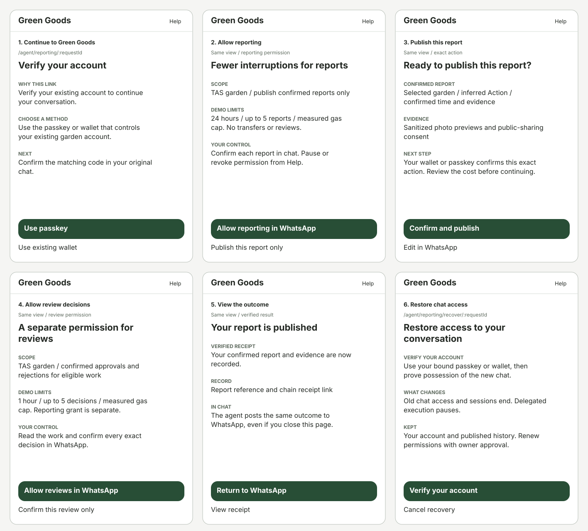

1. **Identify:** “Continue to Green Goods,” with “Use passkey” and “Use existing wallet.” Scope/account proof and chat pairing appear when needed. No private report is disclosed before access is verified.
2. **Allow reporting:** shown for an eligible Kernel account at the first confirmed submission. Display garden, report-only permission, duration, limits and revocation. “Allow reporting in WhatsApp” requests owner authorization; “Publish this report only” takes the explicit one-time path. Browser API access consent is a separate state/component, usually combined with the account proof.
3. **Publish once:** show report, evidence, garden, account and transaction cost. “Confirm and publish” explains that the next step opens the wallet or asks for passkey confirmation. No hidden permission grant. “Edit in WhatsApp” preserves the draft.
4. **Review:** show gardener, work, decision, feedback and verification method. “Confirm review” triggers the selected review authority policy; EOAs confirm in the wallet; eligible Kernel stewards may choose a separate limited review permission, then confirm decisions in chat. Show an explicit permission summary before that choice.
5. **Outcome:** distinguish waiting, uncertain submission and verified publication. A granted Kernel user normally receives this state in chat; the browser state also supports receipts and troubleshooting.
6. **Recovery:** “Verify your account” supports the bound passkey or wallet, then new-channel proof. Explain that old access ends and delegated execution pauses pending fresh owner approval.

**Header controls:** the focused SiteHeader variant replaces the unspecified “Menu” with “Help.” Help explains the current ceremony, privacy/publication, returning to WhatsApp, and pausing or revoking permission. Include the stable `/agent/reporting/permissions` link from section 9.3 so revocation remains reachable without a chat or Agent session. Account switching and ending browser access are explicit actions within the relevant state; onchain revocation requires owner authorization. Help cannot silently navigate away, sign, grant permissions or reveal another report.

On desktop, “Return to WhatsApp” prefers the existing WhatsApp Web conversation or a verified provider-supported destination; retain a visible instruction to return to the existing tab if opening a new conversation is unavailable. On mobile, offer the supported app link. Never embed an arbitrary return URL from inbound text. Recording uses consented demo data and excludes private pairing codes.

### 7.4 Client authentication and application-access machine

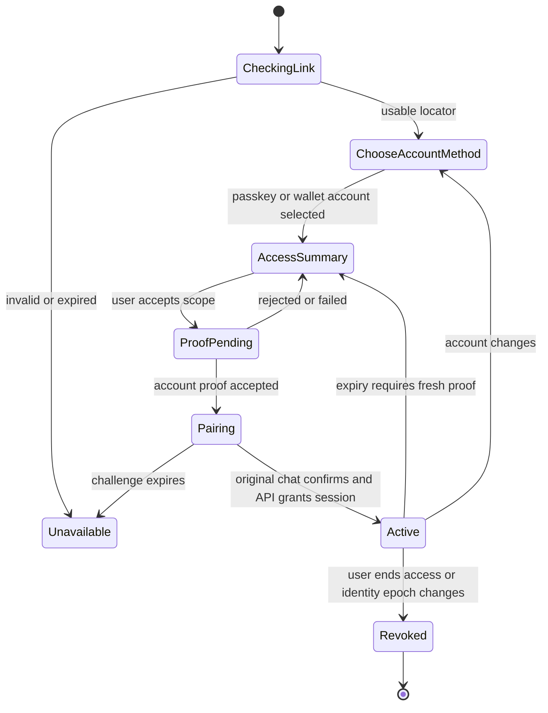
```mermaid
stateDiagram-v2
  [*] --> CheckingLink
  CheckingLink --> Unavailable: invalid or expired
  CheckingLink --> ChooseAccountMethod: usable locator
  ChooseAccountMethod --> AccessSummary: passkey or wallet account selected
  AccessSummary --> ProofPending: user accepts scope
  ProofPending --> AccessSummary: rejected or failed
  ProofPending --> Pairing: account proof accepted
  Pairing --> Active: original chat confirms and API grants session
  Pairing --> Unavailable: challenge expires
  Active --> AccessSummary: expiry requires fresh proof
  Active --> ChooseAccountMethod: account changes
  Active --> Revoked: user ends access or identity epoch changes
  Revoked --> [*]
```

A reconnect with a valid session and already verified pairing can go from `CheckingLink` to `Active` after the API revalidates scope. Keep one active resource-scoped browser session per cookie in this prototype; switching to another report/review requires explicit scope selection and invalidates the earlier browser session. Another tab handles `access_required` without reusing a different resource’s authority; a same-operation tab shares the server reservation. Initial linking and access share one flow; they must not create redundant wallet prompts. Closing a modal never counts as successful proof. Session recovery reads server state; no signature or session secret is persisted in localStorage.

### 7.5 Client exact-signing and receipt machine

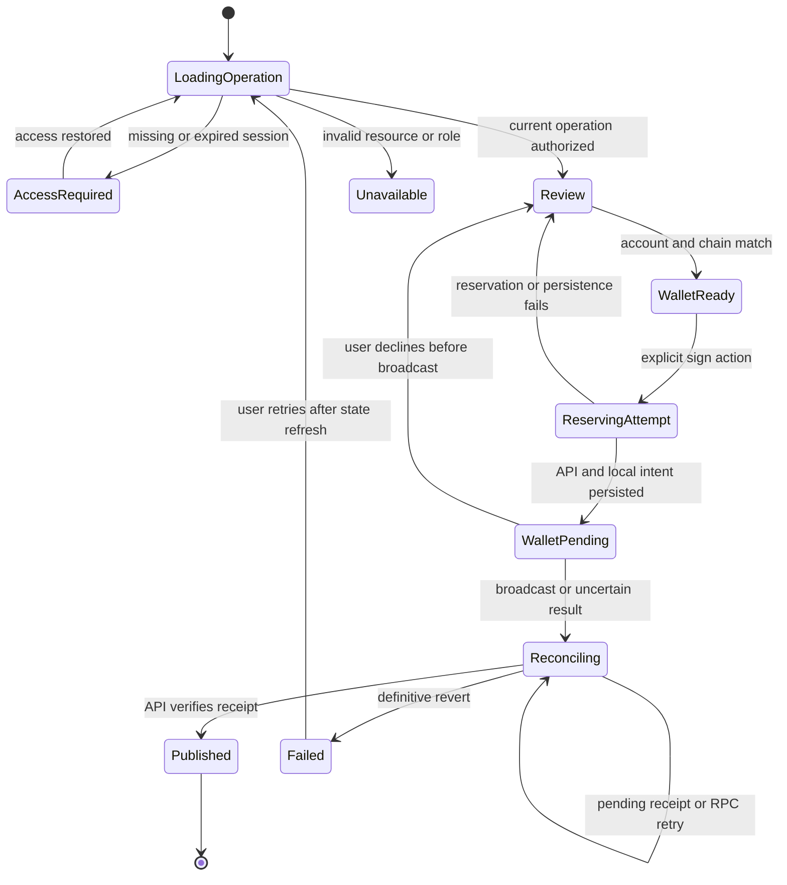
```mermaid
stateDiagram-v2
  [*] --> LoadingOperation
  LoadingOperation --> AccessRequired: missing or expired session
  AccessRequired --> LoadingOperation: access restored
  LoadingOperation --> Review: current operation authorized
  LoadingOperation --> Unavailable: invalid resource or role
  Review --> WalletReady: account and chain match
  WalletReady --> ReservingAttempt: explicit sign action
  ReservingAttempt --> WalletPending: API and local intent persisted
  ReservingAttempt --> Review: reservation or persistence fails
  WalletPending --> Review: user declines before broadcast
  WalletPending --> Reconciling: broadcast or uncertain result
  Reconciling --> Published: API verifies receipt
  Reconciling --> Failed: definitive revert
  Reconciling --> Reconciling: pending receipt or RPC retry
  Failed --> LoadingOperation: user retries after state refresh
  Published --> [*]
```

If the selected account changes, clear private cache and return to authentication. If the chain differs, offer an explicit network switch and wait for the wallet event. Before reservation, a new report revision or changed review decision invalidates the current payload. Once the wallet request has started, preserve the attempt and freeze its revision until its outcome is known. Disable duplicate sign actions while a wallet request is pending. A timeout after submission goes to reconciliation, never directly to retry. Keep an expired private session separate from chain reconciliation: the server continues checking; the browser may need proof again to read private status.

The server operation ID is the retry/resume authority. Associate local queue entries with it and restore that association after refresh. A tab closing or a second tab opening must not create another logical publication. The API reserves the intent; account nonce handling and receipt reconciliation resolve transaction attempts. Do not claim that an idempotent API alone prevents a user signing two distinct transactions.

### 7.5a Client Kernel permission machine

The same ceremony view handles either a reporting or review grant. For Agent-assisted setup, purpose, scope and policy digest are server-owned; reporting approval cannot activate a review grant. Independent revocation starts from owner access and verified chain/module state, with no server session required (section 9.3).

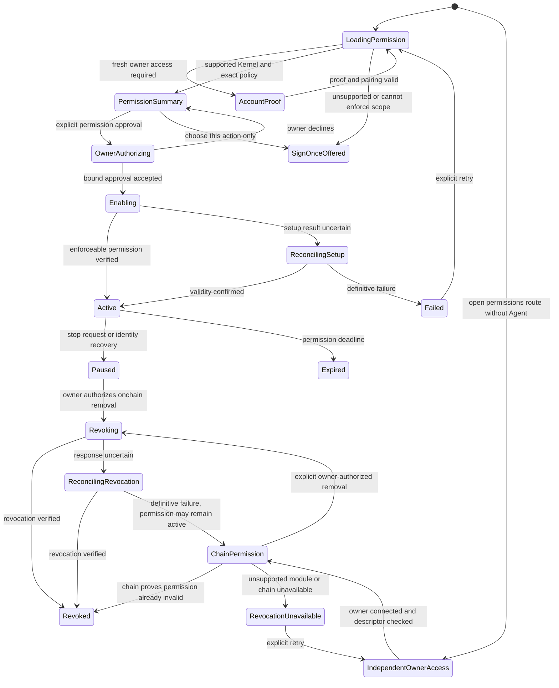
```mermaid
stateDiagram-v2
  [*] --> LoadingPermission
  [*] --> IndependentOwnerAccess: open permissions route without Agent
  IndependentOwnerAccess --> ChainPermission: owner connected and descriptor checked
  ChainPermission --> Revoking: explicit owner-authorized removal
  ChainPermission --> Revoked: chain proves permission already invalid
  ChainPermission --> RevocationUnavailable: unsupported module or chain unavailable
  RevocationUnavailable --> IndependentOwnerAccess: explicit retry
  LoadingPermission --> AccountProof: fresh owner access required
  AccountProof --> LoadingPermission: proof and pairing valid
  LoadingPermission --> PermissionSummary: supported Kernel and exact policy
  LoadingPermission --> SignOnceOffered: unsupported or cannot enforce scope
  PermissionSummary --> OwnerAuthorizing: explicit permission approval
  PermissionSummary --> SignOnceOffered: choose this action only
  OwnerAuthorizing --> PermissionSummary: owner declines
  OwnerAuthorizing --> Enabling: bound approval accepted
  Enabling --> Active: enforceable permission verified
  Enabling --> ReconcilingSetup: setup result uncertain
  ReconcilingSetup --> Active: validity confirmed
  ReconcilingSetup --> Failed: definitive failure
  Failed --> LoadingPermission: explicit retry
  Active --> Paused: stop request or identity recovery
  Active --> Expired: permission deadline
  Paused --> Revoking: owner authorizes onchain removal
  Revoking --> Revoked: revocation verified
  Revoking --> ReconcilingRevocation: response uncertain
  ReconcilingRevocation --> Revoked: revocation verified
  ReconcilingRevocation --> ChainPermission: definitive failure, permission may remain active
```

Keep the first confirmed operation queued during permission setup. Once the grant is valid, execute it only if its digest, consent, role and identity epoch still match; do not ask the gardener to re-confirm unchanged content solely because setup completed. Expiry, changed scope or a changed revision requires a fresh decision. The browser may close after approval; the server reconciles setup and posts its result. A failed or uncertain permission setup never silently falls back to a different signing mode.

### 7.6 Client recovery machine

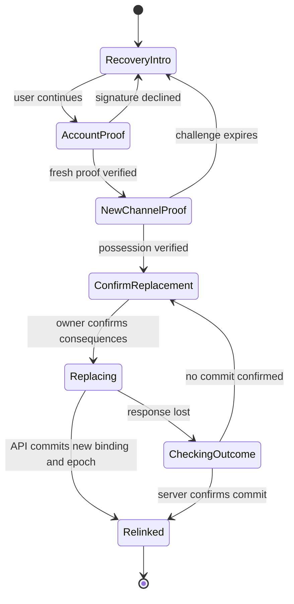
```mermaid
stateDiagram-v2
  [*] --> RecoveryIntro
  RecoveryIntro --> AccountProof: user continues
  AccountProof --> RecoveryIntro: signature declined
  AccountProof --> NewChannelProof: fresh proof verified
  NewChannelProof --> ConfirmReplacement: possession verified
  NewChannelProof --> RecoveryIntro: challenge expires
  ConfirmReplacement --> Replacing: owner confirms consequences
  Replacing --> Relinked: API commits new binding and epoch
  Replacing --> CheckingOutcome: response lost
  CheckingOutcome --> Relinked: server confirms commit
  CheckingOutcome --> ConfirmReplacement: no commit confirmed
  Relinked --> [*]
```

Start recovery from a DM sent by the new channel, which supplies a recovery locator after the notice; no access to the old phone is required. The public landing page never enumerates accounts or bindings. The owner proves the previously bound account and confirms the new channel through that request. Outbound challenges follow the provider’s permitted reply window. Suspend old access only after fresh proof from the bound account authenticates the loss report. A bare phone number, forwarded recovery link or unverified claim cannot suspend another person. The recovery intent expires after ten minutes; compare the expected identity epoch and consume all proof nonces in one transaction when replacing the binding. Concurrent recovery attempts cannot both win. Record the recovery operation ID so a lost response can resume without repeating the replacement. Revoked accounts/channels retain audit records; unfinished drafts remain attached to the same participant and author account. Keep the recovery transaction separate from cancelled signing requests. The browser never claims to recover a lost wallet key.

### 7.7 State ownership, API additions and client acceptance

Client machines own view state, owner requests and recoverable navigation. Kernel permission setup uses the same ceremony container with explicit proposed/authorizing/enabling/active/failed states and a distinct grant payload; it cannot reuse a transaction result as proof of permission installation. The Agent API owns pairing, access grants, draft revisions, operation reservations and receipt truth. Shared owns the pure transition guards, typed commands and React hooks. Jev does not run in the browser and cannot trigger a wallet request.

Add proposed `POST /messaging/access` and `DELETE /messaging/access/:id` behind the same-origin gateway, plus `GET /messaging/access/current` to restore a valid session. Session issuance verifies signed scope, expiry, nonce, account, audience and completed channel pairing; revocation checks the same participant. Existing private draft/operation endpoints accept only the applicable verified grant and reject mismatched resources, revisions or epochs. API mutation requests remain CSRF-protected. These session endpoints amend the earlier per-request-proof-only proposal.

Use these additional API contracts; the browser accesses them through `/api/messaging`:

| Endpoint | Command and guard |
| --- | --- |
| `GET /messaging/reviews/:id` | Read only the bound steward’s review intent and public work context through its scoped session |
| `POST /messaging/execution-grants` | Propose a server-built policy for the authenticated existing Kernel account, source binding, garden and reporting/review purpose |
| `GET /messaging/execution-grants/:id` | Read policy, scope and verified lifecycle under the bound owner’s access |
| `POST /messaging/execution-grants/:id/approval` | Submit exact owner authorization against expected grant version, policy digest and identity epoch |
| `POST /messaging/execution-grants/:id/pause` | Stop new execution through authenticated owner access; a verified bound-chat pause command invokes the same domain command |
| `POST /messaging/execution-grants/:id/revocation` | Optional Agent-assisted preparation; independent owner revocation in section 9.3 must work without this endpoint or its proxy. Neither preparation proves onchain removal |
| `POST /messaging/execution-grants/:id/outcome` | Record setup/revocation transaction hints and independently reconcile them |
| `POST /messaging/recovery/:id/confirm` | Record the owner’s explicit replacement decision after fresh account proof and new-channel possession |

`POST /messaging/relink` atomically applies that confirmed recovery request at its expected epoch; it does not accept an arbitrary new phone number as proof. Browser calls and chat/service actions converge on the same typed command handlers. The live Agent exposes no synthetic intake or general signing endpoint.

All mutation commands carry a schema version, request ID, expected resource/attempt/grant version and the applicable server-issued digest. Enforce principal-scoped idempotency keys: the same key and payload returns the original result; a different payload conflicts. Return typed `access_required`, `stale_revision`, `unsupported_scope`, `dependency_unavailable` or `outcome_unknown` results without exposing other resources. Async work returns an operation reference; the server owns retries. Do not retry signing merely because an HTTP request timed out.

Execution-grant endpoints require fresh owner proof for enabling, renewing, widening or revoking onchain permission; a verified bound-channel pause command only reduces our executor’s access. These endpoints never accept an arbitrary policy or signer chosen by the model. The server issues a policy digest and public signer reference; the browser validates account, module, scope, expiry and limits before owner approval. A successful pause response describes an API pause, not verified onchain revocation. Kernel execution jobs use service authentication and a grant reference, not an expired browser cookie.

Persist the minimum send checkpoint in a dedicated ceremony record: operation ID, attempt version and public broadcast references. Persist a pending typed outcome with its attempt version, idempotency key, reason code and any broadcast reference in that same record; retry delivery after reload and scoped reauthentication until the API acknowledges it. Do not persist an authentication signature or expired session credential as a retry capability. Keep private report text, prepared envelope, media and signing proofs in memory and reload them through the session; do not copy them into the ordinary offline composer database. Store cleanup must remove temporary previews on exit/account change. Existing JobQueue persistence of full work drafts is therefore not reusable unchanged. Exclude private draft/media APIs from service-worker caches; clear Query caches on account switch, logout and revocation. Never place report text, wallet proofs or session tokens in URLs or analytics. Honor `Cache-Control: no-store` for private responses and use a no-referrer policy on ceremony pages. A deployment refresh must preserve the URL and allow API-backed resume; offline mode can explain the interruption but cannot verify fresh authority or announce chain success.

Client acceptance covers both view families, the static independent permission route, refresh, and every reachable purpose/state; no install redirect; browser/installed-context routing; keyboard focus, mobile layout and screen-reader status; desktop extension and mobile handoff; declined proof/signature; wrong account/chain; session expiry and revocation; forwarded links; chat pairing; stale revision; duplicate tabs; reload after broadcast; delayed receipt; hidden private caches; and en/es/pt copy. No implemented frontend or wallet test is claimed by these wireframes.

## 8. Sequence diagrams

### 8.1 Link a WhatsApp participant to an existing account

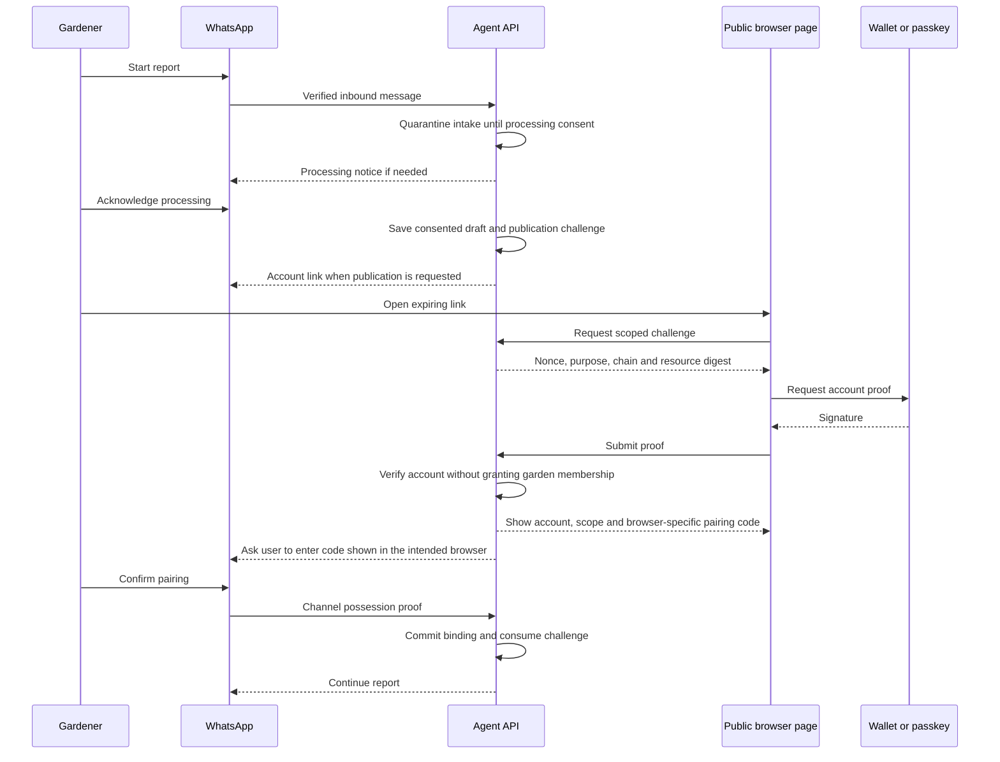
```mermaid
sequenceDiagram
  participant U as Gardener
  participant W as WhatsApp
  participant A as Agent API
  participant B as Public browser page
  participant K as Wallet or passkey
  U->>W: Start report
  W->>A: Verified inbound message
  A->>A: Quarantine intake until processing consent
  A-->>W: Processing notice if needed
  U->>W: Acknowledge processing
  A->>A: Save consented draft and publication challenge
  A-->>W: Account link when publication is requested
  U->>B: Open expiring link
  B->>A: Request scoped challenge
  A-->>B: Nonce, purpose, chain and resource digest
  B->>K: Request account proof
  K-->>B: Signature
  B->>A: Submit proof
  A->>A: Verify account without granting garden membership
  A-->>B: Show account, scope and browser-specific pairing code
  A-->>W: Ask user to enter code shown in the intended browser
  U->>W: Confirm pairing
  W->>A: Channel possession proof
  A->>A: Commit binding and consume challenge
  A-->>W: Continue report
```

### 8.2 Report and correct work in a DM

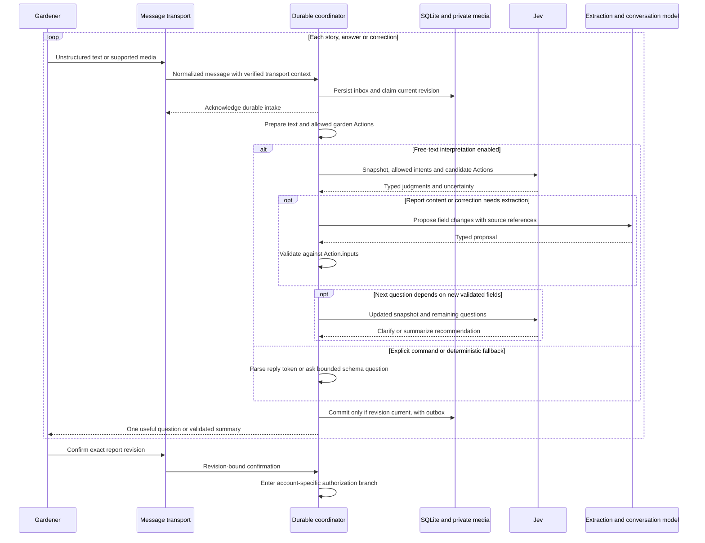
```mermaid
sequenceDiagram
  participant U as Gardener
  participant T as Message transport
  participant A as Durable coordinator
  participant D as SQLite and private media
  participant J as Jev
  participant L as Extraction and conversation model
  loop Each story, answer or correction
    U->>T: Unstructured text or supported media
    T->>A: Normalized message with verified transport context
    A->>D: Persist inbox and claim current revision
    A-->>T: Acknowledge durable intake
    A->>A: Prepare text and allowed garden Actions
    alt Free-text interpretation enabled
      A->>J: Snapshot, allowed intents and candidate Actions
      J-->>A: Typed judgments and uncertainty
      opt Report content or correction needs extraction
        A->>L: Propose field changes with source references
        L-->>A: Typed proposal
        A->>A: Validate against Action.inputs
      end
      opt Next question depends on new validated fields
        A->>J: Updated snapshot and remaining questions
        J-->>A: Clarify or summarize recommendation
      end
    else Explicit command or deterministic fallback
      A->>A: Parse reply token or ask bounded schema question
    end
    A->>D: Commit only if revision current, with outbox
    A-->>U: One useful question or validated summary
  end
  U->>T: Confirm exact report revision
  T->>A: Revision-bound confirmation
  A->>A: Enter account-specific authorization branch
```

Jev is evaluated again when an answer/correction needs interpretation. It is not required for every packet, delivery receipt or explicit button reply. A stale model result is discarded; the next turn uses the current persisted revision. The conversation model can phrase a permitted question, but cannot alter persisted facts or invent a successful outcome.

### 8.3 Publish with an EOA or explicit sign-once choice

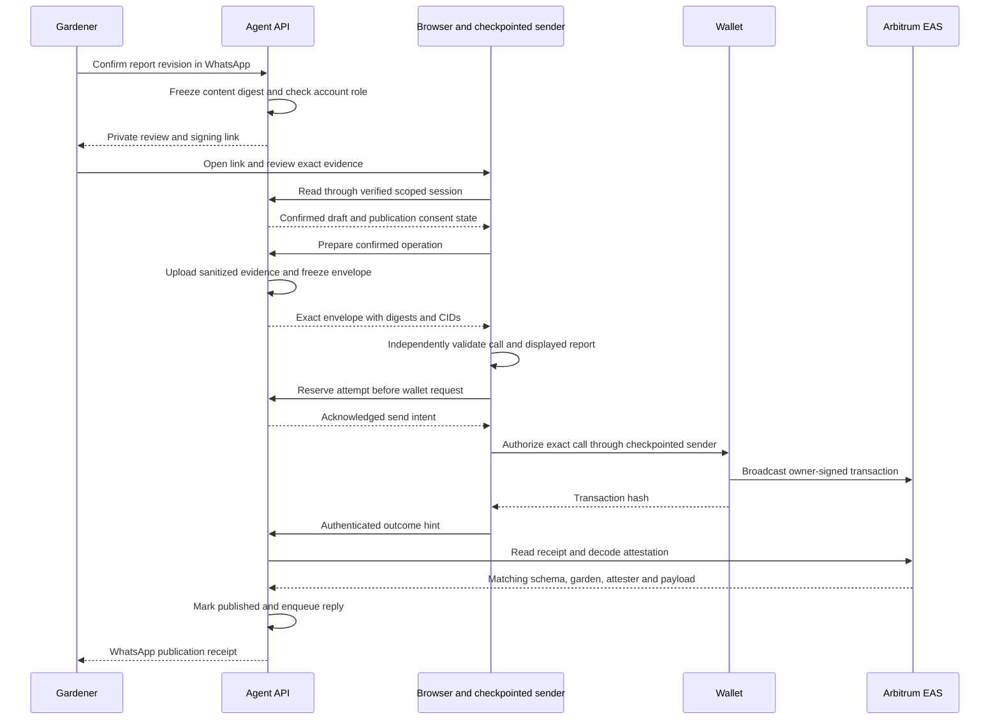
```mermaid
sequenceDiagram
  participant U as Gardener
  participant A as Agent API
  participant B as Browser and checkpointed sender
  participant K as Wallet
  participant C as Arbitrum EAS
  U->>A: Confirm report revision in WhatsApp
  A->>A: Freeze content digest and check account role
  A-->>U: Private review and signing link
  U->>B: Open link and review exact evidence
  B->>A: Read through verified scoped session
  A-->>B: Confirmed draft and publication consent state
  B->>A: Prepare confirmed operation
  A->>A: Upload sanitized evidence and freeze envelope
  A-->>B: Exact envelope with digests and CIDs
  B->>B: Independently validate call and displayed report
  B->>A: Reserve attempt before wallet request
  A-->>B: Acknowledged send intent
  B->>K: Authorize exact call through checkpointed sender
  K->>C: Broadcast owner-signed transaction
  K-->>B: Transaction hash
  B->>A: Authenticated outcome hint
  A->>C: Read receipt and decode attestation
  C-->>A: Matching schema, garden, attester and payload
  A->>A: Mark published and enqueue reply
  A-->>U: WhatsApp publication receipt
```

For a Kernel owner, the wallet/broadcast segment uses the existing user-operation flow when the owner chooses sign once. Capture both the user-operation reference and the eventual transaction receipt. The attester remains the owner's Kernel account; it is not the passkey public key or the bundler.

### 8.3a Kernel permission at first submission, then chat-only reporting

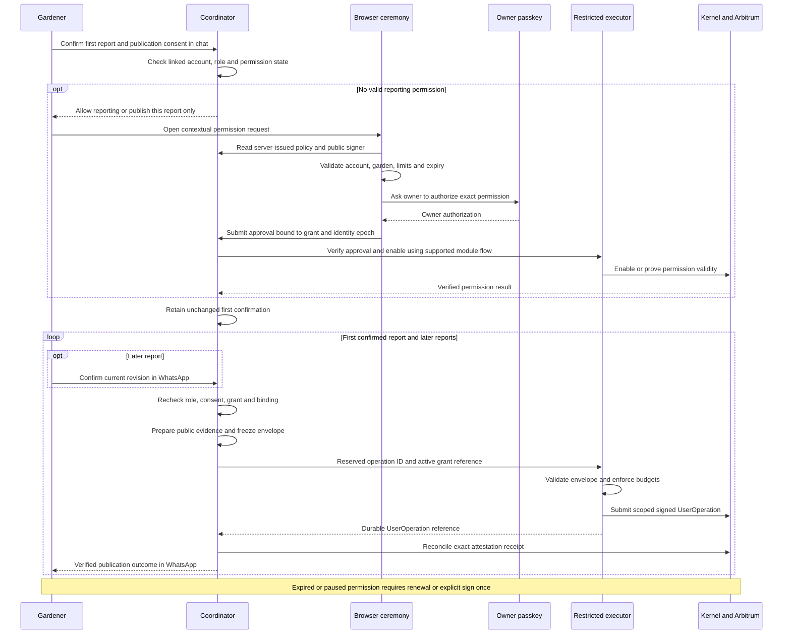
```mermaid
sequenceDiagram
  participant U as Gardener
  participant A as Coordinator
  participant B as Browser ceremony
  participant P as Owner passkey
  participant X as Restricted executor
  participant C as Kernel and Arbitrum
  U->>A: Confirm first report and publication consent in chat
  A->>A: Check linked account, role and permission state
  opt No valid reporting permission
    A-->>U: Allow reporting or publish this report only
    U->>B: Open contextual permission request
    B->>A: Read server-issued policy and public signer
    B->>B: Validate account, garden, limits and expiry
    B->>P: Ask owner to authorize exact permission
    P-->>B: Owner authorization
    B->>A: Submit approval bound to grant and identity epoch
    A->>X: Verify approval and enable using supported module flow
    X->>C: Enable or prove permission validity
    C-->>A: Verified permission result
  end
  A->>A: Retain unchanged first confirmation
  loop First confirmed report and later reports
    opt Later report
      U->>A: Confirm current revision in WhatsApp
    end
    A->>A: Recheck role, consent, grant and binding
    A->>A: Prepare public evidence and freeze envelope
    A->>X: Reserved operation ID and active grant reference
    X->>X: Validate envelope and enforce budgets
    X->>C: Submit scoped signed UserOperation
    X-->>A: Durable UserOperation reference
    A->>C: Reconcile exact attestation receipt
    A-->>U: Verified publication outcome in WhatsApp
  end
  Note over U,C: Expired or paused permission requires renewal or explicit sign once
```

Permission enablement may be a dedicated owner-authorized call or deferred enable data on the first operation, depending on the pinned Kernel module. The compatibility spike chooses and proves one lifecycle, including uncertain setup and revocation. This diagram does not imply a one-signature guarantee or that setup is already implemented. Declining permission follows section 8.3.

### 8.4 Steward approval or rejection

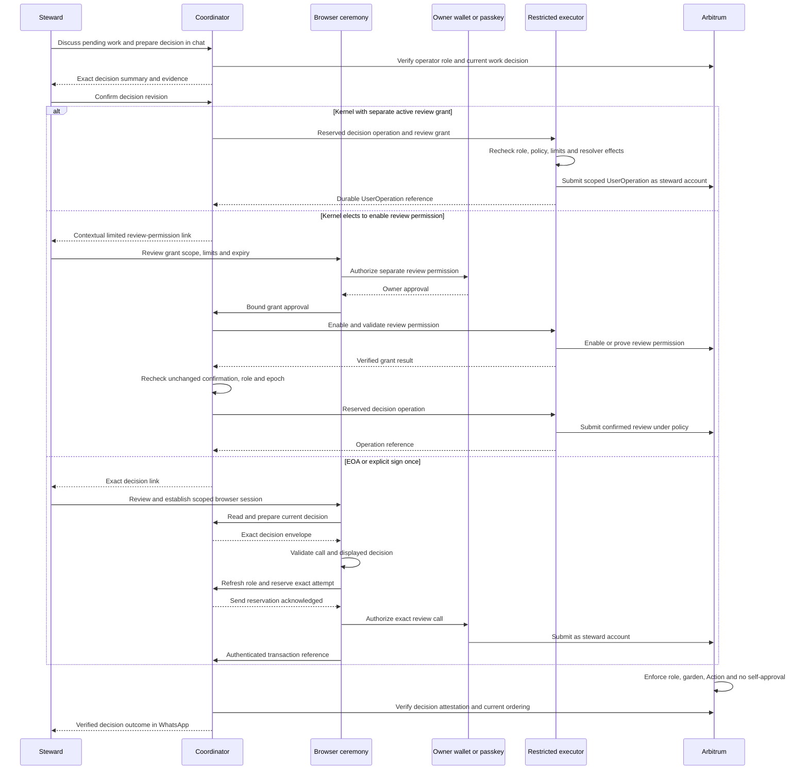
```mermaid
sequenceDiagram
  participant S as Steward
  participant A as Coordinator
  participant B as Browser ceremony
  participant K as Owner wallet or passkey
  participant X as Restricted executor
  participant C as Arbitrum
  S->>A: Discuss pending work and prepare decision in chat
  A->>C: Verify operator role and current work decision
  A-->>S: Exact decision summary and evidence
  S->>A: Confirm decision revision
  alt Kernel with separate active review grant
    A->>X: Reserved decision operation and review grant
    X->>X: Recheck role, policy, limits and resolver effects
    X->>C: Submit scoped UserOperation as steward account
    X-->>A: Durable UserOperation reference
  else Kernel elects to enable review permission
    A-->>S: Contextual limited review-permission link
    S->>B: Review grant scope, limits and expiry
    B->>K: Authorize separate review permission
    K-->>B: Owner approval
    B->>A: Bound grant approval
    A->>X: Enable and validate review permission
    X->>C: Enable or prove review permission
    X-->>A: Verified grant result
    A->>A: Recheck unchanged confirmation, role and epoch
    A->>X: Reserved decision operation
    X->>C: Submit confirmed review under policy
    X-->>A: Operation reference
  else EOA or explicit sign once
    A-->>S: Exact decision link
    S->>B: Review and establish scoped browser session
    B->>A: Read and prepare current decision
    A-->>B: Exact decision envelope
    B->>B: Validate call and displayed decision
    B->>A: Refresh role and reserve exact attempt
    A-->>B: Send reservation acknowledged
    B->>K: Authorize exact review call
    K->>C: Submit as steward account
    B->>A: Authenticated transaction reference
  end
  C->>C: Enforce role, garden, Action and no self-approval
  A->>C: Verify decision attestation and current ordering
  A-->>S: Verified decision outcome in WhatsApp
```

For a first grant, permission setup and review submission may be separate operations; reconcile each result. Setup success alone never means the review was recorded. Reporting and review use distinct permission IDs and budgets; neither model may turn one purpose into the other.

### 8.5 Grant browser access, then authorize an exact action

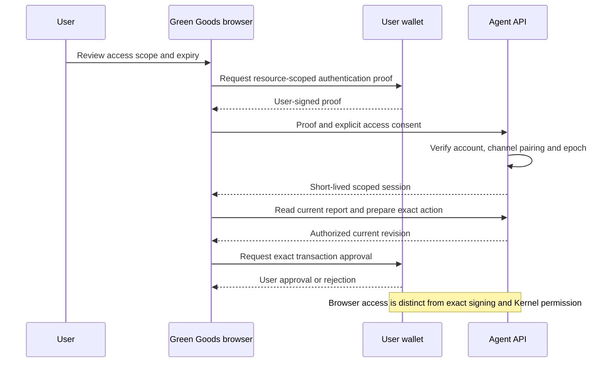
```mermaid
sequenceDiagram
  participant U as User
  participant B as Green Goods browser
  participant W as User wallet
  participant A as Agent API
  U->>B: Review access scope and expiry
  B->>W: Request resource-scoped authentication proof
  W-->>B: User-signed proof
  B->>A: Proof and explicit access consent
  A->>A: Verify account, channel pairing and epoch
  A-->>B: Short-lived scoped session
  B->>A: Read current report and prepare exact action
  A-->>B: Authorized current revision
  B->>W: Request exact transaction approval
  W-->>B: User approval or rejection
  Note over A,W: Browser access is distinct from exact signing and Kernel permission
```

### 8.6 Relink after losing access to WhatsApp

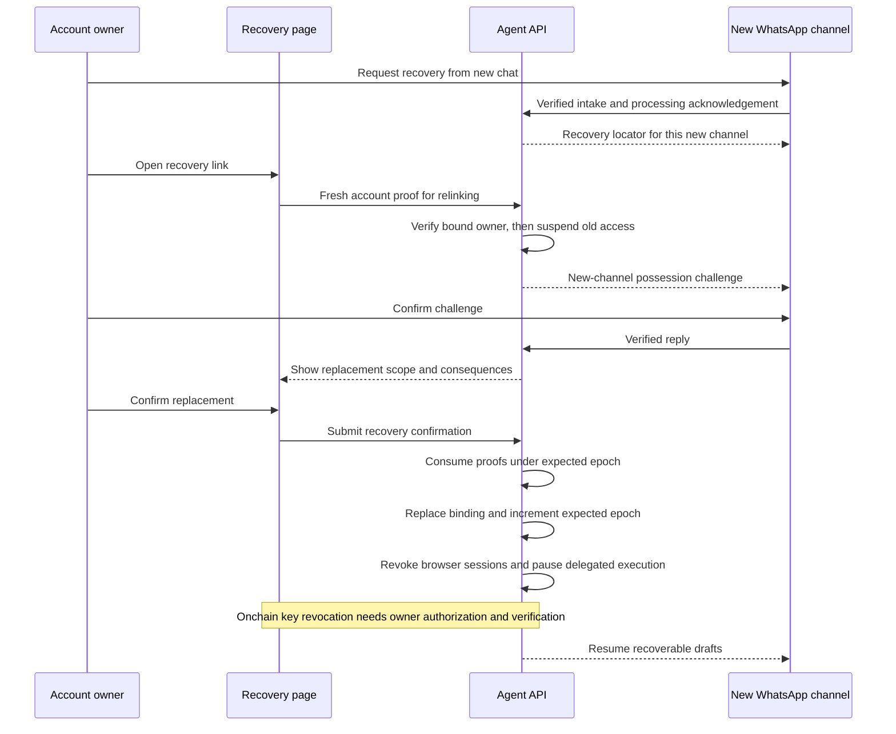
```mermaid
sequenceDiagram
  participant U as Account owner
  participant B as Recovery page
  participant A as Agent API
  participant N as New WhatsApp channel
  U->>N: Request recovery from new chat
  N->>A: Verified intake and processing acknowledgement
  A-->>N: Recovery locator for this new channel
  U->>B: Open recovery link
  B->>A: Fresh account proof for relinking
  A->>A: Verify bound owner, then suspend old access
  A-->>N: New-channel possession challenge
  U->>N: Confirm challenge
  N->>A: Verified reply
  A-->>B: Show replacement scope and consequences
  U->>B: Confirm replacement
  B->>A: Submit recovery confirmation
  A->>A: Consume proofs under expected epoch
  A->>A: Replace binding and increment expected epoch
  A->>A: Revoke browser sessions and pause delegated execution
  Note over A,B: Onchain key revocation needs owner authorization and verification
  A-->>N: Resume recoverable drafts
```

### 8.7 Future group binding or change

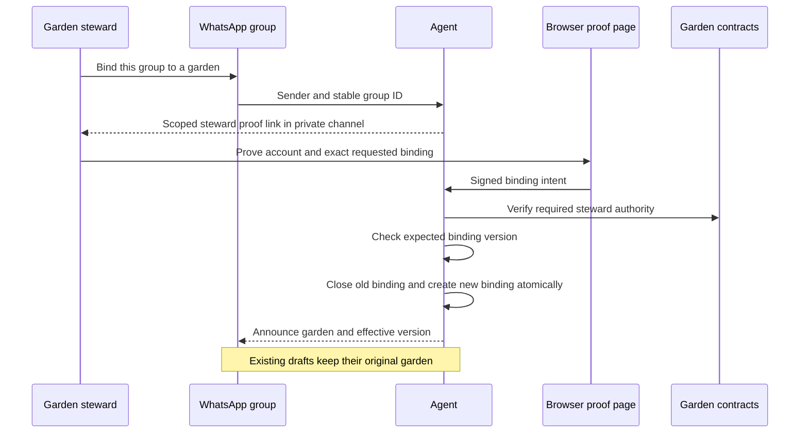
```mermaid
sequenceDiagram
  participant S as Garden steward
  participant G as WhatsApp group
  participant A as Agent
  participant B as Browser proof page
  participant C as Garden contracts
  S->>G: Bind this group to a garden
  G->>A: Sender and stable group ID
  A-->>S: Scoped steward proof link in private channel
  S->>B: Prove account and exact requested binding
  B->>A: Signed binding intent
  A->>C: Verify required steward authority
  A->>A: Check expected binding version
  A->>A: Close old binding and create new binding atomically
  A-->>G: Announce garden and effective version
  Note over A,G: Existing drafts keep their original garden
```

## 9. Application access, signing and limits

Owner keys remain in the user's wallet or passkey system. EOA execution uses exact owner authorization. Kernel execution uses a separately authorized, restricted signing key held by the executor custody service. Browser access, chat possession and execution authority have separate lifetimes.

Proposed session limits: a ten-minute linking challenge, a fifteen-minute browser access session, one account, chain `42161`, one participant and one explicitly listed report/review or grant-management purpose per active browser session. The confirmation and transaction preparation are bound to the current resource revision. These durations are initial defaults to evaluate with users, not protocol constraints. Refreshing a page can reuse a valid session; expiry requires a new proof, not a new report.

**Concrete deployment proposal:** add a fixed same-origin proxy prefix `/api/messaging/*` on the canonical client origin, mapped to the Agent's `/messaging/*` routes before the SPA catch-all. The [current client Vercel configuration](../../../packages/client/vercel.json) has no such proxy; this is required deployment work, not an existing capability. Vercel documents external-origin rewrites, but header/cookie forwarding must be proven for the selected configuration. [Rewrite documentation](https://vercel.com/docs/routing/rewrites)

Keep session issuance and validation in the Agent API; the proxy transports requests and responses and holds no second session database. The Agent returns a host-only Secure, HttpOnly, SameSite=Lax session cookie with path `/api/messaging`, no Domain attribute and expiry matching the grant. The browser sees the response on the client origin. Give the pairing pre-authentication cookie a distinct name and shorter life. Except for the origin/header-guarded bootstrap above, mutations require the exact allowed browser Origin and a server-issued CSRF token bound to that session/pre-session. Reject an absent/untrusted Origin on browser mutations; the separately signed Meta webhook is unaffected. No wildcard credentialed CORS. Do not trust arbitrary forwarded-host headers as the signing audience.

Proxy and Agent private responses use `Cache-Control: no-store`; pass bodies, status codes and Set-Cookie without caching or redirecting to the Agent domain. Tests must cover cookie setting/deletion, GET versus mutation, CSRF mismatch, SPA rewrite precedence and two-browser isolation. If this transport is unavailable, the session design is blocked: do not silently fall back to URL/localStorage bearer credentials. Session revocation occurs at the Agent and is enforced even if a browser retains an old cookie.

Use the existing signature-verification primitive with the new single-use messaging proof envelope to bootstrap that session. Signing once per session avoids prompting for each API read. Keep authentication proofs, application grants and exact transaction signatures as separate typed commands and records.

Apply per-subject, per-account and per-IP abuse limits; reserve an operation atomically to prevent duplicate submissions. An exact owner approval or a valid onchain Kernel permission authorizes the transaction; resolvers enforce their domain rules. A model judgment never supplies authority. Cancelling a session or expiring a link cannot cancel a transaction already broadcast. Revocation blocks future API access; public chain records and published evidence remain public.

### 9.1 Kernel permission and accepted demo limits

The user accepted the duration and submission limits below for the demo. They are configuration requirements, not enabled permissions or compatibility proof. Reporting and review are separate, explicitly opted-in grants. Gas caps remain to be set from measured calls before any grant is offered. The reporting permission excludes review decisions, financial commitments, transfers, token approvals, arbitrary message signatures, account upgrades, validator changes and delegatecalls.

| Constraint | Demo configuration | Enforcement / proof required |
| --- | --- | --- |
| Account and chain | One existing Kernel account on Arbitrum One | Bind owner approval, EntryPoint/module version and signer to the account and chain |
| Garden and method | One selected garden; Work schema; configured EAS target; zero-value single `attest` call | Prove the permission can constrain the actual nested EAS ABI, including schema and recipient. Target/selector alone is insufficient |
| Duration | 24 hours per owner-approved reporting grant | Onchain timestamp restriction plus API validity checks; never an indefinite grant by default |
| Frequency | At most 5 report submissions during that 24-hour grant | Chain policy plus atomic server reservation; failed/uncertain attempts must not reset budgets. Test the policy's counting semantics |
| Gas | Explicit cumulative cap chosen after measuring representative calls; approved paymaster where available | Onchain gas policy, sponsor budget and server cap. No silent fallback to spending account ETH when sponsorship fails |
| User intent | Current report or review revision explicitly confirmed in the linked chat | Server guard and signer service checks; this is not independently provable by a generic onchain permission |
| Stop / recover | Pause new jobs immediately on owner/channel recovery; owner can revoke onchain | Separate pause and revocation states; reconcile already signed or broadcast operations |

Bind explicit `validAfter`/`validUntil` timestamps in owner approval. Delayed activation must not extend that approved window. Reserve submission and gas budget before signing; uncertain/broadcast attempts keep their reservation. Reconciliation may release a provably unused reservation, but retries cannot reset consumed budget or create a new grant. New limits or renewal require owner approval. The installed policy’s counting semantics may be stricter than the UI allowance; disclose that behavior before granting.

The key holder can act within its onchain permission even if application confirmation checks are compromised. Limit what that permission can do. Verify that nested garden/schema restrictions, gas caps, batch rejection and expiry hold with adversarial calldata before offering “garden-only” permission. If existing modules cannot enforce the advertised scope, keep sign-once available and design a narrowly scoped validator/policy separately; do not quietly widen to unrestricted EAS access. [Call constraints](https://docs.zerodev.app/smart-accounts/permissions/policies/call), [gas controls](https://docs.zerodev.app/smart-accounts/permissions/policies/gas), [expiry](https://docs.zerodev.app/smart-accounts/permissions/policies/timestamp), [rate policy](https://docs.zerodev.app/smart-accounts/permissions/policies/rate-limit)

**Separate review grant (user-selected direction):** bind it to the steward account, one garden and the WorkApproval schema. Accepted demo limits are a one-hour expiry and at most five decision submissions, with a separate cumulative gas cap set from measured calls. Every decision still needs its exact chat summary confirmed, a fresh operator/no-self-review check and latest-decision refresh. No automatic approval from Jev confidence. Granting, renewing or widening review permission requires the owner.

Review resolver hooks can affect Karma or financial commitments even with a zero-value call. Before enabling delegated reviews, verify the selected garden's configured hooks and demonstrate the effects. Keep financially linked work outside the prototype through enforceable restrictions; if an installed policy cannot constrain the required work references/encoded fields, or broader indirect effects cannot be bounded, keep those reviews on exact owner authorization. Do not describe zero-value calldata as proof that no financial effect is possible. Negative tests must reject report-grant review attempts, wrong-garden/schema/work calls, unauthorized batch paths and exhausted/expired grants.

### 9.2 Delegated signer custody

**Recommendation:** a restricted signing service backed by a managed non-exportable secp256k1 key, with a distinct key per grant or account and short-lived service credentials. The Agent/model process does not receive raw keys. The signer receives an operation reference, loads the immutable envelope and approved policy, validates them, and signs only the supported UserOperation format. It must not expose a general “sign this digest” tool to conversation code.

A KMS can protect a private key but does not understand garden authority or user intent. For example, AWS KMS supports `ECC_SECG_P256K1`; an Ethereum adapter still needs digest, encoding, signature normalization/recovery and Kernel-validator compatibility proof. AWS is a researched candidate, not a selected or provisioned dependency. [KMS key specifications](https://docs.aws.amazon.com/kms/latest/developerguide/symm-asymm-choose-key-spec.html)

| Option | Advantage | Cost / limitation |
| --- | --- | --- |
| Managed key plus policy-checking signer | Limits key extraction, separates model and signing authority, supports audit and revocation | New service/provider, credentials, latency and format integration; valid credentials can still request permitted signatures |
| Envelope-encrypted software session keys | Lower initial integration effort; keys encrypted in storage | Worker compromise can expose decrypted keys. Requires isolated executor, separate wrapping key and rotation; weaker than non-exportable custody |
| Sign once with owner each time | No delegated key custody | More browser interruptions; explicit fallback while compatibility/custody is unproven |

Do not put owner keys or reusable delegated secrets in root application environment variables, logs, model prompts, browser storage or serialized draft JSON. Provider credentials are a separate secret. A key rotation requires new owner permission; retain old grant/attempt records for reconciliation. Deleting a key or pausing our service is not the same as onchain revocation, especially if signed operations are already in flight.

### 9.3 Owner revocation without the Agent

**Delegation stays disabled until `DEL-03` passes for the exact account/module combination.** Client and Shared own an independent permission-management mode at the static `/agent/reporting/permissions` route, ahead of `:requestId`. It reuses the ceremony view and focused PublicShell/SiteHeader variant. Its loader, owner connection, permission inspection and submission do not call `/api/messaging`, require a chat link, read Agent SQLite or use the delegated signer. Serve its bundle and pinned module configuration independently of the Agent process. Agent-assisted endpoints remain conveniences; they are not the recovery authority.

During permission setup, Shared produces a bounded public revocation descriptor: chain/account, Kernel/EntryPoint versions, validator/module address and code hash, permission identifier, public delegated signer, scope and expiry, and the applicable adapter version. Display/save it for the owner before enablement; allow export and later import without storing owner secrets or authorization signatures. Persist this non-secret descriptor separately from private drafts. Chain state and the owner's selected account remain authoritative: validate imported descriptors against the pinned module allowlist and installed permission, and derive the revocation call in code. Never execute imported calldata or an Agent-supplied arbitrary target. Also prove reconstruction from chain installation events/state when local storage is cleared. If a supported module cannot expose enough information for either recovery path, do not enable it.

Shared's module-specific owner adapter uses the existing Kernel owner's passkey or configured wallet to remove/invalidate the selected permission onchain. The compatibility spike must pin the actual module ABI, revocation operation, owner authorization and replay protection; this brief does not assume the legacy checked-in session-key plugin is compatible with Kernel 0.3.1. Fresh browser API authentication is unnecessary for this owner transaction. If passkey connection relies on an Agent account/credential lookup, first provide independently available owner credential discovery or the validated locally retained public credential metadata; otherwise that account fails the delegation gate.

Read state and submit the owner operation through independently available RPC/bundler access, with a tested gas-payment path that does not depend on Agent sponsorship, keys or credentials. Require explicit owner confirmation of which permission will stop. Show any broader effect if the proven adapter can only invalidate several grants together; never remove the root owner validator. Verify the receipt and effective permission state directly from chain before showing “Revoked.” An RPC failure or unknown receipt remains pending/unknown, with a safe retry of the same tracked operation. An Agent pause or a deleted signer key is never proof of removal. When the Agent returns, it reconciles chain state and disables the corresponding execution grant without needing a callback to have survived.

Prove this with the Agent and its proxy unreachable, its database unavailable, and its delegated key still able to sign: load the independent route, authorize with the owner, revoke, then attempt a previously signed delegated operation and a newly signed one. After effective revocation both must be rejected, and a prior enable authorization must not reinstall the permission. If that guarantee cannot be enforced by the selected module, keep delegation disabled. An operation included before revocation remains irreversible and must be reported honestly. An unavailable frontend requires restoring the static route at the canonical passkey origin; another origin cannot substitute for that relying party. Wallet-based owners may use a separately verified compatible account tool. Without owner access or chain connectivity, revocation cannot be promised; report the remaining expiry window and escalate to support.

```mermaid
sequenceDiagram
  actor O as Account owner
  participant B as Public permission view
  participant W as Owner wallet or passkey
  participant C as Independent RPC and Kernel
  Note over B,C: Agent, proxy and database are unavailable
  O->>B: Open saved permissions link
  B->>C: Read account and installed permission
  B-->>O: Show verified permission and revocation effect
  O->>W: Explicitly authorize removal
  W->>C: Submit owner revocation
  B->>C: Verify receipt and effective state
  C-->>B: Permission invalid
  B-->>O: Revoked
  Note over B,C: Old and new delegated operations now fail
```

## 10. WhatsApp operations, processors and media lifecycle

Green Goods is the product and the name shown in the client, agent and demonstration. WEFA operates the initial WhatsApp integration: Meta provider accounts, messaging participant notices, processor arrangements, retention, incident response and WhatsApp support. Each selected garden's authorized stewards manage its context and review work. Any later transfer of WhatsApp operations requires a provider-account review and participant notice.

Meta transports messages; the Green Goods agent stores private workflow data under those operating arrangements; OpenAI receives minimal task content for the selected processing features; TypeSafe receives only the state needed for its bounded questions. Public evidence storage and Arbitrum receive only the material the gardener explicitly agrees to publish. A group administrator adding a bot does not substitute for explaining processing to each participant.

**Updated Jev finding:** TypeSafe publishes a Data Processing Addendum and Master Customer Agreement. Its DPA identifies customer/processor roles and links subprocessors. The published duration remains purpose-based rather than a fixed short request-retention period; enterprise zero-retention is offered separately. WEFA must confirm the terms applicable to its account. This corrects the earlier narrower finding that only a website privacy policy was available. [Legal overview](https://docs.typesafe.ai/legal), [DPA](https://typesafe.ai/legal/data-processing), [customer agreement](https://typesafe.ai/legal/mca)

**Accepted local demo retention:** unconsented intake expires after 24 hours. Delete inactive drafts after seven days from their last participant action; retries and background jobs do not extend that deadline. After publication/reconciliation, delete private source files and temporary converted/sanitized copies. Inactive-draft deletion covers source text, transcripts, extracted text, revision content and diagnostic copies, not only media files. Keep tombstones and minimal consent/operation receipts separately under the remaining operational retention schedule. These local periods do not automatically apply to Meta, OpenAI or TypeSafe; do not promise deletion of chain records or copies already published to IPFS.

Cleanup jobs and provider-file deletion requests are durable and idempotent. Resolve expired raw content without erasing an uncertain execution attempt: retain only the envelope/digests, public references and protected reconciliation material needed to establish its outcome. Resuming an expired draft explains that private source content is no longer available. Active channel/account bindings outlive a particular draft until unlinking; raw message text is not needed to maintain them. Backup expiry and minimal audit-record retention still need an operating schedule before live testing; they must not silently become permanent raw-data archives.

Media processing must validate MIME from bytes, cap size/count/duration, fetch only authenticated provider media endpoints, reject unsafe redirects, normalize images and strip location metadata. Keep provider URLs and raw identifiers out of public metadata. Disable raw-message logging and model prompt capture in analytics. Give voice transcription a separate consent and retention path. The demo can proceed without voice support.

### 10.1 Prototype support and intake readiness

**Accountable support owner: Afolabi — [afo@wefa.world](mailto:afo@wefa.world).** WEFA owns WhatsApp operations; Green Goods remains the product. A deterministic `help` command and the ceremony Help sheet show this contact. Include it in the tester invitation and first-contact notice so a broken agent does not prevent contact. Afolabi receives deletion requests, identity/relinking problems and delivery incidents, and coordinates technical incidents with the Opus 5.5 builder and Astra reviewer. Garden-specific work and membership questions go to the selected garden's authorized steward through Afolabi. Model assignments are engineering responsibilities, not substitutes for a human support contact.

Before real tester intake, verify the support address and help path, consent copy, cleanup jobs, processor terms and remaining audit/backup retention settings. Record a help/deletion/incident rehearsal. If support becomes unavailable, pause new tester intake until a replacement is named and notices updated; no response-time or backup-person promise is assumed. Synthetic fixtures do not require live support availability. Never mark a live intake gate complete merely because this document names the owner.

## 11. Failure and recovery contract

| Condition | Required behavior |
| --- | --- |
| Duplicate webhook or restarted worker | Reclaim an expired lease and resume; do not duplicate the source entry or operation. |
| Jev/extraction outage, low confidence or malformed response | Save the message, ask deterministic questions, and preserve existing confirmed fields. |
| Concurrent correction and model result | Reject the stale result using the revision guard. |
| Forwarded or expired link; preview crawler | Disclose no private draft; do not consume on GET; require the right account/channel pairing. |
| Wallet rejection or mobile handoff interrupted | Preserve the draft. A proven pre-broadcast rejection can be retried explicitly; a prompt or handoff with an unknown outcome stays reserved and reconciles. |
| Broadcast accepted but callback lost | Reconcile using known transaction/user-operation identity. If identity is unavailable, stop for investigation; do not automatically resend. |
| Transaction replaced, reverted or receipt reorganized | Track the replacement and canonical receipt. Keep outcome pending/failed as appropriate and require renewed intent when payload changes. |
| Chain RPC unavailable | Preserve operation state and retry reads with a bounded budget; never announce success from a browser hint. |
| Outbound WhatsApp reply fails | Retry the durable outbox; publication does not repeat. Use permitted templates or wait for a user-initiated message. |
| Garden role removed or permission expired | Deny execution and return to authorization/signature steps. |
| Phone lost, wallet retained | Relink through fresh wallet proof and new-channel possession; invalidate old pending authority. |
| Wallet signer lost | Refer to that wallet's configured recovery. The integration cannot reconstruct an EOA key from a phone number. |

### 11.1 Chain receipt and reconciliation contract

A successful RPC call or status-1 receipt is insufficient. Read the receipt from the configured Arbitrum client, require success and the expected deployed EAS event emitter, decode the matching `Attested` event, then fetch that attestation. Compare schema, recipient garden, attester account, action/work reference, encoded payload, metadata/media CIDs and the frozen operation envelope. Check transaction/block hash and log index. For Kernel, the transaction sender can be an EntryPoint/bundler; compare the attestation's attester to the Kernel account, not `transaction.from`. Persist the user-operation reference and its resolved transaction separately.

The demo's proposed success boundary is verified inclusion in the current canonical Arbitrum chain. It is not a claim of L1 finality. Recheck the block hash when resuming a pending operation and on a detected replacement/reorganization. A disappeared or mismatched receipt returns to reconciliation and produces a corrective status message, never a fresh automatic send. Record the confirmation policy in deployment configuration; a stronger settlement requirement needs a separately agreed latency target.

When the browser cannot report a hash, the Agent uses the recorded account, chain, EAS/schema, starting block and exact envelope to search a bounded event range. `clientWorkId` in metadata supports matching but the contract does not enforce its uniqueness. One matching canonical attestation resolves the intent; none leaves it uncertain; more than one is an operator-visible conflict. Unknown UserOperations require bundler reconciliation or this event scan. Persist progress and cap RPC work. Only a proven rejection, cancellation replacement or definitive revert permits a new attempt after explicit user action. Epoch changes or lost cookies do not authorize resubmission.

An expired browser session can submit no new protected request; once reauthenticated, it may report the known hash for the same reserved attempt. The background reconciler continues independently of browser sessions. A forged outcome hint cannot alter the envelope or mark an unrelated transaction as published. Store failed hints as bounded diagnostics without announcing them in chat.

### 11.1.1 Durable terminal outcomes

Each execution attempt has a typed durable outcome, including attempts with no transaction hash. The browser keeps a pending outcome in the minimal ceremony checkpoint and retries its authenticated POST after reload/session renewal. The Agent owns equivalent persistence for delegated attempts. Store `operationId`, attempt version, frozen payload digest, idempotency key, outcome kind, bounded reason code and optional public broadcast reference. Validate the resource/account/epoch and commit the accepted outcome, allowed reservation transition and chat reply intent atomically. If an authorization path consumes a one-time nonce, consume it in that same transaction. An authenticated exact replay returns the original result even after that nonce is consumed; a changed payload under the same key conflicts. A lost acknowledgement cannot lose the result or duplicate its reply intent.

| Outcome | Reservation and recovery rule |
| --- | --- |
| Preparation/validation failed before any send attempt | Persist the failure; preserve the draft and explain what needs correction. No fabricated transaction hash or receipt |
| Owner explicitly rejected before send | Record the report; release the send reservation only when the owning execution path establishes that nothing was signed/sent. Otherwise retain uncertainty. A retry needs renewed explicit intent |
| Send result unknown or conflicting | Retain the reservation and any budget/nonce association; reconcile. Browser failure text or an expired lease is never proof of non-publication |
| Canonical transaction/UserOperation definitively reverted | Verify independently, record the failure and any spent gas/policy count; allow a new attempt only after explicit user action. Never reset consumed grant budgets |
| Publication verified | Persist the matching receipt and enqueue its confirmation once; retain history for reconciliation |

Proof must cover a terminal no-hash failure, failed outcome POST followed by reload and reauthentication, duplicate outcome delivery, a stale/forged failure hint, failure after a recorded send, crash during the outcome/outbox transaction, and a definitive revert. After a crash before local outcome persistence, the server's pre-send reservation remains uncertain; absence of a callback cannot authorize another send. The existing non-durable `job:failed` event is insufficient. Where the Shared job processor owns a terminal transition, persist its messaging outcome in the owning store transaction; the focused ceremony path must provide the same durable contract without mounting unrelated queue behavior.

### 11.2 Inbox, conversation and delivery consistency

Treat the webhook as a collection of messages/status events, not one conversation command. Verify its raw signature and business-sender realm before accepting it. Persist the bounded envelope/normalized event before acknowledging; a storage failure must not receive a success acknowledgement. Track content-message IDs separately from delivery-status updates. Unsupported content produces a deterministic response; delivery receipts do not trigger model interpretation.

Process events under a per-conversation lease and apply draft/identity revision checks inside the commit transaction. A lease has a fencing version so an expired worker cannot commit after another worker takes over. Arrival order is recorded, but provider delivery order is not assumed. Explicit reply/prompt references select the target step. An ambiguous late answer or photo asks which draft it belongs to; it cannot overwrite a newer correction. Support one active reporting draft per participant/conversation initially, with explicit resume/cancel before switching, and a separate review intent identified by work UID.

Outbox writes commit with the business transition. Each row stores its destination, provider realm, operation/revision and dedupe key. Serialize replies for a conversation and suppress stale unanswered prompts when a newer revision replaces them. Persist the outbound provider message ID when returned, and consume later delivery/read/failure statuses separately. A provider timeout can leave delivery uncertain: internal deduplication prevents duplicate jobs, but cannot guarantee exactly-once chat delivery after a lost provider response. Reconcile where the provider permits it; otherwise use bounded retries and stable report identifiers. A repeated chat receipt never repeats a chain transaction.

Ingress workers never send replies directly. Commit each ingress reply intent with the winning fenced domain transition, unique by `(provider_realm, event_id, reply_kind)`; a worker whose conditional commit fails creates no intent and cannot dispatch. Only the outbox sender dispatches committed rows. Use a provider idempotency key where supported and retain the uncertainty rule above where it is not.

An HTTP-accepted outbound message enters `accepted`, not `delivered`. Authenticated status events are durably ingested and correlated by provider realm and message ID. Later failure/rejection enters bounded `retry_wait` or `terminal_failed` according to the provider's reason/window rules; delivery/read are monotonic evidence and duplicate or stale statuses cannot regress them. Keep each attempt's provider ID so a delayed status for an earlier attempt does not overwrite a later delivery. Test accepted-then-failed, duplicate/out-of-order statuses, and restart before retry/support handling.

### 11.3 Model, media and operational limits

Treat user messages, Action text and model output as untrusted content. Tool names and permitted transitions come from code. The extraction adapter returns a bounded typed proposal with source IDs; a malformed, late, oversized or unsupported result is rejected. Final summaries use the persisted validated draft; the model cannot invent required values, consent or transaction outcomes. Record model/prompt/schema versions and evaluate English, Spanish and Portuguese independently. Jev's documentation notes lower accuracy outside English; use deterministic localized prompts when the measured locale behavior is insufficient. [Jev state and language limitations](https://docs.typesafe.ai/concepts/state)

Support the required photo, PDF/DOCX and XLSX/CSV paths from section 4.3, with explicit processing consent and tested format/coverage limits. Derive publication attachment requirements from the selected Action and Shared policy. Reject unsupported video/active formats clearly and preserve the draft. Jev receives text observations; OpenAI receives the relevant bounded PDF, sanitized images or selected text/cell ranges defined in section 4.3. Model results cannot overwrite the gardener’s correction or expand the public evidence manifest.

At first contact, send the processing notice and request acknowledgement before durable conversational profiling, model calls or attachment download. The signed webhook inbox still needs a brief encrypted intake record for delivery reliability; keep unconsented content quarantined, resume its processing only after acknowledgement within the expiry, and otherwise delete it after notice handling or a bounded expiry, and persist only the minimum delivery/notice audit. The user accepted the 24-hour pre-consent and seven-day inactive-draft expiries. Configure cleanup before real testers participate; the remaining audit/backup schedule and provider terms still need operational confirmation. Final public-upload consent is separate from permission to process a conversation.

Keep media objects outside SQLite on the attached private volume initially, with encrypted object references and authenticated streaming through the API. Use atomic file writes and digest checks; garbage-collect orphan temporary objects after rollback, and never serve paths supplied by the client. Database encryption fields need versioned keys, authenticated encryption and separate HMAC/encryption keys. Backups must include recoverable key versions, the SQLite database and referenced private files under access controls; deletion policy also covers backup expiry. Loss of the only volume otherwise loses chat state despite an intact chain receipt.

Use bounded job deadlines, exponential backoff with jitter, provider `Retry-After` when supplied, capped model tokens/context and a per-day spend limit. Persist retry time and terminal/manual-attention states; a machine snapshot alone is insufficient. Unknown future snapshot versions pause for migration rather than resetting the draft. Shutdown stops new claims, drains bounded active work and releases leases safely. Database migrations run before serving traffic and have backup/restore proof.

Operational health reports inbox/outbox backlog, oldest pending reconciliation, upload failures and dependency availability without message bodies or user identifiers. An operator can pause new intake/model processing/publication, revoke sessions and replay a failed delivery or reconciliation job. Operator tools cannot request arbitrary signatures, bypass chat confirmation, expand a Kernel permission or reset an uncertain attempt to unsent. Only the restricted executor may act under the approved grant. Separate provider failure from invalid user data and show the gardener what can be resumed.

### 11.4 Publication controls and deployment proof

Keep independently configured intake, publication and outgoing-message switches. Check publication at reservation and again immediately before the actual owner wallet request or delegated signing/send. The Agent owns the authoritative permit/version; Shared must obtain a fresh acknowledgement before invoking the owner's sender, while the restricted executor rechecks it before delegated signing and broadcast. A previously prepared envelope, hydrated view, valid session or queued operation does not bypass a disabled switch. Disabling publication fences unsent reservations. An already-issued wallet request, signed UserOperation or broadcast can still land and stays under reconciliation; the switch cannot revoke bytes already outside our control. Before resending stored signed bytes, recheck the current switch and permission.

Intake pause prevents new domain intake; message pause holds outbox dispatch. Persist and process provider statuses, execution outcomes and receipt reconciliation while these switches are off. Stop/delete consent commands must still be processed for existing participants even with new intake paused. Resuming delivery never repeats a chain transaction. Prove pause after preparation, pause before an owner prompt, pause of queued delegated execution, a lost permit response, and a transaction already in flight when the pause takes effect.

**Configuration scope:** root `.env.schema`, Agent `src/config.ts` and its validation, and the owning deployment configuration must declare the provider/key references, independent switches and required capability settings. Validate missing/invalid values and disabled defaults; do not infer production readiness from an unset value. Client build-time passkey origin/server settings must match the existing-account path being demonstrated, with actual browser proof; this slice adds no first-run account creation. No secret value is part of this document or browser bundle.

**Browser deployment scope:** `packages/client/vercel.json` owns the fixed `/api/messaging/*` proxy and ceremony response headers. Include Agent response middleware plus deployment/provider log settings in the work boundary. Verify deployed `Referrer-Policy: no-referrer`, `Cache-Control: no-store` for private HTML/API/media, proxy precedence, cookie forwarding and deletion, Origin/CSRF enforcement and session isolation. Use synthetic canary IDs to inspect application, proxy, edge and analytics logs and outbound navigation: route templates may be recorded, private IDs/tokens/bodies must not appear. Path locators are non-authorizing but still require log minimization. If the selected edge cannot redact its access records, configure exclusion/disabled logging for these routes or keep live intake blocked; a unit test or URL cleanup after page load does not prove edge privacy. Record the deployed revision and observed evidence before the browser stage passes.

## 12. Implementation order and acceptance

**Build owner: Opus 5.5 (Claude). Independent reviewer: Astra (Codex).** These assignments do not start an agent task or claim runtime proof. Before the first build slice, reconcile the local handoffs and existing tracker scope through the repository Implementation Start Gate, then record the approved slice and checkout. Afolabi owns prototype support as specified in section 10.1.

The user selected the reproducible API harness as the first implementation phase. Step 0 includes the minimum Shared domain and SQLite code needed to run it; steps 2–3 extend/harden those same implementations and do not create another coordinator. Live provider/account setup in step 1 is not a prerequisite for synthetic tests. The breakdown below is the current delivery order; no runtime implementation is claimed by this document. Keep implementation changes in small package-owned steps; preserve the existing critical checks for auth, Work and JobQueue.

0. **First build slice: reproducible API harness.** Build the smallest production-intended coordinator/domain transition path and SQLite persistence together with a synthetic adapter, before Meta. Drive it through Hono’s in-process request API and optionally a loopback-only development runner. Use temporary SQLite/private fixture storage, injected clock/IDs, deterministic OpenAI document/vision and Jev response fixtures, fake signer/chain adapters and a recorded outbound transport. This phase needs no external credentials or participant data. The same coordinator must later receive the real adapter; do not build a second demo-only reporting engine. Prove story-first intake/correction, source provenance, both account branches, separate review grants, permission failures, deduplication, restart and uncertain execution. Canned model outputs prove orchestration, not extraction accuracy. Add an independently enabled live processor evaluation after this deterministic gate.

1. **Configure the live demonstration.** Record Green Goods DM-first, WhatsApp operations through WEFA, EOA signing plus conditional Kernel reporting and separate review permissions, pre-enrolled participants, and TAS/Aiyeloja Family Garden as the prototype choices. Confirm Meta recipients, browser origin, RPC, published contracts and applicable processor terms. Record the named builder/reviewer and a separately funded reporter and a distinct operator account because self-approval is forbidden. For each enabled garden, confirm its Arbitrum address, an active domain-compatible Action, enrolled reporter accounts and a distinct operator. Missing membership is resolved before the recording, not by an enrollment detour during reporting. Proof: a concrete readiness record with unresolved items visible.
2. **Shared domain contract.** Define typed commands, revision-bound confirmations and pure reporting/review transitions using `Action.inputs`. Proof: correction, unsupported fields and stale events behave correctly.
3. **Agent persistence.** Add migrations for intake, draft revisions, media, challenges, operations and outbox; add participant/account/channel records when persistent linking is introduced. Proof: actual SQLite rollback, uniqueness, lease expiry and restart tests.
4. **Meta DM adapter.** Register verification and webhook routes, preserve raw-body signature checks and normalize text/photo/document events, including spreadsheet attachments. Proof: signed fixture conformance plus a real test-number exchange.
5. **Story-first reporting.** Save the gardener’s description before Action selection. Complete the deterministic clarification fallback, review and explicit publication consent in chat; models add interpretation in the next step. Proof: a report assembled and corrected entirely through messages, with no invented required values.
6. **Document, spreadsheet, vision and Jev adapters.** Evaluate the selected OpenAI/Jev stack and automatic conversion against the synthetic/consented corpus, add only approved dependencies and provider settings, record source/model/prompt revisions and implement fallback. Prove PDF/DOCX coverage, cell/range arithmetic, embedded-figure handling, uncertain visual facts, cleanup and private/public boundaries. Proof: consented or synthetic evaluation set, refusal/ambiguity cases, bounded retries and a measured reduction in repeated questions.
7. **Public browser ceremony and Kernel compatibility spike.** Prove restricted permission setup, execution, limits and independent owner revocation (section 9.3) against our existing Kernel 0.3.1 account configuration. A successful EOA demo is not proof of Kernel delegation. If proof fails, retain sign-once and record the unmet target.  Add the fixed proxy route and session/CSRF boundary, no-install routes, the focused PublicShell/SiteHeader variant and wallet controls; the independent permission-management mode must not mount Agent-dependent providers. Add the Shared prepared-envelope handoff and minimal checkpoint persistence; reuse the sender without unrelated queue side effects. Proof: WhatsApp Web to desktop-wallet recording, mobile handoff, no private-link leakage, scoped session expiry/revocation, exact payload signing and fresh deployed/counterfactual account-proof cases.
8. **Outcomes, receipts and steward decisions.** Implement section 11.1.1 durable no-hash failures and uncertain outcomes alongside independent chain verification; add DM review and decision signing. Proof: failure POST/reload recovery, atomic outcome/outbox writes, verified reverts, real work/review receipts with correct human attesters, no self-approval and no repeated publication after restart.
9. **Relinking, permission pause/revoke and operating controls.** Add replacement-channel proof, epoch invalidation, retention jobs and section 11.4 dispatch controls. Proof: old channel loses access; new channel resumes only authorized drafts; prepared/queued work cannot start sending after publication is paused; already-issued sends continue reconciliation.
10. **Record the browser demo.** Use WhatsApp Web, a supported desktop wallet and the public Green Goods ceremony routes. Capture linking, an edited story-first report, EOA exact signing, Kernel permission at first submission and a subsequent chat-only submission when proven, the receipt in chat, and separate passkey review permission with a later chat-confirmed review. Prove failure/retry paths separately; avoid recording private pairing codes or unrelated messages.

### 12.1 Reproducible harness acceptance contract

The first slice has a concrete completion boundary: one command through the existing Agent test wrapper exercises an in-process Hono request, the production-intended coordinator, actual temporary SQLite and recorded replies without external network calls. Use existing test tooling; name the test/runner files with implementation rather than documenting a command that does not exist. Loopback HTTP is optional for manual exploration and must not register a production test-ingress route.

| Fixture / interaction | Required evidence |
| --- | --- |
| Story plus photo; ambiguous Action; correction | Confirmed fields and revision match source references; model proposals never silently override corrections |
| Scanned receipt, PDF report and DOCX | Page/block coverage and provenance survive replay; partial extraction asks for clarification |
| XLSX/CSV with mixed units, a hidden sheet and a stale formula result | Exact ranges recorded; arithmetic uses validated values; hidden/uncertain data is flagged, not silently included |
| EOA publication vs passkey Kernel permission | Same report rules; EOA waits for owner action, granted Kernel path queues an authorized attempt |
| Steward review and report-only grant | Review grant is independently required; no self-review or cross-garden access |
| Duplicate event, delayed model result and process restart | One consumed source event, no stale write, recoverable operation/outbox state |
| Timeout after fake broadcast | Reconciliation retains the attempt and never creates a second publication automatically |
| Automatic DOCX/XLSX conversion | Fake converter proves orchestration; separate real fixtures prove figure coverage, hidden-range exclusion, isolation, timeout and cleanup |
| Resource/consent mismatch or explicitly revised Action snapshot | Reject stale confirmation for a changed account/garden/evidence manifest or newly adopted definition; never reinterpret a confirmed revision against later metadata |
| Action instructions change after reservation or while wallet/bundler is pending | Owner and delegated receipts retain the confirmed snapshot and exact envelope; the metadata update alone causes no false failure or duplicate send; inclusion-time eligibility remains enforced by the resolver |
| Recovery from a new chat and browser handoff | No old-phone dependency, no transferred browser credentials and one winning epoch transition |
| Rejected versus uncertain wallet/send attempt | Explicit retry only after proven rejection; unknown outcome never auto-resends |
| Existing EOA and existing Kernel account | Neither path requires creating a new account or adding a Profile wallet |
| WhatsApp and synthetic Telegram envelopes (fixtures only) | Same public ceremony contract and report behavior; channel-bound challenges stay isolated; no Telegram account, live adapter or network required |
| HMAC rotation with a new message and racing identity insert | One stable sender/binding/participant and preserved consent/draft ownership |
| No-hash terminal failure, lost outcome POST and reload | Durable outcome is retried after scoped reauthentication; no false receipt, duplicate reply intent or unsafe reservation release |
| Prepared/queued operation followed by publication pause | Owner and delegated dispatch refuse new sends; uncertain/in-flight attempts keep reconciling |

A separate live evaluation measures OpenAI document/vision quality, unsupported/ambiguous cases, cell extraction, locale behavior, latency, cost and cleanup. Include multi-page documents with many figures and a sheet with more than 1,000 rows to catch silent summarization/coverage assumptions. Golden fixtures carry source digests, expected facts and allowed uncertainty; stored model outputs carry version/provenance. OpenAI is the user-selected content provider; measure and pin models before enabling the live pipeline.

**A live Telegram adapter is optional integration evidence, not a prerequisite.** The synthetic Telegram-shaped fixture above is required solely to test the shared transport contract; it does not require building or deploying a Telegram integration. `telegraf` and a platform-neutral [InboundMessage type](../../../packages/agent/src/types.ts) already exist. A Telegram adapter can feed the same coordinator for early interactive testing, provided it bypasses the legacy custodial reporting route. Synthetic API interaction is faster and reproducible; Telegram adds realistic chat/media behavior but does not validate Meta signatures, WhatsApp pairing, media URLs or template limits. The existing [intake smoke script](../../../packages/agent/scripts/intake-smoke.ts) tests group idea/bug capture, not this reporting/authorization workflow. A dedicated harness remains implementation work.

Run the repository's validation selector before implementation checks: `bun run check --plan -- --intent qa`. Select actual changed tests at their owning package. Existing scripts include `bun run --cwd packages/agent test -- <test-file>` and `bun run --cwd packages/agent typecheck`. New test filenames will be chosen with implementation; none is represented here as already present or passing.

The acceptance cases in section 11 are required in addition to the walkthrough. The live acceptance walkthrough must include: DM photo report; correction; expired and forwarded links; desktop wallet signing/cancellation and mobile handoff; another account attempting to read the draft; steward rejection and approval; duplicate delivery; restart after broadcast; lost callback; removed role; relinking; private preview access; simultaneous recovery attempts; changed account or role after preparation; upload succeeded but signing declined; correct schema with wrong payload; wrong-chain and unrelated status-1 receipts; lost hash with one/no/multiple event matches; and stale-worker fencing. Browser/pure-machine tests cannot establish phone, provider or chain compatibility.

### 12.2 Stage gates and ownership

| Stage | Completion evidence | What blocks this stage |
| --- | --- | --- |
| API harness | Agent-owned in-process Hono entry, Shared command/machine guards, real temporary SQLite, deterministic model/converter and fake chain/signer fixtures; replay/restart proof | Opus 5.5/Astra assigned; complete tracker/start-gate reconciliation before dispatch. No Meta, model key, wallet, gas or production domain needed |
| Real tester intake | Afolabi contact/help path rehearsed; notices, processor terms, cleanup and audit/backup retention configured | Any missing live operating prerequisite; this gate applies before intake, not only before recording |
| Live interpretation | Agent adapters plus isolated worker prove the chosen files/languages, source coverage, correction, cleanup, latency and configured spend cap | Pinned binaries/models, provider settings and approved processing terms for any participant data |
| Owner-signing demo | Client/Shared ceremony, fixed origin/proxy, existing-account proof, exact prepared call and matching Arbitrum work/review receipts | Garden roles, deployed schemas, funded/sponsored calls, provider provisioning and actual browser/wallet proof |
| Delegated demo | Separate report/review policies, isolated signer, limits, pause/revoke and receipt recovery proven on the existing Kernel configuration, including section 9.3 with Agent/proxy/database unavailable | Exact module/custody compatibility, nested-field restrictions, measured gas caps and independent owner revocation; delegation stays disabled until all pass. Owner signing remains available but does not close this gate |
| Recorded demonstration | Consent, notices, scoped current limits, private-data cleanup and selected journeys verified end-to-end | Verified support route to Afolabi, remaining retention schedule and all capabilities claimed in the recording |

Agent owns persistence, API, model/media adapters, upload, outbox and reconciliation. Shared owns reusable domain validation, machine definitions, account/envelope contracts and hooks. Client owns route/shell composition and user interaction. Deployment work owns the proxy, private volume/backups, isolated converter and restricted signer. WEFA supplies WhatsApp operating arrangements; garden stewards supply garden context and review authority. Opus 5.5 implements the package-owned slices; Astra reviews their evidence before live enablement. Complete the tracker/start gate before dispatch. No contract or indexer change is assumed; if scope requires one, return to a separately reviewed plan.

The exact model versions, converter image, RPC/bundler endpoints, nonzero deployment/schema addresses, canonical passkey origin, gas budgets and supported account/module matrix form a versioned readiness manifest. The service must refuse to enable an unproven capability; a missing or invalid setting never selects an unrestricted fallback. This manifest contains references to secret configuration, not secret values.

## 13. Remaining decisions and proof limits

- **Resolved by user:** reporting grant of 24 hours/5 submissions; separate review grant of 1 hour/5 decisions; 24-hour pre-consent expiry, 7-day inactive-draft expiry and private-source cleanup after publication/reconciliation; OpenAI content processing with Jev retained; automatic Office conversion; `/agent/reporting` browser route family; WEFA operates the WhatsApp integration; DM route and browser-recorded demo; EOA exact signing plus separate Kernel reporting and review delegation; browser access using PWA design components without installation; future steward-controlled garden binding; pre-enrolled members; passkey-first onboarding and optional Profile wallet deferred in full; TAS and Aiyeloja Family Garden as prototype choices.
- **Accepted direction, still requiring implementation proof:** API harness first; Jev/LLM ownership split; ERD simplifications; platform-neutral browser ceremonies; required document/visual/spreadsheet support; XState-based pure machines; Agent-owned preparation with validated browser envelope; fixed proxy route with Agent-issued sessions; explicit-send checkpoints; receipt matching; recovery fencing and operating limits.
- **Remaining selections:** Kernel module/package set, signer custody provider and measured gas/spending budgets; exact Jev/OpenAI models, pinned conversion/PDF tooling and preview coverage; future account-signer migration design is outside this slice; processor settings, minimal audit/backup retention and spend limits; per-garden deployment and role configuration. The report/review duration and count limits and local draft-data retention are accepted; other operational defaults remain recommendations.
- **Unresolved externally:** canonical browser origin and proxy cookie behavior; distinct reporter/operator accounts and gas; installed Rabby Mobile handoff; real Meta account provisioning; selected garden/role readiness; live account/deployment checks; WhatsApp processor terms; desktop and mobile wallet compatibility.
- **Explicitly not established:** end-to-end runtime success, production readiness, an installed new dependency, or a transaction on afo.eth.

Current runtime code, ontology and contracts remain authoritative for implemented behavior. These proposed private workflow entities and transitions must be reconciled with the ontology when implemented; this documentation does not relabel them as shipped.

### Review status — 25 September 2026

This brief has been reviewed against the current repository and its own diagrams. The earlier review addressed the then-current specification gaps in publication ownership, session transport, state transitions, receipt verification, concurrency and operation recovery. The [review record](reports/2026-09-25-architecture-review.md) lists coverage and remaining decisions. Its onboarding question is resolved by the [subsequent scope decision](reports/2026-09-25-prototype-garden-decision.md): pre-enrolled participants, with TAS and Aiyeloja Family Garden as prototype choices. It is an evidence review of the proposed architecture, not production certification or a claim that unknown defects are impossible.

### Architecture questions — subsequent amendment

The [account, model-loop and simplification research](reports/2026-09-25-account-and-conversation-amendment.md) records the subsequent user questions, evidence, recommendations and remaining decisions. This amendment restores Kernel reporting and separate review permissions, makes Action inference story-first, repeats model evaluation for corrections, specifies API-first proof, separates new dependencies, and consolidates the browser experience. These are specification changes; no package was installed and no account permission was granted.

### Accepted follow-up: platform-neutral ceremonies and broader evidence

The [platform, media and passkey decision record](reports/2026-09-25-platform-media-passkey-alignment.md) captures the user’s agreement on the API-first sequence and simplifications, required documents/photos/spreadsheets, generic browser routes and passkey-first account direction. Account-signer configuration remains future implementation work; the current EOA compatibility path is retained until existing users deliberately move their reporting roles. That record’s multi-provider recommendation is superseded by the OpenAI decision below; no benchmark was completed.

### Latest correction: OpenAI processing and current account scope

OpenAI is selected for content processing. The [scope clarification](reports/2026-09-25-openai-scope-alignment.md) supersedes the earlier multi-provider recommendation. The user selected `/agent/reporting/:requestId` and `/agent/reporting/recover/:requestId`, retained Jev and included automatic Office conversion. Section 14 is future context only and contributes no current prototype task or schema field.

## 14. Future only: normal passkey login, optional wallet in Profile

**Outside the current prototype and API-harness scope.** No new-account onboarding, Profile wallet linking, owner reconfiguration or account migration is required for the current work.

The future direction is **one personal Kernel account per user**, with a passkey as the normal login and authorization method. Reuse an existing compatible Kernel account instead of creating another. An existing EOA can be added later from Profile. That EOA may be a proven external account, an explicitly authorized secondary signer, or a separately configured recovery method. The product should describe these as different choices; a profile link alone must never silently confer account control.

Kernel supports combining passkey and EOA signers through its weighted validator. Our current `permissionless` adapter configures a single WebAuthn owner (`owners: [owner]`), so this is an account-configuration feature to implement and verify, not a second address to append to the current constructor. A new mixed-signer account may derive a different address; changing an existing account requires a proven in-place validator configuration/migration that retains the intended address and owner access. [Kernel mixed signers](https://docs.zerodev.app/advanced/multisig), [current owner adapter](../../../packages/shared/src/workflows/auth-passkey-adapters.ts)

**Recommended profile behavior:** “Add existing wallet” first verifies control with an account- and purpose-bound EOA proof while the user is freshly authenticated with their passkey. A separate explanation/confirmation asks whether the wallet should also be able to control the Green Goods account. If selected, the current owner authorizes the exact validator change, and the API verifies the onchain result before marking it active. Normal login remains passkey-based; the person does not need to reconnect the EOA for routine reports.

For a secondary signer, a one-of-two configuration can allow either the passkey or EOA to authorize independently. That makes either credential sufficient to control the account; it is broader than a recovery-only method. Requiring both credentials every time would undermine the intended normal-login experience. Recommend optional secondary signing with explicit consent; evaluate a dedicated recovery policy if delayed/limited recovery is preferred. Kernel’s recovery examples require their own validator compatibility proof, especially for our WebAuthn-root account. [Recovery mechanisms](https://docs.zerodev.app/advanced/account-recovery/sdk-recovery)

**Attribution:** the Kernel address is the normal reporting/review account; an EOA acting as its signer does not become the attester. An EOA’s existing assets, roles and historic attestations remain at its address. Enroll or assign roles to the Kernel account through the garden’s actual authorization process before using it; never treat proof of the EOA as automatic membership for the Kernel. Preserve the exact-signing EOA path as compatibility for existing users until migration is deliberately completed.

Profile wallet linking and account-signer configuration remain future implementation work in this messaging plan. The selected product direction is recorded now. The prototype uses existing accounts; it does not require every EOA user to create a passkey or Kernel account. No EIP-7702 conversion is involved.

```mermaid
flowchart LR
  Person[Future personal Green Goods identity] --> Login[Normal passkey login]
  Login --> Kernel[Personal Kernel account]
  Person --> Profile[Profile: add existing wallet]
  Profile --> Proof[Prove EOA ownership]
  Proof --> Link[Verified external account link]
  Link --> Choice{Explicit account-control choice}
  Choice -->|Link only| Linked[No Kernel signing authority]
  Choice -->|Secondary signer| Config[Owner-authorized validator configuration]
  Config --> Kernel
  Kernel --> Reporting[Scoped reporting permission]
  Kernel --> Reviews[Separate review permission]
  Reporting --> Agent[Agent executes chat-confirmed actions]
  Reviews --> Agent
  Kernel --> Work[Kernel address remains human attester]
```
