# Commitment Pooling: Diagrams

**Feature Slug**: `commitment-pooling`
**Stage**: `active`
**Created**: 2026-07-04
**Companions**: `contract-spec.md` (source of truth for every contract name, function, event, and state), `settlement-spec.md` (SettlementModule + Celo Safe topology, D8–D10), `uiux-spec.md` (surface flows), `wireframes.md` (screens). These diagrams are execution reference for implementers and reviewers; they introduce nothing the specs do not already define.

**Docs-site promotion**: these diagrams live here until the August release ships. Promotion into `docs/docs/builders/architecture/` (sequence-diagrams, ERD, plus a commitment journey doc) rides [PRD-680](https://linear.app/greenpill-dev-guild/issue/PRD-680); see §8 for the two *edits* to existing docs diagrams that ship at the same time.

## Visual coverage matrix

This is the cross-hub inventory of 20 assets, not a table of contents for this file: 15 Mermaid diagrams (D1–D13, including D1b and D7b) render below; the rows naming Community assets resolve to `.plans/active/community-interface/` (`diagrams.md`, `wireframes.md`, `journeys.md`), and rows 15–16 resolve to the two `wireframes.md` files. “Ready” means the implementation question is answered in the named repo-native artifact; it does **not** mean the feature is live. Every Mermaid block is parsed in the final validation pass, while text frames are checked against their owning spec and route contract.

| # | Asset | Audience | Question answered | Source of truth | Current status | Correction needed | Validation method |
|---:|---|---|---|---|---|---|---|
| 1 | Unified system context | all lanes | Which users, apps, chains, read models, Safes, oracle, and token participate? | CP `contract-spec.md` §4; `settlement-spec.md` §2–5; Community `spec.md` §3 | Ready: D1 | None; keep planned/live labels current | Mermaid parse + architecture cross-read |
| 2 | Module topology and trust boundaries | contracts, security, ops | Which component may authorize, attest, index, execute, or verify? | CP `contract-spec.md` §4–7; `settlement-spec.md` §3–4 | Ready: D1b | None | Mermaid parse + interface/event cross-read |
| 3 | Permission and responsibility map | contracts, operators, QA | Who may perform each sensitive action, and who must not? | CP `contract-spec.md` §6.3; `settlement-spec.md` §3.3–4 | Ready: D13 | None | Mermaid parse + permission-matrix cross-read |
| 4 | Commitment-pooling ERD | indexer, shared | What is stored and how do composite IDs relate? | CP `contract-spec.md` §8.2 | Ready: D7 | None | Mermaid parse + GraphQL field cross-read |
| 5 | Claim-request/indexer ERD | contracts, indexer | How are stored terms, direct lookup, decline, and supersession represented? | CP `contract-spec.md` §5.3, §8.2 | Ready: D7 | None | Mermaid parse + handler acceptance cross-read |
| 6 | Settlement ERD | settlement, indexer, admin | How do accounts, immutable batches, members, and verification attempts relate? | `settlement-spec.md` §3, §6 | Ready: D7b | None | Mermaid parse + event/entity cross-read |
| 7 | Community EAS/Envio joined-read ERD | Community, indexer, evaluator | Which system owns Needs records versus protocol progress? | Community `spec.md` §4–7 | Ready: Community `diagrams.md` D3 | None | Mermaid parse + four-schema cross-read |
| 8 | Pool/cycle/commitment/NeedStatus/disbursement state machines | contracts, UI, QA | Which states are stored, derived, terminal, or recoverable? | both specs; `settlement-spec.md` §3.2 | Ready: D4–D6, D10; Community D4–D5 | None | Mermaid parse + transition-table cross-read |
| 9 | Offer/request → work → approval → confirmation → fulfillment | member, provider, implementers | How do direction, provider garden, Work, and confirmer defaults interact? | CP `contract-spec.md` §5.3, §6.1 | Ready: D2 | None | Mermaid parse + happy-path acceptance |
| 10 | Approval-gated request/accept/decline/supersede | operator, contracts, indexer | Which stored terms are consumed, and how do competing requests end? | CP `contract-spec.md` §5.3, §6.1, §8.2 | Ready: D11 | None | Mermaid parse + named claim tests |
| 11 | WorkingCapitalToProtocol and ProtocolToGarden | settlement, treasury, ops | What does Green Goods authorize, and what remains upstream? | `settlement-spec.md` §2–3 | Ready: D12 | None | Mermaid parse + derived-route tests |
| 12 | Report → oracle receipt verification | settlement, admin, QA | Why is Reported not Verified, and how do retry/stale callbacks work? | `settlement-spec.md` §3.3 | Ready: D9–D10 | None | Mermaid parse + oracle-path acceptance |
| 13 | Need → operator triage → commitment seed | member, operator | How does community intent become protocol work without changing authorship? | Community `spec.md` §6, §8 | Ready: Community D9 | None | Mermaid parse + route/spec cross-read |
| 14 | Offline/waiting-for-membership | member, shared, research | Which jobs wait without retry consumption, and how can users recover? | Community `spec.md` §8.3–8.4 | Ready: Community D8 | None | Mermaid parse + offline acceptance |
| 15 | Cross-surface flow map | product, frontend | What stays in Community, admin `/community`, and existing public client surfaces? | Community `spec.md` §3; CP `uiux-spec.md` | Ready: `wireframes.md` §1 | None | Mermaid parse + monorepo/route cross-read |
| 16 | Low-fidelity frames | member, operator, evaluator, funder | Are entry, state, failure, and recovery screens defined without decorative polish? | both UI specs | Ready: both `wireframes.md` files | None | frame inventory + accessibility review |
| 17 | Persona journeys | research, product, QA | Can every named role reach completion and recovery? | Community `journeys.md` | Ready | None | persona/role checklist |
| 18 | Customer/community journey | research, operators | What happens from discovery through withdrawal or verified outcome? | Community `journeys.md` | Ready | None | stage/recovery checklist |
| 19 | Operator service blueprint | operations, research | Which frontstage, backstage, support, and failure-recovery steps must connect? | Community `journeys.md` | Ready | None | Mermaid parse + handoff cross-read |
| 20 | Research/onboarding/review/rehearsal timeline | research, delivery leads | Who must decide what, by when, before implementation and gathering rehearsal? | Community `research-plan.md`; `journeys.md` | Ready: Community `journeys.md` timeline | None | Mermaid parse + owner/date review |

**Legend for state diagrams**: solid = on-chain state (a named module function performs the transition and emits the listed event); dashed = derived state (indexer/app computes it from events; the chain never stores it); grey dashed = app-only (IndexedDB draft, no chain or indexer presence).

---

## D1. Unified system context

Green Goods has two application roles in this plan: the existing adaptive client/public surfaces and admin, plus the **planned independent Community PWA**. Commitments are module-native on Arbitrum; EAS holds attestation records; Envio indexes only Green Goods protocol events; canonical G$ stays on Celo. Dashed arrows cross a read or operational boundary, not value custody.

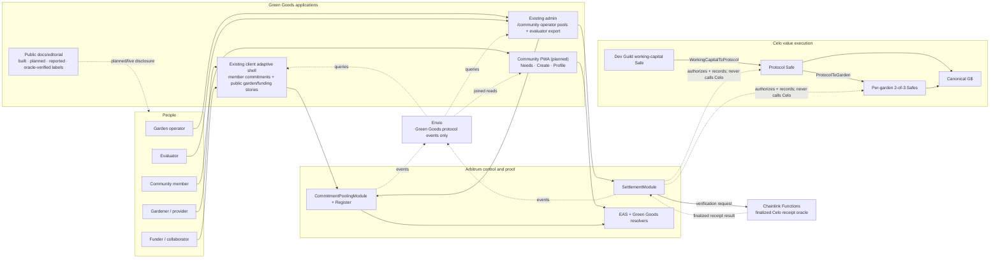

Notes:

- House of Alignment funds the Dev Guild working-capital wallet upstream; Green Goods models only the two downstream routes shown.
- EAS and raw Celo transfers are outside Envio. The joined Community read is owned in shared/query composition, not fabricated in an Envio handler.
- A report stores a Celo transaction hash but is not proof. Only a matching Chainlink Functions callback can mark the Arbitrum record `Verified`.

## D1b. Contract/module topology and trust boundaries

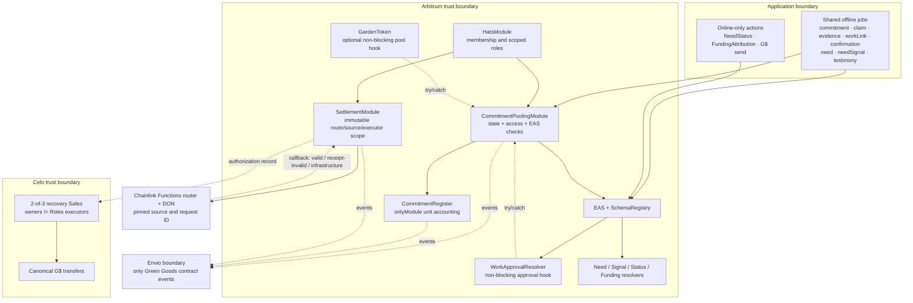

Trust rules: no provider may confirm their own delivery, including steward fallback; no recovery owner may be a Safe executor; no human can verify a receipt; no handler infers an actor from `transaction.from`; no contract enumerates all cycles or claims to make a transition.

## D2. Offer/request → work → approval → confirmation → fulfillment

Preconditions: pool `Open`; an optional cycle exists, belongs to the pool, and is `Open`. For an Offer, the creator is provider and accepted recipient confirms. For a Request, the accepted claimant is provider and the creator confirms. The stored `providerGarden` controls DomainImpact Work and assessment validation even when the commitment remains in the root protocol pool. Provider self-confirmation fails on every path.

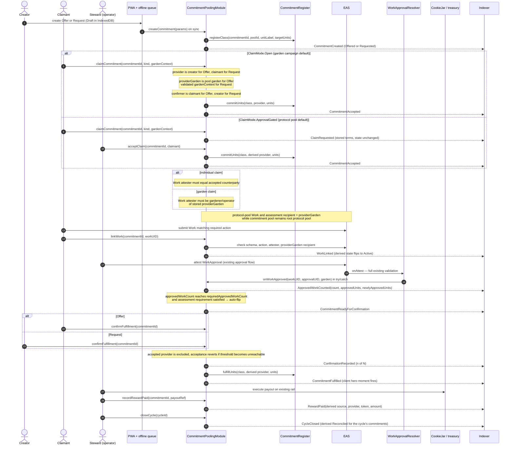

Recovery: approvals that land before `linkWork` are recovered by bounded steward call `syncApprovedWork(commitmentId, approvalUIDs)`; each UID is EAS-verified and deduped through `approvalCounted`. Steward fallback still rejects the provider and records a reason.

## D3. Analog capture + lightweight evidence (review-is-confirmation)

The SupportService / OperatorCaptured path: no Work/WorkApproval rails, `requiredApprovedWorkCount == 0`, counterparty confirmation IS the review (decision #20). The member stays the named promise source; the operator is metadata (`recordedBy`).

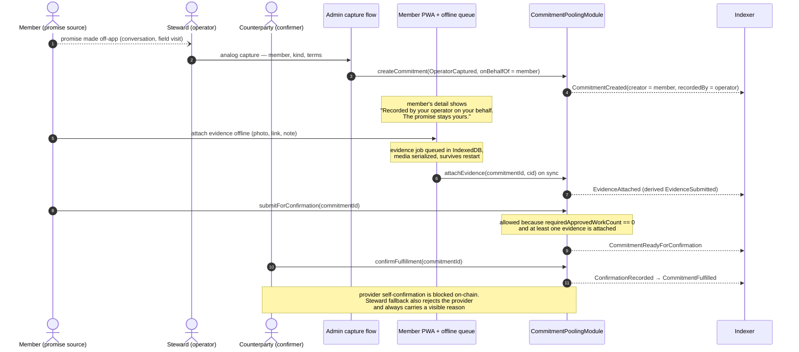

## D4. Pool state machine

Every pool transition is on-chain (rare operator console actions). One pool per garden, idempotent registration; the protocol pool is the root garden's pool (tokenId 1).

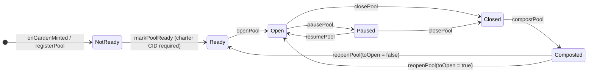

Pool-level `Paused` blocks new commitments, claims, and confirmations on that pool only; module-wide `setPaused` blocks operational mutations but keeps owner configuration, unpause, `cancelCommitment`, `expireCommitment`, and `resolveDispute` available for safe wind-down.

## D5. Cycle state machine (types: Season, Campaign)

On-chain enum stores `Seeded / Open / Reconciled / Composted / Cancelled`. `Draft` is app-only; `InProgress` and `Reviewing` are derived overlays of on-chain `Open`.

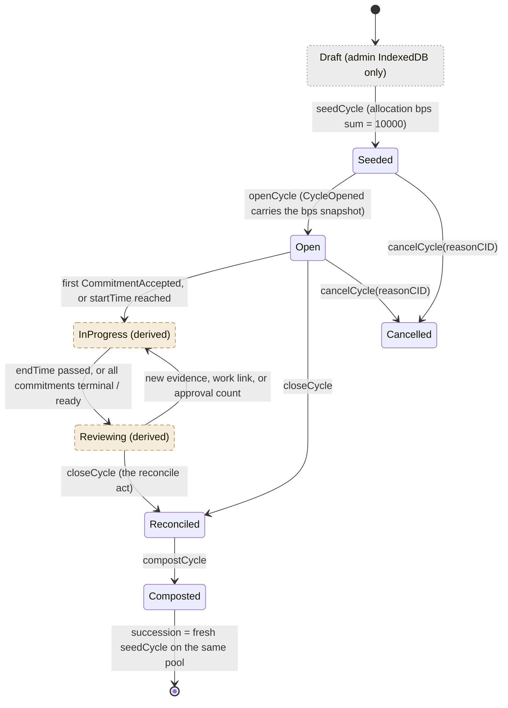

`InProgress` is on-chain `Open`, so `cancelCycle` covers it; Draft cancels are an off-chain discard. Succession is derived by pool ordering — no on-chain predecessor pointer. Opening validates cycle existence, pool ownership, and `Seeded` state. `Pool.openSeasonCycleId` permits exactly one open Season in O(1); any number of Campaigns may be open concurrently and no transition enumerates cycles.

## D6. Commitment state machine

On-chain enum stores `Offered / Requested / Accepted / ReadyForConfirmation / Fulfilled / Cancelled / Expired / Disputed`. `Draft` is app-only; `Active`, `EvidenceSubmitted`, `PartiallyApproved`, and `Reconciled` are derived. While the derived overlays are showing, the on-chain state remains `Accepted` — so the cancel/expire/dispute transitions drawn from `Accepted` apply to all three overlays.

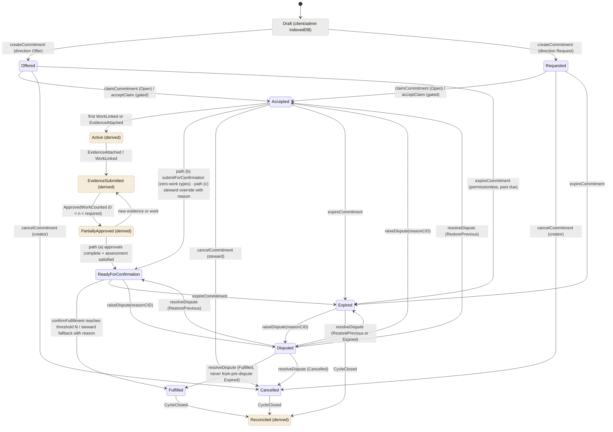

The module stores `preDisputeState` before entering `Disputed`; `RestorePrevious` restores that exact state. There is no `Reconciled` dispute resolution. Unit accounting is exact:

- create registers the class but commits no units;
- cancellation or expiry from `Offered`/`Requested` releases nothing;
- acceptance commits units once;
- cancellation or expiry from `Accepted`/`ReadyForConfirmation` releases those committed units once;
- fulfillment converts committed units with `fulfillUnits`;
- raising or restoring a dispute has no unit effect;
- resolving to `Fulfilled`, `Cancelled`, or `Expired` applies the same conversion/release only when units are still committed; a pre-dispute `Expired` record cannot become `Fulfilled` and never releases twice.

Cycle-less commitments (`cycleId == 0`) derive `Reconciled` from `PoolClosed`; cycle-scoped terminal commitments derive it from `CycleClosed`.

## D7. Indexer entity delta (ERD)

Five NET-NEW pooling entities, all derived exclusively from module + register events (`chainId-identifier` composite IDs). `GARDEN` is the existing entity; settlement entities are shown separately in `settlement-spec.md` §6. The docs-site ERD gains this delta at ship via PRD-680.

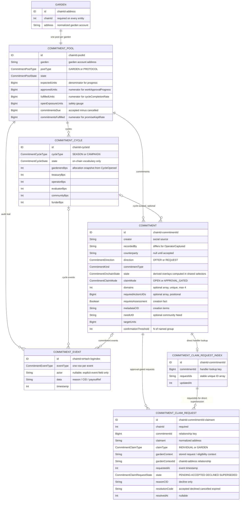

On acceptance, the handler loads `COMMITMENT_CLAIM_REQUEST_INDEX` by `chainId-commitmentId`, marks the accepted request `ACCEPTED`, and marks every other still-pending indexed request `SUPERSEDED`. Pre-acceptance commitment cancellation or expiry uses the same indexed IDs to supersede every pending row with its resolution code. Decline updates only the named request. No handler performs a database-wide scan, and no audit-event actor is inferred from `transaction.from`. `Garden.id` migration requires a full replay/backfill and shared-query cutover; every relationship uses `chainId-*` IDs.

Full field lists: contract-spec §8.2. The four locked aggregates stay numerator/denominator pairs (integer math; division happens in shared selectors, never stored): `workApprovalProgress`, `promiseKeptRate`, `cycleCompletionRate`, `openExposureUnits`.

## D7b. Settlement ERD

Every batch is an immutable attempt with 1–24 persisted member IDs. Receipt-invalid batches remain immutable; recovery happens per member and clears the member's old `batchId`. A verification request is replay protection, not a new disbursement state.

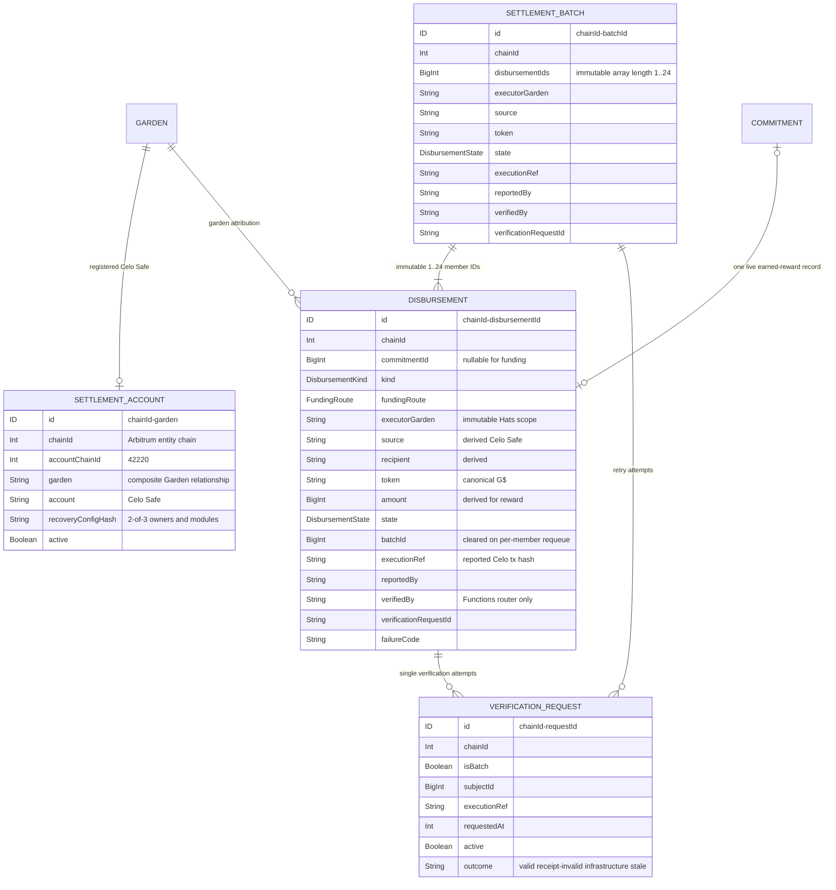

---

## D8. G$ funding topology, Safe recovery, and oracle boundary

Split-state settlement per `settlement-spec.md`: authorization on Arbitrum (garden-account-anchored, Hats-gated), execution on Celo from garden-attributed Safes with Zodiac-scoped signers. Canonical G$ never leaves Celo; no bridge carries value authority.

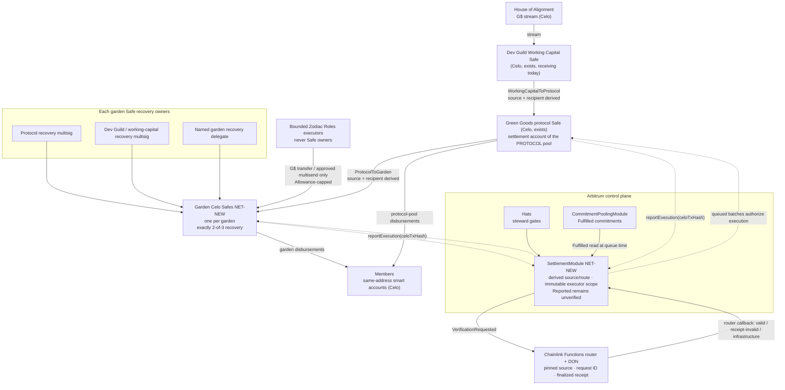

The owner set is exactly protocol recovery multisig, Dev Guild/working-capital recovery multisig, and one named garden recovery delegate, threshold 2. Deployment fails on duplicate/zero/unnamed owners or owner/executor overlap. The Chainlink callback verifies one finalized Celo receipt: chain 42220, successful status, exact Safe sender, canonical G$, expected recipients and amounts, and complete transfer-log coverage.

## D9. Settlement sequence with failure/retry

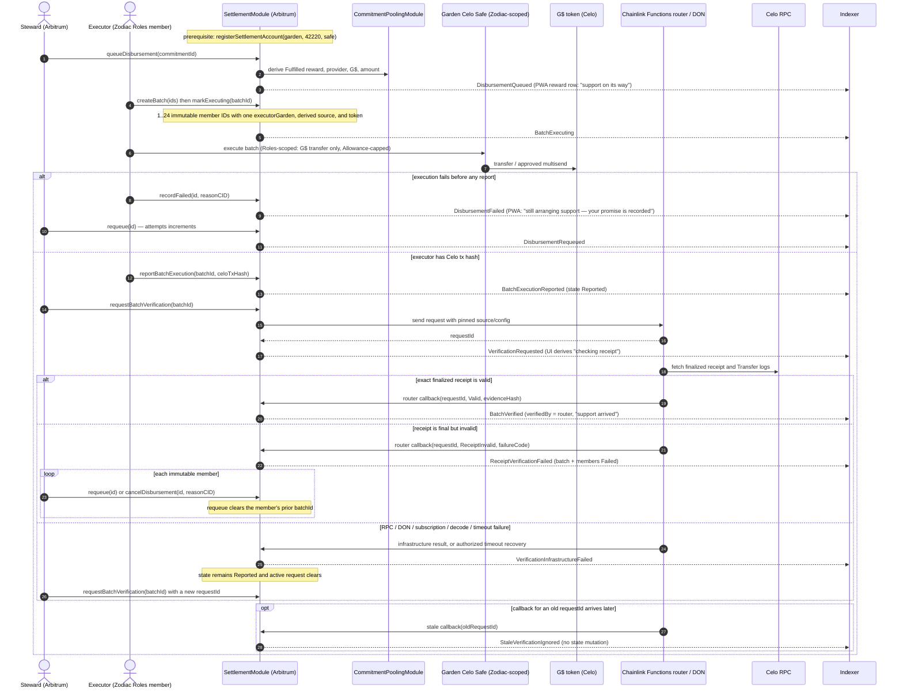

## D10. Disbursement state machine (all module-native, on-chain)

```mermaid
stateDiagram-v2
  direction LR
  [*] --> Queued : queueDisbursement / queueFunding(route, garden, amount)
  Queued --> Executing : markExecuting (executor)
  Executing --> Reported : reportExecution(executionRef)
  Reported --> Reported : requestVerification (derive checking receipt)
  Reported --> Verified : Functions callback Valid
  Reported --> Failed : Functions callback ReceiptInvalid
  Reported --> Reported : infrastructure error / timeout / stale callback
  Executing --> Failed : recordFailed(reasonCID)
  Failed --> Queued : per-member requeue (clear old batchId; attempts++)
  Queued --> Cancelled : cancelDisbursement(reasonCID)
  Failed --> Cancelled : cancelDisbursement(reasonCID)
  Verified --> [*]
  Cancelled --> [*] : frees the commitment for a fresh queue
```

A failed Celo leg never touches commitment state — `Fulfilled` on the pooling module is permanent; only the disbursement record cycles. “Checking receipt” is derived from an active verification request while the stored state remains `Reported`. Only the configured Functions router can produce `Verified` or receipt-invalid `Failed`; no human fallback exists. Reward-status precedence for UI: settlement-module record when a disbursement exists, else pooling-module `rewardPaid` (settlement-spec §3.3).

## D11. Approval-gated claim request, decline, acceptance, and supersession

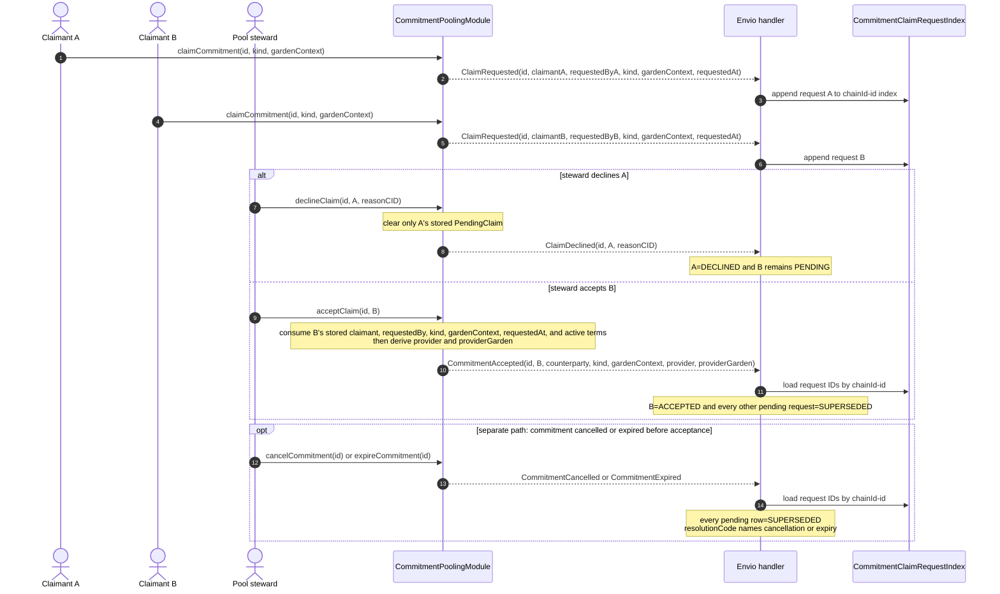

There is no numeric sentinel or database-wide query. A later request after a decline is a fresh active request with a new timestamp; acceptance is deterministic because it cannot substitute caller-provided terms. Superseded copy distinguishes another accepted provider from commitment cancellation/expiry through `resolutionCode`.

## D12. Working-capital and protocol-to-garden funding routes

House of Alignment → working capital is reported upstream and is not fabricated as a Green Goods module action.

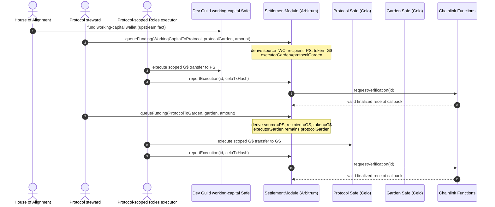

If the Celo AA/paymaster spike fails, these two Safe-to-Safe routes remain available while `memberDeliveryEnabled` stays false. There is no garden-custody member-claim fallback.

## D13. Permission and responsibility map

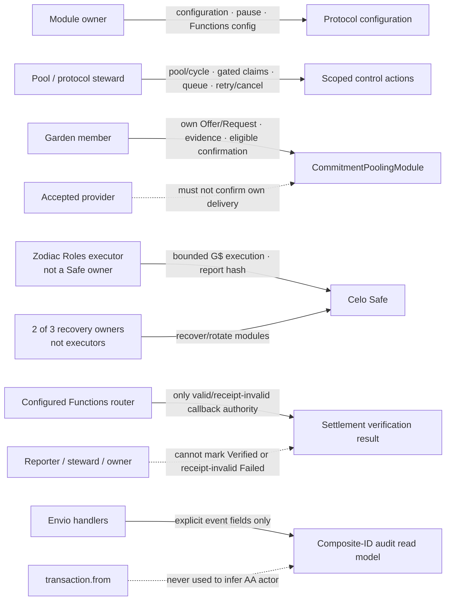

---

## Appendix: Edits to EXISTING docs diagrams at ship (PRD-680 scope)

Not performed now — the docs site describes what is live. Flagged on the Linear issue so they ship with the release:

1. **`docs/docs/builders/architecture/sequence-diagrams.mdx` § Work submission and approval**: after WorkApprovalResolver validation, add the optional bridge step — `WorkApprovalResolver → CommitmentPoolingModule.onWorkApproved (try/catch, non-blocking)` with a one-line note that approvals count toward pre-linked commitments only.
2. **`docs/docs/builders/architecture/sequence-diagrams.mdx` § Assessment flow**: add the v3 authorship split — baseline by evaluator OR operator; delta/re-assessment and technical by Evaluator Hat only; community testimony (Community Hat) as its own thin sequence.
3. **`docs/docs/builders/architecture/erd.mdx`**: append the D7 entity delta and the two new contract blocks to the contract-to-indexer event mapping.
