# Commitment Pooling: Diagrams

**Feature Slug**: `commitment-pooling`
**Stage**: `active`
**Created**: 2026-07-04
**Companions**: `contract-spec.md` (source of truth for every contract name, function, event, and state), `settlement-spec.md` (SettlementModule + Celo Safe topology, D18–D23), `uiux-spec.md` (surface flows), `wireframes.md` (screens). These diagrams are execution reference for implementers and reviewers; they introduce nothing the specs do not already define.

**Docs-site promotion**: these diagrams live here until the August release ships. Promotion into `docs/docs/builders/architecture/` (sequence-diagrams, ERD, plus a commitment journey doc) rides [PRD-727](https://linear.app/greenpill-dev-guild/issue/PRD-727) (historical label PRD-680); see §8 for the two *edits* to existing docs diagrams that ship at the same time.

**Role vocabulary (decision 2026-07-18; gardener line added 2026-07-31)**: these diagrams say **Garden steward** (protocol pool: **Protocol steward**) for the pool-authority role — the holder of the garden's operator/owner Hats (`_requirePoolSteward`). The shipped app and community glossary still say "Operator"; the app-wide rename is a recorded follow-up, so treat steward = operator/owner Hats wherever the two vocabularies meet. The person who makes, delivers, or receives promises is a **Gardener** — the holder of the garden's gardener Hat (the membership predicate behind `isGardener`); "member of a garden" appears below only as that predicate, never as a persona name. **Community member** remains the distinct Community-PWA persona, and "batch entry" names a disbursement row inside an immutable settlement batch.

**Vocabulary source (updated 2026-08-02)**: commitment, confirmation-path, contributor-policy, payout-plan-status, and settlement transport labels below are drawn from the machine-readable ontology sidecar, `packages/shared/src/ontology/green-goods-ontology.json` (human-readable render: `docs/docs/reference/ontology.generated.mdx`), which became repo canon with the ontology foundation. Unimplemented Solidity/GraphQL vocabularies remain `status: "spec"` with `planned_anchor` guards, so their eventual symbols cannot land silently. Display copy may prettify, but every ontology-backed label must map 1:1 onto a canonical member. `bun run check:ontology` guards the code layers and does not parse Markdown or images, so this file is the manual leg of that contract.

**Reading path (2026-08-02 renumbering)**: read them in order. D-numbers now *are* the
reading order, moving from the whole system down to the code that deploys it:

1. **Overview** — D1–D4: who participates, where state and value live, who is accountable,
   and which role may do what.
2. **A promise in the field** — D5–D7: one promise end to end, analog and lightweight
   capture, and the offline job lifecycle behind both.
3. **States, claims, and exchange** — D8–D14: the pool, cycle, and commitment machines,
   how a claim is granted, the paired-start exchange branch, and the worked value split.
4. **Data and value rails** — D15–D24: the read model and indexer pipeline, then funding
   topology, settlement, and the Solidity surface underneath.
5. **Operate and deploy** — D25–D26: error recovery, then deployment last.
6. **Offer over time** — D27: durable Offer identity, ordinary instances, Story, and honest
   capacity reservation.
7. **Future full pool** — D28–D29: the three-identity compatibility boundary, then the gated path
   from fulfilled backing through one bounded pool to possible later federation.
8. **Pool credit** — D30: the records-only loan lifecycle (CreditRegistry) over the same pools,
   and its one G$ settlement seam.
9. **Member-funded claims** — D31: the garden-Safe funding record from pledge through
   delivery or one mechanically eligible refund.

The un-numbered permission table after D26 is the exact authorization reference rather
than a narrative diagram.

#### Renumbering (2026-08-02)

Diagrams were renumbered so numeric order equals reading order, which also retired the
`b`/`c`/`d` suffixes. **Any citation dated before 2026-08-02 — in Linear, the canonical
Google Doc, or this hub's `reports/` — uses the old scheme and decodes here.** Published
gallery links keep working: every old section anchor is preserved as an alias on its new
section.

| Old | New | Old | New | Old | New |
|---|---|---|---|---|---|
| D1 | D1 | D7d | D17 | D13 | D4 |
| D1b | D2 | D8 | D18 | D13b | *(un-numbered permission table)* |
| D2 | D5 | D9 | D21 | D14 | D7 |
| D3 | D6 | D10 | D22 | D15 | D26 |
| D4 | D8 | D10b | D23 | D16 | D25 |
| D5 | D9 | D11 | D11 | D17 | D3 |
| D6 | D10 | D11b | D12 | D17b | D14 |
| D7 | D15 | D12 | D19 | D18 | D24 |
| D7b | D20 | D7c | D16 | D19 | D13 |

Sub-blocks moved with their parent: old `D2.0–D2.3` → `D5.0–D5.3`, `D6.0/D6a/D6b/D6c` →
`D10.0–D10.3`, `D7.0–D7.2` → `D15.0–D15.2`, `D9.0–D9.2` → `D21.0–D21.2`, `D16.0–D16.3` →
`D25.0–D25.3`, and `D17b.0/D17b.1` → `D14.0/D14.1`.

## Visual coverage matrix

This is the cross-hub inventory of 38 assets, not a table of contents for this file: 31 named D-diagram sections (**D1–D31**, one number per section since the 2026-08-02 renumbering) render as **44 Architecture Mermaid blocks** below (D23's mapping and D25's family/recovery ledger also use tables), plus the un-numbered permission table, which renders on the Reference tab. D3 makes the accountability/recognition/payment separation explicit; D14 traces the numbers, D24 maps the Solidity surface, D13 shows bilateral paired acceptance with the permanent no-coupling boundary, D28–D29 keep the current implementation adaptable without presenting future voucher behavior as built, and D31 closes the member-funded refund machine. **Every D-section has exactly one row.**

**Why sub-blocks are `####` and not `###`.** The heading level is load-bearing, not styling:

- `renderMd` turns every heading at level ≤ 3 into a gallery *section* and every `####` into a *sub-block* inside one — that is what gives D5/D10/D15/D21 their overview-plus-zoom shape and makes D25's views peers. Promoting sub-blocks to `###` would convert them into sections and dismantle the anchor and nav design.
- The gallery routes this preamble, the coverage matrix, the permission table, and the appendix to its Reference tab, so the Architecture pane asserts 32 sections (including its hand-written intro) and the 44-block Mermaid count above.
- markdownlint's MD001 flags the `##` → `####` jump in this source file, but the *rendered* gallery emits `<h3>` for a `##` section and `<h4>` for its sub-blocks — a correct single-step increment — so there is no heading-order defect in the artifact a reader or screen reader actually receives.
- The rows naming Community assets resolve to `.plans/active/community-interface/` (`diagrams.md`, `wireframes.md`, `journeys.md`), and rows 16–17 resolve to the two `wireframes.md` files.
- "Ready" means the implementation question is answered in the named repo-native artifact; it does **not** mean the feature is live. Every Mermaid block is parsed in the final validation pass, while text frames and permission tables are checked against their owning spec and route contract.

| # | Asset | Audience | Question answered | Source of truth | Current status | Correction needed | Validation method |
|---:|---|---|---|---|---|---|---|
| 1 | Unified system context | all lanes | Which users, apps, chains, read models, Safes, CCIP routes, and token participate? | CP `contract-spec.md` §4; `settlement-spec.md` §2–5; Community `spec.md` §3 | Ready: D1 | None; keep planned/live labels current | Mermaid parse + architecture cross-read |
| 2 | Module topology and trust boundaries | contracts, security, ops | Which component may queue, authorize, attest, index, execute, or verify? | CP `contract-spec.md` §4–7; `settlement-spec.md` §3–4 | Ready: D2 | None — split applied (CP jobs / EAS jobs / online actions / Celo transfer) with the upgraded AssessmentResolver, TestimonyResolver, and deployment timelock all drawn | Mermaid parse + interface/event cross-read |
| 3 | Capability responsibility summary | contracts, stewards, QA | Which capability groups belong to each role? | CP `contract-spec.md` §6.1; `settlement-spec.md` §3.1.3 | Ready: D4 | None — kept distinct from the exact action table by design (D4 orients, the permission table authorizes) | Matrix cross-read + Mermaid parse |
| 4 | Commitment-pooling ERD, including claim requests | indexer, shared, contracts | What is stored, how do composite IDs relate, where do count-safe/exact-label summaries live, and how are stored terms, direct lookup, decline, and supersession represented? | CP `contract-spec.md` §5.3, §8.2 | Ready: D15.0 entity map + D15.1/D15.2 field blocks | CPP-alignment + exchange wave 2026-08-01 (registers #71–#77): COMMITMENT gains counterCommitmentId + declaredUnitValue/declaredValueBasis; COMMITMENT_COUNTER_INDEX, COMMITMENT_EXCHANGE, and POOL_MEMBER_HISTORY join; P6 drops the redundant exchange-marker boolean | Mermaid parse + GraphQL field and handler cross-read |
| 5 | Settlement ERD | settlement, indexer, admin | How do accounts, immutable batches, batch entries, and command/acknowledgment messages relate? | `settlement-spec.md` §3, §6 | Ready: D20 | "Verification attempts" wording (Chainlink-Functions era) corrected 2026-07-27 — the transport re-freeze (Decision Log #46) retired that model; D20's drawn entities were already current | Mermaid parse + event/entity cross-read |
| 6 | Community EAS/Envio joined-read ERD | Community, indexer, evaluator | Which system owns Needs records versus protocol progress? | Community `spec.md` §4–7 | Ready: Community `diagrams.md` D3 | None | Mermaid parse + four-schema cross-read |
| 7 | Pool/cycle/commitment/NeedStatus/disbursement state machines | contracts, UI, QA | Which states are stored, derived, terminal, or recoverable? | both specs; `settlement-spec.md` §3.1.2 | Ready: D8–D10, D22; Community D4–D5 | None | Mermaid parse + transition-table cross-read |
| 8 | Offer/request → work → approval → confirmation → fulfillment | gardener, lead provider, implementers | How do direction, provider garden, Work, and confirmer defaults interact? | CP `contract-spec.md` §5.3, §6.1 | Ready: D5.0 overview + D5.1/D5.2/D5.3 acts | Split 2026-07-25 on the same act boundaries as D10; ApprovalGated is D11's subject and is no longer duplicated here | Mermaid parse + happy-path acceptance |
| 9 | Analog capture + lightweight evidence | gardener, steward, QA | How is an off-app promise recorded without moving authorship, and when is the counterparty's confirmation the review? | CP `contract-spec.md` §5.3, §6.1; `uiux-spec.md` §6.5 | Ready: D6 | None; previously absent from this matrix | Mermaid parse + review-is-confirmation acceptance |
| 10 | Approval-gated request/accept/decline/supersede | steward, contracts, indexer | Which stored terms are consumed, how is one accountable lead chosen, and how do the other would-be lead requests end explicitly? | CP `contract-spec.md` §5.3, §6.1, §8.2 | Ready: D11 | Lead selection is separate from team formation through the accepted commitment's roster policy | Mermaid parse + named claim tests |
| 11 | Protocol-to-garden funding route (HoA stream upstream) | settlement, treasury, ops | What does Green Goods authorize, and what remains upstream? | `settlement-spec.md` §2–3 | Ready: D19 | None | Mermaid parse + derived-route tests |
| 12 | CCIP command/ack settlement | settlement, admin, QA | How do command retry, idempotent Celo execution, and acknowledgment retry converge? | `settlement-spec.md` §3.1.3 | Ready: D21.0/D21.1/D21.2 + D22 | Split 2026-07-25 into healthy path, idempotency, and the three retry lifecycles | Mermaid parse + command/ack acceptance |
| 13 | G$ funding topology, Safe recovery, and CCIP boundary | settlement, security, treasury | Where does canonical G$ live, who may recover a garden Safe, and what actually crosses the chain boundary? | `settlement-spec.md` §2–4 | Ready: D18 | None; previously absent from this matrix | Mermaid parse + Safe/Roles and peer cross-read |
| 14 | Need → operator triage → commitment seed | community, steward | How does community intent become protocol work without changing authorship? | Community `spec.md` §6, §8 | Ready: Community D9 | None | Mermaid parse + route/spec cross-read |
| 15 | Community offline/waiting-for-membership | community, shared, research | How does the September Community queue specialize the shared substrate? | Community `spec.md` §8 | Ready: Community D8 | Companion detail; CP core is D7 | Mermaid parse + offline acceptance |
| 16 | Cross-surface flow map | product, frontend | What stays in Community, admin `/community`, and existing public client surfaces? | Community `spec.md` §3; CP `uiux-spec.md` | Ready: `wireframes.md` §1 | None | Mermaid parse + monorepo/route cross-read |
| 17 | Low-fidelity frames | gardener, community, steward, evaluator, funder | Are entry, state, failure, and recovery screens defined without decorative polish? | both UI specs | Ready: both `wireframes.md` files | None | frame inventory + accessibility review |
| 18 | Persona journeys | research, product, QA | Can every named role reach completion and recovery? | Community `journeys.md` | Ready | None | persona/role checklist |
| 19 | Customer/community journey | research, operators | What happens from discovery through withdrawal or verified outcome? | Community `journeys.md` | Ready | None | stage/recovery checklist |
| 20 | Operator service blueprint | operations, research | Which frontstage, backstage, support, and failure-recovery steps must connect? | Community `journeys.md` | Ready | None | Mermaid parse + handoff cross-read |
| 21 | Research/onboarding/review/rehearsal timeline | research, delivery leads | Who must decide what, by when, before implementation and gathering rehearsal? | Community `research-plan.md`; `journeys.md` | Ready: Community `journeys.md` timeline | None | Mermaid parse + owner/date review |
| 22 | Exact sensitive-action permissions | contracts, settlement, security, QA | Which named function can each actor call, with which gates? | CP `contract-spec.md` §6.1; `settlement-spec.md` §3.1.3 | Ready: permission table (Reference tab) | Generated by cross-reading both canonical tables; the settlement-account registration, recovery-update, member-delivery, dispatcher, fee-floor, Celo fee, and both resolver-config rows were added 2026-07-25 | Function-by-function table diff |
| 23 | Hypercert cut-over and indexer delta | indexer, shared, admin | How do fulfilled commitments replace Work as the bundle without migrating legacy certificates? | CP `contract-spec.md` §9 | Ready: D16 | None — legacy and commitment bundles drawn as separate built/planned lanes | Mermaid parse + metadata/schema cross-read |
| 24 | Commitment offline job lifecycle | shared, client, QA | Which six CP jobs queue, wait for membership without retry use, retry, exhaust, or discard? | CP `uiux-spec.md` §5.11 | Ready: D7 | Self-contained CP view; Community D8 remains companion | Mermaid parse + queue acceptance |
| 25 | Indexer pipeline and Garden identity compatibility | indexer, shared | How does an event become an entity while the documented bare-address `Garden.id` exception remains stable? | CP `contract-spec.md` §8.3 | Ready: D17 | Added 2026-07-25; corrected 2026-08-02 to remove the conflicting Garden primary-key migration and add the lifecycle projection helper | Mermaid parse + handler/replay cross-read |
| 26 | Settlement status derivation (5 stored, 9 rendered) | gardener, client, QA | Which internal statuses are stored or derived, and how do they collapse to the three truthful gardener phrases? | `settlement-spec.md` §3.1.2; CP `uiux-spec.md` §5.9 and Appendix E.3 | Ready: D23 | Internal derivation remains exact; gardener copy exposes “support on its way,” “support arrived,” or authenticated-failure “support is being rearranged,” plus calm action explanation | Mermaid parse + W2 state cross-read |
| 27 | Claim-request state machine | contracts, indexer, client | What are the four request states and which resolution code ends each one? | CP `contract-spec.md` §5.3, §8.2 | Ready: D12 | Added 2026-07-25; D11 is a sequence, not a machine | Mermaid parse + resolutionCode cross-read |
| 28 | Deployment and upgrade topology | contracts, release ops, security | In what order do the eleven release stages run, where does the ceremony stop (paused, deployer-owned), and which operations are deferred, contested, or rollback-able? | CP `contract-spec.md` §7.3–7.4; `config/commitment-pooling-release.json`; `script/release-operator.ts` | Ready: D26 | Redrawn 2026-08-11 to the shipped release ladder: PR-chain framing replaced by the 8 operator commands + 3 deferred operations, fork-rehearsal gate, credit-registry stage, indexer handoff-only cut-in, and the explicitly contested backfill ordering | Mermaid parse + release-manifest/operator-command cross-read |
| 29 | Error taxonomy and recovery map | client, admin, QA | Where does each error family surface, who acts, and what named recovery may that surface offer? | CP `contract-spec.md` §5.5, §6.2; `settlement-spec.md` §3.1.2 | Ready: D25.0 creation/lifecycle + D25.1 settlement/offline + D25.2 recovery + D25.3 exhaustive ledger | Reworked 2026-08-01; all 161 unique Solidity error names map to exactly one family | Mermaid parse + selector-ledger script + recovery-table cross-read |
| 30 | Accountability, recognition, and payment separation | contributors, stewards, settlement, QA | Who leads, who contributed, how certificate shares are computed, and how funding may diverge without rewriting recognition? | CP `contract-spec.md` §6/§9; `settlement-spec.md` §3; `uiux-spec.md` Appendix C | Ready: D3 | Added 2026-07-28 for the group-commitment amendment | Mermaid parse + roster/recognition/payout acceptance |
| 31 | Value and recognition flow, worked Model 1 | contributors, stewards, funders, QA | How much goes where — the six-role split, the 20/80 passes, retention, and child payouts, traced with concrete numbers? | CP `contract-spec.md` §9.3–9.4; `settlement-spec.md` §3 | Ready: D14.0 + D14.1 | Added 2026-07-31 (round-2 feedback: the quantitative view was missing) | Mermaid parse + §9.3/§9.4 arithmetic cross-check |
| 32 | Solidity surface — contracts, ownership, upgrade authority | contracts, security, release ops | Which contracts exist, who owns and upgrades each, and which authority edges connect them? | CP `contract-spec.md` §4/§7; `settlement-spec.md` §3; community-interface `spec.md` | Ready: D24 | Added 2026-07-31 (round-2 feedback: missing diagram type) | Mermaid parse + interface/ownership cross-read |
| 33 | Bilateral exchange sequence | creators, contracts, indexer, client, QA | How does a one-way reference become one atomic paired start while all later promise lifecycles remain independent? | CP `contract-spec.md` decision 18 and §6.1; `uiux-spec.md` Appendix E.1 | Ready: D13 | Added 2026-08-01; multilateral and transferable execution remain reserved | Mermaid parse + exchange acceptance matrix |
| 34 | Offer layers and honest capacity | client, contracts, indexer, QA | Which of saved offer details, the ongoing Offer (CommitmentSeries), an available place, and the Story owns each fact, and when is provider capacity actually reserved? | `standing-commitments-spec.md` §2–§5; `uiux-spec.md` Appendix F; `acceptance-matrix.md` §2.2 | Ready: D27 | Added 2026-08-02 with the series amendment; succession verbs beyond rest/resume/retire remain follow-on | Mermaid parse + acceptance §2.2 cross-read |
| 35 | Full-pool identity compatibility | contracts, indexer, product, security | How do promise instance, ongoing Offer, and future voucher class relate without collapsing or moving promise authority? | `contract-spec.md` §6.2; `standing-commitments-spec.md` §8.1; `exchange-architecture-brief.md` §0–2 | Ready: D28 | Added 2026-08-03; no initial ABI/storage or registry transfer surface | Mermaid parse + identity-boundary cross-read |
| 36 | Staged full-pool path | product, research, contracts, settlement, ops | What must be proven before fulfilled backing, one-pool exchange/redemption, capacity backing, or federation may advance? | `exchange-architecture-brief.md` §11–12; `pilot-evidence-spec.md` §3/§10.3; `architecture-closure-matrices.md` compatibility gate | Ready: D29 | Added 2026-08-03; G$ support stays separate from voucher redemption and no stage authorizes the next | Mermaid parse + stage/evidence cross-read |
| 37 | Loan state machine (records-only pool credit) | contracts, indexer, admin, QA | Which loan states are stored, which function and event move each transition, and how does the G$ leg bind to exactly one Confirmed LoanPrincipal settlement child without the registry ever holding value? | commitment-credit follow-on `spec.md` §3–§5; `ICreditRegistry.sol`; `registries/Credit.sol` | Ready: D30 | Added 2026-08-11 with the credit-lane integration pass | Mermaid parse + Credit.sol transition/guard cross-read |
| 38 | Member-funded claim and refund state machine | gardeners, stewards, contracts, settlement, QA | How does a priced Offer move from a member pledge and recorded garden-Safe deposit to delivery or one mechanically eligible refund? | `member-funded-claims-brief.md`; `settlement-spec.md` §3/§6; `acceptance-matrix.md` §2.3 | Ready: D31 | Added 2026-08-11 for the reopened current-release increment | Mermaid parse + funding interface/state/acceptance cross-read |

**Keep subgraph titles short.** Mermaid wraps a cluster title at a fixed width (~200 px) but reserves height for a single line, so a longer title's second line renders *on top of* the nodes inside its own cluster. D1, D2, D23, and D25.0 each shipped that way once. Keep every `subgraph … ["…"]` label to roughly **22 characters** and let the reading guide carry the qualifier — that is why the boundary clusters in D2 read "Application boundary" rather than "Application boundary — queues intent, authorizes nothing". The gallery's render audit checks every cluster label against every node box and is the gate for this.

**Visual status contract**: three treatments, and only three.

| Treatment | Stroke + fill | Means |
|---|---|---|
| **Built/live** | solid green stroke, green-tint fill (`#50784a` / `#edf3e8`) | ships today, in production |
| **Planned/gated** | dashed stone stroke, paper fill (`#6e6857` dashed `6 4` / `#fbf8f2`) | does not exist yet, or is gated |
| **Existing surface, planned delta** | solid green stroke, paper fill (`#50784a` / `#fbf8f2`) | the component is live today and this work adds a planned capability to it — the client PWA, editorial website, Admin, and the Envio read model are all in this class |

The third treatment is why the Architecture tab and the story assets agree: the story assets label *actions* Built or Planned, and a live surface carrying a planned action is exactly this class. Dashes never mean read, boundary, derived, or app-only. Relationship meaning is written on the arrow. One palette per semantic, everywhere — a fill never means two different things in two diagrams.

**State provenance is not decoration.** The sidecar's `state_machines` section flags every state `on-chain`, `derived`, or `off-chain`, and the state machines below must render that distinction so a derived state never reads as a chain write:

| Sidecar `storage` | Treatment | Means |
|---|---|---|
| `on-chain` | paper fill, solid stone outline, no class | the module stores it; a transaction moved it here |
| `derived` | amber (`#b98a3e` / `#f6ecdc`), `class … derived` | the indexer computes it from events — **no transaction writes this state** |
| `off-chain` | grey (`#8a8a8a` / `#ececec`), `class … appOnly` | app-side only; `Draft` lives in IndexedDB and has no chain presence at all |

Derived across the spec machines: `Active`, `EvidenceSubmitted`, `PartiallyApproved`, `Reconciled` (commitment) and `InProgress`, `Reviewing` (cycle). Off-chain: `Draft` (commitment and cycle).

**One name, two storages — do not "fix" this.** `Reconciled` is **derived** in the commitment machine (D10.3 computes it from `CycleClosed`) but **on-chain** in the cycle machine (D9, where `closeCycle` is the reconcile act that writes it). The two diagrams therefore style the same word differently, and both are correct.

**Label glossary**: one name per thing, across every diagram below. Where two labels used to compete, the left column is now the only one used.

| Canonical label | Node/participant id | Not | Note |
|---|---|---|---|
| Envio read model | `ENV` / `IDX` | ~~Indexer~~, ~~Envio handler~~, ~~Envio boundary~~ | one component; "indexing boundary" is a role of it, not a second name |
| CommitmentPoolingModule | `CPM` (`M` in sequences) | ~~CPM2~~, ~~MOD~~ | D1 draws module + register fused as `MOD` **only** in the system-context view, and says so |
| CommitmentRegistry | `REG` (`R` in sequences) | — | counts units for the module only |
| CeloSettlementExecutor | `CE` | ~~EXEC~~, ~~EX~~ | one subtitle style: what it may do, then what it may never be |
| Green Goods protocol Safe | `PS` | ~~GG~~ | `GG` collided with "Green Goods" everywhere else |
| Garden Celo Safe | `GS` | — | per garden, 2-of-3 recovery |
| Chainlink CCIP | `CCIP` | — | payload is always **data-only**, never "message-only" |
| Deployment timelock | `TL` | — | ops-policy ownership target for the four settlement setters; owner-direct + paused-only in code, waived this release (`timelockWaivedForRelease`) |

**Two vocabularies share one Solidity identifier — never collapse them.** `PoolType` names two different things and the sidecar keeps them as separate vocabularies on purpose:

| Vocabulary | Members | What it is |
|---|---|---|
| `commitment-pool-type` *(spec)* | `Garden`, `Protocol` | the commitment-pooling pool anchor kind — the only one these diagrams draw |
| `signal-pool-type` *(live)* | `ActionSignal`, `HypercertSignal` | the **Gardens V2 conviction signal pool** attached to a garden — out of scope here |

Write `CommitmentPoolType` in full wherever the type is named (D15.1 does). A bare "PoolType" is ambiguous, and labelling a Gardens V2 signal pool with the commitment members — or the reverse — is a vocabulary error, not a shorthand.

**Entity definitions come from the sidecar, not from these diagrams.** Two matter most for the flows drawn here. **Work** is one documented instance of an Action performed by a gardener — media, notes, and metadata *submitted as an EAS Work attestation for operator review*; approval records a **separate Work Approval attestation** (which is why D5.2 draws the submission and the approval as two distinct EAS interactions, not one round trip). **Assessment** is an *up-front* baseline and strategy — domain, diagnosis, SMART outcome targets, selected Actions, reporting period — authored before work begins and mirrored to a Karma GAP milestone **only when that module is active**; it is explicitly *not* a review of submitted Work. A commitment is deliberately **not** an EAS attestation: it is a module-native record.

**MDR is ambiguous and unused here.** In client surfaces MDR means the **Media–Details–Review** capture wizard; in evaluation contexts it means the **Monitoring–Data–Reporting** pipeline (v1-0 §16.1 disambiguates the two). No diagram or asset in this hub uses the abbreviation, and none should — spell whichever one is meant.

**Steward names are deliberately distinct, not drift.** They are different *resolutions* of the same Hats-based authority, and the permission table is the exact gate for each: **commitment-pool steward** (the resolved authority of the commitment's pool), **protocol steward** (the root/protocol pool's steward specifically — the only one who may `queueFunding`), **settlement steward** (the resolved steward for a settlement subject), and **batch steward** (the resolved steward for an immutable batch's executor garden). Where a diagram says only "steward", the resolution is whichever of these the function's the permission table row names. `operatorBps` keeps its GraphQL field name because that is canonical in `contract-spec.md` §8.2; its label reads "steward share" everywhere it is drawn.

---

## D1. Unified system context

**How to read this**: top to bottom — people use surfaces; surfaces write into the Arbitrum protocol layer; Envio turns explicit Green Goods protocol events into the read model every surface queries; value moves only on Celo. CCIP carries data-only commands and acknowledgments, never G$. Node outlines encode built/live versus planned/gated status; arrow labels state whether an edge is a write, read, event, protocol message, or value movement. Five surfaces: the client is ONE codebase with two presentations — the **installed PWA** (gardener commitments, work, wallet) and the **editorial website** — the **Admin** cockpit is where stewards and evaluators operate (pool + cycle control, claims queue, settlement dispatch and recovery controls; it authorizes and queues but never moves value itself), the docs site is a separate Docusaurus app, and the planned Community PWA is a third, independent app.

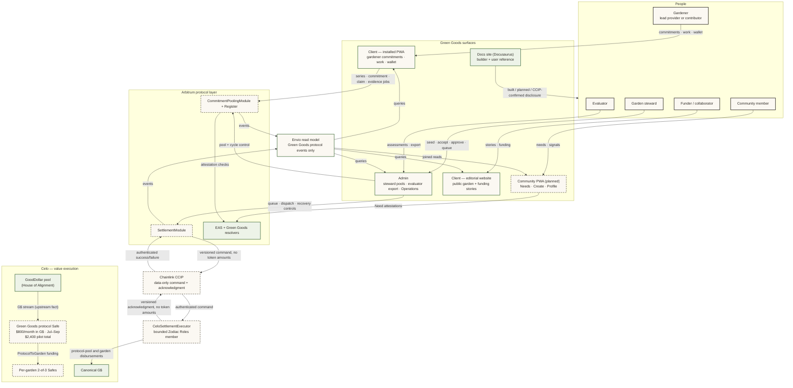
```mermaid
flowchart TB
  subgraph people["People"]
    MEM["Community member"]
    PROV["Gardener<br/>lead provider or contributor"]
    STW["Garden steward"]
    EVA["Evaluator"]
    FUND["Funder / collaborator"]
  end
  subgraph surfaces["Green Goods surfaces"]
    COM["Community PWA (planned)<br/>Needs · Create · Profile"]
    PWA["Client — installed PWA<br/>gardener commitments · work · wallet"]
    WEB["Client — editorial website<br/>public garden + funding stories"]
    ADMIN["Admin<br/>steward pools · evaluator export · Operations"]
    DOCS["Docs site (Docusaurus)<br/>builder + user reference"]
  end
  subgraph arb["Arbitrum protocol layer"]
    MOD["CommitmentPoolingModule + Register"]
    SET["SettlementModule"]
    EAS["EAS + Green Goods resolvers"]
  end
  ENV["Envio read model<br/>Green Goods protocol events only"]
  subgraph celo["Celo — value execution"]
    HOA["GoodDollar pool<br/>(House of Alignment)"]
    PS["Green Goods protocol Safe<br/>$800/month in G$ · Jul–Sep<br/>$2,400 pilot total"]
    GS["Per-garden 2-of-3 Safes"]
    GD["Canonical G$"]
  end
  CE["CeloSettlementExecutor<br/>bounded Zodiac Roles member"]
  CCIP["Chainlink CCIP<br/>data-only command + acknowledgment"]

  MEM -->|"needs · signals"| COM
  PROV -->|"commitments · work · wallet"| PWA
  STW -->|"seed · accept · approve · queue"| ADMIN
  EVA -->|"assessments · export"| ADMIN
  FUND -->|"stories · funding"| WEB
  COM -->|"Need attestations"| EAS
  PWA -->|"series · commitment · claim · evidence jobs"| MOD
  ADMIN -->|"pool + cycle control"| MOD
  ADMIN -->|"queue · dispatch · recovery controls"| SET
  MOD -->|"attestation checks"| EAS
  MOD -->|"events"| ENV
  SET -->|"events"| ENV
  ENV -->|"joined reads"| COM
  ENV -->|"queries"| PWA
  ENV -->|"queries"| WEB
  ENV -->|"queries"| ADMIN
  HOA -->|"G$ stream (upstream fact)"| PS
  PS -->|"ProtocolToGarden funding"| GS
  CE -->|"protocol-pool and garden disbursements"| GD
  SET -->|"versioned command, no token amounts"| CCIP
  CCIP -->|"authenticated command"| CE
  CE -->|"versioned acknowledgment, no token amounts"| CCIP
  CCIP -->|"authenticated success/failure"| SET
  DOCS -->|"built / planned / CCIP-confirmed disclosure"| people

  classDef built fill:#edf3e8,stroke:#50784a,stroke-width:2px,color:#2a2722
  classDef planned fill:#fbf8f2,stroke:#6e6857,stroke-width:2px,stroke-dasharray:6 4,color:#2a2722
  classDef existingPlannedDelta fill:#fbf8f2,stroke:#50784a,stroke-width:2px,color:#2a2722
  classDef person fill:#fbf8f2,stroke:#2a2722,stroke-width:2px,color:#2a2722
  class DOCS,EAS,HOA,GD built
  class COM,MOD,SET,GS,CE,CCIP,PS planned
  class PWA,WEB,ADMIN,ENV existingPlannedDelta
  class MEM,PROV,STW,EVA,FUND person
```

Notes:

- The installed PWA and the editorial website are the same client app in two presentation modes (`getClientPresentationMode`); the docs site is separate. Every surface carries built / planned / queued / dispatched / confirming / confirmed status labels so a reader never mistakes a plan for a live feature.
- The Good Labs Foundation-funded House of Alignment pilot provides Green Goods with **$800 per month, paid in G$, for July through September 2026 — $2,400 total**. It lands upstream in the designated Green Goods protocol Safe; Green Goods models only the ProtocolToGarden route onward (corrections-log §9). This funding schedule is distinct from both transaction-level token counts and any onward garden or gardener settlement evidence.
- The client PWA, editorial website, Admin, and the Envio read model carry the **existing surface, planned delta** treatment — they are live today, and this work adds planned pooling capability to each. That is why the story assets can label the same rails BUILT at the action level without contradicting this diagram.
- EAS and raw Celo transfers are outside Envio. The joined Community read is owned in shared/query composition, not fabricated in an Envio handler.
- Core pooling projections come from `CommitmentPoolingModule` and `CommitmentRegistry` events.
  Within the settlement rail, the indexer additionally records only `SettlementModule` and
  `CeloSettlementExecutor` protocol events; raw Celo transfers remain outside Envio. A Celo
  execution is visible before its acknowledgment, but only an authenticated success
  acknowledgment marks the Arbitrum attempt `Confirmed`.

## D2. Contract/module topology and trust boundaries

**How to read this**: four trust boundaries, one job each — the application boundary queues intent and authorizes nothing, the Arbitrum boundary owns source state, Envio restates explicit events from both Green Goods contracts, and the Celo executor moves value under a reviewed Safe + Zodiac scope, stores its idempotent outcome, then uses CCIP to acknowledge it. Both Work-rail resolvers are drawn: `WorkResolver` validates the Work attestation itself and `WorkApprovalResolver` validates each approval/rejection decision; the non-blocking `onWorkDecision` bridge from that resolver into the pooling module is **implemented in the repo but not yet live on-chain** — it ships in the same `pooling-integration-upgrades` release stage as the GardenToken hook — so the edge stays dashed until that upgrade is live. Community Needs uses four EAS schema records across two resolver proxies: `NeedsResolver` owns the role-gated Need/NeedSignal/NeedStatus branches, while the ungated `FundingAttributionResolver` keeps a separate blast wall.

```mermaid
flowchart TB
  subgraph APP["Application boundary"]
    CPJOBS["CP offline jobs (planned)<br/>commitmentSeries · commitment · claim<br/>evidence · workLink · confirmation"]
    EASJOBS["Community offline EAS jobs (planned)<br/>need · needSignal · testimony"]
    EASACTIONS["Online EAS actions (planned)<br/>NeedStatus · FundingAttribution"]
    TRANSFER["Online Celo wallet action (planned)<br/>canonical G$ send · never queued"]
  end
  subgraph ARB["Arbitrum trust boundary"]
    HATS["HatsModule<br/>membership and scoped roles"]
    GT["GardenToken<br/>live token · pool hook ships in the<br/>pooling-integration-upgrades stage"]
    CPM["CommitmentPoolingModule<br/>state + access + EAS checks"]
    REG["CommitmentRegistry<br/>onlyModule unit accounting"]
    SM["SettlementModule<br/>immutable route/source/executor scope<br/>funding deposits + refund obligations"]
    WR["WorkResolver<br/>validates the Work attestation"]
    WAR["WorkApprovalResolver<br/>live resolver · pooling bridge is<br/>a planned upgrade (register #5)"]
    EAS["EAS + SchemaRegistry"]
    NR["NeedsResolver (Sept)<br/>exact schema dispatch:<br/>Need · NeedSignal · NeedStatus"]
    FAR["FundingAttributionResolver (Sept)<br/>ungated receipt attribution<br/>separate chain-policy blast wall"]
    V3["AssessmentResolver (existing UUPS · v3 upgrade pending)<br/>v2 preserved · AssessmentV3 added by the<br/>rehearsed in-place upgrade, not yet live"]
    CTR["TestimonyResolver (planned)<br/>Community Hat only"]
    TL["Timelock ownership (ops policy)<br/>settlement setters are owner-direct in code ·<br/>waived for this release"]
    CRD["CreditRegistry<br/>records-only pool credit ledger"]
  end
  ENV["Envio read model — indexing boundary<br/>only Green Goods contract events"]
  subgraph CELO["Celo trust boundary"]
    SAFE["2-of-3 recovery Safes<br/>owners != Roles executors"]
    GD["Canonical G$ transfers"]
  end
  CCIP["Chainlink CCIP routers<br/>data-only command + acknowledgment"]
  CE["CeloSettlementExecutor<br/>immutable peer + bounded route"]

  CPJOBS -->|"module writes after on-chain revalidation"| CPM
  EASJOBS -->|"attestations after resolver checks"| EAS
  EASACTIONS -->|"online attestations"| EAS
  TRANSFER -->|"chain 42220 wallet transaction"| GD
  HATS --> CPM
  HATS --> SM
  GT -->|"try/catch"| CPM
  CPM --> REG
  CPM --> EAS
  EAS --> WR
  EAS --> WAR
  WAR -.->|"planned: onWorkDecision try/catch"| CPM
  EAS --> NR
  EAS --> FAR
  EAS --> V3
  EAS --> CTR
  CPM -->|"events"| ENV
  REG -->|"events"| ENV
  SM -->|"events"| ENV
  HATS --> CRD
  CRD -->|"pool + commitment reads"| CPM
  SM -->|"queueLoanPrincipal — Approved loans only"| CRD
  CRD -.->|"events — indexing planned"| ENV
  TL -.->|"ops-policy target: owner may later be a timelock"| SM
  SM -->|"versioned command; no token amounts"| CCIP
  CCIP --> CE
  CE -->|"typed canonical-G$ route only"| SAFE
  SAFE --> GD
  CE -->|"stored outcome + versioned acknowledgment"| CCIP
  CCIP --> SM

  classDef built fill:#edf3e8,stroke:#50784a,stroke-width:2px,color:#2a2722
  classDef planned fill:#fbf8f2,stroke:#6e6857,stroke-width:2px,stroke-dasharray:6 4,color:#2a2722
  classDef existingPlannedDelta fill:#fbf8f2,stroke:#50784a,stroke-width:2px,color:#2a2722
  class HATS,WR,EAS,GD built
  class CPJOBS,EASJOBS,EASACTIONS,TRANSFER,CPM,REG,SM,NR,FAR,CTR,SAFE,CCIP,CE,TL,CRD planned
  class V3,GT,WAR,ENV existingPlannedDelta
```

Boundary rules:

- **Application**: drafts and queued jobs are intent, never authority — every write is re-validated on-chain; nothing trusts a client claim.
- **Arbitrum**: HatsModule decides who may act; the pooling module owns state machines and EAS checks; the register counts units only for the module; the settlement module records value authorization, steward-confirmed member deposits, their consumption, and one persistent refund obligation, but never custodies or calls Celo. Funding-plan closure on an authenticated acknowledgment follows the local `consumedFundingOfCommitment` pointer and makes no Commitment Pooling read inside the fixed-gas receiver path. The existing Work rail is validated by two live resolvers — **WorkResolver** (the Work attestation: garden membership, registered active Action, enabled domain, required metadata) and **WorkApprovalResolver** (the separate approval/rejection decision attestation). The `onWorkDecision` try/catch bridge from that resolver into the pooling module is implemented in the repo — `WorkApproval.sol` carries the module reference, `setCommitmentModule`, and the try/catch call — but the **live proxy predates it**; the bridge activates with the `pooling-integration-upgrades` stage (register #5), so the edge stays dashed until that upgrade is live. The CreditRegistry records interest-free pool advances and repayments without holding or moving value; it reads Hats for membership/steward authority and the pooling module for pool and commitment facts, and the SettlementModule reads it when queueing a G$ loan-principal child. Community Needs keeps four schema-level payload/revocability records but routes them through **NeedsResolver** (Need, NeedSignal, NeedStatus; exact UID dispatch and role checks) and **FundingAttributionResolver** (ungated receipt attribution and chain policy). The funding resolver stays separate so a dispatch fall-through cannot cross the authorization boundary. Attestation authorship rules are not drawn here — the permission table carries them.
- **Timelock (ops policy, not a contract)**: the four settlement configuration setters — `setCcipRoute`, `setBatchSizeLimit`, `setDispatcher`, `setFeeReserveMinimum` — are `onlyOwner` and paused-only in code; no timelock contract exists in the repo. Post-activation governance may place a timelock *as* the module owner, and this release explicitly waives that step (`timelockWaivedForRelease: true` in the release manifest). Dependency wiring, `setPaused`, and `_authorizeUpgrade` are likewise owner-direct. The permission table is the exact gate for each.
- **Envio**: restates emitted events into the read model — explicit fields only, no actor inference from `transaction.from`.
- **Celo + CCIP**: the executor validates its immutable source chain/sender and empty token amounts, then calls only the typed canonical-G$ route. Recovery owners are never executor owners. An authenticated Celo acknowledgment, not a human report or timeout, finalizes Arbitrum state.

Trust rules: no contributor — lead provider included — may confirm their own delivery, even via steward fallback; no recovery owner may be a Safe executor; no human can verify a receipt; no handler infers an actor from `transaction.from`; no contract enumerates all cycles or claims to make a transition.

## D3. Accountability, recognition, and payment separation

**How to read this**: left to right. A commitment has one accountable lead and a contributor
roster. Approved Work and evidence on a Fulfilled commitment create recognition credit. The cycle policy turns
that credit into Hypercert shares. Payment begins from those weights but may diverge with a
reason and explicit garden retention. Contributor payments reuse ordinary child disbursements;
ProtocolToGarden remains a separate treasury top-up.

```mermaid
flowchart LR
    LP["Lead provider<br/>accountable; register slot"] --> C["Commitment"]
    CR["Contributors<br/>solo or team"] --> C
    REQ["Repeatable requirements<br/>actions may share domains"] --> C
    C --> W["Approved linked Work"]
    C --> E["Evidence attribution<br/>eligible after fulfillment"]
    W --> CREDIT["Verified contribution credits"]
    E --> CREDIT

    POLICY["Cycle RecognitionPolicy<br/>default 20/80"] --> REC["Recognition weights"]
    CR --> REC
    CREDIT --> REC
    ZERO["Inconsistent zero-eligible legacy/indexed state"] -->|blocks W26; governed migration or source correction| REC
    REC --> HC["Hypercert gardener shares"]

    REC --> PAY["Draft payout plan<br/>vector matches recognition hash"]
    ST["Garden steward"] -->|atomic amount edits; reason on divergence| PAY
    PAY --> FIN["Finalize<br/>verify conservation + freeze"]
    FIN --> KEEP["Garden-retained amount<br/>no self-transfer"]
    FIN --> CHILD["Non-zero contributor<br/>child disbursements"]
    FIN -->|zero children| COMPLETE["Complete<br/>no CCIP"]
    GS["Payer-garden Celo Safe<br/>(= provider garden only when payer is provider)"] -->|pays| CHILD
    CHILD --> AA["Derived contributor<br/>Celo accounts"]

    PS["Protocol Safe"] -->|independent ProtocolToGarden top-up| GS
    CF["Eligible confirmers"] -->|confirm work of others| C
    CR -. excluded from confirmation .-> CF

    classDef actor fill:#fbf8f2,stroke:#2a2722,stroke-width:2px,color:#2a2722
    classDef planned fill:#fbf8f2,stroke:#6e6857,stroke-dasharray:6 4,color:#373226
    classDef value fill:#f6ecdc,stroke:#b98a3e,color:#4b3820
    class LP,CR,ST,CF actor
    class C,REQ,W,E,CREDIT,POLICY,REC,HC,PAY,ZERO,FIN,COMPLETE planned
    class KEEP,CHILD,GS,AA,PS value
```

**Propagation into existing diagrams (2026-07-28 amendment):**

| Diagram | Required reading after this amendment |
|---|---|
| D5/D6 | Acceptance creates the lead plus first contributor; Work/evidence credit named contributors; confirmation excludes the full roster. |
| D10 | Contributor add/remove/join/assignment are Accepted-state mutations; every Ready path freezes the roster. |
| D15/D16 | Add contributor/index/attribution entities and contributor recognition fields; Hypercert expansion uses eligible contributors. |
| D20/D21/D22/D23 | A commitment payout plan owns multiple child disbursements; parent status is derived and each child keeps the existing command/ack state machine. |
| D18/D19 | The **payer** garden Safe pays contributors — the pool garden for a Request, the claiming garden for an Offer (register #90). For garden-internal commitments that is the same garden as the provider, so D18/D19 are unchanged there; in the protocol pool the two separate, so a protocol Request spends the protocol Safe and a protocol Offer spends the claiming garden's Safe. ProtocolToGarden remains an independent top-up from the protocol Safe. |
| D11/D12 | Claim acceptance resolves the lead; subsequent roster policy does not alter the canonical claimant/request record. |
| D4 / permission table | Lead, contributor, confirmer, steward, dispatcher, and executor are separate capabilities. |
| D7 | Team/evidence actions may queue; payout-plan editing and dispatch stay online steward operations. |

## D4. Capability responsibility summary

**How to read this**: this is a capability summary for audience orientation, not the function-level authorization source. One row appears per capability-bearing role and one column per capability group — ✓ means the role may act within the listed scope, — means no access, ✗ marks an enforced prohibition. "Garden steward" = holder of the garden's operator/owner Hats; the protocol pool resolves stewardship to the root garden. The scoped executor is the `CeloSettlementExecutor` contract itself, never a human steward or Safe owner. The permission table — on the gallery's Reference tab — carries the exact function-level permission table.

| Role | Pool & cycle control | Create / claim promises | Evidence & work | Assessment / testimony | Approve work | Confirm fulfillment | Hypercert certificate | Queue & execute value | Confirm settlement | Configure protocol |
|---|---|---|---|---|---|---|---|---|---|---|
| **Module owner** | ✓ universal steward fallback — pool/cycle lifecycle · accept/decline claims · `resolveDispute` (a direct-Fulfilled lever) | ✓ steward-fallback: seed SeasonCampaign · StewardCaptured in any pool | ✓ steward-fallback evidence/work linkage · sync/unlink | ✓ steward-fallback Baseline capture | — | ✗ never — ordinary and both fallback confirmation paths exclude module-owner status | ✓ steward-fallback attribution repair | ✓ queue protocol funding only | — | ✓ pause · peer/module wiring · measured limits · dispatcher assignment · UUPS upgrade |
| **Protocol steward** | ✓ root-pool stewardship | ✓ seed and adjudicate protocol commitments | ✓ attach within ordinary pool rules | ✓ Baseline analog capture when acting as steward | ✓ existing WorkApproval scope | selected `ProtocolFallback` on any pool, with reason, never as a contributor; current root-garden Hats only | ✓ repair zero-eligible attribution before composition | ✓ explicit ProtocolToGarden funding; no commitment-consideration bypass | — | — |
| **Garden steward** | ✓ seed / open / pause / compost · accept / decline claims | ✓ seed SeasonCampaign · StewardCaptured (`onBehalfOf`) | ✓ attach for gardeners | ✓ Baseline analog capture only | ✓ WorkApproval (existing flow) | local `PoolFallback` only, with reason, never as a contributor; local wins for dual-role callers | ✓ repair contributor attribution before composition | ✓ create/edit/finalize/prepare provider payout plans; dispatch/retry/requeue/cancel within resolved scope | — | — |
| **Gardener** | — | ✓ own Offer / Request · claim open commitments — a **priced** Offer claim additionally requires a steward of the paying garden (`PricedOfferClaimRequiresSteward`); free Offers stay member-claimable | ✓ own evidence · link work | — | — | ✓ when eligible confirmer | — | — | — | — |
| **Lead provider** | — | — | ✓ deliver + evidence | — | — | ✗ never confirm own delivery | — | — | — | — |
| **Evaluator** | — | — | — | ✓ Baseline · delta/re-assessment · technical, with the last two Evaluator-Hat-only | — | ✓ when named confirmer and not a contributor | — | — | — | — |
| **Community member** | — | ✓ needs + signals (Community PWA) | — | ✓ testimony with Community Hat only | — | ✓ when named confirmer and not a contributor | — | — | — | — |
| **Shared Hypercert composer** | — | — | reads frozen fulfilled commitments | — | — | — | ✓ cycle-open allocation-class bps snapshot · fulfilled-commitment bundling · app-expanded contributor allowlist · zero-eligible block | — | — | — |
| **CeloSettlementExecutor (Zodiac Roles member)** | — | — | — | — | — | — | — | ✓ typed canonical-G$ transfer only | ✓ sends CCIP acknowledgment | — |
| **Recovery owner (2-of-3)** | — | — | — | — | — | — | — | ✗ execution | — | ✓ recover / rotate Safe modules only |
| **CCIP routers** | — | — | — | — | — | — | — | — | transports authenticated protocol messages only | — |
| **Envio read model (handlers)** | — | — | — | — | — | — | exposes event-derived certificate inputs | — | — | read model from explicit event fields only |

**Hard prohibitions (the red lines)**:

- No contributor — the lead provider included — may confirm their own delivery, including through
  local or protocol fallback. Protocol fallback is ON by default for the pilot **in the app's
  creation flow** (register #94, opt-out per promise; the ABI's own zero-value default is off), set before
  acceptance, and never converts module-owner/deployer status into confirmation authority. Everywhere
  else the module owner *is* a universal steward fallback (contract-spec §6.1 role legend) — the
  capability row above lists that honestly; confirmation is the one authority ownership never grants.
- No recovery owner may be a Safe executor, and no executor may be a recovery owner; deployment
  and registration-time verification both reject overlap.
- No human report, timeout, or Celo transfer log can mark a source attempt `Confirmed`; only the authenticated Celo executor acknowledgment can do so. `Failed` has exactly one non-acknowledgment door: the owner-only `failStrandedSubject` disposition (`FailureCode.SourceStranded`, Decision Log #60) for a Dispatched subject whose snapshotted executor peer was retired past its grace window — never reachable from delay alone, and never able to produce `Confirmed`.
- No handler infers an actor from `transaction.from`.
- No contract enumerates all cycles or claims to make a transition.
- No Hypercert composition proceeds with zero eligible contributors. The app expands the contributor allowlist from the frozen fulfilled-commitment rows; a steward repairs attribution before retrying, never inserts an automatic lead fallback.

**Capability separation (why value stays bounded)**:

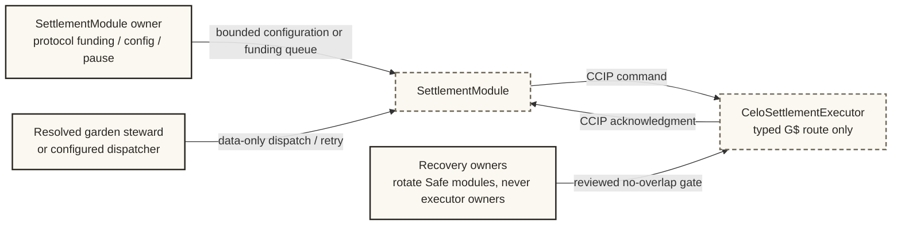
```mermaid
flowchart LR
  OWN["SettlementModule owner<br/>protocol funding / config / pause"] -->|"bounded configuration or funding queue"| SM["SettlementModule"]
  DSP["Resolved garden steward<br/>or configured dispatcher"] -->|"data-only dispatch / retry"| SM
  SM -->|"CCIP command"| EX["CeloSettlementExecutor<br/>typed G$ route only"]
  EX -->|"CCIP acknowledgment"| SM
  RO["Recovery owners<br/>rotate Safe modules, never executor owners"] -->|"reviewed no-overlap gate"| EX

  classDef planned fill:#fbf8f2,stroke:#6e6857,stroke-width:2px,stroke-dasharray:6 4,color:#2a2722
  classDef person fill:#fbf8f2,stroke:#2a2722,stroke-width:2px,color:#2a2722
  class SM,EX planned
  class OWN,DSP,RO person
```

The Arbitrum module owner and the Celo executor owner are separate implementation roles. The production route must prove that the Celo executor is a narrowly scoped Zodiac Roles member, never a Safe owner; external Safe authority configuration remains a Release gate. No human capability or timeout can certify a source settlement outcome.

## D5. Offer/request → work → approval → confirmation → fulfillment

**How to read this**: the full happy path of one promise, left to right in time — created, claimed, delivered through the existing Work → WorkApproval rail, confirmed by the counterparty, and paid. The steward performs every one of their steps in the Admin app (Hub work stage + garden Pool tab — W7/W13); the gardener acts in the client PWA. The payout lane at the end covers **non-G$ declared considerations only** — G$ considerations leave this diagram and queue on the SettlementModule (D21, D19).

Preconditions: pool `Open`; an optional cycle exists, belongs to the pool, and is `Open`; an optional `needUID` (0 = none) links the commitment to the Need that motivated it — stored as-is, never read from EAS, lineage drawn in D15. Who is who depends only on direction:

| Direction | Lead provider | Claimant | Confirmer |
|---|---|---|---|
| Offer | the creator | accepted recipient (`counterparty`) | the claimant |
| Individual Request | the accepted claimant | that same claimant | the Request creator |
| Garden Request | the authenticated requester — Open caller or stored ApprovalGated `requestedBy` | the GardenAccount (also provider scope) | the Request creator |

- The lead plus any later teammates form the contributor roster; every frozen contributor is excluded from confirmation.
- The stored `providerGarden` controls DomainImpact Work and assessment validation even when the commitment remains in the root protocol pool.

The single all-steps diagram was accurate but carried 32 messages across ten participants, so it is drawn as one compact overview plus three acts on the **same act boundaries as D10** — D5.1 is D10.1, D5.2 is D10.2, D5.3 is D10.3, seen from the message side instead of the state side. The acts zoom into the overview and never disagree with it.

#### D5.0 Overview — one promise, end to end

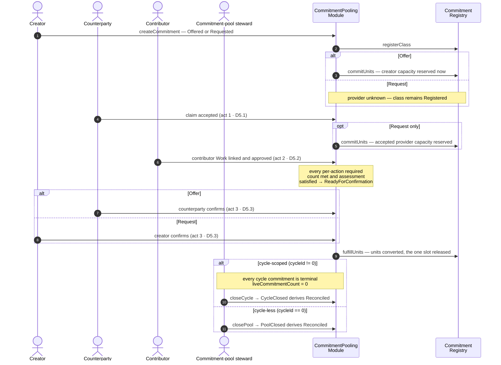
```mermaid
sequenceDiagram
  autonumber
  actor A as Creator
  actor B as Counterparty
  actor C as Contributor
  actor OP as Commitment-pool steward
  participant M as CommitmentPooling<br/>Module
  participant R as Commitment<br/>Registry

  A->>M: createCommitment — Offered or Requested
  M->>R: registerClass
  alt Offer
    M->>R: commitUnits — creator capacity reserved now
  else Request
    Note over M,R: provider unknown — class remains Registered
  end
  B->>M: claim accepted (act 1 · D5.1)
  opt Request only
    M->>R: commitUnits — accepted provider capacity reserved
  end
  C->>M: contributor Work linked and approved (act 2 · D5.2)
  Note over M: every per-action required<br/>count met and assessment<br/>satisfied → ReadyForConfirmation
  alt Offer
    B->>M: counterparty confirms (act 3 · D5.3)
  else Request
    A->>M: creator confirms (act 3 · D5.3)
  end
  M->>R: fulfillUnits — units converted, the one slot released
  alt cycle-scoped (cycleId != 0)
    Note over OP,M: every cycle commitment is terminal<br/>liveCommitmentCount = 0
    OP->>M: closeCycle → CycleClosed derives Reconciled
  else cycle-less (cycleId == 0)
    OP->>M: closePool → PoolClosed derives Reconciled
  end
```

#### D5.1 Act 1 — Creation and acceptance

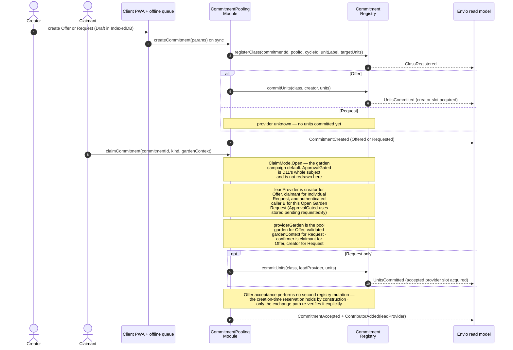
```mermaid
sequenceDiagram
  autonumber
  actor A as Creator
  actor B as Claimant
  participant PWA as Client PWA + offline queue
  participant M as CommitmentPooling<br/>Module
  participant R as Commitment<br/>Registry
  participant IDX as Envio read model

  A->>PWA: create Offer or Request (Draft in IndexedDB)
  PWA->>M: createCommitment(params) on sync
  M->>R: registerClass(commitmentId, poolId, cycleId, unitLabel, targetUnits)
  R-->>IDX: ClassRegistered
  alt Offer
    M->>R: commitUnits(class, creator, units)
    R-->>IDX: UnitsCommitted (creator slot acquired)
  else Request
    Note over M,R: provider unknown — no units committed yet
  end
  M-->>IDX: CommitmentCreated (Offered or Requested)
  B->>M: claimCommitment(commitmentId, kind, gardenContext)
  Note over M,R: ClaimMode.Open — the garden<br/>campaign default. ApprovalGated<br/>is D11's whole subject<br/>and is not redrawn here
  Note over M,R: leadProvider is creator for<br/>Offer, claimant for Individual<br/>Request, and authenticated<br/>caller B for this Open Garden<br/>Request (ApprovalGated uses<br/>stored pending requestedBy)
  Note over M,R: providerGarden is the pool<br/>garden for Offer, validated<br/>gardenContext for Request ·<br/>confirmer is claimant for<br/>Offer, creator for Request
  opt Request only
    M->>R: commitUnits(class, leadProvider, units)
    R-->>IDX: UnitsCommitted (accepted provider slot acquired)
  end
  Note over M,R: Offer acceptance performs no second registry mutation —<br/>the creation-time reservation holds by construction ·<br/>only the exchange path re-verifies it explicitly
  M-->>IDX: CommitmentAccepted + ContributorAdded(leadProvider)
```

#### D5.2 Act 2 — Delivery, work, and approval

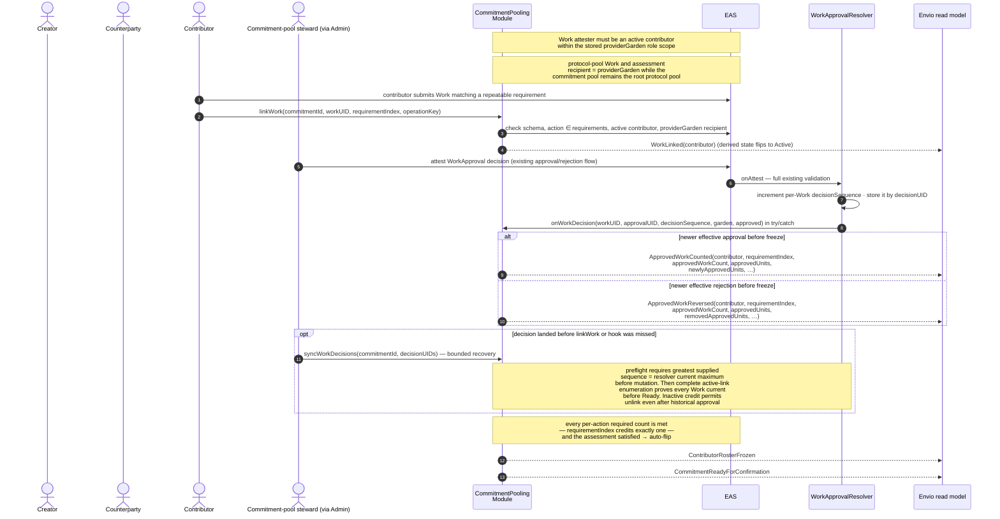
```mermaid
sequenceDiagram
  autonumber
  actor A as Creator
  actor B as Counterparty
  actor C as Contributor
  actor OP as Commitment-pool steward (via Admin)
  participant M as CommitmentPooling<br/>Module
  participant EAS as EAS
  participant WAR as WorkApprovalResolver
  participant IDX as Envio read model

  Note over M,EAS: Work attester must be an active contributor<br/>within the stored providerGarden role scope
  Note over M,EAS: protocol-pool Work and assessment<br/>recipient = providerGarden while the<br/>commitment pool remains the root protocol pool
  C->>EAS: contributor submits Work matching a repeatable requirement
  C->>M: linkWork(commitmentId, workUID, requirementIndex, operationKey)
  M->>EAS: check schema, action ∈ requirements, active contributor, providerGarden recipient
  M-->>IDX: WorkLinked(contributor) (derived state flips to Active)
  OP->>EAS: attest WorkApproval decision (existing approval/rejection flow)
  EAS->>WAR: onAttest — full existing validation
  WAR->>WAR: increment per-Work decisionSequence · store it by decisionUID
  WAR->>M: onWorkDecision(workUID, approvalUID, decisionSequence, garden, approved) in try/catch
  alt newer effective approval before freeze
    M-->>IDX: ApprovedWorkCounted(contributor, requirementIndex,<br/>approvedWorkCount, approvedUnits,<br/>newlyApprovedUnits, …)
  else newer effective rejection before freeze
    M-->>IDX: ApprovedWorkReversed(contributor, requirementIndex,<br/>approvedWorkCount, approvedUnits,<br/>removedApprovedUnits, …)
  end
  opt decision landed before linkWork or hook was missed
    OP->>M: syncWorkDecisions(commitmentId, decisionUIDs) — bounded recovery
    Note over M,WAR: preflight requires greatest supplied<br/>sequence = resolver current maximum<br/>before mutation. Then complete active-link<br/>enumeration proves every Work current<br/>before Ready. Inactive credit permits<br/>unlink even after historical approval
  end
  Note over M,EAS: every per-action required count is met<br/>— requirementIndex credits exactly one —<br/>and the assessment satisfied → auto-flip
  M-->>IDX: ContributorRosterFrozen
  M-->>IDX: CommitmentReadyForConfirmation
```

#### D5.3 Act 3 — Confirmation, fulfillment, consideration, and close

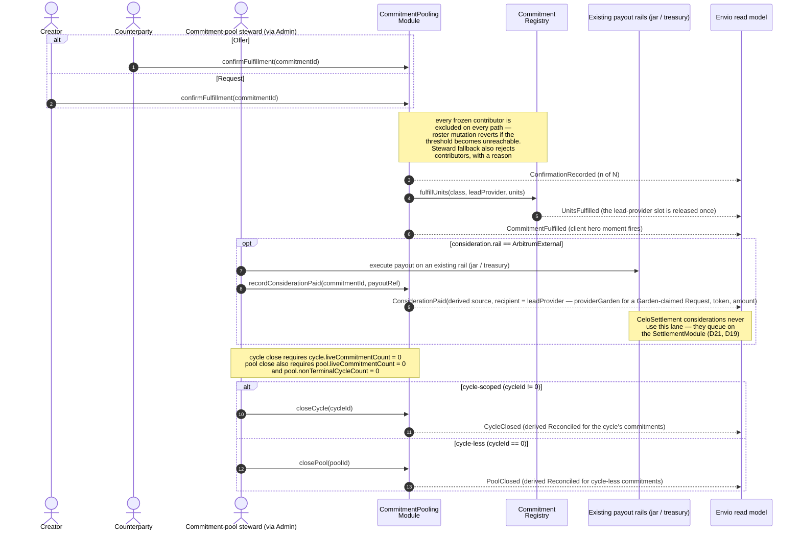
```mermaid
sequenceDiagram
  autonumber
  actor A as Creator
  actor B as Counterparty
  actor OP as Commitment-pool steward (via Admin)
  participant M as CommitmentPooling<br/>Module
  participant R as Commitment<br/>Registry
  participant RAILS as Existing payout rails (jar / treasury)
  participant IDX as Envio read model

  alt Offer
    B->>M: confirmFulfillment(commitmentId)
  else Request
    A->>M: confirmFulfillment(commitmentId)
  end
  Note over M,R: every frozen contributor is<br/>excluded on every path —<br/>roster mutation reverts if the<br/>threshold becomes unreachable.<br/>Steward fallback also rejects<br/>contributors, with a reason
  M-->>IDX: ConfirmationRecorded (n of N)
  M->>R: fulfillUnits(class, leadProvider, units)
  R-->>IDX: UnitsFulfilled (the lead-provider slot is released once)
  M-->>IDX: CommitmentFulfilled (client hero moment fires)
  opt consideration.rail == ArbitrumExternal
    OP->>RAILS: execute payout on an existing rail (jar / treasury)
    OP->>M: recordConsiderationPaid(commitmentId, payoutRef)
    M-->>IDX: ConsiderationPaid(derived source, recipient = leadProvider — providerGarden for a Garden-claimed Request, token, amount)
    Note over RAILS,IDX: CeloSettlement considerations never<br/>use this lane — they queue on<br/>the SettlementModule (D21, D19)
  end
  Note over OP,M: cycle close requires cycle.liveCommitmentCount = 0<br/>pool close also requires pool.liveCommitmentCount = 0<br/>and pool.nonTerminalCycleCount = 0
  alt cycle-scoped (cycleId != 0)
    OP->>M: closeCycle(cycleId)
    M-->>IDX: CycleClosed (derived Reconciled for the cycle's commitments)
  else cycle-less (cycleId == 0)
    OP->>M: closePool(poolId)
    M-->>IDX: PoolClosed (derived Reconciled for cycle-less commitments)
  end
```

## D6. Analog capture + lightweight evidence (review-is-confirmation)

**How to read this**: the lightweight alternative to D5. There is no Work rail and no approval step, because for these kinds the counterparty's confirmation *is* the review. Watch the authorship line: the steward types the record, but the gardener remains the named promise source — `recordedBy` marks the steward as scribe and never as owner. Acceptance revalidates the captured gardener against the same garden-membership predicate as self-created commitments (`NotEligibleContributor` otherwise). The evidence step is offline-first: it queues in IndexedDB and may sync hours later.

The SupportService / StewardCaptured path: no Work/WorkApproval rails, no work requirement, counterparty confirmation IS the review (register #20). The gardener stays the named promise source; the steward is metadata (`recordedBy`).

**When this happens (use cases)**: an elder gardener makes a promise in conversation and the steward records it from a paper field log; a gardener offers childcare, meals, or transport for a community work day — help that has no Work/approval rail; a field visit is captured fully offline and the evidence photos sync hours later. In every case the gardener stays the named promise source (`recordedBy` marks the steward as scribe, never as owner), and because these kinds carry no work requirement, the counterparty's confirmation *is* the review — no separate approval step exists.

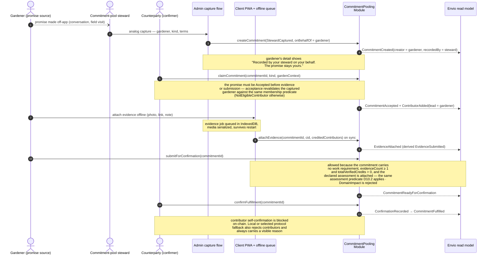
```mermaid
sequenceDiagram
  autonumber
  actor GRD as Gardener (promise source)
  actor OP as Commitment-pool steward
  actor CP as Counterparty (confirmer)
  participant ADM as Admin capture flow
  participant PWA as Client PWA + offline queue
  participant M as CommitmentPooling<br/>Module
  participant IDX as Envio read model

  GRD--)OP: promise made off-app (conversation, field visit)
  OP->>ADM: analog capture — gardener, kind, terms
  ADM->>M: createCommitment(StewardCaptured, onBehalfOf = gardener)
  M-->>IDX: CommitmentCreated(creator = gardener, recordedBy = steward)
  Note over ADM,M: gardener's detail shows<br/>"Recorded by your steward on your behalf.<br/>The promise stays yours."
  CP->>M: claimCommitment(commitmentId, kind, gardenContext)
  Note over CP,M: the promise must be Accepted before evidence<br/>or submission — acceptance revalidates the captured<br/>gardener against the same membership predicate<br/>(NotEligibleContributor otherwise)
  M-->>IDX: CommitmentAccepted + ContributorAdded(lead = gardener)
  GRD->>PWA: attach evidence offline (photo, link, note)
  Note over ADM,PWA: evidence job queued in IndexedDB,<br/>media serialized, survives restart
  PWA->>M: attachEvidence(commitmentId, cid, creditedContributors) on sync
  M-->>IDX: EvidenceAttached (derived EvidenceSubmitted)
  GRD->>M: submitForConfirmation(commitmentId)
  Note over PWA,IDX: allowed because the commitment carries<br/>no work requirement, evidenceCount ≥ 1<br/>and totalVerifiedCredits > 0, and the<br/>declared assessment is attached — the same<br/>assessment predicate D10.2 applies ·<br/>DomainImpact is rejected
  M-->>IDX: CommitmentReadyForConfirmation
  CP->>M: confirmFulfillment(commitmentId)
  M-->>IDX: ConfirmationRecorded → CommitmentFulfilled
  Note over CP,M: contributor self-confirmation is blocked<br/>on-chain. Local or selected protocol<br/>fallback also rejects contributors and<br/>always carries a visible reason
```

## D7. Commitment offline job lifecycle

**How to read this**: offline-safe writes are explicit jobs, not optimistic state mutations.

- **Six kinds enter this machine**: commitmentSeries, commitment, claim, evidence, workLink,
  confirmation.
- **Never queued**: settlement and ProtocolToGarden funding are online, authority-gated actions.
- **Optimistic rendering before sync** shows the affected card, row, evidence item, work link, or confirmation meter with queued chrome. It is a pending local projection, never a fabricated on-chain write or indexed success.
- A job may wait for the required membership Hat indefinitely without spending a retry. Waiting never fabricates a write; once membership is present, normal submission attempts begin.
- Only a failed submission consumes one of five attempts. Retry preserves the original serialized payload and increments once per failed send. An exhausted job surfaces on the affected row and in `SyncStatusBar`, where the gardener can manually retry or explicitly discard it.

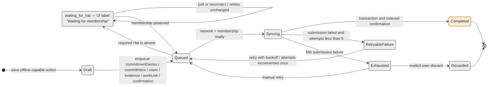
```mermaid
stateDiagram-v2
  direction LR
  waiting_for_hat: waiting_for_hat — UI label "Waiting for membership"
  [*] --> Draft : save offline-capable action
  Draft --> Queued : enqueue commitmentSeries / commitment / claim / evidence / workLink / confirmation
  Queued --> waiting_for_hat : required Hat is absent
  waiting_for_hat --> waiting_for_hat : poll or reconnect / retries unchanged
  waiting_for_hat --> Queued : membership observed
  Queued --> Syncing : network + membership ready
  Syncing --> Completed : transaction and indexed confirmation
  Syncing --> RetryableFailure : submission failed and attempts less than 5
  RetryableFailure --> Queued : retry with backoff / attempts incremented once
  Syncing --> Exhausted : fifth submission failure
  Exhausted --> Queued : manual retry
  Exhausted --> Discarded : explicit user discard
  Completed --> [*]
  Discarded --> [*]

  classDef derived fill:#f6ecdc,stroke:#b98a3e,color:#2a2722,stroke-width:2px
  classDef appOnly fill:#ececec,stroke:#8a8a8a,color:#2a2722,stroke-width:2px
  class Draft,Queued,waiting_for_hat,Syncing,RetryableFailure,Exhausted,Discarded appOnly
  class Completed derived
```

- **Online-only** (authorization or freshness cannot be safely deferred): accept/decline, assessment attachment, steward override, dispute actions, value transfer.
- `waiting_for_hat` is app-only provenance, not an on-chain state and not a failed attempt — the same state `uiux-spec.md` §5.11 names, surfaced to gardeners as "Waiting for membership".
- `Completed` is derived after the corresponding transaction is indexed; it is not a state stored by the protocol contract.
- `RetryableFailure` remains visible on the originating row with the next retry state. `Exhausted` is the recoverable failure destination, shown both beside that row and in the queue summary so recovery never depends on finding a hidden background job.

---

## D8. Pool state machine

**How to read this**: six named on-chain states (after the `None` unknown-row sentinel) and the exact call that moves between them. Two of them are easy to confuse — `Paused` is the full freeze for new participation and progress decisions in this pool, while `Composted` is archival rest that keeps the full history readable and can wake again through `reopenPool`. Register #103 supersedes the earlier creation-side-only posture: claim/decline, acceptance, exchange, Ready submission/override, and confirmation now stop with creation, while evidence/linkage and safe wind-down remain available. The module-level `setPaused` is still the whole-module emergency freeze in the second table below. Every pool transition is a rare, deliberate steward console action; nothing here happens automatically.

Every pool transition is on-chain. One pool per garden, idempotent registration; the protocol pool is the root garden's pool (the deployment artifact's canonical `rootGarden` — token 0 on Arbitrum One).

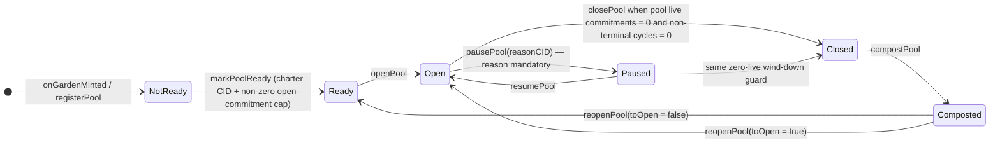
```mermaid
stateDiagram-v2
  direction LR
  [*] --> NotReady : onGardenMinted / registerPool
  NotReady --> Ready : markPoolReady (charter CID + non-zero open-commitment cap)
  Ready --> Open : openPool
  Open --> Paused : pausePool(reasonCID) — reason mandatory
  Paused --> Open : resumePool
  Open --> Closed : closePool when pool live commitments = 0 and non-terminal cycles = 0
  Paused --> Closed : same zero-live wind-down guard
  Closed --> Composted : compostPool
  Composted --> Ready : reopenPool(toOpen = false)
  Composted --> Open : reopenPool(toOpen = true)
```

**What each state allows**:

| State | What it means | What's allowed | Who acts |
|---|---|---|---|
| NotReady | garden minted, pool registered, onchain charter/cap predicate not yet met or app Baseline preflight still missing | configuration only | steward |
| Ready | onchain charter + non-zero provider open-commitment cap are present; the app offered the write only after a current non-revoked Baseline preflight | seed cycles; open the pool | steward |
| Open | promises can flow | create / claim / confirm commitments; seed and open cycles | gardeners + steward |
| Paused | **full per-pool freeze** | new commitments/series, cycle seed/open, claim/decline, acceptance, exchange, Ready submission/override, and confirmation are disabled; browse, evidence/work linkage, roster-safe wind-down, cancellation, expiry, dispute recovery, and the non-blocking Work-decision hook remain available | steward (resume); existing actors retain only evidence, recovery, and wind-down paths |
| Closed | wind-down complete | no new activity; every commitment was terminal and every cycle Cancelled or Composted before entry | steward |
| Composted | **archival rest — history + "ready for the next season"** | read everything; `reopenPool` back to Ready or Open; nothing else | steward |

Composting is archival, not deletion and not a stop — `Paused` is a pool-scoped freeze; a composted pool keeps its full promise history visible and can wake for a new season via `reopenPool`. The two pauses differ by scope, not by whether they freeze:

| Pause | Scope | Blocks | Keeps available |
|---|---|---|---|
| Pool `Paused` | that pool only | new commitments/series, cycle seed/open, claim/decline, acceptance, exchange, Ready submission/override, confirmation (register #103) | browse, evidence/work linkage, roster-safe wind-down, cancellation, expiry, dispute recovery, and the non-blocking `onWorkDecision` hook |
| Module `setPaused` | whole module — **the emergency freeze** | operational mutations | owner configuration, unpause, `cancelCommitment`, `expireCommitment`, `resolveDispute`, and pool `pausePool` / `closePool` / `compostPool` wind-down; the deliberately ungated `onWorkDecision` resolver hook also stays live, so a pre-freeze work decision can still credit requirements and auto-flip an Accepted commitment to ReadyForConfirmation while the module is paused |

## D9. Cycle state machine (types: Season, Campaign)

**How to read this**: the chain stores only five states. The three extra boxes are provenance, not new chain states — grey `Draft` lives in admin IndexedDB, and amber `InProgress`/`Reviewing` are indexer-derived overlays of on-chain `Open`, which is why the transitions drawn leaving them are the ones the on-chain table lists once under `Open`. There is deliberately no loop back: a cycle ends, and the next round is a fresh `seedCycle` on the same pool.

On-chain enum stores `Seeded / Open / Reconciled / Composted / Cancelled` (plus the `None` unknown-row sentinel). `Draft` is app-only; `InProgress` and `Reviewing` are derived overlays of on-chain `Open`.

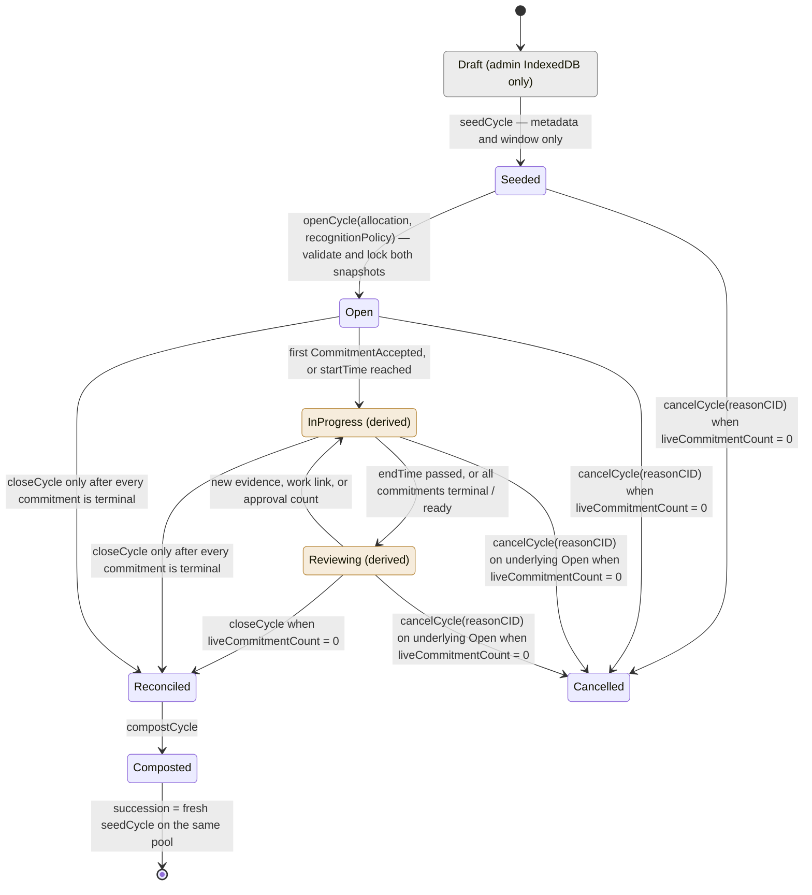
```mermaid
stateDiagram-v2
  classDef derived fill:#f6ecdc,stroke:#b98a3e
  classDef appOnly fill:#ececec,stroke:#8a8a8a

  Draft: Draft (admin IndexedDB only)
  InProgress: InProgress (derived)
  Reviewing: Reviewing (derived)

  [*] --> Draft
  Draft --> Seeded : seedCycle — metadata and window only
  Seeded --> Open : openCycle(allocation, recognitionPolicy) — validate and lock both snapshots
  Open --> InProgress : first CommitmentAccepted, or startTime reached
  InProgress --> Reviewing : endTime passed, or all commitments terminal / ready
  Reviewing --> InProgress : new evidence, work link, or approval count
  Reviewing --> Reconciled : closeCycle when liveCommitmentCount = 0
  InProgress --> Reconciled : closeCycle only after every commitment is terminal
  Open --> Reconciled : closeCycle only after every commitment is terminal
  Reconciled --> Composted : compostCycle
  Seeded --> Cancelled : cancelCycle(reasonCID) when liveCommitmentCount = 0
  Open --> Cancelled : cancelCycle(reasonCID) when liveCommitmentCount = 0
  InProgress --> Cancelled : cancelCycle(reasonCID) on underlying Open when liveCommitmentCount = 0
  Reviewing --> Cancelled : cancelCycle(reasonCID) on underlying Open when liveCommitmentCount = 0
  Composted --> [*] : succession = fresh seedCycle on the same pool

  class InProgress derived
  class Reviewing derived
  class Draft appOnly
```

**What each state allows** (storage per the provenance colours above):

| State | Storage | What it means | What's allowed | Leaves via |
|---|---|---|---|---|
| Draft | app-only (admin IndexedDB) | metadata being drafted | edit or discard locally — a Draft cancel is an off-chain discard | `seedCycle` |
| Seeded | on-chain | window + metadata exist; no allocation yet | `openCycle`; `cancelCycle` while `liveCommitmentCount = 0` | `openCycle` / `cancelCycle` |
| Open | on-chain | the running cycle | create / claim / confirm within the cycle | `closeCycle` / `cancelCycle` (both need every commitment terminal) |
| InProgress | derived overlay of `Open` | first `CommitmentAccepted`, or `startTime` reached | same as `Open` — `cancelCycle` covers it via the underlying `Open` | overlay flips only |
| Reviewing | derived overlay of `Open` | window ended, or every commitment terminal/ready | same as `Open`; flips back to `InProgress` on new evidence, work link, or approval | overlay flips only |
| Reconciled | on-chain | `closeCycle` ran — the reconcile act | read; `compostCycle` | `compostCycle` |
| Composted | on-chain | terminal archival rest *for this cycle* | read; succession = fresh `seedCycle` on the same pool | — |
| Cancelled | on-chain | ended early with nothing live | read | — |

- Opening validates **pool `Open`**, cycle existence, pool ownership, `Seeded` state, and an allocation whose basis points sum to exactly 10,000.
- The four edges leaving the overlays (`→ Cancelled`, `→ Reconciled`) are the spec's single `Open →` rows drawn at overlay resolution — the diagram is deliberately a superset of the on-chain transition table, and no transition here exists that the chain does not allow.
- Both close and cancel require the O(1) `liveCommitmentCount` to be zero; Ready and Disputed commitments stay live until they become Fulfilled, Cancelled, or Expired.
- `Pool.openSeasonCycleId` permits exactly one open Season in O(1); any number of Campaigns may be open concurrently, and no transition enumerates cycles.
- Succession is derived by pool ordering — no on-chain predecessor pointer.

**There is deliberately no loop here**: `Composted` is terminal *for a cycle*. The loop lives at the pool — a fresh `seedCycle` (Season or Campaign) on the same pool is how the next round begins, and the composted cycle's aggregates roll into pool history. (The pool machine, D8, is the one that can reopen.)

**Allocation split**: the six role percentages are supplied atomically to `openCycle`, validated, stored as the immutable cycle snapshot, emitted in `CycleOpened`, and become the cycle's impact-certificate allowlist allocation at close (contract-spec §9.4). Stored on-chain as basis points, 10000 bps = 100%; `seedCycle` carries no allocation.

| Role share | gardeners | treasury | steward | evaluator | community | funder |
|---|---|---|---|---|---|---|
| Default (Model 1) | 60% | 15% | 10% | 5% | 5% | 5% |

## D10. Commitment state machine (overview + three acts)

**How to read this**: one promise's whole life. Read D10.0 first — five boxes, the entire arc. The three acts then zoom in without ever contradicting the overview: act 1 is how a promise gets its lead provider, act 2 is how delivery becomes provable, act 3 is every way it ends. Colour is provenance, not status: paper = stored on-chain, amber = derived by the indexer, grey = app-only. D5 is the same three acts drawn as messages instead of states.

State provenance at a glance:

- **On-chain enum**: `Offered / Requested / Accepted / ReadyForConfirmation / Fulfilled / Cancelled / Expired / Disputed` (plus the `None` unknown-row sentinel).
- **App-only**: `Draft` (IndexedDB, no chain presence).
- **Derived by the indexer**: `Active`, `EvidenceSubmitted`, `PartiallyApproved`, `Reconciled`.

The single all-states diagram was accurate but hard to digest, so it is drawn as one compact overview plus three lifecycle acts — the acts zoom into the overview and never disagree with it.

#### D10.0 Overview — the whole life at a glance

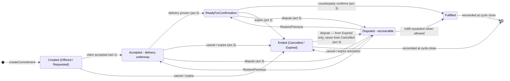
```mermaid
stateDiagram-v2
  direction LR
  state "Created (Offered / Requested)" as CRE
  state "Accepted - delivery underway" as ACC
  state "ReadyForConfirmation" as RFC
  state "Disputed - recoverable" as DSP
  state "Ended (Cancelled / Expired)" as END
  [*] --> CRE : createCommitment
  CRE --> ACC : claim accepted (act 1)
  ACC --> RFC : delivery proven (act 2)
  RFC --> Fulfilled : counterparty confirms (act 3)
  CRE --> END : cancel / expire
  ACC --> END : cancel / expire (act 3)
  RFC --> END : expire (act 3)
  ACC --> DSP : dispute (act 3)
  RFC --> DSP : dispute (act 3)
  END --> DSP : dispute — from Expired only, never from Cancelled (act 3)
  DSP --> ACC : RestorePrevious
  DSP --> RFC : RestorePrevious
  DSP --> END : cancel / expire resolution
  DSP --> Fulfilled : fulfill resolution when allowed
  Fulfilled --> [*] : reconciled at cycle close
  END --> [*] : reconciled at cycle close
```

#### D10.1 Act 1 — Claim & acceptance

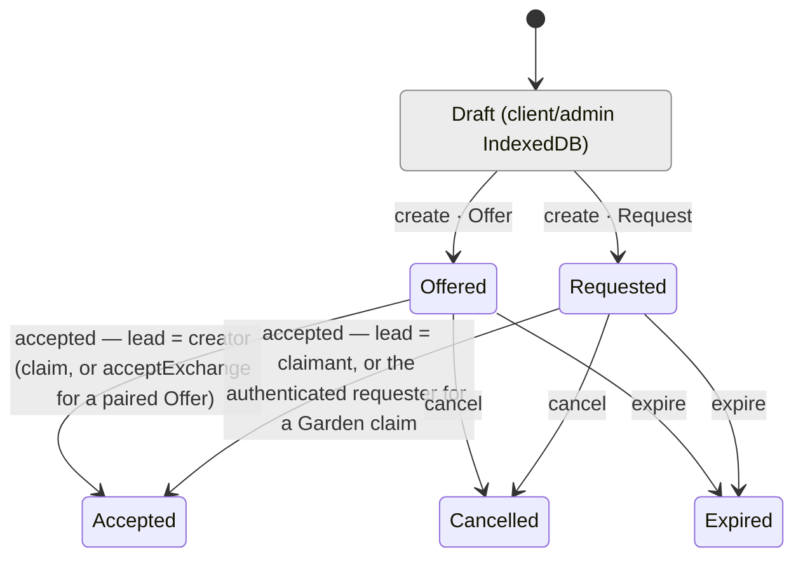
```mermaid
stateDiagram-v2
  direction TB
  classDef appOnly fill:#ececec,stroke:#8a8a8a
  Draft: Draft (client/admin IndexedDB)
  [*] --> Draft
  Draft --> Offered : create · Offer
  Draft --> Requested : create · Request
  Offered --> Accepted : accepted — lead = creator (claim, or acceptExchange for a paired Offer)
  Requested --> Accepted : accepted — lead = claimant, or the authenticated requester for a Garden claim
  Offered --> Cancelled : cancel
  Requested --> Cancelled : cancel
  Offered --> Expired : expire
  Requested --> Expired : expire
  class Draft appOnly
```

Exact gates for these four calls (the permission table is authoritative):

- **create** — `createCommitment` by a pool gardener for their own Offer/Request;
- **cancel** — `cancelCommitment(id, reasonCID)` by the **creator or steward**, before acceptance;
- **expire** — `expireCommitment(id)`, **permissionless** once past the due date or cycle end;
- **accept** — `claimCommitment` under `ClaimMode.Open`, or `acceptClaim` under `ApprovalGated`.

An approval-gated `claimCommitment` stores a PendingClaim and leaves the on-chain state untouched; `declineClaim` clears only that claimant; acceptance consumes the stored terms, derives `leadProvider` and `providerGarden`, and commits units exactly once. Competing pending claims resolve by supersession — the full decline/accept/supersede choreography is D11.

#### D10.2 Act 2 — Delivery & evidence (`Accepted` → `ReadyForConfirmation`)

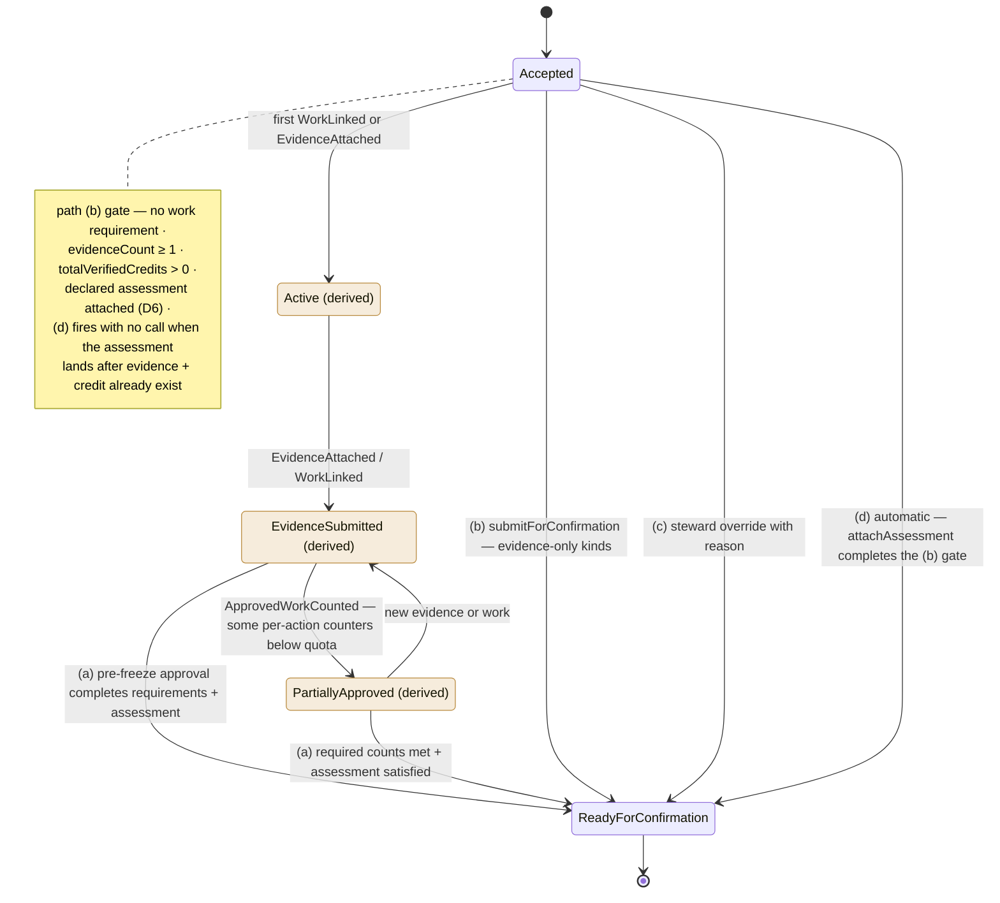
```mermaid
stateDiagram-v2
  classDef derived fill:#f6ecdc,stroke:#b98a3e
  Active: Active (derived)
  EvidenceSubmitted: EvidenceSubmitted (derived)
  PartiallyApproved: PartiallyApproved (derived)
  [*] --> Accepted
  Accepted --> Active : first WorkLinked or EvidenceAttached
  Active --> EvidenceSubmitted : EvidenceAttached / WorkLinked
  EvidenceSubmitted --> PartiallyApproved : ApprovedWorkCounted — some per-action counters below quota
  PartiallyApproved --> EvidenceSubmitted : new evidence or work
  EvidenceSubmitted --> ReadyForConfirmation : (a) pre-freeze approval completes requirements + assessment
  PartiallyApproved --> ReadyForConfirmation : (a) required counts met + assessment satisfied
  Accepted --> ReadyForConfirmation : (b) submitForConfirmation — evidence-only kinds
  Accepted --> ReadyForConfirmation : (c) steward override with reason
  Accepted --> ReadyForConfirmation : (d) automatic — attachAssessment completes the (b) gate
  note right of Accepted
    path (b) gate — no work requirement ·
    evidenceCount ≥ 1 · totalVerifiedCredits > 0 ·
    declared assessment attached (D6) ·
    (d) fires with no call when the assessment
    lands after evidence + credit already exist
  end note
  ReadyForConfirmation --> [*]
  class Active derived
  class EvidenceSubmitted derived
  class PartiallyApproved derived
```

While the derived overlays are showing, the on-chain state remains `Accepted` — so the cancel/expire/dispute transitions in act 3 apply to all of them. The two delivery styles by kind:

- **DomainImpact** — runs the full Work → WorkApproval rail with per-action required counts (`requirementIndex` credits exactly one requirement per approval — amendment 2026-07-18); paths (a).
- **SupportService / StewardCaptured / SeasonCampaign** seeded with no work requirement — path (b): the counterparty's confirmation IS the review, gated as the in-diagram note states (D6).
- **Path (d) is (b) completing automatically**: `attachAssessment` runs the same readiness evaluation, so an evidence-only commitment already holding evidence and verified credit flips to `ReadyForConfirmation` the moment its assessment is attached — no `submitForConfirmation` call. `CommitmentReadyForConfirmation(overridden = false)` still fires, so event-keyed indexers see the same signal; UIs keyed on the *call* must not assume one happened.
- **Path (c) is an override in authority only** — it still enforces every freeze precondition: non-zero verified credit, the open-cycle policy when cycle-scoped, fresh work-decision sequences, and confirmer reachability. A steward cannot override a commitment with zero credit.

#### D10.3 Act 3 — Resolution (confirmation, endings, disputes, reconciliation)

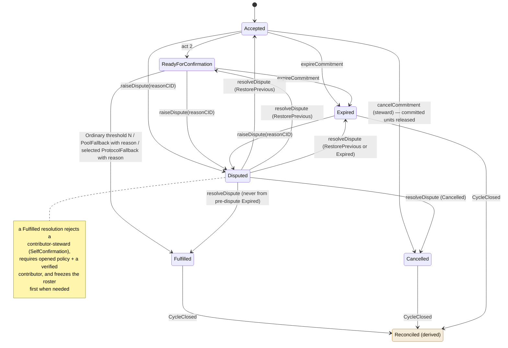
```mermaid
stateDiagram-v2
  classDef derived fill:#f6ecdc,stroke:#b98a3e
  Reconciled: Reconciled (derived)
  [*] --> Accepted
  Accepted --> ReadyForConfirmation : act 2
  ReadyForConfirmation --> Fulfilled : Ordinary threshold N / PoolFallback with reason / selected ProtocolFallback with reason
  Accepted --> Cancelled : cancelCommitment (steward) — committed units released
  Accepted --> Expired : expireCommitment
  ReadyForConfirmation --> Expired : expireCommitment
  Accepted --> Disputed : raiseDispute(reasonCID)
  ReadyForConfirmation --> Disputed : raiseDispute(reasonCID)
  Expired --> Disputed : raiseDispute(reasonCID)
  Disputed --> Accepted : resolveDispute (RestorePrevious)
  Disputed --> ReadyForConfirmation : resolveDispute (RestorePrevious)
  Disputed --> Expired : resolveDispute (RestorePrevious or Expired)
  Disputed --> Fulfilled : resolveDispute (never from pre-dispute Expired)
  Disputed --> Cancelled : resolveDispute (Cancelled)
  note right of Disputed
    a Fulfilled resolution rejects a
    contributor-steward (SelfConfirmation),
    requires opened policy + a verified
    contributor, and freezes the roster
    first when needed
  end note
  Fulfilled --> Reconciled : CycleClosed
  Cancelled --> Reconciled : CycleClosed
  Expired --> Reconciled : CycleClosed
  class Reconciled derived
```

Ordinary named/default reachability is evaluated after every contributor is excluded. If it is
unreachable, the commitment cannot be accepted or reach Ready unless
`protocolFallbackEnabled` was enabled before acceptance (the pilot default ON, opt-out per promise — register #94) and the write-once
`protocolPoolId` exists. At confirmation, current local-garden Hats classify first as
`PoolFallback`; otherwise selected current protocol-garden Hats classify as `ProtocolFallback`.
`CommitmentFulfilled` emits the confirmer, path, and reason, so no surface infers provenance from
the caller's wallet role.

The module stores `preDisputeState` before entering `Disputed`; `RestorePrevious` restores that exact state. There is no `Reconciled` dispute resolution. Unit accounting is exact:

This ledger *is* the register's `accounting-state` vocabulary — the sidecar's fourth commitment-pooling state family, whose members are `Registered`, `Committed`, `Released`, `Fulfilled`. Each bullet below names the transition that moves a class between them, and the enum is single-shot per class: a slot is claimed once and released once, which is what `ClassAccountingStateMismatch` enforces.

- Offer creation **registers and commits** the class (`Committed`) and acquires one provider
  open-commitment slot before the Offered place becomes available. Request creation registers its
  class but leaves it `Registered`;
- cancellation or expiry from an unaccepted Offered Offer **releases** its existing reservation
  once; cancellation or expiry from an unaccepted Requested Request releases nothing;
- Offer acceptance performs no second commit — the creation-time reservation holds by construction, and only the exchange path re-verifies it explicitly. Request
  acceptance moves its `Registered` class to `Committed` and acquires one provider slot once;
- cancellation or expiry from `Accepted`/`ReadyForConfirmation` **releases** those committed units and that one slot once (`Released`);
- fulfillment converts committed units with `fulfillUnits` (`Fulfilled`) and releases that one slot;
- raising or restoring a dispute has no unit or slot effect;
- resolving to `Fulfilled`, `Cancelled`, or `Expired` applies the same conversion/release only when units and the slot are still held; a pre-dispute `Expired` record cannot become `Fulfilled` and never releases twice.

Cycle-less commitments (`cycleId == 0`) derive `Reconciled` from `PoolClosed`; cycle-scoped terminal commitments derive it from `CycleClosed`.

## D11. Approval-gated claim request, decline, acceptance, and supersession

**How to read this**: a claim selects the **one accountable lead provider**, either a person or a garden-as-provider. Contributors never claim. They join the accepted commitment afterward through its `Open` or `LeadManaged` roster policy. The two requests here are two would-be leads, such as two gardens with their own teams, asking to lead the same commitment. Each `claimCommitment` stores its own PendingClaim while the commitment stays browseable. The steward accepts one lead and explicitly Declines the other with a stored reason, or the remaining pending row becomes Superseded after acceptance. A later request after a decline is a fresh request. **Choosing the lead is the claim flow; forming the team is the roster flow.**

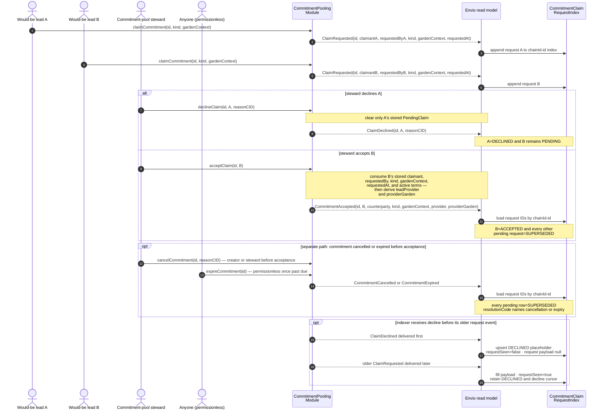
```mermaid
sequenceDiagram
  autonumber
  actor A as Would-be lead A
  actor B as Would-be lead B
  actor OP as Commitment-pool steward
  actor ANY as Anyone (permissionless)
  participant M as CommitmentPooling<br/>Module
  participant IDX as Envio read model
  participant RI as CommitmentClaim<br/>RequestIndex

  A->>M: claimCommitment(id, kind, gardenContext)
  M-->>IDX: ClaimRequested(id, claimantA, requestedByA, kind, gardenContext, requestedAt)
  IDX->>RI: append request A to chainId-id index
  B->>M: claimCommitment(id, kind, gardenContext)
  M-->>IDX: ClaimRequested(id, claimantB, requestedByB, kind, gardenContext, requestedAt)
  IDX->>RI: append request B
  alt steward declines A
    OP->>M: declineClaim(id, A, reasonCID)
    Note over M,IDX: clear only A's stored PendingClaim
    M-->>IDX: ClaimDeclined(id, A, reasonCID)
    Note over IDX,RI: A=DECLINED and B remains PENDING
  else steward accepts B
    OP->>M: acceptClaim(id, B)
    Note over M,IDX: consume B's stored claimant,<br/>requestedBy, kind, gardenContext,<br/>requestedAt, and active terms —<br/>then derive leadProvider<br/>and providerGarden
    M-->>IDX: CommitmentAccepted(id, B, counterparty, kind, gardenContext, provider, providerGarden)
    IDX->>RI: load request IDs by chainId-id
    Note over IDX,RI: B=ACCEPTED and every other<br/>pending request=SUPERSEDED
  end
  opt separate path: commitment cancelled or expired before acceptance
    OP->>M: cancelCommitment(id, reasonCID) — creator or steward before acceptance
    ANY->>M: expireCommitment(id) — permissionless once past due
    M-->>IDX: CommitmentCancelled or CommitmentExpired
    IDX->>RI: load request IDs by chainId-id
    Note over IDX,RI: every pending row=SUPERSEDED<br/>resolutionCode names cancellation or expiry
  end
  opt indexer receives decline before its older request event
    M-->>IDX: ClaimDeclined delivered first
    IDX->>RI: upsert DECLINED placeholder<br/>requestSeen=false · request payload null
    M-->>IDX: older ClaimRequested delivered later
    IDX->>RI: fill payload · requestSeen=true<br/>retain DECLINED and decline cursor
  end
```

There is no numeric sentinel or database-wide query. `ClaimDeclined` can materialize the
claimant-keyed row and request index before its older `ClaimRequested` delivery. The placeholder
uses `requestSeen = false`, nullable request-only facts, and the terminal decline cursor; the
older request later fills those facts without reviving Pending. Only a genuinely newer request
after the decline becomes a fresh active request with a new timestamp. Acceptance is deterministic
because it cannot substitute caller-provided terms. Superseded copy distinguishes another lead's
acceptance from commitment cancellation/expiry through `resolutionCode`. Contributor roster
formation begins only after that lead is chosen.

## D12. Claim-request state machine

**How to read this**: D11 is the choreography that chooses one accountable lead; this is the machine each would-be lead's request runs. Contributors are absent because they join through the accepted commitment's roster policy and never claim. One request per claimant, four states. A `PENDING` row holds its own stored terms and moves no commitment state. Every terminal state carries a `resolutionCode` so the gardener sees *why* it ended rather than just that it did — the machine below shows the shape, and the table under it names the code and the sentence each one produces.

Note the state a claim request never has: there is no "withdrawn". A claimant does not retract a request — it resolves when the steward acts or when the commitment ends.

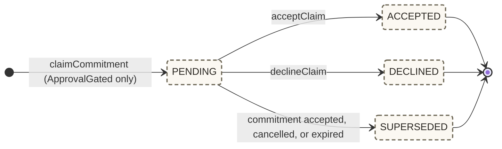
```mermaid
stateDiagram-v2
  direction LR
  [*] --> PENDING : claimCommitment (ApprovalGated only)
  PENDING --> ACCEPTED : acceptClaim
  PENDING --> DECLINED : declineClaim
  PENDING --> SUPERSEDED : commitment accepted, cancelled, or expired
  ACCEPTED --> [*]
  DECLINED --> [*]
  SUPERSEDED --> [*]

  classDef planned fill:#fbf8f2,stroke:#6e6857,stroke-width:2px,stroke-dasharray:6 4,color:#2a2722
  class PENDING,ACCEPTED,DECLINED,SUPERSEDED planned
```

| End state | `resolutionCode` | What the gardener is told |
|---|---|---|
| `ACCEPTED` | `CLAIM_ACCEPTED` | this request was taken up; `acceptClaim` consumed the stored terms exactly once |
| `DECLINED` | `CLAIM_DECLINED` + steward `reasonCID` | the steward declined this request, with a reason; only this claimant is cleared |
| `SUPERSEDED` | `COMMITMENT_ACCEPTED` | someone else was accepted |
| `SUPERSEDED` | `COMMITMENT_CANCELLED` | the commitment was withdrawn before acceptance |
| `SUPERSEDED` | `COMMITMENT_EXPIRED` | the commitment passed its due date before acceptance |

A `DECLINED` row is never reopened: a later request from the same claimant is a fresh `PENDING` row with a new timestamp. Supersession is written by the indexer, not the contract: acceptance, cancellation, and expiry each load the request IDs through `CommitmentClaimRequestIndex` and mark every still-`PENDING` sibling in one bounded pass. `ClaimMode.Open` commitments never create a row here — the claim is immediate and the commitment moves straight to `Accepted` (D5.1).

## D13. Bilateral exchange sequence — paired start, independent promises

**How to read this**: B is created after A and carries the immutable one-way `counterCommitmentId = A`. B must be created directly by B's creator; `StewardCaptured` / on-behalf B is rejected because a steward cannot provide that consent. Before any B allocation, storage, class registration, or event, the same creation transaction revalidates A as a same-pool Offered Individual Offer with a different creator and its exact reservation still Committed. A's creator later consents by calling `acceptExchange(B)`, which repeats mutable predicates. Both Offer classes and provider slots were already committed when their Offers were created. Acceptance verifies those exact full reservations without a second registry commit or a new-slot provider-cap check. Supersession of other still-pending claim requests is a **read-model act**: on-chain, acceptance deletes only the accepted claimant's own row, the chain emits nothing per superseded request, and the leftover `PendingClaim` rows simply become unusable (`requirePreAcceptanceState`) — the indexer sweeps its bounded request index to `SUPERSEDED` on the acceptance or terminal event. Exchange is also free-only: `acceptExchange` reverts `ExchangeConsiderationUnsupported` when either side carries a non-zero declared consideration, and creation does not pre-reject a priced pair — so a priced B referencing A can exist yet never be exchange-accepted. A later cap reduction cannot strand either Offer. The dashed boundary is the permanent no-coupling rule: after acceptance, fulfillment, confirmation, cancellation, expiry, and dispute proceed on each ordinary commitment alone.

**The two recipients on the right are the same two people on the left.** Because each side is an Offer, the person who receives A's work is B's creator, and the person who receives B's work is A's creator. They appear as separate lifelines only to keep the two independent confirmation lanes readable after the boundary; no third or fourth party exists in this exchange.

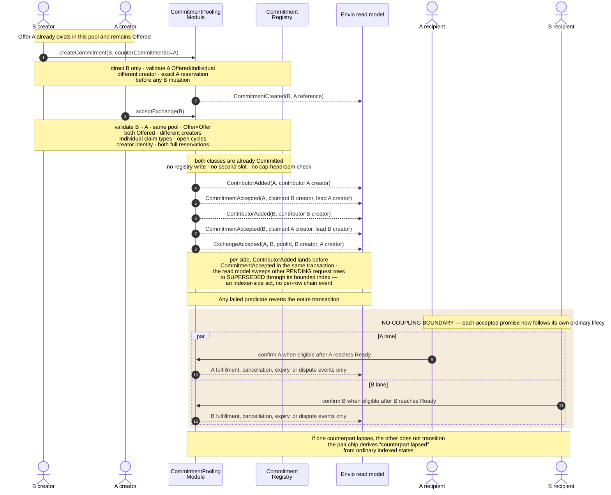
```mermaid
sequenceDiagram
  autonumber
  actor BC as B creator
  actor AC as A creator
  participant M as CommitmentPooling<br/>Module
  participant R as Commitment<br/>Registry
  participant I as Envio read model
  actor AR as A recipient
  actor BR as B recipient

  Note over BC,AC: Offer A already exists in this pool and remains Offered
  BC->>M: createCommitment(B, counterCommitmentId=A)
  Note over BC,R: direct B only · validate A Offered/Individual<br/>different creator · exact A reservation<br/>before any B mutation
  M-->>I: CommitmentCreated(B, A reference)
  AC->>M: acceptExchange(B)
  Note over BC,R: validate B→A · same pool · Offer×Offer<br/>both Offered · different creators<br/>Individual claim types · open cycles<br/>creator identity · both full reservations
  Note over M,R: both classes are already Committed<br/>no registry write · no second slot · no cap-headroom check
  M-->>I: ContributorAdded(A, contributor A creator)
  M-->>I: CommitmentAccepted(A, claimant B creator, lead A creator)
  M-->>I: ContributorAdded(B, contributor B creator)
  M-->>I: CommitmentAccepted(B, claimant A creator, lead B creator)
  M-->>I: ExchangeAccepted(A, B, poolId, B creator, A creator)
  Note over M,I: per side, ContributorAdded lands before<br/>CommitmentAccepted in the same transaction ·<br/>the read model sweeps other PENDING request rows<br/>to SUPERSEDED through its bounded index —<br/>an indexer-side act, no per-row chain event
  Note over M,I: Any failed predicate reverts the entire transaction

  rect rgb(246, 236, 220)
    Note over AR,BR: NO-COUPLING BOUNDARY — each accepted promise now follows its own ordinary lifecycle
    par A lane
      AR->>M: confirm A when eligible after A reaches Ready
      M-->>I: A fulfillment, cancellation, expiry, or dispute events only
    and B lane
      BR->>M: confirm B when eligible after B reaches Ready
      M-->>I: B fulfillment, cancellation, expiry, or dispute events only
    end
  end
  Note over M,BR: if one counterpart lapses, the other does not transition<br/>the pair chip derives “counterpart lapsed”<br/>from ordinary indexed states
```

This is the approved August bilateral rung of the exchange ladder: **reference record + bilateral atomic acceptance specified for the current contract lane; multilateral and transferable execution reserved**. It is not shipped until that lane lands and is verified. Count safety remains exact-label per side, with no cross-side arithmetic and no declared-value arithmetic.

## D14. Where value and recognition flow (worked Model 1)

**How to read this**: D3 shows *who* is accountable and *which* artifacts exist; this shows *how much* goes *where*. Two flows, deliberately separate — recognition (certificate units, D14.0) and payment (declared G$ consideration, D14.1) — because the amendment keeps them linked but distinct. Every number on an edge is the **Model 1 default preset** (not chain-enforced): the six-role split 6000/1500/1000/500/500/500 bps and the within-gardeners 2,000 equal / 8,000 verified policy, traced through one concrete example. The class identifier for the steward share is `operatorBps`; its drawn label reads "steward share" everywhere.

Worked example used by both blocks: a cycle closes with a **10,000-unit certificate** and **2 fulfilled commitments**; commitment A's frozen roster has **2 eligible contributors** with verified credits **3 and 1**; commitment A's declared consideration is **500 G$** on the CeloSettlement rail.

#### D14.0 Recognition → certificate units

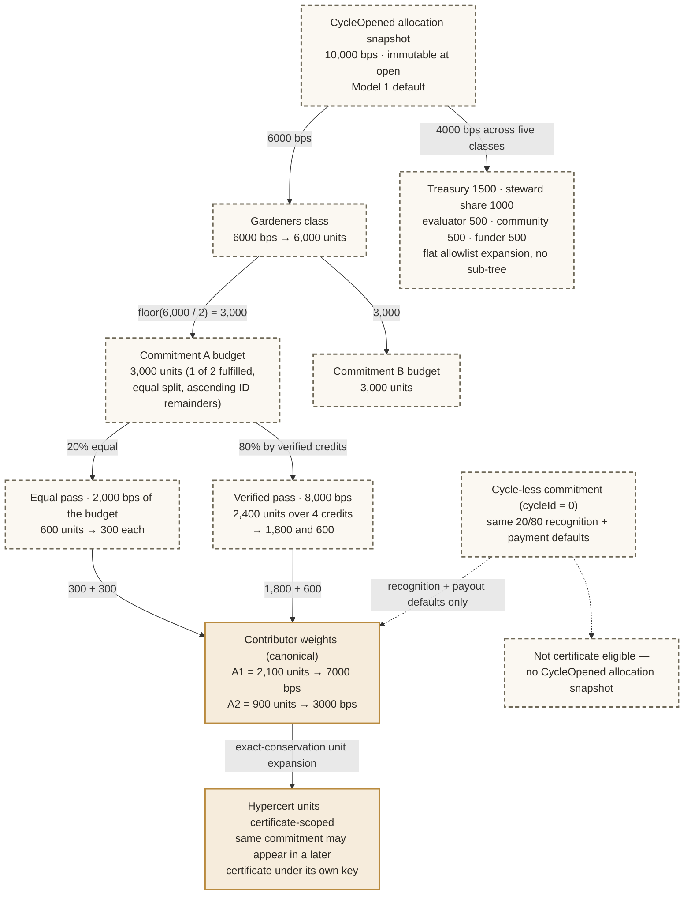
```mermaid
flowchart TB
  CYC["CycleOpened allocation snapshot<br/>10,000 bps · immutable at open<br/>Model 1 default"]
  GCLASS["Gardeners class<br/>6000 bps → 6,000 units"]
  FLAT["Treasury 1500 · steward share 1000<br/>evaluator 500 · community 500 · funder 500<br/>flat allowlist expansion, no sub-tree"]
  CA["Commitment A budget<br/>3,000 units (1 of 2 fulfilled,<br/>equal split, ascending ID remainders)"]
  CB["Commitment B budget<br/>3,000 units"]
  EQ["Equal pass · 2,000 bps of the budget<br/>600 units → 300 each"]
  VER["Verified pass · 8,000 bps<br/>2,400 units over 4 credits<br/>→ 1,800 and 600"]
  CONTRIB["Contributor weights (canonical)<br/>A1 = 2,100 units → 7000 bps<br/>A2 = 900 units → 3000 bps"]
  HC["Hypercert units — certificate-scoped<br/>same commitment may appear in a later<br/>certificate under its own key"]
  CYCLESS["Cycle-less commitment (cycleId = 0)<br/>same 20/80 recognition + payment defaults"]
  NOCERT["Not certificate eligible —<br/>no CycleOpened allocation snapshot"]

  CYC -->|"6000 bps"| GCLASS
  CYC -->|"4000 bps across five classes"| FLAT
  GCLASS -->|"floor(6,000 / 2) = 3,000"| CA
  GCLASS -->|"3,000"| CB
  CA -->|"20% equal"| EQ
  CA -->|"80% by verified credits"| VER
  EQ -->|"300 + 300"| CONTRIB
  VER -->|"1,800 + 600"| CONTRIB
  CONTRIB -->|"exact-conservation unit expansion"| HC
  CYCLESS -.->|"recognition + payout defaults only"| CONTRIB
  CYCLESS -.-> NOCERT

  classDef planned fill:#fbf8f2,stroke:#6e6857,stroke-width:2px,stroke-dasharray:6 4,color:#2a2722
  classDef derived fill:#f6ecdc,stroke:#b98a3e,stroke-width:2px,color:#2a2722
  class CYC,GCLASS,FLAT,CA,CB,EQ,VER,CYCLESS,NOCERT planned
  class CONTRIB,HC derived
```

- The two passes are never pooled: equal remainders assign first, verified remainders second, and **the same contributor may receive units from both passes** — that is why two edges land on the contributor node.
- Remainders (none in this example) go by descending fractional remainder, then ascending lowercase address; budgets smaller than the contributor count still conserve exactly.
- Only the gardeners class has a sub-tree; the other five classes expand flat per-address allowlists (contract-spec §9.3).

#### D14.1 Payment — declared consideration, retention, and children

```mermaid
flowchart TB
  FUL["Commitment A Fulfilled<br/>declared consideration 500 G$ · CeloSettlement rail"]
  PLAN["CommitmentPayoutPlan (Draft)<br/>full-consideration default from recognition:<br/>floor(500 × 7000/10,000) = 350 · floor(500 × 3000/10,000) = 150<br/>gardenRetainedAmount = 0"]
  EDIT["Steward divergence (optional)<br/>atomic full-vector edit, reason required:<br/>retain 100 → payouts 280 + 120"]
  FIN["Finalize<br/>verify 500 = retained + Σ payouts · freeze rows"]
  KEEP["Garden retains 100 G$<br/>no self-transfer — a bookkeeping sink"]
  D1C["Child disbursement — A1<br/>280 G$ Queued"]
  D2C["Child disbursement — A2<br/>120 G$ Queued"]
  SAFE["Payer-garden Celo Safe pays<br/>via the D21/D22 command → ack rails<br/>(retention permitted only when payer = provider)"]

  FUL --> PLAN
  PLAN -.->|"reason-required unless rounding-equivalent"| EDIT
  EDIT --> FIN
  PLAN -->|"default: no divergence"| FIN
  FIN --> KEEP
  FIN --> D1C
  FIN --> D2C
  D1C --> SAFE
  D2C --> SAFE

  classDef planned fill:#fbf8f2,stroke:#6e6857,stroke-width:2px,stroke-dasharray:6 4,color:#2a2722
  classDef value fill:#f6ecdc,stroke:#b98a3e,stroke-width:2px,color:#2a2722
  class FUL,PLAN,EDIT,FIN planned
  class KEEP,D1C,D2C,SAFE value
```

- Payment starts from recognition weights but may diverge only with a stored reason; a divergence that exists solely because token base units cannot represent the bps exactly is **rounding-equivalent** and needs none.
- An all-retained plan (every payout zero) completes at finalization with no CCIP and no self-transfer.
- Recognition weights and payment amounts are hashed separately — correcting a payment never rewrites recognition (D3's rule, drawn here with numbers).

## D15. Indexer entity delta (ERD)

Sixteen core NET-NEW pooling entities plus ten auxiliary contributor/provenance/replay-coordination entities use `chainId-identifier` composite IDs under one explicit namespace rule: the initial indexer accepts exactly one canonical UUPS Commitment Pooling module/register proxy pair per chain, and implementation upgrades retain those proxy addresses. Duplicate same-chain blocks or proxy replacement fail the boundary check until a future migration defines a versioned namespace and full replay. D15 draws those 26 alongside the existing `GARDEN` and `HYPERCERT` anchors; the contract overview and indexer handoff use the sixteen-entity core-phase count and name the ten auxiliaries separately. Pooling core and auxiliary rows are populated from `CommitmentPoolingModule` and `CommitmentRegistry` events except `HYPERCERT_COMMITMENT_CONTRIBUTOR_ALLOCATION`, which the Hypercert `ClaimStored` handler upserts for `COMMITMENT` bundles. Settlement entities are shown separately in D20. The docs-site ERD gains this delta at ship via PRD-727 (historical label PRD-680). **Need lineage lives here**: a commitment created with a non-zero `needUID` appends to `NEED_COMMITMENT_INDEX` (bottom edge of D15.0) — the seed-from-Need workflow that sets the reference is Community D9 and the cross-surface map (matrix rows 14 and 16); the module stores the UID as-is and never reads EAS for it. **Exchange-wave delta (2026-08-01, registers #75–#77)**: `COMMITMENT` carries the one-way `counterCommitmentId`; `COMMITMENT_COUNTER_INDEX` supplies reverse lookup; `COMMITMENT_EXCHANGE` records the atomic marker; and `POOL_MEMBER_HISTORY` remains the counts-only per-member standing row. **Offer-over-time and replay delta (2026-08-02)**: `COMMITMENT_SERIES` and `COMMITMENT_SERIES_CYCLE_SUMMARY` provide the durable series read model, while `COMMITMENT_PENDING_LIFECYCLE_PROJECTION` and its commitment-keyed index buffer lifecycle projections until reverse-delivered creation facts arrive. **Closure delta (2026-08-03)**: immutable `COMMITMENT_CLASS` rows preserve class-registration facts, while contributor requirement assignments and their commitment-keyed indexes give every roster mutation its own cursor-gated, scan-free relationship. Raw history rows are public event-derived data; shared viewer-aware selectors enforce the steward/self product-disclosure rule, and editorial surfaces use aggregates only. No surface renders a score, percentage, or ranking.

**Count-safe units model**: every commitment keeps its own exact `unitLabel`, `targetUnits`, and per-commitment `approvedUnits`. Pool/cycle totals never add unlike labels. `CommitmentUnitSummary` groups only exact UTF-8 label matches (`hours` and `Hours` are distinct), while `CommitmentProviderExposure` counts concurrent provider slots — one per committed Offer or accepted Request — regardless of their quantities:

- `promiseKeptRate = commitmentsFulfilled / commitmentsDue` is the only cross-commitment percentage;
- `openCommitmentCount` is a count, not a unit total, and the provider cap consumes one slot per committed Offer or accepted Request;
- exact-label summaries keep `expectedUnits`, `approvedUnits`, `fulfilledUnits`, and `openUnits` for operational detail;
- active-cycle surfaces show state counts plus exact-label groups, never a synthetic mixed-unit progress rate.

#### D15.0 Entity map — names and relationships only

**How to read this**: the boxes and their cardinality, with no fields. Read this first to check trust and shape; the two blocks below add only keys and discriminators. `GARDEN` and `HYPERCERT` are existing anchors; the 26 pooling/contributor/replay records are NET-NEW read models. Their event-source contract stays in `contract-spec.md` §8.2 and §9.2, including the Hypercert `ClaimStored` expansion for contributor allocations.

```mermaid
erDiagram
  GARDEN ||--o| COMMITMENT_POOL : "at most one pool per garden; backfilled for pre-upgrade gardens"
  COMMITMENT_POOL ||--o{ COMMITMENT_CYCLE : "cycles"
  COMMITMENT_POOL ||--o{ COMMITMENT_SERIES : "ongoing Offers in this pool"
  COMMITMENT_SERIES |o--o{ COMMITMENT : "optional series relationship; one-shot commitments have none"
  COMMITMENT_SERIES ||--o{ COMMITMENT_SERIES_CYCLE_SUMMARY : "non-zero-cycle outcome counts"
  COMMITMENT_CYCLE |o--o{ COMMITMENT_SERIES_CYCLE_SUMMARY : "cycle-scoped series summary"
  COMMITMENT_POOL ||--o{ COMMITMENT_SERIES_CYCLE_SUMMARY : "pool-scoped series summary"
  COMMITMENT_POOL ||--o{ COMMITMENT : "commitments"
  COMMITMENT_POOL ||--o{ COMMITMENT_CLASS : "immutable registered classes"
  COMMITMENT ||--o| COMMITMENT_CLASS : "classId equals commitmentId"
  COMMITMENT_CYCLE |o--o{ COMMITMENT : "cycle-scoped, optional"
  COMMITMENT ||--o{ COMMITMENT_REQUIREMENT : "per-action progress rows"
  COMMITMENT ||--o{ COMMITMENT_CONTRIBUTOR : "lead plus active/removed contributors"
  COMMITMENT ||--o| COMMITMENT_CONTRIBUTOR_INDEX : "stable direct lookup"
  COMMITMENT_CONTRIBUTOR_INDEX ||--o{ COMMITMENT_CONTRIBUTOR : "contributor IDs"
  COMMITMENT ||--o{ COMMITMENT_CONTRIBUTOR_REQUIREMENT_ASSIGNMENT : "current contributor requirement assignments"
  COMMITMENT ||--o| COMMITMENT_CONTRIBUTOR_REQUIREMENT_INDEX : "scan-free assignment lookup"
  COMMITMENT_CONTRIBUTOR_REQUIREMENT_INDEX ||--o{ COMMITMENT_CONTRIBUTOR_REQUIREMENT_ASSIGNMENT : "assignment IDs"
  COMMITMENT_CONTRIBUTOR ||--o{ COMMITMENT_CONTRIBUTOR_REQUIREMENT_ASSIGNMENT : "assigned contributor"
  COMMITMENT_REQUIREMENT ||--o{ COMMITMENT_CONTRIBUTOR_REQUIREMENT_ASSIGNMENT : "assigned requirement"
  COMMITMENT ||--o{ COMMITMENT_WORK_ATTRIBUTION : "linked Work and effective decision"
  COMMITMENT_CONTRIBUTOR ||--o{ COMMITMENT_WORK_ATTRIBUTION : "credited Work provenance"
  COMMITMENT_CONTRIBUTOR ||--o{ COMMITMENT_EVIDENCE_ATTRIBUTION : "repeatable provenance; first row grants one recognition credit"
  COMMITMENT ||--o| COMMITMENT_EVIDENCE_ATTRIBUTION_INDEX : "direct evidence lookup"
  COMMITMENT_EVIDENCE_ATTRIBUTION_INDEX ||--o{ COMMITMENT_EVIDENCE_ATTRIBUTION : "stable attribution IDs"
  HYPERCERT ||--o{ HYPERCERT_COMMITMENT_CONTRIBUTOR_ALLOCATION : "certificate-scoped units"
  COMMITMENT_CONTRIBUTOR ||--o{ HYPERCERT_COMMITMENT_CONTRIBUTOR_ALLOCATION : "stable commitment weight"
  COMMITMENT_POOL |o--o{ COMMITMENT_EVENT : "audit trail; poolId is null for pool-less authority and configuration events"
  COMMITMENT_CYCLE |o--o{ COMMITMENT_EVENT : "cycle events"
  COMMITMENT |o--o{ COMMITMENT_EVENT : "commitment events"
  COMMITMENT ||--o{ COMMITMENT_CLAIM_REQUEST : "approval-gated requests"
  COMMITMENT ||--o| COMMITMENT_CLAIM_REQUEST_INDEX : "direct handler lookup"
  COMMITMENT_CLAIM_REQUEST_INDEX ||--o{ COMMITMENT_CLAIM_REQUEST : "requestIds for direct supersession"
  COMMITMENT_POOL ||--o{ COMMITMENT_UNIT_SUMMARY : "exact-label pool groups"
  COMMITMENT_CYCLE |o--o{ COMMITMENT_UNIT_SUMMARY : "exact-label cycle groups"
  COMMITMENT_POOL ||--o{ COMMITMENT_PROVIDER_EXPOSURE : "one current count per provider"
  NEED_COMMITMENT_INDEX |o--o{ COMMITMENT : "zero or many commitments for one non-zero needUID"
  COMMITMENT_COUNTER_INDEX |o--o{ COMMITMENT : "commitments naming one counterpart via counterCommitmentId"
  COMMITMENT_POOL ||--o{ COMMITMENT_EXCHANGE : "atomic bilateral markers"
  COMMITMENT ||--o{ COMMITMENT_EXCHANGE : "A and B pair relationships"
  COMMITMENT_POOL ||--o{ POOL_MEMBER_HISTORY : "one counts-only standing row per member"
  COMMITMENT ||--o{ COMMITMENT_PENDING_LIFECYCLE_PROJECTION : "reverse-delivered lifecycle payloads"
  COMMITMENT ||--o| COMMITMENT_PENDING_LIFECYCLE_PROJECTION_INDEX : "bounded replay lookup"
  COMMITMENT_PENDING_LIFECYCLE_PROJECTION_INDEX ||--o{ COMMITMENT_PENDING_LIFECYCLE_PROJECTION : "projection IDs sorted before drain"
```

#### D15.1 Commitment core — pool, cycle, series, commitment, requirements, audit

**How to read this**: these eight core entity kinds show only relationship keys and discriminators. Every field is event-derived; derived overlays such as `Active` and `PartiallyApproved` are computed in shared selectors and never stored. For accounting and display fields, use `contract-spec.md` §8.2.

```mermaid
erDiagram
  GARDEN ||--o| COMMITMENT_POOL : "at most one pool per garden; backfilled for pre-upgrade gardens"
  COMMITMENT_POOL ||--o{ COMMITMENT_CYCLE : "cycles"
  COMMITMENT_POOL ||--o{ COMMITMENT_SERIES : "ongoing Offers"
  COMMITMENT_SERIES |o--o{ COMMITMENT : "optional series relationship"
  COMMITMENT_SERIES ||--o{ COMMITMENT_SERIES_CYCLE_SUMMARY : "non-zero-cycle outcome counts"
  COMMITMENT_CYCLE |o--o{ COMMITMENT_SERIES_CYCLE_SUMMARY : "cycle relationship"
  COMMITMENT_POOL ||--o{ COMMITMENT_SERIES_CYCLE_SUMMARY : "pool relationship"
  COMMITMENT_POOL ||--o{ COMMITMENT : "commitments"
  COMMITMENT_POOL ||--o{ COMMITMENT_CLASS : "immutable registered classes"
  COMMITMENT ||--o| COMMITMENT_CLASS : "classId equals commitmentId"
  COMMITMENT_CYCLE |o--o{ COMMITMENT : "cycle-scoped, optional"
  COMMITMENT ||--o{ COMMITMENT_REQUIREMENT : "per-action progress rows"
  COMMITMENT_POOL |o--o{ COMMITMENT_EVENT : "audit trail; poolId is null for pool-less authority and configuration events"
  COMMITMENT_CYCLE |o--o{ COMMITMENT_EVENT : "cycle events"
  COMMITMENT |o--o{ COMMITMENT_EVENT : "commitment events"

  GARDEN {
    ID id "normalized bare GardenAccount address"
    Int chainId "separate compatibility field"
  }

  COMMITMENT_POOL {
    ID id "chainId-poolId"
    Boolean registrationSeen "false only for update-before-registration placeholder"
    String garden "normalized garden account address"
    String gardenId "bare normalized Garden.id relationship"
    CommitmentPoolType poolType "GARDEN or PROTOCOL"
    CommitmentPoolState state "NOT_READY to COMPOSTED, the D8 vocabulary"
    BigInt lifecycleBlockNumber "nullable pool-state replay cursor"
    Int lifecycleLogIndex "cursor partner; latest state and pause reason win"
  }

  COMMITMENT_CYCLE {
    ID id "chainId-cycleId"
    Boolean seedSeen "false only for lifecycle-before-seed placeholder"
    CommitmentCycleType cycleType "SEASON or CAMPAIGN"
    CommitmentCycleState state "on-chain vocabulary only; InProgress-Reviewing derived"
    BigInt lifecycleBlockNumber "nullable cycle-state replay cursor"
    Int lifecycleLogIndex "cursor partner; latest state and pool relationship win"
  }

  COMMITMENT_CLASS {
    ID id "chainId-classId"
    BigInt classId "equals commitmentId in MVP"
    BigInt poolId "pool relationship key"
    String unitLabel "exact immutable class label"
    BigInt quota "immutable class quota"
  }

  COMMITMENT_SERIES {
    ID id "chainId-seriesId"
    Boolean creationSeen "false only for event-before-series-created placeholder"
    BigInt seriesId "durable pool-scoped identity"
    BigInt poolId "pool relationship key"
    String currentHolder "current accountable holder"
    CommitmentSeriesState state "ACTIVE RESTING or RETIRED"
    String metadataCID "latest reusable Offer metadata"
    BigInt latestLifecycleBlock "nullable independent lifecycle replay cursor"
    Int latestLifecycleLogIndex "nullable lifecycle cursor partner"
    BigInt latestMetadataBlock "nullable independent metadata replay cursor"
    Int latestMetadataLogIndex "nullable metadata cursor partner"
  }

  COMMITMENT_SERIES_CYCLE_SUMMARY {
    ID id "chainId-seriesId-cycleId"
    BigInt seriesId "series relationship key"
    BigInt cycleId "non-zero cycle relationship key"
    BigInt poolId "pool relationship key"
    BigInt instanceCount "exact instances in this series and cycle"
    BigInt fulfilledCount "current fulfilled outcomes"
  }

  COMMITMENT {
    ID id "chainId-commitmentId"
    Boolean creationSeen "false only for update-before-create placeholder"
    Boolean acceptanceSeen "immutable acceptance facts have arrived"
    Int frozenContributorCount "nullable exact roster size from freeze event"
    CommitmentOnchainState memberHistoryOutcome "nullable reversible lead-history bucket"
    Boolean fulfilledParticipantHistoryApplied "once-only exact frozen-roster projection"
    BigInt commitmentSeriesId "nullable; zero means one-shot"
    String commitmentSeriesEntityId "nullable chainId-seriesId relationship"
    String gardenId "bare normalized Garden.id relationship"
    String providerGardenId "nullable bare normalized Garden.id relationship"
    String creator "social source of the promise"
    String providerGarden "EAS recipient and role scope"
    String leadProvider "accountable lead: Offer creator, Individual-Request claimant, or authenticated requester for a Garden Request"
    CommitmentDirection direction "OFFER or REQUEST"
    CommitmentKind commitmentType "DOMAIN_IMPACT, SUPPORT_SERVICE, STEWARD_CAPTURED, SEASON_CAMPAIGN"
    CommitmentOnchainState state "derived overlays computed in shared selectors"
    CommitmentClaimType claimType "INDIVIDUAL or GARDEN eligibility"
    CommitmentClaimMode claimMode "OPEN or APPROVAL_GATED"
    CommitmentContributorPolicy contributorPolicy "OPEN or LEAD_MANAGED"
    String unitLabel "exact stored bytes define summary identity"
    String needUID "optional Need this promise answers"
    BigInt counterCommitmentId "optional same-pool exchange counterpart; one-way, no lifecycle coupling"
    BigInt declaredUnitValue "optional records-only value per exact unit"
    String declaredValueBasis "optional exact-label basis; paired with declaredUnitValue"
    BigInt declaredValueUpdateBlockNumber "nullable ValueDeclared replay cursor"
    Int declaredValueUpdateLogIndex "nullable cursor partner; latest tuple wins"
    BigInt confirmerRuleUpdateBlockNumber "nullable ConfirmerRuleSet replay cursor"
    Int confirmerRuleUpdateLogIndex "nullable cursor partner; latest complete rule wins"
    BigInt lifecycleBlockNumber "nullable state-projection cursor"
    Int lifecycleLogIndex "nullable cursor partner; terminal outcomes never regress"
  }

  COMMITMENT_REQUIREMENT {
    ID id "chainId-commitmentId-requirementIndex"
    Int requirementIndex "stable row index"
    BigInt actionUID "the required action"
  }

  COMMITMENT_EVENT {
    ID id "chainId-txHash-logIndex"
    CommitmentEventType eventType "one row per event"
    BigInt poolId "nullable for every pool-less authority/config event"
    Int configurationKey "dependency/schema ordinal; nullable"
  }
```

#### D15.2 Claims, counts, and lineage

**How to read this**: handler-owned lookup and accounting relationships, including contributor, evidence-attribution, and pending-lifecycle indexes so no handler scans the database. Only keys and discriminators render here. `COMMITMENT`, `COMMITMENT_POOL`, and `COMMITMENT_CYCLE` appear as bare boxes; the complete fields remain in `contract-spec.md` §8.2. Contributor rows are event-sourced only from `ContributorAdded`: ordinary acceptance emits the resolved lead once, while bilateral acceptance emits one lead event for A's creator on A and one for B's creator on B. `ExchangeAccepted` is the pair marker and never substitutes for either roster event. The replay index is populated only while `creationSeen == false` and is drained through the ordinary cursor-ordered lifecycle projector after creation facts arrive.

```mermaid
erDiagram
  COMMITMENT ||--o{ COMMITMENT_CLAIM_REQUEST : "approval-gated requests"
  COMMITMENT ||--o| COMMITMENT_CLAIM_REQUEST_INDEX : "direct handler lookup"
  COMMITMENT_CLAIM_REQUEST_INDEX ||--o{ COMMITMENT_CLAIM_REQUEST : "requestIds for direct supersession"
  COMMITMENT_POOL ||--o{ COMMITMENT_UNIT_SUMMARY : "exact-label pool groups"
  COMMITMENT_CYCLE |o--o{ COMMITMENT_UNIT_SUMMARY : "exact-label cycle groups"
  COMMITMENT_POOL ||--o{ COMMITMENT_PROVIDER_EXPOSURE : "one current count per provider"
  COMMITMENT ||--o{ COMMITMENT_CONTRIBUTOR : "roster"
  COMMITMENT ||--o| COMMITMENT_CONTRIBUTOR_INDEX : "direct roster lookup"
  COMMITMENT_CONTRIBUTOR_INDEX ||--o{ COMMITMENT_CONTRIBUTOR : "stable contributor IDs"
  COMMITMENT ||--o{ COMMITMENT_CONTRIBUTOR_REQUIREMENT_ASSIGNMENT : "current requirement assignments"
  COMMITMENT ||--o| COMMITMENT_CONTRIBUTOR_REQUIREMENT_INDEX : "direct assignment lookup"
  COMMITMENT_CONTRIBUTOR_REQUIREMENT_INDEX ||--o{ COMMITMENT_CONTRIBUTOR_REQUIREMENT_ASSIGNMENT : "stable assignment IDs"
  COMMITMENT_CONTRIBUTOR ||--o{ COMMITMENT_CONTRIBUTOR_REQUIREMENT_ASSIGNMENT : "assigned contributor"
  COMMITMENT_REQUIREMENT ||--o{ COMMITMENT_CONTRIBUTOR_REQUIREMENT_ASSIGNMENT : "assigned requirement"
  COMMITMENT ||--o{ COMMITMENT_WORK_ATTRIBUTION : "linked Work and effective decision"
  COMMITMENT_CONTRIBUTOR ||--o{ COMMITMENT_WORK_ATTRIBUTION : "credited Work provenance"
  COMMITMENT_CONTRIBUTOR ||--o{ COMMITMENT_EVIDENCE_ATTRIBUTION : "repeatable provenance; first attribution grants one credit"
  HYPERCERT ||--o{ HYPERCERT_COMMITMENT_CONTRIBUTOR_ALLOCATION : "certificate-scoped units"
  COMMITMENT_CONTRIBUTOR ||--o{ HYPERCERT_COMMITMENT_CONTRIBUTOR_ALLOCATION : "stable commitment weight"
  COMMITMENT ||--o| COMMITMENT_EVIDENCE_ATTRIBUTION_INDEX : "direct evidence lookup"
  COMMITMENT_EVIDENCE_ATTRIBUTION_INDEX ||--o{ COMMITMENT_EVIDENCE_ATTRIBUTION : "stable attribution IDs"
  NEED_COMMITMENT_INDEX |o--o{ COMMITMENT : "zero or many commitments for one non-zero needUID"
  COMMITMENT_COUNTER_INDEX |o--o{ COMMITMENT : "exchange reverse lookup (2026-08-01)"
  COMMITMENT_POOL ||--o{ COMMITMENT_EXCHANGE : "atomic bilateral marker"
  COMMITMENT ||--o{ COMMITMENT_EXCHANGE : "two commitment relationships"
  COMMITMENT_POOL ||--o{ POOL_MEMBER_HISTORY : "counts-only standing rows (2026-08-01)"
  COMMITMENT ||--o{ COMMITMENT_PENDING_LIFECYCLE_PROJECTION : "buffered state-derived payloads"
  COMMITMENT ||--o| COMMITMENT_PENDING_LIFECYCLE_PROJECTION_INDEX : "commitment-keyed replay lookup"
  COMMITMENT_PENDING_LIFECYCLE_PROJECTION_INDEX ||--o{ COMMITMENT_PENDING_LIFECYCLE_PROJECTION : "stable projection IDs"

  COMMITMENT_CLAIM_REQUEST {
    ID id "chainId-commitmentId-claimant"
    Boolean requestSeen "false for decline-before-request placeholder"
    Int chainId "required"
    BigInt commitmentId "relationship key"
    String claimant "normalized address"
    String requestedBy "nullable until requestSeen; authenticated caller"
    CommitmentClaimType claimType "nullable until requestSeen; INDIVIDUAL or GARDEN"
    String gardenContextId "nullable until requestSeen; bare Garden.id relationship"
    CommitmentClaimRequestState state "PENDING ACCEPTED DECLINED SUPERSEDED"
    String resolutionCode "five codes — enumerated in D12"
    BigInt lifecycleBlockNumber "nullable latest request-state event position"
    Int lifecycleLogIndex "nullable request cursor partner"
  }

  COMMITMENT_CLAIM_REQUEST_INDEX {
    ID id "chainId-commitmentId"
    BigInt commitmentId "handler lookup key"
    String requestIds "stable unique ID array"
  }

  COMMITMENT_UNIT_SUMMARY {
    ID id "chainId-scope-scopeId-unitLabelHash"
    CommitmentUnitScope scope "POOL or CYCLE"
    BigInt scopeId "poolId or cycleId"
    BigInt poolId "required parent"
    BigInt cycleId "nullable for POOL scope"
    String unitLabelHash "keccak256 exact label bytes"
  }

  COMMITMENT_PROVIDER_EXPOSURE {
    ID id "chainId-poolId-provider"
    BigInt poolId "relationship key"
    String provider "normalized accountable-lead address"
  }

  COMMITMENT_CONTRIBUTOR {
    ID id "chainId-commitmentId-contributor"
    Boolean additionSeen "false for remove-or-decision-before-add placeholder"
    String contributor "normalized address"
    Boolean active "current roster membership"
    Boolean isLead "accountability flag"
    BigInt membershipBlockNumber "latest add/remove event position"
    Int membershipLogIndex "membership cursor partner"
  }

  COMMITMENT_CONTRIBUTOR_REQUIREMENT_ASSIGNMENT {
    ID id "chainId-commitmentId-contributor-requirementIndex"
    BigInt commitmentId "commitment relationship key"
    String contributor "normalized contributor relationship"
    Int requirementIndex "stable requirement relationship"
    Boolean assigned "current assignment state"
    BigInt lifecycleBlockNumber "latest assignment event position"
    Int lifecycleLogIndex "assignment cursor partner"
  }

  COMMITMENT_CONTRIBUTOR_REQUIREMENT_INDEX {
    ID id "chainId-commitmentId"
    BigInt commitmentId "handler lookup key"
    String assignmentEntityIds "unique deterministically sorted IDs"
  }

  HYPERCERT_COMMITMENT_CONTRIBUTOR_ALLOCATION {
    ID id "chainId-hypercertId-commitmentId-contributor"
    BigInt hypercertId "certificate relationship key"
    BigInt commitmentId "commitment relationship key"
    String contributor "normalized address"
  }

  COMMITMENT_CONTRIBUTOR_INDEX {
    ID id "chainId-commitmentId"
    String contributorEntityIds "stable event-order IDs"
  }

  COMMITMENT_WORK_ATTRIBUTION {
    ID id "chainId-workUID"
    Boolean linkSeen "false for unlink-or-decision-before-link placeholder"
    String workUID "linked Work attestation"
    BigInt commitmentId "commitment relationship key"
    String contributor "credited active contributor"
    Int requirementIndex "stable requirement-row binding"
    Boolean linked "current linkage"
    Boolean creditActive "latest effective decision contributes"
    BigInt linkLifecycleBlockNumber "latest link/unlink event position"
    Int linkLifecycleLogIndex "link cursor partner"
  }

  %% Identity rule: chainId-workUID is one mutable projection row. A workUID has
  %% exactly one active attribution while linked (zero after unlink), and a later
  %% valid linkage updates that row to the latest effective commitment,
  %% contributor, requirement, and decision state rather than creating a sibling.

  COMMITMENT_EVIDENCE_ATTRIBUTION {
    ID id "chainId-commitmentId-cidHash-contributor"
    String contributor "credited active contributor"
  }

  COMMITMENT_EVIDENCE_ATTRIBUTION_INDEX {
    ID id "chainId-commitmentId"
    String attributionEntityIds "stable event-order IDs"
  }

  NEED_COMMITMENT_INDEX {
    ID id "chainId-needUID"
    String needUID "non-zero Need attestation UID"
    String commitmentEntityIds "unique composite commitment IDs"
    String cycleEntityIds "unique composite cycle IDs"
    String fulfilledCommitmentEntityIds "fulfilled lineage"
    String hypercertEntityIds "certificate lineage"
  }

  COMMITMENT_COUNTER_INDEX {
    ID id "chainId-counterCommitmentId"
    BigInt commitmentId "the referenced counterpart"
    String referencingCommitmentEntityIds "commitments naming it via counterCommitmentId"
  }

  COMMITMENT_EXCHANGE {
    ID id "chainId-EXCHANGE-poolId-idA-idB"
    BigInt poolId "relationship key"
    BigInt commitmentIdA "first accepted Offer"
    BigInt commitmentIdB "second accepted Offer"
  }

  POOL_MEMBER_HISTORY {
    ID id "chainId-poolId-lowercaseAccount"
    String account "pool member"
    Int leadAccepted "commitments accepted as accountable lead"
    Int leadFulfilled "kept as lead"
    Int leadCancelled "cancelled as lead"
    Int leadExpired "expired as lead"
    Int contributorFulfilled "frozen-roster memberships on fulfilled commitments, excluding lead rows"
    Int receivedFulfilled "fulfilled commitments this account was eligible to confirm"
    Int confirmationsGiven "confirmations recorded"
    Int disputesRaised "disputes raised"
  }

  COMMITMENT_PENDING_LIFECYCLE_PROJECTION {
    ID id "chainId-txHash-logIndex"
    BigInt commitmentId "commitment relationship key"
    CommitmentEventType eventType "exact buffered lifecycle event"
    BigInt blockNumber "drain ordering cursor"
    Int logIndex "drain ordering cursor partner"
    CommitmentOnchainState nextState "nullable emitted target state"
    Boolean applied "true only after projection succeeds"
  }

  COMMITMENT_PENDING_LIFECYCLE_PROJECTION_INDEX {
    ID id "chainId-commitmentId"
    BigInt commitmentId "handler lookup key"
    String projectionIds "stable IDs drained in block-log order"
  }
```

On acceptance, the handler loads `COMMITMENT_CLAIM_REQUEST_INDEX` by `chainId-commitmentId`, marks the accepted request `ACCEPTED`, and marks every other still-pending indexed request `SUPERSEDED`. Pre-acceptance commitment cancellation or expiry uses the same indexed IDs to supersede every pending row with its resolution code. Decline updates or creates only the named claimant-keyed row; when its request payload has not arrived, it creates `requestSeen = false` with nullable payload and retains the terminal decline cursor until the older Request fills those facts. `EvidenceAttached` appends its composite row ID once to `COMMITMENT_EVIDENCE_ATTRIBUTION_INDEX`; the shared lifecycle helper's Fulfilled branch loads those bounded IDs and confirms the rows for both ordinary and dispute-resolved fulfillment. Pool, cycle, series, commitment, contributor, Work-attribution, and claim sparse rows use their explicit base-event seen flags plus nullable base-only facts; ordinary readers exclude unseen placeholders. A lifecycle event received before `CommitmentCreated` writes one typed `COMMITMENT_PENDING_LIFECYCLE_PROJECTION`, appends its event ID once to the commitment-keyed index, and consumes no state cursor or derived delta. Creation supplies the immutable facts, sorts those bounded IDs by `(blockNumber, logIndex)`, and drains them through the same projection helper before clearing the index; no database-wide scan or externally visible transient live increment occurs. `ModuleUpdated` creates one pool-less `COMMITMENT_EVENT` with normalized old/new module addresses and no accounting mutation; it never invents pool `0`. No handler infers an audit-event actor from `transaction.from`. `Garden.id` remains the normalized bare GardenAccount address with explicit `chainId`; new entities and non-Garden relationships use their own `chainId-*` IDs.

Full field lists: contract-spec §8.2. The ERD intentionally shows the key identity, relationship, state, and accounting fields needed to review trust and cardinality; it is not a substitute for the canonical GraphQL block. Only `promiseKeptRate` divides across commitments. Exact-label unit rows and provider count rows remain integer event-derived facts.

## D16. Fulfilled-commitment Hypercert cut-over and indexer delta

**How to read this**: the existing Work-attestation certificate path stays intact for legacy work. Commitment Pooling adds a second input only after a commitment is `Fulfilled`: its immutable terms, Need lineage, approved Work/evidence, frozen contributor roster, six-share BPS class allocation, and within-gardener recognition policy are composed into the existing IPFS → Merkle → mint pipeline. The certificate indexer stores bundle and recognition lineage; it does not reinterpret promise state or combine unit labels.

```mermaid
flowchart LR
  subgraph LIVE["Built / live certificate path"]
    WORK["Approved Work bundle<br/>bundleKind=WORK_LEGACY"]
    IPFS["IPFS metadata"]
    MERKLE["Merkle tree"]
    MINT["Hypercert mint"]
  end

  subgraph PLANNED["Planned / gated Commitment Pooling delta"]
    FUL["Fulfilled Commitment<br/>immutable terms + exact unitLabel"]
    LINEAGE["NeedCommitmentIndex<br/>Need UID + fulfilled lineage"]
    EVIDENCE["Approved Work + evidence links"]
    TEAM["Eligible contributors on Fulfilled commitment<br/>approved Work or one evidence participation credit"]
    POLICY["Gardener split policy<br/>cycle RecognitionPolicy · default 20/80"]
    COMPOSE["Commitment certificate composer<br/>bundleKind=COMMITMENT"]
    BPS["Six BPS classes<br/>gardener class expands to contributors"]
    HCIDX["Hypercert read-model delta<br/>commitmentIds · needUIDs · bundleKind<br/>certificate-scoped contributor allocation rows"]
  end

  WORK --> IPFS
  FUL -->|"stored Fulfilled state"| COMPOSE
  LINEAGE -->|"indexed lineage"| COMPOSE
  EVIDENCE -->|"approved evidence"| COMPOSE
  TEAM -->|"eligible roster"| BPS
  POLICY -->|"within-class snapshot"| BPS
  BPS -->|"class quotas total 10,000 BPS"| COMPOSE
  COMPOSE -->|"canonical metadata"| IPFS
  IPFS --> MERKLE
  MERKLE --> MINT
  MINT -->|"mint event"| HCIDX

  classDef built fill:#E4EFE2,stroke:#426A45,color:#2A2722,stroke-width:2px
  classDef planned fill:#F4EFE6,stroke:#6E6857,color:#2A2722,stroke-width:2px,stroke-dasharray:6 4
  class WORK,IPFS,MERKLE,MINT built
  class FUL,LINEAGE,EVIDENCE,TEAM,POLICY,COMPOSE,BPS,HCIDX planned
```

---

## D17. Indexer pipeline and Garden identity compatibility

**How to read this**: D15 and D20 show the entities that come *out*; this shows how they are produced. Five rules govern every handler and none of them is optional: an entity is created-if-not-exists so an out-of-order event never drops a row; unit events converge regardless of arrival order because each one is an integer delta rather than a recomputed total; lifecycle events pass through one cursor-ordered projection helper so ordinary and dispute-resolved terminal outcomes cannot diverge; terminal member history re-enters an idempotent reconciler when late acceptance or frozen-roster facts arrive; and no handler ever infers an actor from `transaction.from` or scans the database. The bottom lane is a compatibility guard, not a migration: `Garden.id` stays the normalized bare address with explicit `chainId`, while every new Commitment Pooling entity keeps its own chain-scoped composite ID under the one-canonical-proxy-per-chain boundary.

```mermaid
flowchart TB
  subgraph SRC["1 · Events"]
    EV1["CommitmentPoolingModule events"]
    EV2["CommitmentRegistry events<br/>ClassRegistered · ProviderOpenCommitmentCapUpdated<br/>UnitsCommitted · UnitsReleased<br/>UnitsFulfilled · ModuleUpdated"]
    EV3["SettlementModule events"]
    EV4["CeloSettlementExecutor events"]
  end

  subgraph H["2 · Envio handlers"]
    HMERGE["create-if-not-exists merge<br/>an out-of-order event never drops a row"]
    HUNITS["integer unit deltas<br/>converge in any arrival order"]
    HLIFE["cursor-ordered lifecycle projection<br/>ordinary + DisputeResolved terminal states"]
    HHIST["late-fact terminal history reconciliation<br/>acceptance + exact frozen roster · idempotent"]
    HIDX["direct index lookup<br/>claim requests by chainId-commitmentId"]
  end

  subgraph OUT["3 · Read model"]
    E1["Pooling entities"]
    E2["Settlement entities"]
  end

  NOSCAN["No database-wide scan<br/>No actor inferred from transaction.from"]

  EV1 --> HMERGE
  EV1 --> HLIFE
  EV1 --> HHIST
  EV2 --> HUNITS
  EV3 --> HMERGE
  EV4 --> HMERGE
  EV1 --> HIDX
  HMERGE --> E1
  HLIFE --> E1
  HHIST --> E1
  HUNITS --> E1
  HIDX --> E1
  HMERGE --> E2
  NOSCAN -.->|"invariant on every handler"| H

  subgraph MIG["Garden identity compatibility"]
    M1["Garden.id remains<br/>normalized bare address + chainId"] --> M2["Garden relationship fields<br/>store that existing ID"]
    M2 --> M3["new entity ids stay chain-scoped<br/>full new-schema replay"]
  end
  E1 -.->|"compatibility invariant"| MIG

  classDef built fill:#edf3e8,stroke:#50784a,stroke-width:2px,color:#2a2722
  classDef planned fill:#fbf8f2,stroke:#6e6857,stroke-width:2px,stroke-dasharray:6 4,color:#2a2722
  class EV1,EV2,EV3,EV4,HMERGE,HUNITS,HLIFE,HHIST,HIDX,E1,E2,M1,M2,M3,NOSCAN planned
```

The pipeline itself is the existing Envio runtime, which is live; every box above is the planned pooling delta to it. `ModuleUpdated` creates one pool-less `COMMITMENT_EVENT` and never invents pool `0`. EAS attestations and raw Celo G$ transfers are outside this pipeline entirely — the joined Community read is composed in shared query code, not fabricated in a handler.

---

## D18. G$ funding topology, Safe recovery, and CCIP boundary

**How to read this**: canonical G$ stays on Celo. Arbitrum sends a data-only command; the Celo executor derives the Safe/token call, executes through a bounded Zodiac role, stores the outcome, and sends a data-only acknowledgment. The executor is never a Safe owner. A message timeout never creates a second payment attempt. **Three edge meanings, three arrow styles** — a thick solid arrow is G$ actually moving between accounts, a plain arrow carries a protocol message, read, or **instruction**, and a dotted arrow is an ownership relation, never a transfer. The executor's edges into the Safes are plain on purpose: it is a bounded Zodiac Roles member that *instructs* the source Safe to pay, and never custodies or funds one. The only value paths are the thick ones — HoA into the protocol Safe, protocol Safe to garden Safe, and either Safe out to contributors.

```mermaid
flowchart TD
  HOA["Good Labs Foundation — House of Alignment pilot<br/>$800/month paid in G$ · July–September 2026"]
  PS["Green Goods protocol Safe (Celo, designated account)<br/>$2,400 total pilot schedule<br/>settlement account of the PROTOCOL pool"]
  GS["Garden Celo Safes NET-NEW<br/>one per garden<br/>exactly 2-of-3 recovery"]
  MEM["Commitment contributors<br/>derived same-address accounts (Celo)"]

  subgraph OWN["Each garden Safe recovery owners — ownership, not value"]
    PM["Protocol recovery multisig"]
    DM["Dev Guild recovery multisig"]
    GR["Named garden recovery delegate"]
  end
  CE["CeloSettlementExecutor<br/>CCIP receiver/sender · Zodiac Roles member<br/>never Safe owner · no arbitrary calldata"]

  subgraph ARB["Arbitrum command/ack control plane"]
    HATS["Hats<br/>steward gates"]
    CPM["CommitmentPoolingModule<br/>Fulfilled commitments"]
    SM["SettlementModule<br/>derived command · native ETH fees<br/>authenticated acknowledgment receiver"]
  end
  CCIP["Chainlink CCIP<br/>data-only both directions<br/>no token amounts"]

  HOA ==>|"three monthly pilot allocations<br/>upstream fact, not a queued action"| PS
  PS ==>|"Funding top-up or GardenBeneficiary<br/>route/recipient derived"| GS
  GS ==>|"ContributorConsideration when garden pays<br/>payer and recipients derived"| MEM
  CE -->|"instructs the exact-net G$ transfer<br/>bounded Zodiac Roles allowance + fee/gross caps<br/>never custodies, never funds the Safe"| PS
  CE -->|"instructs the exact-net G$ transfer<br/>bounded Zodiac Roles allowance + fee/gross caps<br/>never custodies, never funds the Safe"| GS

  HATS --> SM
  CPM -->|"Fulfilled read at queue time"| SM
  SM -->|"versioned command tuple<br/>isBatch-domain key · same-key retry"| CCIP
  CCIP -->|"authenticated command"| CE
  CE -->|"ack tuple<br/>independent retry"| CCIP
  CCIP -->|"authenticated success/failure"| SM

  PM -.->|"is a recovery owner of"| GS
  DM -.->|"is a recovery owner of"| GS
  GR -.->|"is a recovery owner of"| GS

  classDef built fill:#edf3e8,stroke:#50784a,stroke-width:2px,color:#2a2722
  classDef planned fill:#fbf8f2,stroke:#6e6857,stroke-width:2px,stroke-dasharray:6 4,color:#2a2722
  class HOA,HATS built
  class PS,GS,MEM,CE,CPM,SM,CCIP,PM,DM,GR planned
```

The Safe owner set remains exactly protocol recovery multisig, Dev Guild recovery multisig, and one named garden recovery delegate, threshold 2. The `CeloSettlementExecutor` is installed only as the reviewed Zodiac Roles v2 member with an exact `bytes32` role key, native `WithinAllowance(allowanceKey)`, canonical G$ transfer conditions, and per-transfer/batch/fee/period caps; there is no separate Allowance Module. Every amount is an exact-net recipient promise, receiver-pays fails closed, and source/recipient balance deltas are checked. Source commands and automatic acknowledgments are sponsored from monitored native reserves; a permissionless acknowledgment retry may instead supply the exact CELO quote without reducing the reserve. Protocol-Safe inflow remains an external treasury fact; the command path models ProtocolToGarden and commitment considerations only. The bottom delivery hop always means **same-address counterfactual smart accounts on Celo** (plan register #16), gated by `gardenerDeliveryEnabled`. That gate flips only after the recorded Celo AA/paymaster exit evidence in `settlement-spec.md` Appendix A, including the Kernel-version split. If the spike fails, ProtocolToGarden continues while member delivery stays blocked.

## D19. Protocol-to-garden funding route

**How to read this**: three tiers must not be collapsed. **First, the ProtocolToGarden route is implemented but not deployed**: `SettlementModule`, `FundingRoute.ProtocolToGarden`, and the bounded executor are fully in the repo on the release branch, with nothing live on-chain — this diagram matches that implementation, and value movement remains undeployed and unauthorized. **Second, value movement is separately evidence-gated and human-authorized** by audit, canary, Safe/Zodiac, and authenticated-acknowledgment proof. **Third, the upstream funding arrangement is a partner-side fact Green Goods reports: $800 per month, paid in G$, for July through September 2026 — $2,400 total.** Green Goods never builds or queues that upstream route, and a transaction-level token count must never be presented as the funding agreement. The downstream protocol → garden path transfers the exact net amount, checks both balance deltas in the same transaction, and stores the outcome before acknowledgment.

```mermaid
sequenceDiagram
  autonumber
  actor HOA as GoodDollar House of Alignment
  actor OP as Protocol steward / module owner
  participant APP as Admin Operations
  participant SM as SettlementModule (Arbitrum)
  participant CCIP as CCIP routers
  participant CE as CeloSettlementExecutor
  participant PS as GG protocol Safe (Celo)
  participant GS as Garden Safe (Celo)

  HOA->>PS: $800/month in G$, Jul–Sep ($2,400 total, upstream fact)
  Note over SM,GS: SettlementModule derives the only allowed ProtocolToGarden route
  OP->>APP: review garden + amount and queue seed/top-up
  APP->>SM: queueFunding(garden, amount)
  SM->>CCIP: data-only command
  CCIP->>CE: authenticated command
  CE->>PS: instruct typed canonical-G$ route (Zodiac Roles)
  PS->>GS: canonical G$ transfer — exact net amount
  Note over CE,GS: recipient +amount and source −gross debit<br/>checked in the same transaction ·<br/>outcome stored before the acknowledgment
  CE->>CCIP: stored outcome acknowledgment
  CCIP->>SM: authenticated success/failure acknowledgment
```

If the Celo AA/paymaster spike fails, this Safe-to-Safe route remains available while
`gardenerDeliveryEnabled` stays false. The form appears only for accounts holding the on-chain
`queueFunding` authority — composed client-side from `owner()` plus protocol-garden steward/owner
Hats, since no single `canQueueFunding` view exists; deployer status alone does not submit. Its emitted
row is Funding/ProtocolToGarden with no commitment ID. There is no garden-custody
gardener-claim fallback. Any later contributor delivery is to the contributor's **same-address
counterfactual smart account on Celo** (plan register #16), and remains blocked until the recorded
Celo AA/paymaster exit evidence in `settlement-spec.md` Appendix A clears the documented Kernel-version
split. A failed spike leaves ProtocolToGarden available and member delivery disabled.

## D20. Settlement ERD

**How to read this**: this presentation ERD keeps only entity keys, discriminators, and relationships; full fields remain in `settlement-spec.md` §6. `SettlementConfiguration` always identifies the exact indexed
source/executor contract and local CCIP facts. Peer selector/address/EVM identity remain nullable
and `peerConfigured = false` for an independent component rehearsal; only a verified supported
lane may populate a route-ready peer. `gardenerDeliveryEnabled` is likewise nullable on the
source-chain read model until the source configuration event is known; `null` means
unknown/not configured, never ready. Only explicit `true` enables first contributor-child
preparation or gardener sends, while `null` and `false` both fail closed without hiding fulfilled
commitments, payout plans, unprepared rows, or historical child states. `SettlementAccount` is the Arbitrum-owned garden account;
`SettlementGardenRoute` is its Celo Safe/Roles execution route.
`CommitmentPayoutPlan` preserves immutable contributor-or-beneficiary shape plus payer/provider,
flow, recognition/payment/retention, and beneficiary-Safe facts; `ContributorPayout` exists only
for contributor shape;
`CommitmentFunding` is the member-funded-claim record rendered as `COMMITMENT_FUNDING`; it keeps
the priced Offer, recorded funder/refund account, garden-Safe deposit, lifecycle state, and at most
one linked Refund child together. Settlement storage also keeps one write-once
commitment-to-consumed-funding pointer so a completed payout can close funding locally on the
bounded acknowledgment path; that internal lookup is not a second read-model entity;
`Disbursement` and `SettlementBatch` are Arbitrum-owned child subjects, `SettlementMessage` stores each
command or acknowledgment by event chain and CCIP message ID, and `SettlementExecution` stores
the idempotent Celo result by execution key. The joins distinguish a Celo execution from an
Arbitrum acknowledgment without deriving an EVM chain ID from a CCIP selector or indexing raw
G$ transfers.

```mermaid
erDiagram
  SETTLEMENT_CONFIGURATION ||--o{ SETTLEMENT_MESSAGE : "local-chain transport configuration"
  SETTLEMENT_CONFIGURATION ||--o{ SETTLEMENT_EXECUTION : "executor chain config"
  SETTLEMENT_ACCOUNT ||--o| SETTLEMENT_GARDEN_ROUTE : "source identity maps to Celo route"
  SETTLEMENT_ACCOUNT ||--o{ DISBURSEMENT : "paying source garden (executorGardenId)"
  SETTLEMENT_GARDEN_ROUTE ||--o{ DISBURSEMENT : "executor garden route"
  SETTLEMENT_GARDEN_ROUTE ||--o{ SETTLEMENT_EXECUTION : "bounded Safe execution route"
  COMMITMENT_PAYOUT_PLAN ||--o{ CONTRIBUTOR_PAYOUT : "recognition and payment entries"
  CONTRIBUTOR_PAYOUT |o--o| DISBURSEMENT : "non-zero child"
  COMMITMENT_PAYOUT_PLAN |o--o| DISBURSEMENT : "garden beneficiary child"
  SETTLEMENT_ACCOUNT ||--o{ COMMITMENT_PAYOUT_PLAN : "immutable payer garden"
  SETTLEMENT_ACCOUNT ||--o{ COMMITMENT_FUNDING : "garden Safe holds recorded deposit"
  COMMITMENT_FUNDING |o--o| DISBURSEMENT : "one Refund child ever"
  DISBURSEMENT }o--o| SETTLEMENT_BATCH : "optional batch entry — the batch's list is immutable; the child's pointer clears on requeue"
  DISBURSEMENT |o--o| LOAN : "LoanPrincipal child — LoanPrincipalRelationship(creditRegistry, loanId)"
  DISBURSEMENT ||--o{ SETTLEMENT_MESSAGE : "unbatched command and acknowledgment"
  SETTLEMENT_BATCH ||--o{ SETTLEMENT_MESSAGE : "batch command and acknowledgment"
  SETTLEMENT_EXECUTION ||--o{ SETTLEMENT_MESSAGE : "command and acknowledgment IDs"

  SETTLEMENT_CONFIGURATION {
    ID id "eventChainId-settlement-config"
    Int chainId "source or executor event chain"
    String role "SOURCE or EXECUTOR"
    String localContract "indexed module or executor"
    Boolean peerConfigured "readiness fact"
    Boolean gardenerDeliveryEnabled "nullable source-only; only explicit true enables gardener delivery"
  }
  SETTLEMENT_ACCOUNT {
    ID id "sourceChainId-garden"
    Int chainId "source chain"
    String garden "Arbitrum Garden account"
    String account "registered Celo Safe"
    Boolean active "source registration status"
  }
  SETTLEMENT_GARDEN_ROUTE {
    ID id "executorChainId-garden"
    Int chainId "executor chain"
    String settlementAccountId "sourceChainId-garden"
    String safe "Celo Safe"
  }
  DISBURSEMENT {
    ID id "sourceChainId-disbursementId"
    BigInt disbursementId "source subject"
    String executorGardenId "authenticated payer garden — the paying source account"
    String gardenId "kind-dependent subject garden: provider, beneficiary, funding recipient, or loan pool — never the paying source"
    BigInt commitmentId "nullable for funding and loan"
    BigInt payoutPlanId "nullable for funding and loan"
    String contributor "nullable for funding and loan"
    DisbursementKind kind "consideration, beneficiary, funding, or loan principal"
    CommitmentSettlementFlow settlementFlow "nullable derived commitment direction"
    FundingRoute fundingRoute "none or protocol-to-garden"
    DisbursementState state "Arbitrum canonical state"
    Int attempt "current logical attempt"
    String executionKey "current key"
  }
  COMMITMENT_PAYOUT_PLAN {
    ID id "sourceChainId-payoutPlanId"
    BigInt commitmentId "one plan per commitment"
    String providerGardenId "delivery attribution"
    String payerGardenId "Safe authority identity"
    DisbursementKind payoutKind "immutable contributor or beneficiary shape"
    CommitmentSettlementFlow settlementFlow "derived payer-provider direction"
    String beneficiaryGardenId "nullable external garden"
    String beneficiaryRecipient "nullable frozen Celo Safe"
    PayoutPlanStatus status "general payable-child state (code enum PayoutPlanStatus, derived view payoutPlanStatus); beneficiary never completes locally"
  }
  CONTRIBUTOR_PAYOUT {
    ID id "sourceChainId-planId-contributor"
    String contributor "frozen eligible roster contributor"
    BigInt disbursementId "nullable while unprepared or zero"
  }
  COMMITMENT_FUNDING {
    ID id "sourceChainId-fundingId"
    BigInt commitmentId "priced Offer"
    String funder "canonical claimant"
    String gardenId "Safe custody identity"
    String refundAccount "immutable Celo recipient"
    BigInt expectedAmount "frozen Offer price"
    BigInt depositedAmount "full recorded deposit"
    FundingState state "Pledged through Refunded"
    BigInt refundDisbursementId "nullable, write-once"
  }
  SETTLEMENT_BATCH {
    ID id "sourceChainId-batchId"
    BigInt batchId "source subject"
    DisbursementState state "atomic batch state"
    Int attempt "current logical attempt"
    String executionKey "current key"
    String disbursementEntityIds "immutable batch-entry IDs"
  }
  SETTLEMENT_MESSAGE {
    ID id "eventChainId-messageId"
    String messageId "CCIP transport identity"
    String executionKey "subject relation"
    String direction "command or acknowledgment"
    Boolean isBatch "subject domain"
    BigInt subjectId "disbursement or batch ID"
    Int protocolVersion "decoded version"
    String status "transport status"
  }
  SETTLEMENT_EXECUTION {
    ID id "executorChainId-executionKey"
    String executionKey "idempotency key"
    String executorGardenId "authenticated source-chain Garden identity"
    Boolean isBatch "subject domain"
    BigInt settlementId "decoded subject ID"
    Int attempt "decoded attempt"
    String commandMessageId "authenticated command"
    SettlementExecutionStatus status "success or failed"
    Boolean acknowledgmentSent "false plus a stored result is the executed, ack-pending read"
  }
  LOAN {
    ID id "chainId-loanId CreditRegistry subject — planned credit read model"
    BigInt loanId "records-only credit subject"
    LoanState state "Requested through Cancelled (D30 machine)"
    BigInt disbursementId "nullable; at most one G$ LoanPrincipal child, write-once"
  }
```

The diagram shows the ten canonical settlement entities plus the CreditRegistry's `LOAN` drawn
as an external reference — credit entities index under the commitment-credit follow-on spec §6,
not settlement-spec §6. `COMMITMENT_FUNDING` is the documented later-indexer representation for
the interface-live funding record; the dated ontology baseline keeps the currently unchanged
GraphQL enum honest until that dispatch. Full field lists and exact handler rules remain normative
in `settlement-spec.md` §6. None are claims about currently deployed or indexed state.

## D21. Settlement sequence with failure/retry

**How to read this**: three separate concerns used to share one canvas, so they are drawn separately — the path a healthy settlement takes (D21.0), what stops a second payment when a message arrives twice (D21.1), and the retry lifecycles plus the owner-only stranded close-out (D21.2). Across all three: one immutable execution key, and only the authenticated success acknowledgment for the subject's **current key and attempt** turns Arbitrum state into `Confirmed`.

Every steward action below is taken in the capability-gated Admin Operations workspace or the garden-scoped W21 detail path; route visibility never grants a write. Who does what:

- **Payer-garden steward** — creates the immutable payout shape and explicitly finalizes before
  preparing a child. Contributor shape may edit its complete vector while Draft; beneficiary shape
  freezes the active external garden Safe at creation and cannot be edited. Only a zero-payable
  garden-internal contributor plan completes locally; beneficiary completion requires its child.
- **Protocol steward** — queues the independent ProtocolToGarden funding route.
- **Anyone** — acknowledgment retry is permissionless when supplying the exact CELO quote; dispatch and command retry additionally accept the configured `dispatcher`.

#### D21.0 The healthy path — queue, dispatch, execute, acknowledge

```mermaid
sequenceDiagram
  autonumber
  actor OP as Payer-garden steward
  actor PST as Protocol steward / module owner
  actor DSP as Settlement steward / dispatcher
  participant SM as SettlementModule (Arbitrum)
  participant CPM as CommitmentPooling<br/>Module
  participant AR as CCIP Router (Arbitrum)
  participant CE as CeloSettlementExecutor
  participant CR as CCIP Router (Celo)
  participant SAFE as Executor-garden Celo Safe
  participant IDX as Envio read model

  alt ContributorConsideration — contributor-shaped fulfilled commitment
    OP->>SM: create plan with recognition vector + hash
    SM->>CPM: validate canonical frozen recognition vector + hash
    SM-->>IDX: CommitmentPayoutPlanCreated + versioned ContributorPayoutSet rows + CommitmentPayoutSnapshotCommitted
    OP->>SM: setContributorPayouts (optional atomic draft edit)
    OP->>SM: finalizeCommitmentPayoutPlan
    SM-->>IDX: CommitmentPayoutPlanFinalized
    alt payable contributor row
      OP->>SM: prepareContributorPayout(planId, contributor)
      SM-->>IDX: DisbursementQueued (gardener copy remains "support on its way")
    else all retained — no payable row
      Note over SM,IDX: parent becomes Complete without CCIP or self-transfer
    end
  else GardenBeneficiary — one Safe child of a garden-claimed Request
    OP->>SM: create plan with empty recognition vector/hash
    SM-->>IDX: CommitmentPayoutPlanCreated(kind, payer, provider, beneficiary garden/Safe/amount)
    OP->>SM: finalizeCommitmentPayoutPlan
    Note over OP,SM: payer and beneficiary accounts active · beneficiary Safe still frozen match
    OP->>SM: prepareGardenBeneficiaryPayout(planId)
    SM-->>IDX: DisbursementQueued(kind=GardenBeneficiary)
  else Funding — ProtocolToGarden top-up, commitmentId is 0
    PST->>SM: queueFunding(garden, amount) — protocol steward or owner only
    Note over SM,CPM: no commitment is read — source, recipient and token<br/>derive from the funding config
    SM-->>IDX: DisbursementQueued ("funding is queued")
  end
  opt any supported disbursement is Queued
    DSP->>SM: dispatchDisbursement or dispatchBatch
    Note over DSP,SM: commitment parent is finalized · payer active<br/>beneficiary account rechecked when applicable
    SM->>AR: ccipSend(command tuple, no tokens, snapshotted peer/version/gas)
    SM-->>IDX: SettlementCommandDispatched (key, messageId, peer, payloadHash)
    AR-->>CR: CCIP delivery
    CR->>CE: authenticated command
    CE->>SAFE: fixed G$ transfer/batch through Zodiac Roles native allowance
    CE-->>IDX: SettlementExecutionStored(Success) (gardener copy remains "support on its way")
    Note over CE: the outcome is always stored before the acknowledgment
    CE->>CR: ccipSend(ack tuple, no tokens)
    CE-->>IDX: AcknowledgmentSent(reserveFunded)
    CR-->>AR: CCIP delivery
    AR->>SM: authenticated acknowledgment
    SM-->>IDX: SettlementAcknowledged(success=true) → Confirmed
  end
```

#### D21.1 Idempotency — why a repeated message never pays twice

```mermaid
sequenceDiagram
  autonumber
  participant CR as CCIP Router (Celo)
  participant CE as CeloSettlementExecutor
  participant SAFE as Executor-garden Celo Safe
  participant GD as G$ token (Celo)
  participant SM as SettlementModule (Arbitrum)
  participant IDX as Envio read model

  CR->>CE: authenticated command
  alt executionKey already has a stored terminal outcome
    CE-->>IDX: DuplicateSettlementMessage
    Note over CE,SAFE: the stored outcome is reused —<br/>the Safe route is not called again
  else new executionKey
    CE->>GD: quote getFees + snapshot balances
    CE->>CE: enforce exact-net fee and gross-debit policies
    CE->>SAFE: fixed G$ transfer/batch through Zodiac Roles native allowance
    alt bounded Safe execution succeeds
      SAFE->>GD: canonical G$ transfers
      CE-->>IDX: SettlementExecutionStored(Success, originating module/version)
    else authenticated policy or bounded execution fails
      CE-->>IDX: SettlementExecutionStored(Failed, failureCode)
    end
    Note over CE: store the outcome before acknowledging, always
  end
  Note over SM,IDX: the same rule holds on the Arbitrum side —<br/>a duplicate or stale acknowledgment is emitted and ignored, never applied
  SM-->>IDX: DuplicateAcknowledgmentIgnored / StaleAcknowledgmentIgnored
```

#### D21.2 Retry lifecycles and the stranded close-out

```mermaid
sequenceDiagram
  autonumber
  actor DSP as Stored steward or configured dispatcher
  actor STW as Resolved settlement steward only
  actor OWN as SettlementModule owner
  actor ANY as Anyone (permissionless)
  participant SM as SettlementModule (Arbitrum)
  participant AR as CCIP Router (Arbitrum)
  participant CE as CeloSettlementExecutor
  participant CR as CCIP Router (Celo)
  participant SAFE as Executor-garden Celo Safe
  participant IDX as Envio read model

  rect rgb(244, 239, 230)
  Note over DSP,IDX: 1 · command retry — the command may not have arrived
  DSP->>SM: retryCommand(disbursementId) / retryBatchCommand(batchId)
  SM->>AR: ccipSend(same tuple + same destination snapshot, new messageId)
  SM-->>IDX: SettlementCommandRetried (same key, same attempt, new messageId)
  Note over CE,SAFE: a duplicate executionKey reuses the stored outcome —<br/>no second G$ execution
  end

  rect rgb(244, 239, 230)
  Note over ANY,IDX: 2 · acknowledgment retry — the outcome exists but was not reported
  CE-->>IDX: AcknowledgmentDeferred(QuoteFailed / FeeReserveLow / SendFailed)
  ANY->>CE: quote + retryAcknowledgment{value: exact CELO fee}(executionKey)
  CE->>CR: resend the stored outcome
  Note over CE,SAFE: caller-funded, never consumes the reserve ·<br/>the Safe route is not called again ·<br/>the executor owner may instead use the sponsored<br/>retryAcknowledgmentSponsored, which preserves<br/>the on-chain reserve minimum
  end

  rect rgb(244, 239, 230)
  Note over STW,IDX: 3 · requeue — an authenticated failure earns a new attempt
  STW->>SM: requeue(disbursementId)
  SM-->>IDX: DisbursementRequeued (attempt incremented)
  Note over STW,SM: steward only — a configured dispatcher may dispatch and retry an<br/>unchanged command but may never requeue, because requeue increments the<br/>attempt and creates fresh payment authority after a failure
  end

  rect rgb(244, 239, 230)
  Note over OWN,IDX: 4 · stranded close-out — the subject's snapshotted executor peer was retired
  OWN->>SM: failStrandedSubject(isBatch, subjectId) — owner only
  SM-->>IDX: StrandedSubjectFailed → Failed(FailureCode.SourceStranded)
  Note over OWN,SM: never from delay alone — only when the snapshotted peer is no longer<br/>the active or grace-window peer (command retry against a retired peer<br/>reverts RetiredPeerRetry) · guarded so it cannot pre-empt a still-possible<br/>acknowledgment and can never produce Confirmed (Decision Log #60)
  end

  Note over SM,CE: a submitted-but-slow message is not a deferral and needs no retry.<br/>Delay alone never cancels, never creates an attempt, and never pays twice
```

## D22. Disbursement state machine (all module-native, on-chain)

**How to read this**: five stored states, and the one rule that governs all of them — **delivery is not confirmation**. `Dispatched` self-loops for every kind of waiting (command retry, delivery delay, Celo executed with the acknowledgment still pending), and an authenticated acknowledgment for the current key and attempt is what leaves it — with exactly one deliberate exception: the owner-only `failStrandedSubject` close-out, which writes `Failed(SourceStranded)` without any acknowledgment when the subject's snapshotted executor peer was retired past its grace window, and can never produce `Confirmed` (Decision Log #60). Cancellation is reachable from `Queued` or `Failed` (authenticated or stranded), never from `Dispatched` — lateness alone is not a terminal outcome. The diagram carries states and transitions only; the exact function names, arguments, and batch rules are in the table directly below it. D23 maps these five onto the nine states a gardener actually sees.

```mermaid
stateDiagram-v2
  direction LR
  [*] --> Queued : queue
  Queued --> Dispatched : dispatch command
  Dispatched --> Dispatched : retry · delay · ack pending
  Dispatched --> Confirmed : authenticated success ack
  Dispatched --> Failed : authenticated failure ack
  Dispatched --> Failed : owner-only failStrandedSubject — retired peer, never delay
  Failed --> Queued : requeue as a new attempt
  Queued --> Cancelled : cancel
  Failed --> Cancelled : cancel
  Confirmed --> [*]
  Cancelled --> [*]
```

**What each state allows**:

| State | What it means | What's allowed next | Who acts |
|---|---|---|---|
| Queued | canonical eligible facts are queued; nothing dispatched. Five distinct entry authorities: `prepareContributorPayout(planId, contributor)` and `prepareGardenBeneficiaryPayout(planId)` by the **resolved payer-garden settlement steward** after plan finalization, `queueFunding(garden, amount)` by the **protocol steward or module owner** only, `queueLoanPrincipal(loanId)` by the **pool-garden steward** against an Approved CreditRegistry loan, and `queueFundingRefund(fundingId)` by the funding record's **immutable pool-garden settlement steward** after mechanical eligibility is proven | dispatch through the frozen entrypoint (`executionKey` + `messageId`); `cancelDisbursement(unbatched disbursementId, reasonCID)`, or cancel the whole immutable batch | preparation/refund: immutable payer/pool-garden steward · funding queue: protocol steward or owner · loan principal: pool-garden steward · dispatch + cancel: resolved settlement steward or configured dispatcher (dispatch/retry only) |
| Dispatched | command sent; execution or acknowledgment may still be pending | wait; retry same command; retry stored acknowledgment from Celo — a delivery timeout can neither cancel nor create a new attempt | resolved steward / anyone for destination ack retry |
| Confirmed | authenticated success acknowledgment for the current key/attempt received | terminal — “support arrived” | Celo executor through CCIP |
| Failed | authenticated current execution-failure acknowledgment received, or the owner-only stranded close-out (`FailureCode.SourceStranded`) | `requeue(disbursementId)` — **each failed batch entry individually**, `attempt++`, as a new next attempt — or terminally cancel; the immutable failed batch is never rewritten or requeued as a batch | resolved settlement steward |
| Cancelled | withdrawn while Queued, or closed after `Failed` (authenticated or stranded), via `cancelDisbursement(disbursementId, reasonCID)` | terminal for that execution key; the finalized payout plan and commitment-to-plan pointer remain stable | resolved settlement steward |

For a Queued batch, the `Queued -> Cancelled` transition is
`cancelBatch(batchId, reasonCID)`: one atomic transition over the immutable
batch-entry set. `cancelDisbursement` rejects a Queued batch entry whose
`batchId != 0`, so no partial queued-batch state can exist.

Two cross-cutting facts the table cannot carry per-state: a failed Celo leg never changes Commitment Pooling state, and `SettlementExecutionStored(Success)` without the Arbitrum acknowledgment derives internal status `support-executed` — then `support-confirming` once `AcknowledgmentSent` — while stored Arbitrum state remains `Dispatched`; the gardener phrase remains “support on its way” (the D23 map).

## D23. Settlement status the gardener sees (5 stored, 9 rendered)

**How to read this**: the chain stores five states and the read model derives nine internal status IDs, but the gardener surface intentionally exposes exactly three settlement phrases: **“support on its way”** before any authenticated outcome, **“support arrived”** after authenticated success, and **“support is being rearranged”** after authenticated failure. The strip below anchors the five stored states (D22 is their machine); the table maps internal derivation to that collapsed copy. `support-delayed` has no on-chain counterpart — it is a client-side timer over the `Dispatched` timestamp and changes no authority, state, or eligibility. Any phrase may carry a calm action explanation without exposing the operational state noun; cancellation uses its own truthful withdrawn/closed copy. Nothing a human observes, and no elapsed time, can move a gardener into the arrived state.

```mermaid
flowchart LR
  Q["Queued"] --> D["Dispatched"]
  D --> C["Confirmed"]
  D --> F["Failed"]
  F -->|"requeue"| Q
  Q --> X["Cancelled"]
  F --> X

  classDef planned fill:#fbf8f2,stroke:#6e6857,stroke-width:2px,stroke-dasharray:6 4,color:#2a2722
  class Q,D,C,F,X planned
```

| Stored (D22) | Extra input | Rendered status | Gardener-facing copy | Provenance |
|---|---|---|---|---|
| Queued | — | `support-queued` | "support on its way" | stored |
| Dispatched | — | `support-en-route` | "support on its way" | stored |
| Dispatched | client delay timer only — no state, authority, or eligibility change | `support-delayed` | "support on its way" + calm action explanation if needed | derived, client-only |
| Dispatched | `SettlementExecutionStored` | `support-executed` | "support on its way" | derived |
| Dispatched | `AcknowledgmentSent`, not yet received | `support-confirming` | "support on its way" | derived |
| Confirmed | authenticated success only | `support-arrived` | "support arrived" | stored |
| Failed | authenticated failure, or the owner-only stranded close-out (`SourceStranded`) | `support-failed` | "support is being rearranged" + calm action explanation, no success phrase or state noun | stored |
| Cancelled | `cancelledFromState = Queued` | `support-cancelled-queued` | "withdrawn before sending" | stored |
| Cancelled | `cancelledFromState = Failed` | `support-cancelled-failed` | "closed after a failed attempt" | stored |

The derived rows are computed, never stored. `support-executed` and `support-confirming` share the same gardener-facing sentence deliberately: the gardener does not need to distinguish "the Celo transfer happened" from "we are waiting for the receipt", only that arrival is not yet certified. Settlement-record-first precedence applies throughout — the settlement record, never the commitment state, determines which of the nine renders.

## D24. Solidity surface — contracts, ownership, and upgrade authority

**How to read this**: the contract-level map the build starts from — every box is a contract, every edge an authority or dependency relationship. Solid-drawn classes are live today; dashed are net-new August/September work. Boxes carry representative capabilities, never full ABIs — the permission table holds the exact per-function gates, and the canonical interfaces live in `contract-spec.md` (`ICommitmentPoolingModule`, `ICommitmentRegistry`, resolver configs), `settlement-spec.md` (`ISettlementModule`, `ICeloSettlementExecutor`, minimal `IZodiacRoles`), the commitment-credit follow-on spec (`ICreditRegistry`, whose canonical interface lives in the repo), and the community-interface spec (the September resolvers, which contract-spec deliberately omits). `ActionRegistry` is a concrete class — the repo has no `IActionRegistry`. Every upgradeable contract is a UUPS proxy with `_authorizeUpgrade` restricted to its owner; the executor and the SettlementModule both additionally require pause to upgrade, and the four settlement setters are owner-direct and paused-only — the deployment timelock is an ops-policy ownership target, explicitly waived for this release (`timelockWaivedForRelease: true`).

```mermaid
classDiagram
  direction TB

  class GardenToken {
    <<live UUPS proxy · hook upgrade pending>>
    +mint() existing flow
    +setCommitmentPoolingModule() onlyOwner — ships with the integration upgrade
  }
  class HatsModule {
    <<live>>
    +isStewardOf() / isOwnerOf()
    +isGardenerOf() membership predicate
  }
  class ActionRegistry {
    <<live · concrete>>
    +getAction(actionUID).domain
  }
  class EAS {
    <<live>>
    +attest() → resolver dispatch
  }
  class WorkApprovalResolver {
    <<live UUPS proxy>>
    +onAttest() full validation
    +onWorkDecision bridge — planned upgrade
  }
  class AssessmentResolver {
    <<live UUPS proxy · v3 upgrade pending>>
    +setAssessmentV3SchemaUID() onlyOwner — added by the rehearsed in-place upgrade
  }
  class CommitmentPoolingModule {
    <<net-new UUPS proxy>>
    +createCommitment() / claimCommitment()
    +acceptClaim() / confirmFulfillment()
    +resolveDispute() / validateRecognitionSnapshot()
    owner: exact approved protocol Safe (threshold >= 2, owners >= 3) before activation
  }
  class CommitmentRegistry {
    <<net-new UUPS proxy>>
    +registerClass() / commitUnits()
    +releaseUnits() / fulfillUnits()
    onlyModule on every mutation
  }
  class SettlementModule {
    <<net-new UUPS proxy>>
    +queueFunding() / dispatchDisbursement()
    +recordFunding() / recordFundingDeposit()
    +consumeFunding() / queueFundingRefund()
    +createCommitmentPayoutPlan()
    +setGardenerDeliveryEnabled() owner
    no owner bypass on value writes
  }
  class DeploymentTimelock {
    <<ops policy · no contract>>
    ownership target for the 4 settlement setters
    owner-direct + paused-only in code · waived this release
  }
  class CreditRegistry {
    <<net-new UUPS proxy>>
    +requestLoan() / approveLoan()
    +recordDisbursed() / recordRepayment()
    owner: exact approved protocol Safe (threshold >= 2, owners >= 3) before activation
  }
  class CeloSettlementExecutor {
    <<net-new UUPS proxy · Celo>>
    +ccipReceive() nonReentrant
    upgrade requires pause
  }
  class ZodiacRoles {
    <<external · Celo>>
    +execTransactionWithRoleReturnData() bounded G$ route
  }
  class TestimonyResolver {
    <<net-new UUPS proxy>>
    Community Hat only
  }
  class NeedsResolver {
    <<planned UUPS proxy · Sept>>
    Need · NeedSignal · NeedStatus dispatch
  }
  class FundingAttributionResolver {
    <<planned UUPS proxy · Sept>>
    ungated receipt attribution
  }

  GardenToken ..> CommitmentPoolingModule : onGardenMinted — try/catch, mint never reverts
  WorkApprovalResolver ..> CommitmentPoolingModule : onWorkDecision — try/catch, planned upgrade
  CommitmentPoolingModule --> CommitmentRegistry : onlyModule unit accounting
  CommitmentPoolingModule --> HatsModule : steward + gardener checks
  CommitmentPoolingModule --> ActionRegistry : derives domain tags
  CommitmentPoolingModule --> EAS : attestation validity checks
  SettlementModule --> CommitmentPoolingModule : validateRecognitionSnapshot
  SettlementModule --> HatsModule : settlement steward resolution
  DeploymentTimelock ..> SettlementModule : ops-policy owner target — setCcipRoute · setBatchSizeLimit · setDispatcher · setFeeReserveMinimum stay owner-direct in code
  SettlementModule --> CreditRegistry : queueLoanPrincipal — Approved loans only
  CreditRegistry --> HatsModule : pool member + steward checks
  CreditRegistry --> CommitmentPoolingModule : pool Open + commitment reads
  CreditRegistry --> SettlementModule : verifies the Confirmed G$ child
  SettlementModule <--> CeloSettlementExecutor : CCIP command / acknowledgment — data only
  CeloSettlementExecutor --> ZodiacRoles : bounded canonical-G$ execution
  EAS --> WorkApprovalResolver : onAttest
  EAS --> AssessmentResolver : onAttest
  EAS --> TestimonyResolver : onAttest
  EAS --> NeedsResolver : onAttest
  EAS --> FundingAttributionResolver : onAttest

  note for CommitmentRegistry "module replacement requires the current pooling module paused"
  note for CeloSettlementExecutor "Zodiac Roles member, never a Safe owner"
  note for CreditRegistry "records-only: never holds or moves value; the G$ leg binds to one Confirmed LoanPrincipal child (D30)"
```

Ownership at a glance: the three live proxies currently expose the deployer EOA as observed `owner()`, but this lane cannot activate them until protocol UUPS/admin authority is transferred to and verified on the exact approved Safe. Repository policy requires threshold >= 2 and owner count >= 3; this release freezes the exact live 2-of-6 set. Net-new Arbitrum proxies remain paused and likewise require verified Safe ownership before activation. The August 10 review/timelock/soak dispositions and tested rollback remain binding for the pooling tier; the Celo executor's production owner follows the approved release manifest. No contract enumerates cycles or claims to make a transition, and no owner has a value-moving bypass on the settlement path.

## D25. Error taxonomy — surface and recovery map

**How to read this**: choose the family first, then follow its one surface, actor, and recovery path. The diagrams separate creation/lifecycle from settlement/offline so every box stays legible. The selector ledger below assigns all 161 unique Solidity error names in `contract-spec.md` and `settlement-spec.md` to exactly one family. Duplicate common names such as `ZeroAddress`, `UnauthorizedCaller`, and `ConsiderationNotDeclared` appear once in the ledger even when more than one contract declares them. **Scope note (2026-08-11)**: the ledger covers the two named spec surfaces as frozen 2026-08-05; the merged implementation has since added families outside it — the credit/loan names (owned by the commitment-credit follow-on spec and its D30 machine), plus commitment-series, idempotency-key, settlement peer-rotation, and exchange-consent names from the Aug 9–10 hardening. A full reconciliation of the ledger against the merged ABI is deferred and tracked; until then this ledger is authoritative for its two surfaces, not exhaustive for the release.

#### D25.0 Creation and lifecycle

```mermaid
flowchart LR
  V["Validation<br/>creation sheet or steward form"] --> VA["Creator or steward<br/>correct the named field, attestation, or configuration"]
  P["Permission and identity<br/>action row or steward console"] --> PA["Signed-in actor exits<br/>an eligible actor takes the action or the steward repairs role scope"]
  S["State machine<br/>detail timeline or steward console"] --> SA["Creator or steward refreshes indexed state<br/>then performs the named legal transition"]
  C["Capacity<br/>creation, claim, or steward cap control"] --> CA["Creator reduces the bounded vector<br/>or steward changes an authorized quota or count cap"]
  X["Exchange<br/>W28 to W30 pair flow"] --> XA["A creator selects an eligible pair<br/>or steward resolves the named cap or cycle gate"]

  classDef planned fill:#fbf8f2,stroke:#6e6857,stroke-width:2px,stroke-dasharray:6 4,color:#2a2722
  class V,VA,P,PA,S,SA,C,CA,X,XA planned
```

#### D25.1 Settlement and offline recovery

```mermaid
flowchart LR
  SE["Settlement contract error<br/>Admin Operations"] --> SEA["Settlement steward or module owner<br/>repairs the named route, fee, account, batch, or policy gate"]
  FC["Authenticated FailureCode<br/>gardener sees calm explanation, ops sees code"] --> FCA["Settlement steward<br/>requeues a new attempt or closes the failed attempt with a reason"]
  AD["AcknowledgmentDeferralCode<br/>Ops only"] --> ADA["Any caller funds exact quote or executor owner sponsors<br/>retry stored acknowledgment, never call the Safe again"]
  OQ["Offline RetryableFailure or Exhausted<br/>affected row plus SyncStatusBar"] --> OQA["Gardener manually retries the same payload or discards it<br/>membership wait resumes automatically and consumes no attempt"]

  classDef planned fill:#fbf8f2,stroke:#6e6857,stroke-width:2px,stroke-dasharray:6 4,color:#2a2722
  class SE,SEA,FC,FCA,AD,ADA,OQ,OQA planned
```

#### D25.2 Family, surface, actor, and recovery

| Family | Where it surfaces | Who acts | Named recovery |
|---|---|---|---|
| Validation | Creation sheet, confirmation sheet, or steward configuration form | Creator for promise fields; steward/evaluator for configuration or attestation facts | Correct the field named by the selector, reselect a valid record, or complete the missing prerequisite before a new submission |
| Permission / identity | Disabled action row, client detail, or steward console | The eligible creator, confirmer, attester, steward, module owner, or settlement steward named by the permission matrix | Exit for the ineligible actor; switch to the eligible identity or repair Hat/provider scope before that eligible actor submits |
| State machine | Commitment timeline, cycle console, registry invariant alert, or Operations | Creator/steward for commitment state; module owner for pause/config state; settlement steward for payout state | Refresh indexed state, then take only the named next transition. No surface offers a blind resubmit |
| Capacity | Creation validation, pair confirmation, or steward quota/cap control | Creator for vector size; resolved steward for quota or `providerOpenCommitmentCap` | Reduce the bounded list/amount, or authorize a new non-zero cap/quota under the existing governance path |
| Exchange | W28 picker, W29 pair detail, or W30 confirmation | A's creator; steward only when the underlying ordinary cycle/cap gate needs repair | Select a same-pool Offer with a different Individual creator, or resolve the specifically named ordinary gate. No half-match is rendered |
| Settlement | Admin Operations; gardener receives only the three-phrase plain-language projection plus an actionable explanation | Settlement steward, `SettlementModule` owner, executor owner, or acknowledgment caller as named below | Repair route/account/policy/fee/batch input; same-key command retry only where valid; requeue only after authenticated failure; cancellation only from allowed stored states |
| Offline queue | Originating client row and `SyncStatusBar` | Gardener, except membership wait which resumes automatically | Retry the same serialized payload or discard it after exhaustion. `waiting_for_hat` is not an error, consumes no attempt, and fabricates no write |

Confirmation fallback mostly reuses existing selectors; the one net-new selector Decision #44
ultimately produced is `OrdinaryConfirmationStillReachable(uint256)`, raised when a fallback is
attempted while the ordinary confirmation path can still complete.
Before acceptance, an ordinary-unreachable rule surfaces `InvalidConfirmerRule` or
`ConfirmationThresholdUnreachable` with two named exits: repair the local/named rule, or explicitly
select Green Goods team fallback after the protocol pool is registered. Enabling that selection
before registration surfaces existing `ModuleNotReady`. At signing time, an ineligible module
owner or unselected protocol steward surfaces existing `NotPoolSteward`; a contributor on either
fallback path surfaces `SelfConfirmation`; an empty fallback reason surfaces `ReasonRequired`.
The recovery surface never suggests retrying with the same ineligible identity.

`FailureCode` stays in the settlement family and is the only bounded result family carried from Celo: `GardenRouteUnavailable`, `InvalidRecipient`, `BatchSizeExceeded`, `TransferAmountExceeded`, `BatchAmountExceeded`, `PeriodCapExceeded`, `RouteRejected`, `RouteReverted`, `UnsupportedReceiverPaysFee`, `FeeQuoteExceeded`, and `BalanceDeltaMismatch` (`None` is not an error). `AcknowledgmentDeferralCode` also stays in settlement: `QuoteFailed`, `FeeReserveLow`, and `SendFailed` (`None` is not an error). A deferral says only that the report was not sent; recovery retries the stored acknowledgment and never re-executes value.

#### D25.3 Exhaustive selector ledger

| Family | Exact named errors |
|---|---|
| Validation | `AssessmentRequired`, `AssessmentV2SchemaUIDRequired`, `AssessmentV3SchemaUIDRequired`, `BaselineForbidden`, `BaselineGardenMismatch`, `BaselineRequired`, `CharterRequired`, `ClaimModeMismatch`, `ClaimTypeMismatch`, `CommitmentModuleRequired`, `ConfigCIDRequired`, `CyclePoolMismatch`, `EvidenceCIDRequired`, `EvidenceContributorsRequired`, `EvidenceRequired`, `IncompleteDecisionHistory`, `InvalidAllocation`, `InvalidApprovalAttestation`, `InvalidAssessmentAttestation`, `InvalidAssessmentKind`, `InvalidBaseline`, `InvalidCommitment`, `InvalidConfirmerRule`, `InvalidDisputeResolution`, `InvalidDomain`, `InvalidDomains`, `InvalidRequirementAssignment`, `InvalidRequirementCount`, `InvalidConsiderationConfiguration`, `InvalidSchema`, `InvalidTimeWindow`, `InvalidValueDeclaration`, `InvalidWorkAttestation`, `NoEligibleContributors`, `ReasonRequired`, `RecognitionPolicyUnavailable`, `ConsiderationNotDeclared`, `ConsiderationRailMismatch`, `SchemaUIDCollision`, `SchemaUIDConflict`, `SchemaUIDRequired`, `TargetUnitsRequired`, `TestimonyRequired`, `TitleRequired`, `UnitLabelRequired`, `UnknownAction`, `UnknownClass`, `UnknownCommitment`, `UnknownCycle`, `UnknownPool`, `WorkActionMismatch`, `WorkApprovalRequired`, `ZeroAddress` |
| Permission / identity | `CommitmentGardenMismatch`, `IneligibleContributor`, `NotAuthorizedAttester`, `NotCommunityMember`, `NotConfirmer`, `NotEligibleClaimant`, `NotEligibleContributor`, `NotModule`, `NotPoolSteward`, `NotSettlementSteward`, `ProviderMismatch`, `SelfConfirmation`, `SelfCounterparty`, `UnauthorizedCaller` |
| State machine | `AlreadyConfirmed`, `ApprovalAlreadyCounted`, `AssessmentAlreadyAttached`, `ClaimNotPending`, `ClassAccountingStateMismatch`, `ClassAlreadyRegistered`, `CommitmentNotInState`, `ContributorAlreadyActive`, `ContributorHasCredit`, `ContributorNotActive`, `ContributorPolicyMismatch`, `CycleNotAcceptingCommitments`, `CycleNotInState`, `EvidenceAlreadyAttached`, `LeadContributorCannotLeave`, `ModuleMustBePaused`, `ModuleNotReady`, `ModulePaused`, `NotDue`, `PoolExists`, `PoolNotInState`, `ConsiderationAlreadyRecorded`, `RosterAlreadyFrozen`, `SeasonAlreadyOpen`, `WorkAlreadyLinked`, `WorkNotLinkedToCommitment` |
| Capacity | `ConfirmationThresholdUnreachable`, `CycleHasLiveCommitments`, `InsufficientCommitted`, `InvalidUnitAmount`, `OpenCommitmentCapExceeded`, `OpenCommitmentCapRequired`, `QuotaExceeded`, `QuotaRequired`, `TooManyConfirmers`, `TooManyContributors`, `TooManyEvidenceContributors`, `TooManyLinkedWorks`, `TooManyRequirements` |
| Exchange | `CounterCommitmentPoolMismatch`, `ExchangeClaimTypeUnsupported`, `ExchangeCounterpartMismatch`, `ExchangeDirectionInvalid`, `ExchangeStateInvalid`, `SelfCounterCommitment`, `SelfExchange`, `UnknownCounterCommitment` |
| Settlement | `AcknowledgmentFeeReserveFloorViolated`, `AmountRequired`, `BatchEntryMismatch`, `BatchNotInState`, `BatchSizeOutOfBounds`, `BatchedDisbursementCannotBeCancelled`, `CcipTokensNotAllowed`, `CommitmentPayoutPlanExists`, `DisbursementNotInState`, `DispatchedSettlementCannotBeCancelled`, `DuplicateBatchEntry`, `DuplicateBatchRecipient`, `ExecutorMustBePaused`, `ExecutorNotReady`, `FeeReserveFloorViolated`, `FundingConfigurationIncomplete`, `GardenRouteAlreadyConfigured`, `GardenerDeliveryDisabled`, `ImmutableGdollarMismatch`, `IncorrectAcknowledgmentFee`, `InsufficientNativeFee`, `InvalidCcipSender`, `InvalidCcipSource`, `InvalidExecutionKey`, `InvalidFeePolicy`, `InvalidPayoutVector`, `InvalidRecognitionVector`, `InvalidRecoveryConfiguration`, `InvalidSettlementChain`, `MalformedSettlementCommand`, `PayoutPlanFinalized`, `PayoutPlanInvariantMismatch`, `PayoutPlanNotFinalized`, `PolicyNotConfigured`, `RecognitionPaymentDivergenceRequiresReason`, `RecognitionSnapshotMismatch`, `SafeAlreadyAssigned`, `SettlementAccountInactive`, `SourceMustBePaused`, `SourceNotReady`, `TooManyPayoutContributors`, `UnknownBatch`, `UnknownDisbursement`, `UnknownExecutionKey`, `UnknownPayoutPlan`, `UnknownSettlementAccount`, `UnsupportedMessageVersion` |

The ledger has 161 unique selector names: 53 validation, 14 permission/identity, 26 state-machine, 13 capacity, 8 exchange, and 47 settlement. `RetryableFailure`, `Exhausted`, and `waiting_for_hat` are app states rather than Solidity errors and therefore are not counted in the selector total. The count is scoped to the two named spec surfaces (see the scope note above); post-hardening and credit-lane selectors live outside it.

---

## D26. Deployment and upgrade topology

**How to read this**: the only diagram here about *getting to* the system rather than the system itself, and — since 2026-08-11 — a copy of the shipped release tooling rather than a plan. The eleven stages are the eight keystore-gated operator commands in `release-operator.ts` plus the three operations the ceremony explicitly defers (`ownership-transfer`, the garden-pool backfill, `core-unpause`), exactly as `config/commitment-pooling-release.json` freezes them (`ceremony.endState: "paused-deployer-owned"`; all three deferred-inclusion flags false). Read the amber band as a single invariant: **the pooling module is deployed paused and stays paused until both reverse links exist and every readiness fact passes** — the ceremony itself *ends* inside that band, deployer-owned. Unpausing early is the exact contradiction corrections-log §23 was written to close.

Three more rules the picture encodes. Rehearsal is the **Arbitrum One fork**, not a testnet: Arbitrum Sepolia `421614` was withdrawn on 2026-08-06 (Hats has no deployment there), the fork runs the same runbook against live Hats, EAS, and resolver state (contract-spec §7.3 amendments), and Ethereum Sepolia survives only as a labeled endpoint-evidence lane. Schema UID pinning remains **one-way** — a wrong pin is not recoverable by re-pinning. Stage 10 runs while the module remains paused: the owner registers the exact-root Protocol pool first, the verifier re-enumerates the live Garden inventory, and only then may the non-root Garden registrations execute before a separately authorized unpause. Register #104 accepts the residual unchanged-authority risk that a current root-garden steward could front-run that owner transaction with a Garden-type registration and consume the root's one-pool slot; the reviewed plan rejects that shape, but the contract adds no new authority guard. The re-frozen manifest records a measured batch limit of 3 against the fixed 300,000-gas source acknowledgment budget: three cold, distinct funded-plan closures used 250,326 gas while four required 304,689. `activationIncluded` remains false, so both source and executor batching stay disabled until the separately authorized Safe/value-authority ceremony configures the same limit on both chains. The manifest also records `timelockWaivedForRelease: true`: the four settlement setters are owner-direct and paused-only in code, with the timelock an ops-policy ownership target for later governance.

```mermaid
flowchart TB
  subgraph ARB1["Arbitrum One 42161"]
    S1["1 · assessment:upgrade<br/>rehearsed in-place AssessmentResolver upgrade<br/>plus canonical-v2 UID pin boundary"]
    S2["2 · pooling:schemas<br/>TestimonyResolver + AssessmentV3 preparation<br/>deterministic UID · no Testimony activation"]
    S3["3 · pooling:deploy<br/>CommitmentRegistry + CommitmentPoolingModule proxies<br/>initialized PAUSED · libraries, module-side wiring, schema UIDs"]
    S4["4 · pooling:finalize<br/>reconcile the exact Community Testimony record<br/>activate its resolver module last"]
    S5["5 · settlement:module:deploy<br/>paused message-only SettlementModule<br/>no peer · no value authority"]
    S6["6 · credit:registry:deploy<br/>paused records-only CreditRegistry<br/>two-way settlement binding · G$ pool rail disabled"]
    S7["7 · pooling:upgrade<br/>GardenToken §6.3 + WorkApprovalResolver §6.5<br/>establish BOTH reverse links while pooling stays paused"]
    S1 --> S2 --> S3 --> S4 --> S5 --> S6 --> S7
  end

  subgraph CELO1["Celo 42220"]
    S8["8 · settlement:executor:deploy<br/>paused CeloSettlementExecutor<br/>immutable peer facts · no live route"]
  end

  subgraph FOLLOW["Deferred follow-up"]
    S9["9 · ownership-transfer<br/>eight Arbitrum proxies + the Celo executor to the<br/>protocol Safe 2-of-6 · one verified boundary at a time"]
    S10["10 · garden-pool backfill while PAUSED<br/>owner registers exact-root Protocol pool FIRST ·<br/>enumerate live GardenToken accounts at execution<br/>then one Garden pool per non-root garden"]
    S11["11 · core-unpause<br/>separate authorization after every readiness fact"]
    S9 --> S10 --> S11
  end

  IDX["Indexer cut-in — handoff only (PRD-722)<br/>SettlementModule 42161 + CeloSettlementExecutor 42220<br/>activationAuthorized = false · full reindex from release start blocks<br/>cutover only after live-contract verification"]

  REHEARSE["Arbitrum One fork rehearsal<br/>same runbook against live Hats · EAS · resolvers<br/>421614 withdrawn 2026-08-06 (contract-spec §7.3)"]
  ROLLBACK["Rollback point after every boundary<br/>separate authorization · receipt · artifact · post-verification"]

  S7 --> S8
  S8 --> S9
  S8 -.->|"handoff artifacts only"| IDX
  REHEARSE -.->|"gates every mainnet broadcast"| ARB1
  ROLLBACK -.->|"available at each stage boundary"| ARB1

  classDef planned fill:#fbf8f2,stroke:#6e6857,stroke-width:2px,stroke-dasharray:6 4,color:#2a2722
  classDef paused fill:#f7ebdd,stroke:#b66a3c,stroke-width:2px,color:#2a2722
  class S1,S2,S9,S11,IDX,REHEARSE,ROLLBACK planned
  class S3,S4,S5,S6,S7,S8,S10 paused
```

Amber marks every step that runs **while pooling is paused** — stages 3 through 8 and the stage-10 registration backfill. Dashed stages are gated or not yet authorized: the two schema-preparation stages run before pooling exists, and stages 9–11 belong to the separately reviewed follow-up issue that must prove exact Safe owners/threshold on each chain, every transfer receipt, the owner-first root Protocol receipt, every non-root backfill checkpoint, and a separate unpause authorization (`followUpIssueRequired: true` in the release manifest). The backfill enumerates live GardenToken accounts at execution — the 2026-08-08 read-only census found 18 with root token 0, and while the deferred-op *label* carries that 18, the backfill itself enumerates rather than trusting a frozen count. The storage-layout and UUPS proof gate (§7.4) still covers every touched contract and runs before any broadcast. Deployment artifacts remain the source of truth for addresses: pre-broadcast zero or missing addresses mean pending broadcast; post-broadcast they are blockers.

---

## Sensitive-action permission table

**How to read this**: the function-level authorization source, and the only place in this file that is exact about who may call what. A caller must satisfy **both** the named role **and** every listed gate — a broad capability in D4 never widens a row here, and where a sequence diagram and this table disagree, this table wins. Rows are grouped in lifecycle order: pool and cycle control, then commitments, then settlement, then configuration and upgrades.

This table is the Architecture-tab copy of the three canonical permission matrices in `contract-spec.md`, `settlement-spec.md`, and the commitment-credit follow-on spec §3.3. **Synchronized 2026-08-05** (pooling + settlement) **and 2026-08-11** (credit lane: the CreditRegistry surface, `queueLoanPrincipal`, and `setCreditRegistry` — rows the settlement-spec matrix itself still predates; its own sync is flagged): every current mutating entry point in those matrices now has a row here. As with the pooling module, the CreditRegistry `owner()` passes every steward and recorder check in its rows — ownership is a universal fallback there too, stated once here rather than per cell; the one exception is `queueLoanPrincipal`, whose Hats check carries no owner bypass. It previously omitted the series, contributor, declared-value, and exchange families, which made twelve live mutations look undefined, and it gated the accountable lead provider out of `submitForConfirmation`. Public views (`validateRecognitionSnapshot`, the `get*` reads) are not listed because they mutate nothing.

| Function or family | Authorized caller | Non-negotiable gate |
|---|---|---|
| `initialize` (module and register) | Deployer, once, behind the UUPS proxy | Sets `paused = true` and fixes the non-zero canonical `rootGarden`; no operational mutation is reachable until `setPaused(false)` clears its dependency and schema-UID gate |
| `onGardenMinted` | GardenToken only | Idempotent; creates one Garden pool in NotReady |
| `registerPool` | Protocol: module owner; Garden: garden operator/owner or module owner | Callable while the module is paused for backfill; one pool per garden; Protocol requires the exact initializer-fixed `rootGarden` before any write; the first/only exact-root Protocol registration sets write-once `protocolPoolId`. Register #104 accepts that unchanged Garden authority lets a current root-garden steward consume the root slot before the owner transaction; the verifier rejects that plan shape and runs owner-first Protocol registration, but the contract adds no guard |
| `setPoolCharter`, `markPoolReady` | Resolved pool steward | Ready requires non-empty charter and a previously configured non-zero provider open-commitment cap; Baseline remains an app preflight |
| `openPool`, `pausePool`, `resumePool`, `closePool`, `compostPool`, `reopenPool` | Resolved pool steward | Exact D8 transition; pause reason mandatory; close requires `Pool.liveCommitmentCount == 0` and `Pool.nonTerminalCycleCount == 0` after safe wind-down |
| `seedCycle`, `openCycle`, `closeCycle`, `compostCycle`, `cancelCycle` | Resolved pool steward | Exact D9 transition; allocation exists only on open and totals 10,000 BPS; close/cancel require `liveCommitmentCount == 0`; a commitment-bundle certificate may compose only after close writes Reconciled, then compost follows mint; cancel reason mandatory |
| `createCommitmentSeries` | Current member of the pool garden, direct holder only | Pool Ready or Open; non-zero holder-scoped `creationRequestKey`; non-empty metadata; caller becomes immutable `createdBy` and initial `currentHolder`; exact replay returns the existing `seriesId` with no second mutation or event, and key reuse with a different payload reverts |
| `updateCommitmentSeriesMetadata` | Current series holder | Active or Resting; non-empty metadata; prospective only — prior and open instances are never rewritten |
| `restCommitmentSeries`, `resumeCommitmentSeries`, `retireCommitmentSeries` | Current series holder | Active ↔ Resting; Active/Resting → Retired, which is terminal for new places and never transitions an existing instance |
| `createCommitment` | Pool gardener for own Offer/Request; steward for SeasonCampaign/StewardCaptured; root steward or owner in protocol pool | Pool/cycle accepts; non-zero creator-scoped `creationRequestKey`; exact payload replay returns the first ID with no second reservation; stored authorship and `onBehalfOf` determine the lead provider; DomainImpact arrays are valid |
| `setDeclaredConsideration`, `setDeclaredValue`, `setConfirmerRule` | Resolved pool steward | Pre-acceptance only; named confirmer input is bounded by the benchmark-frozen `MAX_CONFIRMERS`; `setConfirmerRule` stores the explicit protocol-fallback selection, which requires registered `protocolPoolId`; `setDeclaredValue` enforces the value/basis pair rule (`InvalidValueDeclaration`) and emits `ValueDeclared` — a records-only term, never a settlement amount or conversion rule |
| `claimCommitment` | Gardener of the eligible garden; or protocol-pool garden operator/owner / individual gardener according to stored `claimType` | Pool Open; runtime kind equals stored type; canonical claimant and `requestedBy` are derived, not substituted. A priced Offer permits only an ApprovalGated request here; its steward-only price gate is enforced at acceptance |
| `acceptClaim`, `declineClaim` | Resolved pool steward | Pool Open; named pending claimant exists; acceptance consumes stored terms and one provider count slot, and is the only path that may accept a priced Offer; decline reason mandatory |
| `acceptExchange` | Creator of the referenced commitment A | Pool Open; B names A through its immutable `counterCommitmentId`; same pool; Offer×Offer, Offered×Offered, Individual×Individual, distinct creators; B is direct-created, never `StewardCaptured`/`onBehalfOf`; both full immutable-quota classes must still be Committed to their creators. Two `CommitmentAccepted`, one `ContributorAdded` lead event per creator, and one `ExchangeAccepted` marker commit atomically, with no second registry commit and no provider-cap headroom check |
| `joinCommitment`, `leaveCommitment` | Eligible gardener, acting for themself | Accepted and `ContributorPolicy.Open` only; roster unfrozen; the max-contributor guard precedes any add; leaving requires the caller to not be the lead and to hold zero linked Work and zero Work/evidence credit; every mutation revalidates confirmer reachability |
| `addContributor`, `removeContributor` | Lead provider or steward | Accepted and `ContributorPolicy.LeadManaged` only — an Open roster uses self-join/self-leave and can never be expelled; roster unfrozen; add requires the target to pass the same resolved `providerGarden` membership predicate as self-join; neither the lead nor a contributor with linked Work or credit may be removed; every mutation revalidates confirmer reachability |
| `setContributorRequirement` | Lead provider or steward | Accepted; active contributor; valid requirement index; roster unfrozen; the assignment is planning metadata and never contribution credit |
| `linkWork` | Active contributor, lead, or steward | Accepted; non-zero caller-scoped `operationKey`; exact replay is a no-op and conflicting reuse reverts; schema/provider authorship/provider-garden recipient checks pass; DomainImpact names an exact matching requirement index |
| `unlinkWork`, `syncWorkDecisions` | Resolved pool steward | Unlink whenever current credit is inactive, including after rejection; sync preflights supplied decisions, applies only current decisions, and the complete bounded active-link set must match resolver maxima before any readiness freeze |
| `onWorkDecision` | WorkApprovalResolver only | Non-blocking; applies only a newer effective pre-freeze approval/rejection |
| `attachEvidence` | Active contributor, lead, or steward | Accepted and unfrozen only; exact credited-contributor vector; offline-queueable but a late job fails without credit |
| `attachAssessment` | Steward or evaluator of `providerGarden` | Accepted and unfrozen; no assessment already attached; resolver/schema/kind/recipient valid; the write-once UID may trigger Ready predicate re-evaluation |
| `submitForConfirmation` | Creator, counterparty, **accountable lead provider**, or steward | Pool Open; evidence-only eligible kind (SupportService / StewardCaptured / SeasonCampaign); `requirements.length == 0`, so DomainImpact is rejected; at least one pre-freeze evidence record and any declared assessment attached. The lead is explicitly authorized: on an Offer and an Individual Request the lead already is the creator or counterparty, but on a Garden-claimed Request the counterparty is an uncallable GardenAccount, so omitting the lead would leave the human lead provider unable to submit their own finished work. Submitting is not confirming — the lead stays blocked from every confirmation path |
| `markReadyForConfirmation` | Resolved pool steward | Pool Open; override reason mandatory and emitted |
| `confirmFulfillment` | Named confirmer, Offer counterparty, or Request creator | Pool Open; ReadyForConfirmation; every frozen contributor excluded; once per confirmer |
| `confirmFulfillmentAsFallback` | Current commitment-pool steward/owner Hat wearer, or current registered protocol-pool steward/owner Hat wearer when `protocolFallbackEnabled` | Pool Open; current ordinary named/default path must be unreachable after contributor exclusion; mandatory reason; every contributor excluded; module ownership alone grants no confirmation authority; local authority is checked first and emits `PoolFallback`, otherwise the selected protocol path emits `ProtocolFallback` |
| `cancelCommitment` | Creator or steward before acceptance; steward after acceptance | Allowed state only; accepted record releases units and one slot once |
| `expireCommitment` | Anyone | Past due date/cycle end; accepted record releases units and one slot once |
| `raiseDispute`, `resolveDispute` | Creator/counterparty/named confirmer/steward may raise; steward resolves | Allowed state and mandatory reason; prior slot state preserved; expired prior state cannot resolve Fulfilled; a direct Fulfilled result rejects a resolving contributor-steward, requires an opened/cycle-less policy and verified contributor, and freezes the roster first when it was not already Ready |
| `recordConsiderationPaid` | Resolved pool steward | Fulfilled; `consideration.rail == ArbitrumExternal`; one record; earned-consideration facts derive from storage; every other rail reverts |
| `setGardenToken`, `setHatsModule`, `setActionRegistry`, `setCommitmentRegistry`, `setWorkApprovalResolver`, `setEAS`, `setSchemaUIDs` | Module owner | Module initialized paused and must remain paused for dependency/schema changes; dependencies reject zero; all four schema UIDs reject zero/collision; every real change emits old/new facts |
| Pooling-module `setPaused` | Module owner | Pause always available; unpause requires every dependency plus four non-zero, pairwise-distinct schema UIDs |
| `setProviderOpenCommitmentCap` | Resolved pool steward | Non-zero concurrent commitment count; module forwards to the register; required before Ready |
| `registerClass`, register `setProviderOpenCommitmentCap`, `commitUnits`, `releaseUnits`, `fulfillUnits` | Commitment Pooling module only | Class quota is immutable; zero caps revert; slot changes are single-shot/state-guarded and bounded, and repeated calls revert before mutation |
| Register `setModule`; pooling/register/resolver `_authorizeUpgrade` | Respective protocol-multisig owner | Register zero→non-zero wiring is one-time; later module replacement requires current pooling module paused and emits old/new; owner-only UUPS path |
| Assessment v3, Community Testimony, Need, NeedSignal, NeedStatus, FundingAttribution attestations | Exact evaluator/steward/community/funder attester named by the resolver matrix. **Assessment authorship split**: Baseline by evaluator **or** operator; delta, re-assessment, and technical by Evaluator Hat only; community testimony by Community Hat only | Resolver-specific Hat, schema, recipient, reference, and receipt checks |
| Assessment config: existing `setSchemaUID`, existing `setKarmaGAPModule`, new `setAssessmentV3SchemaUID` | Existing AssessmentResolver owner (protocol multisig) | v2 selector/event and the deployment-window zero value stay compatible; KarmaGAP zero disables its optional hook; v2/v3 UID equality is rejected; the v3 UID rejects zero and emits old/new |
| Community Testimony config: `setSchemaUID`, `setCommitmentModule` | TestimonyResolver owner (protocol multisig) | UID rejects zero, pins once, treats an exact repeat as a no-op, and rejects conflict; module rejects zero and an unpinned UID. Preparation pins the deterministic UID while module is zero, finalization reconciles the exact EAS record, and verified module activation is last |
| `registerSettlementAccount`, `updateSettlementRecovery`, `setAccountActive` | Steward or `SettlementModule` owner | Registration is write-once for garden/account/Roles modifier/`roleKey`/`allowanceKey` and the immutable permissions hash; `chainId == DESTINATION_EVM_CHAIN_ID()`; the three recovery owners are sorted, unique, non-zero, and **none is a current executor**; threshold fixed at 2. A recovery update may change only owners and the recovery hash. Replacing the immutable target/selector/condition tree requires a paused new executor/route registration and re-verification |
| `setGardenerDeliveryEnabled` | `SettlementModule` owner | Enabling requires the recorded Celo AA/paymaster exit evidence; disabling blocks first preparation of contributor children and gardener sends, but never hides payout plans or historical children and never blocks the funding route |
| `createCommitmentPayoutPlan` / `setContributorPayouts` / `finalizeCommitmentPayoutPlan` / `prepareContributorPayout` / `prepareGardenBeneficiaryPayout` | Resolved payer-garden settlement steward (operator/owner of immutable `payerGarden`, register #90) | Fulfilled, priced Celo commitment with non-zero payer. Shape derives immutably. Contributor edits preserve exact conservation and allow retention only when payer = provider. Beneficiary freezes an active external garden Safe, full amount, zero retention/contributor rows, and one payable child; it cannot enter contributor edits or complete locally. Both preparation paths are idempotent; beneficiary has no gardener-delivery gate |
| `queueFunding` | Protocol steward or `SettlementModule` owner | Only the derived ProtocolToGarden route; active source/destination accounts; no caller-selected token/Safe/target/calldata |
| `recordFunding(commitmentId, funder, refundAccount)` | Immutable pool-garden settlement steward | Active ApprovalGated claim by the funder on a non-zero-priced CeloSettlement Offer; expected amount, garden, and non-zero refund account freeze on first use; exact replay returns the same funding ID |
| `recordFundingDeposit(fundingId, amount, depositReference)` | Immutable pool-garden settlement steward | `Pledged` only; unique non-zero reference; amount at least the frozen price; records the complete deposit, including excess |
| `consumeFunding(fundingId)` | Immutable pool-garden settlement steward | `DepositRecorded` only; commitment Accepted with counterparty equal to the funder. Records the write-once local commitment pointer; acceptance is not settlement-gated and creates no reverse pooling dependency |
| `queueFundingRefund(fundingId)` | Immutable pool-garden settlement steward | `Pledged` withdrawal emits `FundingWithdrawn` and closes with nothing owed; `DepositRecorded` becomes refundable after decline, supersession, or withdrawal; `Consumed` becomes refundable only after terminal non-fulfillment. One write-once `Refund` child ever, for the complete deposit to the immutable refund account |
| `queueLoanPrincipal` | Current steward/owner (Hats) of the loan's pool garden | Approved CreditRegistry loan with reserved cap and still-future due date; configured CreditRegistry unpaused and exactly bound (settlement/pooling/hats identity); pool Open + credit enabled; canonical G$ token, zero fee, rail `None`, no prior child — an existing child returns its id with no second mutation; active destination settlement account whose Safe is not the borrower; `SettlementModule` unpaused for the creating path — an exact replay returns the existing child id even while paused. Creates the one `DisbursementKind.LoanPrincipal` child and its persistent `LoanPrincipalRelationship` |
| `setCreditRegistry` | `SettlementModule` owner | Module paused; zero rejected; exact repeat is a no-op; requires zero active Approved-loan cap reservations on the outgoing registry; the candidate must expose exact settlement/pooling/hats binding through fail-closed probes; emits `CreditRegistryUpdated(old, new)` |
| CreditRegistry `configurePoolCredit`, `addExecutor` / `removeExecutor` | Pool-garden steward | First `configurePoolCredit` fixes one non-zero denomination token for the pool; later calls change cap/enabled only; executors are the rail-side identities that record disbursed/settled (`PoolCreditConfigured`, `ExecutorUpdated`) |
| CreditRegistry `requestLoan` | Pool member for self; steward may name a distinct current member through `onBehalfOf` | Pool Open + credit enabled; token exactly the pool's immutable denomination; non-zero principal; future non-zero due date; non-empty terms; optional commitment exists in the same pool; requested principal within remaining `borrowerCap` (`LoanRequested`) |
| CreditRegistry `approveLoan` | Steward — never the borrower (`SelfApproval`) | State Requested with a still-future due date; revalidates the original self-member or `onBehalfOf` steward authority; re-checks and reserves cap exposure (`LoanApproved`) |
| CreditRegistry `recordDisbursed` | Steward or pool executor | State Approved with its cap reservation; Jar/Treasury re-require an Open credit-enabled pool, a still-future due date, and no settlement child in any state; the G$ rail requires only that the pool exist — a Confirmed cross-chain leg must not strand behind a later pool pause — plus exactly one field-matched Confirmed `LoanPrincipal` child (`executionRef = keccak256(abi.encode(executionKey, disbursementId))`); reservation becomes outstanding (`LoanDisbursed`) |
| CreditRegistry `recordRepayment` | Steward or pool executor — never the borrower | State Disbursed or Defaulted; Jar/Treasury only — the G$ rail reverts `GDollarRepaymentDisabled`; unique non-zero reference; positive amount within `principal + feeAmount − repaidAmount`; emits `RepaymentRecorded`, plus `LoanRepaid` (and clears the live commitment link) on exact clearance |
| CreditRegistry `markDefaulted` | Steward | Past `dueDate`, else `NotDue` — due dates are non-zero-future by construction, so the credit spec's pool/cycle-window-when-0 parenthetical predates that check; reason mandatory, mutual-aid tone; default is not terminal — later repayment records `LoanRepaid(recoveredFromDefault)`; callable while paused (`LoanDefaulted`) |
| CreditRegistry `cancelLoan` | Borrower (from Requested) · steward (from Requested/Approved) | Never from Disbursed — the principal is out (`CancellationNotAllowed`); a linked settlement child must already be Cancelled so no Queued/Dispatched/Confirmed/Failed child is orphaned; releases the Approved cap reservation and frees the commitment link; callable while paused (`LoanCancelled`) |
| CreditRegistry admin (`setHatsModule`, `setCommitmentPoolingModule`, `setSettlementModule`, `setPaused`, `_authorizeUpgrade`) | CreditRegistry owner | Dependency changes and upgrade require pause; every dependency replacement requires zero Approved-loan cap reservations; pause blocks all mutations **except** `markDefaulted` and `cancelLoan` (wind-down) |
| `createBatch` | Resolved settlement steward for immutable executor garden | Unique Queued entries and recipients share executor/source/token/kind/route; both commitment kinds recheck payer, beneficiary kind also rechecks each receiving garden and frozen Safe, Funding rechecks source and targets; immutable measured batch limit |
| `dispatchDisbursement`, `dispatchBatch`, `retryCommand`, `retryBatchCommand` | Resolved settlement steward for immutable `executorGarden`, or exact configured dispatcher | Commitment parent finalized; initial dispatch rechecks payer and, for beneficiary, receiving garden/Safe; frozen payload and fee reserve; retry preserves snapshotted route/attempt/key/payload and creates only a message ID. Module owner has no value-moving bypass |
| `requeue` | Resolved settlement steward | Authenticated `Failed` disbursement only; increments the individual attempt; an immutable failed batch is never rewritten as a batch |
| `cancelDisbursement` | Resolved settlement steward | unbatched `Queued` or authenticated `Failed` only, with reason; dispatched work cannot be cancelled for a timeout or missing acknowledgment; parent commitment-plan pointer remains stable |
| `cancelBatch` | Resolved batch steward | whole immutable batch while `Queued`, with reason; no partial-entry cancellation; parent commitment-plan pointers remain stable |
| `fundFees` / `withdrawExcessFees` | Anyone / `SettlementModule` owner | Native ETH only; owner withdrawal preserves the configured reserve minimum |
| Celo `fundAcknowledgmentFees` / `withdrawExcessAcknowledgmentFees` | Anyone / `CeloSettlementExecutor` owner | Native CELO only; guarded withdrawal preserves the onchain acknowledgment reserve minimum |
| `setCcipRoute`, `setBatchSizeLimit`, `setDispatcher`, `setFeeReserveMinimum` | `SettlementModule` owner — owner-direct in code; timelock ownership is an ops-policy target, **waived this release** (`timelockWaivedForRelease`) | All four require pause. Route: immutable implementation router unchanged, non-zero values, same-selector/same-version rotation may store one prior peer expiring no later than +30 days; selector or version change requires a drained cutover with zero grace. Batch limit 0–24 (zero disables batching) and source/destination limits must match before any non-zero release. Zero dispatcher disables delegated dispatch, and a dispatcher may dispatch/retry only. A new fee floor is immediately observable and every dispatch/retry/withdrawal must preserve it |
| Dependency wiring (`setHatsModule`, `setCommitmentPoolingModule`), `setPaused`, `_authorizeUpgrade` | `SettlementModule` owner (no timelock) | Initialized paused; dependencies reject zero and emit old/new only while paused; unpause requires complete route, active protocol account, and reserve floor; the router is immutable per implementation and replacement requires disposition of old-router in-flight messages plus a verified UUPS implementation upgrade |
| `configureGardenRoute`, amount/fee/period-cap setters, reserve/peer-rotation setters, `setPaused` | `CeloSettlementExecutor` owner | Initialized paused; configuration requires pause; unpause requires source peer, caps, period policy, and reserve floor; Safe/Role changes require live one-to-one Safe, avatar/target, executor membership, exact `bytes32` role/allowance keys, reviewed permissions hash, and non-owner proof; fee policy uses both absolute and BPS limits; one previous peer may expire after a bounded grace period; no mutable router setter |
| Celo command receive | Immutable implementation CCIP router only | Exact active/unexpired Arbitrum selector/sender peer, versioned tuple with `isBatch`, no token amounts, one-recipient unbatched or enabled/bounded batch shape, caps; stored result includes originating module/version and prevents duplicate G$ execution |
| `retryAcknowledgment` / sponsored variant | Anyone with exact quoted CELO fee / executor owner | Stored result exists; resends use the stored originating module/version even after peer rotation; caller-funded path never consumes reserve, sponsored path preserves the onchain minimum, and neither calls the Safe route |
| Arbitrum acknowledgment receive | Immutable implementation CCIP router only | Selector/executor/version equal the command's stored destination snapshot and remain active/unexpired globally; known originating command message, empty token amounts, consistent success/bounded failure code; terminal duplicates are emitted and ignored |

## D27. Offer layers and honest capacity

**How to read this**: two questions no other diagram answers — **which layer owns each fact**, and
**when provider capacity is actually reserved**. Both are places the model gets misread: the first
into "the saved details are on-chain", the second into "a claim creates the place". D27.0 reads top to
bottom through four layers, with the signed-offchain saved details drawn as a planned dashed boundary
because it is profile data rather than protocol state; D27.1 reads left to right and contrasts the
two directions, marking the single moment on each side where capacity is committed. Node outlines
follow the same built/planned encoding as the rest of this file. The saved-detail, series,
instance, registry-capacity, and Story additions are planned August scope: the series amendment is
specified, not deployed. `PH` is the existing built pool-participation-history context used to
distinguish that view from the planned Story. Owning architecture:
`standing-commitments-spec.md` §2–§5.

#### D27.0 Four layers, and what each one owns

```mermaid
flowchart TB
  subgraph offchain ["Signed offchain"]
    PR["Saved offer details<br/>reusable, private<br/>input to either path"]
  end
  subgraph module ["Pooling module"]
    SE["Ongoing Offer<br/>internally CommitmentSeries<br/>Active · Resting · Retired"]
    C1["Commitment instance<br/>own terms, own lifecycle"]
    C2["Commitment instance<br/>own terms, own lifecycle"]
  end
  subgraph reg ["Registry"]
    RC["Class per instance<br/>full quota committed<br/>one provider slot each"]
  end
  subgraph read ["Indexed read model"]
    ST["Story<br/>exact counts<br/>fulfilled cycle IDs"]
    PH["Pool participation<br/>history per member"]
  end
  PR -->|"explicit act: offer in a garden"| SE
  SE -->|"commitmentSeriesId, validated"| C1
  SE -->|"commitmentSeriesId, validated"| C2
  C1 --> RC
  C2 --> RC
  C1 -->|"terminal outcomes"| ST
  C2 -->|"terminal outcomes"| ST
  SE --> ST
  PH -.->|"different view, same member"| ST
  classDef built fill:#edf3e8,stroke:#50784a,stroke-width:2px,color:#2a2722
  classDef planned fill:#fbf8f2,stroke:#6e6857,stroke-width:2px,stroke-dasharray:6 4,color:#2a2722
  class PR,SE,C1,C2,RC,ST planned
  class PH built
```

Reading guide:

- Saved details never become a contract type, and never a second product noun beside the Offer. The same details offered into two gardens produce two
  independent series, and the protocol never merges them.
- `commitmentSeriesId` is validated at creation: same pool, Active series, Offer direction,
  `ClaimType.Individual`, and creator equal to `currentHolder`. Zero preserves the one-shot path.
- The Story and the member's pool participation history are **different views**. Neither is a
  score, and neither is compared across people.
- Resting and retiring act only on the series. No instance is cancelled, transferred, or rewritten.

#### D27.1 When capacity is reserved — Offer versus Request

```mermaid
flowchart LR
  subgraph offer ["Offer direction"]
    O1["createCommitment<br/>creator is the lead"] -->|"registerClass + commitUnits"| O2["Offered<br/>capacity reserved"]
    O2 -->|"claim accepts it"| O3["Accepted<br/>no second commit"]
    O2 -->|"cancel or expire"| O4["releaseUnits<br/>slot returned"]
    O3 -->|"fulfil"| O5["fulfillUnits"]
  end
  subgraph request ["Request direction"]
    R1["createCommitment<br/>provider unknown"] --> R2["Requested<br/>class Registered only"]
    R2 -->|"a provider accepts"| R3["commitUnits<br/>capacity reserved now"]
    R2 -->|"cancel or expire"| R4["no registry effect"]
  end
  classDef planned fill:#fbf8f2,stroke:#6e6857,stroke-width:2px,stroke-dasharray:6 4,color:#2a2722
  class O1,O2,O3,O4,O5,R1,R2,R3,R4 planned
```

Why the asymmetry is the honest choice: an Offer's creator is already the accountable lead, so the
capacity behind a displayed place can be held the moment the place exists. Without that, two
displayed places could compete for one remaining provider slot and fail only at claim time — the
person would see availability that was never real. A Request has no provider at creation, so
nothing can be reserved until one accepts.

Consequences carried by the rest of the system:

- `providerOpenCommitmentCount` counts every non-terminal provider obligation — Offered Offers,
  Accepted Offers, and Accepted Requests. It still never counts contributors.
- Atomic bilateral `acceptExchange` revalidates both sides but performs **no** second registry
  commit, consumes **no** second provider slot, and does **not** reapply provider-cap headroom,
  because both Offered classes are already Committed. Cap changes affect only later reservations.
- Availability shown anywhere in the product is a count of currently Offered, capacity-backed
  instances. A queued place is not available until its creation has synced.

## D28. Three identities and the future adapter boundary

**How to read this**: left to right. The first two identities belong to the initial,
non-transferable implementation; the third belongs only to a later adapter layer. The arrows show
grouping, reference, evidence consumption, creation/versioning, or mint authorization — none of
them transfers promise ownership. The reserved Pool address points to a
versioned router so future voucher contracts can evolve without changing the initial Pool or
registry storage. Everything is planned because the base Commitment Pooling contracts are
specified but not deployed; the diagram separates **scope**, not live status.

```mermaid
flowchart LR
  subgraph base ["Initial build"]
    CI["Promise instance<br/>commitmentId = registry classId<br/>immutable and non-transferable"]
    CS["Ongoing Offer<br/>commitmentSeriesId<br/>pool-scoped Story identity"]
    POOL["Pool<br/>settlementAdapter reserved<br/>settlementEnabled false"]
  end
  subgraph future ["Later adapter"]
    ROUTER["Versioned router<br/>adapter version visible"]
    VC["Voucher class<br/>separate voucherClassId<br/>issuer · basis · cap · terms"]
    BR["Backing receipt<br/>fulfilled instance consumed once"]
  end
  CS -->|"groups many"| CI
  POOL -.->|"future address"| ROUTER
  ROUTER -->|"creates and versions"| VC
  CI -.->|"eligible fulfillment fact"| BR
  BR -->|"authorizes bounded mint"| VC
  VC -.->|"never moves promise, confirmation, contributors, recognition, or Story"| CI
  classDef planned fill:#fbf8f2,stroke:#6e6857,stroke-width:2px,stroke-dasharray:6 4,color:#2a2722
  class CI,CS,POOL,ROUTER,VC,BR planned
```

The implementation contract is deliberately small:

- keep `classId == commitmentId` for the base registry;
- keep `commitmentSeriesId` for Offer-over-time continuity only;
- introduce `voucherClassId` only inside a separately scoped future layer;
- use fulfilled backing first and prevent double consumption; and
- leave reserved-capacity backing disabled until it owns explicit consent, exposure, default,
  expiry, repair, liquidity, legal, audit, and authorization rules.

## D29. Full Commitment Pooling grows through gates

**How to read this**: top row is capability order; the middle row expands the first transferable
pilot into one bounded pool; the bottom branch is deliberately separate. Field evidence decides
whether the path advances. Fulfilled backing must prove issuance and redemption before capacity
backing is considered, and one pool must prove seed, exchange, liquidity, and repair before
federation. G$ support can remain useful at every stage, but it is not voucher redemption.

```mermaid
flowchart TB
  S0["0 · Commitment coordination<br/>Needs · Offers/Requests · series · evidence · confirmation · Story"]
  S1["1 · Compatibility freeze<br/>three IDs · versioned router · G$ separate"]
  S2["2 · Field evidence<br/>is a redeemable or exchangeable claim actually needed?"]
  S3["3 · Fulfilled backing<br/>class · bounded mint/burn · redemption terms"]
  S4["4 · One bounded pool<br/>seed · exchange in/out · redeem · repair"]
  S5["5 · Separate decisions<br/>capacity backing and/or federation"]

  subgraph pool ["One-pool proof"]
    I["Authorized issue"] --> SEED["Bounded seed"]
    SEED --> EX["Quote + limit<br/>exchange in/out"]
    EX --> RED["Redeem<br/>burn or lock first"]
    RED --> REP["Settle or repair<br/>failed redemption visible"]
  end

  GD["Separate G$ support rail<br/>command + authenticated acknowledgment"]

  S0 --> S1 --> S2
  S2 -->|"supported + new scope lock"| S3 --> S4 --> S5
  S2 -.->|"not supported or unavailable"| S0
  S4 -.-> I
  GD -.->|"may support outcomes<br/>not redemption by implication"| S0
  GD -.->|"only explicit class terms connect"| RED
  classDef planned fill:#fbf8f2,stroke:#6e6857,stroke-width:2px,stroke-dasharray:6 4,color:#2a2722
  class S0,S1,S2,S3,S4,S5,I,SEED,EX,RED,REP,GD planned
```

No date or completed stage waives the next gate. A useful non-transferable coordination system is
a valid stopping point. The future layer is justified only if communities need it and can operate
its custody, liquidity, pricing, failure, and repair responsibilities without weakening consent.

## D30. Loan state machine — records-only pool credit (CreditRegistry)

**How to read this**: one interest-free advance's whole life, on the same pools the rest of this file draws. Every box is an on-chain `LoanState` enum member (`None` is the storage sentinel, rendered as the start marker), which is why this machine carries no derived or app-only colour — the one soft overlay, `Repaying`, is deliberately **not** a box: the indexer derives it from `RepaymentRecorded` while repayment sits between zero and `principal + feeAmount`, and the stored state stays `Disbursed` (credit spec §4). Every transition is one function and one event. Two rules shape the endings: **default is not terminal** — a defaulted loan can still be repaid, and `LoanRepaid(recoveredFromDefault = true)` records the recovery — and **nothing here moves value**. The registry is a pool-scoped, records-only control plane that never receives, approves, holds, or transfers funds: `recordDisbursed` and `recordRepayment` record already-executed Jar/Treasury/G$ rail transfers, and the borrower can neither approve their own loan nor record their own repayment.

The G$ leg is the one settlement seam: a pool-garden steward calls `SettlementModule.queueLoanPrincipal(loanId)`, which validates **only an Approved loan** (still-future due date, reserved cap, pool Open with credit enabled, canonical G$, unpaused registry and module) and creates the loan's single `DisbursementKind.LoanPrincipal` child plus a persistent `LoanPrincipalRelationship{creditRegistry, loanId}` — idempotent per loan, with `commitmentId` and `payoutPlanId` zero because it is neither a consideration nor a payout-plan child. Only that child, authenticated `Confirmed` and matched field-by-field through `executionRef = keccak256(abi.encode(executionKey, disbursementId))`, can later be recorded as the G$ disbursement; G$ repayment stays reverted (`GDollarRepaymentDisabled`) until a bounded authenticated receipt policy clears its gates. Registry pause blocks every operational mutation **except** `markDefaulted` and `cancelLoan` (wind-down); the owner's configuration setters run only *while* paused. The exact caller and gate for every function is in the permission table.

```mermaid
stateDiagram-v2
  direction LR
  [*] --> Requested : requestLoan — member self or steward onBehalfOf · pool Open + credit enabled · cap headroom
  Requested --> Approved : approveLoan — steward, never the borrower · re-checks authority · reserves cap
  Requested --> Cancelled : cancelLoan(reasonCID) — borrower or steward
  Approved --> Disbursed : recordDisbursed(rail, executionRef) — steward or executor · reservation becomes outstanding
  Approved --> Cancelled : cancelLoan(reasonCID) — steward · any settlement child must already be Cancelled · releases cap
  Disbursed --> Disbursed : recordRepayment — partial · Jar/Treasury only · never the borrower
  Disbursed --> Repaid : recordRepayment clears principal + fee — LoanRepaid
  Disbursed --> Defaulted : markDefaulted(reasonCID) — steward · past due date only (NotDue) · works while paused
  Defaulted --> Defaulted : recordRepayment — partial recovery
  Defaulted --> Repaid : recordRepayment clears the balance — LoanRepaid(recoveredFromDefault)
  Repaid --> [*]
  Cancelled --> [*]
```

Three guards the arrows cannot carry: cancellation is **never** reachable from `Disbursed` — the principal is out, and `CancellationNotAllowed` closes that door; a Jar/Treasury `recordDisbursed` re-requires an Open, credit-enabled pool, a still-future due date, and the absence of any settlement child in any state, while the G$ rail requires the pool only to *exist*, because a confirmed cross-chain leg must not strand value behind a later pool pause or credit disablement; and the optional `commitmentId` is a one-way reference realizing the seed → borrow → repay loop — one live loan per commitment, the link released on `Repaid`/`Cancelled`, and neither record ever transitions the other.

## D31. Member-funded claim and refund state machine

**How to read this**: Maria's complete funding record moves left to right while the ordinary
promise lifecycle runs separately. `Pledged` records her claim, frozen price, garden, and refund
account but proves no transfer. A Garden Steward records the complete Celo deposit into the
garden's recoverable Safe, then consumes it only after Maria's claim is accepted. Delivery closes
the earmark and the existing payout machinery pays Ben. Decline, supersession, withdrawal after
deposit, or terminal non-fulfillment makes exactly one refund child eligible. That child keeps the
ordinary D22 lifecycle: a failed Safe transfer returns the same child to Queued after the Safe is
replenished, and only the authenticated success acknowledgment records `Refunded`. Earmarks are
accounting records, not token locks. A withdrawal before deposit emits `FundingWithdrawn`, so the
later event-derived read model can distinguish `Withdrawn` from a still-Pledged record. Accepted
funding writes one local commitment pointer; payout acknowledgment closes from that pointer without
calling Commitment Pooling inside the fixed source-receiver gas budget.

```mermaid
stateDiagram-v2
  direction LR
  [*] --> Pledged : recordFunding freezes claimant, price, garden, refund account
  Pledged --> DepositRecorded : steward records full deposit and unique reference
  Pledged --> Withdrawn : FundingWithdrawn, nothing owed
  DepositRecorded --> Consumed : accepted claimant matches funder
  DepositRecorded --> RefundQueued : declined, superseded, or withdrawn after deposit
  Consumed --> Closed : promise fulfilled, provider payout uses the garden Safe
  Consumed --> RefundQueued : cancelled or expired, including dispute outcomes
  RefundQueued --> RefundQueued : failed refund requeues the same child
  RefundQueued --> Refunded : authenticated success acknowledgment
  Closed --> [*]
  Refunded --> [*]
  Withdrawn --> [*]
```

## Appendix: Edits to EXISTING docs diagrams at ship (PRD-727 scope; historical PRD-680)

Not performed now — the docs site describes what is live. Flagged on the Linear issue so they ship with the release:

1. **`docs/docs/builders/architecture/sequence-diagrams.mdx` § Work submission and approval**: after WorkApprovalResolver validation, add the optional bridge step — `WorkApprovalResolver → CommitmentPoolingModule.onWorkDecision (try/catch, non-blocking)` with a one-line note that the latest deterministic pre-freeze decision controls credit for linked Work.
2. **`docs/docs/builders/architecture/sequence-diagrams.mdx` § Assessment flow**: add the v3 authorship split — baseline by evaluator OR operator; delta/re-assessment and technical by Evaluator Hat only; community testimony (Community Hat) as its own thin sequence.
3. **`docs/docs/builders/architecture/erd.mdx`**: append the D15 entity delta and the two new contract blocks to the contract-to-indexer event mapping.
