# Commitment Pooling: Diagrams

**Feature Slug**: `commitment-pooling`
**Stage**: `active`
**Created**: 2026-07-04
**Companions**: `contract-spec.md` (source of truth for every contract name, function, event, and state), `settlement-spec.md` (SettlementModule + Celo Safe topology, D8–D10), `uiux-spec.md` (surface flows), `wireframes.md` (screens). These diagrams are execution reference for implementers and reviewers; they introduce nothing the specs do not already define.

**Docs-site promotion**: these diagrams live here until the August release ships. Promotion into `docs/docs/builders/architecture/` (sequence-diagrams, ERD, plus a commitment journey doc) rides [PRD-727](https://linear.app/greenpill-dev-guild/issue/PRD-727) (historical label PRD-680); see §8 for the two *edits* to existing docs diagrams that ship at the same time.

**Role vocabulary (decision 2026-07-18)**: these diagrams say **Garden steward** (protocol pool: **Protocol steward**) for the pool-authority role — the holder of the garden's operator/owner Hats (`_requirePoolSteward`). The shipped app and community glossary still say "Operator"; the app-wide rename is a recorded follow-up, so treat steward = operator/owner Hats wherever the two vocabularies meet.

## Visual coverage matrix

This is the cross-hub inventory of 29 assets, not a table of contents for this file: 23 named D-diagram sections (D1–D16, including D1b, D7b, D7c, D7d, D10b, D11b, and D13b) render as **32 Architecture Mermaid blocks** below, because four sections are drawn as an overview plus zoom-in sub-blocks — D2 (overview + three acts), D6 (overview + three acts), D7 (entity map + two field blocks), and D9 (healthy path + idempotency + retries) — D13 adds a capability-separation mini-diagram, and D13b is a semantic table rather than Mermaid. **Every D-section has exactly one row** — D3 and D8 were previously missing, and the commitment-pooling ERD was previously counted twice. The rows naming Community assets resolve to `.plans/active/community-interface/` (`diagrams.md`, `wireframes.md`, `journeys.md`), and rows 15–16 resolve to the two `wireframes.md` files. “Ready” means the implementation question is answered in the named repo-native artifact; it does **not** mean the feature is live. Every Mermaid block is parsed in the final validation pass, while text frames and permission tables are checked against their owning spec and route contract.

| # | Asset | Audience | Question answered | Source of truth | Current status | Correction needed | Validation method |
|---:|---|---|---|---|---|---|---|
| 1 | Unified system context | all lanes | Which users, apps, chains, read models, Safes, CCIP routes, and token participate? | CP `contract-spec.md` §4; `settlement-spec.md` §2–5; Community `spec.md` §3 | Ready: D1 | None; keep planned/live labels current | Mermaid parse + architecture cross-read |
| 2 | Module topology and trust boundaries | contracts, security, ops | Which component may queue, authorize, attest, index, execute, or verify? | CP `contract-spec.md` §4–7; `settlement-spec.md` §3–4 | Ready: D1b | Split CP jobs, EAS jobs/actions, and Celo transfer; include the upgraded existing AssessmentResolver, net-new CommunityTestimonyResolver, and the deployment timelock | Mermaid parse + interface/event cross-read |
| 3 | Capability responsibility summary | contracts, stewards, QA | Which capability groups belong to each role? | CP `contract-spec.md` §6.1; `settlement-spec.md` §3.1.3 | Ready: D13 | Keep distinct from the exact action table | Matrix cross-read + Mermaid parse |
| 4 | Commitment-pooling ERD, including claim requests | indexer, shared, contracts | What is stored, how do composite IDs relate, where do count-safe/exact-label summaries live, and how are stored terms, direct lookup, decline, and supersession represented? | CP `contract-spec.md` §5.3, §8.2 | Ready: D7.0 entity map + D7.1/D7.2 field blocks | Ten pooling entities. Split 2026-07-25 so shape and cardinality read without 98 attribute rows. Previously listed twice — one ERD, one row | Mermaid parse + GraphQL field and handler cross-read |
| 5 | Settlement ERD | settlement, indexer, admin | How do accounts, immutable batches, members, and verification attempts relate? | `settlement-spec.md` §3, §6 | Ready: D7b | None | Mermaid parse + event/entity cross-read |
| 6 | Community EAS/Envio joined-read ERD | Community, indexer, evaluator | Which system owns Needs records versus protocol progress? | Community `spec.md` §4–7 | Ready: Community `diagrams.md` D3 | None | Mermaid parse + four-schema cross-read |
| 7 | Pool/cycle/commitment/NeedStatus/disbursement state machines | contracts, UI, QA | Which states are stored, derived, terminal, or recoverable? | both specs; `settlement-spec.md` §3.1.2 | Ready: D4–D6, D10; Community D4–D5 | None | Mermaid parse + transition-table cross-read |
| 8 | Offer/request → work → approval → confirmation → fulfillment | member, provider, implementers | How do direction, provider garden, Work, and confirmer defaults interact? | CP `contract-spec.md` §5.3, §6.1 | Ready: D2.0 overview + D2.1/D2.2/D2.3 acts | Split 2026-07-25 on the same act boundaries as D6; ApprovalGated is D11's subject and is no longer duplicated here | Mermaid parse + happy-path acceptance |
| 9 | Analog capture + lightweight evidence | member, steward, QA | How is an off-app promise recorded without moving authorship, and when is the counterparty's confirmation the review? | CP `contract-spec.md` §5.3, §6.1; `uiux-spec.md` §6.5 | Ready: D3 | None; previously absent from this matrix | Mermaid parse + review-is-confirmation acceptance |
| 10 | Approval-gated request/accept/decline/supersede | steward, contracts, indexer | Which stored terms are consumed, and how do competing requests end? | CP `contract-spec.md` §5.3, §6.1, §8.2 | Ready: D11 | None | Mermaid parse + named claim tests |
| 11 | Protocol-to-garden funding route (HoA stream upstream) | settlement, treasury, ops | What does Green Goods authorize, and what remains upstream? | `settlement-spec.md` §2–3 | Ready: D12 | None | Mermaid parse + derived-route tests |
| 12 | CCIP command/ack settlement | settlement, admin, QA | How do command retry, idempotent Celo execution, and acknowledgment retry converge? | `settlement-spec.md` §3.1.3 | Ready: D9.0/D9.1/D9.2 + D10 | Split 2026-07-25 into healthy path, idempotency, and the three retry lifecycles | Mermaid parse + command/ack acceptance |
| 13 | G$ funding topology, Safe recovery, and CCIP boundary | settlement, security, treasury | Where does canonical G$ live, who may recover a garden Safe, and what actually crosses the chain boundary? | `settlement-spec.md` §2–4 | Ready: D8 | None; previously absent from this matrix | Mermaid parse + Safe/Roles and peer cross-read |
| 14 | Need → operator triage → commitment seed | member, steward | How does community intent become protocol work without changing authorship? | Community `spec.md` §6, §8 | Ready: Community D9 | None | Mermaid parse + route/spec cross-read |
| 15 | Community offline/waiting-for-membership | member, shared, research | How does the September Community queue specialize the shared substrate? | Community `spec.md` §8 | Ready: Community D8 | Companion detail; CP core is D14 | Mermaid parse + offline acceptance |
| 16 | Cross-surface flow map | product, frontend | What stays in Community, admin `/community`, and existing public client surfaces? | Community `spec.md` §3; CP `uiux-spec.md` | Ready: `wireframes.md` §1 | None | Mermaid parse + monorepo/route cross-read |
| 17 | Low-fidelity frames | member, steward, evaluator, funder | Are entry, state, failure, and recovery screens defined without decorative polish? | both UI specs | Ready: both `wireframes.md` files | None | frame inventory + accessibility review |
| 18 | Persona journeys | research, product, QA | Can every named role reach completion and recovery? | Community `journeys.md` | Ready | None | persona/role checklist |
| 19 | Customer/community journey | research, operators | What happens from discovery through withdrawal or verified outcome? | Community `journeys.md` | Ready | None | stage/recovery checklist |
| 20 | Operator service blueprint | operations, research | Which frontstage, backstage, support, and failure-recovery steps must connect? | Community `journeys.md` | Ready | None | Mermaid parse + handoff cross-read |
| 21 | Research/onboarding/review/rehearsal timeline | research, delivery leads | Who must decide what, by when, before implementation and gathering rehearsal? | Community `research-plan.md`; `journeys.md` | Ready: Community `journeys.md` timeline | None | Mermaid parse + owner/date review |
| 22 | Exact sensitive-action permissions | contracts, settlement, security, QA | Which named function can each actor call, with which gates? | CP `contract-spec.md` §6.1; `settlement-spec.md` §3.1.3 | Ready: D13b | Generated by cross-reading both canonical tables; the settlement-account registration, recovery-update, member-delivery, dispatcher, fee-floor, Celo fee, and both resolver-config rows were added 2026-07-25 | Function-by-function table diff |
| 23 | Hypercert cut-over and indexer delta | indexer, shared, admin | How do fulfilled commitments replace Work as the bundle without migrating legacy certificates? | CP `contract-spec.md` §9 | Ready: D7c | Keep legacy and commitment bundles readable | Mermaid parse + metadata/schema cross-read |
| 24 | Commitment offline job lifecycle | shared, client, QA | Which five CP jobs queue, wait for membership without retry use, retry, exhaust, or discard? | CP `uiux-spec.md` §5.11 | Ready: D14 | Self-contained CP view; Community D8 remains companion | Mermaid parse + queue acceptance |
| 25 | Indexer pipeline and Garden.id cut-over | indexer, shared | How does an event become an entity, and what does the breaking ID migration require? | CP `contract-spec.md` §8.3 | Ready: D7d | Added 2026-07-25; D7/D7b showed the result shape but never the pipeline | Mermaid parse + handler/replay cross-read |
| 26 | Settlement status derivation (5 stored, 9 rendered) | member, client, QA | Which member-visible states are stored, which are derived, and which has no on-chain counterpart? | `settlement-spec.md` §3.1.2; CP `uiux-spec.md` §5.9 | Ready: D10b | Added 2026-07-25; the derivation was a single prose row | Mermaid parse + W2 state cross-read |
| 27 | Claim-request state machine | contracts, indexer, client | What are the four request states and which resolution code ends each one? | CP `contract-spec.md` §5.3, §8.2 | Ready: D11b | Added 2026-07-25; D11 is a sequence, not a machine | Mermaid parse + resolutionCode cross-read |
| 28 | Deployment and upgrade topology | contracts, release ops, security | In what order do the PR chains run, how long does pooling stay paused, and where can it roll back? | CP `contract-spec.md` §7.3–7.4; `settlement-spec.md` §7.1 | Ready: D15 | Added 2026-07-25; previously prose only, and the ordering had already drifted once (corrections-log §23) | Mermaid parse + activation-order cross-read |
| 29 | Error taxonomy and recovery map | client, admin, QA | Where does each error family surface, and what recovery may that surface offer? | CP `contract-spec.md` §5.5, §6.2; `settlement-spec.md` §3.1.2 | Ready: D16 | Added 2026-07-25; FailureCode crosses the chain boundary and had no traced path | Mermaid parse + surface/recovery cross-read |

**Visual status contract**: three treatments, and only three.

| Treatment | Stroke + fill | Means |
|---|---|---|
| **Built/live** | solid green stroke, green-tint fill (`#50784a` / `#edf3e8`) | ships today, in production |
| **Planned/gated** | dashed stone stroke, paper fill (`#6e6857` dashed `6 4` / `#fbf8f2`) | does not exist yet, or is gated |
| **Existing surface, planned delta** | solid green stroke, paper fill (`#50784a` / `#fbf8f2`) | the component is live today and this work adds a planned capability to it — the client PWA, editorial website, Admin, and the Envio read model are all in this class |

The third treatment is why the Architecture tab and the story assets agree: the story assets label *actions* Built or Planned, and a live surface carrying a planned action is exactly this class. Dashes never mean read, boundary, derived, or app-only. Relationship meaning is written on the arrow. State provenance is explicit in the node label and fill: paper = on-chain, amber = derived (`#b98a3e` / `#f6ecdc`), grey = app-only (`#8a8a8a` / `#ececec`). One palette per semantic, everywhere — a fill never means two different things in two diagrams.

**Label glossary**: one name per thing, across every diagram below. Where two labels used to compete, the left column is now the only one used.

| Canonical label | Node/participant id | Not | Note |
|---|---|---|---|
| Envio read model | `ENV` / `IDX` | ~~Indexer~~, ~~Envio handler~~, ~~Envio boundary~~ | one component; "indexing boundary" is a role of it, not a second name |
| CommitmentPoolingModule | `CPM` (`M` in sequences) | ~~CPM2~~, ~~MOD~~ | D1 draws module + register fused as `MOD` **only** in the system-context view, and says so |
| CommitmentRegister | `REG` (`R` in sequences) | — | counts units for the module only |
| CeloSettlementExecutor | `CE` | ~~EXEC~~, ~~EX~~ | one subtitle style: what it may do, then what it may never be |
| Green Goods protocol Safe | `PS` | ~~GG~~ | `GG` collided with "Green Goods" everywhere else |
| Garden Celo Safe | `GS` | — | per garden, 2-of-3 recovery |
| Chainlink CCIP | `CCIP` | — | payload is always **data-only**, never "message-only" |
| Deployment timelock | `TL` | — | gates exactly four settlement setters (D13b) |

**Steward names are deliberately distinct, not drift.** They are different *resolutions* of the same Hats-based authority, and D13b is the exact gate for each: **commitment-pool steward** (the resolved authority of the commitment's pool), **protocol steward** (the root/protocol pool's steward specifically — the only one who may `queueFunding`), **settlement steward** (the resolved steward for a settlement subject), and **batch steward** (the resolved steward for an immutable batch's executor garden). Where a diagram says only "steward", the resolution is whichever of these the function's D13b row names. `operatorBps` keeps its GraphQL field name because that is canonical in `contract-spec.md` §8.2; its label reads "steward share" everywhere it is drawn.

---

## D1. Unified system context

**How to read this**: top to bottom — people use surfaces; surfaces write into the Arbitrum protocol layer; Envio turns explicit Green Goods protocol events into the read model every surface queries; value moves only on Celo. CCIP carries data-only commands and acknowledgments, never G$. Node outlines encode built/live versus planned/gated status; arrow labels state whether an edge is a write, read, event, protocol message, or value movement. The client is ONE codebase with two presentations — the **installed PWA** and the **editorial website** — and the docs site is a separate Docusaurus app; the planned Community PWA is a third, independent app.

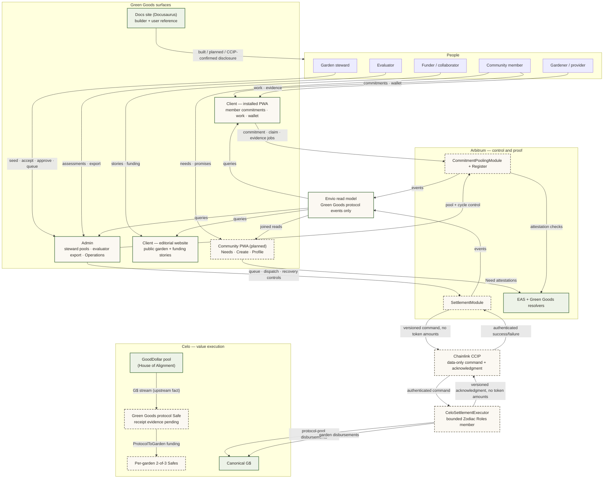

Notes:

- The installed PWA and the editorial website are the same client app in two presentation modes (`getClientPresentationMode`); the docs site is separate. Every surface carries built / planned / queued / dispatched / confirming / confirmed status labels so a reader never mistakes a plan for a live feature.
- The GoodDollar House of Alignment pool streams G$ directly into the Green Goods protocol Safe; Green Goods models only the ProtocolToGarden route onward (corrections-log §9). The protocol Safe is drawn **planned**, not built: its mechanism, address confirmation, and live receipt evidence are still pending partner evidence (`settlement-spec.md` §2), which is the same status D8 and D12 give it.
- The client PWA, editorial website, Admin, and the Envio read model carry the **existing surface, planned delta** treatment — they are live today, and this work adds planned pooling capability to each. That is why the story assets can label the same rails BUILT at the action level without contradicting this diagram.
- EAS and raw Celo transfers are outside Envio. The joined Community read is owned in shared/query composition, not fabricated in an Envio handler.
- The indexer records only SettlementModule and CeloSettlementExecutor protocol events. A Celo execution is visible before its acknowledgment, but only an authenticated success acknowledgment marks the Arbitrum attempt `Confirmed`.

## D1b. Contract/module topology and trust boundaries

**How to read this**: four trust boundaries, one job each. The application boundary queues intent but authorizes nothing. The Arbitrum boundary owns source state. Envio restates explicit events from both Green Goods contracts. The Celo executor moves value under a reviewed Safe + Zodiac scope, stores its idempotent outcome, then uses CCIP to acknowledge it.

```mermaid
flowchart TB
  subgraph APP["Application boundary — queues intent, authorizes nothing"]
    CPJOBS["CP offline jobs (planned)<br/>commitment · claim · evidence · workLink · confirmation"]
    EASJOBS["Community offline EAS jobs (planned)<br/>need · needSignal · testimony"]
    EASACTIONS["Online EAS actions (planned)<br/>NeedStatus · FundingAttribution"]
    TRANSFER["Online Celo wallet action (planned)<br/>canonical G$ send · never queued"]
  end
  subgraph ARB["Arbitrum trust boundary — authorizes and counts"]
    HATS["HatsModule<br/>membership and scoped roles"]
    GT["GardenToken<br/>optional non-blocking pool hook"]
    CPM["CommitmentPoolingModule<br/>state + access + EAS checks"]
    REG["CommitmentRegister<br/>onlyModule unit accounting"]
    SM["SettlementModule<br/>immutable route/source/executor scope"]
    WAR["WorkApprovalResolver<br/>non-blocking approval hook"]
    EAS["EAS + SchemaRegistry"]
    subgraph RESV["Community EAS resolvers (Sept)"]
      NR["NeedResolver"]
      NSR["NeedSignalResolver"]
      NSTR["NeedStatusResolver"]
      FAR["FundingAttributionResolver"]
    end
    V3["AssessmentResolver (existing UUPS, upgraded)<br/>v2 preserved · AssessmentV3 schema added"]
    CTR["CommunityTestimonyResolver (planned)<br/>Community Hat only"]
    TL["Deployment timelock<br/>gates route, batch limit,<br/>dispatcher, and fee-floor changes"]
  end
  ENV["Envio read model — indexing boundary<br/>only Green Goods contract events"]
  subgraph CELO["Celo trust boundary — moves value under scope"]
    SAFE["2-of-3 recovery Safes<br/>owners != Roles executors"]
    GD["Canonical G$ transfers"]
  end
  CCIP["Chainlink CCIP routers<br/>data-only command + acknowledgment"]
  CE["CeloSettlementExecutor<br/>immutable peer + bounded route"]

  CPJOBS -->|"module writes after on-chain revalidation"| CPM
  EASJOBS -->|"attestations after resolver checks"| EAS
  EASACTIONS -->|"online attestations"| EAS
  TRANSFER -->|"chain 42220 wallet transaction"| GD
  HATS --> CPM
  HATS --> SM
  GT -->|"try/catch"| CPM
  CPM --> REG
  CPM --> EAS
  EAS --> WAR
  WAR -->|"try/catch"| CPM
  EAS --> NR
  EAS --> NSR
  EAS --> NSTR
  EAS --> FAR
  EAS --> V3
  EAS --> CTR
  CPM -->|"events"| ENV
  REG -->|"events"| ENV
  SM -->|"events"| ENV
  TL -->|"timelocked config only"| SM
  SM -->|"versioned command; no token amounts"| CCIP
  CCIP --> CE
  CE -->|"typed canonical-G$ route only"| SAFE
  SAFE --> GD
  CE -->|"stored outcome + versioned acknowledgment"| CCIP
  CCIP --> SM

  classDef built fill:#edf3e8,stroke:#50784a,stroke-width:2px,color:#2a2722
  classDef planned fill:#fbf8f2,stroke:#6e6857,stroke-width:2px,stroke-dasharray:6 4,color:#2a2722
  classDef existingPlannedDelta fill:#fbf8f2,stroke:#50784a,stroke-width:2px,color:#2a2722
  class HATS,GT,WAR,EAS,GD built
  class CPJOBS,EASJOBS,EASACTIONS,TRANSFER,CPM,REG,SM,NR,NSR,NSTR,FAR,CTR,SAFE,CCIP,CE,TL planned
  class V3,ENV existingPlannedDelta
```

Boundary rules:

- **Application**: drafts and queued jobs are intent, never authority — every write is re-validated on-chain; nothing trusts a client claim.
- **Arbitrum**: HatsModule decides who may act; the pooling module owns state machines and EAS checks; the register counts units only for the module; the settlement module records value authorization but never custodies or calls Celo. Each Community resolver validates exactly one schema — **NeedResolver** (Need records), **NeedSignalResolver** (member signals on a Need), **NeedStatusResolver** (steward status updates), **FundingAttributionResolver** (receipt-checked funding references). Attestation authorship rules are not drawn here — D13b carries them.
- **Deployment timelock**: four settlement configuration changes — `setCcipRoute`, `setBatchSizeLimit`, `setDispatcher`, `setFeeReserveMinimum` — are reachable only through the timelock, and all four additionally require the module to be paused. Dependency wiring, `setPaused`, and `_authorizeUpgrade` are owner-direct with no timelock. D13b is the exact gate for each.
- **Envio**: restates emitted events into the read model — explicit fields only, no actor inference from `transaction.from`.
- **Celo + CCIP**: the executor validates its immutable source chain/sender and empty token amounts, then calls only the typed canonical-G$ route. Recovery owners are never executor owners. An authenticated Celo acknowledgment, not a human report or timeout, finalizes Arbitrum state.

Trust rules: no provider may confirm their own delivery, including steward fallback; no recovery owner may be a Safe executor; no human can verify a receipt; no handler infers an actor from `transaction.from`; no contract enumerates all cycles or claims to make a transition.

## D2. Offer/request → work → approval → confirmation → fulfillment

**How to read this**: the full happy path of one promise, left to right in time — created, claimed, delivered through the existing Work → WorkApproval rail, confirmed by the counterparty, and rewarded. The steward performs every one of their steps in the Admin app (Hub work stage + garden Pool tab — W7/W13); the member acts in the client PWA. The payout lane at the end covers **non-G$ declared rewards only** — G$ rewards leave this diagram and queue on the SettlementModule (D9, D12).

Preconditions: pool `Open`; an optional cycle exists, belongs to the pool, and is `Open`. For an Offer, the creator is provider and accepted recipient confirms. For a Request, the accepted claimant is provider and the creator confirms. The stored `providerGarden` controls DomainImpact Work and assessment validation even when the commitment remains in the root protocol pool. Provider self-confirmation fails on every path.

The single all-steps diagram was accurate but carried 32 messages across ten participants, so it is drawn as one compact overview plus three acts on the **same act boundaries as D6** — D2.1 is D6a, D2.2 is D6b, D2.3 is D6c, seen from the message side instead of the state side. The acts zoom into the overview and never disagree with it.

#### D2.0 Overview — one promise, end to end

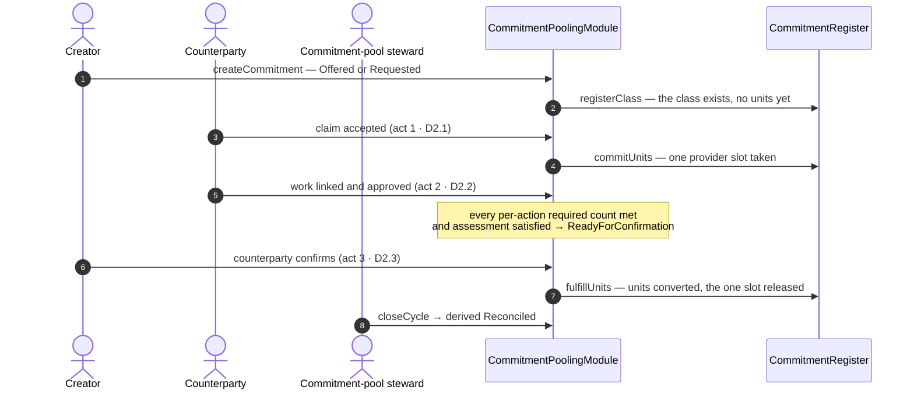

#### D2.1 Act 1 — Creation and acceptance

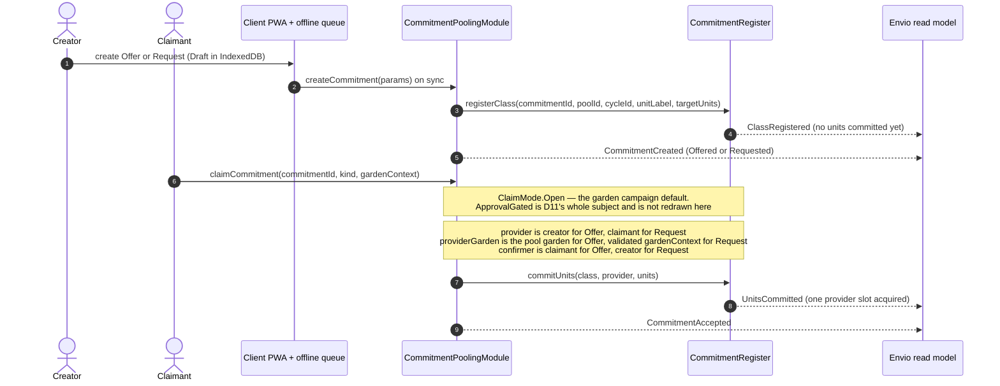

#### D2.2 Act 2 — Delivery, work, and approval

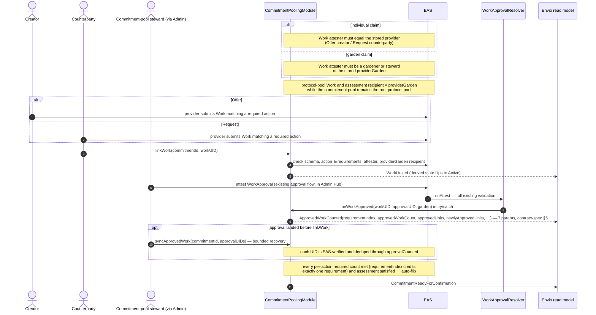

#### D2.3 Act 3 — Confirmation, fulfillment, reward, and close

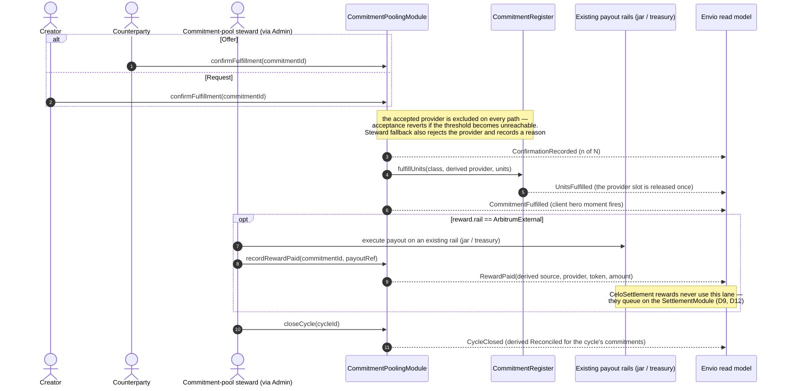

## D3. Analog capture + lightweight evidence (review-is-confirmation)

**How to read this**: the lightweight alternative to D2. There is no Work rail and no approval step, because for these kinds the counterparty's confirmation *is* the review. Watch the authorship line: the steward types the record, but the member remains the named promise source — `recordedBy` marks the steward as scribe and never as owner. The evidence step is offline-first: it queues in IndexedDB and may sync hours later.

The SupportService / OperatorCaptured path: no Work/WorkApproval rails, no work requirement, counterparty confirmation IS the review (register #20). The member stays the named promise source; the steward is metadata (`recordedBy`).

**When this happens (use cases)**: an elder gardener makes a promise in conversation and the steward records it from a paper field log; a member offers childcare, meals, or transport for a community work day — help that has no Work/approval rail; a field visit is captured fully offline and the evidence photos sync hours later. In every case the member stays the named promise source (`recordedBy` marks the steward as scribe, never as owner), and because these kinds carry no work requirement, the counterparty's confirmation *is* the review — no separate approval step exists.

```mermaid
sequenceDiagram
  autonumber
  actor MEM as Member (promise source)
  actor OP as Commitment-pool steward
  actor CP as Counterparty (confirmer)
  participant ADM as Admin capture flow
  participant PWA as Client PWA + offline queue
  participant M as CommitmentPoolingModule
  participant IDX as Envio read model

  MEM--)OP: promise made off-app (conversation, field visit)
  OP->>ADM: analog capture — member, kind, terms
  ADM->>M: createCommitment(OperatorCaptured, onBehalfOf = member)
  M-->>IDX: CommitmentCreated(creator = member, recordedBy = steward)
  Note over ADM,M: member's detail shows<br/>"Recorded by your steward on your behalf.<br/>The promise stays yours."
  MEM->>PWA: attach evidence offline (photo, link, note)
  Note over ADM,PWA: evidence job queued in IndexedDB,<br/>media serialized, survives restart
  PWA->>M: attachEvidence(commitmentId, cid) on sync
  M-->>IDX: EvidenceAttached (derived EvidenceSubmitted)
  MEM->>M: submitForConfirmation(commitmentId)
  Note over PWA,IDX: allowed because the commitment carries no work requirement,<br/>at least one evidence is attached,<br/>and the declared assessment is attached — the same<br/>assessment predicate D6b applies; DomainImpact is rejected
  M-->>IDX: CommitmentReadyForConfirmation
  CP->>M: confirmFulfillment(commitmentId)
  M-->>IDX: ConfirmationRecorded → CommitmentFulfilled
  Note over CP,M: provider self-confirmation is blocked on-chain.<br/>Steward fallback also rejects the provider<br/>and always carries a visible reason
```

## D4. Pool state machine

**How to read this**: six on-chain states and the exact call that moves between them. Two of them are easy to confuse and mean opposite things — `Paused` is the emergency freeze that stops new promises, while `Composted` is archival rest that keeps the full history readable and can wake again through `reopenPool`. Every transition is a rare, deliberate steward console action; nothing here happens automatically.

Every pool transition is on-chain. One pool per garden, idempotent registration; the protocol pool is the root garden's pool (tokenId 1).

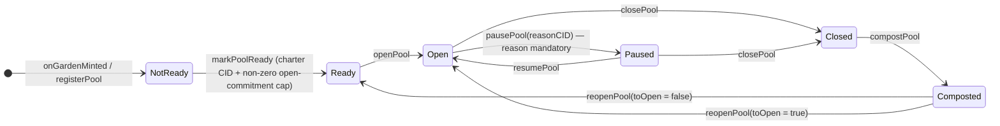

**What each state allows**:

| State | What it means | What's allowed | Who acts |
|---|---|---|---|
| NotReady | garden minted, pool registered, onchain charter/cap predicate not yet met or app Baseline preflight still missing | configuration only | steward |
| Ready | onchain charter + non-zero provider open-commitment cap are present; the app offered the write only after a current non-revoked Baseline preflight | seed cycles; open the pool | steward |
| Open | promises can flow | create / claim / confirm commitments; seed and open cycles | members + steward |
| Paused | **the emergency freeze** | create, claim, Ready-submit, and confirm are disabled; browse, evidence/work linkage, cancellation, expiry, and dispute recovery remain available | steward (resume); existing actors keep allowed evidence/recovery paths |
| Closed | wind-down | no new activity; terminal cleanup of open commitments | steward |
| Composted | **archival rest — history + "ready for the next season"** | read everything; `reopenPool` back to Ready or Open; nothing else | steward |

Composting is archival, not deletion and not the freeze — `Paused` is the freeze. A composted pool keeps its full promise history visible and can wake for a new season via `reopenPool`. Pool-level `Paused` blocks new commitments, claims, and confirmations on that pool only; module-wide `setPaused` blocks operational mutations but keeps owner configuration, unpause, `cancelCommitment`, `expireCommitment`, and `resolveDispute` available for safe wind-down.

## D5. Cycle state machine (types: Season, Campaign)

**How to read this**: the chain stores only five states. The three extra boxes are provenance, not new chain states — grey `Draft` lives in admin IndexedDB, and amber `InProgress`/`Reviewing` are indexer-derived overlays of on-chain `Open`, which is why transitions leave them that the on-chain table lists once under `Open`. There is deliberately no loop back: a cycle ends, and the next round is a fresh `seedCycle` on the same pool.

On-chain enum stores `Seeded / Open / Reconciled / Composted / Cancelled`. `Draft` is app-only; `InProgress` and `Reviewing` are derived overlays of on-chain `Open`.

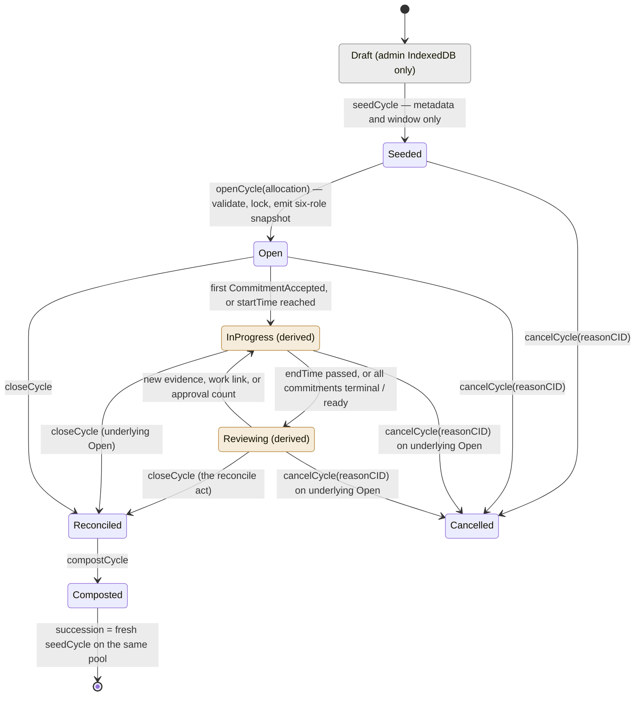

`InProgress` is on-chain `Open`, so `cancelCycle` covers it; Draft cancels are an off-chain discard. Succession is derived by pool ordering — no on-chain predecessor pointer. Opening validates **pool `Open`**, cycle existence, pool ownership, `Seeded` state, and an allocation whose basis points sum to exactly 10,000. Because `InProgress` and `Reviewing` are derived overlays of on-chain `Open`, the four edges leaving them (`→ Cancelled`, `→ Reconciled`) are the spec's single `Open →` rows drawn at overlay resolution — the diagram is deliberately a superset of the on-chain transition table, and no transition here exists that the chain does not allow. `Pool.openSeasonCycleId` permits exactly one open Season in O(1); any number of Campaigns may be open concurrently and no transition enumerates cycles.

**Reading the middle of the machine**: `InProgress` and `Reviewing` are indexer-derived overlays of on-chain `Open` — the chain never stores them. A cycle sits `Open`, starts reading as `InProgress` at the first accepted commitment (or when `startTime` arrives), flips to `Reviewing` when the window ends or every commitment is terminal/ready, and flips back whenever new evidence lands. `closeCycle` is the reconcile act.

**There is deliberately no loop here**: `Composted` is terminal *for a cycle*. The loop lives at the pool — a fresh `seedCycle` (Season or Campaign) on the same pool is how the next round begins, and the composted cycle's aggregates roll into pool history. (The pool machine, D4, is the one that can reopen.)

**Allocation split**: the six role percentages — gardeners / treasury / steward / evaluator / community / funder, stored on-chain as basis points where 10000 bps = 100% — are supplied atomically to `openCycle`, validated, stored as the immutable cycle snapshot, emitted in `CycleOpened`, and become the cycle's impact-certificate allowlist allocation at close (contract-spec §9.4; default Model 1: 60 / 15 / 10 / 5 / 5 / 5). `seedCycle` carries no allocation.

## D6. Commitment state machine (overview + three acts)

**How to read this**: one promise's whole life. Read D6.0 first — five boxes, the entire arc. The three acts then zoom in without ever contradicting the overview: act 1 is how a promise gets a provider, act 2 is how delivery becomes provable, act 3 is every way it ends. Colour is provenance, not status: paper = stored on-chain, amber = derived by the indexer, grey = app-only. D2 is the same three acts drawn as messages instead of states.

On-chain enum stores `Offered / Requested / Accepted / ReadyForConfirmation / Fulfilled / Cancelled / Expired / Disputed`. `Draft` is app-only; `Active`, `EvidenceSubmitted`, `PartiallyApproved`, and `Reconciled` are derived. The single all-states diagram was accurate but hard to digest, so it is drawn as one compact overview plus three lifecycle acts — the acts zoom into the overview and never disagree with it.

#### D6.0 Overview — the whole life at a glance

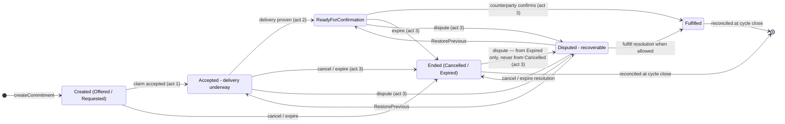

#### D6a. Act 1 — Claim & acceptance

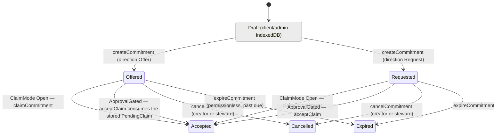

An approval-gated `claimCommitment` stores a PendingClaim and leaves the on-chain state untouched; `declineClaim` clears only that claimant; acceptance consumes the stored terms, derives provider and providerGarden, and commits units exactly once. Competing pending claims resolve by supersession — the full decline/accept/supersede choreography is D11.

#### D6b. Act 2 — Delivery & evidence (`Accepted` → `ReadyForConfirmation`)

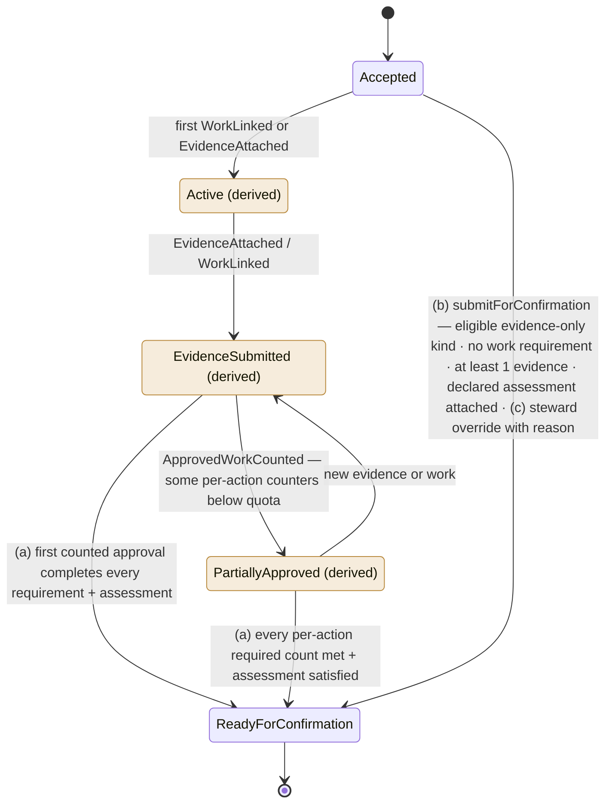

While the derived overlays are showing, the on-chain state remains `Accepted` — so the cancel/expire/dispute transitions in act 3 apply to all of them. The two delivery styles by kind: **DomainImpact** runs the full Work → WorkApproval rail with per-action required counts (`requirementIndex` credits exactly one requirement per approval — amendment 2026-07-18); **SupportService / OperatorCaptured / SeasonCampaign** seeded with no work requirement go through path (b), where the counterparty's confirmation IS the review (D3).

#### D6c. Act 3 — Resolution (confirmation, endings, disputes, reconciliation)


The module stores `preDisputeState` before entering `Disputed`; `RestorePrevious` restores that exact state. There is no `Reconciled` dispute resolution. Unit accounting is exact:

- create registers the class but commits no units;
- cancellation or expiry from `Offered`/`Requested` releases nothing;
- acceptance commits units and acquires one provider open-commitment slot once, regardless of `targetUnits`;
- cancellation or expiry from `Accepted`/`ReadyForConfirmation` releases those committed units and that one slot once;
- fulfillment converts committed units with `fulfillUnits` and releases that one slot;
- raising or restoring a dispute has no unit or slot effect;
- resolving to `Fulfilled`, `Cancelled`, or `Expired` applies the same conversion/release only when units and the slot are still held; a pre-dispute `Expired` record cannot become `Fulfilled` and never releases twice.

Cycle-less commitments (`cycleId == 0`) derive `Reconciled` from `PoolClosed`; cycle-scoped terminal commitments derive it from `CycleClosed`.

## D7. Indexer entity delta (ERD)

Ten NET-NEW pooling entities, all derived exclusively from module + register events (`chainId-identifier` composite IDs). `GARDEN` is the existing entity; settlement entities are shown separately in D7b. The docs-site ERD gains this delta at ship via PRD-727 (historical label PRD-680).

**Count-safe units model**: every commitment keeps its own exact `unitLabel`, `targetUnits`, and per-commitment `approvedUnits`. Pool/cycle totals never add unlike labels. `CommitmentUnitSummary` groups only exact UTF-8 label matches (`hours` and `Hours` are distinct), while `CommitmentProviderExposure` counts concurrent accepted commitments regardless of their quantities:

- `promiseKeptRate = commitmentsFulfilled / commitmentsDue` is the only cross-commitment percentage;
- `openCommitmentCount` is a count, not a unit total, and the provider cap consumes one slot per accepted commitment;
- exact-label summaries keep `expectedUnits`, `approvedUnits`, `fulfilledUnits`, and `openUnits` for operational detail;
- active-cycle surfaces show state counts plus exact-label groups, never a synthetic mixed-unit progress rate.

#### D7.0 Entity map — names and relationships only

**How to read this**: eleven boxes and their cardinality, with no fields. Read this first to check trust and shape; the two blocks below carry the field detail. `GARDEN` is the existing entity — the other ten are NET-NEW. Nothing here is a storage layout: these are indexer read-model entities derived from module and register events.

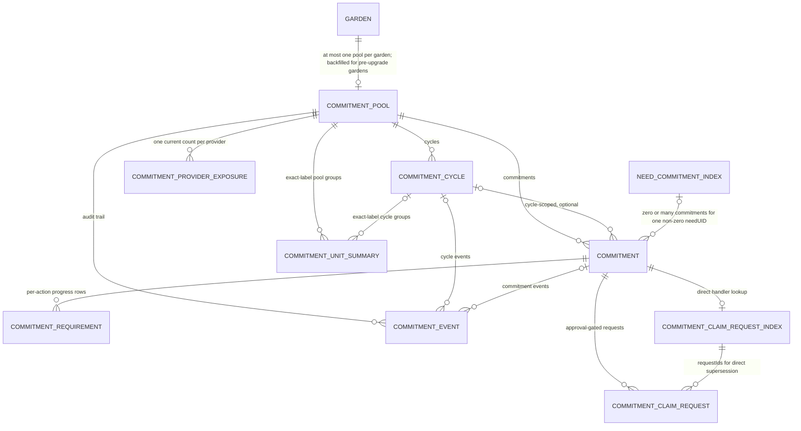

#### D7.1 Commitment core — pool, cycle, commitment, requirements, audit

**How to read this**: the six entities carrying a commitment's own identity, state, and accounting. Every field is event-derived; derived overlays such as `Active` and `PartiallyApproved` are computed in shared selectors and never stored.

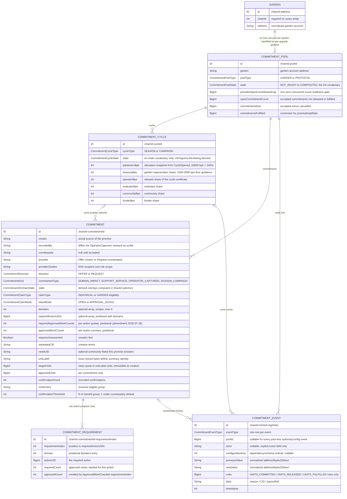

#### D7.2 Claims, counts, and lineage

**How to read this**: the five entities that exist so a handler never scans the database — claim-request rows plus their direct index, the exact-label unit summaries, the per-provider concurrent count, and the Need lineage index. `COMMITMENT`, `COMMITMENT_POOL`, and `COMMITMENT_CYCLE` appear here as bare boxes; their fields are in D7.1.

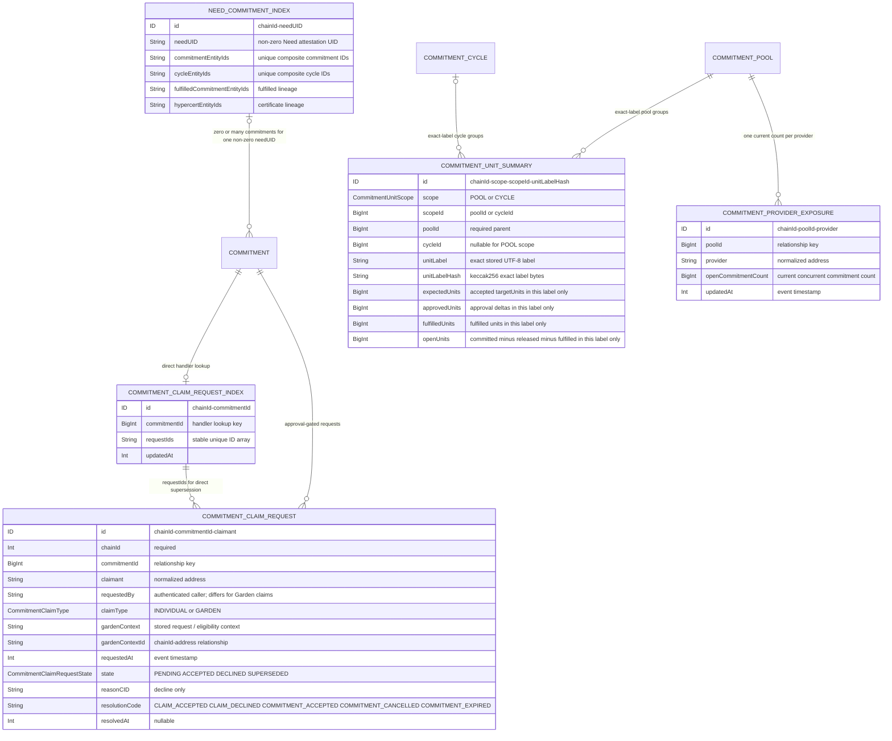


On acceptance, the handler loads `COMMITMENT_CLAIM_REQUEST_INDEX` by `chainId-commitmentId`, marks the accepted request `ACCEPTED`, and marks every other still-pending indexed request `SUPERSEDED`. Pre-acceptance commitment cancellation or expiry uses the same indexed IDs to supersede every pending row with its resolution code. Decline updates only the named request. `ModuleUpdated` creates one pool-less `COMMITMENT_EVENT` with normalized old/new module addresses and no accounting mutation; it never invents pool `0`. No handler performs a database-wide scan, and no audit-event actor is inferred from `transaction.from`. `Garden.id` migration requires a full replay/backfill and shared-query cutover; every relationship uses `chainId-*` IDs.

Full field lists: contract-spec §8.2. The ERD intentionally shows the key identity, relationship, state, and accounting fields needed to review trust and cardinality; it is not a substitute for the canonical GraphQL block. Only `promiseKeptRate` divides across commitments. Exact-label unit rows and provider count rows remain integer event-derived facts.

## D7b. Settlement ERD

**How to read this**: `SettlementConfiguration` always identifies the exact indexed
source/executor contract and local CCIP facts. Peer selector/address/EVM identity remain nullable
and `peerConfigured = false` for an independent component rehearsal; only a verified supported
lane may populate a route-ready peer. `SettlementAccount` is the Arbitrum-owned garden account;
`SettlementGardenRoute` is its Celo Safe/Roles execution route.
`Disbursement` and `SettlementBatch` are Arbitrum-owned subjects, `SettlementMessage` stores each
command or acknowledgment by event chain and CCIP message ID, and `SettlementExecution` stores
the idempotent Celo result by execution key. The joins distinguish a Celo execution from an
Arbitrum acknowledgment without deriving an EVM chain ID from a CCIP selector or indexing raw
G$ transfers.

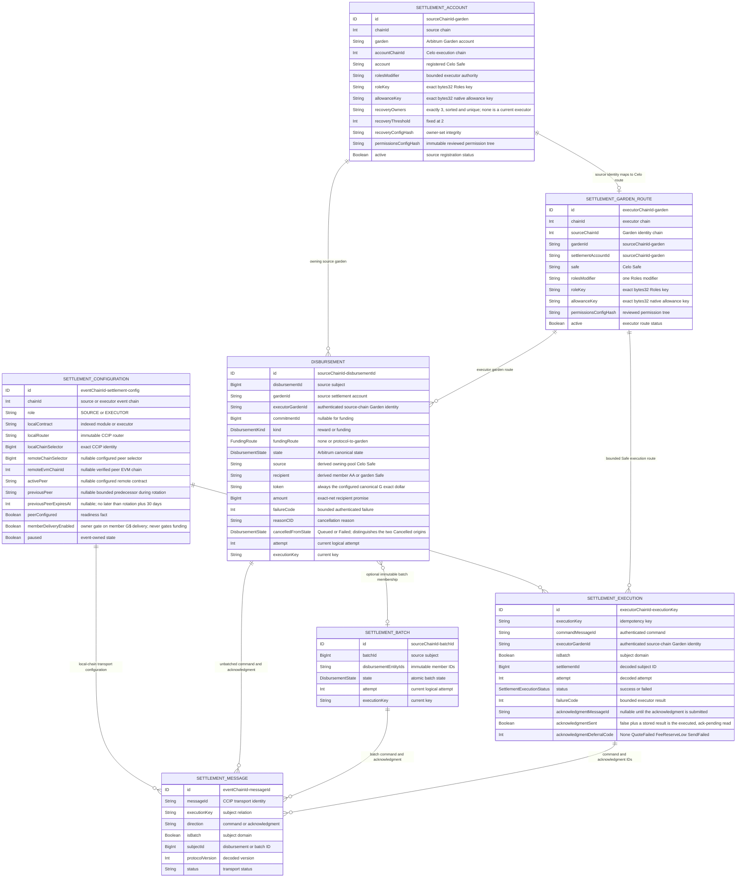

The diagram shows all seven canonical settlement entities. Full field lists and exact handler
rules remain normative in `settlement-spec.md` §6. None are claims about currently deployed or
indexed state.

## D7c. Fulfilled-commitment Hypercert cut-over and indexer delta

**How to read this**: the existing Work-attestation certificate path stays intact for legacy work. Commitment Pooling adds a second input only after a commitment is `Fulfilled`: its immutable terms, Need lineage, approved Work/evidence, and six-share BPS class allocation are composed into the existing IPFS → Merkle → mint pipeline. The certificate indexer stores the bundle kind and Commitment/Need lineage; it does not reinterpret promise state or combine unit labels.

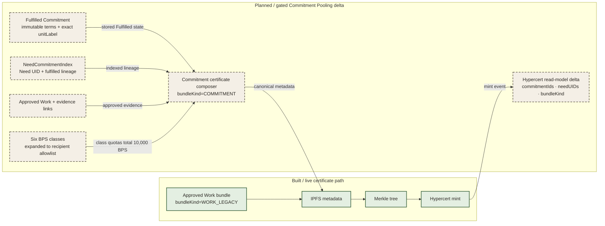

---

## D7d. Indexer pipeline and the `Garden.id` cut-over

**How to read this**: D7 and D7b show the entities that come *out*; this shows how they are produced. Three rules govern every handler and none of them is optional: an entity is created-if-not-exists so an out-of-order event never drops a row, unit events converge regardless of arrival order because each one is an integer delta rather than a recomputed total, and no handler ever infers an actor from `transaction.from` or scans the database. The bottom lane is the one-time migration: `Garden.id` becomes a `chainId-address` composite, which is a breaking change and therefore a **full replay** with a single shared-query cutover — there is deliberately no mixed-ID period.

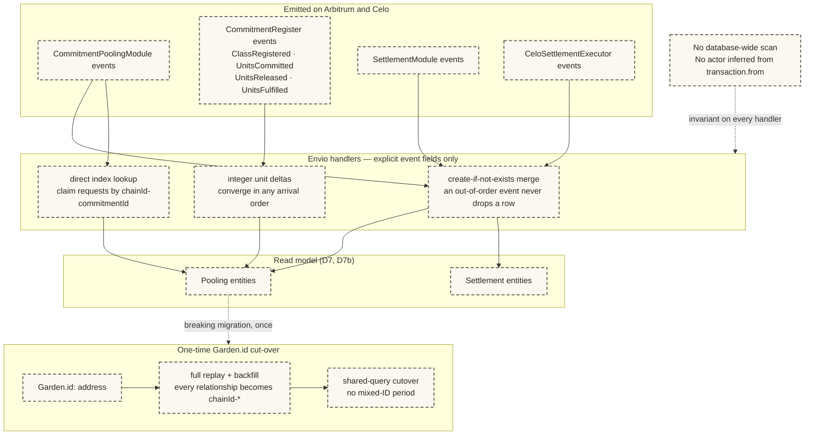

The pipeline itself is the existing Envio runtime, which is live; every box above is the planned pooling delta to it. `ModuleUpdated` creates one pool-less `COMMITMENT_EVENT` and never invents pool `0`. EAS attestations and raw Celo G$ transfers are outside this pipeline entirely — the joined Community read is composed in shared query code, not fabricated in a handler.

---

## D8. G$ funding topology, Safe recovery, and CCIP boundary

**How to read this**: canonical G$ stays on Celo. Arbitrum sends a data-only command; the Celo executor derives the Safe/token call, executes through a bounded Zodiac role, stores the outcome, and sends a data-only acknowledgment. The executor is never a Safe owner. A message timeout never creates a second payment attempt. **Three edge meanings, three arrow styles** — a thick solid arrow moves G$, a plain arrow carries a protocol message or read, and a dotted arrow is an ownership relation, never a transfer.

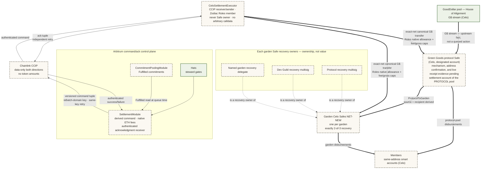

The Safe owner set remains exactly protocol recovery multisig, Dev Guild recovery multisig, and one named garden recovery delegate, threshold 2. The `CeloSettlementExecutor` is installed only as the reviewed Zodiac Roles v2 member with an exact `bytes32` role key, native `WithinAllowance(allowanceKey)`, canonical G$ transfer conditions, and per-transfer/batch/fee/period caps; there is no separate Allowance Module. Every amount is an exact-net recipient promise, receiver-pays fails closed, and source/recipient balance deltas are checked. Source commands and automatic acknowledgments are sponsored from monitored native reserves; a permissionless acknowledgment retry may instead supply the exact CELO quote without reducing the reserve. Protocol-Safe inflow remains an external treasury fact; the command path models ProtocolToGarden and commitment rewards only.

## D9. Settlement sequence with failure/retry

**How to read this**: three separate concerns used to share one canvas, so they are drawn separately — the path a healthy settlement takes (D9.0), what stops a second payment when a message arrives twice (D9.1), and the three independent retry lifecycles (D9.2). Across all three: one immutable execution key, and only the authenticated success acknowledgment for the subject's **current key and attempt** turns Arbitrum state into `Confirmed`.

Three distinct principals act, and D13b is the exact gate for each: the commitment-pool steward queues a disbursement, the **protocol** steward or module owner queues funding, and acknowledgment retry is **permissionless** to anyone supplying the exact CELO fee. Dispatch and command retry additionally accept the configured `dispatcher`.

#### D9.0 The healthy path — queue, dispatch, execute, acknowledge

```mermaid
sequenceDiagram
  autonumber
  actor OP as Commitment-pool steward (via Admin Operations)
  actor PST as Protocol steward / module owner
  participant SM as SettlementModule (Arbitrum)
  participant CPM as CommitmentPoolingModule
  participant AR as CCIP Router (Arbitrum)
  participant CE as CeloSettlementExecutor
  participant CR as CCIP Router (Celo)
  participant SAFE as Owning-pool Celo Safe
  participant IDX as Envio read model

  OP->>SM: queueDisbursement(commitmentId)
  PST->>SM: queueFunding(garden, amount) — protocol steward or owner only
  SM->>CPM: read canonical eligible facts
  SM-->>IDX: DisbursementQueued ("support is queued")
  OP->>SM: dispatchDisbursement or dispatchBatch
  SM->>AR: ccipSend(command tuple, no tokens, snapshotted peer/version/gas)
  SM-->>IDX: SettlementCommandDispatched (key, messageId, peer, payloadHash)
  AR-->>CR: CCIP delivery
  CR->>CE: authenticated command
  CE->>SAFE: fixed G$ transfer/batch through Zodiac Roles native allowance
  CE-->>IDX: SettlementExecutionStored(Success) ("confirming arrival")
  Note over CE: the outcome is always stored before the acknowledgment
  CE->>CR: ccipSend(ack tuple, no tokens)
  CE-->>IDX: AcknowledgmentSent(reserveFunded)
  CR-->>AR: CCIP delivery
  AR->>SM: authenticated acknowledgment
  SM-->>IDX: SettlementAcknowledged(success=true) → Confirmed
```

#### D9.1 Idempotency — why a repeated message never pays twice

```mermaid
sequenceDiagram
  autonumber
  participant CR as CCIP Router (Celo)
  participant CE as CeloSettlementExecutor
  participant SAFE as Owning-pool Celo Safe
  participant GD as G$ token (Celo)
  participant SM as SettlementModule (Arbitrum)
  participant IDX as Envio read model

  CR->>CE: authenticated command
  alt executionKey already has a stored terminal outcome
    CE-->>IDX: DuplicateSettlementMessage
    Note over CE,SAFE: the stored outcome is reused —<br/>the Safe route is not called again
  else new executionKey
    CE->>GD: quote getFees + snapshot balances
    CE->>CE: enforce exact-net fee and gross-debit policies
    CE->>SAFE: fixed G$ transfer/batch through Zodiac Roles native allowance
    alt bounded Safe execution succeeds
      SAFE->>GD: canonical G$ transfers
      CE-->>IDX: SettlementExecutionStored(Success, originating module/version)
    else authenticated policy or bounded execution fails
      CE-->>IDX: SettlementExecutionStored(Failed, failureCode)
    end
    Note over CE: store the outcome before acknowledging, always
  end
  Note over SM,IDX: the same rule holds on the Arbitrum side —<br/>a duplicate or stale acknowledgment is emitted and ignored, never applied
  SM-->>IDX: DuplicateAcknowledgmentIgnored / StaleAcknowledgmentIgnored
```

#### D9.2 Three independent retry lifecycles

```mermaid
sequenceDiagram
  autonumber
  actor OP as Commitment-pool steward or configured dispatcher
  actor ANY as Anyone (permissionless)
  participant SM as SettlementModule (Arbitrum)
  participant AR as CCIP Router (Arbitrum)
  participant CE as CeloSettlementExecutor
  participant CR as CCIP Router (Celo)
  participant SAFE as Owning-pool Celo Safe
  participant IDX as Envio read model

  rect rgb(244, 239, 230)
  Note over OP,IDX: 1 · command retry — the command may not have arrived
  OP->>SM: retryCommand(disbursementId) / retryBatchCommand(batchId)
  SM->>AR: ccipSend(same tuple + same destination snapshot, new messageId)
  SM-->>IDX: SettlementCommandRetried (same key, same attempt, new messageId)
  Note over CE,SAFE: a duplicate executionKey reuses the stored outcome —<br/>no second G$ execution
  end

  rect rgb(244, 239, 230)
  Note over ANY,IDX: 2 · acknowledgment retry — the outcome exists but was not reported
  CE-->>IDX: AcknowledgmentDeferred(QuoteFailed / FeeReserveLow / SendFailed)
  ANY->>CE: quote + retryAcknowledgment{value: exact CELO fee}(executionKey)
  CE->>CR: resend the stored outcome
  Note over CE,SAFE: caller-funded, never consumes the reserve;<br/>the Safe route is not called again
  end

  rect rgb(244, 239, 230)
  Note over OP,IDX: 3 · requeue — an authenticated failure earns a new attempt
  OP->>SM: requeue(disbursementId)
  SM-->>IDX: DisbursementRequeued (attempt incremented)
  Note over OP,SM: only after an authenticated failure; one member at a time;<br/>an immutable failed batch is never requeued as a batch
  end

  Note over SM,CE: a submitted-but-slow message is not a deferral and needs no retry.<br/>Delay alone never cancels, never creates an attempt, and never pays twice
```

## D10. Disbursement state machine (all module-native, on-chain)

**How to read this**: five stored states, and the one rule that governs all of them — **delivery is not confirmation**. `Dispatched` self-loops for every kind of waiting (command retry, delivery delay, Celo executed with the acknowledgment still pending), and only an authenticated acknowledgment for the current key and attempt leaves it. Cancellation is reachable from `Queued` or an authenticated `Failed`, never from `Dispatched` — lateness alone is not a terminal outcome. D10b maps these five onto the nine states a member actually sees.

```mermaid
stateDiagram-v2
  direction LR
  [*] --> Queued : queueDisbursement / queueFunding — canonical facts
  Queued --> Dispatched : dispatch command (executionKey + messageId)
  Dispatched --> Dispatched : same-key command retry / delivery delay / Celo executed ack pending
  Dispatched --> Confirmed : authenticated success acknowledgment for current key/attempt
  Dispatched --> Failed : authenticated current failure acknowledgment
  Failed --> Queued : requeue(disbursementId) — one member, attempt++; a failed batch is never requeued as a batch
  Failed --> Cancelled : cancelDisbursement(disbursementId, reasonCID)
  Queued --> Cancelled : cancelDisbursement(unbatched disbursementId, reasonCID)
  Confirmed --> [*]
  Cancelled --> [*] : frees the commitment for a fresh queue
```

**What each state allows**:

| State | What it means | What's allowed next | Who acts |
|---|---|---|---|
| Queued | steward has queued canonical eligible facts; nothing dispatched | dispatch through the frozen entrypoint; cancel an unbatched item or cancel the whole immutable batch | resolved settlement steward |
| Dispatched | command sent; execution or acknowledgment may still be pending | wait; retry same command; retry stored acknowledgment from Celo | resolved steward / anyone for destination ack retry |
| Confirmed | authenticated success acknowledgment for the current key/attempt received | terminal — “support arrived” | Celo executor through CCIP |
| Failed | authenticated current execution-failure acknowledgment received | requeue **each failed member individually** as a new next attempt, or terminally cancel; the immutable failed batch is never rewritten or requeued as a batch | resolved settlement steward |
| Cancelled | withdrawn while Queued, or closed after authenticated Failed delivery | terminal for that execution key | resolved settlement steward |

For a Queued batch, the `Queued -> Cancelled` transition is
`cancelBatch(batchId, reasonCID)`: one atomic transition over the immutable member
set. `cancelDisbursement` rejects a Queued member whose `batchId != 0`, so no
partial queued-batch state can exist.

A failed Celo leg never changes Commitment Pooling state. `SettlementExecutionStored(Success)` without the Arbitrum acknowledgment derives “confirming arrival” while stored Arbitrum state remains `Dispatched`. A delivery timeout cannot cancel or create a new attempt. Cancellation is allowed from Queued or an authenticated Failed result, never from Dispatched; a Failed member may instead be explicitly requeued as a new attempt.

## D10b. Settlement status the member sees (5 stored, 9 rendered)

**How to read this**: the chain stores five states; the member surface renders nine. This is the map between them, and the reason the two vocabularies never contradict each other. Read the middle column as the *extra input* that splits one stored state into several rendered ones — Celo executor events and a delay timer. Two facts matter most: **`support-delayed` has no on-chain counterpart at all** — it is a client-side timer over the `Dispatched` timestamp and it changes no authority, no state, and no eligibility — and **only an authenticated success acknowledgment produces "support arrived"**. Nothing a human observes, and no elapsed time, can move a member into the arrived state.

```mermaid
flowchart LR
  subgraph ON["Stored on Arbitrum (D10)"]
    Q["Queued"]
    D["Dispatched"]
    C["Confirmed"]
    F["Failed"]
    X["Cancelled"]
  end

  subgraph EXTRA["Extra derivation input"]
    T["client delay timer<br/>over the Dispatched timestamp"]
    CELO["Celo executor events<br/>SettlementExecutionStored · AcknowledgmentSent"]
    ORIG["cancelledFromState<br/>Queued or Failed"]
  end

  subgraph UI["Rendered to the member (W2)"]
    S1["support-queued<br/>“support is queued”"]
    S2["support-en-route<br/>“support on its way”"]
    S3["support-delayed<br/>“taking longer than usual”"]
    S4["support-executed<br/>“confirming arrival”"]
    S5["support-confirming<br/>“confirming arrival”"]
    S6["support-arrived<br/>“support arrived”"]
    S7["support-failed"]
    S8["support-cancelled-queued<br/>“withdrawn before sending”"]
    S9["support-cancelled-failed<br/>“closed after a failed attempt”"]
  end

  Q --> S1
  D --> S2
  D --> S3
  T -.->|"time only — no state change"| S3
  D --> S4
  CELO -.->|"execution stored"| S4
  CELO -.->|"acknowledgment sent, not yet received"| S5
  D --> S5
  C --> S6
  F --> S7
  X --> S8
  X --> S9
  ORIG -.->|"selects which cancellation copy"| S8
  ORIG -.->|"selects which cancellation copy"| S9

  classDef planned fill:#fbf8f2,stroke:#6e6857,stroke-width:2px,stroke-dasharray:6 4,color:#2a2722
  classDef derived fill:#f6ecdc,stroke:#b98a3e,stroke-width:2px,color:#2a2722
  class Q,D,C,F,X,S1,S2,S6,S7,S8,S9 planned
  class T,CELO,ORIG,S3,S4,S5 derived
```

Amber marks everything derived rather than stored. `support-executed` and `support-confirming` share the same member-facing sentence deliberately: the member does not need to distinguish "the Celo transfer happened" from "we are waiting for the receipt", only that arrival is not yet certified. Settlement-record-first precedence applies throughout — the settlement record, never the commitment state, determines which of the nine renders.

## D11. Approval-gated claim request, decline, acceptance, and supersession

**How to read this**: two people want the same commitment. Each `claimCommitment` stores its own PendingClaim (the on-chain commitment state does not move). The steward may decline one claimant without touching the others, or accept one — at which point every other pending request reads as superseded. Declines and supersessions carry distinct member-facing meanings via `resolutionCode`.

```mermaid
sequenceDiagram
  autonumber
  actor A as Claimant A
  actor B as Claimant B
  actor OP as Commitment-pool steward
  actor ANY as Anyone (permissionless)
  participant M as CommitmentPoolingModule
  participant IDX as Envio read model
  participant RI as CommitmentClaimRequestIndex

  A->>M: claimCommitment(id, kind, gardenContext)
  M-->>IDX: ClaimRequested(id, claimantA, requestedByA, kind, gardenContext, requestedAt)
  IDX->>RI: append request A to chainId-id index
  B->>M: claimCommitment(id, kind, gardenContext)
  M-->>IDX: ClaimRequested(id, claimantB, requestedByB, kind, gardenContext, requestedAt)
  IDX->>RI: append request B
  alt steward declines A
    OP->>M: declineClaim(id, A, reasonCID)
    Note over M,IDX: clear only A's stored PendingClaim
    M-->>IDX: ClaimDeclined(id, A, reasonCID)
    Note over IDX,RI: A=DECLINED and B remains PENDING
  else steward accepts B
    OP->>M: acceptClaim(id, B)
    Note over M,IDX: consume B's stored claimant, requestedBy, kind,<br/>gardenContext, requestedAt, and active terms —<br/>then derive provider and providerGarden
    M-->>IDX: CommitmentAccepted(id, B, counterparty, kind, gardenContext, provider, providerGarden)
    IDX->>RI: load request IDs by chainId-id
    Note over IDX,RI: B=ACCEPTED and every other<br/>pending request=SUPERSEDED
  end
  opt separate path: commitment cancelled or expired before acceptance
    OP->>M: cancelCommitment(id, reasonCID) — creator or steward before acceptance
    ANY->>M: expireCommitment(id) — permissionless once past due
    M-->>IDX: CommitmentCancelled or CommitmentExpired
    IDX->>RI: load request IDs by chainId-id
    Note over IDX,RI: every pending row=SUPERSEDED<br/>resolutionCode names cancellation or expiry
  end
```

There is no numeric sentinel or database-wide query. A later request after a decline is a fresh active request with a new timestamp; acceptance is deterministic because it cannot substitute caller-provided terms. Superseded copy distinguishes another accepted provider from commitment cancellation/expiry through `resolutionCode`.

## D11b. Claim-request state machine

**How to read this**: D11 is the choreography between people; this is the machine each individual request runs. One request per claimant, four states, and every terminal state carries a `resolutionCode` so the member sees *why* it ended rather than just that it did. The distinction the copy depends on is inside `SUPERSEDED`: `COMMITMENT_ACCEPTED` means someone else got it, while `COMMITMENT_CANCELLED` / `COMMITMENT_EXPIRED` mean the commitment itself went away. Only `DECLINED` carries a steward-authored `reasonCID`.

Note the state a claim request never has: there is no "withdrawn". A claimant does not retract a request — it resolves when the steward acts or when the commitment ends.

```mermaid
stateDiagram-v2
  direction LR
  PENDING: PENDING (stored terms, commitment state unchanged)
  ACCEPTED: ACCEPTED (resolutionCode CLAIM_ACCEPTED)
  DECLINED: DECLINED (resolutionCode CLAIM_DECLINED + reasonCID)
  SUPERSEDED: SUPERSEDED (resolutionCode names the cause)

  [*] --> PENDING : claimCommitment — ApprovalGated only
  PENDING --> ACCEPTED : acceptClaim(id, claimant) — consumes the stored terms exactly once
  PENDING --> DECLINED : declineClaim(id, claimant, reasonCID) — clears only this claimant
  PENDING --> SUPERSEDED : another claimant accepted — COMMITMENT_ACCEPTED
  PENDING --> SUPERSEDED : commitment cancelled before acceptance — COMMITMENT_CANCELLED
  PENDING --> SUPERSEDED : commitment expired before acceptance — COMMITMENT_EXPIRED
  ACCEPTED --> [*]
  DECLINED --> [*] : a later request is a fresh PENDING row, never a reopen
  SUPERSEDED --> [*]

  classDef planned fill:#fbf8f2,stroke:#6e6857,stroke-width:2px,stroke-dasharray:6 4,color:#2a2722
  class PENDING,ACCEPTED,DECLINED,SUPERSEDED planned
```

Supersession is written by the indexer, not the contract: acceptance, cancellation, and expiry each load the request IDs through `CommitmentClaimRequestIndex` and mark every still-`PENDING` sibling in one bounded pass. `ClaimMode.Open` commitments never create a row here — the claim is immediate and the commitment moves straight to `Accepted` (D2.1).

## D12. Protocol-to-garden funding route

**How to read this**: the topology treats a verified House of Alignment stream into the protocol
Safe as an upstream treasury fact that Green Goods never queues, executes, or verifies. Its
mechanism, receiving-address confirmation, and live receipt evidence remain pending. The planned
protocol → garden top-up uses the same CCIP command → bounded Celo execution → acknowledgment
discipline as D9 and cannot be enabled until the production Safe/Zodiac route is approved.

```mermaid
sequenceDiagram
  autonumber
  actor HOA as GoodDollar House of Alignment
  actor OP as Protocol steward
  participant SM as SettlementModule (Arbitrum)
  participant CCIP as CCIP routers
  participant CE as CeloSettlementExecutor
  participant PS as GG protocol Safe (Celo)
  participant GS as Garden Safe (Celo)

  HOA->>PS: G$ stream lands in the protocol Safe (upstream fact)
  Note over SM,GS: SettlementModule derives the only allowed ProtocolToGarden route
  OP->>SM: queueFunding(garden, amount)
  SM->>CCIP: data-only command
  CCIP->>CE: authenticated command
  CE->>PS: typed canonical-G$ route to GS
  CE->>CCIP: stored outcome acknowledgment
  CCIP->>SM: authenticated success/failure acknowledgment
```

If the Celo AA/paymaster spike fails, this Safe-to-Safe route remains available while `memberDeliveryEnabled` stays false. There is no garden-custody member-claim fallback.

## D13. Capability responsibility summary

**How to read this**: this is a capability summary for audience orientation, not the function-level authorization source. One row appears per capability-bearing role and one column per capability group — ✓ means the role may act within the listed scope, — means no access, ✗ marks an enforced prohibition. "Garden steward" = holder of the garden's operator/owner Hats; the protocol pool resolves stewardship to the root garden. The scoped executor is the `CeloSettlementExecutor` contract itself, never a human steward or Safe owner. D13b carries the exact function-level permission table.

| Role | Pool & cycle control | Create / claim promises | Evidence & work | Approve work | Confirm fulfillment | Queue & execute value | Confirm settlement | Configure protocol |
|---|---|---|---|---|---|---|---|---|
| **Module owner** | ✓ fallback steward | — | — | — | — | ✓ queue protocol funding · dispatch/retry within frozen routes | — | ✓ pause · peer/module wiring · measured limits · UUPS upgrade |
| **Garden steward** | ✓ seed / open / pause / compost · accept / decline claims | ✓ seed SeasonCampaign · OperatorCaptured (`onBehalfOf`) | ✓ attach for members | ✓ WorkApproval (existing flow) | fallback only, with reason, never as provider | ✓ queue/dispatch/retry/requeue/cancel within resolved scope | — | — |
| **Member / gardener** | — | ✓ own Offer / Request · claim open commitments | ✓ own evidence · link work | — | ✓ when eligible confirmer | — | — | — |
| **Accepted provider** | — | — | ✓ deliver + evidence | — | ✗ never own delivery | — | — | — |
| **Evaluator** | — | — | ✓ assessments (baseline / delta / technical) | — | ✓ when named confirmer | — | — | — |
| **Community member** | — | ✓ needs + signals (Community PWA) | ✓ testimony | — | ✓ when named confirmer | — | — | — |
| **CeloSettlementExecutor (Zodiac Roles member)** | — | — | — | — | — | ✓ typed canonical-G$ transfer only | ✓ sends CCIP acknowledgment | — |
| **Recovery owner (2-of-3)** | — | — | — | — | — | ✗ execution | — | ✓ recover / rotate Safe modules only |
| **CCIP routers** | — | — | — | — | — | — | transports authenticated protocol messages only | — |
| **Envio read model (handlers)** | — | — | — | — | — | — | — | read model from explicit event fields only |

**Hard prohibitions (the red lines)**:

- No provider may confirm their own delivery — including through steward fallback.
- No recovery owner may be a Safe executor, and no executor may be a recovery owner; deployment
  and registration-time verification both reject overlap.
- No human report, timeout, or Celo transfer log can mark a source attempt `Confirmed` or `Failed`; only the authenticated Celo executor acknowledgment can do so.
- No handler infers an actor from `transaction.from`.
- No contract enumerates all cycles or claims to make a transition.

**Capability separation (why value stays bounded)**:

```mermaid
flowchart LR
  OWN["SettlementModule owner<br/>queues / dispatches / pauses"] -->|"data-only command"| SM["SettlementModule"]
  SM -->|"CCIP command"| EX["CeloSettlementExecutor<br/>typed G$ route only"]
  EX -->|"CCIP acknowledgment"| SM
  RO["Recovery owners<br/>rotate Safe modules, never executor owners"] -->|"reviewed no-overlap gate"| EX
```

The Arbitrum module owner and the Celo executor owner are separate implementation roles. The production route must prove that the Celo executor is a narrowly scoped Zodiac Roles member, never a Safe owner; external Safe authority configuration remains a Release gate. No human capability or timeout can certify a source settlement outcome.

## D13b. Exact sensitive-action permission table

**How to read this**: the function-level authorization source, and the only place in this file that is exact about who may call what. A caller must satisfy **both** the named role **and** every listed gate — a broad capability in D13 never widens a row here, and where a sequence diagram and this table disagree, this table wins. Rows are grouped in lifecycle order: pool and cycle control, then commitments, then settlement, then configuration and upgrades.

This table is the Architecture-tab copy of the two canonical permission matrices in `contract-spec.md` and `settlement-spec.md`.

| Function or family | Authorized caller | Non-negotiable gate |
|---|---|---|
| `onGardenMinted` | GardenToken only | Idempotent; creates one Garden pool in NotReady |
| `registerPool` | Protocol: module owner; Garden: garden operator/owner or module owner | One pool per garden |
| `setPoolCharter`, `markPoolReady` | Resolved pool steward | Ready requires non-empty charter and a previously configured non-zero provider open-commitment cap; Baseline remains an app preflight |
| `openPool`, `pausePool`, `resumePool`, `closePool`, `compostPool`, `reopenPool` | Resolved pool steward | Exact D4 transition; pause reason mandatory |
| `seedCycle`, `openCycle`, `closeCycle`, `compostCycle`, `cancelCycle` | Resolved pool steward | Exact D5 transition; allocation exists only on open and totals 10,000 BPS; cancel reason mandatory |
| `createCommitment` | Pool member for own Offer/Request; steward for SeasonCampaign/OperatorCaptured; root steward or owner in protocol pool | Pool/cycle accepts; stored authorship and `onBehalfOf` determine provider; DomainImpact arrays are valid |
| `setDeclaredReward`, `setConfirmerRule` | Resolved pool steward | Pre-acceptance only; named confirmer input is bounded by `MAX_CONFIRMERS = 32` before mutation |
| `claimCommitment` | Garden member; or protocol-pool garden operator/owner / individual garden member according to stored `claimType` | Runtime kind equals stored type; canonical claimant and `requestedBy` are derived, not substituted |
| `acceptClaim`, `declineClaim` | Resolved pool steward | Named pending claimant exists; acceptance consumes stored terms and one provider count slot; decline reason mandatory |
| `linkWork` | Accepted canonical claimant/counterparty or steward | Accepted; schema/action/provider authorship/provider-garden recipient checks pass |
| `unlinkWork`, `syncApprovedWork` | Resolved pool steward | Unlink only before counting; sync verifies EAS and dedupes |
| `onWorkApproved` | WorkApprovalResolver only | Non-blocking; unlinked/already-counted approval is a no-op |
| `attachEvidence` | Creator, counterparty, or steward | Commitment state allows attachment; offline-queueable |
| `attachAssessment` | Steward or evaluator of `providerGarden` | Resolver/schema/kind/recipient valid; Ready predicate re-evaluated |
| `submitForConfirmation` | Creator, counterparty, or steward | Evidence-only eligible kind; no Work requirement; evidence and declared assessment present |
| `markReadyForConfirmation` | Resolved pool steward | Override reason mandatory and emitted |
| `confirmFulfillment` | Named confirmer, Offer counterparty, or Request creator | ReadyForConfirmation; provider excluded; once per confirmer |
| `confirmFulfillmentAsFallback` | Resolved pool steward | Mandatory reason; provider-steward excluded |
| `cancelCommitment` | Creator or steward before acceptance; steward after acceptance | Allowed state only; accepted record releases units and one slot once |
| `expireCommitment` | Anyone | Past due date/cycle end; accepted record releases units and one slot once |
| `raiseDispute`, `resolveDispute` | Creator/counterparty/named confirmer/steward may raise; steward resolves | Allowed state and mandatory reason; prior slot state preserved; expired prior state cannot resolve Fulfilled |
| `recordRewardPaid` | Resolved pool steward | Fulfilled; `reward.rail == ArbitrumExternal`; one record; earned-reward facts derive from storage; every other rail reverts |
| `setGardenToken`, `setHatsModule`, `setActionRegistry`, `setCommitmentRegister`, `setWorkApprovalResolver`, `setEAS`, `setSchemaUIDs` | Module owner | Module initialized paused and must remain paused for dependency/schema changes; dependencies reject zero; all four schema UIDs reject zero/collision; every real change emits old/new facts |
| Pooling-module `setPaused` | Module owner | Pause always available; unpause requires every dependency plus four non-zero, pairwise-distinct schema UIDs |
| `setProviderOpenCommitmentCap` | Resolved pool steward | Non-zero concurrent commitment count; module forwards to the register; required before Ready |
| `registerClass`, register `setProviderOpenCommitmentCap`, `commitUnits`, `releaseUnits`, `fulfillUnits` | Commitment Pooling module only | Class quota is immutable; zero caps revert; slot changes are single-shot/state-guarded and bounded, and repeated calls revert before mutation |
| Register `setModule`; pooling/register/resolver `_authorizeUpgrade` | Respective protocol-multisig owner | Register zero→non-zero wiring is one-time; later module replacement requires current pooling module paused and emits old/new; owner-only UUPS path |
| Assessment v3, Community Testimony, Need, NeedSignal, NeedStatus, FundingAttribution attestations | Exact evaluator/steward/community/funder attester named by the resolver matrix. **Assessment authorship split**: Baseline by evaluator **or** operator; delta, re-assessment, and technical by Evaluator Hat only; community testimony by Community Hat only | Resolver-specific Hat, schema, recipient, reference, and receipt checks |
| Assessment config: existing `setSchemaUID`, existing `setKarmaGAPModule`, new `setAssessmentV3SchemaUID` | Existing AssessmentResolver owner (protocol multisig) | v2 selector/event and the deployment-window zero value stay compatible; KarmaGAP zero disables its optional hook; v2/v3 UID equality is rejected; the v3 UID rejects zero and emits old/new |
| Community Testimony config: `setSchemaUID`, `setCommitmentModule` | CommunityTestimonyResolver owner (protocol multisig) | UID rejects zero, pins once, treats an exact repeat as a no-op, and rejects conflict; module rejects zero and an unpinned UID. Preparation pins the deterministic UID while module is zero, finalization reconciles the exact EAS record, and verified module activation is last |
| `registerSettlementAccount`, `updateSettlementRecovery`, `setAccountActive` | Steward or `SettlementModule` owner | Registration is write-once for garden/account/Roles modifier/`roleKey`/`allowanceKey` and the immutable permissions hash; `chainId == DESTINATION_EVM_CHAIN_ID()`; the three recovery owners are sorted, unique, non-zero, and **none is a current executor**; threshold fixed at 2. A recovery update may change only owners and the recovery hash. Replacing the immutable target/selector/condition tree requires a paused new executor/route registration and re-verification |
| `setMemberDeliveryEnabled` | `SettlementModule` owner | Enabling requires the recorded Celo AA/paymaster exit evidence; disabling blocks new commitment-reward queues and member sends but never blocks the funding route |
| `queueDisbursement` | Commitment-pool steward | Fulfilled commitment; `reward.rail == CeloSettlement`; member-delivery gate; canonical G$; active owning-pool source account; Individual derives provider AA while Garden derives active providerGarden Safe; no caller-selected recipient/token/amount |
| `queueFunding` | Protocol steward or `SettlementModule` owner | Only the derived ProtocolToGarden route; active source/destination accounts; no caller-selected token/Safe/target/calldata |
| `createBatch` | Resolved settlement steward for the immutable executor garden | Unique Queued members share executor garden/source/token/kind/funding route; membership is immutable; measured configured limit is non-zero and at or below hard ceiling 24 |
| `dispatchDisbursement`, `dispatchBatch`, `retryCommand`, `retryBatchCommand` | Stored steward, `SettlementModule` owner, or configured dispatcher | Frozen data-only payload; adequate native fee reserve; initial dispatch snapshots destination selector/executor/gas/version/payload hash; retry preserves the snapshot, attempt, execution key, and payload while producing only a new message ID |
| `requeue` | Resolved settlement steward | Authenticated `Failed` member only; increments the individual attempt; immutable failed batch is never rewritten |
| `cancelDisbursement` | Resolved settlement steward | unbatched `Queued` or authenticated `Failed` only, with reason; dispatched work cannot be cancelled for a timeout or missing acknowledgment |
| `cancelBatch` | Resolved batch steward | whole immutable batch while `Queued`, with reason; no partial-member cancellation |
| `fundFees` / `withdrawExcessFees` | Anyone / `SettlementModule` owner | Native ETH only; owner withdrawal preserves the configured reserve minimum |
| Celo `fundAcknowledgmentFees` / `withdrawExcessAcknowledgmentFees` | Anyone / `CeloSettlementExecutor` owner | Native CELO only; guarded withdrawal preserves the onchain acknowledgment reserve minimum |
| `setCcipRoute`, `setBatchSizeLimit`, `setDispatcher`, `setFeeReserveMinimum` | `SettlementModule` owner **behind the deployment timelock** | All four require pause. Route: immutable implementation router unchanged, non-zero values, same-selector/same-version rotation may store one prior peer expiring no later than +30 days; selector or version change requires a drained cutover with zero grace. Batch limit 0–24 (zero disables batching) and source/destination limits must match before any non-zero release. Zero dispatcher disables delegated dispatch, and a dispatcher may dispatch/retry only. A new fee floor is immediately observable and every dispatch/retry/withdrawal must preserve it |
| Dependency wiring (`setHatsModule`, `setCommitmentPoolingModule`), `setPaused`, `_authorizeUpgrade` | `SettlementModule` owner (no timelock) | Initialized paused; dependencies reject zero and emit old/new only while paused; unpause requires complete route, active protocol account, and reserve floor; the router is immutable per implementation and replacement requires disposition of old-router in-flight messages plus a verified UUPS implementation upgrade |
| `configureGardenRoute`, amount/fee/period-cap setters, reserve/peer-rotation setters, `setPaused` | `CeloSettlementExecutor` owner | Initialized paused; configuration requires pause; unpause requires source peer, caps, period policy, and reserve floor; Safe/Role changes require live one-to-one Safe, avatar/target, executor membership, exact `bytes32` role/allowance keys, reviewed permissions hash, and non-owner proof; fee policy uses both absolute and BPS limits; one previous peer may expire after a bounded grace period; no mutable router setter |
| Celo command receive | Immutable implementation CCIP router only | Exact active/unexpired Arbitrum selector/sender peer, versioned tuple with `isBatch`, no token amounts, one-recipient unbatched or enabled/bounded batch shape, caps; stored result includes originating module/version and prevents duplicate G$ execution |
| `retryAcknowledgment` / sponsored variant | Anyone with exact quoted CELO fee / executor owner | Stored result exists; resends use the stored originating module/version even after peer rotation; caller-funded path never consumes reserve, sponsored path preserves the onchain minimum, and neither calls the Safe route |
| Arbitrum acknowledgment receive | Immutable implementation CCIP router only | Selector/executor/version equal the command's stored destination snapshot and remain active/unexpired globally; known originating command message, empty token amounts, consistent success/bounded failure code; terminal duplicates are emitted and ignored |

## D14. Commitment offline job lifecycle

**How to read this**: offline-safe writes are explicit jobs, not optimistic state mutations. A job may wait for the required membership Hat indefinitely without spending a retry. Once membership is present, normal submission attempts begin; only a failed submission consumes one of five attempts. A human can manually retry an exhausted job or discard it.

```mermaid
stateDiagram-v2
  direction LR
  waiting_for_hat: waiting_for_hat — UI label "Waiting for membership"
  [*] --> Draft : save offline-capable action
  Draft --> Queued : enqueue commitment / claim / evidence / workLink / confirmation
  Queued --> waiting_for_hat : required Hat is absent
  waiting_for_hat --> waiting_for_hat : poll or reconnect / retries unchanged
  waiting_for_hat --> Queued : membership observed
  Queued --> Syncing : network + membership ready
  Syncing --> Completed : transaction and indexed confirmation
  Syncing --> RetryableFailure : submission failed and attempts less than 5
  RetryableFailure --> Queued : retry with backoff / attempts incremented once
  Syncing --> Exhausted : fifth submission failure
  Exhausted --> Queued : manual retry
  Exhausted --> Discarded : explicit user discard
  Completed --> [*]
  Discarded --> [*]

  classDef derived fill:#f6ecdc,stroke:#b98a3e,color:#2a2722,stroke-width:2px
  classDef appOnly fill:#ececec,stroke:#8a8a8a,color:#2a2722,stroke-width:2px
  class Draft,Queued,waiting_for_hat,Syncing,RetryableFailure,Exhausted,Discarded appOnly
  class Completed derived
```

Only commitment creation, claim, evidence attachment, Work linking, and eligible confirmation enter this queue. Accept/decline, assessment attachment, steward override, dispute actions, and value transfer stay online-only because their authorization or freshness cannot be safely deferred. `waiting_for_hat` is app-only provenance, not an on-chain state and not a failed attempt — it is the same state `uiux-spec.md` §5.11 names, surfaced to members as "Waiting for membership". `Completed` is derived after the corresponding transaction is indexed; it is not a state stored by the protocol contract.

---

## D15. Deployment and upgrade topology

**How to read this**: the only diagram here about *getting to* the system rather than the system itself, and the one where an ordering mistake is hardest to undo. Read the shaded band as a single invariant: **the pooling module is deployed paused and stays paused until both reverse links exist and every readiness fact passes.** Unpausing early is the exact contradiction corrections-log §23 was written to close.

Two other rules the picture encodes: every chain gate is a *rehearsal-then-mainnet* pair — Arbitrum Sepolia evidence must pass before the same sequence runs on Arbitrum One — and schema UID pinning is **one-way**, so a wrong pin is not recoverable by re-pinning.

```mermaid
flowchart TB
  subgraph C1["PR chain 1 — resolver and schema preparation"]
    A1["Commit pre-change generated baselines<br/>AssessmentResolver · WorkApprovalResolver · GardenToken"]
    A2["Rehearse the in-place AssessmentResolver upgrade<br/>on Arbitrum Sepolia"]
    A3["Deploy CommunityTestimonyResolver<br/>register AssessmentV3 · set v3 UID · verify v2/v3 parity"]
    A4["One-way pin the Community Testimony UID<br/>while its module is still zero"]
    A1 --> A2 --> A3 --> A4
  end

  subgraph C2["PR chain 2 — module, register, schema finalization"]
    B1["Deploy CommitmentRegister + CommitmentPoolingModule proxies<br/>initialized PAUSED"]
    B2["Wire module-side references<br/>reconcile the exact Testimony record, activate its module last"]
    B3["setSchemaUIDs — four non-zero, pairwise-distinct values"]
    B4["Verify dependency and schema events + module-side wiring"]
    B1 --> B2 --> B3 --> B4
  end

  subgraph C3["PR chain 3 — upgrades, then and only then unpause"]
    D1["Upgrade GardenToken (§6.3)<br/>and WorkApprovalResolver (§6.5)"]
    D2["Establish BOTH reverse links<br/>setCommitmentPoolingModule · setCommitmentModule"]
    D3["Verify updater preservation, post-upgrade storage/ownership,<br/>and both-direction wiring — while still paused"]
    D4["UNPAUSE the pooling module"]
    D5["registerPool on the root garden<br/>then backfill the 13 live gardens"]
    D1 --> D2 --> D3 --> D4 --> D5
  end

  C4["Indexer cut-in — replace zero-address placeholders<br/>in config.yaml and bump start_block"]

  REHEARSE["Arbitrum Sepolia 421614 rehearsal<br/>chain-local bytecode and code-hash proof first;<br/>never copy an 11155111 address here"]
  MAINNET["Arbitrum One 42161<br/>same sequence, only after rehearsal evidence passes"]
  ROLLBACK["Rollback point after every stage<br/>separate authorization, receipt, artifact, post-verification"]

  C1 --> C2 --> C3 --> C4
  REHEARSE -.->|"gates"| MAINNET
  MAINNET -.->|"applies to chains 1-3"| C1
  ROLLBACK -.->|"available at each stage boundary"| C3

  classDef planned fill:#fbf8f2,stroke:#6e6857,stroke-width:2px,stroke-dasharray:6 4,color:#2a2722
  classDef paused fill:#f7ebdd,stroke:#b66a3c,stroke-width:2px,color:#2a2722
  class A1,A2,A3,A4,C4,REHEARSE,MAINNET,ROLLBACK planned
  class B1,B2,B3,B4,D1,D2,D3 paused
  class D4,D5 planned
```

Amber marks every step that runs **while pooling is paused** — the whole of chain 2 and the first three steps of chain 3. The storage-layout and UUPS proof gate (§7.4) covers all eight touched contracts and runs before any broadcast. Deployment artifacts remain the source of truth for addresses: pre-broadcast zero or missing addresses mean pending broadcast; post-broadcast they are blockers.

---

## D16. Error taxonomy — surface and recovery map

**How to read this**: errors reach people, so this maps every error family to the surface that renders it and the recovery that surface must offer. The column that matters is the last one: an error whose recovery is "nothing the member can do" must never be rendered as if it were retryable. `FailureCode` is the only family that crosses the chain boundary — twelve bounded values decided on Celo, carried back through an authenticated acknowledgment, and collapsed into a small number of member-facing sentences on Arbitrum.

```mermaid
flowchart LR
  subgraph FAM["Error families"]
    E1["CommitmentPoolingModule<br/>~40 named errors<br/>state, authorization, EAS validity"]
    E2["CommitmentRegister<br/>12 named errors<br/>quota, slot, onlyModule"]
    E3["FailureCode — 12 values<br/>route, recipient, caps, fee, balance delta<br/>DECIDED ON CELO, crosses the boundary"]
    E4["AcknowledgmentDeferralCode — 4 values<br/>None · QuoteFailed · FeeReserveLow · SendFailed"]
    E5["Offline job failure<br/>5 attempts, then Exhausted"]
  end

  subgraph SURF["Where it surfaces"]
    S1["Client PWA<br/>parseContractError + USER_FRIENDLY_ERRORS"]
    S2["Admin — steward console and Operations"]
    S3["Member settlement row (D10b)"]
    S4["Ops only — never member-facing"]
  end

  subgraph REC["Recovery offered"]
    R1["Fix the input and resubmit"]
    R2["Wait — a steward or the protocol must act"]
    R3["Retry the same job, or discard it"]
    R4["Requeue as a new attempt, or cancel with a reason"]
    R5["Nothing to do — the outcome is terminal and explained"]
  end

  E1 --> S1
  E1 --> S2
  E2 --> S2
  E3 --> S3
  E4 --> S4
  E5 --> S1

  S1 --> R1
  S1 --> R3
  S2 --> R1
  S2 --> R4
  S3 --> R2
  S3 --> R5
  S4 --> R4

  classDef planned fill:#fbf8f2,stroke:#6e6857,stroke-width:2px,stroke-dasharray:6 4,color:#2a2722
  class E1,E2,E3,E4,E5,S1,S2,S3,S4,R1,R2,R3,R4,R5 planned
```

Three rules this taxonomy exists to enforce. A register error is a protocol invariant breach, not member input — it surfaces to the steward, never as "try again" to a gardener. `AcknowledgmentDeferralCode` is operational: it says the *report* did not go out, never that value moved or failed, so it must not appear in member copy at all. And a `waiting_for_hat` job (D14) is not an error and consumes no attempt — it never enters this taxonomy.

---

## Appendix: Edits to EXISTING docs diagrams at ship (PRD-727 scope; historical PRD-680)

Not performed now — the docs site describes what is live. Flagged on the Linear issue so they ship with the release:

1. **`docs/docs/builders/architecture/sequence-diagrams.mdx` § Work submission and approval**: after WorkApprovalResolver validation, add the optional bridge step — `WorkApprovalResolver → CommitmentPoolingModule.onWorkApproved (try/catch, non-blocking)` with a one-line note that approvals count toward pre-linked commitments only.
2. **`docs/docs/builders/architecture/sequence-diagrams.mdx` § Assessment flow**: add the v3 authorship split — baseline by evaluator OR operator; delta/re-assessment and technical by Evaluator Hat only; community testimony (Community Hat) as its own thin sequence.
3. **`docs/docs/builders/architecture/erd.mdx`**: append the D7 entity delta and the two new contract blocks to the contract-to-indexer event mapping.
