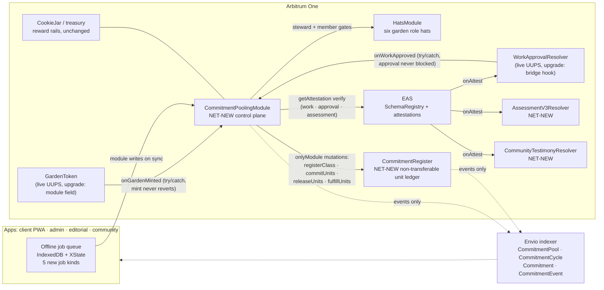
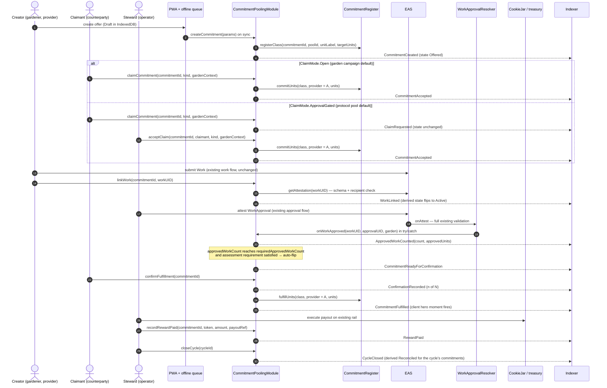
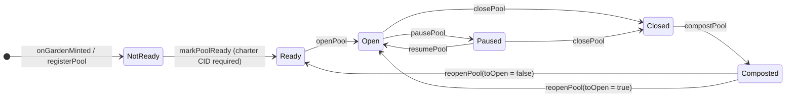
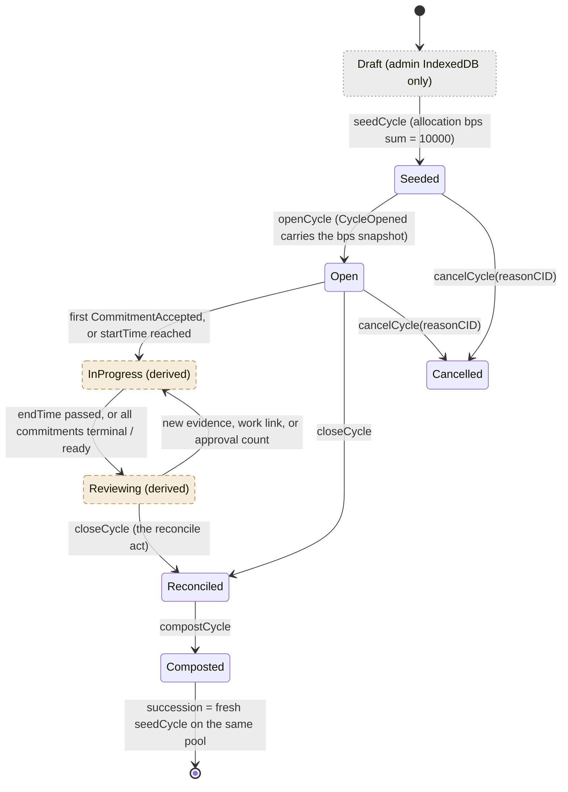
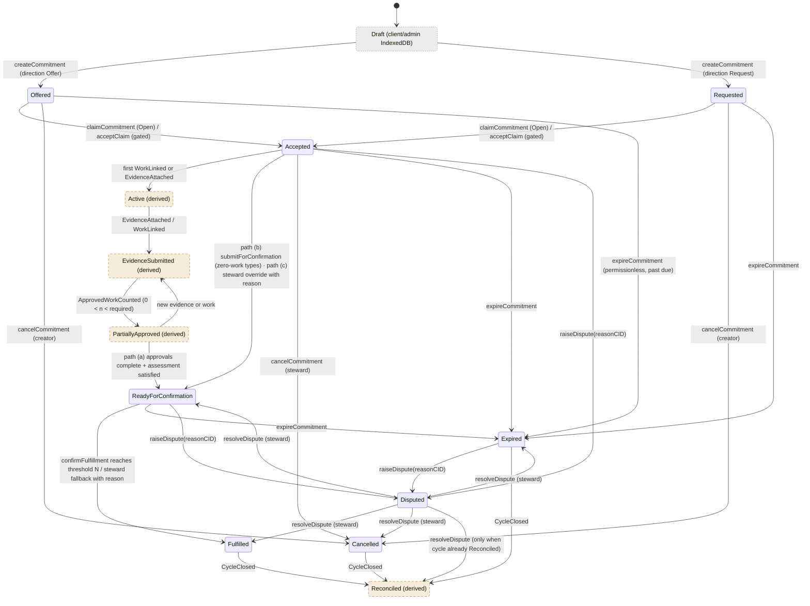
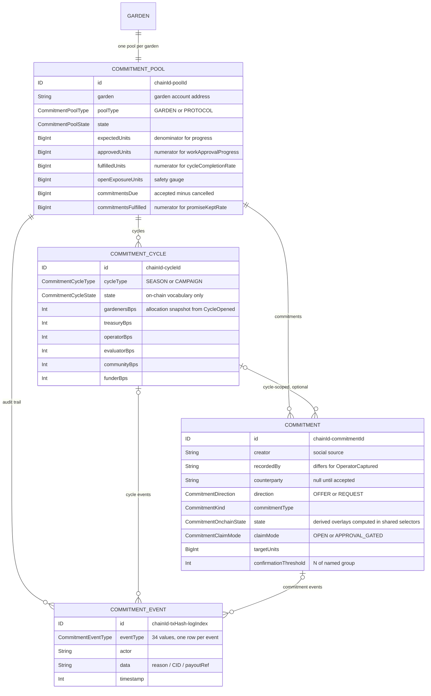
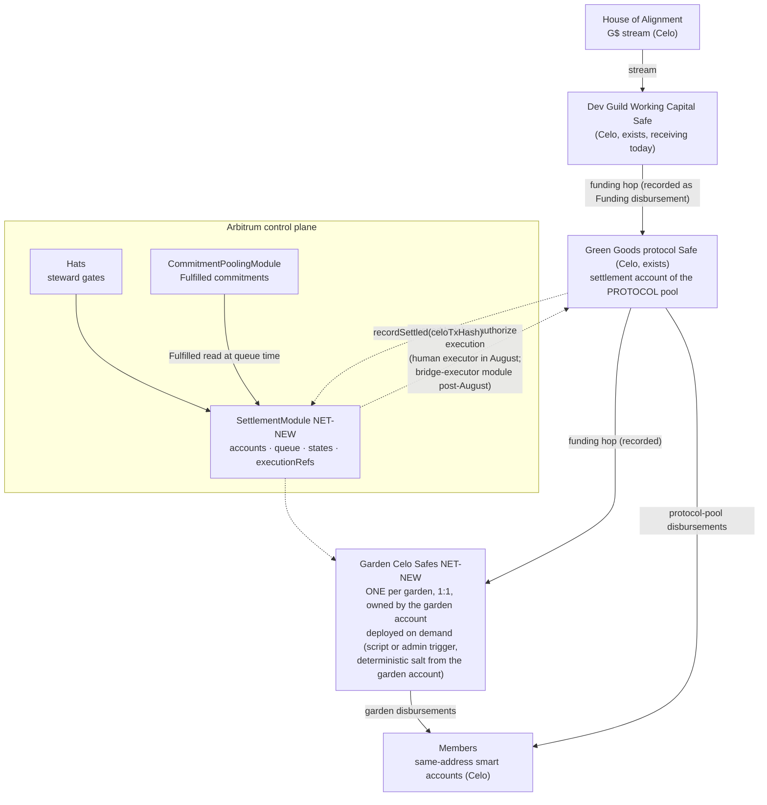
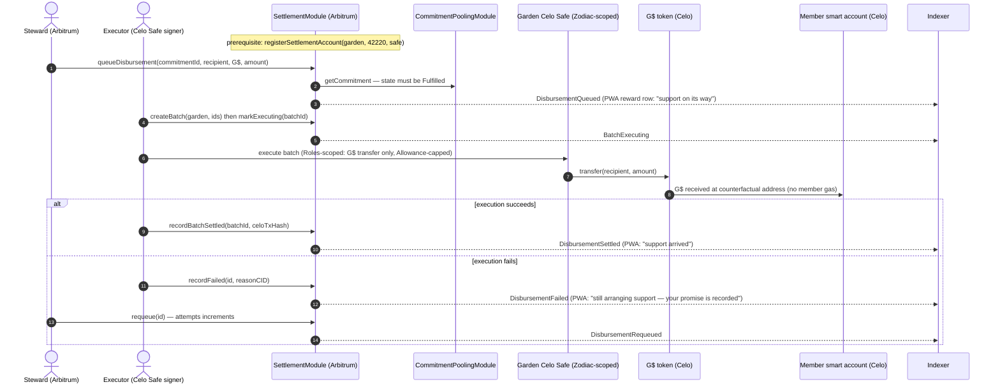
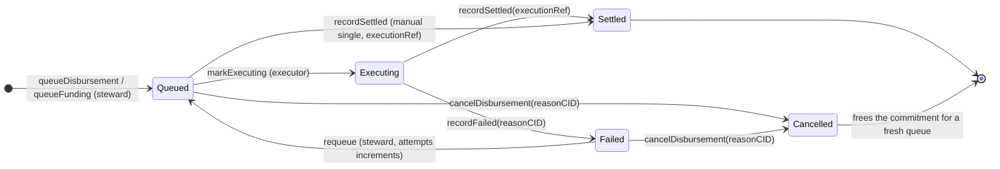

# Commitment Pooling: Diagrams

**Feature Slug**: `commitment-pooling`
**Stage**: `active`
**Created**: 2026-07-04
**Companions**: `contract-spec.md` (source of truth for every contract name, function, event, and state), `settlement-spec.md` (SettlementModule + Celo Safe topology, D8–D10), `uiux-spec.md` (surface flows), `wireframes.md` (screens). These diagrams are execution reference for implementers and reviewers; they introduce nothing the specs do not already define.

**Docs-site promotion**: these diagrams live here until the August release ships. Promotion into `docs/docs/builders/architecture/` (sequence-diagrams, ERD, plus a commitment journey doc) rides [PRD-680](https://linear.app/greenpill-dev-guild/issue/PRD-680); see §8 for the two *edits* to existing docs diagrams that ship at the same time.

| # | Diagram | Grounding |
|---|---|---|
| D1 | Contract topology + EAS bridge | contract-spec §4, §6.5 |
| D2 | Happy path: offer → claim → work → approval bridge → confirm → fulfilled → reward | contract-spec §5.3, §6.1, §6.5 |
| D3 | Analog capture + lightweight evidence (review-is-confirmation) | contract-spec §5.3 paths (b), uiux-spec §6.5, §5.5–5.6 |
| D4 | Pool state machine (all on-chain) | contract-spec §5.1 |
| D5 | Cycle state machine (on-chain + derived) | contract-spec §5.2 |
| D6 | Commitment state machine (on-chain + derived) | contract-spec §5.3 |
| D7 | Indexer entity delta (ERD) | contract-spec §8.2 |
| D8 | G$ fund-flow topology (HoA → Safes → members) | settlement-spec §2, §4 |
| D9 | Settlement sequence with failure/retry | settlement-spec §3.3 |
| D10 | Disbursement state machine | settlement-spec §3.2–3.3 |

**Legend for state diagrams**: solid = on-chain state (a named module function performs the transition and emits the listed event); dashed = derived state (indexer/app computes it from events; the chain never stores it); grey dashed = app-only (IndexedDB draft, no chain or indexer presence).

---

## D1. Contract topology + EAS bridge

Two NET-NEW contracts, two live upgrades, two new EAS schema/resolver pairs. Commitments are module-native records; EAS carries only assessment v3 and community testimony (decision #14). The module never custodies funds.

Notes:

- The `JAR — CPM` link is informational only: payouts execute on existing rails (jar withdrawal, treasury tx); the module records `RewardPaid` after the fact (decision #18).
- EAS is **not** indexed (`packages/indexer/schema.graphql:282-288` boundary). Every entity and stat derives from module + register events alone — that is why the dashed event edges are the indexer's only inputs.
- The resolver → module hook mirrors the existing KarmaGAP coupling: optional address, try/catch, disable by setting zero.

## D2. Happy path: DomainImpact offer, open claim

Preconditions: pool `Open`, cycle `Open` (steward already ran `seedCycle` → `openCycle`). Direction `Offer` means the creator is the unit provider; the claimant becomes the counterparty and confirms. Self-confirmation is blocked on-chain.

Recovery path not shown: approvals that land before `linkWork` are recovered by steward-called `syncApprovedWork(commitmentId, approvalUIDs)` (verifies each approval on EAS, dedupes via `approvalCounted`).

## D3. Analog capture + lightweight evidence (review-is-confirmation)

The SupportService / OperatorCaptured path: no Work/WorkApproval rails, `requiredApprovedWorkCount == 0`, counterparty confirmation IS the review (decision #20). The member stays the named promise source; the operator is metadata (`recordedBy`).

## D4. Pool state machine

Every pool transition is on-chain (rare operator console actions). One pool per garden, idempotent registration; the protocol pool is the root garden's pool (tokenId 1).

Pool-level `Paused` blocks new commitments, claims, and confirmations on that pool only; module-wide `setPaused` blocks all mutations except dispute resolution and cancel (stewards can always wind down).

## D5. Cycle state machine (types: Season, Campaign)

On-chain enum stores `Seeded / Open / Reconciled / Composted / Cancelled`. `Draft` is app-only; `InProgress` and `Reviewing` are derived overlays of on-chain `Open`.

`InProgress` is on-chain `Open`, so `cancelCycle` covers it; Draft cancels are an off-chain discard. Succession is derived by pool ordering — no on-chain predecessor pointer.

## D6. Commitment state machine

On-chain enum stores `Offered / Requested / Accepted / ReadyForConfirmation / Fulfilled / Cancelled / Expired / Disputed`. `Draft` is app-only; `Active`, `EvidenceSubmitted`, `PartiallyApproved`, and `Reconciled` are derived. While the derived overlays are showing, the on-chain state remains `Accepted` — so the cancel/expire/dispute transitions drawn from `Accepted` apply to all three overlays.

Register coupling per transition: create → `registerClass`; accept → `commitUnits`; cancel/expire → `releaseUnits`; fulfill → `fulfillUnits` (all-or-nothing in MVP). Cycle-less commitments (cycleId 0) derive `Reconciled` from `PoolClosed` instead of `CycleClosed`.

## D7. Indexer entity delta (ERD)

Four NET-NEW entities, all derived exclusively from module + register events (`chainId-identifier` composite IDs). `GARDEN` is the existing entity; the docs-site ERD gains this delta at ship via PRD-680.

Full field lists: contract-spec §8.2. The four locked aggregates stay numerator/denominator pairs (integer math; division happens in shared selectors, never stored): `workApprovalProgress`, `promiseKeptRate`, `cycleCompletionRate`, `openExposureUnits`.

---

## D8. G$ fund-flow topology (settlement, August)

Split-state settlement per `settlement-spec.md`: authorization on Arbitrum (garden-account-anchored, Hats-gated), execution on Celo from garden-attributed Safes with Zodiac-scoped signers. Canonical G$ never leaves Celo; no bridge carries value authority.

## D9. Settlement sequence with failure/retry

## D10. Disbursement state machine (all module-native, on-chain)

A failed Celo leg never touches commitment state — `Fulfilled` on the pooling module is permanent; only the disbursement record cycles. Reward-status precedence for UI: settlement-module record when a disbursement exists, else pooling-module `rewardPaid` (settlement-spec §3.3).

---

## Appendix: Edits to EXISTING docs diagrams at ship (PRD-680 scope)

Not performed now — the docs site describes what is live. Flagged on the Linear issue so they ship with the release:

1. **`docs/docs/builders/architecture/sequence-diagrams.mdx` § Work submission and approval**: after WorkApprovalResolver validation, add the optional bridge step — `WorkApprovalResolver → CommitmentPoolingModule.onWorkApproved (try/catch, non-blocking)` with a one-line note that approvals count toward pre-linked commitments only.
2. **`docs/docs/builders/architecture/sequence-diagrams.mdx` § Assessment flow**: add the v3 authorship split — baseline by evaluator OR operator; delta/re-assessment and technical by Evaluator Hat only; community testimony (Community Hat) as its own thin sequence.
3. **`docs/docs/builders/architecture/erd.mdx`**: append the D7 entity delta and the two new contract blocks to the contract-to-indexer event mapping.
