# Commitment Pooling: Diagrams

**Feature Slug**: `commitment-pooling`
**Stage**: `active`
**Created**: 2026-07-04
**Companions**: `contract-spec.md` (source of truth for every contract name, function, event, and state), `settlement-spec.md` (SettlementModule + Celo Safe topology, D8–D10), `uiux-spec.md` (surface flows), `wireframes.md` (screens). These diagrams are execution reference for implementers and reviewers; they introduce nothing the specs do not already define.

**Docs-site promotion**: these diagrams live here until the August release ships. Promotion into `docs/docs/builders/architecture/` (sequence-diagrams, ERD, plus a commitment journey doc) rides [PRD-680](https://linear.app/greenpill-dev-guild/issue/PRD-680); see §8 for the two *edits* to existing docs diagrams that ship at the same time.

**Role vocabulary (decision 2026-07-18)**: these diagrams say **Garden steward** (protocol pool: **Protocol steward**) for the pool-authority role — the holder of the garden's operator/owner Hats (`_requirePoolSteward`). The shipped app and community glossary still say "Operator"; the app-wide rename is a recorded follow-up, so treat steward = operator/owner Hats wherever the two vocabularies meet.

## Visual coverage matrix

This is the cross-hub inventory of 23 assets, not a table of contents for this file: 18 named D-diagram sections (D1–D14, including D1b, D7b, D7c, and D13b) render as 20 Architecture Mermaid blocks below because D6 carries its overview plus three acts, D13 includes a capability-separation mini-diagram, and D13b is a semantic table rather than Mermaid. The rows naming Community assets resolve to `.plans/active/community-interface/` (`diagrams.md`, `wireframes.md`, `journeys.md`), and rows 15–16 resolve to the two `wireframes.md` files. “Ready” means the implementation question is answered in the named repo-native artifact; it does **not** mean the feature is live. Every Mermaid block is parsed in the final validation pass, while text frames and permission tables are checked against their owning spec and route contract.

| # | Asset | Audience | Question answered | Source of truth | Current status | Correction needed | Validation method |
|---:|---|---|---|---|---|---|---|
| 1 | Unified system context | all lanes | Which users, apps, chains, read models, Safes, CCIP routes, and token participate? | CP `contract-spec.md` §4; `settlement-spec.md` §2–5; Community `spec.md` §3 | Ready: D1 | None; keep planned/live labels current | Mermaid parse + architecture cross-read |
| 2 | Module topology and trust boundaries | contracts, security, ops | Which component may queue, authorize, attest, index, execute, or verify? | CP `contract-spec.md` §4–7; `settlement-spec.md` §3–4 | Ready: D1b | Split CP jobs, EAS jobs/actions, and Celo transfer; include both new resolvers | Mermaid parse + interface/event cross-read |
| 3 | Capability responsibility summary | contracts, stewards, QA | Which capability groups belong to each role? | CP `contract-spec.md` §6.3; `settlement-spec.md` §3.3–4 | Ready: D13 | Keep distinct from the exact action table | Matrix cross-read + Mermaid parse |
| 4 | Commitment-pooling ERD | indexer, shared | What is stored, how do composite IDs relate, and where do count-safe/exact-label summaries live? | CP `contract-spec.md` §8.2 | Ready: D7 | Ten pooling entities; key fields only | Mermaid parse + GraphQL field cross-read |
| 5 | Claim-request/indexer ERD | contracts, indexer | How are stored terms, direct lookup, decline, and supersession represented? | CP `contract-spec.md` §5.3, §8.2 | Ready: D7 | None | Mermaid parse + handler acceptance cross-read |
| 6 | Settlement ERD | settlement, indexer, admin | How do accounts, immutable batches, members, and verification attempts relate? | `settlement-spec.md` §3, §6 | Ready: D7b | None | Mermaid parse + event/entity cross-read |
| 7 | Community EAS/Envio joined-read ERD | Community, indexer, evaluator | Which system owns Needs records versus protocol progress? | Community `spec.md` §4–7 | Ready: Community `diagrams.md` D3 | None | Mermaid parse + four-schema cross-read |
| 8 | Pool/cycle/commitment/NeedStatus/disbursement state machines | contracts, UI, QA | Which states are stored, derived, terminal, or recoverable? | both specs; `settlement-spec.md` §3.2 | Ready: D4–D6, D10; Community D4–D5 | None | Mermaid parse + transition-table cross-read |
| 9 | Offer/request → work → approval → confirmation → fulfillment | member, provider, implementers | How do direction, provider garden, Work, and confirmer defaults interact? | CP `contract-spec.md` §5.3, §6.1 | Ready: D2 | None | Mermaid parse + happy-path acceptance |
| 10 | Approval-gated request/accept/decline/supersede | steward, contracts, indexer | Which stored terms are consumed, and how do competing requests end? | CP `contract-spec.md` §5.3, §6.1, §8.2 | Ready: D11 | None | Mermaid parse + named claim tests |
| 11 | Protocol-to-garden funding route (HoA stream upstream) | settlement, treasury, ops | What does Green Goods authorize, and what remains upstream? | `settlement-spec.md` §2–3 | Ready: D12 | None | Mermaid parse + derived-route tests |
| 12 | CCIP command/ack settlement | settlement, admin, QA | How do command retry, idempotent Celo execution, and acknowledgment retry converge? | `settlement-spec.md` §3.3 | Ready: D9–D10 | None | Mermaid parse + command/ack acceptance |
| 13 | Need → operator triage → commitment seed | member, steward | How does community intent become protocol work without changing authorship? | Community `spec.md` §6, §8 | Ready: Community D9 | None | Mermaid parse + route/spec cross-read |
| 14 | Community offline/waiting-for-membership | member, shared, research | How does the September Community queue specialize the shared substrate? | Community `spec.md` §8.3–8.4 | Ready: Community D8 | Companion detail; CP core is D14 | Mermaid parse + offline acceptance |
| 15 | Cross-surface flow map | product, frontend | What stays in Community, admin `/community`, and existing public client surfaces? | Community `spec.md` §3; CP `uiux-spec.md` | Ready: `wireframes.md` §1 | None | Mermaid parse + monorepo/route cross-read |
| 16 | Low-fidelity frames | member, steward, evaluator, funder | Are entry, state, failure, and recovery screens defined without decorative polish? | both UI specs | Ready: both `wireframes.md` files | None | frame inventory + accessibility review |
| 17 | Persona journeys | research, product, QA | Can every named role reach completion and recovery? | Community `journeys.md` | Ready | None | persona/role checklist |
| 18 | Customer/community journey | research, operators | What happens from discovery through withdrawal or verified outcome? | Community `journeys.md` | Ready | None | stage/recovery checklist |
| 19 | Operator service blueprint | operations, research | Which frontstage, backstage, support, and failure-recovery steps must connect? | Community `journeys.md` | Ready | None | Mermaid parse + handoff cross-read |
| 20 | Research/onboarding/review/rehearsal timeline | research, delivery leads | Who must decide what, by when, before implementation and gathering rehearsal? | Community `research-plan.md`; `journeys.md` | Ready: Community `journeys.md` timeline | None | Mermaid parse + owner/date review |
| 21 | Exact sensitive-action permissions | contracts, settlement, security, QA | Which named function can each actor call, with which gates? | CP `contract-spec.md` §6.3; `settlement-spec.md` §3.3 | Ready: D13b | Generated by cross-reading both canonical tables | Function-by-function table diff |
| 22 | Hypercert cut-over and indexer delta | indexer, shared, admin | How do fulfilled commitments replace Work as the bundle without migrating legacy certificates? | CP `contract-spec.md` §9 | Ready: D7c | Keep legacy and commitment bundles readable | Mermaid parse + metadata/schema cross-read |
| 23 | Commitment offline job lifecycle | shared, client, QA | Which five CP jobs queue, wait for membership without retry use, retry, exhaust, or discard? | CP `uiux-spec.md` §5.11 | Ready: D14 | Self-contained CP view; Community D8 remains companion | Mermaid parse + queue acceptance |

**Visual status contract**: solid green node/edge = Built/live; dashed stone node/edge = Planned/gated. Dashes never mean read, boundary, derived, or app-only. Relationship meaning is written on the arrow. State provenance is explicit in the node label and fill: paper = on-chain, amber = derived, grey = app-only.

---

## D1. Unified system context

**How to read this**: top to bottom — people use surfaces; surfaces write into the Arbitrum protocol layer; Envio turns explicit Green Goods protocol events into the read model every surface queries; value moves only on Celo. CCIP carries data-only commands and acknowledgments, never G$. Node outlines encode built/live versus planned/gated status; arrow labels state whether an edge is a write, read, event, protocol message, or value movement. The client is ONE codebase with two presentations — the **installed PWA** and the **editorial website** — and the docs site is a separate Docusaurus app; the planned Community PWA is a third, independent app.

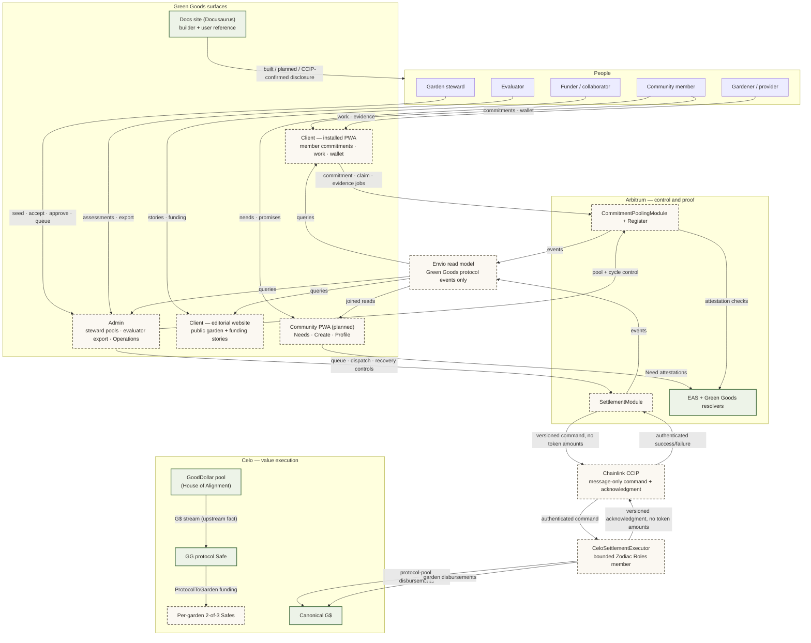

Notes:

- The installed PWA and the editorial website are the same client app in two presentation modes (`getClientPresentationMode`); the docs site is separate. Every surface carries built / planned / queued / dispatched / confirming / confirmed status labels so a reader never mistakes a plan for a live feature.
- The GoodDollar House of Alignment pool streams G$ directly into the Green Goods protocol Safe; Green Goods models only the ProtocolToGarden route onward (corrections-log §9).
- EAS and raw Celo transfers are outside Envio. The joined Community read is owned in shared/query composition, not fabricated in an Envio handler.
- The indexer records only SettlementModule and CeloSettlementExecutor protocol events. A Celo execution is visible before its acknowledgment, but only an authenticated success acknowledgment marks the Arbitrum attempt `Confirmed`.

## D1b. Contract/module topology and trust boundaries

**How to read this**: four trust boundaries, one job each. The application boundary queues intent but authorizes nothing. The Arbitrum boundary owns source state. Envio restates explicit events from both Green Goods contracts. The Celo executor moves value under a reviewed Safe + Zodiac scope, stores its idempotent outcome, then uses CCIP to acknowledge it.

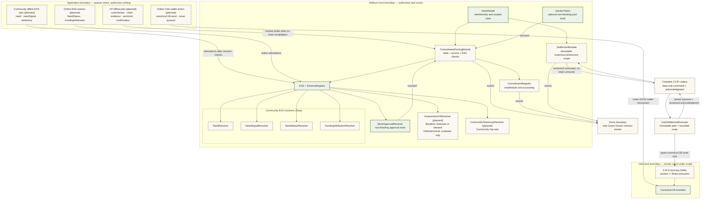

Boundary rules:

- **Application**: drafts and queued jobs are intent, never authority — every write is re-validated on-chain; nothing trusts a client claim.
- **Arbitrum**: HatsModule decides who may act; the pooling module owns state machines and EAS checks; the register counts units only for the module; the settlement module records value authorization but never custodies or calls Celo. Each Community resolver validates exactly one schema — **NeedResolver** (Need records), **NeedSignalResolver** (member signals on a Need), **NeedStatusResolver** (steward status updates), **FundingAttributionResolver** (receipt-checked funding references).
- **Envio**: restates emitted events into the read model — explicit fields only, no actor inference from `transaction.from`.
- **Celo + CCIP**: the executor validates its immutable source chain/sender and empty token amounts, then calls only the typed canonical-G$ route. Recovery owners are never executor owners. An authenticated Celo acknowledgment, not a human report or timeout, finalizes Arbitrum state.

Trust rules: no provider may confirm their own delivery, including steward fallback; no recovery owner may be a Safe executor; no human can verify a receipt; no handler infers an actor from `transaction.from`; no contract enumerates all cycles or claims to make a transition.

## D2. Offer/request → work → approval → confirmation → fulfillment

**How to read this**: the full happy path of one promise, left to right in time — created, claimed, delivered through the existing Work → WorkApproval rail, confirmed by the counterparty, and rewarded. The steward performs every one of their steps in the Admin app (Hub work stage + garden Pool tab — W7/W13); the member acts in the client PWA. The payout lane at the end covers **non-G$ declared rewards only** — G$ rewards leave this diagram and queue on the SettlementModule (D9, D12).

Preconditions: pool `Open`; an optional cycle exists, belongs to the pool, and is `Open`. For an Offer, the creator is provider and accepted recipient confirms. For a Request, the accepted claimant is provider and the creator confirms. The stored `providerGarden` controls DomainImpact Work and assessment validation even when the commitment remains in the root protocol pool. Provider self-confirmation fails on every path.

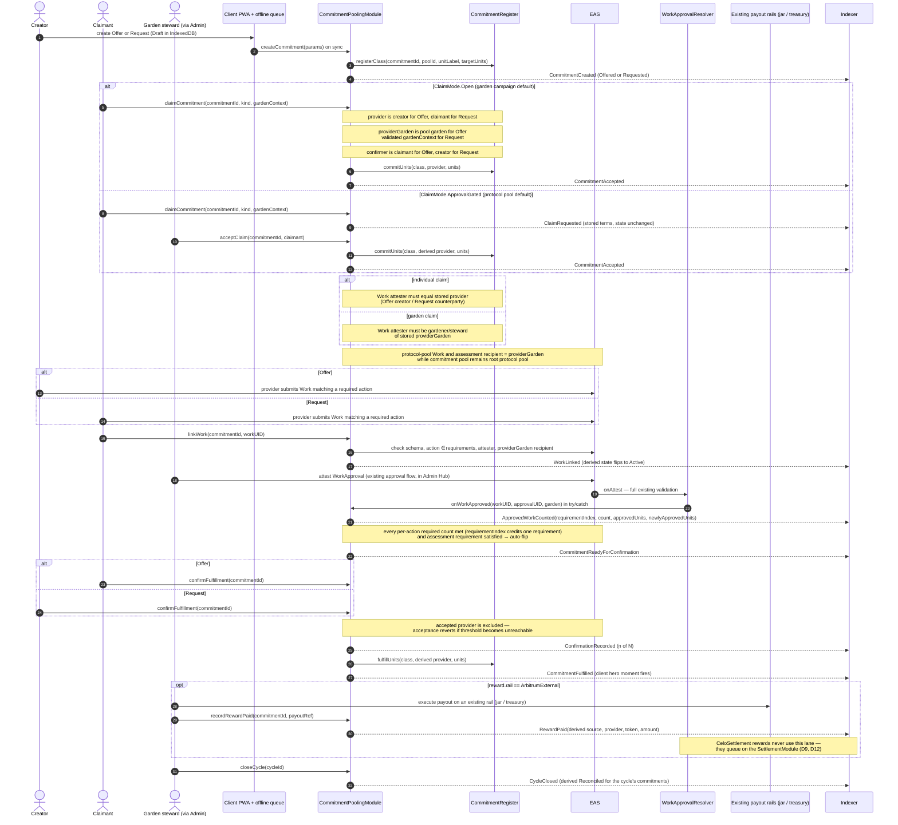

Recovery: approvals that land before `linkWork` are recovered by bounded steward call `syncApprovedWork(commitmentId, approvalUIDs)`; each UID is EAS-verified and deduped through `approvalCounted`. Steward fallback still rejects the provider and records a reason.

## D3. Analog capture + lightweight evidence (review-is-confirmation)

The SupportService / OperatorCaptured path: no Work/WorkApproval rails, no work requirement, counterparty confirmation IS the review (register #20). The member stays the named promise source; the steward is metadata (`recordedBy`).

**When this happens (use cases)**: an elder gardener makes a promise in conversation and the steward records it from a paper field log; a member offers childcare, meals, or transport for a community work day — help that has no Work/approval rail; a field visit is captured fully offline and the evidence photos sync hours later. In every case the member stays the named promise source (`recordedBy` marks the steward as scribe, never as owner), and because these kinds carry no work requirement, the counterparty's confirmation *is* the review — no separate approval step exists.

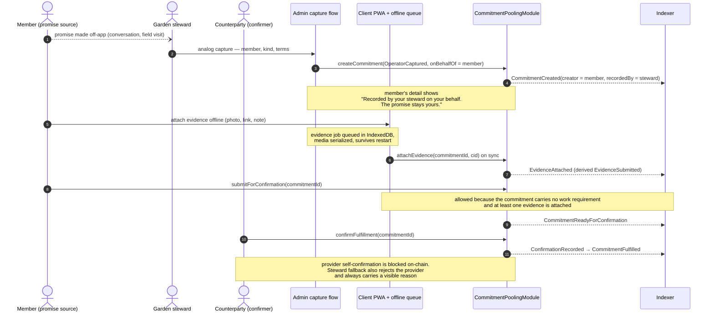

## D4. Pool state machine

Every pool transition is on-chain (rare steward console actions). One pool per garden, idempotent registration; the protocol pool is the root garden's pool (tokenId 1).

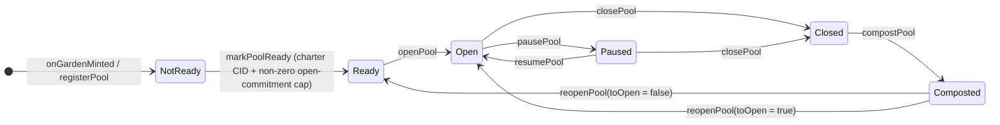

**What each state allows**:

| State | What it means | What's allowed | Who acts |
|---|---|---|---|
| NotReady | garden minted, pool registered, onchain charter/cap predicate not yet met or app Baseline preflight still missing | configuration only | steward |
| Ready | onchain charter + non-zero provider open-commitment cap are present; the app offered the write only after a current non-revoked Baseline preflight | seed cycles; open the pool | steward |
| Open | promises can flow | create / claim / confirm commitments; seed and open cycles | members + steward |
| Paused | **the emergency freeze** | create, claim, Ready-submit, and confirm are disabled; browse, evidence/work linkage, cancellation, expiry, and dispute recovery remain available | steward (resume); existing actors keep allowed evidence/recovery paths |
| Closed | wind-down | no new activity; terminal cleanup of open commitments | steward |
| Composted | **archival rest — history + "ready for the next season"** | read everything; `reopenPool` back to Ready or Open; nothing else | steward |

Composting is archival, not deletion and not the freeze — `Paused` is the freeze. A composted pool keeps its full promise history visible and can wake for a new season via `reopenPool`. Pool-level `Paused` blocks new commitments, claims, and confirmations on that pool only; module-wide `setPaused` blocks operational mutations but keeps owner configuration, unpause, `cancelCommitment`, `expireCommitment`, and `resolveDispute` available for safe wind-down.

## D5. Cycle state machine (types: Season, Campaign)

On-chain enum stores `Seeded / Open / Reconciled / Composted / Cancelled`. `Draft` is app-only; `InProgress` and `Reviewing` are derived overlays of on-chain `Open`.

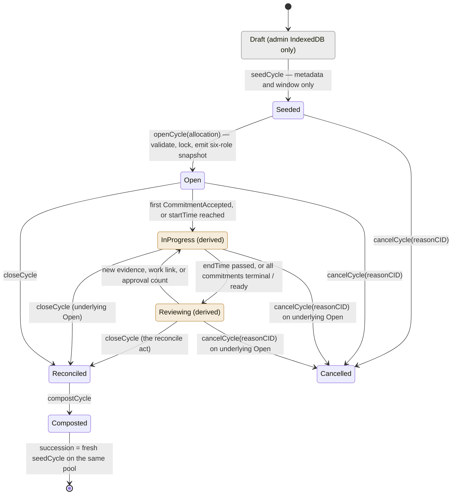

`InProgress` is on-chain `Open`, so `cancelCycle` covers it; Draft cancels are an off-chain discard. Succession is derived by pool ordering — no on-chain predecessor pointer. Opening validates cycle existence, pool ownership, and `Seeded` state. `Pool.openSeasonCycleId` permits exactly one open Season in O(1); any number of Campaigns may be open concurrently and no transition enumerates cycles.

**Reading the middle of the machine**: `InProgress` and `Reviewing` are indexer-derived overlays of on-chain `Open` — the chain never stores them. A cycle sits `Open`, starts reading as `InProgress` at the first accepted commitment (or when `startTime` arrives), flips to `Reviewing` when the window ends or every commitment is terminal/ready, and flips back whenever new evidence lands. `closeCycle` is the reconcile act.

**There is deliberately no loop here**: `Composted` is terminal *for a cycle*. The loop lives at the pool — a fresh `seedCycle` (Season or Campaign) on the same pool is how the next round begins, and the composted cycle's aggregates roll into pool history. (The pool machine, D4, is the one that can reopen.)

**Allocation split**: the six role percentages — gardeners / treasury / steward / evaluator / community / funder, stored on-chain as basis points where 10000 bps = 100% — are supplied atomically to `openCycle`, validated, stored as the immutable cycle snapshot, emitted in `CycleOpened`, and become the cycle's impact-certificate allowlist allocation at close (contract-spec §9.4; default Model 1: 60 / 15 / 10 / 5 / 5 / 5). `seedCycle` carries no allocation.

## D6. Commitment state machine (overview + three acts)

On-chain enum stores `Offered / Requested / Accepted / ReadyForConfirmation / Fulfilled / Cancelled / Expired / Disputed`. `Draft` is app-only; `Active`, `EvidenceSubmitted`, `PartiallyApproved`, and `Reconciled` are derived. The single all-states diagram was accurate but hard to digest, so it is drawn as one compact overview plus three lifecycle acts — the acts zoom into the overview and never disagree with it.

#### D6.0 Overview — the whole life at a glance

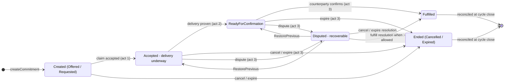

#### D6a. Act 1 — Claim & acceptance


An approval-gated `claimCommitment` stores a PendingClaim and leaves the on-chain state untouched; `declineClaim` clears only that claimant; acceptance consumes the stored terms, derives provider and providerGarden, and commits units exactly once. Competing pending claims resolve by supersession — the full decline/accept/supersede choreography is D11.

#### D6b. Act 2 — Delivery & evidence (`Accepted` → `ReadyForConfirmation`)

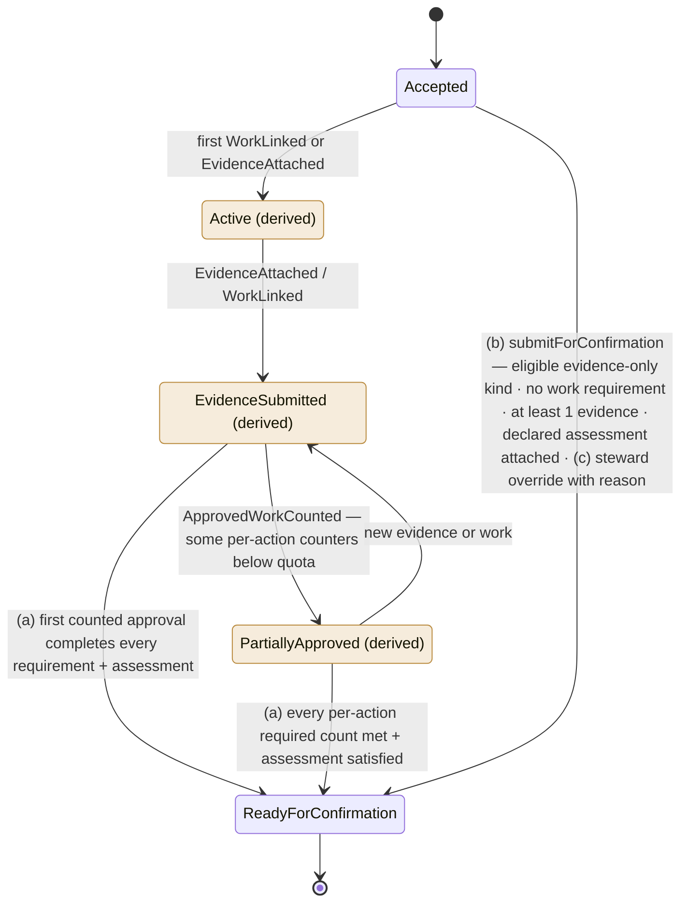

While the derived overlays are showing, the on-chain state remains `Accepted` — so the cancel/expire/dispute transitions in act 3 apply to all of them. The two delivery styles by kind: **DomainImpact** runs the full Work → WorkApproval rail with per-action required counts (`requirementIndex` credits exactly one requirement per approval — amendment 2026-07-18); **SupportService / OperatorCaptured / SeasonCampaign** seeded with no work requirement go through path (b), where the counterparty's confirmation IS the review (D3).

#### D6c. Act 3 — Resolution (confirmation, endings, disputes, reconciliation)


The module stores `preDisputeState` before entering `Disputed`; `RestorePrevious` restores that exact state. There is no `Reconciled` dispute resolution. Unit accounting is exact:

- create registers the class but commits no units;
- cancellation or expiry from `Offered`/`Requested` releases nothing;
- acceptance commits units and acquires one provider open-commitment slot once, regardless of `targetUnits`;
- cancellation or expiry from `Accepted`/`ReadyForConfirmation` releases those committed units and that one slot once;
- fulfillment converts committed units with `fulfillUnits` and releases that one slot;
- raising or restoring a dispute has no unit or slot effect;
- resolving to `Fulfilled`, `Cancelled`, or `Expired` applies the same conversion/release only when units and the slot are still held; a pre-dispute `Expired` record cannot become `Fulfilled` and never releases twice.

Cycle-less commitments (`cycleId == 0`) derive `Reconciled` from `PoolClosed`; cycle-scoped terminal commitments derive it from `CycleClosed`.

## D7. Indexer entity delta (ERD)

Ten NET-NEW pooling entities, all derived exclusively from module + register events (`chainId-identifier` composite IDs). `GARDEN` is the existing entity; settlement entities are shown separately in D7b. The docs-site ERD gains this delta at ship via PRD-680.

**Count-safe units model**: every commitment keeps its own exact `unitLabel`, `targetUnits`, and per-commitment `approvedUnits`. Pool/cycle totals never add unlike labels. `CommitmentUnitSummary` groups only exact UTF-8 label matches (`hours` and `Hours` are distinct), while `CommitmentProviderExposure` counts concurrent accepted commitments regardless of their quantities:

- `promiseKeptRate = commitmentsFulfilled / commitmentsDue` is the only cross-commitment percentage;
- `openCommitmentCount` is a count, not a unit total, and the provider cap consumes one slot per accepted commitment;
- exact-label summaries keep `expectedUnits`, `approvedUnits`, `fulfilledUnits`, and `openUnits` for operational detail;
- active-cycle surfaces show state counts plus exact-label groups, never a synthetic mixed-unit progress rate.

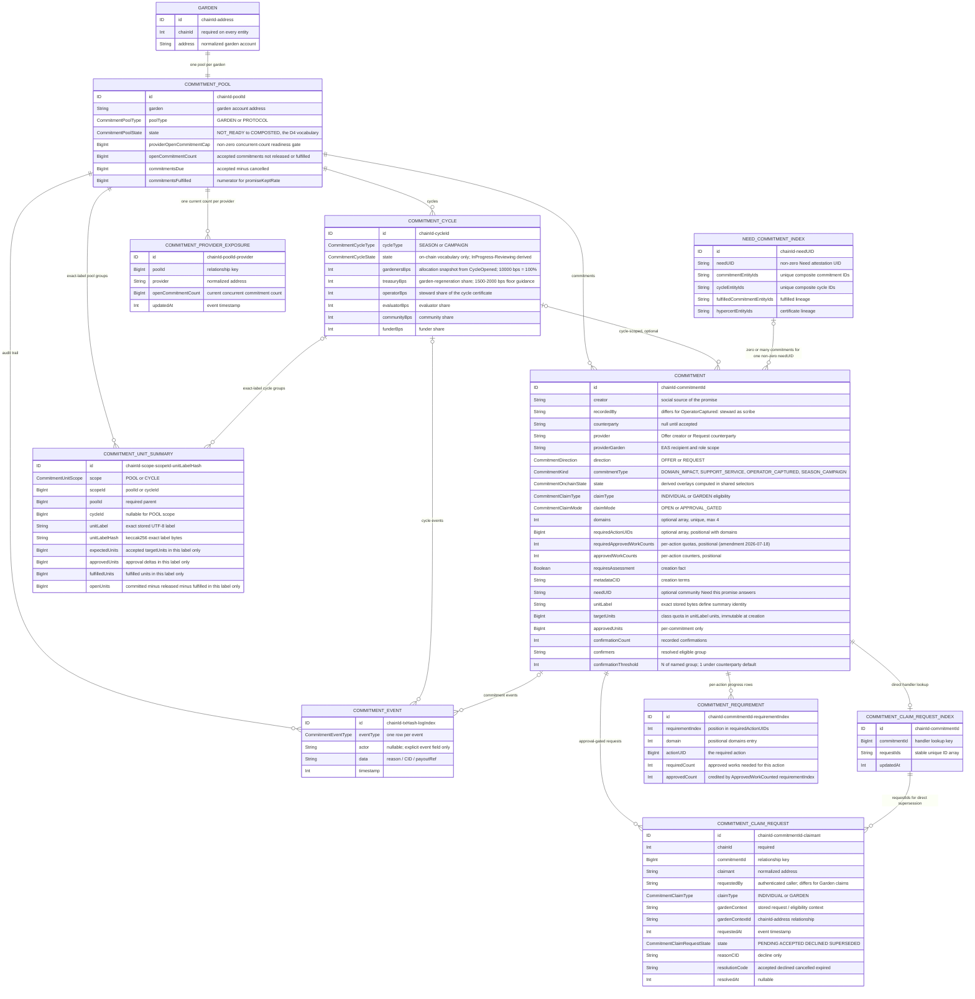

On acceptance, the handler loads `COMMITMENT_CLAIM_REQUEST_INDEX` by `chainId-commitmentId`, marks the accepted request `ACCEPTED`, and marks every other still-pending indexed request `SUPERSEDED`. Pre-acceptance commitment cancellation or expiry uses the same indexed IDs to supersede every pending row with its resolution code. Decline updates only the named request. No handler performs a database-wide scan, and no audit-event actor is inferred from `transaction.from`. `Garden.id` migration requires a full replay/backfill and shared-query cutover; every relationship uses `chainId-*` IDs.

Full field lists: contract-spec §8.2. The ERD intentionally shows the key identity, relationship, state, and accounting fields needed to review trust and cardinality; it is not a substitute for the canonical GraphQL block. Only `promiseKeptRate` divides across commitments. Exact-label unit rows and provider count rows remain integer event-derived facts.

## D7b. Settlement ERD

**How to read this**: the planned read model keeps the logical attempt separate from immutable
protocol-message rows. `SettlementAttempt` is keyed by its execution key and relates back to
the canonical disbursement or batch; `SettlementMessage` records source commands, Celo
execution outcomes, and acknowledgments from Green Goods contracts only. This distinguishes
Celo execution from a received acknowledgment without indexing or inferring raw G$ transfers.

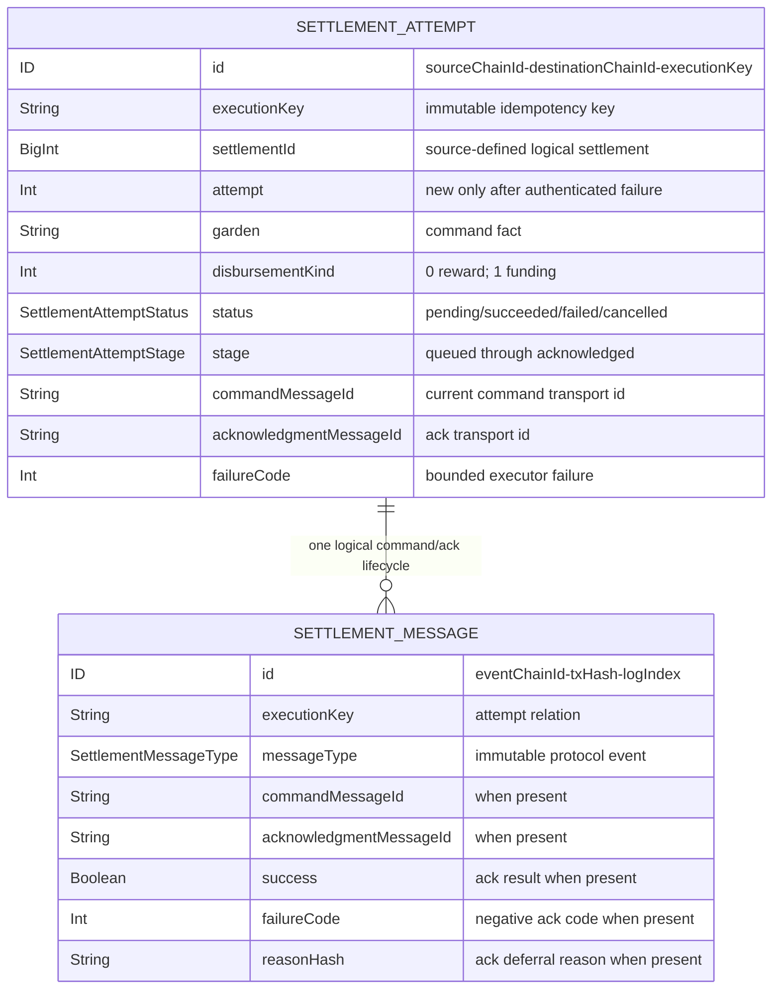

Commitment/disbursement joins, settlement accounts, batches, per-member recovery, and Safe
configuration follow the canonical entities in `settlement-spec.md` §6. None are claims about
currently deployed or indexed state.

## D7c. Fulfilled-commitment Hypercert cut-over and indexer delta

**How to read this**: the existing Work-attestation certificate path stays intact for legacy work. Commitment Pooling adds a second input only after a commitment is `Fulfilled`: its immutable terms, Need lineage, approved Work/evidence, and six-share BPS class allocation are composed into the existing IPFS → Merkle → mint pipeline. The certificate indexer stores the bundle kind and Commitment/Need lineage; it does not reinterpret promise state or combine unit labels.

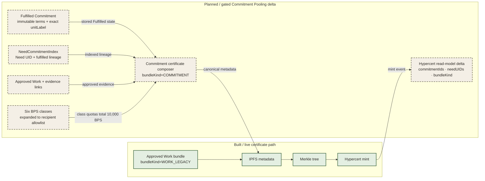

---

## D8. G$ funding topology, Safe recovery, and CCIP boundary

**How to read this**: canonical G$ stays on Celo. Arbitrum sends a data-only command; the Celo executor derives the Safe/token call, executes through a bounded Zodiac role, stores the outcome, and sends a data-only acknowledgment. The executor is never a Safe owner. A message timeout never creates a second payment attempt.

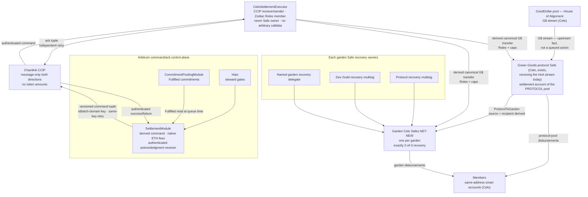

The Safe owner set remains exactly protocol recovery multisig, Dev Guild recovery multisig, and one named garden recovery delegate, threshold 2. The `CeloSettlementExecutor` is installed only as the reviewed Zodiac Roles v2 member with an exact `bytes32` role key, canonical G$ transfer conditions, and per-transfer/batch/period caps. Source commands and automatic acknowledgments are sponsored from monitored native reserves; a permissionless acknowledgment retry may instead supply the exact CELO quote without reducing the reserve. Protocol-Safe inflow remains an external treasury fact; the command path models ProtocolToGarden and commitment rewards only.

## D9. Settlement sequence with failure/retry

**How to read this**: command delivery retry and acknowledgment retry are independent. Both reuse one immutable execution key; neither may execute G$ twice. Only the authenticated success acknowledgment for the subject's current key and attempt turns Arbitrum state into `Confirmed`.

```mermaid
sequenceDiagram
  autonumber
  actor OP as Garden steward (via Admin Operations)
  participant SM as SettlementModule (Arbitrum)
  participant CPM as CommitmentPoolingModule
  participant AR as CCIP Router (Arbitrum)
  participant CE as CeloSettlementExecutor
  participant CR as CCIP Router (Celo)
  participant SAFE as Owning-pool Celo Safe
  participant GD as G$ token (Celo)
  participant IDX as Indexer

  OP->>SM: queueDisbursement(commitmentId) or queueFunding(garden, amount)
  SM->>CPM: read canonical eligible facts
  SM-->>IDX: DisbursementQueued ("support is queued")
  OP->>SM: dispatchDisbursement or dispatchBatch
  SM->>AR: ccipSend(command tuple, no tokens; snapshotted peer/version/gas)
  SM-->>IDX: SettlementCommandDispatched (key, messageId, peer, payloadHash)
  AR-->>CR: CCIP delivery
  CR->>CE: authenticated command
  alt executionKey already has a stored terminal outcome
    CE-->>IDX: DuplicateSettlementMessage
    Note over CE,SAFE: reuse stored outcome; Safe is not called again
  else new executionKey
    CE->>SAFE: fixed G$ transfer/batch through Zodiac Roles
    alt bounded Safe execution succeeds
      SAFE->>GD: canonical G$ transfers
      CE-->>IDX: SettlementExecutionStored(Succeeded, originating module/version) ("confirming arrival")
      Note over CE: store success before acknowledgment
    else authenticated policy or bounded execution fails
      CE-->>IDX: SettlementExecutionStored(Failed, failureCode)
      Note over CE: store failure before acknowledgment
    end
  end
  CE->>CR: ccipSend(ack tuple, no tokens)
  alt acknowledgment delivery succeeds
    CR-->>AR: CCIP delivery
    AR->>SM: authenticated acknowledgment
    alt success
      SM-->>IDX: SettlementAcknowledged(success=true) → Confirmed
    else execution failure
      SM-->>IDX: SettlementAcknowledged(success=false) → Failed
    end
  else native CELO or delivery is delayed
    CE-->>IDX: AcknowledgmentDeferred
    OP->>CE: quote + retryAcknowledgment{value: exact CELO fee}(executionKey)
    Note over CE,SAFE: stored outcome only; Safe is not called again
  end
  opt command delivery is delayed
    OP->>SM: retryCommand(disbursementId) / retryBatchCommand(batchId)
    SM->>AR: ccipSend(same tuple + same destination snapshot, new messageId)
    CE->>CE: duplicate executionKey → reuse stored outcome
    Note over CE,SAFE: no second G$ execution
  end
  opt authenticated failure needs a new logical attempt
    OP->>SM: requeue(disbursementId)
    Note over OP,SM: explicit next attempt after authenticated failure only
  end
```

## D10. Disbursement state machine (all module-native, on-chain)

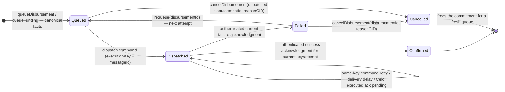

**What each state allows**:

| State | What it means | What's allowed next | Who acts |
|---|---|---|---|
| Queued | steward has queued canonical eligible facts; nothing dispatched | dispatch through the frozen entrypoint; cancel an unbatched item or cancel the whole immutable batch | resolved settlement steward |
| Dispatched | command sent; execution or acknowledgment may still be pending | wait; retry same command; retry stored acknowledgment from Celo | resolved steward / anyone for destination ack retry |
| Confirmed | authenticated success acknowledgment for the current key/attempt received | terminal — “support arrived” | Celo executor through CCIP |
| Failed | authenticated current execution-failure acknowledgment received | explicitly requeue a new next attempt; or terminally cancel | resolved settlement steward |
| Cancelled | withdrawn while Queued, or closed after authenticated Failed delivery | terminal for that execution key | resolved settlement steward |

For a Queued batch, the `Queued -> Cancelled` transition is
`cancelBatch(batchId, reasonCID)`: one atomic transition over the immutable member
set. `cancelDisbursement` rejects a Queued member whose `batchId != 0`, so no
partial queued-batch state can exist.

A failed Celo leg never changes Commitment Pooling state. `SettlementExecutionStored(Succeeded)` without the Arbitrum acknowledgment derives “confirming arrival” while stored Arbitrum state remains `Dispatched`. A delivery timeout cannot cancel or create a new attempt. Cancellation is allowed from Queued or an authenticated Failed result, never from Dispatched; a Failed member may instead be explicitly requeued as a new attempt.

## D11. Approval-gated claim request, decline, acceptance, and supersession

**How to read this**: two people want the same commitment. Each `claimCommitment` stores its own PendingClaim (the on-chain commitment state does not move). The steward may decline one claimant without touching the others, or accept one — at which point every other pending request reads as superseded. Declines and supersessions carry distinct member-facing meanings via `resolutionCode`.

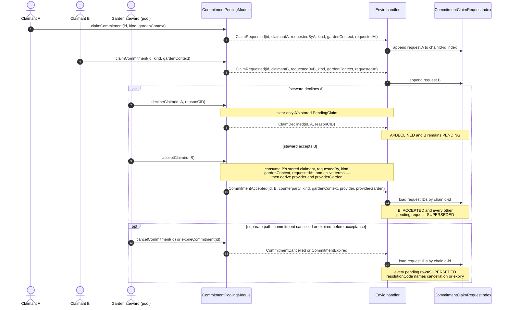

There is no numeric sentinel or database-wide query. A later request after a decline is a fresh active request with a new timestamp; acceptance is deterministic because it cannot substitute caller-provided terms. Superseded copy distinguishes another accepted provider from commitment cancellation/expiry through `resolutionCode`.

## D12. Protocol-to-garden funding route

**How to read this**: the House of Alignment stream arriving in the protocol Safe is an upstream fact — Green Goods never queues, executes, or verifies it. The planned protocol → garden top-up uses the same CCIP command → bounded Celo execution → acknowledgment discipline as D9 and cannot be enabled until the production Safe/Zodiac route is approved.

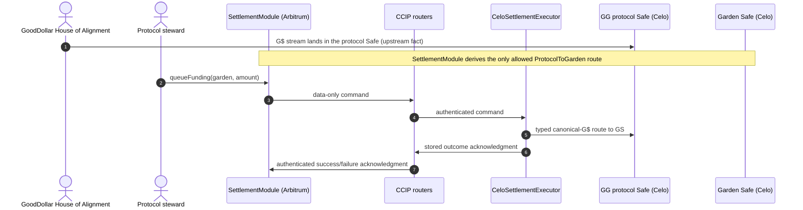

If the Celo AA/paymaster spike fails, this Safe-to-Safe route remains available while `memberDeliveryEnabled` stays false. There is no garden-custody member-claim fallback.

## D13. Capability responsibility summary

**How to read this**: this is a capability summary for audience orientation, not the function-level authorization source. One row appears per capability-bearing role and one column per capability group — ✓ means the role may act within the listed scope, — means no access, ✗ marks an enforced prohibition. "Garden steward" = holder of the garden's operator/owner Hats; the protocol pool resolves stewardship to the root garden. The scoped executor is the `CeloSettlementExecutor` contract itself, never a human steward or Safe owner. D13b carries the exact function-level permission table.

| Role | Pool & cycle control | Create / claim promises | Evidence & work | Approve work | Confirm fulfillment | Queue & execute value | Confirm settlement | Configure protocol |
|---|---|---|---|---|---|---|---|---|
| **Module owner** | ✓ fallback steward | — | — | — | — | ✓ queue protocol funding · dispatch/retry within frozen routes | — | ✓ pause · peer/module wiring · measured limits · UUPS upgrade |
| **Garden steward** | ✓ seed / open / pause / compost · accept / decline claims | ✓ seed SeasonCampaign · OperatorCaptured (`onBehalfOf`) | ✓ attach for members | ✓ WorkApproval (existing flow) | fallback only, with reason, never as provider | ✓ queue/dispatch/retry/requeue/cancel within resolved scope | — | — |
| **Member / gardener** | — | ✓ own Offer / Request · claim open commitments | ✓ own evidence · link work | — | ✓ when eligible confirmer | — | — | — |
| **Accepted provider** | — | — | ✓ deliver + evidence | — | ✗ never own delivery | — | — | — |
| **Evaluator** | — | — | ✓ assessments (baseline / delta / technical) | — | ✓ when named confirmer | — | — | — |
| **Community member** | — | ✓ needs + signals (Community PWA) | ✓ testimony | — | ✓ when named confirmer | — | — | — |
| **CeloSettlementExecutor (Zodiac Roles member)** | — | — | — | — | — | ✓ typed canonical-G$ transfer only | ✓ sends CCIP acknowledgment | — |
| **Recovery owner (2-of-3)** | — | — | — | — | — | ✗ execution | — | ✓ recover / rotate Safe modules only |
| **CCIP routers** | — | — | — | — | — | — | transports authenticated protocol messages only | — |
| **Envio handlers** | — | — | — | — | — | — | — | read model from explicit event fields only |

**Hard prohibitions (the red lines)**:

- No provider may confirm their own delivery — including through steward fallback.
- No recovery owner may be a Safe executor, and no executor may be a recovery owner (deployment and `addExecutor` both reject overlap).
- No human report, timeout, or Celo transfer log can mark a source attempt `Confirmed` or `Failed`; only the authenticated Celo executor acknowledgment can do so.
- No handler infers an actor from `transaction.from`.
- No contract enumerates all cycles or claims to make a transition.

**Capability separation (why value stays bounded)**:

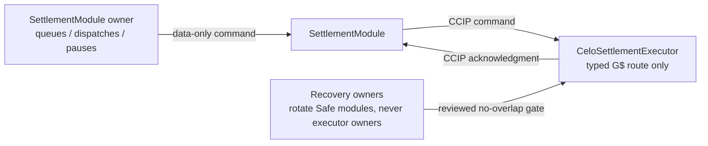

The Arbitrum module owner and the Celo executor owner are separate implementation roles. The production route must prove that the Celo executor is a narrowly scoped Zodiac Roles member, never a Safe owner; external Safe authority configuration remains a Release gate. No human capability or timeout can certify a source settlement outcome.

## D13b. Exact sensitive-action permission table

This table is the Architecture-tab copy of the two canonical permission matrices in `contract-spec.md` and `settlement-spec.md`. A caller must satisfy both the named role and every listed gate; a broad capability in D13 never widens these rows.

| Function or family | Authorized caller | Non-negotiable gate |
|---|---|---|
| `onGardenMinted` | GardenToken only | Idempotent; creates one Garden pool in NotReady |
| `registerPool` | Protocol: module owner; Garden: garden operator/owner or module owner | One pool per garden |
| `setPoolCharter`, `markPoolReady` | Resolved pool steward | Ready requires non-empty charter and a previously configured non-zero provider open-commitment cap; Baseline remains an app preflight |
| `openPool`, `pausePool`, `resumePool`, `closePool`, `compostPool`, `reopenPool` | Resolved pool steward | Exact D4 transition; pause reason mandatory |
| `seedCycle`, `openCycle`, `closeCycle`, `compostCycle`, `cancelCycle` | Resolved pool steward | Exact D5 transition; allocation exists only on open and totals 10,000 BPS; cancel reason mandatory |
| `createCommitment` | Pool member for own Offer/Request; steward for SeasonCampaign/OperatorCaptured; root steward or owner in protocol pool | Pool/cycle accepts; stored authorship and `onBehalfOf` determine provider; DomainImpact arrays are valid |
| `setDeclaredReward`, `setConfirmerRule` | Resolved pool steward | Pre-acceptance only |
| `claimCommitment` | Garden member; or protocol-pool garden operator/owner / individual garden member according to stored `claimType` | Runtime kind equals stored type; canonical claimant and `requestedBy` are derived, not substituted |
| `acceptClaim`, `declineClaim` | Resolved pool steward | Named pending claimant exists; acceptance consumes stored terms and one provider count slot; decline reason mandatory |
| `linkWork` | Accepted canonical claimant/counterparty or steward | Accepted; schema/action/provider authorship/provider-garden recipient checks pass |
| `unlinkWork`, `syncApprovedWork` | Resolved pool steward | Unlink only before counting; sync verifies EAS and dedupes |
| `onWorkApproved` | WorkApprovalResolver only | Non-blocking; unlinked/already-counted approval is a no-op |
| `attachEvidence` | Creator, counterparty, or steward | Commitment state allows attachment; offline-queueable |
| `attachAssessment` | Steward or evaluator of `providerGarden` | Resolver/schema/kind/recipient valid; Ready predicate re-evaluated |
| `submitForConfirmation` | Creator, counterparty, or steward | Evidence-only eligible kind; no Work requirement; evidence and declared assessment present |
| `markReadyForConfirmation` | Resolved pool steward | Override reason mandatory and emitted |
| `confirmFulfillment` | Named confirmer, Offer counterparty, or Request creator | ReadyForConfirmation; provider excluded; once per confirmer |
| `confirmFulfillmentAsFallback` | Resolved pool steward | Mandatory reason; provider-steward excluded |
| `cancelCommitment` | Creator or steward before acceptance; steward after acceptance | Allowed state only; accepted record releases units and one slot once |
| `expireCommitment` | Anyone | Past due date/cycle end; accepted record releases units and one slot once |
| `raiseDispute`, `resolveDispute` | Creator/counterparty/named confirmer/steward may raise; steward resolves | Allowed state and mandatory reason; prior slot state preserved; expired prior state cannot resolve Fulfilled |
| `recordRewardPaid` | Resolved pool steward | Fulfilled; `reward.rail == ArbitrumExternal`; one record; earned-reward facts derive from storage; every other rail reverts |
| `setGardenToken`, `setHatsModule`, `setActionRegistry`, `setCommitmentRegister`, `setWorkApprovalResolver`, `setEAS`, `setSchemaUIDs`, `setPaused` | Module owner | Owner-only configuration; documented pre-wiring module links are the only allowed zero-address exception |
| `setProviderOpenCommitmentCap` | Resolved pool steward | Non-zero concurrent commitment count; module forwards to the register; required before Ready |
| `registerClass`, register `setProviderOpenCommitmentCap`, `commitUnits`, `releaseUnits`, `fulfillUnits` | Commitment Pooling module only | Class quota is immutable; concurrent provider slot changes are idempotent and bounded |
| Register `setModule`; pooling/register/resolver `_authorizeUpgrade` | Respective protocol-multisig owner | Owner-only UUPS/admin path |
| Assessment v3, Community Testimony, Need, NeedSignal, NeedStatus, FundingAttribution attestations | Exact evaluator/steward/community/funder attester named by the resolver matrix | Resolver-specific Hat, schema, recipient, reference, and receipt checks |
| `queueDisbursement` | Commitment-pool steward | Fulfilled commitment; `reward.rail == CeloSettlement`; member-delivery gate; canonical G$; active owning-pool source account; Individual derives provider AA while Garden derives active providerGarden Safe; no caller-selected recipient/token/amount |
| `queueFunding` | Protocol steward or `SettlementModule` owner | Only the derived ProtocolToGarden route; active source/destination accounts; no caller-selected token/Safe/target/calldata |
| `createBatch` | Resolved settlement steward for the immutable executor garden | Unique Queued members share executor garden/source/token/kind/funding route; membership is immutable; measured configured limit is non-zero and at or below hard ceiling 24 |
| `dispatchDisbursement`, `dispatchBatch`, `retryCommand`, `retryBatchCommand` | Stored steward, `SettlementModule` owner, or configured dispatcher | Frozen data-only payload; adequate native fee reserve; initial dispatch snapshots destination selector/executor/gas/version/payload hash; retry preserves the snapshot, attempt, execution key, and payload while producing only a new message ID |
| `requeue` | Resolved settlement steward | Authenticated `Failed` member only; increments the individual attempt; immutable failed batch is never rewritten |
| `cancelDisbursement` | Resolved settlement steward | unbatched `Queued` or authenticated `Failed` only, with reason; dispatched work cannot be cancelled for a timeout or missing acknowledgment |
| `cancelBatch` | Resolved batch steward | whole immutable batch while `Queued`, with reason; no partial-member cancellation |
| `fundFees` / `withdrawExcessFees` | Anyone / `SettlementModule` owner | Native ETH only; owner withdrawal preserves the configured reserve minimum |
| `setCcipRoute`, `setBatchSizeLimit`, pause/module wiring, `_authorizeUpgrade` | `SettlementModule` owner | Pause gates configuration and source dispatch; peer replacement may retain one bounded predecessor; the router is immutable per implementation and replacement requires disposition of old-router in-flight messages plus a verified UUPS implementation upgrade |
| `configureGardenRoute`, cap/reserve/peer-rotation setters, `setPaused` | `CeloSettlementExecutor` owner | Safe/Role changes require pause and live one-to-one Safe, avatar/target, executor membership, exact `bytes32` role key, and non-owner proof; one previous peer may expire after a bounded grace period; no mutable router setter |
| Celo command receive | Immutable implementation CCIP router only | Exact active/unexpired Arbitrum selector/sender peer, versioned tuple with `isBatch`, no token amounts, one-recipient unbatched or enabled/bounded batch shape, caps; stored result includes originating module/version and prevents duplicate G$ execution |
| `retryAcknowledgment` / sponsored variant | Anyone with exact quoted CELO fee / executor owner | Stored result exists; resends use the stored originating module/version even after peer rotation; caller-funded path never consumes reserve, sponsored path preserves the onchain minimum, and neither calls the Safe route |
| Arbitrum acknowledgment receive | Immutable implementation CCIP router only | Selector/executor/version equal the command's stored destination snapshot and remain active/unexpired globally; known originating command message, empty token amounts, consistent success/bounded failure code; terminal duplicates are emitted and ignored |

## D14. Commitment offline job lifecycle

**How to read this**: offline-safe writes are explicit jobs, not optimistic state mutations. A job may wait for the required membership Hat indefinitely without spending a retry. Once membership is present, normal submission attempts begin; only a failed submission consumes one of five attempts. A human can manually retry an exhausted job or discard it.

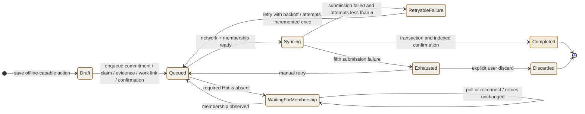

Only commitment creation, claim, evidence attachment, Work linking, and eligible confirmation enter this queue. Accept/decline, assessment attachment, steward override, dispute actions, and value transfer stay online-only because their authorization or freshness cannot be safely deferred. `WaitingForMembership` is app-only provenance, not an on-chain state and not a failed attempt. `Completed` is derived after the corresponding transaction is indexed; it is not a state stored by the protocol contract.

---

## Appendix: Edits to EXISTING docs diagrams at ship (PRD-680 scope)

Not performed now — the docs site describes what is live. Flagged on the Linear issue so they ship with the release:

1. **`docs/docs/builders/architecture/sequence-diagrams.mdx` § Work submission and approval**: after WorkApprovalResolver validation, add the optional bridge step — `WorkApprovalResolver → CommitmentPoolingModule.onWorkApproved (try/catch, non-blocking)` with a one-line note that approvals count toward pre-linked commitments only.
2. **`docs/docs/builders/architecture/sequence-diagrams.mdx` § Assessment flow**: add the v3 authorship split — baseline by evaluator OR operator; delta/re-assessment and technical by Evaluator Hat only; community testimony (Community Hat) as its own thin sequence.
3. **`docs/docs/builders/architecture/erd.mdx`**: append the D7 entity delta and the two new contract blocks to the contract-to-indexer event mapping.
