# Commitment Pooling: Diagrams

**Feature Slug**: `commitment-pooling`
**Stage**: `active`
**Created**: 2026-07-04
**Companions**: `contract-spec.md` (source of truth for every contract name, function, event, and state), `settlement-spec.md` (SettlementModule + Celo Safe topology, D8–D10), `uiux-spec.md` (surface flows), `wireframes.md` (screens). These diagrams are execution reference for implementers and reviewers; they introduce nothing the specs do not already define.

**Docs-site promotion**: these diagrams live here until the August release ships. Promotion into `docs/docs/builders/architecture/` (sequence-diagrams, ERD, plus a commitment journey doc) rides [PRD-680](https://linear.app/greenpill-dev-guild/issue/PRD-680); see §8 for the two *edits* to existing docs diagrams that ship at the same time.

**Role vocabulary (decision 2026-07-18)**: these diagrams say **Garden steward** (protocol pool: **Protocol steward**) for the pool-authority role — the holder of the garden's operator/owner Hats (`_requirePoolSteward`). The shipped app and community glossary still say "Operator"; the app-wide rename is a recorded follow-up, so treat steward = operator/owner Hats wherever the two vocabularies meet.

## Visual coverage matrix

This is the cross-hub inventory of 20 assets, not a table of contents for this file: 15 named D-diagram sections (D1–D13, including D1b and D7b) render as 18 Mermaid blocks below because D6 carries its overview plus three acts and D13 includes a capability-separation mini-diagram. The rows naming Community assets resolve to `.plans/active/community-interface/` (`diagrams.md`, `wireframes.md`, `journeys.md`), and rows 15–16 resolve to the two `wireframes.md` files. “Ready” means the implementation question is answered in the named repo-native artifact; it does **not** mean the feature is live. Every Mermaid block is parsed in the final validation pass, while text frames are checked against their owning spec and route contract.

| # | Asset | Audience | Question answered | Source of truth | Current status | Correction needed | Validation method |
|---:|---|---|---|---|---|---|---|
| 1 | Unified system context | all lanes | Which users, apps, chains, read models, Safes, oracle, and token participate? | CP `contract-spec.md` §4; `settlement-spec.md` §2–5; Community `spec.md` §3 | Ready: D1 | None; keep planned/live labels current | Mermaid parse + architecture cross-read |
| 2 | Module topology and trust boundaries | contracts, security, ops | Which component may authorize, attest, index, execute, or verify? | CP `contract-spec.md` §4–7; `settlement-spec.md` §3–4 | Ready: D1b | None | Mermaid parse + interface/event cross-read |
| 3 | Permission and responsibility matrix | contracts, stewards, QA | Who may perform each sensitive action, and who must not? | CP `contract-spec.md` §6.3; `settlement-spec.md` §3.3–4 | Ready: D13 (matrix + separation mini-diagram, 2026-07-18) | None | Matrix ↔ permission-table cross-read + Mermaid parse |
| 4 | Commitment-pooling ERD | indexer, shared | What is stored and how do composite IDs relate? | CP `contract-spec.md` §8.2 | Ready: D7 | None | Mermaid parse + GraphQL field cross-read |
| 5 | Claim-request/indexer ERD | contracts, indexer | How are stored terms, direct lookup, decline, and supersession represented? | CP `contract-spec.md` §5.3, §8.2 | Ready: D7 | None | Mermaid parse + handler acceptance cross-read |
| 6 | Settlement ERD | settlement, indexer, admin | How do accounts, immutable batches, members, and verification attempts relate? | `settlement-spec.md` §3, §6 | Ready: D7b | None | Mermaid parse + event/entity cross-read |
| 7 | Community EAS/Envio joined-read ERD | Community, indexer, evaluator | Which system owns Needs records versus protocol progress? | Community `spec.md` §4–7 | Ready: Community `diagrams.md` D3 | None | Mermaid parse + four-schema cross-read |
| 8 | Pool/cycle/commitment/NeedStatus/disbursement state machines | contracts, UI, QA | Which states are stored, derived, terminal, or recoverable? | both specs; `settlement-spec.md` §3.2 | Ready: D4–D6, D10; Community D4–D5 | None | Mermaid parse + transition-table cross-read |
| 9 | Offer/request → work → approval → confirmation → fulfillment | member, provider, implementers | How do direction, provider garden, Work, and confirmer defaults interact? | CP `contract-spec.md` §5.3, §6.1 | Ready: D2 | None | Mermaid parse + happy-path acceptance |
| 10 | Approval-gated request/accept/decline/supersede | steward, contracts, indexer | Which stored terms are consumed, and how do competing requests end? | CP `contract-spec.md` §5.3, §6.1, §8.2 | Ready: D11 | None | Mermaid parse + named claim tests |
| 11 | Protocol-to-garden funding route (HoA stream upstream) | settlement, treasury, ops | What does Green Goods authorize, and what remains upstream? | `settlement-spec.md` §2–3 | Ready: D12 | None | Mermaid parse + derived-route tests |
| 12 | Report → oracle receipt verification | settlement, admin, QA | Why is Reported not Verified, and how do retry/stale callbacks work? | `settlement-spec.md` §3.3 | Ready: D9–D10 | None | Mermaid parse + oracle-path acceptance |
| 13 | Need → operator triage → commitment seed | member, steward | How does community intent become protocol work without changing authorship? | Community `spec.md` §6, §8 | Ready: Community D9 | None | Mermaid parse + route/spec cross-read |
| 14 | Offline/waiting-for-membership | member, shared, research | Which jobs wait without retry consumption, and how can users recover? | Community `spec.md` §8.3–8.4 | Ready: Community D8 | None | Mermaid parse + offline acceptance |
| 15 | Cross-surface flow map | product, frontend | What stays in Community, admin `/community`, and existing public client surfaces? | Community `spec.md` §3; CP `uiux-spec.md` | Ready: `wireframes.md` §1 | None | Mermaid parse + monorepo/route cross-read |
| 16 | Low-fidelity frames | member, steward, evaluator, funder | Are entry, state, failure, and recovery screens defined without decorative polish? | both UI specs | Ready: both `wireframes.md` files | None | frame inventory + accessibility review |
| 17 | Persona journeys | research, product, QA | Can every named role reach completion and recovery? | Community `journeys.md` | Ready | None | persona/role checklist |
| 18 | Customer/community journey | research, operators | What happens from discovery through withdrawal or verified outcome? | Community `journeys.md` | Ready | None | stage/recovery checklist |
| 19 | Operator service blueprint | operations, research | Which frontstage, backstage, support, and failure-recovery steps must connect? | Community `journeys.md` | Ready | None | Mermaid parse + handoff cross-read |
| 20 | Research/onboarding/review/rehearsal timeline | research, delivery leads | Who must decide what, by when, before implementation and gathering rehearsal? | Community `research-plan.md`; `journeys.md` | Ready: Community `journeys.md` timeline | None | Mermaid parse + owner/date review |

**Legend for state diagrams**: solid = on-chain state (a named module function performs the transition and emits the listed event); dashed = derived state (indexer/app computes it from events; the chain never stores it); grey dashed = app-only (IndexedDB draft, no chain or indexer presence).

---

## D1. Unified system context

**How to read this**: top to bottom — people use surfaces; surfaces write into the Arbitrum protocol layer; Envio turns protocol events into the read model every surface queries; value moves only on Celo; the oracle carries *facts* (never funds) between the two chains. Solid arrows = writes or value movement, dashed = reads or boundary crossings. The client is ONE codebase with two presentations — the **installed PWA** and the **editorial website** — and the docs site is a separate Docusaurus app; the planned Community PWA is a third, independent app.

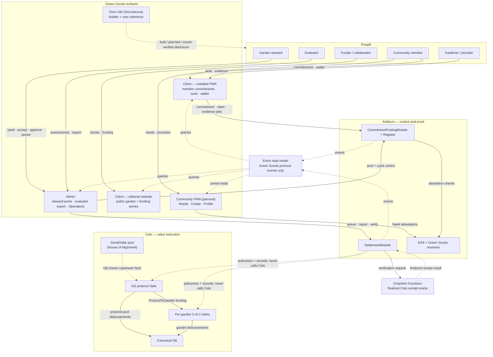

Notes:

- The installed PWA and the editorial website are the same client app in two presentation modes (`getClientPresentationMode`); the docs site is separate. Every surface carries built / planned / reported / oracle-verified status labels so a reader never mistakes a plan for a live feature.
- The GoodDollar House of Alignment pool streams G$ directly into the Green Goods protocol Safe; Green Goods models only the ProtocolToGarden route onward (corrections-log §9).
- EAS and raw Celo transfers are outside Envio. The joined Community read is owned in shared/query composition, not fabricated in an Envio handler.
- A report stores a Celo transaction hash but is not proof. Only a matching Chainlink Functions callback can mark the Arbitrum record `Verified`.

## D1b. Contract/module topology and trust boundaries

**How to read this**: four trust boundaries, one job each. The application boundary queues intent but authorizes nothing. The Arbitrum boundary is the only place state changes are authorized and counted. Envio only restates what Arbitrum emitted. The Celo boundary moves value under Safe + Zodiac scope, and the oracle is the only party that can certify a Celo receipt back to Arbitrum.

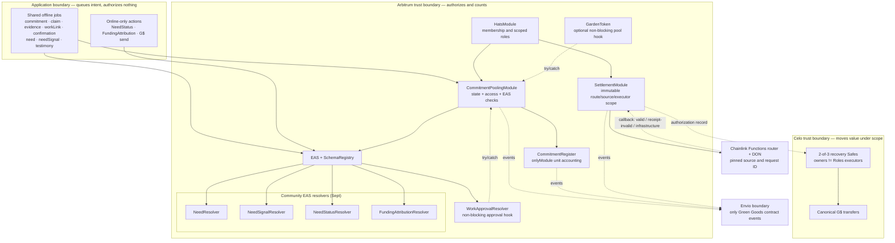

Boundary rules:

- **Application**: drafts and queued jobs are intent, never authority — every write is re-validated on-chain; nothing trusts a client claim.
- **Arbitrum**: HatsModule decides who may act; the pooling module owns state machines and EAS checks; the register counts units only for the module; the settlement module records value authorization but never custodies or calls Celo. Each Community resolver validates exactly one schema — **NeedResolver** (Need records), **NeedSignalResolver** (member signals on a Need), **NeedStatusResolver** (steward status updates), **FundingAttributionResolver** (receipt-checked funding references).
- **Envio**: restates emitted events into the read model — explicit fields only, no actor inference from `transaction.from`.
- **Celo + oracle**: Safes move G$ under Zodiac Roles + Allowance scope; recovery owners are never executors; no human can verify a receipt — only the pinned Functions callback.

Trust rules: no provider may confirm their own delivery, including steward fallback; no recovery owner may be a Safe executor; no human can verify a receipt; no handler infers an actor from `transaction.from`; no contract enumerates all cycles or claims to make a transition.

## D2. Offer/request → work → approval → confirmation → fulfillment

**How to read this**: the full happy path of one promise, left to right in time — created, claimed, delivered through the existing Work → WorkApproval rail, confirmed by the counterparty, and rewarded. The steward performs every one of their steps in the Admin app (Hub work stage + garden Pool tab — W7/W13); the member acts in the client PWA. The payout lane at the end covers **non-G$ declared rewards only** — G$ rewards leave this diagram and queue on the SettlementModule (D9, D12).

Preconditions: pool `Open`; an optional cycle exists, belongs to the pool, and is `Open`. For an Offer, the creator is provider and accepted recipient confirms. For a Request, the accepted claimant is provider and the creator confirms. The stored `providerGarden` controls DomainImpact Work and assessment validation even when the commitment remains in the root protocol pool. Provider self-confirmation fails on every path.

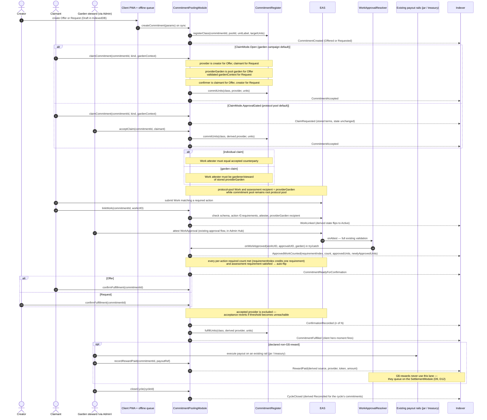

Recovery: approvals that land before `linkWork` are recovered by bounded steward call `syncApprovedWork(commitmentId, approvalUIDs)`; each UID is EAS-verified and deduped through `approvalCounted`. Steward fallback still rejects the provider and records a reason.

## D3. Analog capture + lightweight evidence (review-is-confirmation)

The SupportService / OperatorCaptured path: no Work/WorkApproval rails, no work requirement, counterparty confirmation IS the review (register #20). The member stays the named promise source; the steward is metadata (`recordedBy`).

**When this happens (use cases)**: an elder gardener makes a promise in conversation and the steward records it from a paper field log; a member offers childcare, meals, or transport for a community work day — help that has no Work/approval rail; a field visit is captured fully offline and the evidence photos sync hours later. In every case the member stays the named promise source (`recordedBy` marks the steward as scribe, never as owner), and because these kinds carry no work requirement, the counterparty's confirmation *is* the review — no separate approval step exists.

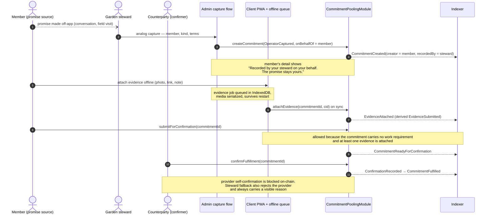

## D4. Pool state machine

Every pool transition is on-chain (rare steward console actions). One pool per garden, idempotent registration; the protocol pool is the root garden's pool (tokenId 1).

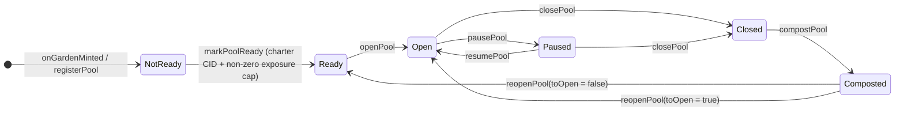

**What each state allows**:

| State | What it means | What's allowed | Who acts |
|---|---|---|---|
| NotReady | garden minted, pool registered, onchain charter/cap predicate not yet met or app Baseline preflight still missing | configuration only | steward |
| Ready | onchain charter + non-zero exposure cap are present; the app offered the write only after a current non-revoked Baseline preflight | seed cycles; open the pool | steward |
| Open | promises can flow | create / claim / confirm commitments; seed and open cycles | members + steward |
| Paused | **the emergency freeze** | nothing new — create, claim, ready-submit, and confirm are disabled; existing records stay readable | steward (resume) |
| Closed | wind-down | no new activity; terminal cleanup of open commitments | steward |
| Composted | **archival rest — history + "ready for the next season"** | read everything; `reopenPool` back to Ready or Open; nothing else | steward |

Composting is archival, not deletion and not the freeze — `Paused` is the freeze. A composted pool keeps its full promise history visible and can wake for a new season via `reopenPool`. Pool-level `Paused` blocks new commitments, claims, and confirmations on that pool only; module-wide `setPaused` blocks operational mutations but keeps owner configuration, unpause, `cancelCommitment`, `expireCommitment`, and `resolveDispute` available for safe wind-down.

## D5. Cycle state machine (types: Season, Campaign)

On-chain enum stores `Seeded / Open / Reconciled / Composted / Cancelled`. `Draft` is app-only; `InProgress` and `Reviewing` are derived overlays of on-chain `Open`.

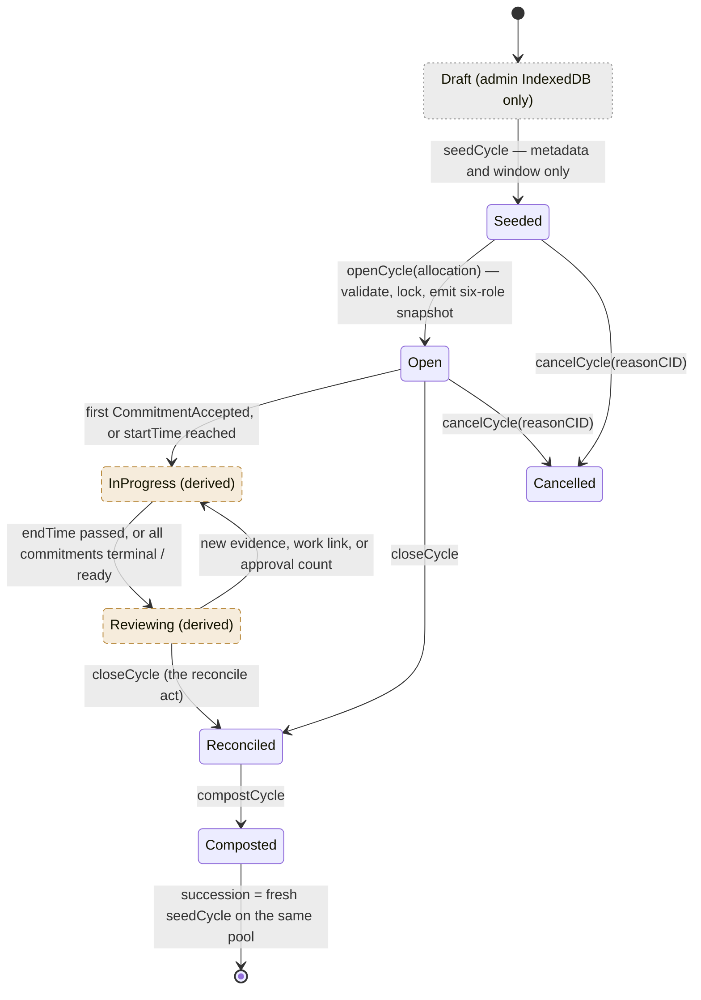

`InProgress` is on-chain `Open`, so `cancelCycle` covers it; Draft cancels are an off-chain discard. Succession is derived by pool ordering — no on-chain predecessor pointer. Opening validates cycle existence, pool ownership, and `Seeded` state. `Pool.openSeasonCycleId` permits exactly one open Season in O(1); any number of Campaigns may be open concurrently and no transition enumerates cycles.

**Reading the middle of the machine**: `InProgress` and `Reviewing` are indexer-derived overlays of on-chain `Open` — the chain never stores them. A cycle sits `Open`, starts reading as `InProgress` at the first accepted commitment (or when `startTime` arrives), flips to `Reviewing` when the window ends or every commitment is terminal/ready, and flips back whenever new evidence lands. `closeCycle` is the reconcile act.

**There is deliberately no loop here**: `Composted` is terminal *for a cycle*. The loop lives at the pool — a fresh `seedCycle` (Season or Campaign) on the same pool is how the next round begins, and the composted cycle's aggregates roll into pool history. (The pool machine, D4, is the one that can reopen.)

**Allocation split**: the six role percentages — gardeners / treasury / steward / evaluator / community / funder, stored on-chain as basis points where 10000 bps = 100% — are supplied atomically to `openCycle`, validated, stored as the immutable cycle snapshot, emitted in `CycleOpened`, and become the cycle's impact-certificate allowlist allocation at close (contract-spec §9.4; default Model 1: 60 / 15 / 10 / 5 / 5 / 5). `seedCycle` carries no allocation.

## D6. Commitment state machine (overview + three acts)

On-chain enum stores `Offered / Requested / Accepted / ReadyForConfirmation / Fulfilled / Cancelled / Expired / Disputed`. `Draft` is app-only; `Active`, `EvidenceSubmitted`, `PartiallyApproved`, and `Reconciled` are derived. The single all-states diagram was accurate but hard to digest, so it is drawn as one compact overview plus three lifecycle acts — the acts zoom into the overview and never disagree with it.

#### D6.0 Overview — the whole life at a glance

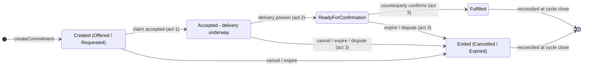

#### D6a. Act 1 — Claim & acceptance

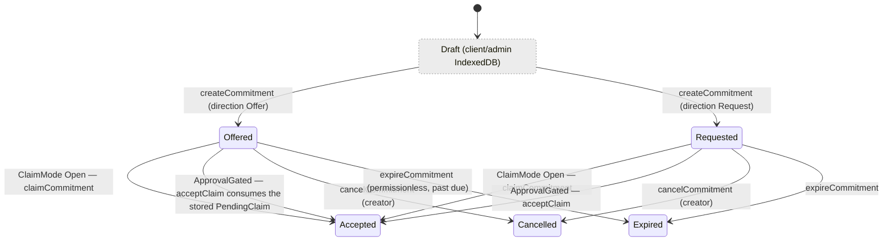

An approval-gated `claimCommitment` stores a PendingClaim and leaves the on-chain state untouched; `declineClaim` clears only that claimant; acceptance consumes the stored terms, derives provider and providerGarden, and commits units exactly once. Competing pending claims resolve by supersession — the full decline/accept/supersede choreography is D11.

#### D6b. Act 2 — Delivery & evidence (`Accepted` → `ReadyForConfirmation`)

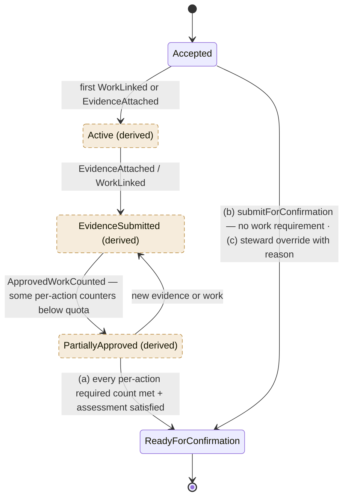

While the derived overlays are showing, the on-chain state remains `Accepted` — so the cancel/expire/dispute transitions in act 3 apply to all of them. The two delivery styles by kind: **DomainImpact** runs the full Work → WorkApproval rail with per-action required counts (`requirementIndex` credits exactly one requirement per approval — amendment 2026-07-18); **SupportService / OperatorCaptured / SeasonCampaign** seeded with no work requirement go through path (b), where the counterparty's confirmation IS the review (D3).

#### D6c. Act 3 — Resolution (confirmation, endings, disputes, reconciliation)

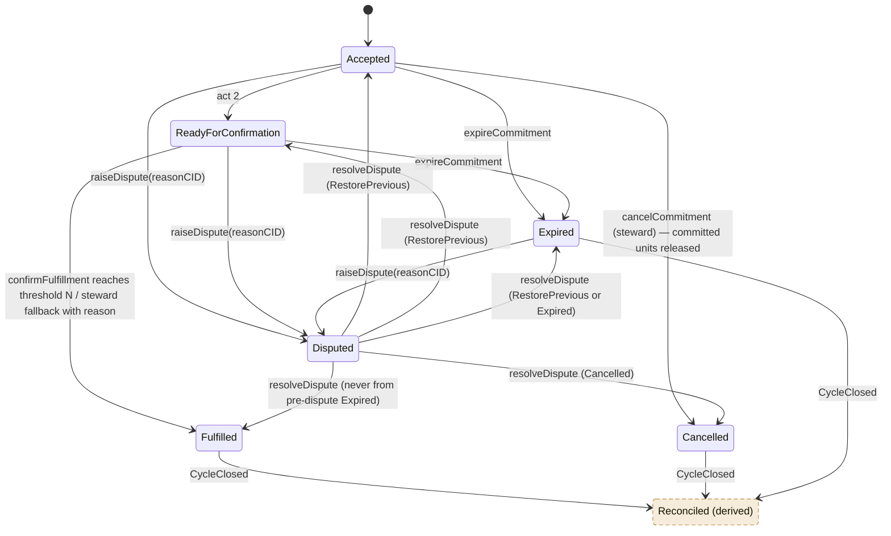

The module stores `preDisputeState` before entering `Disputed`; `RestorePrevious` restores that exact state. There is no `Reconciled` dispute resolution. Unit accounting is exact:

- create registers the class but commits no units;
- cancellation or expiry from `Offered`/`Requested` releases nothing;
- acceptance commits units once;
- cancellation or expiry from `Accepted`/`ReadyForConfirmation` releases those committed units once;
- fulfillment converts committed units with `fulfillUnits`;
- raising or restoring a dispute has no unit effect;
- resolving to `Fulfilled`, `Cancelled`, or `Expired` applies the same conversion/release only when units are still committed; a pre-dispute `Expired` record cannot become `Fulfilled` and never releases twice.

Cycle-less commitments (`cycleId == 0`) derive `Reconciled` from `PoolClosed`; cycle-scoped terminal commitments derive it from `CycleClosed`.

## D7. Indexer entity delta (ERD)

Eight NET-NEW pooling entities, all derived exclusively from module + register events (`chainId-identifier` composite IDs). `GARDEN` is the existing entity; settlement entities are shown separately in D7b. The docs-site ERD gains this delta at ship via PRD-680.

**Units model — how pools measure things** (the legend the ERD fields hang on): every commitment declares its own measure — `unitLabel` (hours, tasks, meals, rides, plants…) and `targetUnits`, the class quota locked at creation. Pools and cycles aggregate those units without ever mixing labels arithmetically in the UI:

- `expectedUnits` = Σ `targetUnits` of accepted commitments — the promised total;
- `approvedUnits` = Σ `newlyApprovedUnits` deltas — how much delivery stewards have approved so far (per-commitment: `floor(targetUnits × Σ min(approvedᵢ, requiredᵢ) / Σ requiredᵢ)`);
- `fulfilledUnits` = Σ units from `UnitsFulfilled` — promises actually confirmed kept;
- `openExposureUnits` = committed − released − fulfilled — the live "how much is promised and not yet resolved" safety gauge, capped per provider by the pool's `providerExposureCap` (the Grassroots-Economics "limiting" primitive);
- derived rates (shared selectors, never stored): `workApprovalProgress = approvedUnits / expectedUnits`, `cycleCompletionRate = fulfilledUnits / expectedUnits`, `promiseKeptRate = commitmentsFulfilled / commitmentsDue`.

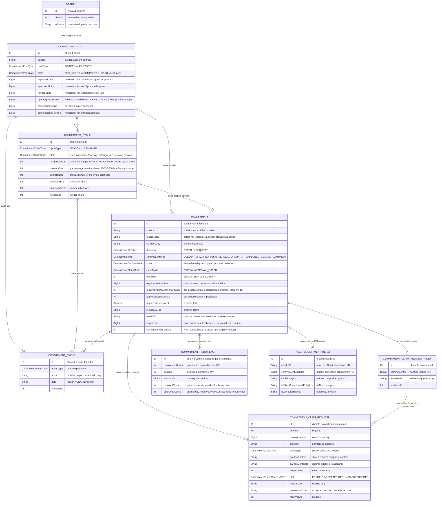

On acceptance, the handler loads `COMMITMENT_CLAIM_REQUEST_INDEX` by `chainId-commitmentId`, marks the accepted request `ACCEPTED`, and marks every other still-pending indexed request `SUPERSEDED`. Pre-acceptance commitment cancellation or expiry uses the same indexed IDs to supersede every pending row with its resolution code. Decline updates only the named request. No handler performs a database-wide scan, and no audit-event actor is inferred from `transaction.from`. `Garden.id` migration requires a full replay/backfill and shared-query cutover; every relationship uses `chainId-*` IDs.

Full field lists: contract-spec §8.2. The four locked aggregates stay numerator/denominator pairs (integer math; division happens in shared selectors, never stored): `workApprovalProgress`, `promiseKeptRate`, `cycleCompletionRate`, `openExposureUnits`.

## D7b. Settlement ERD

**How to read this**: four entities, one story — the singleton `SETTLEMENT_CONFIGURATION` exposes the member-delivery gate; a garden registers its Celo Safe once (`SETTLEMENT_ACCOUNT`); earned rewards and funding top-ups become `DISBURSEMENT` rows; and executors group them into immutable `SETTLEMENT_BATCH` attempts. Verification request IDs, timestamps, expiry, evidence, and failure fields live on the disbursement/batch records and events rather than in a fifth entity.

Every batch is an immutable attempt with 1–24 persisted member IDs. Receipt-invalid batches remain immutable; recovery happens per member and clears the member's old `batchId`. A verification request is replay protection, not a new disbursement state.

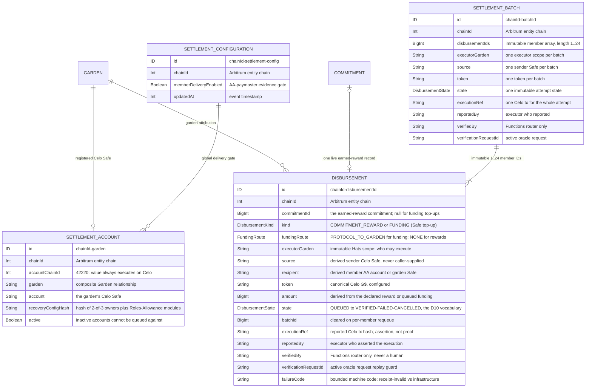

---

## D8. G$ funding topology, Safe recovery, and oracle boundary

**How to read this**: three clusters. The **value chain** down the left — the GoodDollar pool streams into the Green Goods protocol Safe, which funds garden Safes, which pay members. The **Arbitrum control plane** authorizes and records but never touches Celo. The **guard rails** — recovery owners, scoped executors, and the oracle — each hold exactly one power. Split-state settlement per `settlement-spec.md`: authorization on Arbitrum (garden-account-anchored, Hats-gated), execution on Celo from garden-attributed Safes with Zodiac-scoped signers. Canonical G$ never leaves Celo; no bridge carries value authority.

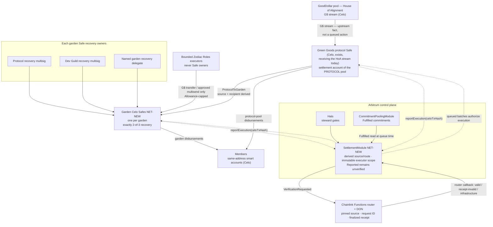

The owner set is exactly protocol recovery multisig, Dev Guild recovery multisig, and one named garden recovery delegate, threshold 2. Deployment fails on duplicate/zero/unnamed owners or owner/executor overlap. Protocol-Safe *inflow* (the HoA stream) is a Celo balance read + external treasury reporting, surfaced on the admin Operations funding view — the module records only the ProtocolToGarden hop onward. The Chainlink callback verifies one finalized Celo receipt: chain 42220, successful status, exact Safe sender, canonical G$, expected recipients and amounts, and complete transfer-log coverage.

## D9. Settlement sequence with failure/retry

**How to read this**: one G$ reward's journey from "queued" to "support arrived", including every way it can fail and recover. The steward authorizes from the Admin Operations console; the executor (a distinct back-office Zodiac Roles member, never a Safe owner) moves value on Celo; only the oracle callback can turn a report into `Verified`. Zodiac Roles scopes *what* the executor may call, and the Allowance module caps *how much* per period.

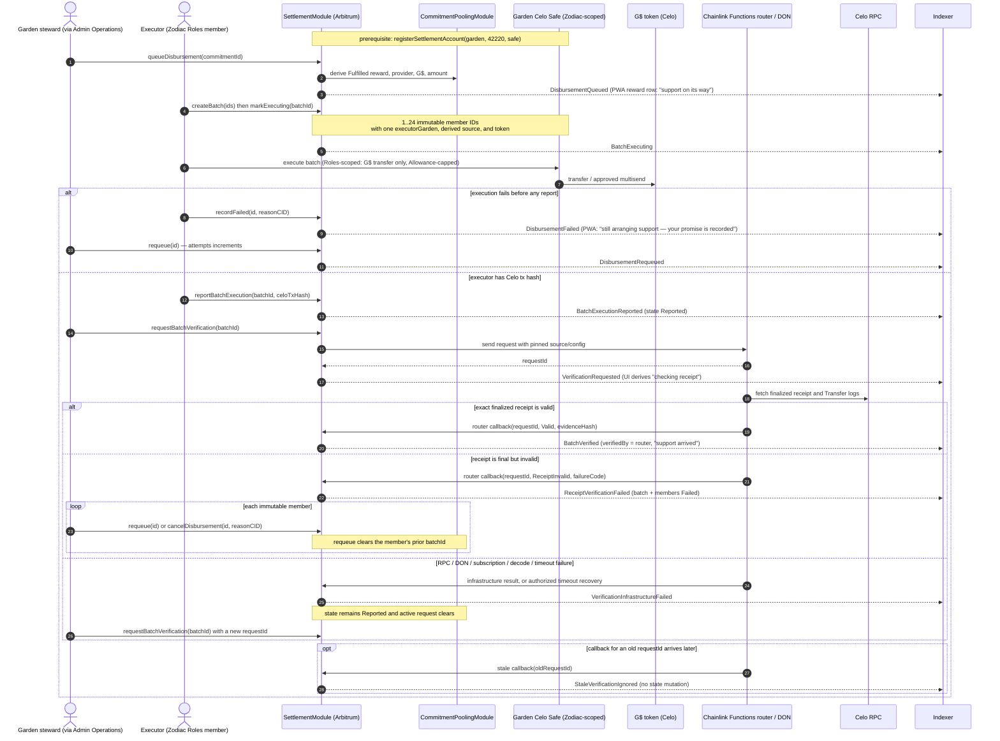

## D10. Disbursement state machine (all module-native, on-chain)

```mermaid
stateDiagram-v2
  direction LR
  [*] --> Queued : queueDisbursement / queueFunding(route, garden, amount)
  Queued --> Executing : markExecuting (executor)
  Executing --> Reported : reportExecution(executionRef)
  Reported --> Reported : requestVerification (derive checking receipt)
  Reported --> Verified : Functions callback Valid
  Reported --> Failed : Functions callback ReceiptInvalid
  Reported --> Reported : infrastructure error / timeout / stale callback
  Executing --> Failed : recordFailed(reasonCID)
  Failed --> Queued : per-member requeue (clear old batchId; attempts++)
  Queued --> Cancelled : cancelDisbursement(reasonCID)
  Failed --> Cancelled : cancelDisbursement(reasonCID)
  Verified --> [*]
  Cancelled --> [*] : frees the commitment for a fresh queue
```

**What each state allows**:

| State | What it means | What's allowed next | Who acts |
|---|---|---|---|
| Queued | authorized on Arbitrum, nothing moved | batch, mark executing, cancel | steward / executor |
| Executing | executor is moving value on Celo | report the tx hash, or record failure | executor |
| Reported | a Celo tx hash is asserted — **not proof** | request oracle verification | executor / steward / owner |
| Reported + active request | "checking receipt" (derived) | wait for callback, or permissioned timeout expiry | oracle / authorized caller |
| Verified | oracle matched the finalized receipt | terminal — "support arrived" | Functions router only |
| Failed | execution failed or receipt invalid | per-member requeue (attempts++) or cancel | steward |
| Cancelled | withdrawn before completion | terminal — frees the commitment for a fresh queue | steward |

A failed Celo leg never touches commitment state — `Fulfilled` on the pooling module is permanent; only the disbursement record cycles. “Checking receipt” is derived from an active verification request while the stored state remains `Reported`. Only the configured Functions router can produce `Verified` or receipt-invalid `Failed`; no human fallback exists. Reward-status precedence for UI: settlement-module record when a disbursement exists, else pooling-module `rewardPaid` (settlement-spec §3.3). Member-facing `Cancelled` copy (closing the gap flagged in prototypes MF review): “This support was withdrawn before it was sent — your promise and its record stay intact.”

## D11. Approval-gated claim request, decline, acceptance, and supersession

**How to read this**: two people want the same commitment. Each `claimCommitment` stores its own PendingClaim (the on-chain commitment state does not move). The steward may decline one claimant without touching the others, or accept one — at which point every other pending request reads as superseded. Declines and supersessions carry distinct member-facing meanings via `resolutionCode`.

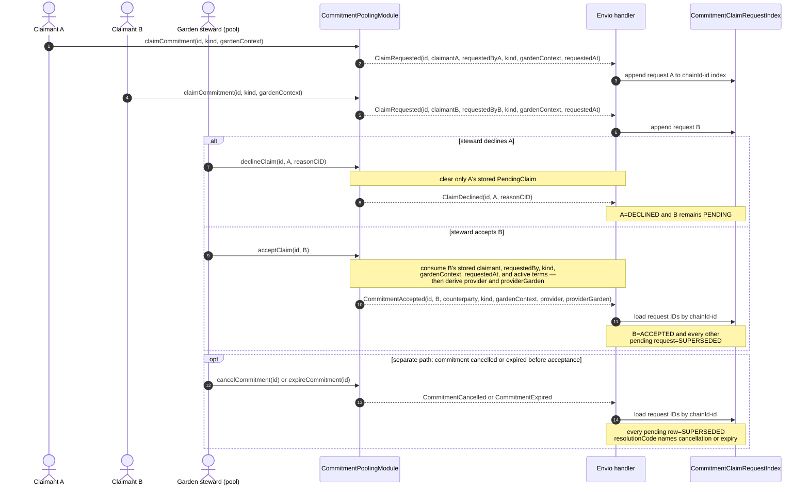

There is no numeric sentinel or database-wide query. A later request after a decline is a fresh active request with a new timestamp; acceptance is deterministic because it cannot substitute caller-provided terms. Superseded copy distinguishes another accepted provider from commitment cancellation/expiry through `resolutionCode`.

## D12. Protocol-to-garden funding route

**How to read this**: the House of Alignment stream arriving in the protocol Safe is an upstream fact — Green Goods never queues, executes, or verifies it. The only queued funding action is the protocol → garden top-up, and it follows the same queue → execute → report → verify discipline as every disbursement (D9).

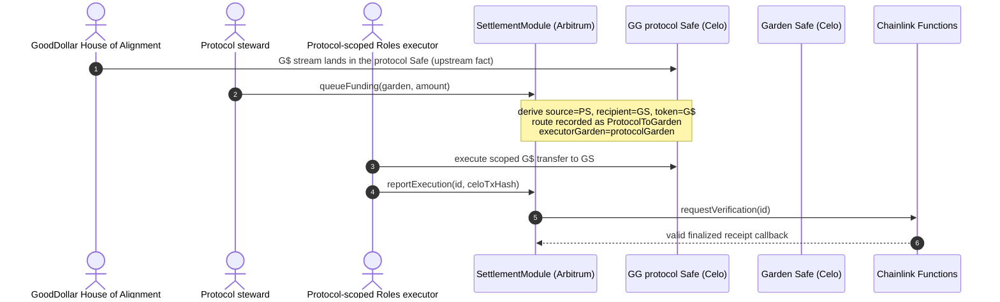

If the Celo AA/paymaster spike fails, this Safe-to-Safe route remains available while `memberDeliveryEnabled` stays false. There is no garden-custody member-claim fallback.

## D13. Permission and responsibility matrix

**How to read this**: one row per capability-bearing role, one column per capability group — ✓ means the role may act within the listed scope, — means no access, ✗ marks an enforced prohibition. "Garden steward" = holder of the garden's operator/owner Hats; the protocol pool resolves stewardship to the root garden. A pilot steward may also hold the scoped executor role. The enforced separations are executor versus recovery ownership and human operation versus oracle verification, not steward versus executor identity.

| Role | Pool & cycle control | Create / claim promises | Evidence & work | Approve work | Confirm fulfillment | Queue & execute value | Verify receipts | Configure protocol |
|---|---|---|---|---|---|---|---|---|
| **Module owner** | ✓ fallback steward | — | — | — | — | ✓ queue funding | — | ✓ pause · Functions config · module wiring |
| **Garden steward** | ✓ seed / open / pause / compost · accept / decline claims | ✓ seed SeasonCampaign · OperatorCaptured (`onBehalfOf`) | ✓ attach for members | ✓ WorkApproval (existing flow) | fallback only, with reason, never as provider | ✓ queue disbursements · requeue / cancel | — | — |
| **Member / gardener** | — | ✓ own Offer / Request · claim open commitments | ✓ own evidence · link work | — | ✓ when eligible confirmer | — | — | — |
| **Accepted provider** | — | — | ✓ deliver + evidence | — | ✗ never own delivery | — | — | — |
| **Evaluator** | — | — | ✓ assessments (baseline / delta / technical) | — | ✓ when named confirmer | — | — | — |
| **Community member** | — | ✓ needs + signals (Community PWA) | ✓ testimony | — | ✓ when named confirmer | — | — | — |
| **Executor (Zodiac Roles member)** | — | — | — | — | — | ✓ execute scoped G$ transfer · report tx hash | — | — |
| **Recovery owner (2-of-3)** | — | — | — | — | — | ✗ execution | — | ✓ recover / rotate Safe modules only |
| **Chainlink Functions router** | — | — | — | — | — | — | ✓ sole Verified / receipt-invalid authority | — |
| **Envio handlers** | — | — | — | — | — | — | — | read model from explicit event fields only |

**Hard prohibitions (the red lines)**:

- No provider may confirm their own delivery — including through steward fallback.
- No recovery owner may be a Safe executor, and no executor may be a recovery owner (deployment and `addExecutor` both reject overlap).
- No human can mark a receipt `Verified` or receipt-invalid `Failed` — only the configured Functions router callback.
- No handler infers an actor from `transaction.from`.
- No contract enumerates all cycles or claims to make a transition.

**Capability separation (why value stays bounded)**:

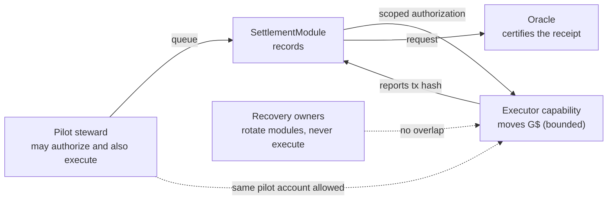

The pilot may combine steward and executor capabilities, so one person can queue and move value within the exact Zodiac selector and allowance scope. That person cannot be a recovery owner and cannot verify a receipt. The oracle verifies but holds no funds; recovery owners can rotate a compromised executor but never execute. No human capability can certify value, and no recovery owner can move it.

---

## Appendix: Edits to EXISTING docs diagrams at ship (PRD-680 scope)

Not performed now — the docs site describes what is live. Flagged on the Linear issue so they ship with the release:

1. **`docs/docs/builders/architecture/sequence-diagrams.mdx` § Work submission and approval**: after WorkApprovalResolver validation, add the optional bridge step — `WorkApprovalResolver → CommitmentPoolingModule.onWorkApproved (try/catch, non-blocking)` with a one-line note that approvals count toward pre-linked commitments only.
2. **`docs/docs/builders/architecture/sequence-diagrams.mdx` § Assessment flow**: add the v3 authorship split — baseline by evaluator OR operator; delta/re-assessment and technical by Evaluator Hat only; community testimony (Community Hat) as its own thin sequence.
3. **`docs/docs/builders/architecture/erd.mdx`**: append the D7 entity delta and the two new contract blocks to the contract-to-indexer event mapping.
