# Commitment Pooling: Flow Prototypes (Storyboards, Missing Frames, Action Inventory)

- **Feature**: `commitment-pooling` · **Stage**: `active` · **Created**: 2026-07-11
- **Updated**: 2026-07-21 — reference-tab redesign + editorial condensation for scannability (see Changelog); the hi-fi render upgrade was register #36.
- **Artifact**: [Commitment Pooling — Flow Prototypes](https://claude.ai/code/artifact/19c3dcad-ac1d-4398-bcd4-57d0c892be2c) — rebuild with `bun .plans/active/commitment-pooling/prototypes-artifact.build.ts` (same URL each time; machinery in `hifi/`).
- **Companions**: `wireframes.md` (frames, referenced by W-id, never re-drawn) · `uiux-spec.md` (canonical flows + §4 state tables) · `contract-spec.md` (§5 state machines, §6.1 permissions) · `settlement-spec.md` (§3.2 disbursement machine, §5 receipt, §7 surface deltas) · `diagrams.md` (D2–D13) · `acceptance-matrix.md` · `../community-interface/wireframes.md` + `spec.md` (September) · **`prototypes-coverage.md`** (screen×state build audit).

## Changelog

| Date | Change |
|---|---|
| 2026-07-11 | Created. Post-review decisions folded (register #34–register #35): MF-1/2a/3/4/5 adopted, MF-12 resolved September, join-request queue tracked (register #35). |
| 2026-07-18 | Audit-response mechanical sync: fund topology (HoA → GG protocol Safe direct; single ProtocolToGarden route), steward vocabulary (steward = operator/owner Hats; contract type names like `OperatorCaptured` unchanged), W12/W22 relocation to the Operations workspace. ⚠️ Settlement-region `SS:`/`DG:`/`WF:` cites were re-pointed to the edited specs; **cites in untouched regions may be offset by that pass — anchor by the named function or frame, not the raw line number.** |
| 2026-07-18 | Hi-fi artifact upgrade (register #36): the artifact now renders every August screen at high fidelity (Warm Earth client PWA, restrained M3 admin, editorial public pages) with a per-screen state matrix (116 states) and a Storybook-style state switcher. Lo-fi variant frames dissolved into parent states (W1P/W1S/W7X/W23G → claim/blocked states; MF-1/3/4/5/6/8/9/10/13 → their spec-placed parents; old deep links alias forward). September CI-W frames stay lo-fi previews. |
| 2026-07-21 | Reference-tab redesign: the sidebar now follows document order under grouped headers, a compact table of contents leads the body, and long sections collapse behind an at-a-glance line. Editorial condensation for scannability (walls → lead-in + bullets) — no spec facts or cites changed. MF-6/MF-9/MF-10/MF-11 status corrected: realized in the hi-fi artifact (W2 · W26 · W1 · W24/W12), no longer "proposed/undrawn." New companion `prototypes-coverage.md` audits every screen's built vs spec'd states. |

**Fidelity** — the storyboards add **no design authority**: they are fidelity-neutral walks of flows the specs already lock, and `wireframes.md` stays the lo-fi structural truth.
- Hi-fi renders pull tokens from the design skills (`.claude/skills/design/`) and `packages/shared/src/styles/theme.css`; type approximates Inter / Plus Jakarta Sans / Fraunces via system fonts (artifacts make no external requests).
- Still-proposed micro-frames keep their amber `proposed` tag per state.
- Rendered copy is build-linted — banned vocabulary, steward naming (Decision Log #28c), quiet-admin, and chain-phrasing placement fail the build, not review.

**Grounding** — every claim carries file:line. Scenario ids S1–S14 follow the RESR-58 r3 index (S1–S12 in `reports/linear/linear-apply-pack.md` §5, S13–S14 in `plan.todo.md` Decision Log #24). Garden theming follows the current pilot-cohort decisions in `plan.todo.md`; worked examples remain in the dated apply-pack §5 Part B, with illustrative quantities per Decision Log #24. **The fourth garden slot is open — no garden is selected and none is named** (Decision Log #29, superseding Decision Log #25 and Decision Log #27; `acceptance-matrix.md` §Fourth garden).

## 0. How to read

**At a glance** — the legend for these storyboards: source keys, frame-id conventions, the per-storyboard anatomy, and the copy rules every cell obeys.

**Source keys** (same folder unless pathed): `UX` uiux-spec · `WF` wireframes · `CS` contract-spec · `SS` settlement-spec · `DG` diagrams · `AM` acceptance-matrix · `LAP` reports/linear/linear-apply-pack.md · `CI-WF` / `CI-SPEC` ../community-interface/wireframes.md / spec.md. `UX:128` = uiux-spec.md line 128. `PT` = plan.todo.md — cite by **Decision Log #N** / **register #N** / section name, never by line (the file shifts).

**Frame ids** — `W1…W23` are commitment-pooling frames (WF); `W2a` is the attach sheet inside W2 (WF:164). September community frames take a `CI-` prefix (`CI-W1…CI-W14`) because that file numbers its own W1–W14 independently (CI-WF:32-443).

**Per-storyboard anatomy** — a meta line, a flow graph, then a numbered steps table:
- **Meta**: persona (`docs/docs/builders/specs/v1-0.mdx` §3.1 archetype + named research persona, `docs/docs/reference/design-research.md:104-164`) · owning scenario(s) · surfaces · garden theme.
- **Flow graph**: mermaid — screens as nodes, user actions as edge labels.
- **Steps table**: **Screen** (frame cite) · **User action** · **System response** (contract event / job kind) · **State** (§4 table names; on-chain vs derived per CS §5) · **If it fails** (recovery pointer). A failure row worth its own walk points at a sibling storyboard rather than repeating it.

**State names** follow the §4 tables — pool/cycle/commitment (UX:53-108), claim-request §4.4 (UX:101-108), disbursement (SS:62); `None`/`UNKNOWN` sentinels are never user-visible (UX:51).

**Copy discipline** — authored placeholder copy uses the mutual-aid vocabulary (UX:40-43) and banned-vocabulary rules (`docs/docs/reference/glossary-community.md:114-121`); settlement copy never says "arrived" before Verified (SS:398, AM:20-25).

## Storyboard index

**At a glance** — fourteen storyboards mapped to personas, scenarios, and surfaces, grouped member → steward → settlement → protocol.

| SB | Journey | Persona(s) | Scenario(s) | Surface(s) |
|---|---|---|---|---|
| SB-1 | Offer → promise kept | Gardener (Maria) + recipient | S1 | Client PWA (+ editorial echo) |
| SB-2 | Request → help arrives (evidence-only SupportService) | Gardener + helper | S2 | Client PWA |
| SB-3 | Steward-reviewed claim: pending / declined / ask again / accepted / superseded | Gardener ×2 + Operator (David) | S3 | Client PWA + Admin |
| SB-4 | Evidence, work linkage, assessment gate (DomainImpact) | Gardener + Evaluator (Dr. Chen) + Operator | S4 | Client PWA + Admin |
| SB-5 | "Not yet" → dispute → four resolutions | Recipient + Operator | S5 | Client PWA + Admin |
| SB-6 | Expiry → offer again (+ admin re-seed) | Gardener + Operator + permissionless caller | S1/S5 edge | Client PWA + Admin |
| SB-7 | Offline draft → queued → synced / retry / membership wait | Gardener | S6 | Client PWA |
| SB-8 | Analog capture (+ steward override + fallback confirmation) | Operator (David) + member | S7 | Admin + Client PWA |
| SB-9 | Pool readiness → cycles: seed, open, pause, close, compost | Operator | S5/S13 admin side | Admin (+ member echo) |
| SB-10 | Declared reward → payout recorded | Operator + Gardener | S13 | Admin + Client PWA |
| SB-11 | G$ support arrives (+ send onward; delivery blocked) | Gardener | S8/S9 member side | Client PWA |
| SB-12 | Funding routes → batch execution → receipt check | Steward + Executor | S8/S9 steward side | Admin (+ Safe app) |
| SB-13 | Cross-garden claim on the protocol pool | Garden Operator (Leila) | S14 | Client PWA + Admin |
| SB-14 | Community Need → triage → seeded promise (September) | Community (Kwame) + Operator | S10 | Community PWA + Admin |

Grouping: member journeys SB-1–7 · steward journeys SB-8–10 · settlement SB-11–12 · protocol + September SB-13–14. The 5-state §4.1 pool lifecycle and cycle cardinality live in SB-9; every other storyboard assumes pool Open unless stated.

---

## SB-1 — Offer → promise kept

**At a glance** — Maria offers help with no reward; João takes it up, adds evidence, and confirms it was kept — the mutual-aid happy path.

**Persona**: Gardener (Maria, research persona `design-research.md:104`) offers; a fellow member takes it up and, as recipient, confirms. **Scenario**: S1 (LAP:164-167). **Surfaces**: client PWA; editorial echo. **Theme**: Tech and Sun Hub design-workshop offer (LAP:122) — mutual aid, no declared reward, no domains.

```mermaid
flowchart LR
  A["W1 Pool tab"] -->|"Offer support"| B["W3 creation flow"]
  B -->|"Make this offer"| C["W1 optimistic card"]
  C -->|"sync"| D["W1 Offered card"]
  D -->|"Joao: Take this up"| E["W2 Accepted detail"]
  E -->|"add evidence"| F["W2a attach sheet"]
  F -->|"send for confirmation"| G["W4 confirm sheet"]
  G -->|"Joao: promise kept"| H["W2 Fulfilled + hero"]
  H -->|"aggregates"| I["W15 pool story"]
```

| # | Screen | User action | System response | State | If it fails |
|---|---|---|---|---|---|
| 1 | W1 (WF:59-101) | Maria opens the garden's Pool tab; Season card + browse render | reads from `queryKeys.pools.*` (UX:222) | Pool Open, cycle Open (UX:59,72) | Pool NotReady/Paused variants → SB-9 |
| 2 | W1 | Taps **[ Offer support ]** (WF:79) | routes to `/home/:id/pool/new?direction=offer` (UX:120) | — | — |
| 3 | W3 (WF:172-196) | Step 1: direction Offer, type Support/service, cycle = Season (explicit binding, UX:150); Step 2: unit "1 session", due date; Step 4 review → **[ Make this offer ]** | enqueues `commitment` job (UX:212); returns to W1 with optimistic card + `··queued··` badge (WF:97) | Draft → local; Offered (optimistic) | Offline/retry lanes → SB-7 |
| 4 | W1 | — (sync completes) | `CommitmentCreated` (CS:132); SyncStatusBar count clears (UX:237) | **Offered** (on-chain) | After 5 retries: Failed chip + retry/discard (UX:240) |
| 5 | W1 | João taps **[ Take this up ]** on the open-mode card (WF:86; helper text names the mode, UX:129) | enqueues `claim`; on sync `CommitmentAccepted` + `UnitsCommitted` (CS:133; DG:176-181). Provider = Maria (Offer creator); confirmer default = João (recipient) — AM:34, UX:32 | **Accepted** | Approval-gated variant → SB-3 |
| 6 | W2 (WF:134-161) | Either party opens detail; **[ + Add ]** evidence → W2a photo/note (WF:164) | `evidence` job → `EvidenceAttached` (CS:739) | derived Active → EvidenceSubmitted (CS:134-135) | Per-row retry; media never dropped (UX:214) |
| 7 | W2 | **Send for confirmation** (evidence-only SupportService; control per UX:141 — drawn in SB-2's MF-6) | `confirmation` job `action:"submit"` → `CommitmentReadyForConfirmation` (CS:138 path b) | **ReadyForConfirmation** | Missing evidence blocks submit (UX:141) |
| 8 | W4 (WF:207-221) | João reviews: sheet names the direction rule — "Offer · provider Maria · recipient confirms" (WF:210) and "Provider Maria cannot confirm this delivery." (WF:215) | — | — | João picks **Not yet** → SB-5 |
| 9 | W4 | **[ Confirm — promise kept ]** | `confirmation` job `action:"confirm"` → `ConfirmationRecorded` 1 of 1 → `CommitmentFulfilled` + `UnitsFulfilled` (CS:139) | **Fulfilled** | Optimism reverts on failure; dedupe by action+id+address (UX:216) |
| 10 | W2 | Maria next opens detail or pool tab | Fulfilled hero fires once, on sync completion, seen-marker tracked (UX:197-199) | Fulfilled | `prefers-reduced-motion` → static frame (UX:430) |
| 11 | W15 (WF:466-479) | — (public echo) | pool story counts tick: "9 promises made, 7 kept so far" — counts-only below the §7.2 threshold (UX:350) | aggregate only | — |

**Comprehension note (finding input)**: the S1 pilot thread names an attending cohort as a 3-of-5 named confirmation group (LAP:122), but W3 has no confirmer step — member creation always gets the direction default (UX:32; W3 steps at UX:150-153), and `setConfirmerRule` is steward-only, pre-acceptance (CS:731). A member cannot express the cohort rule without a steward seeding it (W8 step 3, WF:334-337). The storyboard therefore uses the default recipient rule; the named-group version of this journey is SB-8/W8 territory.

---

## SB-2 — Request → help arrives (evidence-only SupportService)

**At a glance** — Ana asks for a ride, João provides it, and Ana (the request creator) confirms — evidence-only, no work approval and no domains.

**Persona**: Gardener creates a Request; a fellow member takes it up (provider); the Request **creator** confirms. **Scenario**: S2 (LAP:169-172). **Surfaces**: client PWA. **Theme**: the W1 house example "Ride to the market on Sat" (WF:89), run open-claim; Cape Town's steward-seeded cleanup Requests are the S2 admin-side sibling (LAP:136).

```mermaid
flowchart LR
  A["W1 Pool tab"] -->|"Request help"| B["W3 creation flow"]
  B -->|"Ask for this help"| C["W1 Requested card"]
  C -->|"Joao: I can help"| D["W2 Accepted detail"]
  D -->|"Joao adds evidence"| E["W2a attach sheet"]
  E -->|"send for confirmation"| F["W4 confirm sheet"]
  F -->|"creator: promise kept"| G["W2 Fulfilled"]
```

| # | Screen | User action | System response | State | If it fails |
|---|---|---|---|---|---|
| 1 | W1 | Ana taps **[ Request help ]** (WF:79) | `/pool/new?direction=request` (UX:120) | — | — |
| 2 | W3 | Direction Request, type Support/service — **step 3 anchors are skipped entirely** (WF:199; UX:152); unit "1 ride"; review → **[ Ask for this help ]** (UX:153) | `commitment` job → `CommitmentCreated` | **Requested** (UX:85) | SB-7 lanes |
| 3 | W1 | João taps the Request card's **"I can help"** CTA (UX:85) | `claim` → `CommitmentAccepted`. Provider = **João** (accepted claimant); confirmer = **Ana** (Request creator) — AM:34, UX:32 | **Accepted** | Gated variant → SB-3 |
| 4 | W2 | João attaches ride photo via W2a | `EvidenceAttached` | EvidenceSubmitted (derived) | row retry (UX:214) |
| 5 | W2 | Either eligible party (creator, counterparty, or steward — CS:741) taps **Send for confirmation** | `confirmation` `{action:"submit"}` (UX:141,216) → `CommitmentReadyForConfirmation` (CS:138b) | **ReadyForConfirmation** | Requires ≥1 evidence + declared assessment (CS:138b) |
| 6 | W4 | Ana's sheet reads **"claimant provides · request creator confirms"** (WF:224); João is excluded | — | — | Ana picks Not yet → SB-5 |
| 7 | W4 | Ana **[ Confirm — promise kept ]** | `ConfirmationRecorded` → `CommitmentFulfilled` (CS:139) | **Fulfilled** | — |

The send-for-confirmation control is **spec-placed but undrawn**: UX:141 defines it on evidence-only detail, UX:287 gives the admin twin, and W2 as drawn is a DomainImpact commitment with no such row. Proposed micro-frame (MF-6):

```text
NEW — proposed lo-fi, not a locked design (MF-6: W2 evidence-only variant, below the Evidence list)
┌──────────────────────────────────────────────┐
│ Evidence attached: 1 · no work required      │  evidence-only helper line
│ [ Send for confirmation ]                    │  → confirmation{submit} job
│ the person this promise was made to          │
│ confirms it was kept                         │  direction-aware helper (UX:32)
└──────────────────────────────────────────────┘
```

**Direction-flip legibility check (finding input)**: the flip is carried at the moment of action by W4's responsibility line (WF:210 for Offers, WF:224 for Requests) — but browse cards (W1) and detail headers (W2) carry no "who will confirm" line before the confirmation moment; a provider can reach W4 before learning they cannot confirm. See findings.

---

## SB-3 — Steward-reviewed claim: pending, declined, ask again, accepted, superseded

**At a glance** — two gardeners compete for scarce slots; a steward accepts one and the rest go Superseded — the pending / declined / ask-again / accepted / superseded panels.

**Persona**: two Gardeners compete for scarce crew slots; Operator (David, `design-research.md:118`) reviews. **Scenario**: S3 (LAP:174-177). **Surfaces**: client PWA + admin. **Theme**: AgroforestDAO planting Request, 200 seedlings, steward-reviewed because crew slots are scarce (LAP:150).

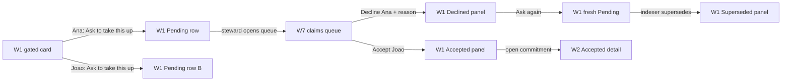

| # | Screen | User action | System response | State | If it fails |
|---|---|---|---|---|---|
| 1 | W1 | Ana taps **[ Ask to take this up ]** (WF:92); card helper reads "stewards review who takes this up" (WF:91) | `claim` job → `ClaimRequested` with stored `{claimant, requestedBy, kind, gardenContext, requestedAt}` (CS:133; UX:99) | commitment stays **Offered/Requested**; request **Pending** (§4.4 UX:103) | Pre-event network failure reverts the optimistic row — ordinary Retry/Discard, **never** rendered as Declined (UX:108) |
| 2 | W1 | Ana sees the PENDING panel: "Waiting for steward · requested Jul 9 · Provider: myself" (WF:112-117) | commitment stays browseable to other claimants (UX:103) | Pending | No claimant-cancel exists — wait for accept/decline/supersede (UX:103) |
| 3 | W1 | João submits a second request the same way | second Pending row indexed (DG:684-687) | Pending ×2 | — |
| 4 | W7 | David opens the claims queue: each row shows claimant · requestedBy · kind · provider context · requested time (WF:291-296; UX:272) | reads `claimRequests` index | — | — |
| 5 | W7 | **[ Decline… ]** on Ana's row with reason | `declineClaim` (CS:734, online mutation UX:218) → `ClaimDeclined`; **only Ana's row changes** (WF:305-309) | Ana **Declined**; João still Pending (UX:105) | Failure preserves indexed state + inline retry (UX:218) |
| 6 | W1 | Ana reads the rationale, taps **[ Ask again ]** (WF:113-118) | a **fresh** request record; never retries the declined row (UX:105) | new Pending | Only while the commitment is still claimable (UX:105) |
| 7 | W7 | **[ Accept ]** on João's row | `acceptClaim` consumes João's stored terms — caller-supplied replacements are never accepted (CS:733; UX:104); `CommitmentAccepted`; indexer marks every other pending row **Superseded** (DG:696-702) | commitment **Accepted**; Ana's fresh row **Superseded** | — |
| 8 | W1 | Ana sees SUPERSEDED: "Taken up by another provider" — resolution code distinguishes acceptance from cancellation/expiry; "This is not a sync failure." (WF:119-123; UX:106; DG:706) | — | Superseded (terminal) | Exit to browse; new request only if it becomes claimable again (UX:106) |
| 9 | W2 | João proceeds to work/evidence | — | Accepted → SB-4 | — |

No missing frames: the four §4.4 request panels (WF:111-125) and the two admin outcome panels (WF:304-311) already cover every state this storyboard touches. Supersession is an indexer side-effect, never a user action (DG:466) — it appears in the inventory's system table only.

---

## SB-4 — Evidence, work linkage, and the assessment gate (DomainImpact)

**At a glance** — a DomainImpact promise reaches Ready through the existing work-approval rails plus an attached assessment — never send-for-confirmation.

**Persona**: Gardener provides; Operator approves work on existing rails; Evaluator (Dr. Chen, `design-research.md:132`) authors the assessment. **Scenario**: S4 (LAP:179-182). **Surfaces**: client PWA + admin. **Theme**: AgroforestDAO planting-education cycle pairing AGRO + EDU positionally (LAP:151).

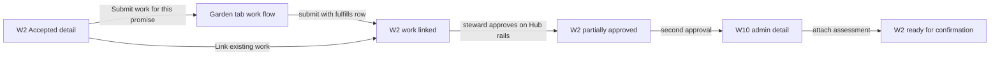

| # | Screen | User action | System response | State | If it fails |
|---|---|---|---|---|---|
| 1 | W2 | Provider opens the commitment: type chips `(Offer)(AGRO)`, work section present because DomainImpact (WF:151-154) | — | **Accepted** | — |
| 2 | W2 | **[ Submit work for this promise ]** deep-links into the existing AppBar Garden work flow with commitment context (UX:140,174) | work flow store gains the NET-NEW commitment context field (UX:174) | — | — |
| 3 | existing work flow (`packages/client/src/views/Garden/index.tsx:46-49`, UX:116) | Member completes Intro → Media → Details → Review; Review shows the "fulfills: {commitment title}" row (UX:174) | `work` job (existing, unchanged) with `meta.commitmentId`; queue auto-enqueues dependent `workLink` after the work syncs (UX:174,220) | — | Existing work-flow failure handling (UX:220) |
| 4 | W2 | (alternative) **[ Link existing work ]** opens the picker of own approved/pending works (UX:140) | `workLink` job direct (UX:215) → `WorkLinked` (CS:735: accepted claimant/counterparty or steward) | derived **Active/EvidenceSubmitted** | Row "linking" chip → failed state + retry; the work itself is unaffected (UX:215) |
| 5 | Hub Work stage (existing) | Operator approves the work — untouched WorkApproval rails (UX:285) | EAS → `WorkApprovalResolver` → `onWorkApproved` → `ApprovedWorkCounted` (CS:737, never reverts) | **PartiallyApproved** — "1 of 2" partial progress bar (UX:89) | Approval landing before linkage → steward `syncApprovedWork` (CS:738, DG:221 — no app surface, see inventory ops table) |
| 6 | W2 | Provider submits the second work; steward approves | every per-action `requiredApprovedWorkCounts[i]` is met | approval gate met | — |
| 7 | W14 | Dr. Chen creates the delta assessment — cycle selector + kind toggle + baseline picker, delta renders only for Evaluator-hat holders (WF:447-455; UX:295) | direct EAS attest (extends existing flow, online-only, UX:295) | — | Duplicate baseline per garden/cycle/domain points at the existing record (WF:453-454) |
| 8 | admin commitment detail (MF-13) | Operator or evaluator picks **Attach assessment** — picker lists only non-revoked v2/v3 attestations whose recipient equals the stored `providerGarden` (UX:287; CS:740) | `attachAssessment`; module re-runs the auto-Ready check (CS:740) | **ReadyForConfirmation** via CS:138 path a | Wrong-recipient attestations never appear (UX:287) |
| 9 | W2 | Confirmation proceeds as SB-1 steps 8–10 | — | → Fulfilled | Not yet → SB-5 |

DomainImpact **never** shows Send-for-confirmation (UX:141; CS:138b rejects it) — work approvals drive Ready. Micro-frames this storyboard needs:

```text
NEW — proposed lo-fi, not a locked design (MF-7: work-flow Review step, one added row)
│ fulfills: Plant 200 seedlings  (Offer · AGRO) │  read-only row when commitment
│                                               │  context is set (UX:174)
```

```text
NEW — proposed lo-fi, not a locked design (MF-13: attach-assessment picker, AdminDialog)
┌── Attach assessment ─────────────────────────┐
│ provider garden: AgroforestDAO               │
│ ◉ Baseline — AGRO — Jul 2   (v3)             │  only non-revoked v2/v3 with
│ ○ Delta — AGRO+EDU — Jul 9  (v3)             │  recipient == providerGarden
│ [ Attach ]                        [ Cancel ] │  (UX:287)
└──────────────────────────────────────────────┘
```

---

## SB-5 — "Not yet" → dispute → the four resolutions

**At a glance** — a confirmer says "not yet"; a steward resolves the dispute to one of four outcomes; every reason lands in the member timeline.

**Persona**: recipient/confirmer raises; Operator resolves. **Scenario**: S5 dispute half (LAP:184-187). **Surfaces**: client PWA + admin.

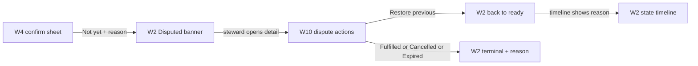

| # | Screen | User action | System response | State | If it fails |
|---|---|---|---|---|---|
| 1 | W4 | Confirmer picks **[ Not yet — tell the stewards why ]** (WF:218); required reason field is revealed and focused (UX:426) | **online** `raiseDispute` — deliberately not a queue kind (UX:167,217); `CommitmentDisputed`, prior state stored in `preDisputeState` (CS:143) | **Disputed** | Tx failure leaves ReadyForConfirmation + inline retry (UX:217) |
| 2 | W2 | Member view | banner "under review by stewards", CTAs frozen (UX:95; WF:166) | Disputed | — |
| 3 | W13 / W7 | Steward finds the disputed row | dispute never surfaces individually on public pages; aggregates unchanged until resolved (UX:95) | — | — |
| 4 | W10 | **Resolve dispute → ( Restore previous / Fulfilled / Cancelled / Expired ) + reason** (WF:381-382) | `resolveDispute`, steward-only (CS:144); `DisputeResolved` carries the restored/final state | per choice | — |
| 5a | W2 | — Restore previous | returns to the exact stored prior state **without unit movement** (CS:144; LAP:186) | **ReadyForConfirmation** (or stored prior) | — |
| 5b | W2 | — Fulfilled / Cancelled / Expired | terminal transition with reason; **an Expired prior state can never resolve Fulfilled** (CS:144; WF:382) | terminal | — |
| 6 | W2 | Member re-opens detail | every reason renders in the member state timeline too (UX:300; WF:144-146) | — | — |

**Adjacent gap this storyboard exposes (finding input)** — the *direct* cancel paths have **no control on any frame**:
- creator cancel from Offered/Requested and steward cancel from Accepted are both contract-real (CS:745; AM:36-37), yet W2/§5.3 draw none for members (UX:135-144) and W10 draws none for stewards (WF:377-382);
- meanwhile §4.1 Paused explicitly promises "cancellation/expiry … remain available" (UX:60; WF:104), so until a control is placed, §4.3 Cancelled (UX:93) is reachable only through dispute resolution.

**Decided 2026-07-11 (register #34b)**: MF-2a (member pre-acceptance withdraw) is adopted into August scope; MF-2b (steward cancel placement) remains open. Proposed micro-frames:

```text
NEW — proposed lo-fi, not a locked design (MF-2a: W2 owner variant, before acceptance)
│ [ Withdraw this offer… ]                     │  creator only, Offered/Requested;
│  asks for a reason · leaves history intact   │  cancelCommitment (CS:745)

NEW — proposed lo-fi, not a locked design (MF-2b: W10 actions row addition)
│ [ Cancel commitment… ]  reason required      │  steward; Offered/Requested/Accepted
│  never from ready-for-confirmation (CS:745)  │
```

---

## SB-6 — Expiry → offer again (+ admin re-seed)

**At a glance** — a due date passes, committed units release exactly once, and the owner offers again — plus the admin re-seed of lapsed promises.

**Persona**: Gardener owner of a lapsed promise; Operator running the expiry queue; any caller may trigger expiry. **Scenario**: S1/S5 edge — "Expiry releases committed units once; an expired commitment never becomes Fulfilled" (LAP:186). **Surfaces**: client PWA + admin.

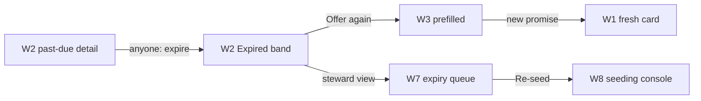

| # | Screen | User action | System response | State | If it fails |
|---|---|---|---|---|---|
| 1 | — | Due date passes (or cycle endTime when dueDate == 0) | `expireCommitment` is **permissionless** (CS:746,142) — but no surface draws a trigger; in practice a keeper/cron or admin sweep must call it (finding input) | — | Uncalled = commitment lingers past due |
| 2 | W2 | Owner opens the lapsed promise | `CommitmentExpired`; committed units released exactly once (LAP:186); still-pending claim requests → Superseded with `COMMITMENT_EXPIRED` (CS:142) | **Expired** | — |
| 3 | W2 | **[ Offer again ]** (§4.3: "Chip + 'offer again' CTA for owner (per-cycle renewal, deep-dive L1)" UX:94) | re-enters W3 with prior fields prefilled; a **fresh** commitment (create re-entry, not a state rewind) | new Draft → Offered | — |
| 4 | W7 | Operator reviews lapsed seeded promises — §4.3 admin cell "Expiry queue + re-seed" (UX:94) | re-seed opens W8 with the lapsed terms | — | — |

Neither expiry moment is drawn today. **Decided 2026-07-11 (register #34d)**: both MF-3 and MF-4 ship in August; the permissionless keeper cron is a post-launch ops backstop (zero migration — CS:746 is already permissionless), not pre-08-31 build. Proposed micro-frames:

```text
NEW — proposed lo-fi, not a locked design (MF-3: W2 expired band, replaces the confirm block)
┌──────────────────────────────────────────────┐
│ (Expired)  This promise ran through Aug 12.  │  calm date phrasing, no timer
│ The season moved on — you can offer it again.│
│ [ Offer again ]                              │  → W3 prefilled (UX:94)
└──────────────────────────────────────────────┘

NEW — proposed lo-fi, not a locked design (MF-4: W7 section, below Claims waiting)
┌─ Lapsed this cycle ────────────────────────────────────────────────────┐
│ ≡ Field survey  (Request)(Expired)  due Jul 2 · 0 of 1 taken up        │
│                                  [ Re-seed… ]  [ View history ]        │  → W8 prefilled
└────────────────────────────────────────────────────────────────────────┘
```

---

## SB-7 — Offline draft → queued → synced / retry / membership wait

**At a glance** — a field draft persists offline, syncs when connected, retries on failure, and waits for garden membership without burning retries.

**Persona**: Gardener in the field. **Scenario**: S6 (LAP:189-192). **Surfaces**: client PWA. **Theme**: AgroforestDAO rural connectivity; this journey carries the pt-BR locale proof (LAP:153).

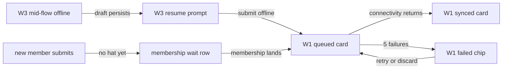

| # | Screen | User action | System response | State | If it fails |
|---|---|---|---|---|---|
| 1 | W3 | Connection drops mid-creation | draft persists locally, `WorkDraftRecord` semantics (UX:155,83) | Draft (app-only, CS §5 register #6) | — |
| 2 | W3 | Re-entry later | resume prompt via the existing DraftDialog pattern (UX:155) | Draft | Discard = delete draft |
| 3 | W1 | Submit while still offline | `commitment` job queued; optimistic card with `··queued··` badge (WF:97); SyncStatusBar count above the AppBar (UX:237); aria-live polite "Saved on this device, will sync when connected" (UX:427) | Offered (optimistic) | — |
| 4 | W1 | Connectivity returns | job executes; `CommitmentCreated`; "N promises synced" announcement (UX:427); pool queries invalidated (UX:212) | **Offered** (on-chain) | — |
| 5 | W1 | (failure lane) 5 attempts exhaust `MAX_RETRIES` (UX:206) | Failed chip + **retry / discard**; error text via `parseContractError` + `USER_FRIENDLY_ERRORS` (UX:240) | Failed (local) | Retry re-enters step 4 |
| 6 | — | (membership-wait lane) a brand-new member's job needs a garden hat that hasn't landed | S6: the job waits in `waiting_for_hat` **without consuming retries**, resumes after membership, "never fabricates a successful write" (LAP:191); the ≥99% sync metric explicitly excludes time in this state (`acceptance-matrix.md` §6) | waiting (local) | — |

**Spec gap (finding input)** — `waiting_for_hat` is required by scenario S6 and the acceptance metric, and CI-W4 draws it for September community jobs (CI-WF:124-159):
- but for the five pool job kinds, uiux-spec's queue treatments (§5.11 UX:204-224; §5.12 UX:226-243) define only queued/failed/retry chrome — no pool-surface treatment exists;
- S6 also names **Edit/Retry/Cancel/Delete** for queued jobs (LAP:191), where §5.12 offers only retry/discard (UX:240).

**Decided 2026-07-11 (register #34c)**: in scope for August — the pre-flight membership check consumes no retries, the join-request approval (register #35) is the canonical resume trigger, and uiux-spec §5.11/§5.12 are updated. Proposed micro-frame:

```text
NEW — proposed lo-fi, not a locked design (MF-5: queued-row variant, W1/W5 groups)
│ ≡ ··waiting·· Compost workshop   (Offered)   │  amber queued chrome variant
│   waiting for your garden membership —       │  no retries used (S6, LAP:191)
│   will send once you're welcomed in          │
```

---

## SB-8 — Analog capture (+ steward override + fallback confirmation)

**At a glance** — a steward records a promise for a device-free member who stays its owner — with the override and fallback-confirmation beats.

**Persona**: Operator (David) records for a device-free member; the member stays the promise's owner. **Scenario**: S7 (LAP:194-197). **Surfaces**: admin + client PWA. **Theme**: Cape Town beach cleanup, member without a device (LAP:138).

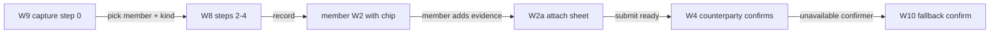

| # | Screen | User action | System response | State | If it fails |
|---|---|---|---|---|---|
| 1 | W9 | David opens `/garden/pool/capture`; fixed header reads **"Recorded by {steward} on your behalf. The promise stays yours."** (WF:371-373; UX:437) | — | — | — |
| 2 | W9 | Step 0: search member (the social source), capture kind = their offer / their request / confirmation (WF:354-356) | `capturedFor`/`onBehalfOf` set; captured confirmations always carry a reason (WF:357; UX:291) | — | — |
| 3 | W8 | Steps 2–4 as seeding (WF:359) | `commitment` job, kind OperatorCaptured, `onBehalfOf` = member (CS:730); `CommitmentCreated(creator = member, recordedBy = operator)` (DG:236-238) | **Offered/Requested**, owned by the member | Writes ride job kinds, never direct form writes (UX:291) |
| 4 | member's W2 | Member later opens the promise | chip: "(recorded by your steward on your behalf)" (WF:135); member remains the named source (UX:144) | — | — |
| 5 | W2/W2a | Member attaches evidence offline; **Send for confirmation** (evidence-only path, count 0 — CS:138b) | as SB-2 steps 4–5 | **ReadyForConfirmation** | SB-7 lanes |
| 6 | W4 | Counterparty confirms — provider still excluded (WF:215) | `ConfirmationRecorded` → `CommitmentFulfilled` | **Fulfilled** | Not yet → SB-5 |
| 7 | W10 | (override beat) work threshold met but a rejected work needs waiving, or evidence review happened on site: steward **Mark ready with override** with visible reason (UX:287; CS:138 path c) | `CommitmentReadyForConfirmation` with override marker in admin AND member timelines (UX:301; WF:144-146) | ReadyForConfirmation | — |
| 8 | W10 | (fallback beat) the named confirmer never arrives: **[ Confirm as fallback… ]** with mandatory reason (WF:379) | `confirmFulfillmentAsFallback` (CS:744) — "Provider address can never use fallback confirmation." (WF:380) | Fulfilled | Provider-steward blocked on-chain (`SelfConfirmation`, CS:744) |

Dignity check carried by existing frames: the member is the promise's owner on every surface (chip + `creator = member`), the steward is metadata (`recordedBy`) — UX:437, DG:236-238. No missing frames.

---

## SB-9 — Pool readiness → cycles: seed, open, pause, close, compost

**At a glance** — stand up a pool and run a season — seed → open → pause → close → compost — carrying the 5-state pool lifecycle and cycle cardinality.

**Persona**: Operator standing up the pool and running a season. **Scenario**: S5 cycle half (LAP:184-187) + S13 admin side (PT:42). **Surfaces**: admin, with member echoes. **Theme**: any pilot garden's first season.

```mermaid
flowchart LR
  A["W7 NotReady checklist"] -->|"charter + cap + baseline"| B["W7 Ready card"]
  B -->|"open pool GAP MF-1"| C["W7 Open card"]
  C -->|"seed cycle"| D["W8-style seed flow"]
  D -->|"open cycle + allocation"| E["W11 allocation step"]
  E -->|"CycleOpened"| F["W1 member Season card"]
  F -->|"pause + resume"| G["W7 paused band"]
  G -->|"close cycle"| H["W7 Reconciled report"]
  H -->|"compost"| I["W7 history + next season"]
```

| # | Screen | User action | System response | State | If it fails |
|---|---|---|---|---|---|
| 1 | W7 | Pool card shows the NotReady checklist: charter CID, non-zero provider exposure cap, one current non-revoked Baseline (v2/v3, recipient = pool garden) (UX:57,269; WF:104 variant) | — | Pool **NotReady** (client: Pool tab absent, UX:57) | — |
| 2 | W7 | **[ Edit charter ]** (WF:274) → charter CID; exposure cap field | `setPoolCharter` (CS:723); `setProviderExposureCap` — required before Ready (CS:751) | — | — |
| 3 | W7 | **Mark ready** — spec-placed: "The Ready action stays disabled until all three readiness inputs are present" (UX:269); not drawn on W7 | `markPoolReady` (CS:724) | Pool **Ready** — member sees "warming up" banner, browse/create disabled (UX:58) | Missing inputs keep it disabled (UX:269) |
| 4 | — | **GAP — the drawn console cannot open the pool.** §4.1 Ready's admin cell offers only "Seed-first-cycle CTA" (UX:58); `seedCycle` accepts pool Ready-or-Open (CS:726) but `openCycle` requires **pool Open** (CS:727), and no frame or spec placement carries an `openPool` control (grep: zero hits across UX/WF). `closePool` is equally unplaced. | `openPool` / `closePool` exist on-chain only (CS:100,102) | **deadlock before the first cycle opens** | MF-1 below; top finding — **decided 2026-07-11 (register #34a)**: adopted on the pool card, plus a Ready-state guard prompt in the open-cycle flow |
| 5 | W7 | Seed the Season: cycle flow per §6.2.2 — type, window, metadata (WF:280 `[ New Campaign ]` grammar; Season slot blocks a second open Season, WF:277-279; UX:66) | `seedCycle` carries no allocation | Cycle **Seeded** — member sees "opens soon", seeded promises browsable read-only (UX:71) | Second Season blocked with a link to the existing one (UX:66) |
| 6 | W11 | Open-cycle flow's allocation step: preset → editable percentages, encoded as six bps fields whose total must equal 10,000; soft warning below 15% treasury (WF:390-398; UX:322-330) | `openCycle(cycleId, allocation)` validates, stores, and emits the six-class snapshot | Cycle **Open** | Encoded sum ≠ 10,000 blocks (WF:395) |
| 7 | W1 | (member echo) Season card live: stepper, progress, calm date (WF:66-70) | derived InProgress/Reviewing overlay per activity (CS:115-117) | Open → InProgress | — |
| 8 | W7 | Mid-season **[ Pause… ]** with reason (WF:274) | `pausePool(reasonCID)` (CS:725,101) | Pool **Paused** — member banner "new participation paused by stewards" + reason; create/claim/Ready-submit/confirm disabled; evidence, linkage, cancellation/expiry, dispute recovery stay available (UX:60; WF:104) | Resume clears the indexed reason (CS:725) |
| 9 | W7 | **Resume** | `resumePool` | Pool Open | — |
| 10 | W7 | Season end: **close cycle** (the reconcile act) | `closeCycle` → `CycleClosed` (CS:118); Fulfilled/Cancelled/Expired commitments derive Reconciled (CS:140,145) | Cycle **Reconciled** | — |
| 11 | W7 | Read the reconciliation report (§4.2 admin cell UX:75; W7 history row's "scoped report ▸" WF:283 — view undrawn, MF-9) | — | — | — |
| 12 | W1 | (member echo) cycle summary card + the medium cycle-close hero, once (UX:75,200) — card undrawn, MF-10 | — | Reconciled | reduced-motion → static (UX:430) |
| 13 | W7 | **[ Compost ]** | `compostCycle` → `CycleComposted` (CS:119) | Cycle **Composted** — member: history + "ready for the next season" (UX:62,76) | — |
| 14 | W7 | (variants) **Cancel…** a cycle with reason (WF:279-282) → §4.2 Cancelled quiet banner w/ reason for members (UX:77); pool coda: close → compost → **Reopen** (UX:61-62; `reopenPool` CS:104) — closePool adopted with MF-1 (register #34a) | `cancelCycle` (CS:729); `compostPool`/`reopenPool` (CS:725) | Cancelled / Closed / Composted | — |

```text
NEW — proposed lo-fi, not a locked design (MF-1: W7 pool status card action row)
┌─ Pool ─────────────────────────────────────────────────────────────┐
│ (Ready) charter ✓ baseline ✓ cap 24                                │
│ [ Open pool ]                    [ Edit charter ] [ Pause… ]       │  openPool (CS:100)
│  — once Open —                                                     │
│ [ Close pool… ]  after the last cycle composts                     │  closePool (CS:102)
└────────────────────────────────────────────────────────────────────┘

NEW — proposed lo-fi, not a locked design (MF-9: reconciliation report, AdminDialog)
┌── Season of First Rains — report ────────────────────────────────┐
│ 14 promises · 11 kept · 2 expired · 1 cancelled                  │  scoped counts
│ units: 61 of 74 promised                                         │  (UX:75)
│ [ Compost this season ]                    [ Export… flagged ]   │
└──────────────────────────────────────────────────────────────────┘

NEW — proposed lo-fi, not a locked design (MF-10: W1 cycle summary card, Reconciled)
┌──────────────────────────────────────────────┐
│ Season of First Rains — season closed        │
│ 11 of 14 promises kept · 61 units            │  quiet stats; medium hero fires
│ ready for the next season                    │  once on first view (UX:200)
└──────────────────────────────────────────────┘
```

---

## SB-10 — Declared reward → payout recorded

**At a glance** — a declared reward is seeded, the promise confirmed, and the steward records the off-rail payout — no value moves through this UI.

**Persona**: Operator declares at seeding and records the payout; Gardener watches the reward row. **Scenario**: S13 — "declared reward → RewardPaid, the only July reward rail" (PT:42). **Surfaces**: admin + client PWA.

```mermaid
flowchart LR
  A["W8 step 3 reward"] -->|"seed with declared reward"| B["W2 reward row pending"]
  B -->|"work + confirmations"| C["W13 confirm queue"]
  C -->|"steward confirms when named"| D["W2 Fulfilled"]
  D -->|"Record payout"| E["W10 confirm dialog"]
  E -->|"rail reference saved"| F["W2 reward released"]
```

| # | Screen | User action | System response | State | If it fails |
|---|---|---|---|---|---|
| 1 | W8 | Seeding step 3: declared reward — source (garden jar / treasury reference), token, amount (WF:339) | stored as reference only; module never custodies funds (UX:280; PT register #6, PT:22) | — | — |
| 2 | W2 | Member sees "Reward: 20 DAI from the garden jar · pending" (WF:159) | reward row per UX:143 | Offered → … | — |
| 3 | W13 | The commitment reaches ReadyForConfirmation with the steward named in the stored rule: Hub **Confirm** stage row "▓▓▓░░ 2 of 3" (WF:433-439; UX:318) | stage count = queue length (UX:318) | ReadyForConfirmation | Not yet → SB-5 |
| 4 | W13 → W10 | Operator opens the row and confirms (ordinary named-confirmer path, not fallback) | `confirmFulfillment` — provider still excluded (CS:743) | **Fulfilled** | Fallback-with-reason variant → SB-8 step 8 |
| 5 | W10 | **[ Record payout ]** on the declared-reward row (WF:377); `AdminConfirmDialog` captures the executed rail reference — jar withdrawal or treasury tx (UX:302) | `recordRewardPaid` → `RewardPaid(source, recipient, token, amount, payoutRef, recordedBy)` (CS:749; DG event list) | rewardPaid = true | State must be Fulfilled; single record per commitment (CS:749) |
| 6 | W2 | Member's reward row flips to "reward released" (UX:143; WF:165) | quiet admin confirmation row only — celebration is client-side and already fired at Fulfilled (UX:202, register #27 PT:73) | — | — |

No custody anywhere in this storyboard: value moved on the jar/treasury rail outside this UI; the module records that it happened (UX:302 "No value moves through this UI"). August G$ rewards replace step 5 with **[ Queue disbursement ]** → SB-12 (WF:564; SS:526). **Dry-run note (register #34h)**: the 07-31 rehearsal runs this rail with a real minimal Cookie Jar withdrawal — prerequisites: a configured jar (max/interval per corrections-log H7), the payout executor wearing the Gardener Hat, and the payoutRef captured via `recordRewardPaid` so S13 is exercised end to end.

---

## SB-11 — G$ support arrives (+ send onward; delivery blocked)

**At a glance** — a member watches a G$ reward move from "on its way" to "arrived" (only Verified says arrived), then sends G$ onward.

**Persona**: Gardener whose fulfilled promise carries a G$ reward. **Scenario**: S8/S9 member side (LAP:199-207). **Surfaces**: client PWA. **Theme**: Tech and Sun Hub first execution (LAP:126).

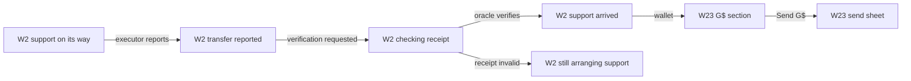

| # | Screen | User action | System response | State | If it fails |
|---|---|---|---|---|---|
| 1 | W2 | Member opens the fulfilled promise | settlement record beats pooling `rewardPaid` when a disbursement exists (WF:520; DG:666) | — | — |
| 2 | W2 | reads **"support on its way"** | disbursement Queued/Executing (SS:532) | Queued/Executing | — |
| 3 | W2 | reads **"transfer reported; awaiting receipt check"** | Reported without an active request (SS:532); "Reported is NOT member-visible proof" (SS:177) | Reported | — |
| 4 | W2 | reads **"transfer reported; checking receipt"** | Reported with an active Functions request (SS:532; derived, DG:666) | Reported + active request | Infra timeout → back to step 3 copy after request clears (SS:180) |
| 5 | W2 | reads **"support arrived ↗"** with the Celo reference | **only Verified** — the Chainlink Functions callback is the sole producer (SS:532,398; AM:22) | **Verified** | — |
| 6 | W23 | Wallet drawer G$ section: balance + "+20 G$ — Prune the north beds (arrived ↗)" (WF:569-572) | Celo balance read; rows from `queryKeys.settlement.*` (UX:219) | — | — |
| 7 | W23 | **[ Send G$ ]** → sheet: to, amount, "Sent from your account on Celo. No gas needed." (WF:573-579) | online `transfer` — never enters the offline queue, no MAX_RETRIES replay (UX:219; SS:433); sponsored gas, members hold no CELO (WF:578) | wallet-pending → confirmed | Wallet rejection/tx failure inline with retry CTA (UX:219) |
| 8 | W2 | (failure lane) reads **"still arranging support — your promise is recorded"** | disbursement Failed; commitment state untouched — Fulfilled is permanent (SS:532; DG:666) | Failed (disbursement only) | Operator requeues/cancels → SB-12 steps 8–9 |
| 9 | W23 | (blocked lane) AA gate failed: the whole G$ section is replaced by the gate-failed frame — "Planned · not available yet … member delivery and Send G$ stay unavailable." (WF:632-641) | `memberDeliveryEnabled` stays false; Safe-to-Safe garden funding may continue (SS:417; PT:32) | delivery blocked | No alternate member-delivery path ships (SS:417; DG:856) |

**Honesty check (passes)**: every copy stage matches AM:20-25 — Reported never renders as received, "support arrived" is Verified-only, and the blocked state names what still works (garden funding) without implying custody elsewhere. **register #34f** makes the gate legible steward-side too: W21/W12 gain a read-only gate-status row (enabled/disabled · changed by · date · evidence ref), so "delivery blocked" is diagnosable without reading chain state.

---

## SB-12 — Funding routes → batch execution → receipt check (steward + executor)

**At a glance** — a steward queues and batches disbursements; an executor runs the Safe leg and reports; the oracle alone produces Verified — 6 interactions across 3 surfaces.

**Persona**: Operator (steward) queues and recovers; **Executor** (Zodiac Roles member — never a Safe owner, SS:47,415; a distinct persona from the steward) executes and reports. **Scenario**: S8 (LAP:199-202) + S9 routes (LAP:204-207). **Surfaces**: admin + the Safe app (external value leg). **Theme**: TAS first execution.

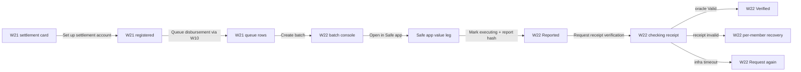

| # | Screen | User action | System response | State | If it fails |
|---|---|---|---|---|---|
| 1 | W21 | **[ Set up settlement account ]** (WF:572) | `registerSettlementAccount` — Celo 42220, 2-of-3 recovery, no owner/executor overlap (SS:167; WF:572-577) | account active | — |
| 2 | W12 | (funding beat) protocol steward queues **ProtocolToGarden** — the only modeled route; HoA → protocol Safe is upstream (SS:172; DG:832-856); placement is the Operations funding view (SS:528), control undrawn → MF-11 | `queueFunding` derives source/recipient/G$ — no arbitrary addresses or tokens (SS:172) | funding Queued | AA-gate failure never blocks this Safe-to-Safe route (SS:417; DG:856) |
| 3 | W10 | Per fulfilled G$ commitment: **[ Queue disbursement ]** (replaces Record payout for G$ rewards — WF:564; SS:526) | `queueDisbursement` — requires `memberDeliveryEnabled`, Fulfilled state, active provider-garden account (SS:171) | **Queued** — member reads "support on its way" (SB-11.2) | Gate off → queueing blocked (SS:170) |
| 4 | W21 | **[ Create batch (2) ]** (WF:583) | `createBatch` — 1..24 unique ids, immutable members, one executorGarden/source/token (SS:173,114) | batch Queued | — |
| 5 | W22 | **[ Open in Safe app ↗ ]** (WF:552) — the value leg happens in the Safe app, not in Green Goods (August posture, WF:553-554) | Roles-scoped G$ transfer from the garden Safe (DG:602-607) | — | Execution fails before report → step 8 |
| 6 | W22 | Executor: **[ Mark executing ]** then **[ Report Celo transaction hash… ]** (WF:554-555) | `markBatchExecuting` (executor-only, SS:176); `reportBatchExecution` — ref mandatory, globally unused, `reportedBy` persisted (executor-only, SS:177) | Executing → **Reported** | **Decided (register #34e)**: pilot operators hold the executor role (never a Safe/recovery owner); a missing role renders a visible guard state (SS:176-177) |
| 7 | W22 | **[ Request receipt verification ]** (WF:556) | `requestVerification` — steward, executor, or owner (SS:178); stores requestId; state stays Reported; UI derives "checking receipt" (WF:558-559) | Reported + active request | — |
| 8 | W22 | (oracle outcomes — no human path to Verified, SS:15) | **Valid** → `BatchVerified`, verifiedBy = router (DG:625-627) · **ReceiptInvalid** → batch + members **Failed**; batch stays immutable; per-member **[ Requeue ]** (clears old batchId, attempts++) or **[ Cancel with reason… ]** (WF:561-563; SS:181-183,394) · **Infra timeout** → still Reported; **[ Request again ]** issues a fresh request — after `expireVerification` clears the stale one (WF:560; SS:180) · **Stale callback** → ignored, no state change (DG:640-643) | Verified / Failed / Reported | Member-facing copy for each per SB-11 |
| 9 | W22 | (manual failure) **[ Record failed — reason… ]** before any report (WF:556) | `recordFailed` (executor or steward, SS:181) | **Failed** | Requeue/cancel as step 8 |

**Steward-burden note (finding input)**: one reward reaching a member's wallet crosses, at minimum: queue (W10) → batch (W21) → Safe app round trip → mark executing → report hash → request verification → oracle callback (W22) — **6 steward/executor interactions across 3 surfaces plus an external app**, before any failure lane. Against a 2–4 hrs/week volunteer budget this is the heaviest weekly task in the platform; the storyboard exists so the dry run rehearses it honestly.

---

## SB-13 — Cross-garden claim on the protocol pool

**At a glance** — a garden steward claims a protocol-pool promise for her garden; providerGarden becomes the EAS recipient while the root pool keeps ownership.

**Persona**: garden Operator (Leila, steward persona `../community-interface/journeys.md:47`) claims a protocol-pool commitment **for her garden**. **Scenario**: S14 — protocol pool + cross-garden claim (PT:42); identity formulas CS:577-589. **Surfaces**: client PWA + admin Community → Pools.

```mermaid
flowchart LR
  A["W1 protocol card in garden context"] -->|"Ask to take this up"| B["provider context chooser"]
  B -->|"for this garden"| C["W1 Pending row"]
  C -->|"protocol steward reviews"| D["W12 claims across gardens"]
  D -->|"Accept stored terms"| E["W2 Accepted providerGarden"]
  E -->|"garden works and proves"| F["W12 confirmations queue"]
  F -->|"named confirmer confirms"| G["W10 Fulfilled"]
```

| # | Screen | User action | System response | State | If it fails |
|---|---|---|---|---|---|
| 1 | W1 | A protocol-pool commitment surfaces in Leila's garden context; card defaults to **steward-reviewed** claim mode (register #19, UX:129; PT:65) | — | Offered/Requested | — |
| 2 | (chooser) | Eligible stewards only: **"take this up as myself"** vs **"take this up for this garden"** (W1 note WF:106; UX:130) — mentioned, never drawn → MF-8 | Individual: `claimant = requestedBy = caller` · Garden: `claimant = gardenContext` (the GardenAccount), `requestedBy = the authenticated steward` (CS:577-589; AM:32-33) | — | Kind must equal stored `claimType` — mismatch is a contract error, not eligibility copy (AM:31) |
| 3 | W1 | Pending panel shows canonical claimant + requested-by + provider context (UX:99,103) | `ClaimRequested` | Pending | SB-3 recovery lanes |
| 4 | W12 | Protocol steward reviews **Claims across gardens** — claimant-kind column names "Awka Hub (garden claim)" (WF:415; UX:313) | root-garden Hats stewardship (CS:58) | — | — |
| 5 | W12 → W7 grammar | **[ Accept ]** consumes the stored terms; derived `providerGarden` shown (WF:313; CS:733) | `CommitmentAccepted(provider, providerGarden)`; other pending rows Superseded (DG:696-702) | **Accepted** | Decline-with-reason per SB-3.5 |
| 6 | W2 / existing work flow | Leila's gardeners work and prove: Work + assessments use **providerGarden as EAS recipient** while the commitment stays owned by the root pool (CS:772; LAP:181) | `WorkLinked`/`ApprovedWorkCounted` as SB-4 | Active → … → ReadyForConfirmation | — |
| 7 | W12 | **Confirmations queue** row "Field survey — 1 of 2 confirmed" (WF:417) | mirrors the Hub Confirm grammar scoped to the protocol pool (UX:313) | ReadyForConfirmation | — |
| 8 | W10 | Named confirmer (or fallback-eligible steward, with reason) confirms | `CommitmentFulfilled`; co-funded reward references stay with the owning garden (WF:413; UX:313) | **Fulfilled** | — |

Guard rails carried by existing copy: the garden claim "does not create token custody or a member-delivery fallback" (WF:106); a Garden-claim G$ beneficiary is the registered `providerGarden` Celo Safe, never the Arbitrum GardenAccount (AM:38-39).

```text
NEW — proposed lo-fi, not a locked design (MF-8: provider-context chooser, DialogShell over W1)
┌──────────────────────────────────────────────┐
│ Take this up…                                │
│ ◉ as myself                                  │  Individual claim (CS:585)
│ ○ for Awka Hub (you steward this garden)     │  Garden claim (CS:581)
│ Working for the garden: its account makes    │
│ the promise; you remain the requester.       │
│ [ Continue ]                      [ Cancel ] │
└──────────────────────────────────────────────┘
```

---

## SB-14 — Community Need → triage → seeded promise (September, wireframe depth)

**At a glance** — September: a community member speaks a Need, a steward triages and seeds it, and the promise then lives its normal pool life.

**Persona**: Community member (Kwame, `design-research.md:160`) speaks a Need; Operator triages and seeds. **Scenario**: S10 (LAP:209-212). **Surfaces**: independent Community PWA (`community.greengoods.app`) + admin `/community`. **Caveats**: September surface (PT:156-160); membership-queue slice gated on RESR-64 (CI-WF:371; AM:68); the community app adds **no claiming, work submission, wallet drawer, or settlement surface** (CI-SPEC:263; UX:374).

```mermaid
flowchart LR
  A["CI-W3 choose intent"] -->|"speak or type the need"| B["CI-W4 outcome and review"]
  B -->|"queued offline or waiting for hat"| C["CI-W1 needs board"]
  C -->|"steward triages"| D["CI-W9 gathering and triage"]
  D -->|"Seed a commitment"| E["CI-W10 seed from need"]
  E -->|"needUID prefill seeds pool promise"| F["W1 commitment in pool"]
  F -->|"work and proof thread"| G["CI-W5 need detail lineage"]
  G -->|"author confirms when named"| H["CI-W6 profile confirmations"]
```

| # | Screen | User action | System response | State | If it fails |
|---|---|---|---|---|---|
| 1 | CI-W3 (CI-WF:96) | Kwame describes the problem in his own words by voice or text | Kind-free Need drafted; Request / Offer is selected only when a commitment is seeded | — | — |
| 2 | CI-W4 (CI-WF:124) | Desired outcome + horizon; review; submit | offline-queueable Need job; may enter `waiting_for_hat` without consuming retries (CI-WF:124-159; LAP:191) | queued → posted | Board source states CI-W2 (CI-WF:69) |
| 3 | CI-W1 (CI-WF:32) | Need appears on the my-garden board — two state axes, distinct-signal count, "Never ranked by funding" (CI-SPEC:257) | neighbors add **Signal** (community-owned event vocabulary, UX:418) | Need open | Moderation outcomes CI-W8 (CI-WF:262) |
| 4 | CI-W9 (CI-WF:286) | Operator triage at the gathering view: acknowledge, apply domains, merge, hide, decline, or reopen (CI-SPEC:267) | separate moderation/progress axes (LAP:211) | acknowledged | Private-lane intake for grievances naming individuals stays off-chain (CI-SPEC:268) |
| 5 | CI-W10 (CI-WF:313, fields :318-340) | **Seed a commitment from this Need**: `needUID` read-only linked; pool/cycle, direction, units, suggested domains, required actions; confirmer rule defaults to Request creator / accepted Offer recipient; unreachable-threshold error surfaces **before** acceptance (CI-WF:340) | steward-confirmed seeding → `createCommitment` with `needUID` (UX:374; PT:77) | commitment Offered/Requested in the garden pool | Every suggested field requires steward review (CI-WF:318-340) |
| 6 | W1 → SB-1/SB-4 | The promise lives its normal pool life (claim, work, evidence, confirmation) | joined reads connect the EAS Need to Envio commitment/work events (LAP:211) | per SB-1/SB-4 | — |
| 7 | CI-W5 (CI-WF:160) | Kwame follows the thread: his words → promise → work → proof; funded-toward line without escrow or steering (CI-SPEC:259; LAP:211) | — | — | — |
| 8 | CI-W5/CI-W6 | When the seeded promise reaches ReadyForConfirmation and Kwame is the named confirmer (Request-author default), the **author confirm CTA** appears (CI-SPEC:259); afterwards he may **add testimony** (Community Hat attestation, CS:762); both live in Profile history (CI-WF:194) | consumes the shared confirmation/testimony primitives owned by this feature (UX:374) | Fulfilled + testimony | — |

This storyboard stays at wireframe depth on purpose: the community frames are canonical in `.plans/active/community-interface/` (WF:505-512 removed this file's own September sketches), and the August release neither ships nor depends on them (AM:68).

---

## 15. Missing frames (MF index — candidate additions to `wireframes.md`, decided by Afo)

**At a glance** — the micro-frame index: which flow moments still lack a locked wireframe, which were adopted on 2026-07-11, and which the hi-fi artifact now realizes.

Every micro-frame drawn above is a **candidate for `wireframes.md`, not yet a locked design**. The only row that carries no drawing at all is MF-12 — a September-realization decision, not an August frame gap.

**Realized in the hi-fi artifact** (rendered as real, non-proposed controls — no longer "undrawn" or amber-tagged): **MF-6** → the W2 evidence-submitted send-for-confirmation affordance · **MF-9** → W26, the cycle-close wizard that absorbs the reconciliation report · **MF-10** → the W1 cycle-summary card · **MF-11** → the W24 Operations funding control + W12 funding view. Still amber-`proposed` in the artifact: MF-7, MF-8, MF-13 (plus MF-2b, whose steward-cancel placement stays open). The MF table below keeps the original wireframe-gap authority for each moment.

**2026-07-11 decisions (`plan.todo.md` register #34–register #35)**: adopted — MF-1 (register #34a, pool-card lifecycle actions + open-cycle guard prompt), MF-2a (register #34b, member pre-acceptance withdraw; MF-2b steward cancel **still open**), MF-3 + MF-4 (register #34d, expiry ships August; keeper cron is a post-launch backstop), MF-5 (register #34c, `waiting_for_hat` covers pool jobs in August). Resolved — MF-12: testimony is September-realized (register #34g). New tracked dependency — the **garden join-request queue** (register #35; canonical design → `../community-interface/join-queue-spec.md`; its observed membership outcome is MF-5's flush trigger).

| MF | Moment with no existing frame | Owning SB | Why it matters | Authority for the moment |
|---|---|---|---|---|
| MF-1 | `openPool` / `closePool` controls on the W7 pool card | SB-9.4 | **Drawn console deadlocks**: Ready→Open has no control, and `openCycle` requires pool Open (CS:727); `closePool` equally unplaced | CS:100,102; UX:58 offers only seed-first-cycle |
| MF-2 | Member withdraw (W2, pre-acceptance) + steward cancel (W10) | SB-5 | Both `cancelCommitment` paths are contract-real (CS:745; AM:36-37) and §4.1 Paused promises cancellation stays available (UX:60; WF:104) — no control exists | CS:745 |
| MF-3 | W2 Expired band + "offer again" moment | SB-6.3 | §4.3 names the CTA (UX:94); never drawn | UX:94 |
| MF-4 | W7 "Lapsed this cycle" expiry queue + re-seed | SB-6.4 | §4.3 admin cell "Expiry queue + re-seed" (UX:94); W7 lacks the section | UX:94 |
| MF-5 | Waiting-for-membership queued chrome (pool jobs) | SB-7.6 | S6 + the ≥99% sync metric assume `waiting_for_hat` for pool jobs (LAP:191; `acceptance-matrix.md` §6); §5.11/§5.12 define no treatment | LAP:191 |
| MF-6 | Send-for-confirmation row (W2 evidence-only variant) | SB-2.5 | Spec-placed (UX:141; admin twin UX:287), undrawn — W2 as drawn is DomainImpact | UX:141,287 |
| MF-7 | "fulfills: {commitment}" row on the work-flow Review step | SB-4.3 | The linkage moment of the existing flow (UX:174) has no drawn delta | UX:174 |
| MF-8 | Provider-context chooser ("as myself / for this garden") | SB-13.2 | W1:106 and UX:130 mention the choice; the deciding surface is undrawn | UX:130 |
| MF-9 | Reconciliation report view (admin) | SB-9.11 | W7 history points "scoped report ▸" (WF:283) at nothing; §4.2 admin cell names the report (UX:75) | UX:75 |
| MF-10 | Client Reconciled cycle summary card | SB-9.12 | §4.2 client cell + medium hero fire here (UX:75,200); no frame | UX:75 |
| MF-11 | Queue-funding control (admin Pools funding view) | SB-12.2 | SS:528 places the funding view; the trigger for `queueFunding` (SS:172) is undrawn | SS:528 |
| MF-12 | Testimony CTA (client, commitment "aimed at the community") — **flag only, no drawing** | SB-14.8 | §4.3 Fulfilled Community cell names it (UX:91); every drawn testimony surface is September's (CI-W5/CI-W6). Decide: September-only (recommended — matches CI-SPEC:263) or an August client frame | UX:91; CS:762 |
| MF-13 | Attach-assessment picker (admin commitment detail) | SB-4.8 | Behavior fully specified (UX:287), dialog never drawn | UX:287 |

---

## 16. Action inventory — how many new user-facing actions does this feature add?

**At a glance** — August adds ~39 net-new user-facing actions (9 member · 28 operator · 2 executor), riding 5 offline-safe job kinds plus one online G$ send; counted both by user vocabulary and by contract entry point.

**Sources of truth** — the permission matrix spans two files: `contract-spec.md` §6.1 (CS:719-763) and `settlement-spec.md` (SS:166-186), cross-read with uiux-spec §5–§7 placements and the job-kind table (UX:204-224). Offline kinds are exactly `commitment, claim, evidence, workLink, confirmation`; `transfer` is online-only; `work`/`approval` are untouched (CS:1536; UX:206).

**Counting rules**:
- **Net-new user-facing** = a persona triggers it from a drawn frame or an explicit spec placement (placements without a drawing are flagged `undrawn`).
- Human-triggered rows with **no app surface** sit in 16.2 (ops/config); **machine-triggered** rows in 16.3 (system).
- Counts are given **both ways** — one user-vocabulary action may bundle several entry points (pool lifecycle; request-verification-and-again), and one entry point may back several actions (`createCommitment` backs M1, O10, O11).

### 16.1 Net-new user-facing actions (August surfaces)

**Members — client PWA (9)**

| # | Action (user vocabulary) | Entry point(s) | Surface · screen | Offline? | New / ext | Notes |
|---|---|---|---|---|---|---|
| M1 | Make an offer / ask for help | `createCommitment` (CS:730) | W1 → W3 | offline `commitment` (UX:212) | NEW | direction + type + cycle binding in-flow; "offer again" (SB-6) is a re-entry |
| M2 | Take this up / ask to take this up | `claimCommitment` (CS:732) | W1 card + §4.4 panels (WF:111-127) | offline `claim` (UX:213) | NEW | open vs steward-reviewed is card helper text, never a member toggle (UX:129); "ask again" = fresh request (UX:105) |
| M3 | Add evidence (photo / link / note) | `attachEvidence` (CS:739) | W2 → W2a | offline `evidence` (UX:214) | NEW | steward also authorized on-chain, no admin control drawn (W10 read-only) |
| M4 | Link existing work to a promise | `linkWork` (CS:735) | W2 picker | offline `workLink` (UX:215) | NEW | deep-linked NEW work rides the existing `work` job (extension row E1 below) |
| M5 | Send for confirmation | `submitForConfirmation` (CS:741) | W2 evidence-only variant (UX:141, `undrawn` → MF-6); admin twin UX:287 | offline `confirmation{submit}` (UX:216) | NEW | evidence-only kinds; DomainImpact rejected on-chain (CS:138b) |
| M6 | Confirm — promise kept | `confirmFulfillment` (CS:743) | W4 sheet · W5 inbox · admin W13 stage · W12 protocol queue | offline `confirmation{confirm}` (UX:216) | NEW | provider always excluded (`SelfConfirmation`); once per confirmer |
| M7 | Not yet — ask the stewards to look | `raiseDispute` (CS:747) | W4 decline branch | **online** (UX:217) | NEW | member entry exists only at ReadyForConfirmation via W4; contract also allows creator/counterparty from Accepted/Expired — unsurfaced |
| M8 | Send G$ onward | Celo wallet transfer (value leg — not a module entry point) | W23 send sheet | **online** `transfer`, AA-gated (UX:219; SS:433) | NEW | sponsored gas; absent entirely while `memberDeliveryEnabled` is false |
| M9 | Withdraw my offer / request (pre-acceptance) | `cancelCommitment` creator path (CS:745) | W2 owner variant (MF-2a; adopted register #34b) | **online** contract action | NEW | reason required; Offered/Requested only; steward path (MF-2b) still unplaced |

**Operators — client PWA (1)**

| # | Action | Entry point(s) | Surface · screen | Offline? | New / ext | Notes |
|---|---|---|---|---|---|---|
| O0 | Take this up **for this garden** (provider context) | `claimCommitment` ClaimType.Garden (CS:732,577-589) | W1 protocol card + chooser (`undrawn` → MF-8) | offline `claim` | NEW | eligible stewards only; claimant = GardenAccount, requestedBy = steward |

**Operators / stewards — admin (27)**

| # | Action | Entry point(s) | Surface · screen | Offline? | New / ext | Notes |
|---|---|---|---|---|---|---|
| O1 | Edit the pool charter | `setPoolCharter` (CS:723) | W7 pool card | online | NEW | — |
| O2 | Set the provider exposure cap | `setProviderExposureCap` (CS:751) | W7 readiness checklist | online | NEW | required before Ready |
| O3 | Mark the pool ready | `markPoolReady` (CS:724) | W7 (`spec-placed, undrawn` — UX:269) | online | NEW | disabled until charter + cap + qualifying Baseline |
| O4 | Pool lifecycle controls | `pausePool`/`resumePool`/`compostPool`/`reopenPool` (UX:60-62; WF:274) + `openPool`/`closePool` adopted onto the card per register #34a (MF-1) | W7 pool card | online | NEW | all 6 entry points placed as of 2026-07-11; open-cycle flow gains only a Ready-state guard prompt |
| O5 | Seed a cycle (Season / Campaign) | `seedCycle` (CS:726) | W7 cycles console (UX:270) | online | NEW | one open Season invariant enforced in-console (WF:279) |
| O6 | Open a cycle (with allocation policy) | `openCycle(cycleId, allocation)` (CS:727) | W11 step in the open-cycle flow | online | NEW | percent inputs encode an exact 10,000 bps total; six-class snapshot stored and emitted (UX:322-330) |
| O7 | Close a cycle (reconcile) | `closeCycle` (CS:728) | W7 cycle row | online | NEW | fires client cycle-close hero downstream (UX:200) |
| O8 | Compost a cycle | `compostCycle` (CS:728) | W7 cycle row | online | NEW | — |
| O9 | Cancel a cycle (reason) | `cancelCycle` (CS:729) | W7 cycle row (WF:279-282) | online | NEW | quiet member banner + reason (UX:77) |
| O10 | Seed a commitment | `createCommitment` steward kinds (CS:730) | W8 flow | online-expected (UX:224) | NEW | SeasonCampaign/OperatorCaptured are console-only (UX:150) |
| O11 | Record on a member's behalf (analog capture) | `createCommitment` OperatorCaptured + `onBehalfOf` (CS:730) | W9 flow | online-expected | NEW | member stays the promise source (UX:437) |
| O12 | Accept a claim | `acceptClaim` (CS:733) | W7 claims queue | online (UX:218) | NEW | consumes stored terms only |
| O13 | Decline a claim (reason) | `declineClaim` (CS:734) | W7 claims queue | online | NEW | clears exactly one request |
| O14 | Attach an assessment | `attachAssessment` (CS:740) | admin detail picker (UX:287, `undrawn` → MF-13) | online | NEW | **shared with Evaluator** — the only evaluator-facing pooling entry point |
| O15 | Mark ready with override (reason) | `markReadyForConfirmation` (CS:742) | admin detail (UX:287) | online | NEW | override marker visible to members (UX:301) |
| O16 | Confirm as fallback (reason) | `confirmFulfillmentAsFallback` (CS:744) | W10 | online (UX:216 note) | NEW | provider-steward blocked on-chain |
| O17 | Raise a dispute (steward) | `raiseDispute` (CS:747) | W10 | online | NEW | same entry point as M7, different surface + vocabulary |
| O18 | Resolve a dispute (4 outcomes, reason) | `resolveDispute` (CS:748) | W10 (WF:381-382) | online | NEW | Expired can never resolve Fulfilled (CS:144) |
| O19 | Record payout | `recordRewardPaid` (CS:749) | W10 + AdminConfirmDialog (UX:302) | online | NEW | July's only reward rail (PT:42) |
| O20 | Set up the settlement account | `registerSettlementAccount` (SS:169) | W21 (WF:572) | online | NEW | steward or module owner |
| O21 | Queue a disbursement | `queueDisbursement` (SS:171) | W10 delta "Queue disbursement" (WF:564; SS:526) | online | NEW | gated on `memberDeliveryEnabled` + Fulfilled |
| O22 | Queue garden funding | `queueFunding` (SS:172) | admin Operations funding view (SS:528, `undrawn` → MF-11) | online | NEW | protocol steward or owner; GG→garden only |
| O23 | Create a settlement batch | `createBatch` (SS:173) | W21 (WF:583) | online | NEW | **steward or executor**; 1–24 immutable members |
| O24 | Request receipt verification / request again | `requestVerification`+`requestBatchVerification` (SS:178); timeout path via `expireVerification`+Batch (SS:180) | W22 (WF:556,560) | online | NEW | steward, executor, or owner; "checking receipt" derived |
| O25 | Record a failed execution (reason) | `recordFailed`+Batch (SS:181) | W22 (WF:556) | online | NEW | **executor or steward** |
| O26 | Requeue a failed member | `requeue` (SS:182) | W21/W22 (WF:536,562) | online | NEW | clears old batchId; attempts++ |
| O27 | Cancel a disbursement (reason) | `cancelDisbursement` (SS:183) | W21/W22 (WF:536,562) | online | NEW | frees the commitment for a fresh queue |

**Executor — admin (2 exclusive; a distinct persona: Zodiac Roles member, never a Safe owner — SS:47,415)**

| # | Action | Entry point(s) | Surface · screen | Offline? | New / ext | Notes |
|---|---|---|---|---|---|---|
| X1 | Mark executing | `markDisbursementExecuting`/`markBatchExecuting` (SS:176) | W22 | online | NEW | executor-only — a steward without the role cannot |
| X2 | Report the Celo transaction hash | `reportExecution`/`reportBatchExecution` (SS:177) | W22 | online | NEW | executor-only; Reported is never member-visible proof |

Shared with stewards: O23, O24, O25. **Value-leg actions** (drawn, but not Green Goods entry points): M8 send G$ (W23) and "Open in Safe app ↗" batch execution (W22, WF:552).

**Community — September-realized (2)** — the §4 "Community" column is the September surface (UX §8)

| # | Action | Entry point(s) | Surface · screen | Offline? | New / ext | Notes |
|---|---|---|---|---|---|---|
| C1 | Confirm when named (Need author) | `confirmFulfillment` (CS:743) | CI-W5/CI-W6 (CI-SPEC:259) | offline `confirmation` | NEW (Sept surface) | consumes the shared primitive |
| C2 | Add testimony | Community-testimony EAS attest, Community Hat only (CS:762) | CI-W5 plus the CI-W6→CI-W5 compatibility alias; no August client CTA or frame (UX:91 → MF-12) | offline-capable (DG:111-113, community job) | NEW (Sept) | first real attestation gate for the Community Hat |

**Permissionless (1, trigger unplaced)**: P1 — expire a lapsed commitment, `expireCommitment` (CS:746), callable by anyone once past due; **no surface draws a trigger** (SB-6.1) — in practice a keeper/cron/admin sweep. Counted apart from the 38 below.

**Evaluator**: 0 exclusive actions — attach-assessment is shared (O14), and assessment v3 authorship (baseline evaluator-or-steward, delta evaluator-only — CS:760-761) is an **extension** of the existing Create Assessment flow (W14). **Funder**: 0 actions — the declared-reward reference is realized through operator seeding (UX:28); funder discovery stays on existing public surfaces (PT:158).

**Extensions of existing flows (not counted as new actions)**: E1 work submission with commitment context (`work` job + `meta.commitmentId`, UX:174,220) · E2 assessment v3 fields on Create Assessment (W14; UX:295) · E3 CreateHypercert bundle-source toggle at cut-over (UX:330) · E4 offer-again / ask-again re-entries (UX:94,105) · E5 admin expiry-queue re-seed into W8 (UX:94).

### 16.2 Human-triggered, no app surface (ops / config / recovery — 15 rows, ~22 functions)

`registerPool` (deploy-time + backfill, CS:722,934,1115) · `setDeclaredReward`/`setConfirmerRule` standalone pre-acceptance edits (CS:731 — W8 step 3 sets these as creation params; no edit control exists) · `unlinkWork` (CS:736) · `syncApprovedWork` recovery (CS:738; DG:221) · `cancelCommitment` steward path only (CS:745 — the member creator path is placed per register #34b/M9; steward placement MF-2b still open) · module admin setters ×8 incl. module pause (CS:750) · register `setModule` (CS:753) · UUPS upgrades ×3 (CS:754) · `setFundingConfiguration` (SS:166) · `updateSettlementRecovery`/`setAccountActive` (SS:167) · `addExecutor`/`removeExecutor` (SS:168 — executor roster is ops tooling) · `setFunctionsConfig` (SS:169) · **`setMemberDeliveryEnabled` (SS:170 — the AA gate itself: owner-only, no surface; W23 renders only its OFF state)** · settlement admin setters ×3 (SS:183) · standalone `expireVerification` (SS:178, when not folded into O24).

### 16.3 System actions surfaced only as states (never user-triggered — 6)

`onGardenMinted` (GardenToken-only, CS:721) · `onWorkApproved` (WorkApprovalResolver-only, CS:737) · CommitmentRegister module-only unit calls incl. the register-side exposure-cap twin (CS:752) · Chainlink Functions router callback — the only producer of Verified / receipt-invalid Failed (SS:179) · SettlementModule `initialize` (SS:184) · indexer claim-request **supersession** (CS:141-142; DG:696-706).

### 16.4 Totals

| Measure | Count |
|---|---|
| Net-new user-vocabulary actions, August surfaces | **39** = members 9 + operators 28 (27 admin + 1 client) + executor 2 exclusive (M9 added per register #34b) |
| — of which flagged `spec-placed, undrawn` | 5 controls: O3, M5/MF-6, O0/MF-8, O22/MF-11, MF-13 (inside O14) — plus the register #34-adopted controls (MF-1/2a/3/4/5) whose drawings live here pending the wireframes redraw |
| — of which contain **unplaced** entry points | none as of 2026-07-11 (register #34a placed openPool/closePool; steward cancel remains an ops-bucket row) |
| Join-request queue (register #35; canonical design in `../community-interface/join-queue-spec.md`; operating gate remains) | +2 actions when RESR-64 clears implementation (member "ask to join" · steward "welcome / decline with reason") — counted then, not in the 39 |
| September community-app actions | **12** = member 5 (post a Need · signal · retract · C1 confirm · C2 testimony) + operator 7 (acknowledge · decline · merge · hide · reopen · private-lane intake · seed-from-Need, CI-W9/CI-W10) — seed-from-Need extends O10 with `needUID` prefill |
| Permissionless | 1 (P1 expire — trigger unplaced) |
| Distinct user-triggered contract entry points, August | **43 solid** (28 pooling incl. openPool/closePool per register #34a + 14 settlement + 1 EAS assessment-v3) — up to 45 with the 2 expire-verification twins; +1 EAS testimony in September |
| Ops/config functions with no app surface | ~22 (16.2) |
| System-only rows | 6 (16.3) |
| New routes | client 3 (`/home/:id/pool`, `…/pool/:commitmentId`, `…/pool/new`) + admin 5 (`/garden/pool`, `…/seed`, `…/capture`, `/community/pools`, `/hub/confirm`) (UX:120,252-259) |
| New in-place screen locations (no new route) | client 3 (Pool GardenTab · WalletDrawer pools panel, including the W6→W5 compatibility target · W23 G$ section) · admin 4 (W21 settlement section · W10 reward/dispute delta · W13 stage · W14 fields) · editorial 2 sections (W15, W16) |
| New offline job kinds | 5 (`commitment, claim, evidence, workLink, confirmation`) + 1 online-only `transfer` (CS:1536) |
| New i18n key families | 8 (UX:393-402) + `settlement.*` extensions (SS:539); every key en + es + pt |

**Platform delta (one line for the external brief's operator note)**: August adds one new place on each existing surface — a Pool tab in the garden app, a Pool tab, Confirm stage, and Pools mode in the steward console, a promises section on public garden pages — and about 39 new things a person can do there: 9 for members, from making an offer to withdrawing one or sending G$ onward; 28 for stewards seeding promises, reviewing claims, running seasons, and recording or settling rewards; 2 for the settlement executor; all riding 5 new offline-safe job kinds plus one online G$ send, shipped in English, Spanish, and Portuguese.

---

## 17. Coverage appendix — every §4 state, per surface, walked or accounted for

**At a glance** — every §4 state × surface, walked or accounted for; no silent cell remains, and two ⚠ gaps stay open (steward cancel · Cancelled-disbursement copy).

Cell values: `SB-x.y` = walked at that storyboard step · `static (cite)` = a copy-only cell, rendered but not storyboarded · `explicit: not surfaced` = the spec says so on purpose · `Sept` = September community surface (view or SB-14) · `⚠` = a real gap carried in the findings. The Community column of the §4 tables **is** the September surface (UX §8).

### 17.1 Pool states (UX:55-62)

| State | Client PWA | Admin | Editorial | Community |
|---|---|---|---|---|
| NotReady | explicit: tab absent (UX:57) — noted SB-9.1 | SB-9.1–3 | static: readiness copy (UX:57; WF:481) | Sept static |
| Ready | SB-9.3 echo ("warming up", UX:58) | SB-9.3–4 (open-pool control adopted per register #34a — MF-1) | static (UX:58) | Sept static |
| Open | SB-1.1 | SB-9.5+ | SB-1.11 (W15) | Sept view |
| Paused | SB-9.8 echo (UX:60) | SB-9.8–9 | static: quiet-period line (UX:60) | Sept view + recovery |
| Closed | static: view-only history (UX:61) | SB-9.14 coda (closePool adopted per register #34a) | static (UX:61) | Sept view |
| Composted | SB-9.13 echo (UX:62) | SB-9.14 (reopen) | static: past cycles (UX:62) | Sept history |

### 17.2 Cycle states (UX:68-77)

| State | Client PWA | Admin | Editorial | Community |
|---|---|---|---|---|
| Draft | explicit: not surfaced (UX:70) | SB-9.5 (console drafts; chip per UX:70) | explicit: not surfaced | explicit: not surfaced |
| Seeded | SB-9.5 echo ("opens soon", UX:71) | SB-9.5 | static (UX:71) | Sept read-only |
| Open | SB-1.1 | SB-9.6 | static (UX:72) | Sept view |
| InProgress | SB-9.7 (derived overlay; one continuous "live" period, UX:73) | SB-9.7 | static | Sept view |
| Reviewing | SB-9.7 note (banner + still-allowed evidence, UX:74) | SB-9.10 lead-in | static (UX:74) | Sept view |
| Reconciled | SB-9.12 (MF-10 card + medium hero) | SB-9.10–11 (MF-9 report) | static: cycle results (UX:75) | Sept results |
| Composted | SB-9.13 | SB-9.13 | static (UX:76) | Sept archived |
| Cancelled | SB-9.14 echo (quiet banner + reason, UX:77) | SB-9.14 | explicit: not surfaced (UX:77) | Sept quiet banner |

### 17.3 Commitment states (UX:81-95)

| State | Client PWA | Admin | Editorial | Community |
|---|---|---|---|---|
| Draft | SB-7.1–2 | static: console drafts (UX:83) — not walked | explicit: never (UX:83) | explicit: never |
| Offered | SB-1.4 | W7 table (SB-9 context) | static: counts only (UX:84) | Sept view |
| Requested | SB-2.2 | W7 table | static: counts only | Sept view |
| Accepted | SB-1.5 · SB-3.7 | SB-3.7 | static: counts only | Sept view |
| Active | SB-4.4 | static: monitor list (UX:87) | static: active aggregate | Sept view |
| EvidenceSubmitted | SB-1.6 · SB-2.4 | SB-4.5 (review queue) | explicit: not distinct from Active (UX:88) | Sept view |
| PartiallyApproved | SB-4.5 | SB-4.5 | explicit: not distinct | explicit: not distinct |
| ReadyForConfirmation | SB-1.7 · SB-2.5 | SB-10.3 (W13) · SB-13.7 (W12) | explicit: not distinct | Sept: confirm CTA (SB-14.8) |
| Fulfilled | SB-1.9–10 | SB-10.5 | SB-1.11 (counts + rate per §7.2) | Sept: testimony CTA (SB-14.8; resolved register #34g — September-realized) |
| Reconciled | SB-9.10 (derived at cycle close) | SB-9.11 | static: aggregates | Sept view |
| Cancelled | member withdraw adopted (register #34b, MF-2a) + dispute path SB-5.5b; rendering per UX:93 | ⚠ steward control still unplaced (MF-2b); list w/ reason renders | explicit: aggregate counters only, never a public list (UX:93) | explicit: not listed |
| Expired | SB-6.2–3 (MF-3) | SB-6.4 (MF-4) | explicit: aggregate only (UX:94) | explicit: not listed |
| Disputed | SB-5.1–2 | SB-5.4 | explicit: never surfaced individually (UX:95) | Sept frozen view |

### 17.4 Claim-request states (UX:101-108)

| State | Claimant (client) | Operator (admin) | Recovery walked |
|---|---|---|---|
| Pending | SB-3.2 (WF:112-117) | SB-3.4 | no-claimant-cancel rule noted SB-3.2 (UX:103) |
| Accepted | SB-3.9 (WF:119-124) | SB-3.7 | stored-terms-only acceptance (UX:104) |
| Declined | SB-3.5–6 (WF:113-118) | SB-3.5 | ask-again = fresh request (UX:105) |
| Superseded | SB-3.8 (WF:119-123) | SB-3.7 outcome panel (WF:305-311) | resolution codes distinguish causes (UX:106; DG:706) · garden-claim variant SB-13.5 |

### 17.5 Disbursement states (SS:62; SS:532 copy)

| State | Member (client) | Operator/executor (admin) |
|---|---|---|
| Queued / Executing | SB-11.2 ("support on its way") | SB-12.3–6 |
| Reported (no request) | SB-11.3 ("transfer reported; awaiting receipt check") | SB-12.6 |
| Reported + active request | SB-11.4 ("checking receipt") | SB-12.7 |
| Verified | SB-11.5 ("support arrived ↗") | SB-12.8 |
| Failed | SB-11.8 ("still arranging support — your promise is recorded") | SB-12.8–9 (requeue / cancel) |
| Cancelled | ⚠ member-facing copy unspecified — SS:532 defines five states and no Cancelled line; `cancelDisbursement` frees the commitment for a fresh queue (SS:183). Presumed fallback to the pooling reward row (DG:666 precedence) — needs one sentence in settlement-spec §7 | SB-12.8 |

**Coverage verdict**: no fully silent state–surface cell remains — every cell is walked, static-by-design, or explicitly not-surfaced. After the 2026-07-11 decisions (register #34), two ⚠ cells remain: the steward cancel placement (MF-2b) and the Cancelled-disbursement member copy (§17.5); the Ready→Open path and member cancel are resolved, and testimony is September-only. The dispatch's 13 required flows map: S1→SB-1 · S2→SB-2 · S3→SB-3 · S4→SB-4 · S5→SB-5+SB-9 · expiry→SB-6 · S6→SB-7 · S7→SB-8 · seeding+cycles→SB-9 · S13→SB-10 · S8/S9 member→SB-11 · S8 operator→SB-12 · S14→SB-13 · S10→SB-14.
