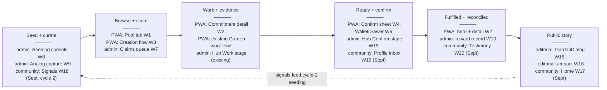

# Commitment Pooling: Low-Fi Wireframes (Four Surfaces)

**Feature Slug**: `commitment-pooling`
**Stage**: `active`
**Created**: 2026-07-04
**Companions**: `uiux-spec.md` (canonical flows — every frame here implements a section of it, referenced per frame), `contract-spec.md` (module vocabulary), `settlement-spec.md` (settlement surfaces, §6 deltas here), `diagrams.md` (state machines these screens render).
**Fidelity**: deliberately low. Boxes, labels, and navigation only — structure and flow, not visual design. Warm Earth expression, spacing, and component polish happen at implementation time per the `design`/`ui` skills; admin frames stay restrained per the prompt contract. All copy shown is placeholder English; every string ships as en/es/pt keys per uiux-spec §10.
**Grounding rule**: component names in `{braces}` are canonical (shared primitives, `Admin*` wrappers, or NET-NEW primitives flagged in uiux-spec §9). Routes are the NET-NEW routes uiux-spec §5.1/§6.1 defines. Nothing here invents a component, route, or term the specs don't already carry.

## 0. Legend

```text
┌─┐ └─┘   screen / dialog / card boundary        [ Label ]   button / CTA
(chip)    status or filter chip                  ▸           tap-through / link
▓▓▓░░░    progress meter                         ◉ ○         selected / unselected
≡         list row                               ⚠           warning / notice band
··queued··  offline-queued chrome                +N          badge count
```

## 1. Cross-surface flow map

How one commitment travels across the four surfaces. W-numbers reference the frames below.



---

## 2. Surface 1: Client PWA

### W1 — Pool tab on garden detail (uiux-spec §5.2)

Route `/home/:id/pool` — NET-NEW fourth `GardenTab` on the existing garden detail. `{AppBar}` stays visible.

```text
┌──────────────────────────────────────────────┐
│ ←  Rocinha Community Garden                  │  existing garden detail header
│  Work · Insights · Gardeners · ◉Pool         │  {StandardTabs} + NET-NEW Pool
├──────────────────────────────────────────────┤
│ Season of First Rains is open                │  pool state banner (§4.1 copy)
│ ┌──────────────────────────────────────────┐ │
│ │ Season of First Rains        (season)    │ │  cycle card
│ │ Seeded ─ ◉Open ─ In progress ─ Reviewing │ │  stage stepper
│ │ ▓▓▓▓▓▓▓▓▓░░░░░  62% of promised units    │ │  {ProgressMeter} NET-NEW
│ │ runs through Aug 30                      │ │  calm date, never a timer
│ └──────────────────────────────────────────┘ │
│ ┌───────────────────┐ ┌───────────────────┐  │
│ │ 12 offered        │ │ 7 fulfilled       │  │  {StatCard} ×2 per row
│ └───────────────────┘ └───────────────────┘  │
│                                              │
│ [ Offer support ]      [ Request help ]      │  persistent creation CTAs → W3
│                                              │
│ (All)(Offers)(Requests)(Matched)(Mine)       │  client-local filter chips
│ ┌──────────────────────────────────────────┐ │
│ │ (Offer)(AGRO)  Prune the north beds      │ │  {DomainBadge} {StatusBadge}
│ │ 6 hours · due Aug 12                     │ │
│ │ anyone in this garden may take this up   │ │  claim-mode helper text
│ │                       [ Take this up ]   │ │  Open mode → optimistic accept
│ └──────────────────────────────────────────┘ │
│ ┌──────────────────────────────────────────┐ │
│ │ (Request)  Ride to the market on Sat     │ │
│ │ 1 ride · runs with the season            │ │
│ │ stewards review who takes this up        │ │
│ │                 [ Ask to take this up ]  │ │  ApprovalGated → "waiting" chip
│ └──────────────────────────────────────────┘ │
│                                              │
│ My commitments                            ▸  │  horizontal strip → W2
│ ┌──────────┐ ┌──────────┐ ┌──────────┐       │
│ │(Offered) │ │(Accepted)│ │··queued··│       │  queued badge = §5.11 chrome
│ └──────────┘ └──────────┘ └──────────┘       │
├──────────────────────────────────────────────┤
│    Home         Garden         Profile       │  {AppBar} (unchanged)
└──────────────────────────────────────────────┘
```

- Variants (same frame, swapped bands): **Ready** = banner "warming up — promises open when the first cycle is seeded", browse/create disabled; **Paused** = `{Alert}` with steward reason, all writes disabled; **Empty open pool** = planted-seed illustration slot + the two CTAs + operator-seeded hint.
- Protocol-pool commitments shown in a garden context add, for operators only, a claim-custody choice ("claim as myself" / "claim for this garden"); gardeners always claim as themselves.
- Tap card ▸ W2. Offer/Request CTAs ▸ W3 with direction preset.

### W2 — Commitment detail (uiux-spec §5.3)

Route `/home/:id/pool/:commitmentId`.

```text
┌──────────────────────────────────────────────┐
│ ←  Prune the north beds                      │
│ (Offer)(AGRO)(Accepted)  6 hours · due Aug 12│  chips + units + due
│ anyone in this garden may take this up       │  claim-mode helper line
│ (recorded by your operator on your behalf)   │  OperatorCaptured chip only
├──────────────────────────────────────────────┤
│ Timeline                                     │  {StateTimeline} NET-NEW
│ ● Offered      — Maria · Jul 2               │
│ ● Accepted     — João took this up · Jul 3   │
│ ● Work linked  — pruning session · Jul 8     │
│ ● Ready        — steward note: "confirmed    │  overrides + reasons always
│                  on site visit" (override)   │  visible to members
├──────────────────────────────────────────────┤
│ Evidence                          [ + Add ]  │  ▸ W2a attach sheet
│ ≡ photo — north beds after (Jul 8)           │  {ListPrimitives} rows
│ ≡ note — "two beds left for next week"       │
├──────────────────────────────────────────────┤
│ Work for this promise                        │  DomainImpact only
│ ≡ Pruning session       (Approved)           │  {WorkDisplayStatus} chip
│ [ Submit work for this promise ]             │  deep-link → Garden work flow
│ [ Link existing work ]                       │  picker → workLink job
├──────────────────────────────────────────────┤
│ ┌──────────────────────────────────────────┐ │
│ │ [ Confirm: promise kept ]                │ │  only for named confirmers
│ └──────────────────────────────────────────┘ │  while ReadyForConfirmation → W4
│ Reward: 20 DAI from the garden jar · pending │  declared-reward row (§18)
│ recorded on Arbitrum                         │  chain phrasing lives here only
└──────────────────────────────────────────────┘
```

- W2a attach sheet (`{DialogShell}` + `{FileUploadField}`): photo / link / note → one `evidence` job per submit; works fully offline.
- Fulfilled state: hero moment fires once (§5.10), reward row flips to "reward released" when `RewardPaid` lands.
- Disputed state: banner "under review by stewards", CTAs frozen.

### W3 — Offer / request creation flow (uiux-spec §5.4)

Route `/home/:id/pool/new?direction=offer|request`. Full-screen (AppBar hidden), existing work-flow chrome: `{TopNav}` + `{FormProgress}`.

```text
┌──────────────────────────────────────────────┐   Step 2 — How much
│ ✕  Make an offer              ● ● ○ ○        │   ┌────────────────────────┐
├──────────────────────────────────────────────┤   │ Unit  [ hours        ▾ ]│
│ Step 1 — What                                │   │ suggestions: hours,     │
│ direction   ◉ Offer support  ○ Request help  │   │ tasks, meals, rides,    │
│ type        ◉ Garden work (impact)           │   │ plants                  │
│             ○ Support / service              │   │ How many  [ 6 ]         │
│   (season/campaign + on-behalf capture are   │   │ Due  {DatePicker}       │
│    console-seeded only — not shown here)     │   │  or ◉ season deadline   │
│ title  [ Prune the north beds            ]   │   └────────────────────────┘
│ note   [ optional                        ]   │   Step 3 — Anchors
├──────────────────────────────────────────────┤   (DomainImpact only)
│                        [ Continue ]          │   ┌────────────────────────┐
└──────────────────────────────────────────────┘   │ which garden action(s) │
                                                   │ does this fulfill?     │
Step 4 — Review and promise                        │ ┌──────┐ ┌──────┐      │
┌──────────────────────────────────────────────┐   │ │◉Prune│ │○Plant│ ...  │
│ summary card (all fields)                    │   │ └──────┘ └──────┘      │
│ [ Make this offer ]                          │   │ action-card rail from  │
│  → enqueues `commitment` job, returns to W1  │   │ the work-flow intro    │
│    with optimistic card + queued badge       │   └────────────────────────┘
└──────────────────────────────────────────────┘
```

- SupportService skips step 3 entirely (evidence + confirmation is its proof).
- Draft persists in IndexedDB (`WorkDraftRecord` semantics); re-entry offers resume via the existing `DraftDialog` pattern.

### W4 — Counterparty confirmation sheet (uiux-spec §5.6)

`{DialogShell}` over W2 or W5. Focus order per §12: title → summary → meter → reason → decline → confirm.

```text
┌──────────────────────────────────────────────┐
│ Promise kept?                                │
│ Prune the north beds — Maria · 6 hours       │
│ evidence: 2 items · linked work: 1 approved  │
├──────────────────────────────────────────────┤
│ Confirmations   ▓▓▓▓▓▓▓░░░  2 of 3           │  {ProgressMeter} + text equiv
│ ≡ João ✓        ≡ Ana ✓       ≡ you ○        │  {AddressDisplay} rows
├──────────────────────────────────────────────┤
│ [ Confirm — promise kept ]                   │  enqueues `confirmation` job
│ [ Not yet — tell the stewards why ]          │  decline → reason field;
│                                              │  routes to steward attention,
│                                              │  never cancels the promise
└──────────────────────────────────────────────┘
```

- Optimistic tick on the meter; if this was the Nth confirmation, Fulfilled hero fires on **sync completion**, not enqueue.

### W5 — WalletDrawer pools panel (uiux-spec §5.8)

Existing `{ModalDrawer}` from the Home header; third tab already reserved (`app.wallet.tab.commitments`), replaces `ComingSoonStub`.

```text
┌──────────────────────────────────────────────┐
│ Wallet            ○ jar  ○ vault  ◉ pools +2 │  tab badge = pending count
├──────────────────────────────────────────────┤
│ Waiting on you                               │  inbox, cross-garden
│ ≡ Maria — Prune the north beds   (Rocinha) ▸ │  ▸ W4
│ ≡ TAS Hub — Field survey ride    (Awka)    ▸ │
├──────────────────────────────────────────────┤
│ My commitments                               │
│ Rocinha Community Garden                     │  grouped by garden
│ ≡ ··queued·· Compost workshop    (Offered)   │  queued rows at group top
│ ≡ Ride to market                 (Accepted) ▸│  ▸ W2 in that garden
│ Muizenberg                                   │
│ ≡ Beach cleanup Saturday         (Fulfilled)▸│
└──────────────────────────────────────────────┘
```

### W6 — Home summary card (uiux-spec §5.9)

At most one card on `/home`, above `{GardenList}`; only when a member garden has a live cycle.

```text
┌──────────────────────────────────────────────┐
│ Promises kept this cycle                     │
│ 7 of 9 due across your gardens            ▸  │  absolute numbers below the
└──────────────────────────────────────────────┘  small-community threshold
```

---

## 3. Surface 2: Admin

All admin frames: `{CanvasRouteFrame}` + `{CanvasRouteHeader}` + `{CanvasRouteContent}`; overlays are centered `{AdminDialog}` or flow `{AdminDialog variant="flow"}` + `{ActionFlowShell}`. Restrained copy, no hero moments.

### W7 — Garden workspace: Pool tab (uiux-spec §6.2)

Route `/garden/pool` on the existing Garden `{AdminTabRail}`.

```text
┌────────────────────────────────────────────────────────────────────────┐
│ Garden ▸ Rocinha        overview · activity · ◉pool · settings         │
├────────────────────────────────────────────────────────────────────────┤
│ ┌─ Pool ─────────────────────────────────────────────────────────────┐ │
│ │ (Open)  proof ✓   charter: ipfs://…    [ Pause ] [ Edit charter ]  │ │  {AdminCard}
│ └────────────────────────────────────────────────────────────────────┘ │
│ ┌─ Cycle console ────────────────────────────────────────────────────┐ │
│ │ Season of First Rains (season)                                     │ │
│ │ Draft ─ Seeded ─ ◉Open ─ InProgress ─ Reviewing ─ Reconciled ─ Comp│ │  stepper
│ │ [ Close cycle ] [ Cancel… ]      each action → {AdminConfirmDialog}│ │
│ │ Past cycles                                                        │ │
│ │ ≡ Winter campaign   (Reconciled) — report ▸                        │ │  cycle report dialog
│ └────────────────────────────────────────────────────────────────────┘ │
│ ┌─ Commitments ──────────────────────────────────────────────────────┐ │
│ │ [search………] (state ▾)(type ▾)(direction ▾)  sort: newest ▾         │ │  {AdminSearchToolbar}
│ │ ≡ Prune the north beds   (Offer)(Accepted)   6h    Maria         ▸ │ │  {AdminFilterChip}
│ │ ≡ Market ride            (Request)(Ready)    1     João          ▸ │ │  {AdminSortSelect}
│ │ ≡ Compost workshop       (Offer)(Disputed)   3h    Ana           ▸ │ │  row ▸ W10
│ └────────────────────────────────────────────────────────────────────┘ │
│ ┌─ Claims waiting (approval-gated) ──────────────────────────────────┐ │
│ │ ≡ 0x12…9a (individual) → Field survey   [ Accept ] [ Decline… ]    │ │  decline = reason
│ └────────────────────────────────────────────────────────────────────┘ │
│                                                        (+) seed        │  {AdminFab} ▸ W8
└────────────────────────────────────────────────────────────────────────┘
```

### W8 — Operator seeding console (uiux-spec §6.3)

Flow `{AdminDialog variant="flow"}` + `{ActionFlowShell}`, route `/garden/pool/seed`.

```text
┌── Seed a commitment ── ● ● ● ○ ──────────────────────────┐
│ Step 1 — Type and scope                                  │
│ type   ◉ Season/campaign  ○ Support  ○ Impact  ○ Capture │
│ direction  ◉ the pool offers   ○ the pool requests       │
│ cycle  [ Season of First Rains ▾ ]                       │
│ title  [                              ]  note [        ] │
├──────────────────────────────────────────────────────────┤
│ Step 2 — Requirements                                    │
│ unit [ hours ▾ ]  target [ 12 ]  approved works [ 2 ]    │
│ domain/actions picker (impact only)                      │
│ assessment required  ○ yes ◉ no   due [ cycle deadline ] │
├──────────────────────────────────────────────────────────┤
│ Step 3 — Confirmation rule and reward                    │
│ confirmers  [ + add address ]  ≡ Maria ✕  ≡ João ✕       │  {AddressGroupField} NET-NEW
│ threshold   N = [ 2 ] of 2                               │  validates N ≤ group size
│ claim mode  ◉ open   ○ steward-reviewed                  │  prefilled by context (§19)
│ reward      source [ garden jar ▾ ] token [DAI] amt [20] │  reference only, no custody
├──────────────────────────────────────────────────────────┤
│ Step 4 — Review              [ Seed this commitment ]    │
└──────────────────────────────────────────────────────────┘
```

### W9 — Analog capture (uiux-spec §6.5)

Flow `{AdminDialog}` at `/garden/pool/capture`. Steps 2–4 reuse W8's; the differences are step 0 and the fixed header.

```text
┌── Record on a member's behalf ───────────────────────────┐
│ "Recorded by {operator} on your behalf.                  │  fixed non-custodial
│  The promise stays yours."                               │  phrasing (§13 Q2)
├──────────────────────────────────────────────────────────┤
│ Step 0 — Who and what kind                               │
│ member   [ search members… ▾ ]                           │  the social source
│ capture  ◉ their offer  ○ their request  ○ confirmation  │
│          (captured confirmations always carry a reason)  │
├──────────────────────────────────────────────────────────┤
│ … steps continue as W8 steps 2–4 …                       │
└──────────────────────────────────────────────────────────┘
```

### W10 — Commitment detail dialog (uiux-spec §6.2/§6.7)

Centered `{AdminDialog}` with workspace `tone`; opened from W7/W12/W13 rows.

```text
┌── Prune the north beds ──────────────── (Offer)(Ready) ──┐
│ Maria → João · 6 hours · due Aug 12 · open claim         │
│ Timeline: Offered → Accepted → Work linked → Ready       │  {StateTimeline}
│           (override by steward: "confirmed on site")     │  override marker visible
│ Evidence (2)  ≡ photo  ≡ note                            │
│ Linked work (1)  ≡ Pruning session (Approved)            │
│ Confirmers: Maria ✓ · João ○   (2 of 3)                  │  {AdminLinearProgress}
├──────────────────────────────────────────────────────────┤
│ Reward: 20 DAI · garden jar · unpaid   [ Record payout ] │  → {AdminConfirmDialog}
│                                                          │    captures rail reference
│ [ Confirm as fallback… ]  [ Raise dispute… ]             │  both require reason text
│ Resolve dispute → ( Ready / Fulfilled / Cancel /         │  steward-only; each
│                     Expire / Reconcile )  + reason       │  resolution needs reason
└──────────────────────────────────────────────────────────┘
```

### W11 — Open-cycle allocation step (uiux-spec §6.10)

One step inside the open-cycle flow launched from W7's cycle console.

```text
┌── Open cycle: allocation policy ─────────────────────────┐
│ preset  ◉ Model 1 (default)  ○ Model 2  ○ Model 3        │
│ gardeners [6000] treasury [1500] operator [1000]         │  bps fields, all
│ evaluator [ 500] community [ 500] funder   [ 500]        │  editable after preset
│ sum: 10000 ✓                                             │  hard rule: must equal 10000
│ ⚠ shows if treasury < 1500 bps (guidance floor)          │  soft warning only
│                          [ Open cycle ]                  │  snapshot emitted on-chain
└──────────────────────────────────────────────────────────┘
```

### W12 — Pools workspace (uiux-spec §6.8)

NET-NEW workspace, route `/pools`, deployer-gated, reached via command palette (NavigationBar keeps four tabs).

```text
┌────────────────────────────────────────────────────────────────────────┐
│ Pools                    ◉ Protocol pool · ○ Gardens                   │  {AdminTabRail}
├────────────────────────────────────────────────────────────────────────┤
│ PROTOCOL POOL (root garden)                                            │
│ ┌─ same section grammar as W7: status · cycle console · commitments ─┐ │
│ │   · claims queue — plus:                                           │ │
│ ├─ Funding view ─────────────────────────────────────────────────────┤ │
│ │ ≡ 20 DAI · protocol treasury → Field survey (co-funded w/ Awka)    │ │  reward references
│ ├─ Claims across gardens ────────────────────────────────────────────┤ │
│ │ ≡ Awka Hub (garden claim) → Methodology survey                     │ │  claimant-kind column
│ ├─ Confirmations queue ──────────────────────────────────────────────┤ │
│ │ ≡ Field survey — 1 of 2 confirmed                              ▸   │ │  ▸ W10
│ └────────────────────────────────────────────────────────────────────┘ │
│                                                                        │
│ GARDENS tab: one row per garden — alphabetical, never ranked           │
│ ≡ Awka Hub        (Open)  cycle: InProgress   kept 8/9   exposure 14   │
│ ≡ Muizenberg      (Open)  cycle: Reviewing    kept 5/6   exposure  3   │
│ ≡ Rocinha         (Ready) no cycle yet        —          —             │
│   sort: alphabetical ▾ (alphabetical · recently active only)           │  no rank column ever
└────────────────────────────────────────────────────────────────────────┘
```

### W13 — Hub: Confirm stage (uiux-spec §6.9)

NET-NEW stage on the existing Hub pipeline rail, route `/hub/confirm`.

```text
┌────────────────────────────────────────────────────────────────────────┐
│ Hub      work (3) · assess (1) · certify (2) · ◉confirm (2) · history  │  stage rail + counts
├────────────────────────────────────────────────────────────────────────┤
│ Ready for confirmation — where you are named or fallback-eligible      │
│ ≡ Maria — Prune the north beds   (Rocinha)   ▓▓▓░░ 2 of 3          ▸   │  {AdminLinearProgress}
│ ≡ TAS — Field survey ride        (Awka)      ░░░░░ 0 of 1          ▸   │  row ▸ W10
└────────────────────────────────────────────────────────────────────────┘
```

### W14 — Assessment v3 additions to Create Assessment (uiux-spec §6.6)

Extends the existing `/hub/assess/create` flow's step 1 (domain context) — nothing else in the flow changes.

```text
┌── Create assessment — step 1 additions ──────────────────┐
│ cycle    [ Season of First Rains ▾ ]        NET-NEW      │
│ kind     ◉ Baseline   ○ Re-assessment (delta)            │  delta renders only for
│                                                          │  Evaluator-hat holders
│ baseline [ pick prior baseline… ▾ ]   (delta only)       │  same garden + domain
│ ⚠ one baseline per garden/cycle/domain — duplicate       │
│   attempts point at the existing record                  │
└──────────────────────────────────────────────────────────┘
```

---

## 4. Surface 3: Editorial website

### W15 — GardenDialog pool story section (uiux-spec §7.1)

Inserted **after `FieldNotesSection`, before Impact Certificates** in the existing `/gardens/:id` dialog. Read-only, aggregate-only.

```text
│ … field notes (existing, untouched) …        │
├──────────────────────────────────────────────┤
│ PROMISES                                     │  local SectionHeading grammar
│ This garden is midway through its Season     │  one state sentence (§4.1)
│ of First Rains.                              │
│ ▓▓▓▓▓▓▓▓▓░░░░  runs through Aug 30           │  one thin progress band
│ 9 promises made, 7 kept so far               │  counts-only sentence below the
│                                              │  threshold (≥5 due, ≥3 promisers
│                                              │  → percentages may render)
│ Fulfilled promises from this cycle are       │  tie-in line down to the
│ anchored in the certificates below.          │  certificates section
├──────────────────────────────────────────────┤
│ … impact certificates (existing) …           │
```

- Pre-launch variant: readiness copy only, zero numbers ("This garden is preparing its first season of promises").
- Never rendered: cancelled/disputed items, per-person lists, wallet addresses.

### W16 — /impact promises section (uiux-spec §7.3)

One NET-NEW editorial section using the page's existing kicker/heading/reveal grammar.

```text
├──────────────────────────────────────────────┤
│ PROMISES                                     │  EditorialKicker
│ Work that starts as a promise kept           │  EditorialHeading
│ 11 gardens with live pools · 43 promises     │  protocol totals (thresholded
│ fulfilled this season                        │  rates per §7.2, else counts)
│ A promise is offered, taken up, worked,      │  one lifecycle sentence in
│ witnessed, and confirmed by the person it    │  relay vocabulary
│ was made to.                                 │
│ [ See the gardens ▸ ]                        │  → /gardens; no per-garden
└──────────────────────────────────────────────┘  table on this page, ever
```

---

## 5. Surface 4: Community interface (September, `packages/community`)

Three-tab PWA mirroring the client AppBar convention; Passkey auth; view / signal / confirm only — no work submission, no claiming, no wallet drawer.

### W17 — Community Home (uiux-spec §8.2)

```text
┌──────────────────────────────────────────────┐
│ Rocinha Community Garden                     │
├──────────────────────────────────────────────┤
│ Season of First Rains is open                │  pool state banner (§4.1
│ ▓▓▓▓▓▓▓░░░░  runs through Aug 30             │  community column)
│ 9 promises made · 7 kept                     │  thresholded aggregates
├──────────────────────────────────────────────┤
│ Recently kept promises                       │
│ ≡ North beds pruned (6 hours)                │  aggregate cards, no member
│ ≡ Market rides for elders (4 rides)          │  call-outs
├──────────────────────────────────────────────┤
│ ⚠ 1 promise is waiting for your confirmation │  shortcut appears only
│                              [ Review ▸ ]    │  when named → W19 inbox
├──────────────────────────────────────────────┤
│    Home         Signals         Profile      │  three-tab bottom nav
└──────────────────────────────────────────────┘
```

### W18 — Signals + signal detail (uiux-spec §8.2)

```text
┌──────────────────────────────────────────────┐   Signal detail
│ What does the garden need?                   │   ┌──────────────────────────┐
│ [ Raise a problem ]                          │   │ ← Standing water after   │
├──────────────────────────────────────────────┤   │   rain                   │
│ ≡ Standing water after rain        ▲ 12    ▸ │   │ raised by a neighbor     │
│   2 ideas · (surfaced to stewards)           │   │ (surfaced to stewards)   │
│ ≡ Elders need market rides         ▲ 8     ▸ │   ├──────────────────────────┤
│   1 idea · seeded as a promise ▸             │   │ Ideas                    │
│ ≡ Compost smells near the gate     ▲ 3     ▸ │   │ ≡ Dig a drainage swale   │
│                                              │   │   ▲ 9   [ ▲ upvote ]     │
│                                              │   │ ≡ Raised planting beds   │
│                                              │   │   ▲ 4   [ ▲ upvote ]     │
│                                              │   │ [ + Propose an idea ]    │
│                                              │   └──────────────────────────┘
│    Home        ◉Signals         Profile      │   surfaced signals appear in
└──────────────────────────────────────────────┘   the operator seeding console
                                                   (W8 step 1, cycle-2 gate)
```

### W19 — Community Profile (uiux-spec §8.2)

```text
┌──────────────────────────────────────────────┐
│ Profile                                      │
│ passkey account · language ▾ · sign out      │
├──────────────────────────────────────────────┤
│ Waiting on you                          +1   │
│ ≡ Field survey ride — confirm?           ▸   │  same confirm sheet grammar
├──────────────────────────────────────────────┤  as W4
│ My confirmations                             │
│ ≡ North beds pruned — confirmed Jul 9        │
│ My testimonies                               │
│ ≡ "The swale kept the path dry" — Jul 20     │
├──────────────────────────────────────────────┤
│    Home         Signals        ◉Profile      │
└──────────────────────────────────────────────┘
```

### W20 — Testimony sheet (uiux-spec §8.2)

Entry: a fulfilled commitment aimed at the community. Community-Hat gated; EAS testimony schema.

```text
┌──────────────────────────────────────────────┐
│ Say what this meant                          │
│ Drainage swale — fulfilled Aug 2             │  commitment summary
├──────────────────────────────────────────────┤
│ [ your words…                              ] │  narrative only — testimony
│                                              │  carries no score and is
│ Earlier testimonies                          │  never averaged
│ ≡ "The path stays dry now" — neighbor        │
├──────────────────────────────────────────────┤
│ [ Share testimony ]                          │
└──────────────────────────────────────────────┘
```

---

## 6. Settlement deltas (August, settlement-spec §7)

G$ split-state settlement surfaces per `settlement-spec.md`. W21–W23 are new frames; W2 and W10 take copy/action deltas only (noted, not redrawn).

**W2 delta (PWA commitment detail, reward row)** — three settlement states via the precedence rule (settlement record beats pooling `rewardPaid` when a disbursement exists): "support on its way" (Queued/Executing) · "support arrived ↗" with Celo reference (Settled) · "still arranging support — your promise is recorded" (Failed; calm tone, never an error). **W10 delta (admin commitment dialog)** — for G$-rewarded commitments, "Record payout" becomes "Queue disbursement" feeding W21's queue.

### W21 — Garden Pool tab: Settlement section (delta to W7)

New `{AdminCard}` on `/garden/pool`, below the cycle console.

```text
┌─ Settlement (Celo) ────────────────────────────────────────────────────┐
│ no settlement account yet   [ Set up settlement account ]              │  admin trigger → deterministic
│                                                                        │  Safe deploy + register (script
│  — once registered —                                                   │  path exists for batch rollout)
│ Safe celo:0x9a…4f (active) · balance 1,240 G$ · allowance 500 G$/wk    │
│ owner: this garden's account · executors: 2                            │
│ Disbursements                                                          │
│ ≡ Maria — 20 G$    (Queued)                        [ add to batch ]    │
│ ≡ João — 15 G$     (Failed: reason ▸) [ Requeue ] [ Cancel… ]          │  reasons always visible
│ ≡ Ana — 20 G$      (Settled ↗ celo tx)                                 │
│ [ Create batch (2) ]                                                   │  ▸ W22
└────────────────────────────────────────────────────────────────────────┘
```

### W22 — Batch execution console (inside W12 Pools funding view and per-garden)

`{AdminDialog}` opened from W21 / the Pools workspace funding view.

```text
┌── Execute batch #12 — Rocinha ───────────────────────────┐
│ 2 disbursements · 35 G$ · from Safe celo:0x9a…4f         │
│ ≡ Maria — 20 G$ → 0x12…9a                                │
│ ≡ João — 15 G$ → 0x77…3c                                 │
│ [ Open in Safe app ↗ ]                                   │  August: signing happens in the
│ [ Mark executing ]                                       │  Safe app; in-app Safe SDK is
│ then [ Record settled — tx hash… ]                       │  post-August polish
│ or   [ Record failed — reason… ]                         │
└──────────────────────────────────────────────────────────┘
```

### W23 — WalletDrawer: G$ section + member send (delta to W5)

```text
├──────────────────────────────────────────────┤
│ Support received (G$ · Celo)          128 G$ │
│ ≡ +20 G$ — Prune the north beds  (arrived ↗) │
│ [ Send G$ ]                                  │  ▸ send sheet below
├──────────────────────────────────────────────┤
│ Send G$                                      │  {DialogShell}; explicit online
│ to [ address or member… ]  amount [    ] G$  │  action — never enters the
│ "Sent from your account on Celo.             │  offline field queue; gas is
│  No gas needed."                             │  sponsored (members hold no CELO)
│ [ Send ]                                     │
└──────────────────────────────────────────────┘
```

## 7. Coverage check

| uiux-spec section | Frame |
|---|---|
| §5.2 pool home | W1 |
| §5.3 commitment detail | W2 |
| §5.4 creation flow | W3 |
| §5.5 evidence capture | W2a (inside W2) |
| §5.6 confirmation flow | W4 |
| §5.8 wallet panel | W5 |
| §5.9 home summary | W6 |
| §5.10 hero moments | noted on W2/W4 (motion, not a screen) |
| §6.2 garden pool tab | W7 |
| §6.3 seeding console | W8 |
| §6.5 analog capture | W9 |
| §6.2.3/§6.7 commitment dialog, disputes, rewardPaid | W10 |
| §6.10 allocation step | W11 |
| §6.8 Pools workspace | W12 |
| §6.9 Hub confirm stage | W13 |
| §6.6 assessment v3 | W14 |
| §7.1 garden pool story | W15 |
| §7.3 /impact section | W16 |
| §8.2 community views | W17–W20 |
| settlement-spec §7 reward-status copy (PWA) | W2 delta note (§6) |
| settlement-spec §7 admin settlement card + disbursement queue | W21 |
| settlement-spec §7 batch execution console | W22 |
| settlement-spec §7 wallet G$ + member send | W23 |
