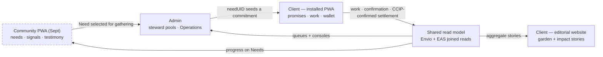

# Commitment Pooling: Low-Fi Wireframes (Four Surfaces)

**Feature Slug**: `commitment-pooling`
**Stage**: `active`
**Created**: 2026-07-04
**Companions**: `uiux-spec.md` (canonical flows — every frame here implements a section of it, referenced per frame), `contract-spec.md` (module vocabulary), `settlement-spec.md` (settlement surfaces, §6 deltas here), `diagrams.md` (state machines these screens render).
**Fidelity**: deliberately low. Boxes, labels, and navigation only — structure and flow, not visual design. Warm Earth expression, spacing, and component polish happen at implementation time per the `design`/`ui` skills; admin frames stay restrained per the prompt contract. All copy shown is placeholder English; every string ships as en/es/pt keys per uiux-spec §10.
**Grounding rule**: component names in `{braces}` are canonical (shared primitives, `Admin*` wrappers, or NET-NEW primitives flagged in uiux-spec §9). Routes are the NET-NEW routes uiux-spec §5.1/§6.1 defines. Nothing here invents a component, route, or term the specs don't already carry.
**Hi-fi reconciliation (2026-07-27)**: every frame below was audited against the canonical hi-fi prototype registry ([Flow Prototypes artifact](https://claude.ai/code/artifact/19c3dcad-ac1d-4398-bcd4-57d0c892be2c), `hifi/screens/index.ts`) and the shipped UI code. Divergent frames were corrected to mirror the locked states — including the five dated uiux-spec Appendix B addenda — and each frame cites its registry entry as a `#screens/SCREEN@state` deep link. Blocks the hi-fi does not draw carry an explicit *wireframe-only* note instead of a blanket accuracy caveat.
**Role vocabulary (decision 2026-07-18; gardener line 2026-07-31)**: gardener-facing and steward-facing copy says **steward** (= holder of the garden's operator/owner Hats); the shipped app still says "Operator" until the recorded app-wide rename lands. The person making or receiving promises is a **gardener** (gardener-Hat holder); "member" appears only as a membership predicate, never as the persona noun.

## 0. Legend

```text
┌─┐ └─┘   screen / dialog / card boundary        [ Label ]   button / CTA
(chip)    status or filter chip                  ▸           tap-through / link
▓▓▓░░░    progress meter                         ◉ ○         selected / unselected
≡         list row                               ⚠           warning / notice band
··queued··  offline-queued chrome                ▸ Section   folded disclosure
```

## 1. Cross-surface flow map

How one Need and its resulting commitment travels across the deliberately separate surfaces. Nodes stay thin (≤2 lines); each surface's detail lives in the list below the map, not inside the boxes.



What each surface owns:

- **Community PWA** (independent app at `community.greengoods.app` — own manifest, service-worker scope, telemetry, routes): Needs · Create · Profile; offline need/signal/testimony.
- **Admin**: steward triage, pool/cycle consoles, seeding, evaluator lineage + CSV/JSON export, and the capability-gated Operations workspace (W24).
- **Client installed PWA**: commitment claim, work, evidence, confirmation, gardener settlement status, WalletDrawer.
- **Client editorial website**: garden and impact stories, funder discovery — aggregates only, never rankings.
- **Shared read model**: auth/passkey, offline status, install/update, EAS Needs + Envio protocol progress joined in shared query composition.

---

## 2. Surface 1: Client PWA

### W1 — Pool tab on garden detail (uiux-spec §5.2)

Route `/home/:id/pool` — NET-NEW fourth `GardenTab` on the existing garden detail. `{AppBar}` stays visible.

```text
┌──────────────────────────────────────────────┐
│ ←  Rocinha Community Garden                  │  existing garden detail header
│  Work · Insights · Gardeners · ◉Pool         │  {StandardTabs} + NET-NEW Pool
├──────────────────────────────────────────────┤
│ Season of First Rains is open                │  pool state banner (§4.1 copy)
│ ┌──────────────────────────────────────────┐ │
│ │ Season of First Rains        (season)    │ │  cycle card — scoped counts,
│ │ 12 offered · 7 kept                      │ │  never a single % meter (units
│ │ runs through Aug 30                      │ │  are incommensurable);
│ └──────────────────────────────────────────┘ │  calm date, never a timer
│ ▸ Campaigns (2 open)                         │  disclosure; never replaces Season
│   ≡ Market rides (campaign) · Open · 6/16    │
│   ≡ Tool library (campaign) · Reviewing · 8/8│
│ Scope [ All current ▾ ]                      │  labelled select (Appendix B §5.2)
│                                              │
│ [ Offer support ]      [ Request help ]      │  persistent creation CTAs → W3
│                                              │
│ (All)(Offers)(Requests)(Matched)(Mine)       │  client-local filter chips
│ ┌──────────────────────────────────────────┐ │
│ │ (Offer)(AGRO)  Prune the north beds      │ │  {DomainBadge} {StatusBadge}
│ │ 6 hours · due Aug 12                     │ │
│ │ anyone in this garden may take this up   │ │  claim-mode helper text
│ │                       [ Take this up ]   │ │  Open mode → optimistic accept
│ └──────────────────────────────────────────┘ │
│ ┌──────────────────────────────────────────┐ │
│ │ (Request)  Ride to the market on Sat     │ │
│ │ 1 ride · runs with the season            │ │
│ │ stewards review who takes this up        │ │
│ │                 [ Ask to take this up ]  │ │  ApprovalGated → "waiting" chip
│ └──────────────────────────────────────────┘ │
├──────────────────────────────────────────────┤
│    Home         Garden         Profile       │  {AppBar} (unchanged)
└──────────────────────────────────────────────┘
```

- Variants (same frame, swapped bands): **NotReady** = checklist naming the missing charter, qualifying baseline, and/or exposure cap; browse/create disabled. **Paused** = `{Alert}` with steward reason; new commitments, claims, Ready submissions, and confirmations are disabled while evidence/work linkage, cancellation/expiry, and dispute recovery remain available. **Empty open pool** = planted-seed illustration slot + the two CTAs + steward-seeded hint.
- Cycle variants: **no open Season + open Campaigns** leaves the Campaign list and scoped work fully active while the Season slot says “No open Season”; **one Season + zero Campaigns** omits the empty Campaign list after a quiet “No open Campaigns” line; history stays separate from current scope.
- Protocol-pool commitments shown in a garden context carry only the `(Protocol)` chip and the claim entry point on the card; the provider-context choice ("As myself" / "For {garden}", eligible stewards only) is locked to the **pre-claim sheet** (register #51 / MF-8) — asking it on the card too meant the same question twice with opposite defaults. The request stores `ClaimType` plus `gardenContext`; acceptance derives `providerGarden`. It does not create token custody or a gardener-delivery fallback. Full protocol-pool claim journey: W25.
- **No "My commitments" strip on this tab** (trimmed 2026-07-18 for client minimalism): the WalletDrawer Commitments tab (W5) is the single cross-garden "mine" surface. The `(Mine)` filter chip stays for in-garden browsing.
- Membership-wait variant (register #34c): a new member's queued rows render an amber `··waiting··` chrome — "waiting for your garden membership — no retries used" — and resume when the hat lands. Applies to W1 cards and W5 groups. Drawing: prototypes.md MF-5.
- Tap card ▸ W2. Offer/Request CTAs ▸ W3 with direction preset.

**Hi-fi**: [`#screens/W1@open`](https://claude.ai/code/artifact/19c3dcad-ac1d-4398-bcd4-57d0c892be2c#screens/W1@open) — canonical state registry for this frame (28 states). Cycle-banner and read-recovery states use the same W1 shell; `composted` remains distinct from Closed and names the steward-owned reopen path:

```text
SEEDED / OPENS SOON                 REVIEWING
┌──────────────────────────────┐    ┌────────────────────────────────┐
│ Your steward is preparing    │    │ Your stewards are reviewing   │
│ this season's promises.      │    │ this season. Evidence and     │
│ Browse only until it opens.  │    │ confirmations stay available. │
└──────────────────────────────┘    └────────────────────────────────┘

CYCLE CANCELLED                    READ RECOVERY
┌──────────────────────────────┐    ┌────────────────────────────────┐
│ This season was cancelled.   │    │ Loading: preserve shell       │
│ Its history stays here.      │    │ Not found: No pool here yet   │
│ 8 made · 5 kept              │    │ Read error: saved last view   │
└──────────────────────────────┘    │                    [ Try again ]│
                                    └────────────────────────────────┘
```

`loading`, `not-found`, and `read-error` are presentation states, never a synthetic “None” pool state. The read-error view keeps the last saved view legible and offers an explicit retry.

Approval-gated request variants reuse the same card/detail grammar and survive refresh:

```text
PENDING                              DECLINED
┌──────────────────────────────┐     ┌────────────────────────────────┐
│ Waiting for steward          │     │ Steward declined this request │
│ Individual · requested Jul 9 │     │ Reason: provider context …     │
│ Provider: myself             │     │ [Ask again] [Back to browse]   │
└──────────────────────────────┘     └────────────────────────────────┘

SUPERSEDED                           ACCEPTED
┌──────────────────────────────┐     ┌────────────────────────────────┐
│ Taken up by someone else     │     │ Your request was accepted      │
│ Nothing you did went wrong.  │     │ Provider garden: Rocinha       │
│ [Back to browse]             │     │ [Open commitment]              │
└──────────────────────────────┘     └────────────────────────────────┘
```

Declined creates no automatic retry: “Ask again” creates a fresh request only while the commitment remains claimable. Superseded copy names, in plain words, whether another request was accepted ("Taken up by someone else") or the commitment was cancelled/expired ("This one was closed before a match") — driven by `resolutionCode` — and never shows a failed-job Retry or any sync/technical language. The frozen interface has no claimant-cancel control for a Pending request.

### W2 — Commitment detail (uiux-spec §5.3)

Route `/home/:id/pool/:commitmentId`. `{AppBar}` hidden (Appendix B §5.1) — the detail header is the chrome.

```text
┌──────────────────────────────────────────────┐
│ ←  Prune the north beds                      │
│ (Offer)(AGRO)(Accepted)  6 hours · due Aug 12│  chips + units + due
│ anyone in this garden may take this up       │  claim-mode helper line
│ ⚠ Recorded by your steward on your behalf.   │  StewardCaptured banner, not a
│   The promise stays yours.                   │  chip (fixed phrasing, §13 Q2)
├──────────────────────────────────────────────┤
│ Lead: Maria · 3 contributors — work underway │  accountability + team
│ Reward: 20 DAI from the garden jar · pending │  declared-reward row (register #18)
├──────────────────────────────────────────────┤
│ ▸ Timeline (4)                               │  {StateTimeline} disclosure
│ ▸ Evidence (2)                    [ + Add ]  │  ▸ W2a attach sheet
│ ▸ Work for this promise (1)                  │  DomainImpact only — submit-work
│                                              │  and link-work actions live
│                                              │  inside (Appendix B §5.3)
│ ▸ Team and contributions (3)              ▸ │  opens W2b
│ ▸ Details                                    │  UIDs · addresses · "recorded
│                                              │  on Arbitrum" live here only
├──────────────────────────────────────────────┤
│ ┌──────────────────────────────────────────┐ │
│ │ [ Confirm: promise kept ]                │ │  only for named confirmers
│ └──────────────────────────────────────────┘ │  while ReadyForConfirmation → W4
└──────────────────────────────────────────────┘

TIMELINE — EXPANDED DISCLOSURE
┌──────────────────────────────────────────────┐
│ ● Offered      — Maria · Jul 2               │
│ ● Accepted     — João took this up · Jul 3   │
│ ● Work linked  — pruning session · Jul 8     │
│ ● Ready        — steward note: "confirmed    │  overrides + reasons always
│                  on site visit" (override)   │  visible to gardeners
└──────────────────────────────────────────────┘
```

- W2 opens the dedicated W2a attach sheet (`{DialogShell}` + `{FileUploadField}`) for evidence capture.
- Fulfilled state: hero moment fires once (§5.10), reward row flips to "reward released" when `RewardPaid` lands.
- Disputed state: banner "under review by stewards", CTAs frozen.
- Expired state (register #34d): the confirm block gives way to a calm expired band + `[ Offer again ]` re-entry into W3. Drawing: prototypes.md MF-3.
- Cancellation placement: while Offered/Requested the creator sees `[ Withdraw this offer… ]` with a required reason (creator path of `cancelCommitment`, register #34b/MF-2a). The Accepted steward path is locked at W10 `[ Cancel promise… ]` with its own required-reason dialog (register #51/MF-2b).
- Hi-fi guidance (audit 2026-07-18, drawn above since 2026-07-27): this is a gardener-facing surface — keep the visible viewport to state + next action. Timeline, Evidence, and Work bands collapse behind progressive disclosure so all five bands never stack at once, and technical identifiers (UIDs, addresses, chain names) live behind the single "Details" disclosure. No dispute/legal vocabulary in primary copy — "under review by stewards" is the ceiling.
- **Hi-fi**: [`#screens/W2@accepted`](https://claude.ai/code/artifact/19c3dcad-ac1d-4398-bcd4-57d0c892be2c#screens/W2@accepted) — canonical state registry (65 states across the six commitment casts). Read states: **Loading** preserves the detail shell, **Not found** explains the promise is unavailable, and **Read error** keeps the saved view while `[ Try again ]` retries the read. None renders a commitment status chip.

### W2a — Evidence sheet (uiux-spec §5.5)

`{DialogShell}` over W2 — sheet chrome, `{AppBar}` hidden (Appendix B §5.1). Photo / link / note creates one `evidence` job per submit and works fully offline. **Hi-fi**: [`#screens/W2a@compose`](https://claude.ai/code/artifact/19c3dcad-ac1d-4398-bcd4-57d0c892be2c#screens/W2a@compose) — 7 states; the four kind-specific compose casts (request / campaign-request / support / captured) are registry-only and reuse this drawing.

```text
COMPOSE                              QUEUED
┌──────────────────────────────┐     ┌────────────────────────────────┐
│ Add evidence                 │     │ Evidence queued                │
│ ◉ Photo  ○ Link  ○ Note      │     │ ≡ North beds after   (Queued) │
│ Credit  [ João, Ana       ▾ ] │     │ Credited: João · Ana          │
│ Saved on this device until   │     │ It will send when you're back │
│ it sends.                    │     │ online.              [ Done ] │
│          [ Attach evidence ] │     └────────────────────────────────┘
└──────────────────────────────┘

UPLOAD FAILED — PER-ROW RECOVERY
┌────────────────────────────────────────────────┐
│ One item needs another try                     │
│ ≡ North beds after  (Couldn't send) [ Retry ] │
│ ≡ Two beds left…     (Sent)                    │
│ Nothing is dropped; retry only the failed row. │
│                                       [ Done ] │
└────────────────────────────────────────────────┘
```

### W2b — Team and contribution sheet (uiux-spec Appendix C)

`{DialogShell}` over W2. The sheet separates accountability, planned assignment, and verified
credit. Solo commitments use the same frame with one contributor.

```text
┌── Team for this promise ────────────────────────────────┐
│ Accountable lead   Maria                               │
│ Team policy        Lead-managed                        │
│ Roster             Editable until Ready for confirmation│
├────────────────────────────────────────────────────────┤
│ Contributors                                           │
│ ≡ Maria Lead · Prune ×2       Work 2 · Evidence 1      │
│ ≡ Ana   Beds survey ×1        Work 1 · Evidence 0      │
│ ≡ Kwame Unassigned            No verified credit yet   │
│                         [ + Add contributor ]           │
├────────────────────────────────────────────────────────┤
│ Assignments help coordinate work. Recognition comes    │
│ from approved Work and evidence on a fulfilled promise.│
│                                          [ Done ]       │
└────────────────────────────────────────────────────────┘

OPEN TEAM — ELIGIBLE GARDENER           FROZEN
┌──────────────────────────────┐        ┌──────────────────────────────┐
│ Gardeners can join this team │        │ Team locked for confirmation │
│ [ Join this promise ]        │        │ 3 contributors cannot confirm│
│ After joining, before credit:│        │ this promise.                │
│ [ Leave this promise ]       │        └──────────────────────────────┘
└──────────────────────────────┘
```

`Leave this promise` calls `leaveCommitment` and appears only for a non-lead Open-team contributor
with zero approved Work/evidence credit. Credited contributors stay in the roster so attribution
and confirmation exclusion cannot be erased.

### W3 — Offer / request creation flow (uiux-spec §5.4)

Route `/home/:id/pool/new?direction=offer|request`. Full-screen (AppBar hidden), existing work-flow chrome: `{TopNav}` + `{FormProgress}`.

```text
┌──────────────────────────────────────────────┐   Step 2 — How much
│ ✕  Make an offer            ● ● ○ ○ ○        │   ┌────────────────────────┐
├──────────────────────────────────────────────┤   │ Unit  [ hours        ▾ ]│
│ Step 1 — What                                │   │ suggestions: hours,     │
│ direction   ◉ Offer support  ○ Request help  │   │ tasks, meals, rides,    │
│ type        ◉ Garden work (impact)           │   │ plants                  │
│             ○ Support / service              │   │ How many  [ 6 ]         │
│   (season/campaign + on-behalf capture are   │   │ Due  {DatePicker}       │
│    console-seeded only — not shown here)     │   │  or ◉ selected deadline │
│ team policy ◉ Open team ○ Lead-managed team  │   │                        │
│ cycle scope [Season: First Rains ▾]          │   │                        │
│   Season · each open Campaign · no cycle     │   │                        │
│ title  [ Prune the north beds            ]   │   └────────────────────────┘
│ note   [ optional                        ]   │   Step 3 — Anchors
├──────────────────────────────────────────────┤   (DomainImpact only)
│                        [ Continue ]          │   ┌────────────────────────┐
└──────────────────────────────────────────────┘   │ What anchors this?     │
                                                   │ ◉ Prune the north beds │
Step 5 — Review and promise                        │ ○ Plant native seedl…  │
┌──────────────────────────────────────────────┐   │ action-card picker from│
│ summary card (all fields, incl. policy and   │   │ the work-flow intro;   │
│  "needs: Prune × 2 · Plant × 1")             │   │ per-action counts draw │
│ [ Make this offer ]                          │   │ as repeatable rows;    │
│  → enqueues `commitment` job, returns to W1  │   │ four visible at first  │
│    with optimistic card + queued badge       │   └────────────────────────┘
└──────────────────────────────────────────────┘
```

```text
Step 4 — Who confirms
┌──────────────────────────────────────────────┐
│ Default: offer recipient confirms            │
│ □ Let the Green Goods team confirm if nobody │
│   local is eligible                          │
│   Safety path only · contributors can never  │
│   confirm their own work                     │
│ Ordinary path: no eligible local confirmer   │
│ Choose this option or change the team/rule.  │
└──────────────────────────────────────────────┘
```

- Step 3 ("Anchors") carries the **repeatable requirements builder** (amended 2026-07-28): each row binds one registered action to a required approved-work count. Actions may repeat a domain; domain chips are derived tags. Four rows are visible initially, and **Add requirement** continues until the implementation's measured `MAX_REQUIREMENTS`. The UI never presents four domains as a product cap. The review step reads the whole requirement in one line ("needs: Prune × 2 · Plant × 1").
- Step 4 ("Who confirms") previews the direction-aware receiver or named group and includes a
  native checkbox: **Let the Green Goods team confirm if nobody local is eligible**. It is off by
  default, writes `protocolFallbackEnabled`, and retains visible helper text that contributors
  can never confirm. An unreachable ordinary rule blocks review until repaired or explicitly
  opted in; a missing registered protocol pool disables the checkbox with its prerequisite named.
- SupportService skips step 3 entirely (evidence + confirmation is its proof).
- Draft persists in IndexedDB (`WorkDraftRecord` semantics); re-entry offers resume via the existing `DraftDialog` pattern.

### WFLOW — Existing work flow, review step (+ locked fulfills row)

Deep-link from W2 into the existing Garden work-submission flow — full-screen work-flow chrome, `{AppBar}` hidden (Appendix B §5.1). Only the commitment-context row is new; the approval rails and the rest of the submission remain unchanged (uiux-spec §5.7). **Hi-fi**: [`#screens/WFLOW@review`](https://claude.ai/code/artifact/19c3dcad-ac1d-4398-bcd4-57d0c892be2c#screens/WFLOW@review).

```text
┌──────────────────────────────────────────────┐
│ ✕  Submit work                    ● ● ●       │
├──────────────────────────────────────────────┤
│ Review                                       │
│ ≡ 2 photos · pruning session                 │
│ ≡ Fulfills: Prune the north beds             │
│   Offer · AGRO · (Promise)                   │
│ Requirement: Prune north beds · row 2        │
│ Credited contributor: Ana                    │
│                                              │
│ Everything else is the existing work flow.  │
│                              [ Submit work ] │
└──────────────────────────────────────────────┘
```

Submitting carries `meta.commitmentId` plus the selected `meta.requirementIndex`; after sync, the
work links back to W2 and advances only that exact row, even when another row uses the same action.

### W4 — Counterparty confirmation sheet (uiux-spec §5.6)

`{DialogShell}` over W2 or W5 — sheet chrome, `{AppBar}` hidden (Appendix B §5.1). Focus order per §12: title → summary → meter → reason → decline → confirm. **Hi-fi**: [`#screens/W4@confirm-domain`](https://claude.ai/code/artifact/19c3dcad-ac1d-4398-bcd4-57d0c892be2c#screens/W4@confirm-domain) (26 states across the five casts).

```text
┌──────────────────────────────────────────────┐
│ Promise kept?                                │
│ Prune the north beds — Maria · 6 hours       │
│ Lead Maria · 3 contributors · recipient confirms │ direction-aware responsibility
│ evidence: 2 items · linked work: 1 approved  │
├──────────────────────────────────────────────┤
│ Confirmations   ▓▓▓▓▓▓▓░░░  2 of 3           │  {ProgressMeter} + text equiv
│ ≡ João and Sofia confirmed            ✓ ✓    │  condensed row (Appendix B §5.6)
│ ≡ You — your turn                     ○      │  distinct actionable row
│ Maria, Ana, and Kwame cannot confirm.         │  every contributor excluded
├──────────────────────────────────────────────┤
│ [ Confirm — promise kept ]                   │  enqueues `confirmation` job
│ [ Not yet — tell the stewards why ]          │  decline → reason field;
│                                              │  routes to steward attention,
│                                              │  never cancels the promise
└──────────────────────────────────────────────┘
```

Confirmation outcomes and the online-only “Not yet” retry match the canonical prototype:

```text
CONFIRMED — PENDING SYNC          FULFILLED — SYNCED
┌────────────────────────────┐    ┌────────────────────────────┐
│ Confirmation saved         │    │ Promise kept               │
│ Confirmations 3 of 3       │    │ Confirmed — the season's   │
│ Saved here; fulfillment    │    │ count just grew.           │
│ appears after sync.        │    │        [ Back to the pool ]│
│                    [ Done ]│    └────────────────────────────┘
└────────────────────────────┘

NOT YET — SEND FAILED
┌──────────────────────────────────────────────┐
│ Tell the stewards                            │
│ Your note is kept. The promise stays ready   │
│ to confirm until the online send succeeds.   │
│                                [ Try again ] │
└──────────────────────────────────────────────┘
```

Evidence band variants — the two delivery styles read differently (audit 2026-07-18). *Wireframe-only: the hi-fi registry does not draw this side-by-side comparison; kept for the two-delivery-styles teaching point (register #10 / #20).*

```text
DomainImpact — the approved work IS the evidence   SupportService / StewardCaptured
┌──────────────────────────────────────────────┐   ┌──────────────────────────────┐
│ Delivery so far                              │   │ Evidence                     │
│ ≡ Pruning session   (Approved ✓)             │   │ ≡ photo — after the workshop │
│ ≡ Planting day      (Approved ✓)             │   │ ≡ note — "met on Saturday"   │
│ every needed action met — Prune 2/2 ·        │   │ No separate approval step —  │
│ Plant 1/1 · approved by your steward         │   │ your confirmation closes it. │
└──────────────────────────────────────────────┘   └──────────────────────────────┘
```

- The two paths compose, they don't compete: DomainImpact reaches this sheet only after every per-action approved-work count is met (the approved-work chips carry that proof into the confirmation moment); no-work-requirement kinds reach it on evidence alone, and here the confirmation IS the review (register #10/register #20).
- For a Request, the helper instead reads “claimant provides · request creator confirms.” Named groups never include the lead provider; an acceptance that would make `N` unreachable fails before any units commit.
- Optimistic tick on the meter; if this was the Nth confirmation, Fulfilled hero fires on **sync completion**, not enqueue.

Fallback confirmation is a distinct state of the same sheet, not an invisible privilege:

```text
GREEN GOODS TEAM FALLBACK — ONLINE ONLY
┌──────────────────────────────────────────────┐
│ Confirm for Green Goods team                 │
│ Eligibility: protocol fallback · selected    │
│ Every contributor is excluded.               │
│ Reason * [ No eligible local confirmer     ] │
│ [ Confirm for Green Goods team ]             │
│ [ Not yet — tell the stewards why ]          │
└──────────────────────────────────────────────┘
```

The local-garden variant says **Confirm as garden fallback**. A dual-role caller sees local
fallback because the contract classifies local authority first. Both variants require a reason,
remain online, and later render their emitted actor/path/reason rather than inferring wallet role.

### W5 — WalletDrawer pools panel (uiux-spec §5.8)

Existing `{ModalDrawer}` from the Home header — the real drawer's three tabs are **Cookies | Tokens | Commitments**; this fills the reserved Commitments stub (`app.wallet.tab.commitments`, replaces `ComingSoonStub`). This tab is the **single cross-garden promises surface** — it absorbed the former W6 home card as its header summary (decision 2026-07-18).

```text
┌──────────────────────────────────────────────┐
│ Wallet   ○ cookies  ○ tokens  ◉ commitments  │  no tab badge — counts live in
├──────────────────────────────────────────────┤  the disclosure below
│ Promises kept this cycle: 7 of 9 due         │  header summary (absorbed W6);
├──────────────────────────────────────────────┤  absolute numbers only
│ Waiting on you                               │  inbox, cross-garden
│ ≡ Maria — Prune the north beds   (Rocinha) ▸ │  ▸ W4
│ ≡ TAS Hub — Field survey ride    (Awka)    ▸ │
├──────────────────────────────────────────────┤
│ ▸ My commitments (4)                         │  count-carrying disclosure
│   Rocinha Community Garden                   │  (Appendix B §5.8); grouped
│   ≡ ··queued·· Compost workshop  (Offered)   │  by garden — queued rows at
│   ≡ Ride to market               (Accepted) ▸│  group top in the @queued
│   Muizenberg                                 │  state; ▸ W2 in that garden
│   ≡ Beach cleanup Saturday       (Fulfilled)▸│
└──────────────────────────────────────────────┘
```

W5 also carries `queued`, `waiting-membership`, `empty`, `loading`, `not-found`, and `read-error` states — **Hi-fi**: [`#screens/W5@default`](https://claude.ai/code/artifact/19c3dcad-ac1d-4398-bcd4-57d0c892be2c#screens/W5@default) (7 states). Empty and not-found explain the absence in member language; read error preserves the saved cross-garden view and exposes `[ Try again ]`. The retired W6 home card does not remain as a standalone frame: Home stays garden-first, while W5 owns its absorbed summary line.

---

## 3. Surface 2: Admin

All admin frames: `{CanvasRouteFrame}` + `{CanvasRouteHeader}` + `{CanvasRouteContent}`; overlays are centered `{AdminDialog}` or flow `{AdminDialog variant="flow"}` + `{ActionFlowShell}`. Restrained copy, no hero moments.

### W7 — Garden workspace: Pool tab (uiux-spec §6.2)

Route `/garden/pool` on the existing Garden `{AdminTabRail}` — the shipped rail is **Health · Impact · Activity** (Settings opens as a dialog over Health, not a tab; `garden.utils.ts`), and Pool joins it as the NET-NEW fourth tab. Seeding is a header action, not a FAB. **Hi-fi**: [`#screens/W7@open`](https://claude.ai/code/artifact/19c3dcad-ac1d-4398-bcd4-57d0c892be2c#screens/W7@open) (28 states).

```text
┌────────────────────────────────────────────────────────────────────────┐
│ Garden ▸ Rocinha      Health · Impact · Activity · ◉Pool     [ Seed ]  │
├────────────────────────────────────────────────────────────────────────┤
│ ┌─ Pool ─────────────────────────────────────────────────────────────┐ │
│ │ (Open) charter ✓ baseline ✓ cap 24  [ Edit charter ] ▸ More actions│ │  {AdminCard}; Pause/Close
│ │ 2 awaiting confirmation · 2 claims waiting · 0 failed payouts ▸jump│ │  fold behind ▸ More actions
│ └────────────────────────────────────────────────────────────────────┘ │
│ ▸ Pool and cycles                     (cycle console folds by default) │
│ ┌─ Cycles console ───────────────────────────────────────────────────┐ │
│ │ SEASON · First Rains · Open                                        │ │  exactly one open Season
│ │ Seeded ─ ◉Open ─ InProgress ─ Reviewing ─ Reconciled ─ Composted   │ │
│ │ [ Close Season ▸ W26 ] [ Cancel… ] [ Open Season disabled: one ]  │ │
│ │ CAMPAIGNS (2 open)                                  [ New Campaign ]│ │  concurrent rows
│ │ ≡ Market rides · Open · 6/16                [ Close ] [ Cancel… ] │ │
│ │ ≡ Tool library · Reviewing · 8/8            [ Review ] [ Cancel… ]│ │
│ └────────────────────────────────────────────────────────────────────┘ │
│ ┌─ Commitments ──────────────────────────────────────────────────────┐ │
│ │ [search………] (◉Open)(Confirmed)(Past)                      newest ▾ │ │  segmented state chips
│ │ ≡ Prune the north beds   (Offer)(Accepted)   6h    Maria         ▸ │ │  {AdminFilterChip}
│ │ ≡ Market ride            (Request)(Ready)    1     João          ▸ │ │  {AdminSortSelect}
│ │ ≡ Compost workshop       (Offer)(Disputed)   3h    Ana           ▸ │ │  row ▸ W10 (left inspector)
│ └────────────────────────────────────────────────────────────────────┘ │
│ ┌─ Claims waiting — steward-reviewed ────────────────────────────────┐ │
│ │ Field survey · request terms                                       │ │
│ │ ≡ claimant Maria · requested by same · individual · Jul 9          │ │
│ │                                      [ Accept ] [ Decline… ]       │ │
│ │ ≡ claimant João · requested by same · individual · Jul 10          │ │
│ │                                      [ Accept ] [ Decline… ]       │ │
│ └────────────────────────────────────────────────────────────────────┘ │
└────────────────────────────────────────────────────────────────────────┘
```

Claim-row outcomes are independently visible in queue history:

```text
DECLINE A                            ACCEPT B
┌──────────────────────────────┐     ┌────────────────────────────────┐
│ A · Declined · reason…       │     │ B · Accepted · stored terms   │
│ B · Pending (unchanged)      │     │ A · Superseded                │
└──────────────────────────────┘     │ other pending · Superseded    │
                                     └────────────────────────────────┘
```

Decline never says the commitment “returns” to browse; it was already available to other eligible claimants. Accept uses the selected row’s stored claimant/requestedBy/kind/gardenContext/requestedAt and never editable replacement terms; the accepted result then shows the derived `providerGarden`. Individual rows show claimant=requestedBy. Garden rows — which arise from protocol-pool claims (W12 / W25), not a garden's own tab — show the GardenAccount as claimant and the authenticated steward as requestedBy.

Layout decisions (audit 2026-07-18): the pool card gains an **above-the-fold summary row** (counts + jump links) so the most actionable queues are visible without scrolling a flat list; **history is not a sub-view** — composted cycles and settled records appear under the `(Past)` segmented chip in place (Garden `OverviewTab` chip precedent), and the old "History:" console row is retired; commitment rows open in the **left inspector** (`{AdminDialog}` via the Garden sheet descriptor) like every other garden workspace detail — the right sheet remains account chrome only.

The readiness write is a distinct, visible W7 state transition:

```text
NOT READY — inputs missing       CHECKS COMPLETE — pool still NotReady       READY — onchain
charter ✕ · cap ✕ · baseline ✕  charter ✓ · cap ✓ · baseline ✓             charter ✓ · cap ✓ · baseline ✓
[ Edit readiness ]               [ Mark pool ready ] [ Edit readiness ]      [ Open pool ] [ Edit charter ]
                                 markPoolReady → PoolReady                    openPool → PoolOpened
```

The app enables **Mark pool ready** only after all three checks pass. The contract enforces the charter plus non-zero provider open-commitment cap; the current non-revoked qualifying Baseline remains the shared/admin preflight. A successful `markPoolReady` produces the separate Ready card; it never silently opens participation.

Adopted 2026-07-11 (register #34; the lifecycle/readiness states above and the hi-fi artifact supersede the original lo-fi gap drawings in `prototypes.md`):
- **Pool-card lifecycle actions** (register #34a): a Ready pool's primary card action is `[ Open pool ]`; `[ Close pool… ]` appears only when every cycle is Cancelled/Composted and indexed pool live commitments are zero (then Compost/Reopen per uiux-spec §4.1). A non-zero count routes to the live-promise/cycle wind-down list. The open-cycle flow adds only a "pool is Ready — open it now?" guard prompt. Drawing: prototypes.md MF-1.
- **Lapsed this cycle** (register #34d): a queue section below Claims waiting lists Expired seeded promises with `[ Re-seed… ]` into W8. Drawing: prototypes.md MF-4.
- **Waiting to join** (register #35): the Garden workspace gains a join-request queue beside ManageMembers — pending / welcomed / declined-with-reason rows executing the existing operator add path; the canonical service design is `../community-interface/join-queue-spec.md`, while this workspace consumes its membership outcome. *Wireframe-only — the hi-fi registry does not draw this queue; it belongs to the community-interface build.*
- Recovery states follow the canonical prototype ([`#screens/W7@open`](https://claude.ai/code/artifact/19c3dcad-ac1d-4398-bcd4-57d0c892be2c#screens/W7@open)): **Loading** keeps the Pool card and cycle-console skeleton in place; **No commitments yet** keeps the header `[ Seed ]` action and an empty-state explanation instead of showing a blank table.

### W8 — Steward seeding console (uiux-spec §6.3)

Flow `{AdminDialog variant="flow"}` + `{ActionFlowShell}`, route `/garden/pool/seed`. **Five steps, not four** (Appendix B §6.3, locked 2026-07-24): the old step 3 splits into *Who confirms* and *Reward*. **Hi-fi**: [`#screens/W8@step1`](https://claude.ai/code/artifact/19c3dcad-ac1d-4398-bcd4-57d0c892be2c#screens/W8@step1) (7 states).

```text
┌── Seed a commitment ── ● ● ● ● ○ ────────────────────────┐
│ Step 1 — Type & scope                                    │
│ type   ◉ Season/campaign  ○ Support  ○ Impact  ○ Capture │
│ direction  ◉ the pool offers   ○ the pool requests       │
│ cycle  [ Season: First Rains ▾ ]                         │
│         options: Season · each open Campaign · no cycle  │
│ title  [                              ]  note [        ] │
├──────────────────────────────────────────────────────────┤
│ Step 2 — Requirements                                    │
│ unit [ hours ▾ ]  target [ 12 ]                          │
│ This promise needs:      (repeatable · bounded by MAX)   │
│ ≡ Prune the north beds   × [ 2 ]  ✕                      │
│ ≡ Plant native seedlings × [ 1 ]  ✕                      │
│ [ + Add an action ]     (per-action approved-work counts)│
│ team policy ○ Open team  ◉ Lead-managed team             │
│ due [ cycle deadline ]                                   │
├──────────────────────────────────────────────────────────┤
│ Step 3 — Who confirms                                    │
│ confirmers  [ + add address ]  ≡ Maria ✕  ≡ João ✕       │  {AddressGroupField} NET-NEW
│ threshold   N = [ 2 ] of 2                               │  validates N ≤ group size
│ Every frozen contributor is excluded from confirmation.  │
│ □ Let Green Goods team confirm if nobody local is eligible│  protocolFallbackEnabled · off
│ Claim acceptance fails if N becomes unreachable unless   │
│ that safety path is explicitly selected.                 │
│ claim mode  ◉ open   ○ steward-reviewed                  │  prefilled by context (register #19)
├──────────────────────────────────────────────────────────┤
│ Step 4 — Reward                                          │
│ reward rail ○ none  ◉ external payout  ○ Celo G$         │  exactly one stored rail
│ external    source [ garden jar ▾ ] token [DAI] amt [20] │  reference only, no custody
├──────────────────────────────────────────────────────────┤
│ Step 5 — Review · team: Lead-managed · GG fallback: off  │
│          reward: External                                │
│                              [ Seed this commitment ]    │
└──────────────────────────────────────────────────────────┘
```

### W9 — Analog capture (uiux-spec §6.5)

Flow `{AdminDialog}` at `/garden/pool/capture` with its **own three-step rail** — Who / What kind / Record — rather than chaining W8's steps. **Hi-fi**: [`#screens/W9@pick-member`](https://claude.ai/code/artifact/19c3dcad-ac1d-4398-bcd4-57d0c892be2c#screens/W9@pick-member) (3 states).

```text
┌── Record on a gardener's behalf ── ● ● ○ ────────────────┐
│ "Recorded by {steward} on your behalf.                   │  fixed non-custodial
│  The promise stays yours."                               │  phrasing (§13 Q2)
├──────────────────────────────────────────────────────────┤
│ Step 1 — Who                                             │
│ gardener [ search gardeners… ▾ ]                         │  the social source
├──────────────────────────────────────────────────────────┤
│ Step 2 — What kind                                       │
│ capture  ◉ their offer  ○ their request  ○ confirmation  │
│          confirmation names garden/protocol fallback;    │
│          both require current Hats + a reason             │
├──────────────────────────────────────────────────────────┤
│ Step 3 — Record                                          │
│ details as W8 fields · [ Record this promise ]           │
└──────────────────────────────────────────────────────────┘
```

### W10 — Commitment detail dialog (uiux-spec §6.2/§6.7)

Centered `{AdminDialog}` with workspace `tone`; opened from W7/W12/W13 rows. **Hi-fi**: [`#screens/W10@detail`](https://claude.ai/code/artifact/19c3dcad-ac1d-4398-bcd4-57d0c892be2c#screens/W10@detail) (18 states; `detail-fallback-eligible` is separate from ordinary-reachable `detail`; steward cancel = [`#screens/W10@cancel`](https://claude.ai/code/artifact/19c3dcad-ac1d-4398-bcd4-57d0c892be2c#screens/W10@cancel), MF-2b).

```text
┌── Prune the north beds ──────────────── (Offer)(Ready) ──┐
│ Maria → João · 6 hours · due Aug 12 · open claim         │
│ Timeline: Offered → Accepted → Work linked → Ready       │  {StateTimeline}
│           (override by steward: "confirmed on site")     │  override marker visible
│ Evidence (2)  ≡ photo  ≡ note                            │
│ Linked work (1)  ≡ Pruning session (Approved)            │
│ Provider: Maria (cannot confirm)                          │
│ Eligible: João ✓ · Ana ○ · you ○   (1 of 2 required)     │  plain key-value row
├──────────────────────────────────────────────────────────┤
│ Rail: External payout record (`ArbitrumExternal`)        │
│ Reward: 20 DAI · garden jar · unpaid                     │  recording a payout is a
│                                                          │  Fulfilled-only act (§6.7)
│ Eligibility: garden fallback                             │  or Green Goods team fallback
│ [ Confirm as garden fallback… ] [ Raise dispute… ]       │  reason required
│ Every contributor is excluded; module owner alone cannot confirm. │
└──────────────────────────────────────────────────────────┘

FULFILLED — RECORD PAYOUT                RESOLVE DISPUTE — OWN STATE
┌────────────────────────────────┐       ┌────────────────────────────────┐
│ Promise fulfilled              │       │ ( Restore previous / Fulfilled │
│ Reward: 20 DAI · unpaid        │       │   / Cancelled / Expired )      │
│ [ Record payout ]              │       │ + required reason · steward-   │
│  → {AdminConfirmDialog}        │       │ only; Expired can never        │
│    captures the rail reference │       │ become Fulfilled               │
└────────────────────────────────┘       └────────────────────────────────┘
```

- Celo G$ settlement (`CeloSettlement`) replaces the external row with the rail-specific queue confirmation below — reachable, like Record payout, only from the Fulfilled state. It cannot expose `Record payout`.

```text
┌── Recognition and payment plan ──────────────────────────┐
│ Rail: CeloSettlement · declared support: 500 G$          │
│ Payer: provider garden Safe · Celo                       │
│ Contributor  Recognition  Payment  Amount               │
│ Maria        50%          50%      200 G$                │
│ Ana          30%          25%      100 G$   (edited)     │
│ Kwame        20%          25%      100 G$                │
│ Kept in garden                         100 G$             │
│ Reason for difference: equipment costs shifted          │
│                     [ Save draft ] [ Finalize payout plan ]│
└──────────────────────────────────────────────────────────┘
```

- Finalization verifies the complete recognition vector/hash, derives payment weights from the
  atomic amount vector, proves `declared = retained + payouts`, and freezes the plan without
  creating children. The finalized screen exposes **[ Prepare payout ]** per non-zero contributor;
  the first action creates one immutable Queued child and an exact repeat returns the same ID.
  If the garden retains all 500 G$, the finalized plan is Complete with zero children, no CCIP
  message, and no garden self-transfer.

- Review additions (audit 2026-07-18): Celo rows follow settlement-record-first precedence (settlement-spec §3.1.2), and the dialog shows the confirmation threshold with named-confirmer status. *Wireframe-only — the hi-fi keeps claims triage on W7 and does not draw an inline pending-claims queue or per-action requirement rows ("Prune 2/2 · Plant 0/1") in this dialog; both are kept here as recorded review intent.*

Register #51 locks this accepted/evidence-in state and its two follow-on dialogs (`hifi/screens/admin.ts` W10 state registry):

```text
ACCEPTED · EVIDENCE IN — LOCKED
┌──────────────────────────────────────────────────────────┐
│ Support · evidence-only · 2 items                        │
│ Evidence is in. Send it to the recipient, or mark it     │
│ ready with a recorded steward reason.                    │
│ ≡ Mark it ready with an override — recorded reason    ▸  │  body rows with explanatory
│ ≡ Cancel this promise — recorded reason               ▸  │  sentences (each ▸ own dialog)
├──────────────────────────────────────────────────────────┤
│                 [ Dismiss ]  [ Send for confirmation ]   │  footer: two actions only
└──────────────────────────────────────────────────────────┘

MARK READY WITH OVERRIDE           STEWARD CANCEL (MF-2b)
┌────────────────────────────┐     ┌────────────────────────────┐
│ Reason (required)          │     │ Reason (required)          │
│ [ field visit confirmed ]  │     │ [ agreement at gathering ]│
│              [ Mark ready ]│     │          [ Cancel promise ]│
└────────────────────────────┘     └────────────────────────────┘
```

**Placement closure (register #51):** the Accepted twin, override, and steward-cancel states are locked at W10 and render without proposal tags. W10's **Not found** state also stays explicit: stale or mid-sync links explain the failure and offer `[ Retry ]` plus `[ Back to pool ]`.

### W11 — Open-cycle allocation step (uiux-spec §6.10)

One step inside the open-cycle flow launched from W7's cycle console. **Hi-fi**: [`#screens/W11@presets`](https://claude.ai/code/artifact/19c3dcad-ac1d-4398-bcd4-57d0c892be2c#screens/W11@presets) (7 states, incl. guard, invalid-sum, and the campaign variants).

```text
┌── Open cycle: allocation policy ─────────────────────────┐
│ Set how each fulfilled promise's units split across      │  plain-language framing
│ the six roles                                            │
│ preset  ◉ Garden-led (default)  ○ Balanced  ○ Custom     │
│ gardeners [ 60% ] treasury [ 15% ] steward [ 10% ]       │  % fields, all editable
│ evaluator [  5% ] community [  5% ] funder  [  5% ]      │  after a preset
│ sum: 100% ✓ · treasury 15% is the floor                  │  hard rule: must equal 100%
├──────────────────────────────────────────────────────────┤
│ Gardener recognition                                     │
│ equal participation [ 35% ] verified contribution [ 65% ]│  both editable; sum = 100%
│ Applies within each fulfilled promise; locked at open.   │
│ At close these shares become the certificate allowlist   │  → W26 wizard
│                          [ Continue ]                    │  the open action lives on the
└──────────────────────────────────────────────────────────┘  next step: [ Open pool and
                                                              cycle ] / [ Open campaign ]
```

- Display unit is **percent**; "bps" appears only in the stored-as helper copy (10000 bps = 100%) — the audit found bare "allocation BPS" labels unreadable. The sum guard blocks continue on ≠100% (`invalid-sum` state); the snapshot is emitted on-chain when the cycle opens.

### W12 — Pools mode inside admin `/community` (uiux-spec §6.8)

Pools view inside the existing admin `/community` workspace, reached through that workspace's tab rail/command palette. **Rescoped 2026-07-18**: the admin stays garden-focused — this mode shows exactly **your garden's pools + the Protocol pool**, never other gardens' pools. (The cross-garden oversight table that used to sit here moved to the capability-gated Operations workspace, W24.) The Protocol pool is visible to garden stewards because their gardeners claim and fulfill its commitments — surveys, community activations, methodology work.

```text
┌────────────────────────────────────────────────────────────────────────┐
│ Community ▸ Pools        ◉ Protocol pool · ○ This garden               │  `/community` workspace tab
├────────────────────────────────────────────────────────────────────────┤
│ PROTOCOL POOL (root garden)                                            │
│ ┌─ Claims — steward-reviewed ────────────────────────────────────────┐ │
│ │ ≡ Awka Hub (garden claim) → Methodology survey (Pending)       ▸   │ │  claimant-kind column
│ │ ≡ Maria (individual) → Community activation (Pending)          ▸   │ │  ▸ W10
│ ├─ Confirmations queue ──────────────────────────────────────────────┤ │
│ │ ≡ Field survey — 1 of 2 confirmed                              ▸   │ │
│ ├─ Funding view (references only) ───────────────────────────────────┤ │
│ │ ≡ 20 DAI · protocol treasury → Field survey (co-funded w/ Awka)    │ │  reward references
│ └────────────────────────────────────────────────────────────────────┘ │
│                                                                        │
│ THIS GARDEN tab: summary card + [ Open garden pool ] handoff to W7     │
│ (state chips Open · Confirmed · Past — no separate history view)       │
└────────────────────────────────────────────────────────────────────────┘
```

**Hi-fi**: [`#screens/W12@protocol`](https://claude.ai/code/artifact/19c3dcad-ac1d-4398-bcd4-57d0c892be2c#screens/W12@protocol) (2 states). *Wireframe-only: a "claimable by your gardeners" browse list is not drawn by the hi-fi — gardeners browse protocol commitments in the client (W25); this admin mode carries claims, confirmations, and funding references.*

### W13 — Hub: Confirm stage (uiux-spec §6.9)

NET-NEW stage on the existing Hub pipeline rail, route `/hub/confirm`.

```text
┌────────────────────────────────────────────────────────────────────────┐
│ Hub      work (3) · assess (1) · certify (2) · ◉confirm (2) · history  │  stage rail + counts
├────────────────────────────────────────────────────────────────────────┤
│ Ready for confirmation — where you are named or fallback-eligible      │
│ ≡ Maria — Prune beds (Rocinha) [garden fallback] ▓▓▓░░ 2 of 3      ▸   │  {AdminLinearProgress}
│ ≡ TAS — Survey ride (Awka) [Green Goods team fallback] ░░░ 0 of 1 ▸   │  opted-in cross-garden row
└────────────────────────────────────────────────────────────────────────┘
```

Protocol-garden stewards see opted-in rows from any pool here without receiving full other-garden
pool browsing. Every row carries an ordinary / garden fallback / Green Goods team fallback text
badge; the path is not color-only. Empty state: keep the Hub stage rail and show “Nothing waiting
for confirmation”; never collapse the whole route into a blank canvas. **Hi-fi**:
[`#screens/W13@queue`](https://claude.ai/code/artifact/19c3dcad-ac1d-4398-bcd4-57d0c892be2c#screens/W13@queue)
(4 states).

### W13b — Commitment-context chip on Hub work cards (delta to the existing work stage)

Where steward approval intersects promises — the D5 touchpoint the sequence diagram annotates — without any new surface:

```text
┌────────────────────────────────────────────────────────────────────────┐
│ Hub ▸ work                                                             │
│ ≡ Pruning session — João      (Fulfills: Prune the north beds)     ▸   │  chip only when the work
│   approving this work advances the linked promise                      │  is linked to a commitment
└────────────────────────────────────────────────────────────────────────┘
```

- The chip names the linked promise (`Fulfills: …`) and is informational, not a link — per-action progress lives in W10's Fulfilled-path detail, and the row itself still opens the existing work approval. Approval is untouched — the existing WorkApproval flow simply becomes legible as promise progress. **Hi-fi**: [`#screens/W13@context-chip`](https://claude.ai/code/artifact/19c3dcad-ac1d-4398-bcd4-57d0c892be2c#screens/W13@context-chip).

### HUBWORK — Existing Hub Work stage

The canonical hi-fi includes the underlying approval screen as its own entry — [`#screens/HUBWORK@approve`](https://claude.ai/code/artifact/19c3dcad-ac1d-4398-bcd4-57d0c892be2c#screens/HUBWORK@approve). Pooling adds context to the title and promise chip; approval and rejection remain the existing Work-stage rails.

```text
┌────────────────────────────────────────────────────────────────────────┐
│ Hub      ◉work · assess · certify · confirm · history                  │
├────────────────────────────────────────────────────────────────────────┤
│ Pruning session — Prune the north beds                                │
│ 2 photos · submitted by João · Jul 8                                  │
│                                              [ Approve ] [ Reject ]    │
│ Existing Work stage — approval rails untouched.                       │
└────────────────────────────────────────────────────────────────────────┘
```

### W14 — Assessment v3 additions to Create Assessment (uiux-spec §6.6)

Extends the existing `/hub/assess/create` flow's step 1 (domain context) — nothing else in the flow changes. **Hi-fi**: [`#screens/W14@baseline`](https://claude.ai/code/artifact/19c3dcad-ac1d-4398-bcd4-57d0c892be2c#screens/W14@baseline) (3 states).

```text
┌── Create assessment — step 1 additions ──────────────────┐
│ cycle    [ Season of First Rains ▾ ]        NET-NEW      │
│ kind     ◉ Baseline   ○ Re-assessment (delta)            │  delta renders only for
│                                                          │  Evaluator-hat holders
│ baseline [ Baseline to compare ▾ ]    (delta only)       │  same garden + domain
│ ⚠ one baseline per garden/cycle/domain — duplicate       │
│   attempts point at the existing record                  │
└──────────────────────────────────────────────────────────┘
```

---

## 4. Surface 3: Editorial website

### W15 — GardenDialog pool story section (uiux-spec §7.1)

Inserted **after `FieldNotesSection`, before Impact Certificates** in the existing `/gardens/:id` dialog. Read-only, aggregate-only.

```text
│ … field notes (existing, untouched) …        │
├──────────────────────────────────────────────┤
│ PROMISES                                     │  kicker + serif headline
│ This garden is midway through its Season     │  one state sentence (§4.1),
│ of First Rains — runs through Aug 30.        │  no progress band
│ 9 promises made, 7 kept so far               │  counts-only sentence below the
│                                              │  threshold (≥5 due, ≥3 promisers
│ Fulfilled promises from this cycle are       │  → per-unit rows + kept rate)
│ anchored in the certificates below.          │  tie-in line down to the
│                                              │  certificates section
├──────────────────────────────────────────────┤
│ … impact certificates (existing) …           │
```

- Pre-launch variant: readiness copy only, zero numbers ("This garden is preparing its pool").
- Above the threshold, per-unit rows and a kept-rate sentence may render — [`#screens/W15@above-threshold`](https://claude.ai/code/artifact/19c3dcad-ac1d-4398-bcd4-57d0c892be2c#screens/W15@above-threshold). **Hi-fi**: [`#screens/W15@counts-only`](https://claude.ai/code/artifact/19c3dcad-ac1d-4398-bcd4-57d0c892be2c#screens/W15@counts-only) (3 states).
- *Wireframe-only: a "Recently kept" outcome-title montage is not drawn by the hi-fi; kept as an editorial option (titles only, never gardener names).*
- Never rendered: cancelled/disputed items, per-person lists, wallet addresses.

### W16 — /impact promises section (uiux-spec §7.3)

One NET-NEW editorial band using the page's existing kicker/heading/reveal grammar, placed **between §01 proof markers and §02 "The cycle"** (decision 2026-07-18: promises get their own section AND the cycle pipeline learns the new stages).

```text
├──────────────────────────────────────────────┤
│ PROMISES                                     │  EditorialKicker — own band,
│ Work that starts as a promise kept           │  EditorialHeading  §01.5
│ ┌────────────┐ ┌────────────┐ ┌────────────┐ │
│ │ 11 gardens │ │ 43 promises│ │ 312 G$     │ │  stat tiles in the §01
│ │ with live  │ │ fulfilled  │ │ support    │ │  proof-marker grammar;
│ │ pools      │ │ this season│ │ arrived    │ │  G$ tile = CCIP-confirmed
│ └────────────┘ └────────────┘ └────────────┘ │  totals only
│                                              │  (thresholded per §7.2)
│ A promise is offered, taken up, worked,      │  one lifecycle sentence in
│ witnessed, and confirmed by the person it    │  relay vocabulary
│ was made to.                                 │
│ [ See the gardens ▸ ]                        │  → /gardens; no per-garden
└──────────────────────────────────────────────┘  table on this page, ever
```

- **§02 pipeline delta**: `PublicEvidencePipeline` gains the promise stages — Assessment → **Promise** → Work → **Confirmation** → Certificate — so "The cycle" tells the whole story the band introduces. **Hi-fi**: [`#screens/W16@band`](https://claude.ai/code/artifact/19c3dcad-ac1d-4398-bcd4-57d0c892be2c#screens/W16@band) (2 states).

---

## 5. Surface 4: Community interface (September, `packages/community`)

The earlier Home / Signals / Profile and problem/upvote frames were superseded on 2026-07-04 and are removed to prevent accidental implementation. The current information architecture, flows, and low-fidelity screens are canonical in:

- `.plans/active/community-interface/spec.md`
- `.plans/active/community-interface/wireframes.md` (Needs / Create / Profile; problem-first Needs with Request / Offer only at commitment seeding)
- `.plans/active/community-interface/journeys.md`
- `.plans/active/community-interface/diagrams.md`

This commitment-pooling file retains only the shared commitment, confirmation, testimony, and settlement primitives those community screens consume.

---

## 6. Settlement deltas (August, settlement-spec §7)

G$ split-state settlement surfaces per `settlement-spec.md`. W21–W23 are new frames; W2 takes copy/action deltas and W10 has the rail-specific queue state drawn above.

**W2 delta (PWA commitment detail, reward row)** — `CeloSettlement` renders three truthful phrases: “support on its way” before an authenticated outcome (delay keeps this phrase), “support arrived ↗” after the current execution key and attempt receives an authenticated success acknowledgment, and “support is being rearranged” after an authenticated failure until stewards reconcile or cancel it (cancellation then uses its own withdrawn/closed copy). A calm action explanation may accompany any phrase, but W2 never renders a success phrase for a failed state and never exposes the operational state noun. Settlement rows identify G$, never DAI. **W10 delta (admin commitment dialog)** — `CeloSettlement` exposes the recognition-aligned contributor payout draft and the full operational state set; W21 finalizes the plan and prepares each payable row before dispatch. `ArbitrumExternal` alone exposes Record payout.

### W21 — Garden Pool tab: Settlement section (delta to W7)

Rendered in the hi-fi as its **own canvas route** (page header `Settlement`, eyebrow `Garden · Celo`) linked from the garden Pool tab — not an `{AdminCard}` inside `/garden/pool`. **Hi-fi**: [`#screens/W21@queue`](https://claude.ai/code/artifact/19c3dcad-ac1d-4398-bcd4-57d0c892be2c#screens/W21@queue) (22 states, incl. payout planning, preparation, and the full recovery set).

```text
┌─ Settlement · Garden · Celo ───────────────────────────────────────────┐
│ no settlement account yet   [ Review registration requirements ]       │  read-only prerequisites;
│                                                                        │  Release deploys/verifies Safe
│  — once governance has deployed + verified the route —                 │  then steward registers existing
│ Safe celo:0x9a…4f (active) · balance 1,240 G$ · allowance 500 G$/wk    │  wireframe-only detail rows —
│ recovery: 2-of-3 · scoped executors: 2 · no owner/executor overlap     │  the hi-fi folds account facts
│ CCIP: Arbitrum/Celo peers configured · native fee reserves monitored    │  behind its account status
│ Payout plan 18 · Prune north beds · Partial · 100 G$ kept in garden   │
│ Disbursements                                    [ Create batch ]      │
│ Settlement/att. │ Recipient │ Kind   │ Amount │ State                  │  6-column dtable rows
│ ≡ 104 / 0       │ Maria     │ Reward │ 160 G$ │ Queued   [ Dispatch ]  │
│ ≡ 103 / 1       │ Kwame     │ Reward │ 100 G$ │ Failed                 │
│                 │           │        │        │  [ Source follow-up ]  │
│ ≡ 102 / 0       │ Ana       │ Reward │ 140 G$ │ confirming arrival     │
│                 │           │        │        │  [ Ack details ]       │
│ ≡ 101 / 0       │ Kwame     │ Reward │ 18 G$  │ Confirmed ↗            │
│ Protocol→Garden funding is separate from contributor payout status.   │
│ Payout preparation, batches, and account registration await gates     │
└────────────────────────────────────────────────────────────────────────┘
```

- Gate status row (register #34f): the settlement card adds a read-only line — `gardener delivery: enabled · changed by 0x9a…4f · Jul 30 · evidence ↗` (or `disabled` + reason). The flip itself stays owner-only ops (`setGardenerDeliveryEnabled`); this row only makes the gate legible.

### W22 — Command/ack operations console (Operations workspace + per-garden)

A full **canvas route** reached from W21 and from the NEW capability-gated **Operations** workspace (W24) — relocated out of `/community` Pools by decision 2026-07-18; only the cancel-batch confirmation is a dialog. **Hi-fi**: [`#screens/W22@ready`](https://claude.ai/code/artifact/19c3dcad-ac1d-4398-bcd4-57d0c892be2c#screens/W22@ready) (10 states).

```text
┌── Payout plan 18 · child 104 / attempt 0 — Rocinha ────────────┐
│ command tuple from canonical pooling facts · no G$ in CCIP      │
│ ▸ Route details — payer: provider garden Safe · peer/version/gas│
│   snapshot locked                                               │
│ [ Dispatch command ]     (spends the monitored native ETH       │
│                           reserve; floor preserved)             │
│ command 0xab…11 ↗ CCIP Explorer · source status Dispatched        │
│ destination tx 0xce…42 ↗ Celoscan · result Succeeded              │
│ acknowledgment 0xac…09 ↗ CCIP Explorer · pending                  │
│ [ Retry acknowledgment ] (permissionless; does not move G$)      │
├──────────────────────────────────────────────────────────┤
│ Delay is derived after the service window; no mutation.   │
│ [ CCIP manual-execution guidance ] [ Retry same command ] │
│ Failure acknowledgment: retry this contributor as attempt 1│
│ Pre-dispatch only: [ Cancel whole queued batch… ]          │
│ No entry-level cancellation while this batch is Queued.    │
└──────────────────────────────────────────────────────────┘
```

- Route gate: before any value execution is enabled, the release checklist must prove the executor is a scoped Zodiac Roles member, never a Safe owner, with canonical-G$ selectors and caps only. Manual execution appears as external CCIP guidance only when Explorer marks a message eligible; it never changes Green Goods state or confirms arrival.
- Cancellation gate: an unbatched Queued disbursement may be cancelled from W21. W22 represents an immutable batch, so it exposes only reasoned whole-batch cancellation while Queued; entry-level recovery appears only after an authenticated Failed result.

### W23 — WalletDrawer: G$ section + gardener send (delta to W5)

Lives in the drawer's **Tokens tab** — G$ is a token balance, so it joins the existing token list rather than claiming a second panel from the Commitments tab W5 owns. **Hi-fi**: [`#screens/W23@balance`](https://claude.ai/code/artifact/19c3dcad-ac1d-4398-bcd4-57d0c892be2c#screens/W23@balance) (5 states, incl. `send-pending` / `send-failed`).

```text
├──────────────────────────────────────────────┤
│ Support received (G$ · Celo)          128 G$ │
│ ≡ +20 G$ — Prune the north beds  (arrived ↗) │
│   recognition 30% · payment 25%               │
│   plan partially complete · 100 G$ kept       │
│   in the garden                               │
│ [ Send G$ ]                                  │  shown only after AA gate
├──────────────────────────────────────────────┤
│ Send G$                                      │  {DialogShell}; explicit online
│ to [ address or gardener… ] amount [    ] G$ │  action — never enters the
│ "Sent from your account on Celo.             │  offline field queue; gas is
│  No gas needed."                             │  sponsored (gardeners hold no CELO)
│ [ Send ]                                     │
└──────────────────────────────────────────────┘
```

Gate-failed variant (same frame, no substitute custody flow):

```text
┌─ G$ gardener delivery ───────────────────────┐
│ Gardener delivery isn't on yet               │
│ The Celo account and sponsored-send path has │
│ not passed its round-trip check. Safe-to-Safe│
│ garden funding may continue, but gardener    │
│ delivery and Send G$ stay unavailable.       │
│ [ View technical status ]                    │
└──────────────────────────────────────────────┘
```

The account in both variants is the contributor's same-address counterfactual smart account on
Celo (plan register #16). `gardenerDeliveryEnabled` turns on only after the recorded Celo
AA/paymaster exit evidence and Kernel-version proof in `settlement-spec.md` Appendix A. If the
spike fails, ProtocolToGarden continues and this member-delivery frame remains blocked.

### W24 — Operations workspace (NET-NEW, capability-gated)

New admin workspace tab (uiux-spec **§6.11**) with
`showOperations = isDeployer || canQueueFunding || canOperateSettlement`. Route visibility does
not confer write authority: each control keeps its exact onchain capability, and the funding form
requires `canQueueFunding` (protocol steward or SettlementModule owner; deployer alone is
insufficient). Stage rail: **Queue · CCIP · Flows**. This is the protocol-admin execution home —
everything cross-garden and cross-chain lives here, keeping the garden workspaces garden-focused.
**Hi-fi**: [`#screens/W24@queue`](https://claude.ai/code/artifact/19c3dcad-ac1d-4398-bcd4-57d0c892be2c#screens/W24@queue)
(6 states, including authorized and unavailable funding views).

```text
┌────────────────────────────────────────────────────────────────────────┐
│ Operations        ◉ queue (3) · CCIP · flows                           │  capability-gated tab
├────────────────────────────────────────────────────────────────────────┤
│ QUEUE — all gardens                                                    │
│ ≡ Rocinha settlement 104 / attempt 0 (Queued) [ Dispatch ▸ ]           │  ▸ W22
│ ≡ Awka settlement 103 / attempt 1 (Failed ▸) [ source follow-up ]      │
│ ≡ Muizenberg Funding / ProtocolToGarden / no commitment (Queued)  ▸    │
├────────────────────────────────────────────────────────────────────────┤
│ CCIP — command/ack health                                              │
│ Arbitrum native reserve ✓ · Celo native reserve ✓ · peers configured ✓ │
│ ≡ settlement 102 · executed on Celo · acknowledgment pending        ▸  │
├────────────────────────────────────────────────────────────────────────┤
│ FLOWS — cross-chain funds board                                        │
│ GoodDollar pool → GG protocol Safe    balance 4,120 G$  (Celo read)    │
│ GG protocol Safe → garden Safes       [ Seed / top up ]                 │
│ garden Safes → gardeners              planned commitment rewards         │
│ Gardens: ≡ Awka kept 8/9 · ≡ Muizenberg kept 5/6   (alphabetical)      │  oversight rows moved
├────────────────────────────────────────────────────────────────────────┤
│ SEED / TOP UP — canQueueFunding only                                   │
│ Garden [ Awka Hub · registered Celo Safe ▾ ] · Amount [ 500 G$ ]       │
│ Source: GG protocol Safe · Recipient: selected registered garden Safe   │
│ This does not fulfill, reward, or alter a commitment.                   │
│                                      [ Cancel ] [ Queue seed / top up ] │
│ → emitted Funding / ProtocolToGarden / Queued · no commitment ID        │
└────────────────────────────────────────────────────────────────────────┘  from old W12; never ranked
```

- The **Flows board** is where protocol-Safe *inflow* (the HoA stream) becomes legible — a Celo balance read, since the module does not record an upstream hop. The planned read model distinguishes queued, dispatched, Celo-executed/ack-pending, confirmed, failed, and delayed.
- The Queue contains only emitted protocol/indexer records. An untouched funding form is not a
  Draft disbursement. A connected account without `canQueueFunding` sees the funding-unavailable
  state even when another Operations capability grants route access.
- The production route authority gate applies to every value-execution control here, as described in W22.

### W25 — Protocol-pool claim flow (client PWA)

The gardener journey the protocol pool exists for: claiming and fulfilling a protocol-seeded commitment (a survey, a community activation) from the client. Entry: the protocol-pool card surfaced in W1's garden context, or the WalletDrawer (W5).

```text
┌──────────────────────────────────────────────┐
│ (Protocol)(Request)  Methodology survey      │  (Protocol) chip is the only
│ 1 survey · stewards review who takes this up │  new mark on the W1 card;
│ [ Ask to take this up ]                      │  the card carries only the
├──────────────────────────────────────────────┤  claim entry (register #51)
│ PRE-CLAIM SHEET — provider context           │  {DialogShell}; AppBar hidden
│ take this up   ◉ As myself                   │  (Appendix B §5.1)
│                ○ For Awka Hub                │  garden option: eligible
│ Team          With a team · Open             │  immutable creation-time policy
│ [ Continue ]                                 │  stewards only
├──────────────────────────────────────────────┤
│ → (waiting for review) chip                  │  W1 pending/declined/superseded
│ → accepted: deliver like any promise         │  grammar applies unchanged
│   work + evidence anchor to YOUR garden      │  providerGarden = your garden
│ → confirm via W4 when ready                  │
└──────────────────────────────────────────────┘
```

- No new grammar: the protocol pool reuses W1's cards and wait states, W2's delivery, W4's confirmation. Only the `(Protocol)` chip and the **pre-claim provider-context sheet** are new (register #51 / MF-8 — the card never asks the context question). Solo/team and Open/Lead-managed are immutable seeding facts, so this sheet displays them read-only and never attempts to change them through `claimCommitment`. Work/assessments anchor to the claiming garden even though the commitment lives in the root pool (D5's providerGarden rule). **Hi-fi**: [`#screens/W25@card`](https://claude.ai/code/artifact/19c3dcad-ac1d-4398-bcd4-57d0c892be2c#screens/W25@card) · sheet: [`#screens/W25@context-chooser`](https://claude.ai/code/artifact/19c3dcad-ac1d-4398-bcd4-57d0c892be2c#screens/W25@context-chooser).

### W26 — Cycle close → allocation → certificate wizard (admin)

A **canvas-route wizard** (page header with a `Step N of 4` eyebrow) launched from W7's cycle console `[ Close Season ]` — makes the previously undefined cycle→hypercert linkage concrete by sequencing three things the specs already define: `closeCycle` (the reconcile act), the six-role allocation snapshot (W11 set it at open), and the commitment-bundled certificate cut-over (contract-spec §9). **Hi-fi**: [`#screens/W26@review`](https://claude.ai/code/artifact/19c3dcad-ac1d-4398-bcd4-57d0c892be2c#screens/W26@review) (9 states, including the read-only inconsistent-recognition blocker and four `paused-*` variants).

```text
┌── Close cycle: Season of First Rains ── Step 1 of 4 ─────┐
│ Step 1 — Close         9 promises · all terminal         │
│   7 kept · 1 expired · 1 cancelled after review         │
│   live commitment count: 0  [ Close cycle and continue ]│
│ Step 2 — Shares (read-only; cycle now Reconciled)        │
│   gardeners 60% · treasury 15% · steward 10%             │
│   evaluator 5% · community 5% · funder 5%                │
│   Gardener contributors:                                 │
│   Maria 38% · Kwame 37% · Ana 25%                        │
│   Cycle policy · default 20% equal / 80% verified        │
│   Recognition is read-only from frozen on-chain credit.  │
│   If eligible contributors = 0: certificate blocked as   │
│   inconsistent legacy/indexed data; no metadata override.│
│ Step 3 — Impact certificate                              │
│   bundle: 7 fulfilled promises + their work, evidence,   │
│   and need lineage → allowlist from the shares above     │
│   [ Mint impact certificate ]   (existing Hypercert      │
│   pipeline; the garden account holds the certificate)    │
│ Step 4 — Rest the cycle       [ Compost closed cycle ]   │
│   aggregates roll into pool history; the next season     │
│   seeds fresh on this pool (D9)                          │
└──────────────────────────────────────────────────────────┘
```

- The wizard invents no contract surface — it choreographs `closeCycle` → certificate mint → `compostCycle` so stewards experience cycle close as one coherent ritual instead of three consoles. `closeCycle` succeeds only after every commitment is terminal and `liveCommitmentCount == 0`; its Reconciled result is the certificate composer's prerequisite, so no new commitment can enter the bundle between mint and close. No unit percentage appears in Step 1 because units are incommensurable across commitments.

## 7. Coverage check

| uiux-spec section | Frame |
|---|---|
| §5.2 pool home | W1 |
| §5.3 commitment detail | W2 |
| Appendix C team/contribution management | W2b + W2/W2a/WFLOW deltas |
| §5.4 creation flow | W3 |
| §5.5 evidence capture | W2a |
| §5.7 existing work submission + commitment context | WFLOW |
| §5.6 confirmation flow | W4 |
| §5.8 wallet panel | W5 (incl. the absorbed cross-garden summary header) |
| §5.10 hero moments | noted on W2/W4 (motion, not a screen) |
| §6.2 garden pool tab | W7 |
| §6.3 seeding console | W8 |
| §6.5 analog capture | W9 |
| §6.2/§6.7 commitment dialog, disputes, recognition/payment plan | W10 |
| §6.10 allocation step + within-gardener recognition policy | W11 |
| §6.8 Pools view inside admin `/community` | W12 (rescoped 2026-07-18: your garden + protocol pool) |
| §6.9 Hub confirm stage | W13 + W13b commitment-context chip |
| Existing Hub Work approval stage | HUBWORK |
| §6.6 assessment v3 | W14 |
| §6.11 Operations workspace (NET-NEW, capability-gated) | W24 |
| Protocol-pool claim journey (client) | W25 |
| Cycle close → allocation → certificate | W26 |
| §7.1 garden pool story | W15 |
| §7.3 /impact section | W16 |
| Community member/public/admin/evaluator/funder views | canonical Community `wireframes.md` |
| settlement-spec §7 reward-status copy (PWA) | W2 delta note (§6) |
| settlement-spec §7 admin settlement card + disbursement queue | W21 |
| settlement-spec §7 batch execution console | W22 |
| settlement-spec §7 wallet G$ + gardener send | W23 |
| settlement-spec §5 AA-gate failure | W23 gate-failed variant |
| 2026-07-11 review adoptions (plan.todo.md register #34–register #35) | states folded into W1/W2/W7/W10/W21/W22; no standalone MF frames |
| uiux Appendix D.1 declared value | W8/W3/W2 deltas + W10 mirror (§8) |
| uiux Appendix D.2 exchange linking | W8/W3/W2 deltas (§8) |
| uiux Appendix D.3 standing (counts only) | W5 + W7/W10 claims-queue deltas (§8) |
| uiux Appendix D.4 rotation Campaign template | W27 + W1 read-only strip (§8) |
| uiux Appendix D.5 reserve/redemption framing | W21/W23 copy deltas (§8) |
| uiux Appendix F.2 Things I can offer (saved details, Offer once vs over time) | W32 (§9) |
| uiux Appendix F.2 Offer over time — choose a garden | W33 (§9) |
| uiux Appendix F.2/F.3 ongoing Offer detail + Story | W34 (§9) |
| uiux Appendix F.2 Add places | W35 (§9) |
| uiux Appendix F.4 rest / resume / retire + succession preview | W34 states (§9) |
| uiux Appendix F.5 admin grouping by ongoing Offer | W7/W10 deltas (§9) |

## 8. CPP-alignment deltas (2026-08-01, uiux-spec Appendix D)

Frame deltas for the declared-value term, counter-commitment exchange reference, counts-only
standing, rotation Campaign template, and reserve/redemption framing (contract authority:
contract-spec decisions 16–17; surface authority: uiux-spec Appendix D). Hi-fi additions are a
follow-up pass; the prototype artifact carries these as annotated planned states until then.

### W8 delta — seeding console: exchange reference (Step 1) + declared value (Step 4)

Step 1 gains the optional "In exchange for" picker below the cycle select; Step 4 gains the
declared-value pair above the reward rail. All other steps unchanged; five-step rail stands.

```text
┌── Step 1 — Type & scope (delta) ─────────────────────────┐
│ cycle  [ Season: First Rains ▾ ]                         │
│ in exchange for  [ none ▾ ]                              │  optional; lists this pool's open
│   ▸ "Weekly workshop facilitation" (Offer · open)        │  Offers/Requests only; other pools
│   ▸ "Panel maintenance rota" (Request · open)            │  and self excluded by construction
├── Step 4 — Reward (delta) ───────────────────────────────┤
│ declared value  [ 5 ] [ G$ ▾ ] per hour                  │  optional pair; free text basis with
│ "What reference value does one hour carry here? Optional │  G$/USD presets; exact-label, never
│  — a shared term; no settlement or conversion rule."     │  case-normalized
│ reward rail ○ none  ◉ external payout  ○ Celo G$         │
│ external  amt [ 60 ]  ← prefilled 5 × 12, editable       │  "Suggested from the declared
│                                                          │   value — adjust freely"
└──────────────────────────────────────────────────────────┘
```

A commitment may declare value with `none` as its reward rail (valuation without pay). Steward
edit pre-acceptance rides a `setDeclaredValue` action beside the existing reward edit; immutable
after acceptance.

### W3 delta — client creation flow

The gardener terms step gains the same two optional fields with identical copy: declared-value
pair + "In exchange for" picker (same-pool open commitments only). No new step; both fold into
the existing terms card.

### W2 delta — commitment detail: terms row + exchange pair strip

```text
┌── Terms (delta rows) ────────────────────────────────────┐
│ Declared value   5 G$ per hour                           │  renders only when declared
│ In exchange for  ⇄ "Panel maintenance rota"  [Accepted]  │  tappable → counterpart detail
└──────────────────────────────────────────────────────────┘
counterpart lapsed variant:
│ In exchange for  ⇄ "Panel maintenance rota"  [Expired]   │
│   "The exchanged promise ended (expired). This one       │  quiet state; no automatic action,
│    continues on its own terms."                          │  decision 17 no-coupling rule
```

The strip renders from `counterCommitmentId` or the reverse index (`CommitmentCounterIndex`).
Vocabulary is "exchanged promises" — never "swap", "trade", or "traded". W10 (admin dialog)
mirrors both rows read-only, plus the pre-acceptance declared-value edit.

### W5 delta — wallet: "My part in this pool" standing block

```text
┌── My part in {pool} ─────────────────────────────────────┐
│ 4 kept · 1 lapsed · 2 received · carrying 1 open         │  counts only, PoolMemberHistory
│ 6 confirmations given                                    │  never a %, grade, or comparison
└──────────────────────────────────────────────────────────┘
```

Visible to the member themself only here; steward view below. Never rendered on editorial or
public surfaces (pool-level aggregates only there).

### W7/W10 delta — claims queue: claimant standing line

Each ApprovalGated claimant row in the claims/review queue gains one compact history line
sourced from `PoolMemberHistory`:

```text
│ ▸ Maria — requests "Compost turning" · 8 hours           │
│   In this pool: 4 kept · 1 lapsed · 2 received ·         │  tooltip: "Shared memory of this
│   carrying 1 open                                        │  pool's give and take — context
│   [ Accept ]  [ Decline… ]                               │  for stewarding, not a score."
```

Counts only; no percentage, no cross-member comparison, no sort-by-standing affordance.

### W27 — Rotation Campaign template (admin seeding + turns strip) NET-NEW

Cycle seeding (`W7 → seed cycle`) gains a template choice; picking **Rotation** adds a roster
step and pre-drafts one Request per member in order. Each turn is an ordinary commitment; the
order lives in cycle `metadataCID` — no new chain state.

```text
┌── Seed a campaign ───────────────────────────────────────┐
│ template  ○ Blank   ◉ Rotation                           │
│ "Each member takes a turn receiving the pool's help."    │
│ turn order  ≡ Maria  ≡ João  ≡ Ade  ≡ Bina   [ + add ]   │  drag to reorder before open
│ per-turn Request draft: unit/target/confirmers as W8     │
├── Cycle detail — turns strip (derived) ──────────────────┤
│ ● Maria (fulfilled) → ● João (fulfilled) → ◉ Ade (open)  │
│ → ○ Bina (next)                                          │
│ "Turns show history, not debt — skipping or reordering   │
│  is an ordinary steward edit."                           │
└──────────────────────────────────────────────────────────┘
```

The client pool home (W1) renders the same strip read-only on rotation campaigns. Offered only
when a garden opts in; the pilot reciprocity question (pilot-evidence-spec §3) consumes it.

### W28 — Exchange picker in creation step 1 (uiux-spec Appendix E.1) NET-NEW

```text
┌─────────────────────────────────────────────────────┐
│ ← New offer                         Step 1 of 5      │
├─────────────────────────────────────────────────────┤
│ What are you offering?                              │
│ [ Repair the shared water pump                    ] │
│                                                     │
│ Offer this in exchange for…                         │
│ ┌─────────────────────────────────────────────────┐ │
│ │ Search offers in this pool…                    │ │
│ └─────────────────────────────────────────────────┘ │
│                                                     │
│ ○ Seedling delivery · 12 trays · Apr 18            │
│   Offer · by Ana                                    │
│ ● Childcare during the work party · 6 hours         │
│   Offer · by Ana                                    │
│ ○ Tool repair · 2 sessions · Apr 22                 │
│   Offer · by João                                   │
│                                                     │
│ [Clear]                              [Use this offer]│
└─────────────────────────────────────────────────────┘

Review line after selection:
  You give Repair the shared water pump · 1 repair
  You receive Childcare during the work party · 6 hours
```

Uses the existing full-screen creation chrome, labelled input, list rows, and `StatusBadge`.
Results are contract-eligible same-pool Offers only: still Offered, Individual, capacity-backed,
and created by someone other than the signed-in direct creator of B. The control is absent from
`StewardCaptured` / on-behalf creation. Accepted, lapsed, self-owned, non-Individual, and
capacity-inconsistent rows are excluded. Empty, loading, read-error, clear, selected, and
selection-became-invalid states are required; keyboard order follows the visible order and focus
returns to the row after closing. The executor re-reads the predicates for early feedback;
`createCommitment` repeats them atomically before allocating/storing B or registering its class.
If A changes before mining, the transaction creates no B and returns focus to a clear-or-replace
action.

### W29 — Exchange pair detail and status (uiux-spec Appendix E.1) NET-NEW

```text
┌─────────────────────────────────────────────────────┐
│ ← Repair the shared water pump       [Accepted]     │
│ 1 repair · runs through April 22                    │
├─────────────────────────────────────────────────────┤
│ [Matched] Both promises started together            │
│                                                     │
│ You give                                            │
│ Repair the shared water pump · 1 repair             │
│ State: Accepted                                     │
│                                                     │
│ You receive                                         │
│ Childcare during the work party · 6 hours           │
│ State: Accepted                                     │
│                                                     │
│ Each promise is kept on its own.                    │
│ [Open the other promise]                            │
├─────────────────────────────────────────────────────┤
│ Pool exchange feed                                  │
│ • Both promises started · Ana and Maria · Apr 4     │
│ • Offered in exchange for · João and Luz · Apr 2    │
└─────────────────────────────────────────────────────┘

Status variants:
  Proposed            "Proposed in exchange for [other promise]"
  Matched             "Both promises started together"
  Counterpart lapsed  "The other promise ended. This promise keeps its own state."
```

The pair treatment reuses `StatusBadge`, terms rows, `ListPrimitives`, and the existing detail
timeline. Pair status never replaces the ordinary commitment state.

### W30 — Accept-exchange confirmation sheet (uiux-spec Appendix E.1) NET-NEW

```text
┌─────────────────────────────────────────────────────┐
│ Start both promises?                              × │
├─────────────────────────────────────────────────────┤
│ You'll receive Repair the shared water pump.        │
│                                                     │
│ Maria will receive Childcare during the work party. │
│                                                     │
│ Both promises start together; each is kept on       │
│ its own.                                            │
│                                                     │
│ [Not now]                       [Start both promises]│
└─────────────────────────────────────────────────────┘
```

This is the existing confirmation-sheet / `DialogShell` pattern. The action is visible only to
A's creator. It calls `acceptExchange(B)` once, shows no optimistic partial success, and returns
focus to the trigger on dismissal. Each error state names the actor and next action from D25.

### W31 — Offer-template picker (uiux-spec Appendix E.2) NET-NEW

```text
┌─────────────────────────────────────────────────────┐
│ ← Create a promise                                  │
├─────────────────────────────────────────────────────┤
│ Start from an Offer template                        │
│ Choose a familiar way this pool works together.     │
│                                                     │
│ Rotation                                            │
│ Each member takes a turn receiving the pool's help. │
│                                                     │
│ Work party                                          │
│ A group gathers around one shared piece of work.    │
│                                                     │
│ Harvest share                                       │
│ People promise part of a harvest and how it arrives.│
│                                                     │
│ Tool lending                                        │
│ A tool is offered for a named period and purpose.   │
│                                                     │
│ Mentorship circle                                   │
│ People offer time to learn and practice together.   │
│                                                     │
│ Exchange circle                                     │
│ Two people prepare linked offers that start together│
│ and are kept separately.                            │
│                                                     │
│ [Start blank]                                       │
└─────────────────────────────────────────────────────┘
```

Rows reuse `Surface`, `ListPrimitives`, and existing direction/type chips. The visible one-line
meaning is also the accessible description. Choosing a row prefills existing fields only and
always lands in the editable creation flow; no template adds a contract type or lifecycle.

### W21/W23 copy delta — reserve and redemption framing

Where the settlement frames name the paying account, copy reads "the pool's reserve" (garden
Safe) and a paid declared reward reads "redeemed from the pool's reserve" — framing only. Every
settlement-state rule stands unchanged; "redeemed" never renders before the authenticated
success acknowledgment for the current execution key and attempt.

## 9. Offering over time (2026-08-02, standing-commitments-spec + uiux Appendix F)

Frames for the durable, repeatable Offer. **There is one product noun — the Offer — used two
ways.** No drawing in this section may introduce a second product noun beside it:

| Path | What it creates | Gardener copy |
|---|---|---|
| **Offer once** | one ordinary Offer with `commitmentSeriesId == 0` | "Offer it once" — the existing creation flow, unchanged |
| **Offer over time** | one pool-scoped `CommitmentSeries` in one garden | "Offer it over time", then "ongoing Offer" |

Three supporting facts, none of which is a product object:

| Fact | Where it lives | The mistake these frames exist to prevent |
|---|---|---|
| **Saved offer details** | signed offchain, private by default; reusable input to **either** path | drawing them as on-chain, public, a credential, or a second object beside the Offer |
| **Available place** | one already-created Offered instance with its provider slot reserved at creation | drawing availability that a claim would have to create |
| **Story** | exact linked-instance history and absolute counts | drawing a rate, rank, score, or inferred participant count |

A claim **accepts** a pre-created place. Nothing here may show a claim spawning an instance.
`CommitmentSeries` is the internal name and may appear in technical diagnostics; it is never
rendered as gardener copy. Hi-fi realizations are W32–W35 in the prototype registry.

### W32 — Things I can offer (uiux Appendix F.2) NET-NEW

Personal surface, profile-adjacent. Saved details are private until they are used to make an offer.

```text
┌──────────────────────────────────────────────┐
│ ←  Things I can offer                        │
│ Details you can reuse. Nothing here is a     │
│ promise until you offer it in a garden.      │
├──────────────────────────────────────────────┤
│ Saved details                            (1) │
│ ≡ Hosting climate workshops                  │
│   A two-hour session on local climate work   │
│                            (Ready to offer)  │
│                                              │
│ [ Save offer details ]                       │
│ Saved privately. No garden, pool, ongoing    │
│ Offer, or available place exists yet.        │
├──────────────────────────────────────────────┤
│    Home         Garden        ◉Profile       │
└──────────────────────────────────────────────┘

choose-path sheet (after picking saved details):
│ Hosting climate workshops                    │
│ How would you like to offer this?            │
│ ┌──────────────────────────────────────────┐ │
│ │ Offer it once                            │ │
│ │ One promise, this time only.             │ │
│ └──────────────────────────────────────────┘ │
│ ┌──────────────────────────────────────────┐ │
│ │ Offer it over time                       │ │
│ │ Keep offering it in one garden, cycle    │ │
│ │ after cycle.                             │ │
│ └──────────────────────────────────────────┘ │
```

States: `saved` · `saved-with-ongoing` · `saved-with-ongoing-ready` · `series-queued` ·
`series-queued-place-waiting` · `empty` · `compose` · `choose-path` · `draft-unsaved` ·
`saving` · `save-failed` · `offline-local` · `version-conflict` · `persistence` · `loading` ·
`read-error`.

**The two paths are named once, in one place.** `choose-path` is the only frame that offers the
choice; **Offer it once** enters the ordinary W3 creation flow through
`saved-offer-edit` → `saved-offer-review` → `saved-offer-queued`, preserving every prefilled
workshop field and creating one Offer with `commitmentSeriesId == 0`. **Offer it over time**
enters W33. Neither is a different kind of thing — both produce Offers.

**Saved and queued states do not borrow future truth.** `saved` contains private metadata only.
`saved-with-ongoing` is the later mixed library state. `series-queued` keeps the unsynced ongoing
Offer visible with zero availability, and `series-queued-place-waiting` keeps both the queued
series and its dependent place visible without calling either one Active or available.

**Persistence is drawn honestly.** `draft-unsaved` says the draft is on this device only; Save
enters `saving`, and only a confirmed owner-authenticated response reaches `saved`.
`save-failed` and `offline-local` retain the local draft and explicitly deny cross-device
durability. `version-conflict` keeps both truths visible and requires reload, local-copy, or
explicit compare-and-swap overwrite. Learning or aspiration states are out of scope for the
initial Offer flow and are not drawn.

### W33 — Offer over time: choose a garden (uiux Appendix F.2) NET-NEW

Creates the pool-scoped ongoing Offer. It opens no places.

```text
┌─────────────────────────────────────────────────────┐
│ ×  Offer over time                     ● ○ ○        │
├─────────────────────────────────────────────────────┤
│ Choose where you will keep offering this.           │
│ ◉ Rocinha Community Garden — gardener · pool open   │
│ ○ Muizenberg Deep South    — gardener · pool ready  │
│ ⚠ An ongoing Offer lives in one garden. Offering    │
│   the same thing elsewhere is a separate ongoing    │
│   Offer there.                                      │
│                              [ Continue ]           │
└─────────────────────────────────────────────────────┘
review step:
│ Offer          Hosting climate workshops            │
│ Places open now None — you add them next            │
│ Next cycle      Ask me again next cycle             │
│                 [ Start offering over time ]        │
```

States: `garden` · `garden-ready` · `terms` · `terms-ready` · `review` ·
`review-ready` · `queued` · `queued-ready` · `place-waiting` · `waiting-membership` · `failed` ·
`discarded-dependency`.

The Ready variants preserve the chosen pool state through review, queue, sync, the personal
ongoing-Offer row, and `W34@pool-ready`. A Ready pool may receive `createCommitmentSeries`, but
the resulting detail has no **Add places** action and cannot reach W35 until indexed pool state is
Open.

`place-waiting` is the dependent-draft state: a place drafted before its series exists waits on
explicit queue state, consumes no retry budget, and says what it is waiting for. Discarding the
series keeps the place drafts recoverable. `waiting-membership` keeps that dependent place visible
while the parent series job waits for the required Hat; cancelling the wait routes to
`discarded-dependency`, where the member must explicitly recreate the series, retarget the draft,
or remove only the draft.

### W34 — Ongoing Offer detail and Story (uiux Appendix F.2/F.3/F.4) NET-NEW

Route `/home/:id/pool/standing/:seriesId`. The grouping surface — never a replacement for the
instance lifecycle.

```text
┌──────────────────────────────────────────────┐
│ ←  Hosting climate workshops                 │
│    Rocinha Community Garden · Active         │
├──────────────────────────────────────────────┤
│ 2 places available now                       │
│ Each one is a real promise waiting to be     │
│ taken up.                                    │
│ ≡ Workshop session 1 · Season of First Rains │
│   (Offered)                                  │
│ ≡ Workshop session 2 · Season of First Rains │
│   (Offered)                                  │
│ [ Add places ]                               │
│                                              │
│ Kept      12 times across 5 cycles           │
│ Unit      workshop sessions                  │
│ Next cycle  Ask me again next cycle          │
│ [ See the whole story ]                      │
│                                              │
│ Looking after this offer                     │
│ [ Edit offer details ]                       │
│ [ Rest it for now ]   [ Retire it ]          │
│ [ Sharing and handing on — later ]           │
└──────────────────────────────────────────────┘
Story state:
│ Kept 12 times across 5 cycles                │
│ ● Kept — market-day session      Jul 12      │
│ ● Kept — school visit            Jun 28      │
│ ● Under review by stewards, then kept  Jun 02│
│ ● Withdrawn before anyone took it up  May 20 │
│ ● Ran out of time — nobody took it up Apr 30 │
```

States: `active-two` · `active-none` · `active-one` · `places-queued` · `places-partial` ·
`places-partial-failed` · `story` · `participation` · `ask-again` · `claimant-view` ·
`pool-ready` · `pool-paused` · `pool-closed` · `pool-composted` · `edit-active` ·
`edit-active-none` · `edit-active-ready` · `edit-resting` · `edit-resting-none` ·
`edit-resting-ready` · `resting` · `resting-none` · `resting-ready` · `retire-confirm` ·
`retire-confirm-none` · `retire-confirm-resting` · `retire-confirm-resting-none` ·
`retire-confirm-ready` · `retire-confirm-resting-ready` · `retired` · `retired-none` ·
`retired-ready` · `succession` · `loading` · `read-error`.

Rules the frame encodes:

- **Availability is reserved, not advertised.** `active-none` says "No places available right
  now" rather than hiding the offer; each drawn place is a real Offered instance. The same
  zero-place state keeps Edit, Rest, and Retire reachable, so ending or pausing an ongoing Offer
  never requires creating capacity first.
- **Metadata revision is prospective.** Active and Resting holder states expose **Edit offer
  details** → `updateCommitmentSeriesMetadata`. Existing place snapshots keep their exact title,
  terms, and metadata; the edit never resumes a Resting series or creates availability.
- **`pool-ready` and its Ready-preserving edit/rest/retire variants** expose no Add-places
  hotspot. The holder may manage the series, but W35 remains unreachable until indexed pool state
  becomes Open.
- **`claimant-view`** is what another member sees: available places, Offer terms, and approved
  pool context plus **Take up one place**, which accepts one existing instance and routes to its
  ordinary commitment detail. The holder's Story and exact kept count remain visible only to the
  holder and current stewards.
- **`places-queued`** keeps both queued rows visible while reporting **0 places available**.
  Nobody can take them up until each creation syncs and reserves provider capacity.
- **`places-partial` / `places-partial-failed`** preserve the independently synced Offered row
  while showing the queued or failed sibling and its retry/discard recovery. A partial batch is
  never redrawn as all-sent or all-failed.
- **`participation`** draws the series Story and the member's pool participation history as two
  separately titled blocks with an explicit line saying they are different views and neither is a
  score. A participant total appears only as **Reported participants · from evidence notes**.
- **`pool-paused` / `pool-closed` / `pool-composted`** preserve the series and its history while
  applying the pool's exact availability rule: paused blocks claims temporarily, closed blocks
  them until reopening, and composted blocks participation now while retaining the steward-owned
  `reopenPool` path. The member detail links to a distinct Composted pool state, never Closed.
- **`resting`** keeps existing Offered places claimable and the whole Story visible while removing
  only **Add places**. **`retire-confirm`** names the terminal effect and takes **no reason field**,
  because `retireCommitmentSeries` has no reason parameter. **`retired`** also preserves existing
  Offered places as read-only rows for the holder and ordinary claimant discovery while the pool
  remains Open; it blocks only new places and future Resume.
- **`succession`** is a labelled, non-interactive horizon: co-holding, teaching alongside, handing
  on, starting a linked offer, and garden-held stewardship, each noted as needing both people to
  agree, above a line stating what is possible today (add places, rest, retire).

### W35 — Add places (uiux Appendix F.2) NET-NEW

```text
┌─────────────────────────────────────────────────────┐
│ ×  Add places                                       │
├─────────────────────────────────────────────────────┤
│ Offer          Hosting climate workshops            │
│ How many places [ 2 ]                               │
│ Each place becomes its own promise with these terms.│
│ When  ◉ Season of First Rains  ○ No season          │
│ How long each session runs [ 2 hours ]              │
│ ⚠ Adding places holds your capacity for them        │
│   straight away, so nobody sees a place that is not │
│   really open.                                      │
│                        [ Add 2 places ]             │
└─────────────────────────────────────────────────────┘
```

States: `compose` · `queued` · `mixed-queued` · `mixed-failed`. Queued places are explicitly
**not** shown as available until each creation has synced and reserved its provider slot. Returning
from `queued` lands on `W34@places-queued`, not an empty state that hides the pending work.
`mixed-queued` and `mixed-failed` each retain the already-synced Offered sibling; only the pending
or failed job can be retried or discarded. Every place persists its own `clientCommitmentId` and
`creationRequestKey` before send; retry reads through and reuses that same key, so an interrupted
send cannot create or reserve a duplicate place.

### W7/W10 deltas — admin grouping by ongoing Offer (uiux Appendix F.5)

The garden pool console may group instances under their ongoing Offer and show holder,
lifecycle state, exact outcome counts, available places, and pool participation history. Stewards
get no control to edit holder metadata, rest/resume/retire another person's ongoing Offer,
or create one on someone's behalf; those are absent from the initial ABI, so no control is drawn.
