# Community Needs & Signals: Architecture Diagrams

**Feature Slug**: `community-interface`  
**Stage**: `active`  
**Updated**: 2026-07-27
**Source of truth**: `spec.md`. These diagrams answer implementation and communication questions; they do not introduce contract behavior.

## Visual index

| Asset | Audience | Question answered | Owning source | Validation |
|---|---|---|---|---|
| D1 system and read context | contracts, indexer, shared, UI | Which system owns each record and join? | `spec.md` §§2–4, 14 | Mermaid parse + boundary review |
| D2 package and surface placement | shared, client, Community, admin, ops | Where does each experience ship and what must exist first? | `spec.md` §§8–10, 14 | Mermaid parse + monorepo/host review |
| D3 joined-read ERD | contracts, indexer, evaluator | How do EAS records and Envio lineage relate without cross-indexing? | `spec.md` §§3–4, 10–11 | Mermaid parse + schema/event review |
| D3a EAS reference graph | contracts, shared, auditors | Which relationship lives in the EAS envelope, and why does merge remain custom data? | `spec.md` §3 | Exact schema/refUID review |
| D4 moderation state machine | contracts, shared, UI | How do moderation, reopen, and visibility behave? | `spec.md` §§3–4 | Mermaid parse + resolver/view-model tests |
| D5 progress state machine | shared, UI, evaluator | How is progress derived independently from moderation? | `spec.md` §4 | Mermaid parse + selector tests |
| D6 retraction and visibility | shared, UI, evaluator | What remains visible after moderation or author retraction? | `spec.md` §4 | Mermaid parse + role fixtures |
| D7 member write sequence | member UI, shared, contracts | How does a Need move from draft to EAS and protocol lineage? | `spec.md` §§5–8 | Mermaid parse + offline/EAS tests |
| D8 waiting-for-membership sequence | research, shared, Community, admin | What is stored while membership is pending, and what remains undecided? | `spec.md` §§5, 7; `research-plan.md` | Mermaid parse + RESR-64 decision evidence |
| D9 triage and commitment seeding | admin, contracts, evaluator | How does operator moderation become a separately confirmed commitment? | `spec.md` §§9, 11 | Mermaid parse + admin/contract tests |
| D10 funding verification | client, shared, funder | When may an attribution count and how does failure recover? | `spec.md` §10 | Mermaid parse + receipt fixtures |
| D11 evaluator export | admin, shared, evaluator | What sources must be complete before CSV/JSON export? | `spec.md` §§4, 9, 11 | Mermaid parse + export fixtures |
| D12 permissions and responsibility | all lanes | Who may read, write, moderate, fund, seed, confirm, and export? | `spec.md` §§3–11 | Mermaid parse + access-control review |
| D13 cross-surface flow | product, design, ops | Which surface owns each step without adding a public route? | `spec.md` §§8–10, 14 | Mermaid parse + route/host review |

## D1. System context and joined-read boundary

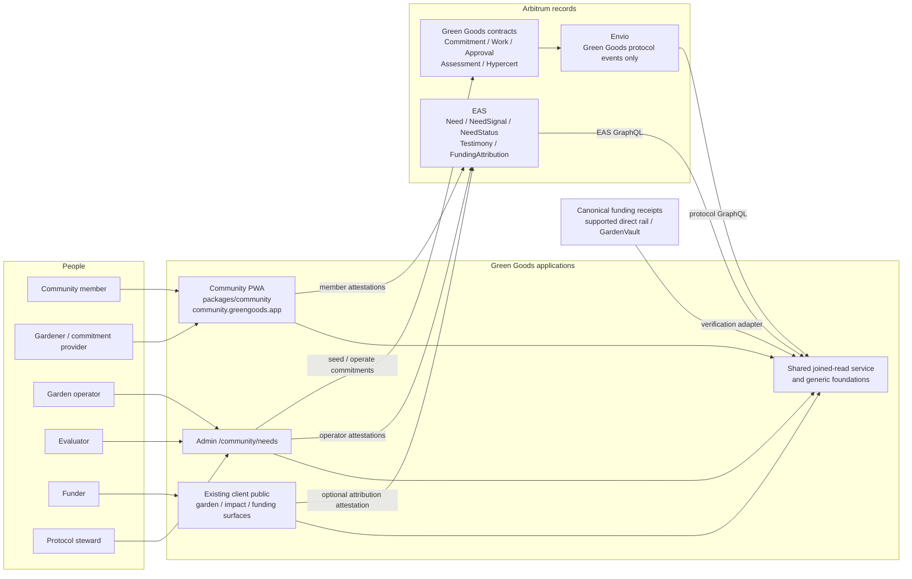

Hard boundary: Envio never indexes EAS or raw funding transfers. EAS does not become a protocol-event index. `@green-goods/shared` owns the explicit EAS + Envio + funding-proof join and exposes one normalized result to every consumer.

## D2. Package placement and prerequisite boundary

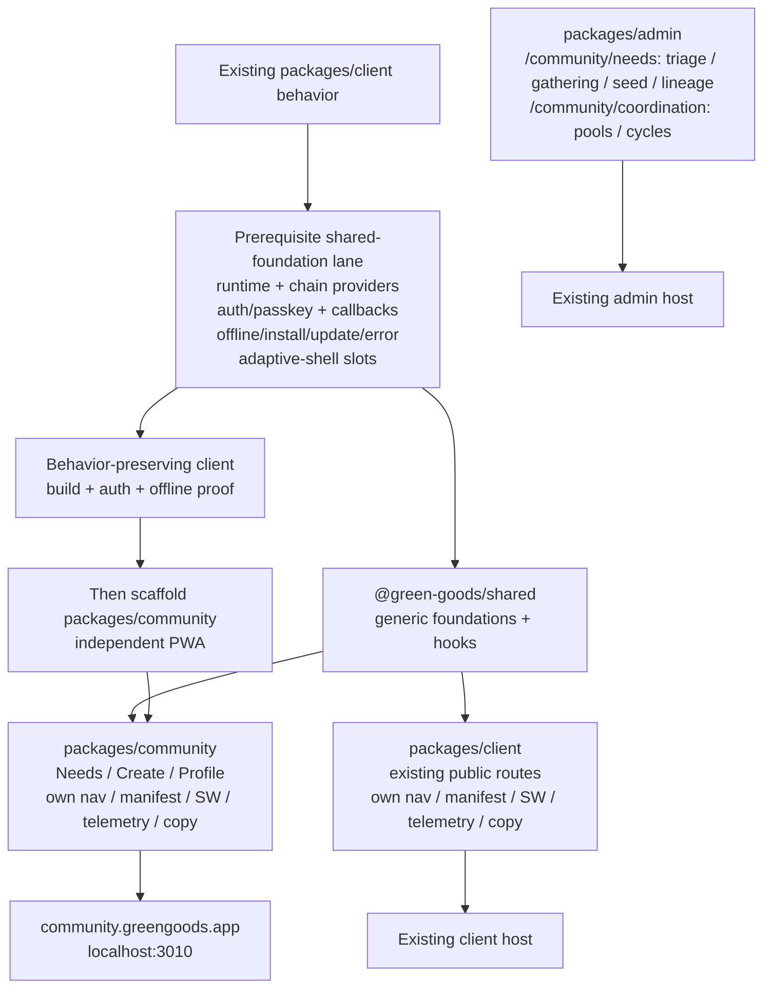

The packages share foundations, not application identity. Their routes, navigation, manifests, service-worker scopes, telemetry identities, and application copy remain separate. Need-specific operator/evaluator work stays in admin `/community/needs`; pool/cycle operations stay in `/community/coordination`; funder discovery stays in the existing client public surfaces.

## D3. EAS + Envio joined-read ERD

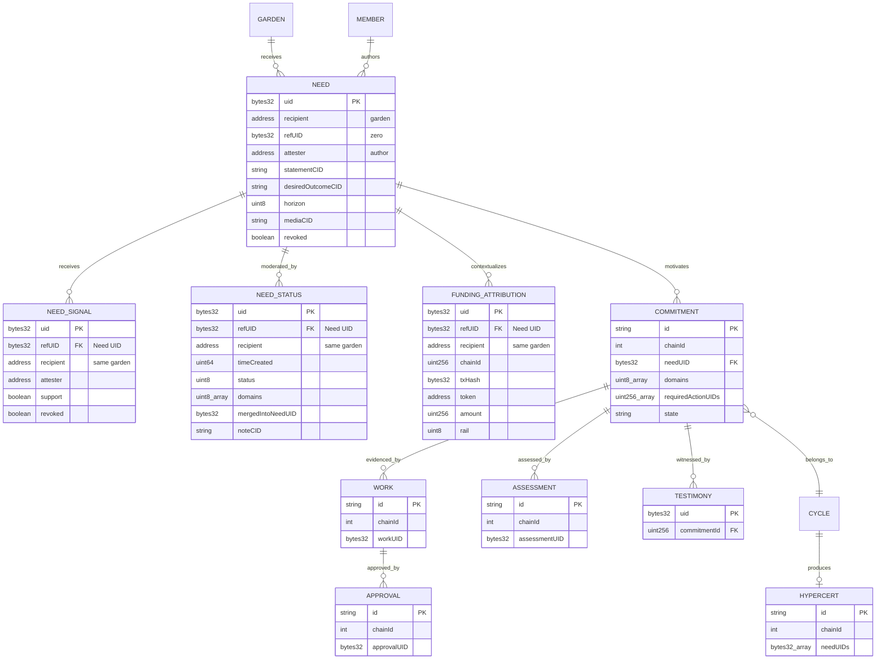

Source ownership:

- EAS GraphQL: Need, NeedSignal, NeedStatus, Testimony, and FundingAttribution.
- Envio: Green Goods Commitment, Work, Approval, Assessment, Cycle, and Hypercert entities, all with `chainId` and composite IDs.
- Shared: envelope normalization, status winner selection, canonical directional-signal winner selection, funding verification/de-duplication, retraction tombstones, progress derivation, source-health states, and the final joined graph.
- DomainImpact commitment arrays are positional: `domains[i]` pairs with `requiredActionUIDs[i]`; UID `0` is valid because array presence expresses binding.

## D3a. EAS envelope relationships and resolver routing

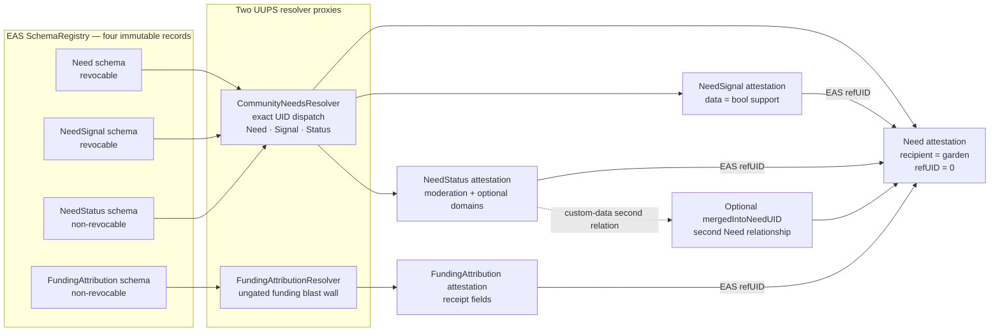

`recipient` is always the garden and `refUID` is the sole parent-Need relationship. Resolvers validate the referenced record's exact Need schema, recipient, revocation, and expiration state because EAS existence alone does not enforce those domain invariants. Parent revocation does not mutate child history; active readers exclude descendants while retaining authorized provenance.

## D4. Moderation axis

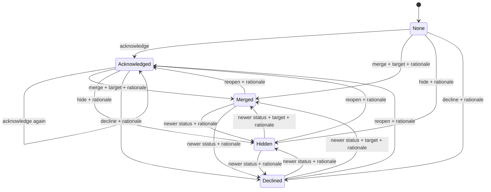

The winning NeedStatus is the greatest tuple `(timeCreated, uid)`, comparing UID as unsigned `bytes32` when timestamps tie. `none` is the absence of a status attestation. The resolver requires a rationale for merge, hide, decline, and any acknowledged status that reopens one of them.

## D5. Progress axis

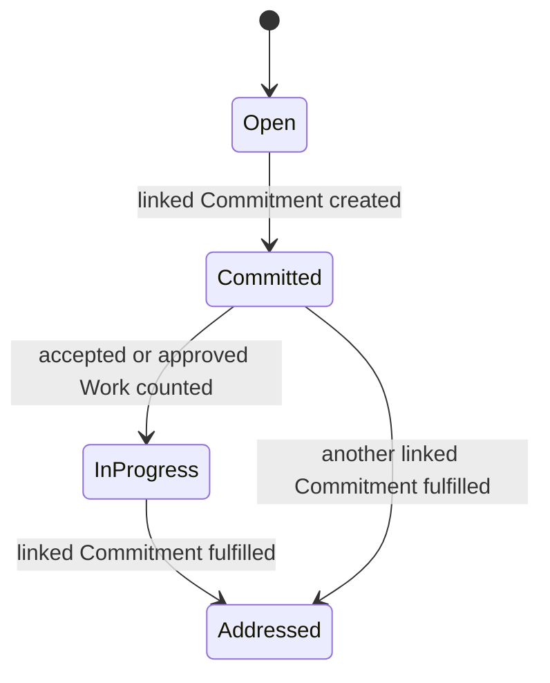

Progress is monotonic and derives from the highest evidence state reached across all linked commitments. It does not reset when moderation changes and it is never inferred from funding.

## D6. Visibility, redirect, and retraction policy

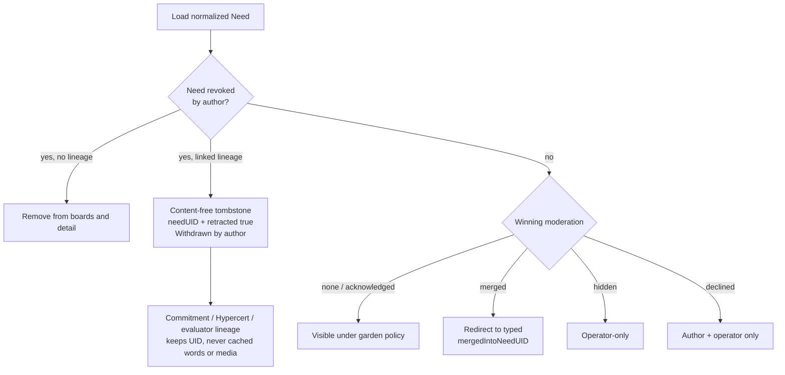

Retraction is not a third lifecycle axis. It is an EAS revocation that suppresses content while preserving immutable references. Moderation does not revoke or erase the Need.

## D7. Need to promise to work to proof

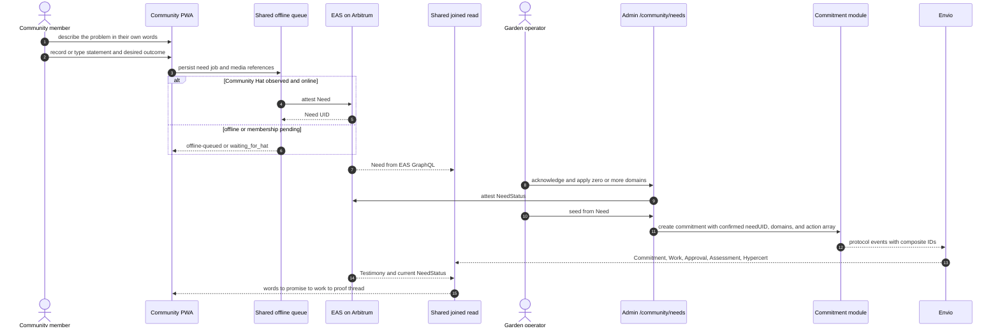

The seeding form may prefill domains, but confirmation defaults come from commitment direction: Request creator/Need author, or the accepted Offer recipient. The accepted provider is excluded and an unreachable threshold blocks acceptance. The operator confirms every commitment field. Community v1 does not expose claiming or work submission.

## D8. Offline and waiting-for-membership sequence

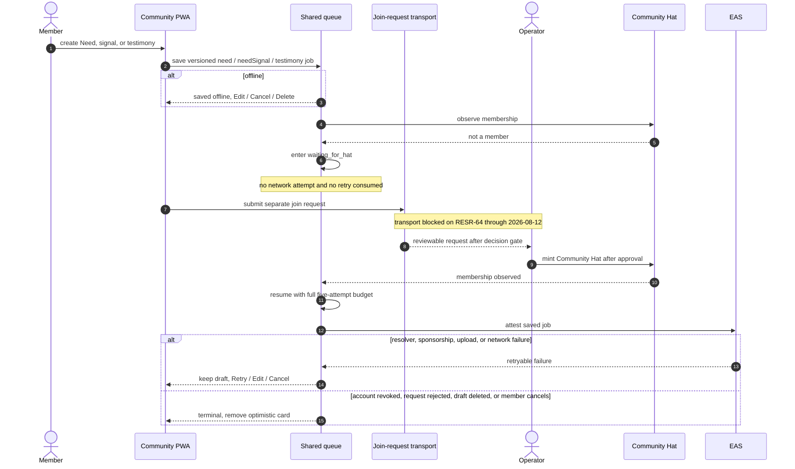

`waiting_for_hat` stores the pending product write, never the join request. Public on-chain requests, Linear-as-queue, and implicit localStorage transport are excluded. NeedStatus and FundingAttribution are online-only actions.

## D9. Operator triage to commitment seeding

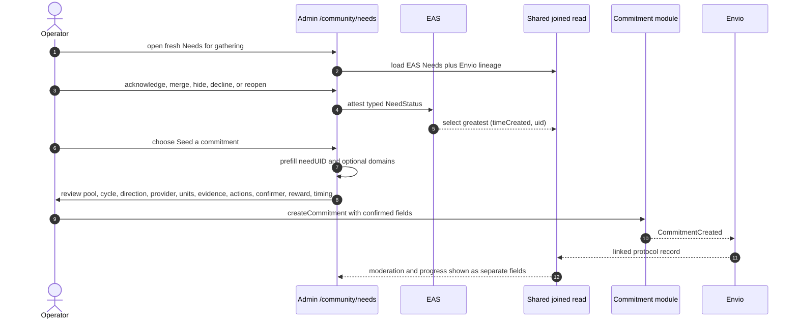

The Need-specific admin action lives under `/community/needs`; pool/cycle operations remain under `/community/coordination`. DomainImpact requires a positional registered action for each selected domain; an empty domains array remains valid for unclassified non-DomainImpact work.

## D10. Funding attribution verification, de-duplication, and recovery

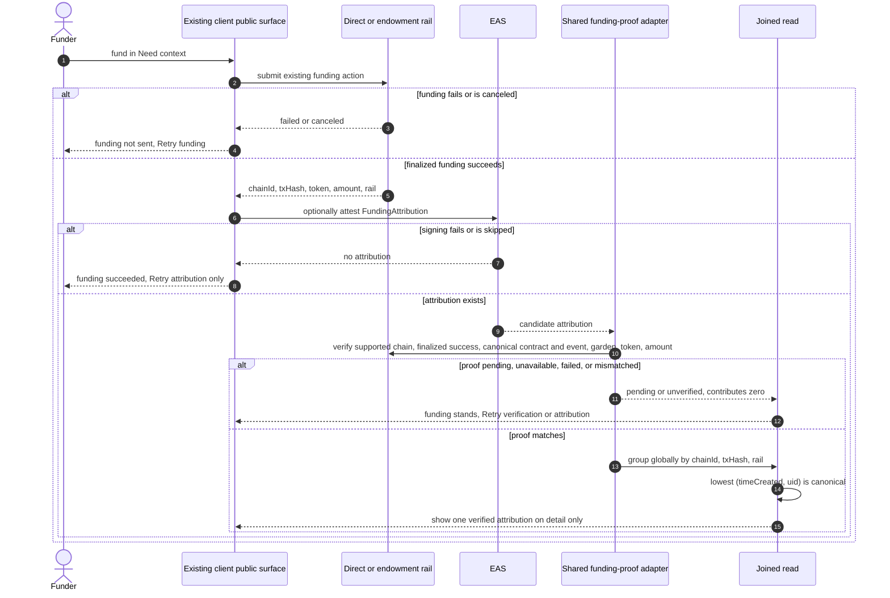

Attribution never replays or controls the funding transaction, never creates per-Need escrow, and never affects board order. The adapter does not infer an account-abstraction actor from `transaction.from`.

## D11. Evaluator joined-read and export sequence

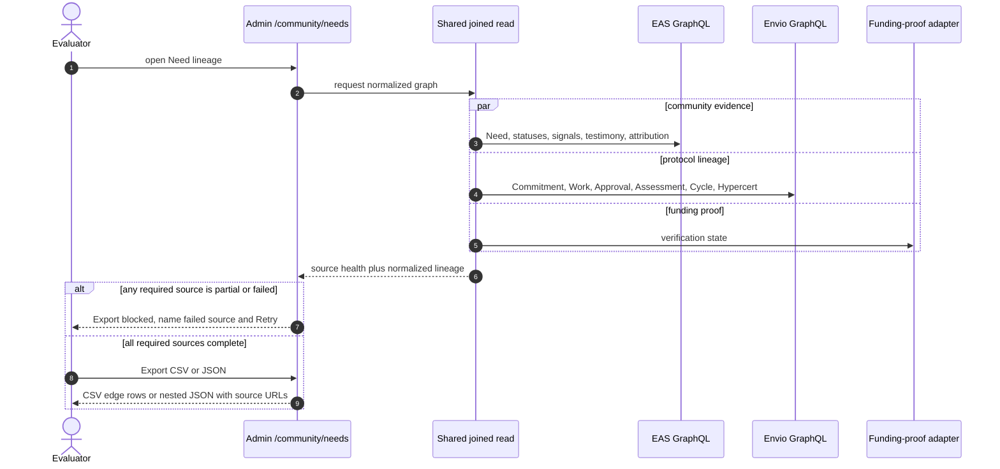

Exports include the exact fields in `spec.md` §11, preserve withdrawn tombstones, and exclude join identities, research contacts, and unauthorized text/media. A source failure never masquerades as an empty dataset.

## D12. Permission and responsibility map

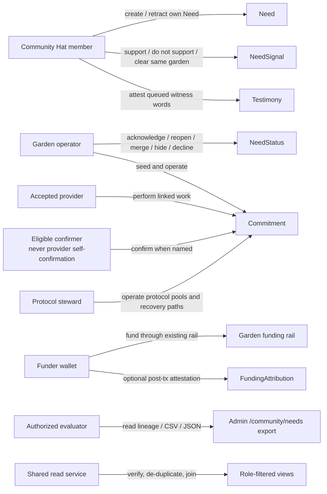

Browse is public under garden visibility rules. Signal, Need, and Testimony require same-garden Community membership. Moderation requires operator authority. FundingAttribution has no Hat gate but counts only after canonical proof verification.

## D13. Cross-surface user-flow map

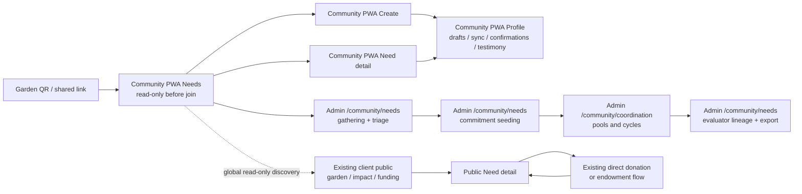

There is no new top-level admin `/pools` route and no assumed new public Need route. The funder-lens workstream must fit discovery into existing client public surfaces unless it records an explicit route amendment.
