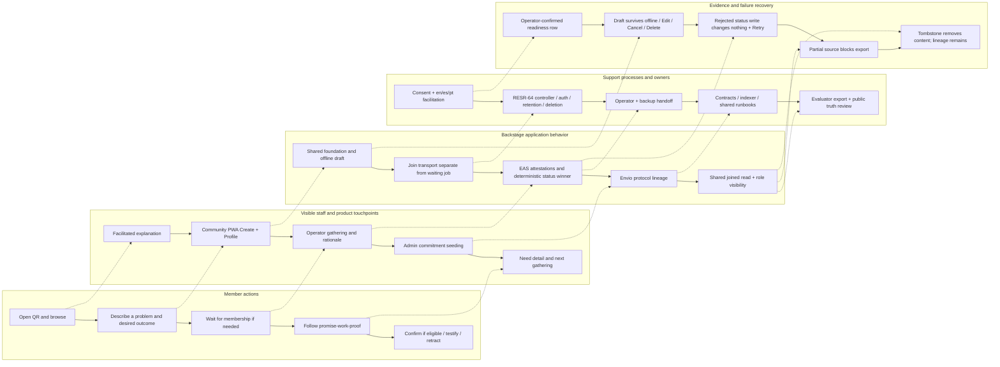
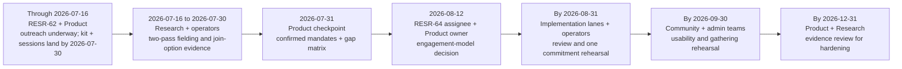

# Community Needs & Signals: Personas, Journeys, and Service Blueprint

**Feature Slug**: `community-interface`  
**Stage**: `active`  
**Updated**: 2026-07-10  
**Purpose**: make discovery, completion, failure, recovery, and handoff testable for every role named in the Community and Commitment Pooling plans.

These journeys describe planned behavior. They are not evidence that the product is built or that a pilot result has been observed. `spec.md` owns the product contract; `research-plan.md` owns the field evidence and dates.

## Persona P1. Kwame — community member and neighbor

- Uses a mid-range Android phone and intermittent data; enters through a garden QR or gathering.
- Wants to describe a problem in his own words and pair it with what better looks like.
- Needs clear waiting, moderation, progress, retraction, and recovery without wallet, attestation, domain, or governance language.
- Uses the Community PWA in en, es, or pt; may rely on audio, captions, large touch targets, and a facilitator.
- Success: “I could say what mattered, and I can see what happened next.”

## Persona P2. Maria — gardener and commitment provider

- Offers time, tools, rides, or knowledge and already captures field work in Green Goods.
- Needs offline-safe drafts, analog capture when appropriate, exact evidence expectations, and no duplicate submission.
- Cannot confirm her own provided work, including through fallback. The Offer recipient or Request creator confirms by default; a named group must remain reachable after provider exclusion.
- May receive G$ on Celo only after Fulfilled commitment terms. Green Goods never bridges G$ to Arbitrum.
- Success: “My promise and work were recorded, the eligible person confirmed it, and settlement status was honest.”

## Persona P3. David — garden operator

- Translates gathering decisions into durable garden records without becoming the author of member words.
- Needs fast triage, optional multi-domain tagging, typed merge targets, reopen rationale, analog capture, commitment seeding, pool operations, and a print-legible gathering view.
- Cannot operate a membership queue until RESR-64 defines controller, auth, encrypted fields, retention, deletion, recovery, abuse controls, cost, and shared-operator handoff.
- Success: “I prepared the gathering, handled each decision with a reason, and seeded the agreed work in one sitting.”

## Persona P4. Dr. Chen — evaluator and methodology collaborator

- Needs baseline-to-delta continuity, source provenance, and a clear distinction between community testimony and evaluation.
- Treats domains as optional arrays and DomainImpact actions as positional, registered pairs; action UID `0` remains valid.
- Needs the same normalized EAS + Envio joined read as every UI and blocks export when a required source is partial.
- Success: “I can trace Need to Commitment, Work, Approval, Assessment, Testimony, and Hypercert without inventing missing context.”

## Persona P5. Amara — funder

- Wants grounded stories and verifiable progress without a competition between gardens.
- Funds through existing direct-donation or endowment rails in client public surfaces; the Need adds context but never directs allocation or creates escrow.
- Needs to distinguish funding success from optional attribution signing and later proof verification.
- Success: “I understand the community context, what changed, and whether my receipt was attributed without being asked to steer the work.”

## Persona P6. Leila — collaborator and protocol steward

- Coordinates shared foundations, protocol-pool operations, operator enablement, public truthfulness, and cross-package sequencing.
- Needs explicit trust boundaries, machine-readable gates, role-separated recovery, and a way to see which source or lane is incomplete.
- Keeps Community identity separate from client, keeps pools/evaluator tools under admin `/community`, and prevents a privacy decision from being smuggled into UI implementation.
- Success: “Each lane can implement from an exact handoff, and no surface claims more than its evidence proves.”

## Journey J1. Member — discover, express, wait, follow, close the loop, and retract

| Stage | Member action | System response | Human support | Failure and recovery | Acceptance evidence |
|---|---|---|---|---|---|
| Discover | Opens garden QR in a public browser | Read-only Needs board loads without install or account; my garden is default | Gardener explains the board in the member’s language | EAS or Envio failure is labeled partial, never empty | Browser fixture for loading/empty/partial/offline-stale |
| Express | Describes the problem; records or types statement and desired outcome | Audio retained, transcript editable, local draft versioned | Facilitator can help without becoming author | Permission/transcription failure falls back to typing or audio-only | Recorder a11y test + en/es/pt flow |
| Review | Checks horizon, media, and similar-Need suggestion | Suggestion is advisory; no domain question | Facilitator reads back the member’s words | Member can Edit, Save and leave, or Delete | Offline draft persistence test |
| Join | Takes first write action and creates/recovers passkey | After successful auth, the product write enters `waiting_for_hat` without consuming retries; the separate join request is sent only through the selected transport once its gate is open | Operator explains controller, retention, cancellation, and wait | Canceled/unavailable passkey retains the action and browsing; failed recovery creates no duplicate account; success returns to the exact deep link. Transport remains blocked until RESR-64; no public-chain, Linear, or implicit localStorage substitute | Passkey cancel/unavailable/recovery/deep-link fixture + signed engagement-model decision due 2026-08-12 |
| Share | Membership is observed | Queue resumes with all five retries and sends Need/Signal/Testimony | Operator can confirm Hat mint in person | Network/resolver/upload failure retains draft with Retry/Edit/Cancel | Queue state and retry-budget tests |
| Moderate | Returns after operator action | Sees moderation and progress as separate labels | Operator gives rationale | Merge redirects; declined is author/operator only; hidden is operator-only; reopen requires new rationale | Role-visibility and deterministic status-order fixtures |
| Follow | Opens Need detail | Sees words → promise → work → proof and eligible actions | Gathering closes the loop | Source health is visible; no source failure masquerades as “nothing happened” | Joined-read integration fixture |
| Close loop | Reviews an eligible confirmation or adds testimony | Direction-aware rules expose confirmation only to an eligible non-provider; testimony remains narrative and may queue offline | Named confirmer or operator explains why an action is or is not available | Provider self-confirmation has no CTA; confirmation failure retains ReadyForConfirmation with Retry; testimony upload failure retains the draft with Retry/Edit/Cancel | Eligibility + provider-exclusion test, confirmation recovery test, and offline testimony fixture |
| Retract | Withdraws own Need | Board card and content disappear; linked lineage shows only withdrawn tombstone | Operator explains immutable references remain | Cached words/media never reappear; protocol records do not mutate | Revocation/tombstone privacy test |

## Journey J2. Gardener or provider — offer, promise, prove, and recover

| Stage | Provider action | System response | Human counterpart | Failure and recovery | Acceptance evidence |
|---|---|---|---|---|---|
| Offer | Creates an Offer in Community or asks operator for analog capture | Need stores member words; analog capture is labeled with the real author/context | Operator preserves authorship and reads back | Offline draft remains editable; no silent operator authorship | Authorship and offline fixtures |
| Commit | Reviews an open or approval-gated commitment outside Community’s v1 write scope | Direction, provider garden, units, evidence, confirmer, reward, and timing are explicit | Operator/steward handles gated acceptance | Declined/superseded requests remain distinct; accepted terms come from stored request | Commitment handoff tests |
| Work | Performs and links required Work | DomainImpact checks positional domain/action pair and provider-garden authorship | Evaluator/operator supports evidence capture | Failed link or upload retains evidence and names retry path | Contract and offline-job targeted tests |
| Approval | Waits for Work approval and assessment | Progress advances only from protocol evidence | Authorized approver/evaluator | Dispute restores pre-dispute state or expires per contract; no invented reconciled state | State-transition tests |
| Confirmation | Reviews who may confirm | Eligible Offer recipient or Request creator/named group sees CTA; provider does not | Counterparty or reachable provider-excluding group | Provider self-confirmation is rejected even through steward fallback | Direction-aware confirmation tests |
| Settlement context | Views settlement in its owning commitment surface, not Community | “Reported” remains distinct from Chainlink Functions oracle-verified; G$ stays on Celo | Operator can explain receipt check | Oracle infrastructure failure leaves Reported and retryable; only the current request callback can verify; no human fallback or garden custody claim | Settlement oracle gate before implementation |

## Journey J3. Operator — research, triage, seed, gather, and hand off

| Stage | Operator action | System response | Decision/evidence | Failure and recovery | Acceptance evidence |
|---|---|---|---|---|---|
| Onboard | Confirms contact, language, consent, gathering, example Need, and commitment candidate | Readiness row separates confirmed, invited, and unavailable | RESR-62 + operator confirmation | Missing fields remain gaps; no inferred readiness | Signed readiness row |
| Prepare | Opens admin `/community` “For the gathering” | Fresh Needs, eligible confirmations, recent changes, print view | Join queue appears only after RESR-64 gate | Partial source names EAS or Envio and keeps known data labeled | Admin source-health fixture |
| Triage | Acknowledges, applies zero or more domains, merges, hides, declines, or reopens | NeedStatus uses typed target/rationale and deterministic winner | The member-authored problem and desired outcome remain intact | Rejected signature/tx failure changes nothing and offers Retry | Resolver + admin mutation tests |
| Convene | Reviews Needs with community | Funding never changes order; status uses plain language | Community agrees what to seed and who can confirm | Private grievances use off-chain private capture, not public record | Gathering rehearsal |
| Seed | Starts from selected Need | `needUID` and optional domains prefill; confirmation defaults to Request creator or accepted Offer recipient; every field requires review | Direction, pool/cycle, provider, units, action pairs, evidence, confirmation, reward, timing | Provider exclusion, invalid action/domain, or unreachable confirmer group blocks acceptance | Admin + contract integration tests |
| Run | Operates pools/cycles and monitors evidence under `/community` | Progress derives from linked protocol events | Envio remains protocol-only | Failed/retry/dispute reasons stay visible | Indexer/shared/admin fixtures |
| Close | Returns status and outcome at gathering | Need thread shows protocol evidence and testimony without scores | Operator is human notification layer | Retraction preserves only tombstone; no cached content | Privacy + comprehension research |
| Handoff | Transfers responsibilities to backup operator | Decision record/runbook names access, incident, deletion, and support ownership | Required for membership transport | No single-device or single-person queue | RESR-64 operating-model rehearsal |

## Journey J4. Evaluator — trace lineage and export complete evidence

| Stage | Evaluator action | System response | Integrity rule | Failure and recovery | Acceptance evidence |
|---|---|---|---|---|---|
| Enter | Opens admin `/community` evaluator view | Role-appropriate read-only workspace | No new public evaluator route | Unauthorized viewer sees no private fields | Admin access test |
| Trace | Selects Need or commitment | Shared join loads EAS community evidence and Envio protocol lineage | Envio never indexes EAS; all protocol IDs are composite | Each failed source is named | Joined-read source-health fixture |
| Interpret | Compares Need, Work, Approval, Assessment, and Testimony | Moderation and progress remain separate; testimony is narrative, never scored | Domains remain arrays; action pairs stay positional | Retracted Need becomes content-free tombstone | Selector and privacy tests |
| Verify funding context | Opens attribution evidence | Only finalized canonical matching receipts count once | Earliest `(timeCreated, uid)` wins duplicate key | Pending/unverified contributes zero | Funding-proof fixtures |
| Export | Chooses CSV or JSON | CSV emits one edge/row; JSON nests; source URLs included | Text/media only when already authorized; no join/research identities | Partial source blocks export with Retry | CSV/JSON snapshot + privacy tests |
| Share | Uses evidence in implementation review | Export states source time and completeness | No claim exceeds verified evidence | Stale export is labeled and regenerated | Review checklist |

## Journey J5. Funder — discover and support without steering

| Stage | Funder action | System response | Guardrail | Failure and recovery | Acceptance evidence |
|---|---|---|---|---|---|
| Discover | Opens existing client garden/impact/funding surface | Sees Need stories under small-community thresholds | No new route assumed; no participant-level data | Empty/partial states are honest | Public route fixture |
| Explore | Filters by garden, domain, progress, horizon, or status | Default order is recency + status | Funding is never a filter, rank, or score | Clear filters returns to full eligible set | Sorting invariant test |
| Understand | Opens detail | Sees Need → promise → work → proof, garden context, cycle, and verified funded-toward line | Community narrative and protocol evidence are labeled | Retracted Need reveals only tombstone when linked | Content/role fixtures |
| Fund | Uses existing direct donation or endowment action | Funding goes to garden; Need is context only | No per-Need escrow or allocation steering | Failed/canceled funding offers Retry funding | Existing rail integration test |
| Attribute | Optionally signs FundingAttribution after confirmed tx | Funding remains successful even if attribution is skipped or fails | No Hat gate; no actor inference from `transaction.from` | Retry attribution never replays funding | Separate funding/attribution state test |
| Verify | Returns after proof adapter check | Matching finalized receipt counts once; duplicate contributes zero | Key is `(needUID, chainId, txHash, rail)` | Pending/unverified contributes zero and offers Check again | Receipt/dedupe fixtures |

## Journey J6. Collaborator or protocol steward — sequence, govern, and communicate

| Stage | Steward action | System response | Boundary | Failure and recovery | Acceptance evidence |
|---|---|---|---|---|---|
| Place | Reviews package map and host contracts | Community remains independent at `community.greengoods.app`:3010 | No client route copy and no premature package scaffold | Placement changes require plan amendment | Architecture review |
| Unblock foundation | Extracts generic runtime/auth/offline/install/update/error/shell primitives in future implementation lane | Client proves behavior before Community starts | Each app retains routes, nav, manifest, SW, telemetry, copy | Client regression blocks Community lane | Shared-foundation handoff GREEN commands |
| Govern data | Reviews EAS, Envio, and funding-proof boundary | Shared owns deterministic join and source health | Envio never indexes EAS/raw transfers | Boundary regression blocks indexer release | Boundary/codegen/replay tests |
| Govern membership | Accepts RESR-64 operating model with decision owner | Membership queue becomes dispatchable only after exact evidence | Product writes in `waiting_for_hat` are not join storage | Failed rehearsal keeps lane blocked | Decision record + abuse/privacy review |
| Operate protocol | Uses admin `/community` pool/evaluator surfaces | Protocol-pool records and garden evidence retain correct roots/recipients | No new top-level `/pools` | Dispute/retry/cancel uses contract plan | Contract/admin handoff proof |
| Communicate | Reviews public copy and research claims | Built, planned, reported, oracle-verified, and evidence-gated labels stay distinct | Pilot targets are not reported results | Docs audit/vocab failure blocks publication | Docs and vocabulary gates |

## Customer and community journey map

| Phase | Member need | Visible touchpoint | Behind-the-scenes evidence | Trust risk | Recovery promise |
|---|---|---|---|---|---|
| Hear | Know why the garden uses this | QR, gathering explanation, public board | Confirmed operator contact and consent path | Login before value; institutional language | Browse without account or install |
| Express | Use own words and preferred mode | Create: problem, voice/text, outcome, horizon | Versioned draft, audio evidence, no forced domain | Lost media; facilitator becomes author | Save/Edit/Delete; transcript fallback |
| Wait | Understand membership and delivery | Profile queue state | Separate join transport + `waiting_for_hat` product job | Hidden PII storage; retries consumed while waiting | Named controller/deletion after gate; zero retries consumed |
| Be heard | See a reasoned moderation result | Need detail + author-only restricted states | Greatest `(timeCreated, uid)` NeedStatus | Hidden/declined feels like deletion | Rationale; typed merge redirect; reopen with rationale |
| See action | Connect community words to protocol work | Promise-work-proof thread | EAS + Envio joined graph | Funding or narrative mistaken for proof | Source labels, partial states, explicit Retry |
| Close loop | Confirm when eligible or add testimony | Profile confirmation / Need detail | Direction-aware eligibility; testimony without score | Provider self-confirmation; testimony treated as rating | No provider CTA; plain reason and alternate eligible confirmer |
| Withdraw | Remove personal words without breaking lineage | No board card; lineage tombstone only | EAS revocation + immutable protocol references | Cached content leaks | Content-free tombstone everywhere |
| Support | Let outsiders help without control | Existing client public funding surfaces | Finalized receipt verification and de-duplication | Ranking, escrow implication, replayed funding | Detail-only totals; separate attribution Retry |

## Operator service blueprint

**Question**: What must happen across people, screens, services, evidence, and recovery for one Need to become a trustworthy commitment?  
**Source**: `spec.md` §§4–14; `research-plan.md`.

Blueprint operating rules:

- The operator is the human notification layer; the gathering is a planned service touchpoint, not a substitute for product state.
- The join controller and incident owner are named only by the RESR-64 decision. No implementation lane may fill those roles by assumption.
- Every handoff has an observable failure response: draft retention, unchanged moderation, blocked export, retryable source, or content-free tombstone.
- Research notes, join identities, wallet addresses, and contact details stay out of analytics, Linear bodies, and evaluator exports.

## Research, onboarding, implementation-review, and rehearsal timeline

Gate semantics:

- T1–T3 produce planning and operator-confirmation evidence, not cohort-success claims.
- T4 alone may unblock membership-queue implementation, and only when controller, processor, auth, encrypted fields, retention/deletion, cancellation/recovery, abuse controls, cost, incident owner, offline replay, and operator handoff are accepted.
- T5 reviews implementation with participating operators and rehearses one end-to-end commitment; where settlement is relevant, it separately rehearses the planned Celo path.
- T6 accepts the independent Community PWA, admin `/community`, joined read, offline recovery, and gathering workflow only with en/es/pt and accessibility evidence.
- T7 decides whether evidence-gated hardening work should advance; it does not auto-promote parked follow-ons.

## Research checkpoints

Each journey remains provisional until observed with the named role. Research must answer:

1. Can members explain the difference between a Need (the problem) and a commitment direction (Request or Offer) without facilitation in en, es, and pt?
2. Can members complete voice/text creation, recover an offline draft, understand `waiting_for_hat`, and find Cancel/Delete?
3. Do operators understand moderation and progress as separate axes, including merge redirect, hidden/declined visibility, reopen rationale, and retraction tombstone?
4. Can one commitment legitimately span multiple domains without losing positional action ownership or evaluation clarity?
5. Which join-request model passes controller, auth, retention, deletion, recovery, abuse, cost, incident, and shared-operator handoff review?
6. Can a backup operator complete a queue handoff without a private spreadsheet, chat-only state, or single device?
7. Can evaluators identify a partial EAS/Envio/funding source and refuse an incomplete CSV/JSON export?
8. Do funders understand that funding succeeded independently of attribution, that totals count verified receipts once, and that funding never ranks or directs the garden?
9. Can providers and confirmers explain why provider self-confirmation is unavailable and identify the eligible confirmer?
10. Does the gathering rehearsal close the loop for members without push notifications or hidden operational work?
