# Community Needs & Signals: Lo-Fi Flow Prototypes (Storyboards, Missing Frames, Action Inventory, Review)

**Feature Slug**: `community-interface`
**Stage**: `active`
**Created**: 2026-07-12
**Companions**: `spec.md` (the product contract these storyboards walk), `wireframes.md` (the frames — referenced by W-id, never re-drawn), `journeys.md` (J1–J6 + personas), `diagrams.md` (D1–D13 flow truth), `research-plan.md`, and cross-hub `../commitment-pooling/{wireframes.md,uiux-spec.md,contract-spec.md,external-brief.md}` for the seed-from-Need seam and the September frames that ride August primitives.
**Fidelity**: deliberately low, matching `wireframes.md` §0 — a storyboard is a screen-by-screen walk of flows the specs already lock; it adds **no design authority**. Where a step lands on a moment no existing frame draws, a minimal micro-frame appears inline marked `NEW — proposed lo-fi, not a locked design` and is indexed in §14 Missing frames for Afo to accept into `wireframes.md` or reject.
**Grounding rule**: every claim carries file:line. Wireframe frames are `W1…W14` (this folder); commitment-pooling frames are `CP-W7`, `CP-W8`, `CP-W4` (that folder independently numbers its own W-ids). This document is a review deliverable: §§1–13 are the walkable storyboards, §14 the missing-frames index, §15 the action inventory (Deliverable B), §16 the coverage matrix, §§17–22 the review findings, verdicts, risks, dependency realism, open questions, and the verified-clean list.
**Copy discipline**: authored placeholder copy uses the mutual-aid register and passes the banned-vocabulary rules (`docs/docs/reference/glossary-community.md` § Banned Vocabulary; the 8 lint-enforced terms in `banned-vocabulary.json:11-20`). Moderation and progress are never collapsed into one score (`spec.md:195`).

## 0. How to read

**Source keys** (same-folder unless pathed): `SPEC` = spec.md · `WF` = wireframes.md · `JN` = journeys.md · `DG` = diagrams.md · `CL` = corrections-log.md · `RP` = research-plan.md · `ST` = status.json · `PT` = plan.todo.md · `CP-CS` / `CP-UX` / `CP-WF` / `CP-XB` / `CP-XC` / `CP-AM` / `CP-PT` = ../commitment-pooling/{contract-spec,uiux-spec,wireframes,external-brief,external-communications,acceptance-matrix,plan.todo}.md. `SPEC:213` means spec.md line 213.

**Per-storyboard anatomy**: a **meta line** (persona = `docs/docs/builders/specs/v1-0.mdx` §3.1 archetype + named research persona `docs/docs/reference/design-research.md` · journey · surfaces · owning spec §) → a **mermaid `flowchart LR`** screen-flow graph (screens as nodes, user actions as edge labels) → a **numbered steps table**: `# | Screen (frame cite) | User action | System response (schema write / job kind) | State (moderation/progress; on-chain vs derived) | If it fails`. A finding surfaced by the walk is tagged **(finding →)** pointing at §17.

**Frame vs micro-frame**: an existing frame is cited by W-id and never re-drawn. A moment with no frame gets an inline micro-frame marked `NEW — proposed lo-fi, not a locked design` and an §14 MF row.

**State-name conventions**: moderation `none / acknowledged / merged / hidden / declined` and progress `open / committed / in-progress / addressed` are the two independent axes (SPEC:197-207); they are never one enum (SPEC:195). Queue states are `offline-queued / waiting_for_hat / retryable / terminal` (SPEC:233; WF:150-156). "On-chain" = an EAS attestation or protocol event; "derived" = computed by the shared joined read (SPEC:213-221).

## Storyboard index

| SB | Journey | Persona(s) | Scenario | Surface(s) |
|---|---|---|---|---|
| SB-1 | Lazy-join by QR → browse → first action waits | Community member (Kwame) | Discover + Join | Community PWA (public browser → installed) |
| SB-2 | Voice-first Need creation — online | Community member (Kwame) / Gardener (Maria) | Express | Community PWA |
| SB-3 | Creation offline → `waiting_for_hat` → resume / recover | Community member (Kwame) | Express + Share | Community PWA |
| SB-4 | Agree / remove agreement (signal) + Explore | Community member (Kwame) | Signal | Community PWA |
| SB-5 | Track a Need across both axes | Community member (Kwame) | Moderate + Follow | Community PWA |
| SB-6 | Add community testimony | Community member (Kwame) | Close loop | Community PWA (rides CP testimony) |
| SB-7 | Named confirmation of a kept promise | Community member (Kwame) + Gardener (Maria) | Close loop | Community PWA (rides CP confirmation) |
| SB-8 | Author retraction → content-free tombstone | Community member (Kwame) | Retract | Community PWA + all lineage |
| SB-9 | Operator triage: acknowledge / merge / hide / decline | Operator (David) | Triage | Admin `/community` |
| SB-10 | "For the gathering" print view | Operator (David) | Prepare + Convene | Admin `/community` |
| SB-11 | Seed a commitment from a Need (cross-hub seam) | Operator (David) | Seed | Admin `/community` → CP pool console |
| SB-12 | Evaluator lineage + export + completeness Retry | Evaluator (Dr. Chen) | Trace + Export | Admin `/community` |
| SB-13 | Funder discovery + FundingAttribution states | Funder (Amara) | Discover + Fund + Attribute | Existing client public surfaces |

Grouping: member SB-1–8 · operator SB-9–11 · evaluator SB-12 · funder SB-13. Every storyboard assumes the shared-foundation gate (SPEC §14) and the August substrate are GREEN unless stated; SB-1/SB-3 carry the pre-membership states.

---

## SB-1 — Lazy-join by QR → browse → first action waits

**Persona**: Community member — v1-0.mdx §3.1 Persona E + Kwame (`design-research.md:160`). **Journey**: J1 Discover + Join (JN:58,61). **Surfaces**: Community PWA, public browser → optional install. **Owning spec**: §7 onboarding (SPEC:245-250), §8 IA (SPEC:251-264).

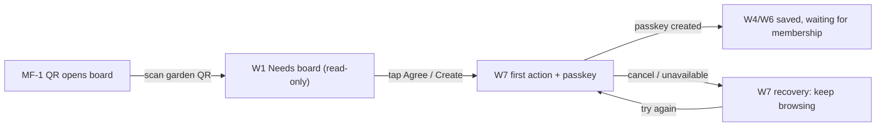

| # | Screen | User action | System response | State | If it fails |
|---|---|---|---|---|---|
| 1 | MF-1 (`NEW`, SPEC:247) | Scans the gardener's QR | Garden's Needs board opens read-only in-browser, no install, no account; my garden is default | — (unauthenticated read) | EAS/Envio partial → W2 labeled partial, never empty (WF:94) |
| 2 | W1 (WF:37-59) | Reads cards; taps `[Explore]` to see other gardens | Board = recency + status, never funding (WF:66); Explore is global read-only, no Agree controls (SPEC:258) | derived board | Offline → W2 offline-stale w/ saved timestamp (WF:84-90) |
| 3 | W1 | Taps `[Agree]` or `＋ Create` (first write) | Routes to first-action gate (SPEC:247) | — | — |
| 4 | W7 (WF:230-244) | `[Continue with passkey]` → one biometric | Counterfactual ERC-4337 smart account (Pimlico, sponsored); returns to the exact deep link (WF:258) | account created | Passkey canceled/unavailable → WF:249 keeps action + browsing; failed recovery makes no 2nd account (WF:258) |
| 5 | W7 | — | Signed join request goes to the selected service queue; product write persists locally | **`waiting_for_hat`** (no retry consumed, SPEC:233) | Implementation remains blocked until RESR-64; no public-chain / Linear / localStorage substitute (SPEC:249) |
| 6 | W4 / W6 (WF:141-144, 203-208) | Sees "Waiting for garden membership. No send attempts have been used." | Optimistic card held; Profile shows the waiting job (WF:208) | `waiting_for_hat` | Cancel/Delete is terminal → remove optimistic card (WF:156) |
| 7 | W6 | (later) operator mints Community Hat | App observes membership; queue resumes with full five-attempt budget (SPEC:233; DG:317-320) | released → sending | Network/resolver/upload fail → retain draft + Retry/Edit (WF:154) |

**(finding →)** The QR-open moment (step 1) has no drawn frame; W1 assumes you are already on the board. → **MF-1**. What "waiting for membership" *feels* like is fully drawn (W4/W6/W7) — the member's own product write waits locally; the join request is a separate service transport whose implementation remains gated until RESR-64 completes its operating record (SPEC:249; DG:314-316).

---

## SB-2 — Voice-first Need creation (online)

**Persona**: Persona E + Kwame (`design-research.md:160`); a Gardener (Maria, Persona A) uses the identical flow for an Offer. **Journey**: J1 Express + Review (JN:59-60). **Surfaces**: Community PWA. **Owning spec**: §5 creation (SPEC:223-234), §3 Need schema (SPEC:43-58).

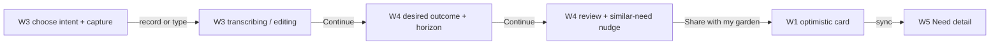

| # | Screen | User action | System response | State | If it fails |
|---|---|---|---|---|---|
| 1 | W3 (WF:101-119) | Describes the problem by voice or text | Creates a kind-free Need draft; Request / Offer is chosen only when a commitment is seeded; no domain question at creation (SPEC:43-58; WF:122) | draft (local) | — |
| 2 | W3 | Taps `● Record` (or types) | States `recording → transcribing → editing`; audio always kept as evidence, transcript editable (SPEC:227; decision #6 SPEC:21) | draft; `transcriptionSource` set | Mic denied → typing fallback (WF:122); transcription fail → audio-only, never blocks (SPEC:231) |
| 3 | W4 (WF:129-147) | Speaks/types the **desired outcome**; picks a horizon chip (week/month/season/years) | Outcome is mandatory (SPEC:54); horizon routes silently (SPEC:228,240) | draft; `desiredOutcomeCID`, `horizon` | Empty outcome blocks Continue (SPEC:143 `DesiredOutcomeRequired`) |
| 4 | W4 | Reviews; sees "Similar in your garden" nudge | Client-side match vs open needs; advisory, never blocks (SPEC:229; WF:158) | draft | — |
| 5 | W4 | `[Share with my garden]` | Enqueues `need` job; optimistic card on W1 (SPEC:233; job kind `need`) | Progress **open**, moderation **none** (derived) | Offline → SB-3; `waiting_for_hat` if no Hat yet → SB-3 |
| 6 | W1 → W5 | Card syncs; opens detail | `need` attest → Need UID; recipient = garden account (SPEC:41); joined read renders detail | on-chain Need; moderation **none**, progress **open** | Resolver/sponsorship fail → retain draft + Retry (WF:154) |

**(finding →)** Local-first transcription (Web Speech) has "es/pt offline not guaranteed" and a TAS-Android feasibility spike is *inside* the shared workstream (SPEC:231) — the flow degrades safely (audio-only) but the offline-transcription coverage for es/pt is an open field-evidence item, not a drawn state. Comprehension of problem/desired-outcome language and Request/Offer as commitment direction in es/pt remains research checkpoint #1 (JN:214). This validates comprehension and translation without reopening the locked layer boundary (**→ P2-2; P2-3 closed**).

---

## SB-3 — Creation offline → `waiting_for_hat` → resume / recover

**Persona**: Persona E + Kwame. **Journey**: J1 Express + Join + Share (JN:59,61-62). **Surfaces**: Community PWA. **Owning spec**: §5 queue behavior (SPEC:233), §7 (SPEC:245-250), D8 (DG:292-329).

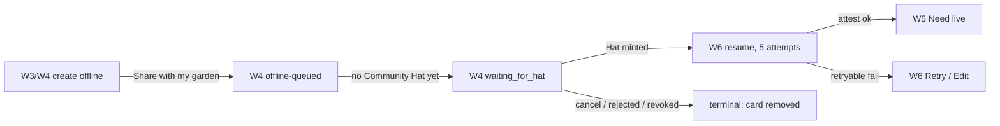

| # | Screen | User action | System response | State | If it fails |
|---|---|---|---|---|---|
| 1 | W4 (WF:141-156) | Shares while offline | `need` job saved on device; "Saved on this device. It will send when you are online." (WF:152) | **offline-queued** | Draft + media retained; Edit/Cancel/Delete (WF:144) |
| 2 | W4 | (comes online, still no Hat) | Membership observed = not a member → enters wait; "Waiting for garden membership. Your five send attempts remain." (WF:153) | **`waiting_for_hat`**, no retry consumed (SPEC:233; DG:312-313) | — |
| 3 | W6 (WF:206-211) | Checks Profile "Saved and sending" | Lists Need/Signal/Testimony jobs with per-state chips (WF:208-210) | mixed queue states | Upload-failed row → `[Retry]` (WF:210) |
| 4 | W6 | Operator mints Community Hat | Queue resumes with **full five-attempt budget** (SPEC:233; DG:319) | released → attesting | Resolver/network/upload/sponsorship fail → keep draft, Retry/Edit/Cancel (DG:321-323) |
| 5 | W1/W5 | — | `need` attest succeeds; optimistic card promotes | on-chain Need | — |
| 6 | W4/W6 | (alt) account revoked / join rejected / draft deleted / user cancels | Terminal: optimistic card removed, next safe action explained (WF:156; DG:324-326) | **terminal** | no restore promise |

**(finding →)** `waiting_for_hat` is a *net-new* queue mechanism: the current job queue has exactly two kinds (`work`/`approval`, `job-queue.ts:89-92`), `MAX_RETRIES=5` with exponential backoff, no `waiting_*` state and no tombstone precedent (`modules/job-queue/index.ts:88,201-203,277-283`). "Consumes no retry while waiting, then full five-attempt budget after the Hat" is new state-machine surface with no code analog — the state-api lane builds it from zero (**→ P1-2 parity, and the offline-model verdict §18**).

---

## SB-4 — Agree / remove agreement (signal) + Explore

**Persona**: Persona E + Kwame. **Journey**: J1 (signal is the lightweight write). **Surfaces**: Community PWA. **Owning spec**: §6 signal + horizon (SPEC:235-244), §8 Explore (SPEC:258), D12 (DG:435-437).

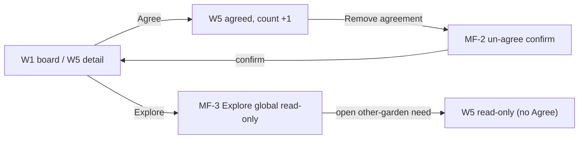

| # | Screen | User action | System response | State | If it fails |
|---|---|---|---|---|---|
| 1 | W1 (WF:49-51) | Taps `[Agree]` on a same-garden card ("8 neighbors agree") | Enqueues `needSignal` job; `refUID` = needUID (SPEC:60,237); Agree active only for this garden's Community Hat wearers | signal counted (distinct attesters, SPEC:237) | Offline → queued; no Hat → `waiting_for_hat` (SPEC:233) |
| 2 | W5 (WF:188) | Sees the agree reflected | Count = distinct active attesters (SPEC:144) | derived count | — |
| 3 | MF-2 (`NEW`, SPEC:60) | Taps "Remove my agreement" | Revokes the `NeedSignal` (attester-only self un-signal, SPEC:29 sub-a); count −1 | un-signalled | Offline → queued revoke |
| 4 | W1 | Taps `[Explore]` | MF-3 global read-only board; **no Agree controls anywhere** (SPEC:258; WF:64) | read-only | Partial source labeled (WF:84-90) |
| 5 | MF-3 (`NEW`, SPEC:258) | Opens another garden's need | W5 renders read-only; Agree hidden (same-garden gate, brigading guard SPEC:22,317) | read-only detail | — |

**(finding →)** Two frameless moments: the **un-agree control + confirm** (§6 says signal is "revocable to un-signal" but W1/W5 draw only `[Agree]`, no agreed/undo state) → **MF-2**; the **Explore screen** (§8:258 names the view; W1 has an `[Explore]` button but no Explore frame) → **MF-3**. Also the user-facing verb is **"Agree"** (WF:49,51,188), not "Signal" — the schema is `NeedSignal`; the i18n family and action inventory must fix the user vocabulary consistently (**→ P2-8**). Week-horizon needs route straight to the operator triage queue as an alert (no accumulation gate); month+ accumulate toward the cycle-2 seeding gate (SPEC:240-241) — a member never sees "signals needed to unlock", the routing is silent.

---

## SB-5 — Track a Need across both axes

**Persona**: Persona E + Kwame. **Journey**: J1 Moderate + Follow (JN:63-64). **Surfaces**: Community PWA. **Owning spec**: §4 axes (SPEC:193-222), §11 lineage (SPEC:288-294), D4/D5/D6/D7.

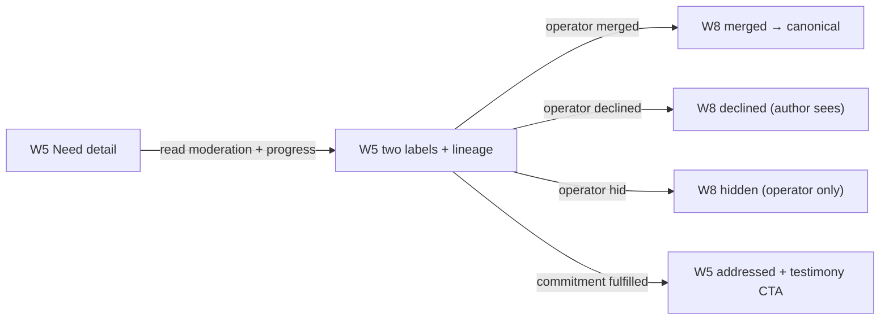

| # | Screen | User action | System response | State | If it fails |
|---|---|---|---|---|---|
| 1 | W5 (WF:166-189) | Opens their Need | Renders **Moderation: Acknowledged** and **Progress: In progress** as two separate labels, never one score (SPEC:195; WF:169-170) | moderation + progress (derived) | Source health visible; no failure masquerades as "nothing happened" (JN:64) |
| 2 | W5 | Reads "What followed" | Lineage: acknowledged → promise (commitment via needUID) → work → assessment → fulfillment + testimony (WF:177-182; DG:255-288) | derived from EAS+Envio join | Partial source labeled, not empty (SPEC:219) |
| 3 | W8 (WF:268-272) | (operator merged the Need) | "This Need was combined with a clearer record. `[Open canonical Need]`" — redirect to `mergedIntoNeedUID` (SPEC:201; WF:270) | moderation **merged** | — |
| 4 | W8 (WF:268-273) | (operator declined) | Author + operators only: "Not included on the board. Operator rationale: …" (SPEC:209; WF:270-273) | moderation **declined** | declined has no public card (WF:284) |
| 5 | W5 (WF:184-186) | Reads "Funding context" | "120 G$ funding attribution verified. Funding supports the garden; it is not escrow" — detail only, never board rank (SPEC:280; WF:186) | derived, verified attribution | This is FundingAttribution, never settlement reward (WF:192) |
| 6 | W5 | (commitment fulfilled) | Progress reaches **addressed**; `[Add testimony]` available (SPEC:207; → SB-6) | progress **addressed** | monotonic; moderation change never resets progress (DG:236) |

**(finding →)** The dignity property is drawn: a member reads moderation and progress separately, and a declined/hidden result shows a *reason*, never a silent delete — a member "must never read moderation as judgment of worth" is satisfied because progress is a parallel, non-moral axis (SPEC:195,209; JN:132). Author visibility of declined (author+operator) and hidden (operator-only) is explicit (WF:284).

---

## SB-6 — Add community testimony

**Persona**: Persona E + Kwame. **Journey**: J1 Close loop (JN:65). **Surfaces**: Community PWA. **Owning spec**: §11 testimony (SPEC:292), §5 offline kind (SPEC:233), D3 (DG:181-184).

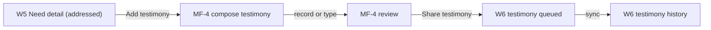

| # | Screen | User action | System response | State | If it fails |
|---|---|---|---|---|---|
| 1 | W5 (WF:188) | Taps `[Add testimony]` (any Community Hat wearer of this garden) | Opens compose (SPEC:259) | — | Not a member → SB-1 join |
| 2 | MF-4 (`NEW`, SPEC:233,292) | Records or types witness words | Testimony is offline-queueable witness evidence, keyed by `commitmentId` — rides the commitment-pooling testimony schema (DG:181-184; SPEC:292) | draft `testimony` job | Voice handling per §5 (audio kept, transcript optional) |
| 3 | MF-4 | Reviews and shares | Enqueues `testimony`; may enter `waiting_for_hat` (SPEC:233) | queued / `waiting_for_hat` | Upload fail → Retry/Edit/Cancel (JN:65) |
| 4 | W6 (WF:217-218) | Sees it under "Your activity → testimony" | Testimony history in Profile (SPEC:261) | on-chain testimony | — |

**(finding →)** The testimony **compose step has no frame** — W5 has the CTA, W6 the history, but the record/review moment is undrawn → **MF-4**. Testimony rides the **CP** testimony schema (keyed by `commitmentId`, DG:183), not a Need-owned schema, and "never gates payout" (SPEC:292). It is a **September-realized** surface: CP decision #34g (`CP-PT:83`) says testimony is September-only and *external copy must not imply August testimony* — yet `CP-XB:73` scopes the Sept app as "(view, signal, confirm)", omitting "testify" (**→ P1-5**).

---

## SB-7 — Named confirmation of a kept promise

**Persona**: Persona E + Kwame confirms; a Gardener (Maria, Persona A) is the provider who cannot self-confirm. **Journey**: J1 Close loop / J2 Confirmation (JN:65,76). **Surfaces**: Community PWA (rides CP confirmation). **Owning spec**: §8 confirm (SPEC:259), §6 direction-aware default (SPEC:241).

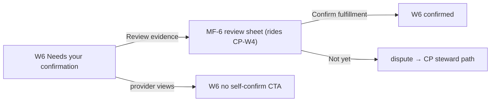

| # | Screen | User action | System response | State | If it fails |
|---|---|---|---|---|---|
| 1 | W6 (WF:212-215) | Sees "Needs your confirmation — you are the eligible Request creator" | Eligibility = direction-aware: Request → creator/author; Offer → accepted recipient (SPEC:241; WF:214) | commitment **ReadyForConfirmation** (CP) | Not eligible → "Confirmation must come from the named eligible member or group", no disabled action implying future eligibility (WF:222) |
| 2 | MF-6 (`NEW`, SPEC:259; rides CP-W4 at CP-WF:207-221) | `[Review evidence]` | Confirm sheet names the direction rule + "Provider cannot confirm this delivery" | — | — |
| 3 | W6 | `[Confirm fulfillment]` | `confirmation` job → CP `ConfirmationRecorded` → `CommitmentFulfilled` (rides CP primitive) | commitment **Fulfilled** | Confirmation fail → retain ReadyForConfirmation + Retry (JN:65) |
| 4 | W6 | (provider Maria opens) | **No confirm CTA** — provider self-confirmation has no control, including steward fallback (SPEC:259; JN:76; DG:441) | — | — |

**(finding →)** The confirmation **review+confirm sheet** is a CP frame (CP-W4); the community-side detail is undrawn → **MF-6**. This SB is in-scope for the September app because confirmation is a first-class Profile surface (SPEC:259,263) even though the confirmation *mechanic* is August (`CP-XB:22`) — the community app *surfaces* an August primitive, matching the sibling's C1 action (`CP prototypes.md:653`). Confirmation appears in `CP-XB:73`'s Sept scope ("confirm"), consistent.

---

## SB-8 — Author retraction → content-free tombstone

**Persona**: Persona E + Kwame. **Journey**: J1 Retract (JN:66). **Surfaces**: Community PWA + all lineage. **Owning spec**: §4 retraction (SPEC:211), D6 (DG:238-254).

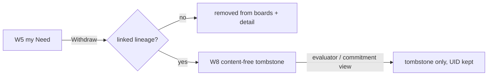

| # | Screen | User action | System response | State | If it fails |
|---|---|---|---|---|---|
| 1 | W5 | Withdraws own Need | EAS revocation (attester-only, SPEC:29 sub-a); words/media/signal controls/board card removed everywhere (SPEC:211) | revoked | Offline → queued revoke |
| 2 | W8 (WF:276-281) | (if a commitment/Hypercert/assessment/funding/export already references the UID) | Joined reader emits only `{needUID, retracted:true, label:"Withdrawn by author"}`; never cached content (SPEC:211; DG:244) | **retracted** tombstone | cached content never reappears (JN:66) |
| 3 | — | — | Retraction does not mutate linked protocol records; lineage keeps the UID (SPEC:211; DG:250) | immutable lineage intact | — |

**(finding →)** What retraction *promises vs delivers* is consistent: the copy promises "Words and media removed. Linked evidence remains." (WF:280) and the mechanism delivers exactly that content-free tombstone (SPEC:211; D6). No restore promise is made (WF:456). Retraction is not a third lifecycle axis — it is an EAS revocation that suppresses content while preserving references (DG:253).

---

## SB-9 — Operator triage: acknowledge / merge / hide / decline

**Persona**: Operator — v1-0.mdx §3.1 Persona B + David (`design-research.md:118`). **Journey**: J3 Triage (JN:85). **Surfaces**: Admin `/community`. **Owning spec**: §9 (SPEC:265-273), D9 (DG:331-357), D4.

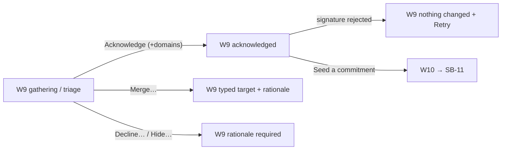

| # | Screen | User action | System response | State | If it fails |
|---|---|---|---|---|---|
| 1 | W9 (WF:292-308) | Opens "For the gathering"; week-horizon items grouped first (no countdown language, SPEC:267) | Loads EAS Needs + Envio lineage via shared join (DG:344) | derived; source health shown | Partial source names EAS/Envio, keeps known data labeled (JN:84) |
| 2 | W9 | `[Acknowledge]`, adds 0–4 unique domains | `NeedStatus` status 1 + domains (online write, SPEC:267; SPEC:81) | moderation **acknowledged** | Rejected signature: "Nothing changed. [Try again][Edit]" (WF:303) |
| 3 | W9 | `[Merge…]` → typed same-garden canonical picker + rationale | `NeedStatus` status 2 + `mergedIntoNeedUID` + `noteCID` (SPEC:82-83; WF:311) | moderation **merged** | tx failure → nothing changed + Retry (SPEC:267) |
| 4 | W9 | `[Decline…]` / `[Hide…]` with rationale | status 4 / 3 + required `noteCID` (SPEC:83) | **declined** / **hidden** | stale read → refetch (SPEC:267) |
| 5 | W9 | (reopen a merged/hidden/declined) | Later acknowledged status + **mandatory** rationale (SPEC:83,200; WF:284; DG:212-214) | reopened → **acknowledged** | winner = greatest `(timeCreated, uid)` (SPEC:71; DG:223) |
| 6 | W9 | `[Seed a commitment]` on an acknowledged Offer | → SB-11 (W10) | — | — |

**(finding →)** Merge-with-visible-rationale and hide/decline are fully drawn with typed targets and required `noteCID` (WF:311). Private-lane intake — grievances naming individuals — is a documented operator practice + a "capture privately" affordance that stores nothing on-chain (SPEC:268); it has **no drawn frame** (it is deliberately off-product), so it is accounted-for, not an MF. Operator burden note: acknowledge is 1–2 taps; merge is pick-target + rationale (3–4 steps) — within the 2–4 hr/week volunteer budget for a normal gathering, but see §19 risk on triage volume.

---

## SB-10 — "For the gathering" print view

**Persona**: Persona B + David. **Journey**: J3 Prepare + Convene (JN:84,86). **Surfaces**: Admin `/community`. **Owning spec**: §9 gathering (SPEC:272).

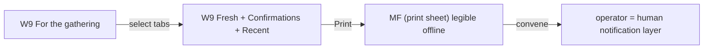

| # | Screen | User action | System response | State | If it fails |
|---|---|---|---|---|---|
| 1 | W9 (WF:293-294) | Selects `[Fresh Needs][Confirmations][Recent changes]` | Assembles pending confirmations + recent status changes + fresh needs (SPEC:272) | derived snapshot | Partial source labeled (JN:84) |
| 2 | W9 | `[Print]` | Print-legible layout; "the operator is the human notification layer" (SPEC:272) | static print | Must be legible offline (WF:17) |
| 3 | — | Runs the physical gathering | The gathering is the loop, not push notifications (SPEC:272; risk "notification gap" SPEC:320) | — | — |

**(finding →)** The **print sheet itself is not separately drawn** — W9 names a `[Print]` control but the print layout (what the printed page looks like, legible offline, no color-only state) is not a frame. Low-severity: the print content = the three tabs' content, so it is accounted-for rather than a hard MF; flagged in §14 as a candidate print-layout frame for QA. Accessibility: status never color-only (WF:466) matters doubly in print.

---

## SB-11 — Seed a commitment from a Need (cross-hub seam)

**Persona**: Persona B + David. **Journey**: J3 Seed (JN:87), D9 (DG:348-354), D7. **Surfaces**: Admin `/community` → CP pool console. **Owning spec**: §9 seeding (SPEC:269), §11 linkage (SPEC:290-291); CP `needUID` amendment (`CP-CS:306,341,402`).

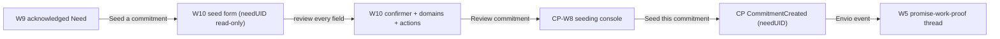

| # | Screen | User action | System response | State | If it fails |
|---|---|---|---|---|---|
| 1 | W9 (WF:307) | `[Seed a commitment]` | Opens the from-Need form (SPEC:269) | — | — |
| 2 | W10 (WF:319-337) | Sees `Need UID [0x91…] linked, read-only`; pool/cycle/direction/provider/units | needUID prefilled + optional domains copied as **prefill only**; final scope confirmed here (SPEC:269,291; WF:323) | draft commitment | "Suggestions are not saved until you review every field" (WF:335) |
| 3 | W10 | Sets confirmer rule | Request → creator/author default; Offer → accepted recipient; provider excluded; unreachable-threshold error before acceptance (SPEC:241; WF:340) | — | provider-exclusion makes threshold unreachable → blocks acceptance (SPEC:241) |
| 4 | W10 | Sets domains + required actions | DomainImpact pairs each domain with one registered action UID; UID 0 valid (SPEC:291; WF:340) | — | invalid action/domain blocks (JN:87) |
| 5 | W10 → CP-W8 | `[Review commitment]` → CP operator seeding console (`CP-WF:323`, `/garden/pool/seed`) | Hands off to the CP module | — | — |
| 6 | CP-W8 (CP-WF:328-349) | `[Seed this commitment]` | `createCommitment` carrying `bytes32 needUID` (0=none) → `CommitmentCreated` (CP-CS:306,402); non-transferable register | commitment **Offered/Requested** (on-chain) | after 5 retries: Failed + retry/discard (CP-UX) |
| 7 | Envio → W5 | — | `CommitmentCreated` indexed → `NeedCommitmentIndex` (id `${chainId}-${lowercaseNeedUID}`, SPEC:216; `CP-CS:1409`); Need progress → **committed** | progress **committed** (derived) | UID 0 creates no index row (`CP-CS:1434`) |

**(finding →)** This is the **cross-hub seam**: the CI side owns W10 (the from-Need seed form); the **arrival into the CP pool console (CP-W8) has no frame on the seam** — how the `needUID` prefill lands in CP-W8 is undrawn on both sides → **MF-9**. The seam is contractually sound: `needUID` is an additive `bytes32` on the commitment record/event that the module stores as-is and never reads EAS for (`CP-CS:306,341,402`), and the reverse lookup is Envio's protocol-event-only `NeedCommitmentIndex` (SPEC:216,221) — Envio never indexes EAS (SPEC:213; DG:74). needUID semantics are consistent CI↔CP (**verified-clean §22**), except the stale line cite at `credit-spec.md:120` (**→ P2-6**).

---

## SB-12 — Evaluator lineage + export + completeness Retry

**Persona**: Evaluator — v1-0.mdx §3.1 Persona C + Dr. Chen (`design-research.md:132`). **Journey**: J4 (JN:96-100). **Surfaces**: Admin `/community`. **Owning spec**: §11 export (SPEC:293), D11 (DG:399-429).

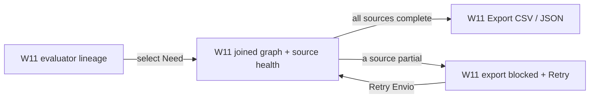

| # | Screen | User action | System response | State | If it fails |
|---|---|---|---|---|---|
| 1 | W11 (WF:348-360) | Opens a Need's lineage | Shared join loads EAS community evidence + Envio protocol lineage in parallel (DG:413-419) | derived graph | each failed source named (JN:97) |
| 2 | W11 | Reads nodes: source, UID/composite ID, state, timestamp | Moderation + progress separate; testimony narrative, never scored (SPEC:293; JN:98) | read-only | retracted Need → content-free tombstone (WF:369) |
| 3 | W11 (WF:357-359) | Checks "Source health: ✓ EAS ✓ Envio ✓ Funding proof" | All complete → export enabled | complete | — |
| 4 | W11 (WF:362-366) | (Envio partial) | **Export blocked**: "so evidence is not mistaken for complete. `[Retry Envio]`" (SPEC:293; WF:364) | **partial-source, export blocked** | Retry the named source (WF:460) |
| 5 | W11 | `[Export CSV]` / `[Export JSON]` | CSV = one lineage edge/row; JSON nests; source URLs included; CIDs only if viewer has access; wallets/join identities/research contacts **never** export (SPEC:293; WF:369) | export produced | stale export labeled + regenerated (JN:101) |

**(finding →)** The completeness gate is the key evaluator dignity control: a **partial source blocks the export with an explicit Retry rather than emitting incomplete evidence** (SPEC:293; WF:364) — this is drawn and consistent across W11, D11, and J4. The named RED target `CommunityEvaluatorExport.test.tsx` carries a filename-stability contract with the RESR-58 S10/S11 mapping (claude-ui-admin handoff) — do not rename without updating the mapping.

---

## SB-13 — Funder discovery + FundingAttribution states

**Persona**: Funder — v1-0.mdx §3.1 Persona D + Amara (`design-research.md:146`). **Journey**: J5 (JN:107-112). **Surfaces**: **existing client public surfaces** (no new app, no new route). **Owning spec**: §10 (SPEC:274-287), D10 (DG:359-397).

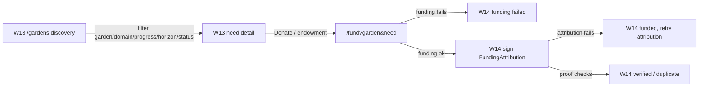

| # | Screen | User action | System response | State | If it fails |
|---|---|---|---|---|---|
| 1 | W13 (WF:399-407) | Browses `/gardens`; filters garden/domain/progress/horizon/status; order = Recent activity | Discovery lives in existing client public surfaces; **funding never a filter/sort/rank** (SPEC:279; WF:417) | public read | empty/partial honest (JN:107) |
| 2 | W13 (WF:409-413) | Opens need detail; sees "Funding attribution verified: 120 G$" + `[Donate][Support through an endowment]` | Funded-toward line = sum of **verified** attributions, detail-only (SPEC:280) | derived | — |
| 3 | `/fund?garden=&need=` (SPEC:278) | Funds via existing direct-donation or endowment rail | Funding goes to the garden; Need is context; no per-Need escrow (SPEC:281; WF:413) | funding tx | Failed/canceled → "Funding was not sent. No attribution was created. [Try funding again]" (WF:426-429) |
| 4 | W14 (WF:425-431) | (funding ok) signs `FundingAttribution` | App composes attestation post-tx for the funder to sign; skipping never blocks funding (SPEC:281) | attribution pending | Attribution fails → "Your funding was confirmed… Do not send funds again. [Retry attribution]" (WF:429-430) |
| 5 | W14 (WF:433-438) | Returns after proof adapter | rail 0: strict funding-intent receipt tuple; rail 1: ERC-4626 `Deposit` with `owner==attester` (SPEC:282-283); pending/unverified contributes zero (SPEC:284) | **pending / unverified / verified** | never infer actor from `transaction.from` (SPEC:282-283) |
| 6 | W14 (WF:433-438) | (duplicate receipt) | "This receipt is already counted through the earliest valid attribution. No total changed." (WF:435-437) | **verified duplicate → contributes zero** | — |

**(finding → P0-1)** The de-duplication key is stated **three ways in conflict**. Spec §10 is authoritative: group by `(chainId, txHash, rail)` **across all Needs**, "every later duplicate, **including one pointing to another needUID**, contributes zero" (SPEC:285), and locked sub-decision (c) says "once globally per `(chainId, txHash, rail)`" (SPEC:29). But **W14:442** ("De-duplication uses `(needUID, chainId, txHash, rail)`"), **JN:112** ("Key is `(needUID, chainId, txHash, rail)`"), and **DG:389** ("group by needUID, chainId, txHash, rail") all put `needUID` in the key. Including `needUID` **defeats the global dedup**: the same receipt attributed to Need A and again to Need B produces two distinct keys, so both count — exactly the abuse SPEC:285 forbids. Three implementer-facing artifacts encode a locked-decision violation. Fix: W14:442, JN:112, DG:389 → `(chainId, txHash, rail)`.

---

## Journey overview graphs (one screen-flow per journey)

These are coarse-grain composites; the per-SB graphs above are the fine grain.

### J1 — Community member (Kwame)

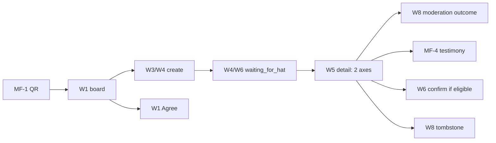

### J3 — Garden operator (David)

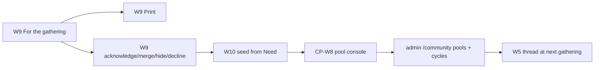

### J4 — Evaluator (Dr. Chen)

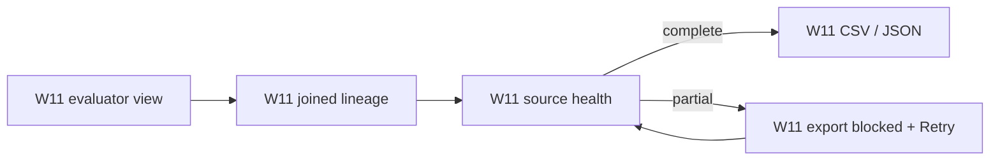

### J5 — Funder (Amara)

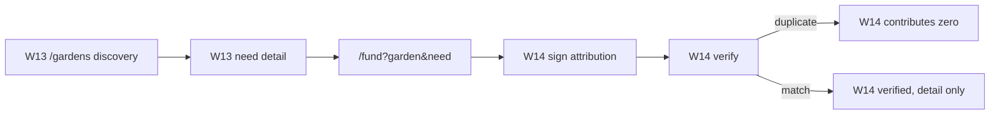

---

## 14. Missing frames (MF index — candidate additions to `wireframes.md`, decided by Afo)

Every micro-frame above is a **proposal, not a locked design**. Each row is a moment the required-coverage flows hit that no W1–W14 frame draws.

| MF | Moment with no existing frame | Owning SB | Why it matters | Authority for the moment |
|---|---|---|---|---|
| MF-1 | QR scan → read-only board opens (pre-account, pre-install) | SB-1.1 | The entry point of the whole funnel; W1 assumes you are already on the board | SPEC:247 (QR opens read-only, no install) |
| MF-2 | "Remove my agreement" control + agreed/undo state | SB-4.3 | §6 says signal is "revocable to un-signal"; W1/W5 draw only `[Agree]`, no agreed or undo state | SPEC:60,237 (revocable un-signal) |
| MF-3 | Explore screen (global read-only board) | SB-4.4 | §8 names Explore as a view; W1 has an `[Explore]` button but no Explore frame; the "no Agree controls anywhere" rule needs a drawn surface | SPEC:258; WF:64 |
| MF-4 | Testimony compose/record + review step | SB-6.2 | W5 has the CTA and W6 the history; the record/review moment is undrawn; voice handling (§5) applies | SPEC:233,292; DG:181-184 |
| MF-6 | Confirmation review + confirm sheet (community-side) | SB-7.2 | W6 lists `[Review evidence][Confirm fulfillment]`; the sheet is CP-W4 — the community-side detail (direction rule + provider-cannot-confirm copy) is undrawn here | SPEC:259; CP-WF:207-221 |
| MF-7 | Language switch (en/es/pt) in Profile | SB-3 / Profile | §8 Profile lists "language"; §13 requires en/es/pt; no switcher frame | SPEC:261,305 |
| MF-8 | PWA install / update prompt | SB-1.7 | §8 "install is optional after the first successful action"; comes from shared foundations; no frame | SPEC:247; §14 shared-foundation |
| MF-9 | Seed-from-Need **arrival** into the CP pool console | SB-11.5 | W10 is the CI seed form; the landing into CP-W8 (needUID prefill arriving) is undrawn on both sides of the seam | SPEC:269; CP-WF:323 |
| MF-10 | "For the gathering" **print layout** (offline-legible) | SB-10.2 | W9 names a `[Print]` control; the printed page (no color-only state, offline) is not a frame — candidate QA frame | SPEC:272; WF:466 |

Not MFs (accounted-for by design): private-lane intake (SPEC:268, deliberately off-product, stores nothing on-chain); the membership-queue frame W12 (a **gate artifact**, not an implementation — becomes a real frame only after RESR-64, WF:391).

---

## 15. Action inventory (Deliverable B) — what the September release adds

**Sources**: SPEC §§5–10 + the four EAS schema writes (SPEC:43-98) + the job-kind extension (SPEC:233). **Counting rule**: a row is **net-new user-facing** when a persona triggers it from a frame or an explicit spec placement; rows that reuse an August/existing primitive are marked `ext`. System actions surfaced only as states sit in 15.2. Cross-checked against the sibling's September count (`CP prototypes.md:678`, "member 5 + operator 7").

### 15.1 Net-new user-facing actions

**Community member — Community PWA (7)**

| # | Action (user vocabulary) | Schema / job | Surface · screen | Online/offline | New / ext | Notes |
|---|---|---|---|---|---|---|
| M1 | Post a Need (help / offer / organize) | `Need` attest · `need` job | W3 → W4 → W1 | offline (`waiting_for_hat`) | NEW | voice-first; mandatory desired outcome + horizon (SPEC:54,55) |
| M2 | Agree with a Need | `NeedSignal` attest · `needSignal` job | W1 card / W5 | offline | NEW | user verb "Agree"; same-garden Community Hat only (SPEC:237) |
| M3 | Remove my agreement (un-signal) | `NeedSignal` revoke | MF-2 (undrawn) | offline | NEW | attester-only self un-signal (SPEC:29 sub-a) |
| M4 | Add testimony | CP testimony attest · `testimony` job | W5 → MF-4 → W6 | offline | ext (rides CP testimony, DG:183) | Community Hat only; never gates payout (SPEC:292) |
| M5 | Confirm a kept promise (when named) | `confirmFulfillment` (CP) · `confirmation` job | W6 → MF-6 | offline | ext (rides CP confirmation, CP-CS:743) | direction-aware; provider never self-confirms (SPEC:259) |
| M6 | Withdraw my Need (retract) | `Need` revoke | W5 → W8 | offline | NEW | content-free tombstone if linked (SPEC:211) |
| M7 | Create / recover passkey + request to join | passkey + 4337 + gated join transport | W7 | online (sponsored) | NEW | join transport RESR-64-gated; write waits `waiting_for_hat` (SPEC:247) |

**Garden operator — Admin `/community` (7)**

| # | Action | Schema / entry | Surface · screen | Online/offline | New / ext | Notes |
|---|---|---|---|---|---|---|
| O1 | Acknowledge a Need (+ optional domains, reopen) | `NeedStatus` status 1 | W9 | online | NEW | reopen requires rationale (SPEC:83,200) |
| O2 | Merge a Need (typed target + rationale) | `NeedStatus` status 2 + `mergedIntoNeedUID` + `noteCID` | W9 | online | NEW | same-garden canonical picker (WF:311) |
| O3 | Decline a Need (rationale) | `NeedStatus` status 4 + `noteCID` | W9 | online | NEW | author + operator visibility (SPEC:209) |
| O4 | Hide a Need (rationale) | `NeedStatus` status 3 + `noteCID` | W9 | online | NEW | operator-only visibility (SPEC:209) |
| O5 | Capture privately (grievance naming a person) | off-chain note, stores nothing on-chain | W9 (affordance) | n/a | NEW | documented practice + affordance (SPEC:268) |
| O6 | Seed a commitment from a Need | `createCommitment` w/ `needUID` prefill (CP) | W10 → CP-W8 | online | ext (extends CP seed w/ needUID) | domains prefill, confirmed at seeding (SPEC:269) |
| O7 | Export lineage (CSV / JSON) | read-only export over joined view | W11 | online | NEW | partial-source blocks w/ Retry (SPEC:293) — evaluator-shared |

**Funder — existing client public surfaces (2, both extensions)**

| # | Action | Schema / entry | Surface · screen | Online/offline | New / ext | Notes |
|---|---|---|---|---|---|---|
| F1 | Fund in a Need's context | existing `/fund` direct-donation / endowment rail | W13 → `/fund?garden=&need=` | online | ext (existing rails, SPEC:281) | funding to garden, not per-Need escrow |
| F2 | Sign a FundingAttribution | `FundingAttribution` attest (wallet, their gas) | W14 | online | NEW (attestation) | no Hat gate; skipping never blocks funding (SPEC:281) |

**Evaluator**: 0 exclusive — O7 export is evaluator-facing and shared with the operator surface (SPEC:293; JN:96). **Steward (Leila)**: 0 new user-facing actions — coordinates lanes/boundaries (JN:118-123).

### 15.2 System actions surfaced only as states (never user-triggered)
- Signal **distinct-attester de-duplication** (count = distinct active attesters, SPEC:144) — surfaced as the agree count.
- **Joined-read refresh / source-health** (loading / offline-stale / partial-source / retryable / terminal, SPEC:219) — surfaced as W2/W11 states.
- **Transcription-at-flush** (one pre-attest server call if audio-but-no-text online, SPEC:231) — surfaced as `transcribing`.
- **`waiting_for_hat` → resume** transition on Hat observation (SPEC:233; DG:317-319).
- **FundingAttribution verification + global de-dup** (SPEC:284-285) — surfaced as pending/unverified/verified/duplicate (W14).
- **Moderation winner selection** greatest `(timeCreated, uid)` (SPEC:71) — surfaced as the single moderation label.
- **Progress derivation** monotonic across linked commitments (SPEC:207) — surfaced as the progress label.

### 15.3 Totals

| Measure | Count |
|---|---|
| Net-new user-facing actions | **16** = member 7 + operator 7 + funder 2 |
| — of which reuse an August/existing primitive (`ext`) | 4 (M4 testimony, M5 confirm, O6 seed, F1 fund) |
| — with no drawn frame (MF) | M3 (MF-2), M4 compose (MF-4), M5 sheet (MF-6) |
| New offline job kinds | **3** (`need`, `needSignal`, `testimony`) — on top of existing `work`/`approval` and the August five; no collision (`job-queue.ts:89-92`) |
| New EAS schemas (writes) | **4** (`Need`, `NeedSignal`, `NeedStatus`, `FundingAttribution`) — 2 offline member kinds + 2 online-only (NeedStatus, FundingAttribution) |
| New app / routes / tabs | 1 new PWA (`packages/community`, port 3010) with 3 tabs (Needs / Create / Profile); admin `/community` gains needs-triage/gathering/seed/evaluator/membership sub-surfaces (no new top-level route); **0 new client public routes** (SPEC:278) |
| New i18n families | `community.*` (PWA) + `public.needs.*` (client funder) — `cockpit.community.*` **extended**, not new (SPEC:305) |

**Platform delta (one paragraph)**: September adds one new installed app — the Community PWA at `community.greengoods.app` (port 3010) with Needs / Create / Profile — plus a needs layer inside the existing admin `/community` workspace (triage, gathering, seed-from-Need, evaluator export) and a Need-context lens on the existing client public garden/impact/funding pages. About 16 net-new things a person can do: 7 for members (post a Need in their own voice, agree and un-agree, add testimony, confirm a kept promise, withdraw, join by passkey), 7 for operators (acknowledge/merge/hide/decline with a reason, capture privately, seed a commitment from a Need, export lineage), and 2 for funders (fund in a Need's context, sign an attribution) — riding 3 new offline job kinds and 4 new EAS schemas, in English, Spanish, and Portuguese. **Explicitly NOT added**: no claim flow (SPEC:328, deferred), no membership-queue implementation (RESR-64-gated, SPEC:249), no new funder app or client public route (SPEC:276-278), no work submission / wallet drawer / settlement surface in the community app (SPEC:263).

---

## 16. Coverage matrix — journey × surface × (spec / wireframe / diagram / prototype)

Cell = the artifacts that cover the journey on that surface. `—` = not that surface's journey. **Empty/thin cells are named below the table.**

| Journey | Community PWA | Admin `/community` | Existing client public |
|---|---|---|---|
| J1 member (discover→express→wait→follow→close→retract) | SPEC §§5–8 · W1–W8 · D6/D7/D8/D13 · SB-1–8 | — (operator sees member Needs in W9) | — |
| J2 gardener/provider | SPEC §5 (Offer) · W3/W4 · SB-2 · **confirm rides CP** | seed context W10 · SB-11 | — |
| J3 operator | — (member echo) | SPEC §9 · W9–W12 · D9 · SB-9/10/11 | — |
| J4 evaluator | — | SPEC §11 · W11 · D11 · SB-12 | — |
| J5 funder | — | — | SPEC §10 · W13/W14 · D10 · SB-13 |
| J6 steward | architecture only (D1/D2/D12) | architecture only | architecture only |

**Named empty / thin cells**:
1. **J1 · un-signal + Explore** — spec (SPEC:60,258) but **no wireframe** → MF-2, MF-3.
2. **J1 · QR entry** — spec (SPEC:247) but **no wireframe** → MF-1.
3. **J1 · testimony compose** — spec (SPEC:292) + diagram (D3) but **no wireframe** → MF-4.
4. **J2 · confirmation sheet (community-side)** — spec (SPEC:259) but the frame is CP-W4 → MF-6.
5. **J3 · seed arrival into CP console** — spec (SPEC:269) but **no seam frame** → MF-9.
6. **J3 · print layout** — spec (SPEC:272), control drawn (W9) but **no print frame** → MF-10.
7. **J6 steward** — has diagrams (D1/D2/D12) and journeys (JN:118-123) but **no wireframe and no dedicated storyboard** (architecture/governance journey, not a screen flow) — accounted-for, not a gap.
8. **Language switch** across all member surfaces — spec (SPEC:261,305) but **no frame** → MF-7.

---

## 17. Findings (P0 / P1 / P2)

Ranked; every claim cites file:line. "Authority" names the artifact that wins when two disagree.

### P0 — breaks September scope or a locked decision

**P0-1 · FundingAttribution de-dup key contradicts a locked decision in three implementer-facing artifacts.**
`wireframes.md:442` ("De-duplication uses `(needUID, chainId, txHash, rail)`"), `journeys.md:112` ("Key is `(needUID, chainId, txHash, rail)`"), and `diagrams.md:389` ("group by needUID, chainId, txHash, rail") all include `needUID` in the de-dup key. **Authority = spec §10**: "group verified attestations by receipt key `(chainId, txHash, rail)` across all Needs … every later duplicate, **including one pointing to another needUID**, contributes zero" (`spec.md:285`), reinforced by locked sub-decision (c): "once globally per `(chainId, txHash, rail)`" (`spec.md:29`). **Why it breaks**: including `needUID` makes the key per-Need, so the same receipt attributed to Need A and again to Need B yields two keys and counts twice — the exact double-attribution the locked decision forbids. **Fix**: change the three derivative citations to `(chainId, txHash, rail)`; the display grouping ("appears only under its referenced Need", SPEC:285) is a separate step and stays. **Lanes**: funder-lens + state-api (shared joined-read).

### P1 — fix before lane dispatch

**P1-1 · Shared-foundation extraction inventory omits primitives the Community PWA needs.** `spec.md:308` lists six groups (runtime/chain providers, auth/passkey, offline/queue status, install/update, route-error boundary, shell slots). The Community PWA also needs, and the list does not name: the **i18n runtime provider** (strings are shared per SPEC:305 but the i18next init/provider is not listed), **analytics/PostHog client init** (SPEC:297 routes community → App 163591; telemetry *identity* is app-owned but the client is generic), the **TanStack QueryClient + persistence** (`PersistQueryClientProvider`, react-patterns Rule 13 — ambiguously inside "runtime providers"), and the **toast/notification system**. These are neither owned nor extracted → Community will duplicate them or reach into `packages/client`. **Fix**: the shared_foundation extraction inventory (the `status.json` shared_foundation manual gate) must enumerate every provider before scaffolding. **Lane**: shared-foundation.

**P1-2 · Behavior-parity proof is suite-level, not per-primitive.** `spec.md:309` gates on "client build/auth/offline tests pass"; the `codex-shared-foundation` handoff names three characterization tests (`JobQueueProvider.test.tsx`, `Auth.wallet-login.test.tsx`, `authMachine.test.ts`) for six extracted groups. Install/update prompts, offline indicator, route-error boundary, and adaptive shell slots have **no named parity proof**. **Fix**: name a characterization test per extracted primitive group before the extraction lands. **Lane**: shared-foundation.

**P1-3 · Fourth-garden public-naming authority was contradicted across same-class artifacts and required reconciliation.** "Name it / decision #27 stands": `CP acceptance-matrix.md:49` (§3 **Public claim** matrix, authority "decision #27"), `CP status.json:93`, `CP plan.todo.md:9`, and repo commit `dc53c66ca` ("fourth-garden naming stands (decision #27)"). "Anonymize / #27 superseded": `corrections-log.md:56` (this folder's latest same-day "Resolution": "superseding decision #27 for all instrument and external artifacts … the outreach target stays in internal decision records only") and the former Commitment Pooling external-prose mirror. Those two same-audience artifacts were being edited concurrently, so the review reported the contradiction rather than choosing a side. **Community impact**: `survey-instrument.md:40` gated es/pt translation prep on the fourth-garden language being confirmed. **Resolution authority was Linear** — see §21. The former repo prose mirror was removed on 2026-07-21 when the Google Doc became the single external-prose source.

> **RESOLVED 2026-07-18 by commitment-pooling Decision Log #29**, and the contradiction is gone: no fourth garden is
> selected, the slot is open with its criteria retained, and no artifact names a candidate. Decision #27 is marked
> superseded in place. The finding above is kept as the historical record of the contradiction, not a live question.
> The candidate's identity was scrubbed from every tracked artifact on 2026-07-19 and lives in research-notes storage.

**P1-4 · September date depends on shared-foundation being pulled forward now.** The community UI lanes (`ui_community`, `ui_admin`, `funder_lens`) depend on `state_api` → `shared_foundation` (manual gate: Afo dispatch + extraction inventory + reviewer + RED targets; `status.json` shared_foundation, `depends_on []`) + `indexer` + `contracts` (blocked on the CP standalone-registration-helper freeze, `spec.md:191`). The timeline puts the August substrate rehearsal at 08-31 and community usability at 09-30 (`journeys.md:197-198`) — a ~30-day September window. `shared_foundation` has **no code dependency** (it extracts existing client code) so it *can* start now; if it waits until after 08-31, September must absorb extraction + behavior-preserving client migration + community scaffold + the four Needs contracts (Sepolia → Arbitrum broadcast) + indexer + state_api + three UI lanes + docs + QA — arithmetically implausible. **Fix**: dispatch `shared_foundation` now (July/August, parallel to CP contracts); treat the Needs-contracts Arbitrum broadcast (gated on Sepolia verification, gated on the CP helper freeze at 08-31) as the second long pole. See §20.

**P1-5 · RESOLVED 2026-07-21 — September testimony is explicit and no longer implied for August.** The canonical Google Doc now places the community interface and testimony at the September 30 checkpoint, matching spec decision #8 ("view / signal / confirm / testify", `spec.md:23`) and the first-class September action in `spec.md:259,261` (SB-6). The repo's `CP external-brief.md` is now a source-map pointer rather than a second copy of the external story. **Lane**: docs/editorial.

### P2 — fix opportunistically

**P2-1 · Admin `/community` IA composition is unspecified.** The existing admin `/community` (`packages/admin/src/routes/views.tsx:229`) already hosts members / coordination / endowment / payouts; the commitment-pooling work adds pools/cycles/confirm in August; the CI spec §9 + W9–W12 add triage / gathering / seed / evaluator / membership. Route ownership is clear ("not a new top-level `/pools` route", `spec.md:271`) but the **tab/navigation composition** across all three groups is undefined. **Lane**: ui_admin.

**P2-2 · The needs vocabulary is undefined in the glossary.** `Need / problem / signal / desired outcome / horizon`, commitment `Request / Offer`, and the two-axis states are defined in the Community spec and research instruments — **not** in `docs/docs/reference/glossary-community.md` (its Domain Entities / Term Reference registers carry no entry). The 2026-07-21 product decision locks the layer boundary, so the glossary now needs a direct update rather than another mirrored definition. **Lane**: docs.

**P2-3 · CLOSED 2026-07-21 — Need/commitment vocabulary boundary.** The product decision removed `NeedKind` before schema registration: a Need is a problem paired with a desired outcome; Request / Offer is commitment direction only. Research still validates comprehension and translations, but no longer owns the architecture decision. **Lane**: research/contracts.

**P2-4 · `research-plan.md:88` lists membership in the September rehearsal without the RESR-64 condition.** Every other artifact makes membership exclusion emphatic (`spec.md:249,270`; W12; `status.json` membership_queue human-gated; `claude-community` handoff). RESR-64 (08-12) precedes 09-30, so a *decision-gated* rehearsal is conditionally in-scope, but `research-plan.md:88` reads unconditional. **Fix**: condition it on RESR-64 passing.

**P2-5 · Index drift: `status.json`/`plan.todo.md` predate the 07-11 survey-first restructure.** `status.json` `updated_at` = 2026-07-10 and its `links` (`status.json:15-24`) omit `survey-instrument.md` + `onboarding-call.md`; `plan.todo.md:7` = 2026-07-10; yet `research-plan.md:35` names those two files "the execution source" and `corrections-log.md:47-56` logs the 07-11 restructure. **Fix**: refresh links + `updated_at` + add a 07-11 history entry. **Lane**: plan-hub/ops.

**P2-6 · Stale needUID line cite in `credit-spec.md:120`.** It cites "needUID on the commitment record, `contract-spec.md:295`" but the field is at `contract-spec.md:306` (`:295` is `uint8[] domains`). Design-only deferred doc, low impact. **Lane**: docs (cross-hub).

**P2-7 · "Gallery" register drift in `spec.md:279`.** §10 heads the funder `/gardens` discovery section "**Gallery**" — a banned admin prompt-vocabulary term (marketing-showcase connotation) in a spec that elsewhere bans rankings/leaderboards. Not lint-scoped (lint covers i18n only, and this is client-side) so not a gate failure, but a register drift. **Fix**: rename (e.g. "Discovery list"). **Lane**: docs/funder-lens.

**P2-8 · Signal user-vocabulary vs schema + missing un-signal state.** The user verb is "Agree" (`wireframes.md:49,51,188`) while the schema is `NeedSignal` (`spec.md:60`). Not a contradiction (mutual-aid register favors "Agree"), but the un-signal control has no drawn state (→ MF-2) and the i18n family must fix the user vocabulary consistently. **Lane**: ui-community.

---

## 18. Per-lane verdict

| Lane | Verdict | Basis |
|---|---|---|
| **shared-foundation** | **NOT-READY** | Extraction inventory gaps (P1-1) + per-primitive parity proof missing (P1-2). Manual gate correctly requires Afo dispatch + reviewer + RED targets before touching critical auth/offline surfaces; resolve P1-1/P1-2 as part of that inventory. |
| **contracts / schemas** | **READY-WITH-P1s** | Four schemas are field-exact, revocability is deliberate and consistent (Need/NeedSignal revocable=true self-retract/un-signal; NeedStatus/FundingAttribution false — `schemas.json:6,20,32`), resolver errors + append-only `need-schemas` path are fully specified (`spec.md:143-191`). Blocked-by-design on the CP registration-helper freeze (`spec.md:191`). Bind survey outcome #2 before dispatch (P2-3). |
| **indexer** | **READY** | Only owned addition is `NeedCommitmentIndex` (protocol-event-only, `spec.md:216,221`); boundary (Envio never indexes EAS) is stated everywhere; RED-first fixtures marked. Waits on frozen CP events (expected). |
| **state-api** | **READY-WITH-P1s** | Joined-read ownership is airtight (`spec.md:213-221`); `waiting_for_hat` is a net-new mechanism to build from zero (SB-3; P1-2). The P0-1 dedup key must be built to spec §10, not to W14/JN/DG. |
| **ui-community** | **READY-WITH-P1s** | Frames W1–W8 cover the core; five member MFs (MF-1/2/3/4/6/7/8) are frameless moments to resolve; user-vocabulary "Agree" (P2-8). Blocked on shared-foundation + state_api + ops_paymaster. |
| **ui-admin** | **READY-WITH-P1s** | W9–W12 cover triage/seed/evaluator/membership-gate; IA composition vs the existing workspace is unspecified (P2-1); `CommunityEvaluatorExport.test.tsx` filename-stability contract noted. |
| **funder-lens** | **NOT-READY** | P0-1 dedup key must be corrected in W14/JN/DG before dispatch, or the implementer builds per-Need dedup that violates locked decision (c). Otherwise W13/W14 are complete. |
| **docs** | **READY-WITH-P1s** | Glossary needs the vocabulary entries (P2-2), "Gallery" rename (P2-7); external testimony copy (P1-5); labels/planned discipline is otherwise strong. |
| **qa** | **READY** | Role/state walkthrough surfaces are drawn (W1–W14 + copy contract WF:444-461); dogfood readout is a proof-limit template as intended. Membership omitted-unless-gated is consistently stated. |

---

## 19. Top 10 product risks before 2026-09-30

Ranked; the journey each breaks named.

1. **Shared-foundation not dispatched early** → the whole September build compresses into <30 days (P1-4). Breaks **every** journey (nothing ships). RESR-64 does not help here; this is the schedule spine.
2. **P0-1 dedup shipped as drawn** → funders double-count receipts across Needs; totals inflate. Breaks **J5** (funder trust) and the "no ranking/no vanity" claim (`CP-XC:127`).
3. **es/pt offline transcription infeasible on TAS-class Android** (`spec.md:231`) → voice-first degrades to typing for low-literacy members. Breaks **J1 Express** — the authorship-barrier is the point (SPEC:21).
4. ~~**Fourth-garden naming unresolved** (P1-3)~~ → **RESOLVED 2026-07-18 (Decision Log #29)**: no fourth garden is selected and no artifact names one, so translation prep is en + pt only until a selection is actually made. The public-copy risk is closed.
5. **Triage volume exceeds the 2–4 hr/week volunteer budget** (SPEC:319) at a real gathering → operators skip merge/rationale, moderation quality drops. Breaks **J3** and the dignity property (unreasoned hides).
6. **`waiting_for_hat` recovery states incomplete** (net-new mechanism, SB-3) → members lose drafts or see undefined states when a Hat is delayed/rejected. Breaks **J1 Join/Share**.
7. **Survey outcome #2 lands after the contracts deploy** (P2-3) → a vocabulary revision requires a new append-only schema, not an edit. Breaks **comprehension** (research checkpoint #1, JN:214).
8. **Admin `/community` overloads** (P2-1) → triage/gathering/seed/evaluator/membership piled onto members/coordination/endowment/payouts + CP pools with no IA → operator confusion. Breaks **J3/J4**.
9. **Membership-queue pressure before RESR-64** → an operator improvises a spreadsheet/chat queue (the excluded transports, SPEC:249). Breaks the **privacy boundary** (JN:131).
10. **Notification gap** (SPEC:320) → members never learn their Need was acknowledged/fulfilled because the gathering is the only notification layer. Breaks **J1 Follow/Close-loop** retention (the detail thread is the retention mechanic, SPEC:19).

**What the 2026-08-12 RESR-64 gate must answer to keep the date** (SPEC:249; JN:205): controller, processor, authentication/authorization model, encrypted fields, retention/deletion windows, member cancellation + recovery, operator + backup handoff, abuse controls, operating cost, incident owner, and offline replay behavior — **for the membership-queue slice only**. The non-membership core (view/agree/testimony/confirm) does not wait on it (`claude-community` handoff:17); if RESR-64 slips, September ships without the queue (already the default) and only the membership rehearsal (P2-4) drops.

---

## 20. Dependency realism — earliest credible start per lane

Chain: `contracts` (blocked on CP registration-helper freeze) → `indexer` (needs frozen CP events) → `shared_foundation` (manual, no code dep) → `state_api` → {`ui_community`, `ui_admin`, `funder_lens`} (+ `ops_paymaster`, human/Pimlico) → `docs`, `qa`.

| Lane | Earliest credible start | Gated by |
|---|---|---|
| shared_foundation | **now** (independent of August) | Afo dispatch + extraction inventory (P1-1) + reviewer + RED targets — the true long pole; pull forward |
| contracts (need-schemas) | after CP standalone-registration-helper freeze (~August) | `spec.md:191`; then Sepolia dry-run → Arbitrum broadcast |
| indexer (NeedCommitmentIndex) | after CP events frozen (~August) | `spec.md:216`; codegen/replay proof |
| state_api | after contracts + indexer + shared_foundation GREEN | `status.json` state_api depends_on |
| ui_community / ui_admin / funder_lens | after state_api (+ ops_paymaster for community) | `status.json`; Pimlico burst evidence is human/external |
| docs / qa | after UI surfaces exist | proof-limit until authenticated surfaces exist |

**Where 09-30 bends first**: (1) if `shared_foundation` is not dispatched until the August substrate is done, the extraction + behavior-preserving client migration alone can consume most of September before Community even scaffolds; (2) the Needs-contracts **Arbitrum broadcast** is gated on Sepolia verification which is gated on the CP helper freeze (~08-31), leaving the state_api → three-UI-lanes → docs → QA chain almost no slack. **Verdict**: 09-30 is *arithmetically tight but not implausible* **iff** shared_foundation is dispatched now and the CP August substrate lands on time; it becomes implausible the moment either slips. The plan already isolates the non-membership core from RESR-64, which is the right hedge.

---

## 21. VERIFY-ON-LINEAR + open questions

**VERIFY-ON-LINEAR** (Linear MCP is unauthenticated this session — these are truths that live on Linear, not in-repo):
- **Fourth-garden authority** (P1-3): **settled 2026-07-18 by Decision Log #29** — decision #27 is superseded, no fourth garden is selected, and no artifact names one. The repo no longer shows two states, and the candidate's identity is confined to research-notes storage.
- **PRD-687 → PRD-691 blocking edge** and **PRD-682** (shared-foundation + PWA, tracked in the Commitment Pooling project) — confirm status and that PRD-691 has no agent dispatch yet.
- **RESR-64** due 2026-08-12 — confirm the engagement-model decision is still open and owns the membership-queue exclusion.
- **RESR-62 survey outcome #2 owner + date** (P2-3) — who signs the ship-or-revise-vocabulary decision, and is it before the contracts deploy.
- **PRD-650** (`plan.todo.md:73` stray reference) — confirm it is the CP August parent tracker, not a Needs record.

**Open questions for Afo (≤8)**:
1. **P0-1**: confirm spec §10 is authoritative and the dedup key is `(chainId, txHash, rail)` (global, needUID excluded) — should I leave the correction to the funder-lens/state-api implementers, or is a one-line spec cross-note wanted?
2. **P1-4 / §20**: can `shared_foundation` be dispatched **now** (with an extraction inventory + named auth/offline reviewer), decoupled from the August substrate? This is the single biggest lever on 09-30.
3. **P1-1**: for the extraction inventory — should i18n runtime, PostHog init, QueryClient/persistence, and the toast system be **extracted to shared** or **owned per-app** (each app already owns telemetry identity + copy)?
4. **P2-1**: how should admin `/community` compose needs-triage/gathering/seed/evaluator/membership alongside the existing members/coordination/endowment/payouts (+ CP pools) — new tabs, sub-routes, or a mode switch?
5. ~~**P1-3**: is the fourth garden named or anonymous for the **survey/onboarding translation prep**?~~ **RESOLVED 2026-07-18 (Decision Log #29)**: the fourth garden is not selected and the slot is open, so no artifact names one. Translation prep covers en + pt only (Bias Fortes); es is not required until a fourth garden is selected and confirmed.
6. **P2-3**: what is the **date** by which survey outcome #2 must lock the needs vocabulary so the append-only schemas don't need re-registration?
7. **MF batch**: accept, reject, or defer the nine proposed micro-frames (MF-1/2/3/4/6/7/8/9/10) into `wireframes.md`?
8. **Testimony scope**: confirm testimony is September-only in **all** external copy (fix `CP-XB:73` "confirm" → add "testify"; `CP-XB:23` isolate testimony as September) per decision #34g.

---

## 22. Verified-clean (checked, consistent — so silence is meaningful)

- **Port + domain**: `3010` + `community.greengoods.app` agree across `spec.md:26,253,311`, `status.json:76`, `diagrams.md:98`, `wireframes.md:8`, `journeys.md:118`, `claude-ui-community` handoff. No mismatch.
- **W-ids / D-ids**: exactly W1–W14 and D1–D13; no artifact references a frame or diagram outside those sets.
- **i18n family collision**: none — `spec.md:305` correctly lists `cockpit.community.*` (the existing 181-key admin family, **extended** for needs-triage), plus new `community.*` (PWA) and `public.needs.*` (client). This is not a naming collision.
- **Job-kind collision**: none — code has `work`/`approval` (`job-queue.ts:89-92`); August adds `commitment/claim/evidence/workLink/confirmation` + online-only `transfer`; September adds `need/needSignal/testimony`. All distinct (`spec.md:233`).
- **Revocability convention**: `NeedStatus` + `FundingAttribution` `revocable=false` matches the existing all-false schemas (`schemas.json:6,20,32`); `Need` + `NeedSignal` `revocable=true` is the deliberate self-retract/un-signal exception (`spec.md:29`), and the `onRevoke→true` divergence is a recorded correction (`corrections-log.md` C2).
- **needUID amendment semantics**: consistent CI ↔ CP (`spec.md:290` ↔ `CP contract-spec.md:306,341,402,1338,1412`); only the `credit-spec.md:120` line cite is stale (P2-6).
- **Two-axis never collapsed**: enforced in copy across `spec.md:195`, `wireframes.md:169-170`, `design-research.md:102`, and the canonical Commitment Pooling Google Doc.
- **Retraction tombstone**: consistent across `spec.md:211` ↔ `diagrams.md:244` ↔ `wireframes.md:276-281` ↔ `journeys.md:66`.
- **No per-Need escrow / no rankings**: consistent across `spec.md:20,279` ↔ `CP acceptance-matrix.md:50-51` ↔ `journeys.md:108` ↔ the canonical Commitment Pooling Google Doc.
- **Joined-read ownership**: shared owns the EAS + Envio + funding-proof join; Envio never indexes EAS — stated identically in `spec.md:213-221`, `diagrams.md:74`, `journeys.md:97,120`.
- **Client route ownership closed**: `/gardens`, `/gardens/:id`, `/impact`, `/fund` only; no new client public route (`spec.md:278`) ↔ `diagrams.md:473` ↔ `wireframes.md:417`.
