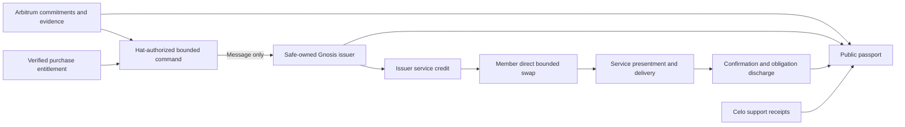

# Cosmo-Local Integration — architecture

**Current planning baseline:** 2026-10-09. This reconciles the September issuer-service model and
[whitepaper v0.8 review](whitepaper-v8-review.md). It does not authorize implementation or live funds.
The original August model remains in Git at `06a31dbf5`; current unresolved choices are explicit below.

## Domain boundaries

A Green Goods commitment records a promise, its parties, terms, evidence and confirmation. Its
registry identity remains non-transferable. A service credit is a separate transferable claim on
its issuer's future services. Earning a credit and redeeming it are different obligations.

Tech and Sun and Green Goods each issue their own service credit. Members may earn credits under
published rules; supporters may buy credits for themselves or a cohort. A purchase need not pretend
to be a previously fulfilled member contribution. Both issuance paths consume an explicit entitlement
once and remain bounded by issuer capacity and supply policy.

| Context | Proposed owner and location | Boundary |
|---|---|---|
| Commitments and confirmation | Green Goods on Arbitrum | Evidence and confirmer provenance; not token custody |
| Issuance authorization | Hat-authorized Arbitrum sender | Names issuer, source kind, entitlement, recipient, amount and season |
| Issuer and credit | Issuer's community Safe on Gnosis | Authenticated commands, replay protection, bounded mint and limiter writes |
| Registry, quoter, limits, fees and pool | Community-owned instances on Gnosis | Explicit local terms and inventory; no issuer access to pool money |
| Member exchange | Gardener's own Gnosis account | Direct executable swap with minimum output and deadline |
| G$ support | Existing separate Celo settlement path | Authenticated payment receipts; no G$ bridge or Gnosis consideration rail |
| Passport | Indexer projections and Shared domain adapter | Join evidence without merging intent, issuance, payment and delivery |

The purchase source and its trusted receipt verifier remain a design decision, not an implemented
service. The diagram shows required meaning, not a settled ABI or a new contract for every box.

## Issuance and identity

The command must bind source chain and authorized sender, issuer/pool, entitlement identity,
source kind, recipient, amount and season. Reject both a duplicate transport message and a different
message reusing a consumed entitlement. Specify acknowledgments, failure, retry and reconciliation
before writing the implementation; a send event is not proof that minting completed.

For earned issuance, decide what confirmation paths qualify and retain their provenance. Current
Fulfilled status can include pool or protocol fallback; it cannot be described automatically as
confirmation by the person served. For purchases, choose asset, destination, finality, allocation,
refund/cancellation and duplicate-prevention rules. Informational declared value is not a receipt.

Prove gardener Kernel account derivation, ownership and signing on Gnosis, including sponsored
spend and recovery. Garden-account identity and gardener identity require separate proof. The
cross-chain garden-account owner relay belongs to its own work and is not this authorization path.
A Safe call to its local issuer is a proposed fallback, with equivalent caps and audit trail.

## Pool economics and controls

Each community owns its instances and the authority behind upgrades, listing, prices, limits and
withdrawal. Verify exact deployed interfaces and effective ownership before relying on them.
Community ownership must be stated for each resource; it does not establish control of every
protocol-level fee, pause or upgrade capability.

Initial mutual acceptance at parity and roughly 500 units of cross-holding capacity are proposals.
A holding limit, token issuance cap, usable service capacity and lending credit line are separate.
Each pool sets its own terms; never create a universal cross-pool rate table. Demonstrate only the
direct routes whose execution is supported; quote-only multihop discovery is not executable routing.

Tech and Sun's proposed 24% credit-to-money fee is rehearsal-only. Real cash-out needs agreed terms,
legal review, liquidity on Gnosis and a separately authorized route. It cannot withdraw money from
an Arbitrum Safe by implication; protocol fees must be accounted for separately. Green Goods credits
have no cash-out in this scope. G$ token units are not US dollars or automatically the service-credit
unit; any service acceptance or conversion basis needs explicit terms.

## Service use and discharge

Define presentment or booking, availability, partial delivery, completion, confirmation, discharge,
failed delivery and remedy as separate facts. A swap, token return or token burn does not prove a
service was delivered. The current published burn authority must be checked independently of mint
writer authority. Choose whether returned credits are burned, locked or reusable and prevent a
second discharge of the same service obligation.

Record remaining service obligations and capacity after each outcome. Transferring a credit changes
its holder; it does not transfer the original commitment's confirmation authority automatically.
COM-46 must resolve these rules before the participant pilot can claim delivery.

## Passport and product experience

Every published measure needs its unit, time window, denominator where relevant, source and
freshness. Separate promises kept, eligible earned issuance, purchased issuance, actual payment,
service delivery, remaining obligations, pool inventory and available capacity. Consent to participate
does not imply consent to public reporting; use privacy-safe aggregates and no participant ranking.

Keep the PWA centered on useful activities, unfinished work and service use. The separate PWA hub
owns Home / Garden / Profile, remembered garden context and draft continuity. The four funding levels
are narrative and reporting audiences, not four new member tabs. Keep chain mechanics behind the
relevant technical details, while showing understandable states and recovery actions.

Contracts enforce authorization and accounting; the indexer projects receipts and provenance;
Shared owns the vendor adapter, domain translation, state and hooks; client/admin own presentation
and permitted interactions. These are ownership recommendations, not permission to create parallel
state or bypass existing module boundaries.

## Funding paths around the integration

Direct support, service purchases, shared payment structures, endowments and impact certificates
have different rights, liquidity and evidence. The existing yield splitter has three destinations;
a CLC cash pool would require an explicit fourth-path decision and implementation. A pool deposit
alone grants no assumed LP shares or exit rights. Endowment design aims to retain principal but
does not guarantee its value. Certificate ownership is not automatically equity, land ownership,
audited impact or a carbon credit.

Fiat contributions remain the separate Garden Fiat Contributions project. RESR-82 qualifies the
provider and corridor; PRD-1031 defines the exact asset, account, recipient and recovery contract.
A sandbox donation demonstration may be a stretch after qualification. PRD-1038 retains any live
pilot approval. No recurring paid platform plan or new spend is authorized here.

## Explicitly retired or deferred

- The August weighted contribution unit, per-cycle ValuationPolicy and new inert pool types.
- A Gnosis consideration rail or second payment leg in a commitment.
- CLC-owned venue control as the intended community pool topology.
- General federation, multihop execution, netting, insurance or governance-token work.
- The separate records-only Commitment Credit lending companion.

## Decisions and release authority

RESR-74's completed due diligence is dated evidence and must be refreshed before deployment.
Use published CLC documentation and hand-written interfaces; never read, import or vendor AGPL
implementation source for this integration.

PRD-1197 owns the 22 October human go/no-go. The PRD-651 gates remain explicit: external audit,
3-of-5 Safe ownership, 48-hour timelock, two weeks of testnet operation and tested rollback. Any
proposed substitution must be named and accepted separately; a local fork or a completed issue
is not automatically an equivalent. No-go is a valid hackathon outcome with an honest demo.
