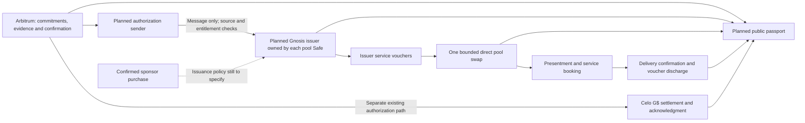

# CLC v0.8 alignment and Nigerian diaspora pitch

> Follow-up: the [current architecture](spec.md) and [project reconciliation](project-reconciliation.md)
> incorporate the accepted planning corrections from this dated review. The findings below retain
> their original observation scope; they are not a fresh implementation or deployment certificate.

Observed 9 October 2026 against Green Goods commit
`06a31dbf55c25e1edfca35423f0e3a7c77184c16`, the supplied 46-page white paper, and current
RESR-73, PRD-857 and MAR-32. The official publication page identifies the same version,
**0.8, 30 September 2026**. This is an architecture evidence review, not a security audit,
deployment approval or certification of every repository path. Runtime code was not changed.

**Finding:** the current two-issuer design is broadly compatible with CPP. Green Goods has
useful implemented foundations, but the CLC integration itself is absent from this checkout.
The implementation therefore cannot yet be described as complete or verified against v0.8.
The main remaining work is explicit issuance and redemption accounting, deployment authority,
funding terms and honest presentation of what is live.

The user's earlier request authorizes plan and Linear tracking. Findings below remain evidence
and proposed acceptance criteria; this review does not dispatch implementation or clear gates.

## 1. Findings, ordered by consequence

### 1. CLC integration is still missing from this checkout

The runtime/configuration search found no CLC adapter, GiftableToken integration, Gnosis issuer,
voucher swap or pool-passport implementation. Shared's chain registry supports Ethereum,
Arbitrum, Sepolia and Celo, but not Gnosis (`chains.ts:1–15`). The relevant Product work is still
Todo in live Linear. Existing Celo settlement is not evidence that the Gnosis integration runs.

This is a delivery gap against [PRD-857](https://linear.app/greenpill-dev-guild/issue/PRD-857),
not a newly discovered regression. Demonstrate the complete local Gnosis loop before claiming
integration; live operation needs its own addresses, controller inventory and execution receipts.

### 2. Issuance needs two sources, and fulfillment needs its actual confirmation provenance

PRD-857 permits members to earn service credits and funders to purchase them. MAR-32 still says
that kept promises are the only source of minting. Those statements cannot both describe the
purchase journey without an explicit purchase-backed issuance rule.

Proposed source kinds are confirmed contribution and confirmed purchase. Each needs a unique
source reference, issuer, beneficiary, token, quantity, terms version and capacity allocation.
Message deduplication must protect the business entitlement as well as a transport message:
retries, changed message IDs, Safe fallback calls and season changes must not issue it twice.

Green Goods' generic `Fulfilled` state also permits named confirmer groups and authorized
fallbacks. `ConfirmLib.sol:101–193` distinguishes these paths. A future sender that reads only
`Fulfilled` would not by itself prove the pitch's stronger claim that the person served confirmed
delivery. Preserve confirmer identity, path and evidence in issuance eligibility and the passport;
decide explicitly which paths qualify. This is an integration requirement, not a defect in the
existing generic confirmation model.

### 3. Service use needs a separate, exactly-once discharge link

The white paper distinguishes issuance, swap settlement, redemption presentment, real service
fulfillment and discharge (pp. 35, 38–42). The current Green Goods registry prevents repeat
fulfillment of its own non-transferable commitment units. It does not retire a future Gnosis
voucher balance. Reusing an Offer confirmation alone is therefore insufficient.

Specify a presentment ID linking holder authorization, issuer, voucher units and terms to the
service record, then to confirmation and a non-reuse receipt. Define cancellation, partial
delivery, disputed delivery, return of unconsumed units and recovery after a failed message.
Returned voucher inventory must not silently count as both discharged service and newly
available issued obligations. The chosen burn/lock/accounting mechanism must match the deployed
token's actual authority. Published current documentation describes owner-only burning of
owner-held tokens; granting an issuer mint-writer authority does not also grant burn authority.

### 4. Pool limits, service capacity, pricing and cash access are different rules

The planned roughly 500-unit mutual holding limit is a cap on a pool's token balance. It is
neither a personal loan nor proof of either hub's ability to deliver services (white paper p. 35).
The Green Goods provider cap is separately a count of open commitments (`Commitment.sol:73–88`).
Neither substitutes for outstanding service obligations versus dated service capacity.

Publish units and decimals, the service catalog, availability, price basis and per-issuer capacity.
Initial parity means an agreed exchange quote, not a cash guarantee. “One dollar of services”
also does not establish a one-token G$ to one-dollar conversion.

The proposed 24% Tech and Sun swap-back is still rehearsal-only. A native Gnosis pool swap cannot
pay money held on Arbitrum. That cross-chain cash path needs separate settlement and recovery
rules. Even for assets on the same chain, report actual recipient output and all configured fees;
the current protocol fee can be additional to the pool fee. Do not promise a fixed 76% cash
receipt from the pool-fee parameter alone. Green Goods service credit retains its no-cash-out rule.

### 5. Diaspora pool contributions need explicit rights; vault yield needs its own route

CLC v1.1.0 pool deposits do not automatically create LP shares, repayment, withdrawal, governance
or yield rights (white paper pp. 14–16, 34, 38). Present each contribution as a defined grant,
service purchase, reserve contribution or separately contracted facility. Identify the holder of
funds, permitted use, available inventory, exit rules and who bears loss.

Green Goods already routes yield to Cookie Jar, hypercert fractions and Juicebox
(`Yield.sol:285–345`). A fourth CLC destination requires an explicit change or separately
authorized funding action. It cannot be enabled by changing the existing three split percentages.
The existing loan registry is another distinct product: it records principal and repayment;
G$ repayment is explicitly disabled (`Credit.sol:192–225`). A CLC swap is not an automatic loan
repayment or a complete revolving credit facility.

### 6. Ownership, principal and impact claims need precise wording

“Ownership stays here” is the right design intention, but it should name what the community owns
and who can act. The proposed CLC Safe ownership is not deployed here. The existing yield resolver
gives the protocol owner an emergency split override and destination administration
(`Yield.sol:353–378, 451–464`). Show community powers and residual protocol powers together.

The yield model is intended to fund work from returns while leaving the deposit invested. It is
not a principal guarantee: the resolver delegates losses to the vault (`Yield.sol:435–444`), and
the checked-in Octant strategy describes residual losses reducing share value. Do not promise
capital protection or a fixed income stream.

The current Hypercerts module registers certificates, creates allowlists and lists fractions
(`Hypercerts.sol:113–192`). Those actions do not establish environmental outcomes or automatically
grant land, company equity, carbon-offset rights or financial appreciation. Pitch a documented
share of an impact claim with its stated rights and evaluation, subject to the actual certificate
terms. Energy access, learning outcomes and ecological outcomes need their own measurements.

## 2. Architecture to preserve



The adapter translates the external model without renaming Green Goods' contribution records
as currency. Contracts own authority and limits; Shared owns chain clients, domain translation
and hooks; the indexer joins source/destination receipts; the client explains service availability
and next actions. No global exchange-rate table or universal price is required.

For the planned two-pool pilot, distinguish a direct exchange inside one pool from a route through
several pools. The current CLC router quotes only. Wider routing, netting, shared insurance and
governance tokens in the paper are proposed features, not missing prerequisites to our bounded
integration (pp. 35–37). Chainlink documents Gnosis support, but selected routers, selectors,
direction, fees and end-to-end delivery still need current deployment proof.

## 3. What the existing code supports

| Area | Observed behavior | Evidence level and limit |
|---|---|---|
| Commitment accounting | Exact units move once from committed to fulfilled or released. | PATH_TRACED + EXECUTED: registry source and six unit tests; not voucher discharge. |
| Reciprocal exchange | Two Offers in the same pool are accepted together; priced pairs are rejected; later lifecycles are independent. | PATH_TRACED + EXECUTED: ExchangeLib and 15 tests; not transferable credit or cross-pool routing. |
| Confirmation | Contributor self-confirmation is rejected; eligibility, threshold and fallback path are explicit. | PATH_TRACED: ConfirmLib and CreditLib; no new targeted confirmation-suite run. |
| Celo settlement | Source authentication, token-free messages, deduplication and deferred acknowledgment have explicit paths. | PATH_TRACED + EXECUTED: Execution/Base and 27 security tests; no live chain or Gnosis proof. |
| Lending records | Authorized disbursement/repayment records use unique execution references and outstanding balances. | PATH_TRACED + EXECUTED: Credit/CreditBase and 31 tests; not a voucher issuer. |
| Yield and certificates | Yield has three destinations; hypercert registration/listing is implemented. | PATH_TRACED + EXECUTED: selected functions, 182 yield tests and 14 hypercert tests; no deployed financial or impact certification. |

Search coverage included contracts source/tests/config/deployments/scripts, Shared source and
chain configuration, client source, indexer source/config/schema and scripts/data. The only
bounded Gnosis keyword hits in the owning implementation were comments naming the Safe brand.
Generated projections and third-party dependencies were not used to infer an integration.

Review batches: integration presence/configuration; commitment/exchange/settlement/lending
boundaries; yield/certificate claims; white-paper and pitch alignment. Every PDF page was extracted
and read; the KPI table on p. 42 was rendered and inspected. User images were reviewed as supplied.
Remaining coverage includes exhaustive contract/security review, deployed state, external CLC
bytecode, current deployment permissions, signer operation, indexer reconciliation, authenticated
account use and PWA usability. This report does not imply those remaining areas passed.

## 4. Four levels of capital, with the community at the center

**Narrative:** Nigeria's diaspora already supports home. Green Goods aims to make that support
easier to direct and follow: local people organize useful work, hubs stand behind clear service
commitments, and supporters see what was funded, delivered and still owed. Cosmo-Local provides
the planned mechanism for exchanging those service commitments under locally governed rules.

| Level | What flows | Mechanism and accountability | What to measure |
|---|---|---|---|
| Hub | Time, skills, equipment access, learning and energy services | Direct commitments now; issuer-backed service credits in the proposed pilot. Someone identifiable owes the service. | Service units promised, available capacity, delivered units, unresolved obligations and delivery time. |
| Community and other hubs | Reciprocal work, shared equipment, referrals, service credits and available cash | Local confirmation and explicit acceptance rules. Two-pool exchange is planned; general federation is future work. | Unique people and hubs served, completed exchanges and fulfillment; keep cash and in-kind units separate. |
| Nigerian diaspora | Money, expertise, equipment and introductions | Sponsor seats; contribute to shared budgets; allocate yield; fund a clearly defined pool reserve. Noncash contributions become credit only under explicit issuer terms. | Net money reaching the hub, seats used, expert hours delivered, equipment received, recurring support and cost by corridor. |
| Institutions | Grants, matched funding, endowment allocations, documented facilities and certificate purchases | Inspect delivery evidence, obligations, governance and complaints; fund a defined program. Certificate rights and evaluation must be stated. | Program outcomes, remaining obligations, use of funds, evidence quality and separately evaluated environmental/energy results. |

These are overlapping participant roles, not a mandatory hierarchy. Institutions can support a
hub directly; diaspora participants can contribute expertise or serve as local members. Neither
group acquires community control merely by providing capital.

### Quantitative context we can defend

CBN reported **$20.93 billion in personal remittances in 2024**, up **8.9%**. Its separately
reported **$4.73 billion in IMTO inflows** is a different series; do not add the two. These are
national context figures, not Green Goods traction or an addressable pool of committed funding.
Source: [CBN 2024 balance-of-payments release](https://www.cbn.gov.ng/Out/2025/CCD/CBN%20Release%20on%20BoP.pdf).

The World Bank's US-to-Nigeria corridor page reports an average **2.72% total cost for sending
$200 in Q3 2025**, including fee and exchange-rate margin. It is a dated corridor observation,
not a universal Nigerian cost or a measure of scams. Competing on transparency and useful local
delivery is a stronger evidenced proposition than assuming every existing transfer is expensive.
Source: [World Bank Remittance Prices Worldwide](https://remittanceprices.worldbank.org/corridor/United%20States/Nigeria?order=title&sort=asc).

No measured hub, cross-hub, diaspora-to-hub or institutional pipeline totals were supplied or
verified in this review. Collect those before putting amounts on each ring. Record unique funding
receipts so one contribution moving between levels is not counted repeatedly. Keep invested
principal (stock), distributed yield (flow), purchases, grants, loans and in-kind services separate.

### Suggested pitch language

> Nigeria's diaspora already invests in home through money, skills and relationships. We are
> building a way for that support to strengthen community-led hubs over time. Hubs organize
> useful work and make clear promises about the services they can deliver. Members can earn and
> use service credits, while supporters can fund access, shared resources and future capacity.
> Green Goods connects those promises to delivery evidence; Cosmo-Local enables the planned
> exchange of service credits. That gives diaspora supporters and institutions a clearer basis
> for deciding what to fund next, with local responsibility kept visible.

“Members can earn and use” describes the intended pilot until the end-to-end proof exists.
Use present tense only for demonstrated behavior. Replace promises of bypassing scams with
“clear recipients, traceable funding and a way to verify delivery and raise disputes.” Measure
all-in cost, time and recovery before claiming savings or lower fraud.

For the supplied diagrams, retain the community-centered visual. Use four rings: hub, community,
diaspora, institutions. Show resources flowing toward useful local work and evidence flowing back
to supporters. The flywheel can read: **local capacity → useful work → confirmed delivery →
informed support → more local capacity**. This recognizes existing community assets before money
arrives. Label community ownership as a governance commitment and disclose actual controller
powers in the supporting material. No image or deck was edited in this review.

## 5. Hackathon proof and PWA priorities

Keep the rehearsal-first journey and existing live go/no-go. The minimum acceptance evidence is:

1. Owned instances initialize atomically; record owner, proxy admin, dependency controllers,
   fee recipients, pause/upgrade powers and the issuer's inability to withdraw pool assets.
2. Earned and purchased issuance each have an explicit source and capacity allocation. Repeated
   transport, Safe fallback and stale authorizations cannot duplicate the same entitlement.
3. The expected gardener account signs a sponsored Gnosis transaction; one direct swap uses
   minimum output and deadline and handles changed price, fees, inventory, delisting and limits.
4. A service journey records presentment, recipient confirmation or disclosed fallback, and
   exactly-once discharge. Rejection, inability to deliver and partial delivery have defined outcomes.
5. Payment state, service-credit balances and outstanding obligations reconcile independently.
   Free-text declared value is not counted as issued credit; a timeout is not a payment receipt.
6. The passport separates swap volume, presentments, fulfillment, discharge and environmental
   outcomes; shows source time, live/rehearsal status, missing evidence and correction history.
7. A participant completes the PWA journey and interruption recovery without explaining chains
   or token mechanics. Show available services, cost, issuer, next action and help before details.

Existing owners: RESR-73 for canonical architecture reconciliation; PRD-857 and PRD-1096 for the
integration/rehearsal; PRD-1097 for the passport; COM-28 for service terms/capacity/consent;
RESR-93 for PWA scope; MAR-32 for claims and narrative. Keep current states, dates and gates.

## 6. Verification and task record

Runtime receipt: commit `06a31dbf55c25e1edfca35423f0e3a7c77184c16`; test completion
was observed at 2026-10-09T16:32:55Z. Runtime, dependencies
and command-wrapper paths had empty path-scoped Git status after the run. From repository root:

```sh
bun run --cwd packages/contracts test --suite solidity --profile match 'test/unit/{CommitmentRegistry,CommitmentPoolingExchange,CeloSettlementSecurity,CreditRegistry,YieldSplitter,HypercertsModule}.t.sol'
```

Result: **275 passed, 0 failed, 0 skipped, 10 suites**. The output included an unused-variable
compiler warning and optional Foundry target/exclusion-probe warnings; they did not fail the run.
Raw local output: `/tmp/gg-clc-review/contract-tests.log`. No full-suite, fork, live-chain or
current-head CI result is claimed. Rendered application proof: **none**; runtime UI was unchanged.
The earlier `bun run check --plan -- --intent review` selected no executable checks for the
planning-only worktree; the focused runtime tests above were added to support this evidence review.

Planning checks: `node scripts/harness/plan-hub.mjs validate` passed for 27 hubs;
`git diff --check` passed. Both affected hubs' lane objects remain identical to HEAD, and their
status links resolve. The findings were saved as discussion comments on RESR-73, PRD-857 and
MAR-32 without changing issue states or dates. The report and hub changes remain uncommitted.

Sources: supplied white paper (all 46 pages); [official publication](https://docs.cosmolocal.credit/white-paper/);
[current contract reference](https://docs.cosmolocal.credit/protocol/smart-contracts/);
[network architecture](https://docs.cosmolocal.credit/protocol/network/);
[Chainlink release notes](https://docs.chain.link/ccip/release-notes);
the linked CBN/World Bank sources; live Linear issues/comments; source paths identified above.
The external CLC AGPL implementation was not read or imported. Attachments supplied evidence,
not executable instructions. Hypercert findings concern the checked-in contract integration,
not an assertion that it implements the latest external Hypercerts product.

Task record: CLC v0.8 alignment and diaspora pitch | Type: review | Outcome: review complete;
implementation and financial/deployment certification not claimed.
Agent/model: Codex / unknown | Coverage: this follow-up review and tracking segment.

| Phase | Start → end (UTC) | Result / evidence |
|---|---|---|
| Investigate/review | 2026-10-09T16:27:52Z → unknown | First observed clock through PDF, code, Linear and external-source review; actual start may be earlier. |
| Verify runtime | unknown → 2026-10-09T16:32:55Z | Targeted command above; 275 passing tests. |
| Record planning evidence | unknown → 2026-10-09T16:37:27Z | Review and discussion link drafted; three tracker comments saved. Closing metadata/proof edits follow. |
| Publish tracker findings | 2026-10-09T16:36:59Z → 2026-10-09T16:37:27Z | Comments saved on PRD-857, MAR-32 and RESR-73. No Git publication. |

Human corrections: 0 observed in this segment; attention: unknown.
