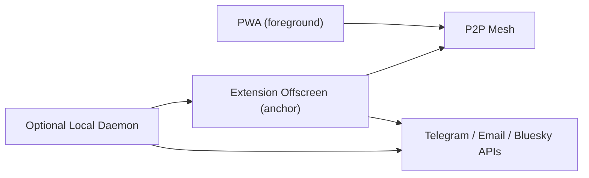
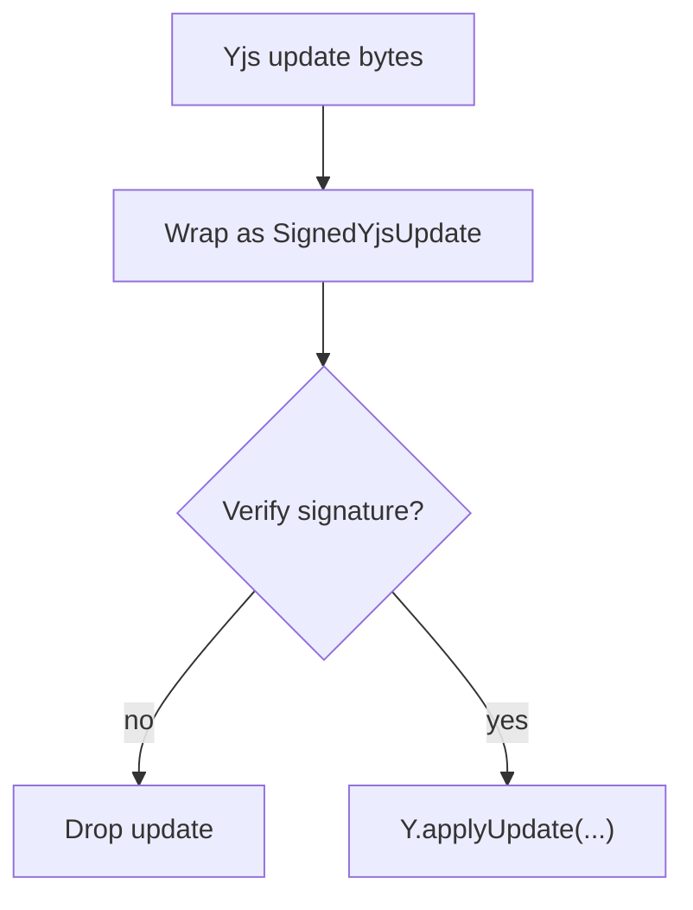

# Coop OS Architecture — Condensed Guide

**Status**: Companion to the full plan (condensed + human-friendly)
**Full plan**: [Coop OS Architecture](coop-os-architecture.md)
**Scope**: Browser PWA + Browser Extension (optional local daemon later; hardware tier future)

---

## 0) What Coop OS is (in one minute)

Coop is a browser-based OS for **community coordination** at the local/municipal layer. It’s **local-first** (your device is the source of truth), **mesh-synced** (P2P, no required server), and **skills-based** (integrations are adapters you can swap as tech changes).

The product goal is simple: help a community continuously run a loop across four pillars:
1) **Impact Reporting** (capture → verify → attest)
2) **Coordination & Governance** (propose → decide → execute)
3) **Knowledge Commons** (capture → curate → export)
4) **Capital Formation** (find funding → apply → manage treasury)

---

## 1) Design principles (the “thin waist” that keeps it future-proof)

- **Stable kernel, swappable edges**: `coop-core` defines ports (`identity:*`, `social:*`, `browser:*`, `chain:*`). Skills provide implementations (Telegram bot, Bluesky poster, OpenCred verifier, Pimlico AA executor, etc.).
- **Progressive enhancement**: baseline value works in a PWA on low-end devices; “power tier” emerges via extension/anchor nodes.
- **Local-first**: shared memory is synced P2P; hosted services are optional accelerators (relays, bots, pinning, credential checkpoint).
- **Human legibility**: memory exports to Markdown + Git and/or Filecoin archives so coops outlive tool churn.
- **Clear trust boundaries**: outward actions require approvals, roles, and audit logs. Secrets never enter shared state.

---

## 2) Vocabulary (what’s what)

- **Coop / Community**: same thing in this plan. A coop instance is keyed by `community_id` / `communityId`.
- **Member**: a human participant. Has a per-coop `member_did`.
- **Node**: a runtime on a device (PWA tab, extension offscreen runtime, optional daemon).
- **Anchor node**: a node trusted/approved to execute outbound actions (holds secrets; runs background loops best-effort).
- **Skill**: a plugin/integration that implements interfaces (e.g. `coordination:message`, `browser:extract`, `impact:attest`).
- **Job**: a unit of work a node can claim/execute (with leases + dedupe).
- **ApprovalGate**: a record that binds high-risk jobs to a human approval.

---

## 3) System model at a glance

### 3.1 Surfaces (where Coop runs)

| Surface | What it’s for | Limits |
|---|---|---|
| **PWA** | universal access (mobile + desktop), offline capture, review + approvals | weak background runtime; no cross-origin automation |
| **Extension (MV3)** | anchor runtime (polling, relays), cross-site capture, secrets vault, automation tools | best-effort background only while browser is open |
| **Optional local daemon** | always-on workflows, Playwright, IMAP/webhooks, heavier tools | requires install + native messaging |

### 3.2 Data (where memory lives)

Coop uses a 3-layer storage model:

1) **Shared state (source of truth)**: Yjs CRDT doc per coop: `community:{communityId}`
2) **Local query/index layer**: SQLite (WASM) on OPFS (FTS, embeddings, caches, job queue, cursors)
3) **Binary blobs**: OPFS for media + automation artifacts + caches (CIDs referenced from shared state)

Plus: **Long memory** publish to Git (knowledge garden) and/or Filecoin (archive via Storacha) — curated snapshots, not raw blobs.

---

## 4) Identity (layered, least privilege)

Identity is split so “wire identity” ≠ “governance identity” ≠ “channel credentials”.

### 4.1 Identities we use

- **Node transport identity**: `peer_id` (libp2p PeerId)
- **Member identity (human)**: `member_did` (per-coop `did:key`, P‑256 via WebCrypto)
- **Coop identity (official outputs)**: `coop_did` (starts `did:key`, can upgrade to `did:web`)
- **Coop namespace**:
  - `community_id` = deterministic ID derived from `coop_did`
  - `mesh_topic` = `coop/community/{community_id}/v1`

### 4.2 Binding & attribution

A node proves it acts for a member via a signed **NodeBinding**:
- `peer_id → member_did + capabilities + expiry`
- Used for attribution, routing, and capability gating.

### 4.3 Signed shared state (non-negotiable)

All mesh updates are wrapped as `SignedYjsUpdate` and verified at the boundary before apply. This prevents unauthorized state mutation even on an open mesh.

---

## 5) Agentic loop (how autonomy actually works)

Coop is **event-driven**, not “always-running magic”.

### 5.1 Draft → Execute split

- **Draft/Propose** (any node): generate digests, summaries, classifications, tx drafts.
- **Execute** (anchor only): post/send/attest after role checks + approvals, using node-local secrets.

### 5.2 Job execution loop

**Observe → Enqueue → Claim → Plan → Execute → Commit → Audit**

Key mechanisms:
- **Lease-based claiming** with deterministic winner (prevents split brain).
- **Idempotency keys** for outward actions (prevents double-posting).
- **Audit logs** written into the feed (`message_sent`, `action_taken`, `tx_confirmed`, etc.).

---

## 6) Platform auth + secrets (AuthBroker + SecretVault + CredentialRef)

### 6.1 The rule

**Secrets never enter shared state** (Yjs or Git/Filecoin publishes). Shared state stores only **public linkage** + **credential references**.

### 6.2 Components

- **AuthBroker (anchor runtime)**: runs OAuth flows, refreshes tokens, enforces scopes, performs authenticated fetch on behalf of skills.
- **SecretVault (node-local)**: encrypted store for refresh tokens, bot tokens, app passwords, API keys, session keys.
- **CredentialRef (shared)**: `{ provider, credentialRefId, scopes, allowedNodePeerIds?, accountHandle? }`

### 6.3 Practical extension-first OAuth

For Gmail/Graph and similar:
- use `chrome.identity.launchWebAuthFlow` + PKCE
- store refresh token in SecretVault
- run polling/refresh in the offscreen runtime (woken by `chrome.alarms`)

---

## 7) External presence (Bluesky, Telegram, Email) + optional OpenCred

### 7.1 Bluesky (ATProto) = social presence (not membership)

- One coop can have one Bluesky profile (“front door” + discovery).
- In browser tier, we treat ATProto as **presence + intake**, not persistence (running a PDS is server-side).
- Anchor nodes post and listen via API; results are logged back into the feed.

### 7.2 Telegram = practical coordination bridge

- One coop = one Telegram bot.
- Token is stored only on anchor nodes.
- `/link <invite_code>` binds a Telegram chat to the coop.
- Messages are treated as untrusted intake; high-risk actions require approvals.

### 7.3 Email = universal fallback + inbox intake

- Coop email identity in pilot = operator mailbox authorized via OAuth.
- Outbound: digests/notifications (draft anywhere, send via anchor).
- Inbound: polling on anchor node; ingest headers/snippets to shared feed; store full body locally by default.

### 7.4 OpenCred (California) optional verification

Pilot: Inland Empire residency verification:
- store only coarse region code + verifier DID + expiry + proof hash
- never store address/PII in shared state

---

## 8) Browser automation (extension tool surface)

Coop defines a concrete tool surface so “Claude tool-use” can map 1:1 to extension executors:

- `browser:navigate`
- `browser:click`
- `browser:type`
- `browser:screenshot`
- `browser:extract`
- `browser:wait`

Execution modes:
- **content-script mode**: safer, domain-scoped adapters
- **CDP mode (`chrome.debugger`)**: more general, higher trust (optional permission)

Guardrail: automation is for *research/capture/workflow assist*, not for irreversible authority actions.

---

## 9) Memory lifecycle (growth + pruning)

Two knobs:

- **RetentionPolicy (shared)**: convergent pruning via rollups/redactions written into Yjs (peers converge).
- **LocalBudgets (node)**: local deletion of caches (LRU for blobs/screenshots/models/skills; TTL for embeddings).

Default proactive jobs (anchor, while browser open):
- `node_heartbeat`, `email_poll`, `telegram_poll`, `chain_watch`, `digest_generate`, `retention_sweep`

---

## 10) Onchain (what we do in v1, safely)

### 10.1 Default model: human signer

Coop drafts txs, shows a human-readable summary, then opens a **signer surface** (PWA route / signer tab). Wallet signs; extension watches confirmations and writes public results to the feed.

### 10.2 v1 target automation: Pattern 2 (EIP‑4337) + Pimlico

Goal: let an anchor node submit *low-risk allowlisted* onchain actions **without holding owner keys**.

Pattern 2:
- coop has an operator smart account (`coop_operator_account`) with operator role
- owners install a constrained **session key** module (on-chain enforced allowlist + `value==0` + rate limits + expiry)
- Pimlico sponsors gas via a Sponsorship Policy
- anchor builds/signs UserOperations with the session key:
  1) build userOp
  2) sponsor (`pm_sponsorUserOperation`)
  3) send (`eth_sendUserOperation`)
  4) confirm (`eth_getUserOperationReceipt`)

Safety posture:
- no unattended signing with treasury owner keys
- automation only via constrained, revocable session keys

---

## 11) What v1 should enable (outcomes)

### V1 user outcomes

- A lead can create a coop for a bioregion, generate an invite link/QR, and onboard 5–15 people.
- Members can capture impact (voice-first) offline and sync later.
- The coop can build a knowledge garden from cross-site capture (grants, docs, meeting notes).
- The coop can coordinate via Telegram + email without forcing a new chat UI.
- The coop can produce weekly digests (funding + actions + impact) with draft→approve→send workflow.
- Optional: publish a small curated subset of impact attestations onchain (human signer first; Pattern 2 once configured).

---

## 12) Build phases (short)

- **Pilot (Weeks 1–4)**: Inland Empire loop (funding → coordination → reporting), Telegram + email, optional OpenCred, optional long memory publish (Git/Filecoin), optional EAS attest (human signer).
- **Phase 1 (Months 1–3)**: kernel + identity + signed updates + core recording flow + signer route.
- **Phase 2 (Months 3–6)**: mesh + extension anchor runtime + AuthBroker/SecretVault + channels + `browser:*` tools + optional AA Pattern 2 executor.
- **Phase 3 (Months 6–9)**: federation + more skills + optional daemon tier + stronger autonomy.

---

## 13) “Must never break” checks (acceptance)

- Invalid/unsigned shared-state updates are rejected.
- NodeBinding required for attribution and for executing outbound skills.
- No channel secrets / OAuth tokens appear in shared state or Git/Filecoin publishes.
- Outbound messaging is idempotent (no duplicates under retries/failover).
- Onchain actions require approvals; Pattern 2 session key is constrained on-chain + paymaster caps prevent runaway spend.

---

## 14) Start here (if you’re implementing)

1) Read the full plan’s “thin waist” sections: `PlatformAdapter`, `Identity Model`, `Agentic Loop`, `AuthBroker/SecretVault`.
2) Implement `community:{id}` Yjs doc + signed envelope + NodeBinding first (everything else builds on it).
3) Add one channel skill (Telegram **or** email) behind `coordination:message` with CredentialRef + SecretVault.
4) Add one proactive loop (`digest_generate`) with draft→approve→send.
5) Only then add `browser:*` automation and onchain (signer flow → Pattern 2).
