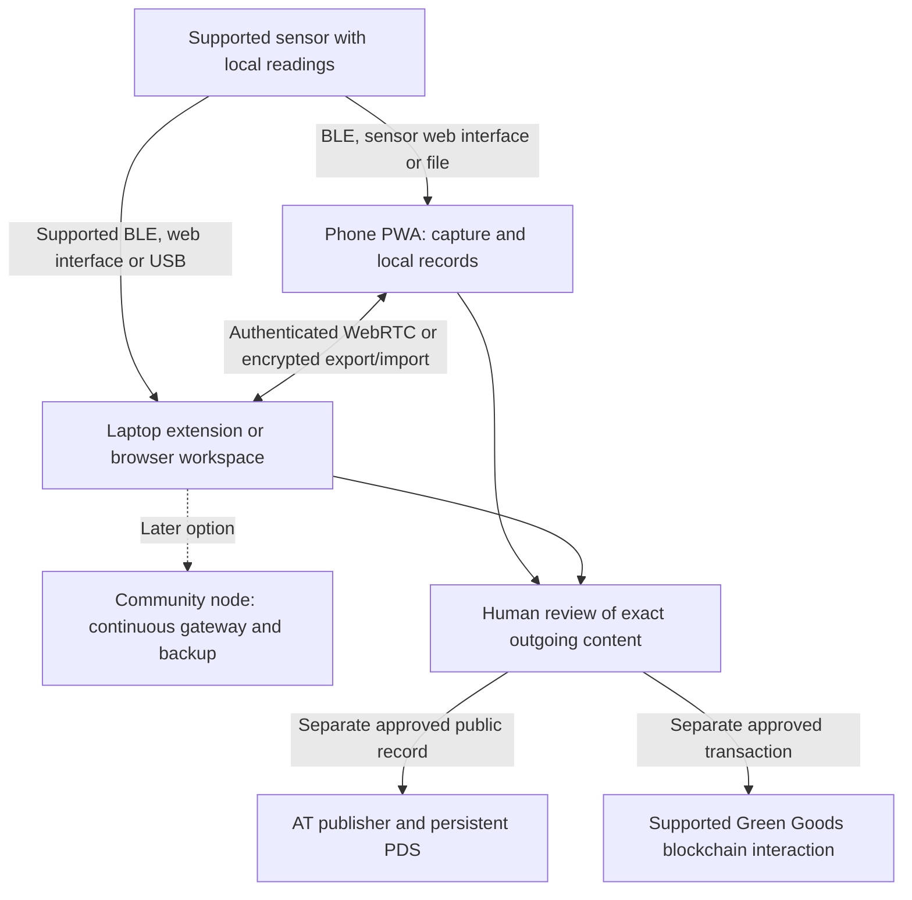

# Green Goods OS: local setup, devices and community networking

**Updated:** 9 October 2026 Pacific. **Status:** architecture exploration, not an implementation specification or approved stack.

This document consolidates the architecture discussion following the initial [research](research.md). It records the user's requirement that people can begin with their existing phone and laptop, without buying or operating a community computer node. It does not enlarge the [two-week prototype](spec.md), authorize software or firmware changes, or certify hardware compatibility. The companion [sensor research](sensor-kit-research.md) evaluates purchasable equipment. The [capture and device-flow supplement](capture-and-device-flows.md) preserves the eight proposed data areas, consent boundaries, sensor-to-phone/extension delivery, Seeed add-ons and current default-browser qualifications.

## Direction and evidence labels

Green Goods is the product, protocol and ecosystem. The OS is its proposed workspace for communities caring for land and each other. Accessibility, Sovereignty, Trust and Reciprocity are the accepted pillars. Privacy, Interoperability and Verifiability apply throughout.

The user's direction is a community-controlled network that starts with phones, laptop browsers and sensors, can grow into dedicated hardware, and selectively shares knowledge through AT Protocol and supported Green Goods blockchain interactions. This is an application-level knowledge network. Multi-hop radio networking is a separate hardware and protocol choice.

| Label | Meaning in this document |
|---|---|
| User requirement | Direction explicitly supplied by the user, including participation without a dedicated node |
| Established component capability | Supported by the linked primary documentation; not proof of a Green Goods integration |
| Proposed extension | Plausible architecture or user experience requiring a bounded implementation decision and testing |
| Research or deferred | Compatibility, security, operating cost or usefulness is not sufficiently established |

Existing Green Goods implementation claims remain in the original evidence register. The current checkout was observed on `chore/sync-release-2-0-0-to-develop` at `06a31dbf55c25e1edfca35423f0e3a7c77184c16`. Only the current public WebMCP registration was inspected again for this discussion; this is not a new product-wide audit. No model, sensor, browser peer session or physical peripheral was tested.

## Start without a dedicated node

Proposed minimum: a phone PWA, an optional laptop extension or browser workspace, and a supported sensor that stores readings or provides an accessible collection interface. Manual observations and file imports remain useful without sensors, AI, a wallet or public publication.

The laptop extension can coordinate active peers and private records while its browser is running and the computer is awake. Phones retain their own pending observations. A dedicated community node is a later option for continuous sensor collection, delayed delivery, shared backups, operator continuity and optional compute.

There are two different connectivity promises to test:

1. **No member-operated server:** ordinary participants use their devices; optional shared signaling and relay services can improve remote connections.
2. **No external connection service during local work:** installed workspaces exchange connection details locally and use a reachable LAN peer path, with file transfer as the fallback. This is more demanding and remains untested across the supported browsers.

Neither promise means that every disconnected device receives changes immediately. Async delivery requires a later overlapping connection window, a deliberate export, or an available store-and-forward service. Initial distribution, updates, new resources and deliberately public services can still require internet access.

The sensor arrows represent alternatives requiring named hardware and firmware, not interfaces available on every product. Private synchronization and public publication have separate permissions. A sensor reading or AI draft does not authorize either public channel.

## Networking responsibilities

| Technology | Proposed role | Boundary |
|---|---|---|
| Wi-Fi / Ethernet | Local network connectivity and larger transfers | Coverage and network policy matter; internet and LAN connectivity are different |
| HTTPS / WebSockets | Requests to compatible sensor endpoints and optional services | A browser client does not become a general listening server |
| BLE / Web Bluetooth | Configure a supported peripheral or retrieve readings | GATT client access, user selection and browser/OS constraints; not general browser-to-browser Bluetooth |
| WebRTC data channels | Active phone, browser and extension peer transfer | Signaling, authenticated peer identity, network reachability and application reconciliation remain necessary |
| MQTT | Optional sensor messaging through an available broker | A broker is required somewhere; delivery acknowledgement is not a complete evidence-history or backup guarantee |
| LoRaWAN | Later distant sensors with compact, infrequent readings | Gateway/network services and radio hardware; normally star-of-stars rather than multi-hop mesh |
| USB Serial / WebUSB | Selected device configuration, flashing and collection | Device protocol, driver, browser and permission compatibility need testing |
| Thread / Matter | Later integration with a compatible IoT ecosystem | Network/controller support and browser-facing access must be established |
| ESP-NOW / CoAP | Possible adapters for existing sensor systems | ESP-NOW radio frames and ordinary CoAP UDP are not direct ordinary browser interfaces |

Web Bluetooth is not available on iOS Safari in the inspected compatibility data. Use Wi-Fi/file access or evaluate an optional native phone companion if direct iPhone BLE becomes a required workflow. An Android WebView is also not equivalent to Android Chrome support. [A03]

For MQTT QoS 1, application-level reading identifiers and duplicate handling are required. Retained messages are a current retained value, not a complete history. A sensor-only MQTT publisher is therefore a poor default for the browser-only starting configuration. [A04]

For LoRaWAN, a small radio bridge can be different from a dedicated computer, but it is still additional hardware and an operating dependency. Long-range radio becomes useful when the site question and coverage justify it. Do not promise universal range, battery life or affordability from a protocol name. [A05]

## Extension as the laptop hub

| Responsibility | Proposed owner |
|---|---|
| Pairing, sensor permissions, workspace unlock, review and sharing | Visible extension workspace or supported browser page |
| Event dispatch, permissions and restartable jobs | Manifest V3 service worker |
| Active WebRTC peer sessions | Bundled offscreen document where the browser supports it |
| Saved records, checkpoints and pending operations | IndexedDB or another supported local store |
| Public publishing and signing authority | Separately approved adapter; never inference output |

Chrome explicitly permits an offscreen document for WebRTC. That reason has no specific lifetime timer, but the document is not an OS daemon: sleep, browser exit, crashes and updates can interrupt it. Only limited extension APIs are available in that document, so it communicates with the service worker through runtime messaging. Chrome's active WebSocket support also improves service-worker lifetime; it does not eliminate recovery requirements. [A01]

With appropriate host permissions, an extension can request compatible sensor HTTP endpoints. Validate the sender and configured destination so an untrusted page cannot turn the extension into an arbitrary network proxy. [A02]

A normal extension does not expose general raw TCP/UDP listeners for an HTTP server, standard MQTT broker or multicast discovery. Chromium's `mdns` permission has an extension allowlist; ordinary extensions cannot assume access. Distinguish old Chrome Apps socket examples from current extension capability. [A06]

Isolated Web Apps with Direct Sockets can provide TCP listeners, UDP and multicast in supported environments. Their installation and availability differ from ordinary extensions; current documentation retains managed-device and development constraints. This is an investigation option, not the default for ordinary Brave users. [A07]

If a required device needs unsupported drivers, network listeners or discovery, a small native companion can expose those specific functions through native messaging. The extension can retain the workspace and review interface. Persistent operation after browser exit requires a separately designed OS process and operator policy. No installation is authorized here. [A08]

## Pairing and local synchronization

Proposed local flow: open both installed workspaces; use a network that permits peer communication; exchange an offer, answer and relevant candidates through QR codes or another local channel; authenticate the intended devices; preview the allowed transfer; persist received records; acknowledge durable receipt.

An invitation QR can identify a peer and encode connection information, but a short token alone cannot carry a full service-free signaling exchange. Multiple QR frames or a manual alternate channel may be needed. Measure the usability before calling pairing seamless. QR decoding should be bundled, with manual entry available. [A09]

On a reachable LAN, external STUN and TURN may be unnecessary. Across remote networks, signaling, STUN and sometimes TURN improve reachability and introduce service/bandwidth costs. WebRTC encrypts transport; authenticating the intended community member and selecting permitted records are separate application responsibilities. [A09]

Use stable observation/change identifiers, explicit versions, transfer checkpoints, bounded payloads and receipt reconciliation. Preserve originals and record corrections separately. Web Locks and BroadcastChannel coordinate local contexts of one origin, not distinct devices. CRDTs such as Automerge or Yjs can become useful for demonstrated concurrent-editing needs; they do not decide consent or create authoritative AT commits. libp2p is an optional peer-networking component, not a radio layer or selected stack. [A10]

The PWA and extension have separate origins and stores. An explicit authenticated bridge is required. Private authorization conflicts should fail closed for disclosure while preserving local drafts. Revocation cannot erase copies already disclosed or instantly reach disconnected peers.

## Initial setup and offline readiness

1. **Check capabilities.** Inspect available storage and supported APIs without requiring advanced hardware. Show a manual path. Ask for camera, location, Bluetooth and other permissions when the relevant activity starts.
2. **Install and prepare resources.** Install the extension and phone PWA. Explicitly cache the application, schemas, UI assets, translations, QR decoder, documentation and selected reference material. Add bounded, licensed offline maps only if needed. Models are a separate opt-in download.
3. **Create private storage and recovery.** Generate local device keys, configure encryption and establish an encrypted export and recoverable key procedure. Test restore. Cloud accounts and wallet transactions are not prerequisites for ordinary private records.
4. **Pair devices.** Authenticate a phone/laptop peer connection and choose permitted data. Keep a portable encrypted file route available.
5. **Connect one supported sensor.** Prefer a preconfigured product. If flashing is necessary, verify exact hardware/bootloader and firmware provenance first. Retain installation ID, units, calibration, placement and clock information; test logging and retrieval.
6. **Enable optional local interpretation.** Download a pinned compatible model package and run a synthetic quality test. Show whether processing is on the phone or the authorized laptop.
7. **Rehearse offline.** Disconnect internet while leaving the required local radios available. Cold-start both workspaces, unlock, capture, collect, transfer, interrupt/retry and restore. Verify the absence of external requests carrying private content.

Installing a PWA is not proof that all resources or models are cached. Service workers are event-driven and may terminate. Models, sessions and pending jobs need recovery. Persistence requests reduce eviction risk, but clearing storage, removing an extension, losing a device or corrupting a profile still require independent backups. [A11]

## Web API inventory

| Capability | Role / maturity boundary |
|---|---|
| Service Workers + Cache Storage | Offline application responses and supported background events; not continuous execution |
| IndexedDB + OPFS + Storage Manager | Structured records, larger local files, capacity/persistence checks; origin separation and recovery required |
| Web Crypto | Encryption, key generation, hashing and signatures; key governance and recovery remain application work |
| Web Workers + WASM | Local parsing, media processing and compatible inference; memory and browser lifecycle limits remain |
| WebRTC | Live peer data transfer; signaling and policy are separate |
| Camera + MediaRecorder + QR decoder | Local capture and pairing; permission and accessible manual alternatives |
| BarcodeDetector | Optional native decoding; limited availability, bundled decoder fallback |
| Web Bluetooth | Optional GATT access to supported peripherals; not a universal phone path |
| Web NFC | Optional NDEF tag identification/setup, particularly supported Android configurations; not general NFC peer communication |
| Web Serial / WebUSB | Optional hardware adapters and firmware tooling; named-device/browser testing required |
| Geolocation | Optional coordinates and reported accuracy; offline positioning is provider-dependent, manual entry available |
| Notifications | Supported local alerts; closed-app scheduling is not guaranteed and Web Push adds a service |
| File APIs / File System Access / Web Share | Imports, recovery and intentional handoff; fall back to ordinary file selection/download |
| Web Locks / BroadcastChannel | Coordination within a local origin; not a network sync mechanism |
| Streams / Compression Streams | Incremental processing and compressed transfer; resumability is an application protocol |
| Screen Wake Lock | Helps an active visible collection session; not an unattended execution guarantee |
| WebGPU | Optional GPU computation; feature detection plus actual memory/quality benchmarks |
| WebAuthn / passkeys / PRF | Credential authentication and optional encryption-key assistance; offline behavior and origin mapping require tests |
| WebMCP | Evolving agent tool interface; does not supply inference, networking or a privacy guarantee |

API sources and limitations are indexed in A11–A17 below. Available primitives are not a claim that this workflow is shipped in Green Goods.

Passkeys authenticate; they are not automatically encryption keys or community recovery. The WebAuthn PRF extension can help derive wrapping material on supported authenticators. Test local unlocking with internet disconnected. Keep cloud recovery and cross-device sign-in out of the offline baseline, and separately verify the PWA/extension relying-party and origin mapping. [A14]

Web Notifications and Web Push are different. Do not promise scheduled alerts while a phone PWA is closed from Notifications alone. GPS coordinates may be obtainable offline on some hardware, while network location, geocoding and maps require different resources. Preserve accuracy metadata and a manual location path. [A15]

## Local AI and evolving APIs

The useful baseline has no AI dependency. Evaluate source-grounded summaries or retrieval only after the selected model/runtime combination works on representative devices and languages. A 4–8 GB laptop is a benchmark target, not a certified device tier. Weight size differs from total working memory, which includes buffers, context state and the application.

Package the tokenizer, configuration, weights, runtime and required compiled components, licenses, integrity information and update policy. Extension-store remote-hosted-code restrictions include executable JS and WASM; model data and executable runtime downloads are different. WebLLM caching does not itself establish a compliant extension package. Do not silently fall back to external inference. [A16]

Current Gemma 4 documentation lists E2B/E4B variants and Apache 2.0 licensing. Earlier covered Gemma families retain other terms. Verify the exact converted artifact and runtime rather than making a family-wide license claim or assuming browser compatibility. No license is changed by this observation. [A16]

Measure load/completion time, memory failures, battery impact, numerical/source fidelity, unsupported statements, abstention and human review effort using synthetic or explicitly authorized non-sensitive material. Preserve source references and model/runtime versions with drafts. RESR-79 remains an approval constraint for external inference involving gardener evidence.

| API to watch | Current research boundary |
|---|---|
| WebNN | Candidate Recommendation Draft dated 8 October 2026; hardware acceleration and model support need implementation-specific tests |
| Chrome built-in AI | Several APIs have shipped; foundation-model APIs have device/storage constraints and are not a universal mobile/low-resource baseline |
| On-device SpeechRecognition | `processLocally` is experimental; its default permits the browser to choose remote processing. Require an explicitly local supported path or retain audio |
| WebMCP | Origin trial/local testing, evolving interface. Current documentation uses `document.modelContext` |
| Direct Sockets / IWA | Broader networking in a different installed-app model; deployment/device support remains a gate |
| WebTransport | Client connection to an HTTP/3 server; does not replace service-free WebRTC peer transfer |
| Background Sync / Fetch | Optional improvements where supported; never a guarantee that offline devices execute unattended work |

Sources: A07 and A17. The current `registerPublicWebMcpTools` in [webmcp.ts](../../../packages/client/src/webmcp.ts) uses the older `navigator.modelContext` entry point. Current primary documentation differs; runtime compatibility was not tested. The existing tools deliberately describe/navigate public routes. Private database access, hidden admin actions, destructive operations and onchain writes remain outside the repository's current WebMCP boundary. A local model does not automatically make another agent/provider local or approved.

## Comparable systems and differentiation

| Reference | Useful pattern | Limitation for this proposal |
|---|---|---|
| CoMapeo | Offline mobile capture and peer collaboration designed with communities | Native runtime architecture is not automatically a browser extension; core library README has a readiness warning |
| Terrastories | Place-based knowledge, restricted stories and offline/local deployments | Browser UI commonly depends on a local application server |
| farmOS / OpenTEAM | Farm records, interoperable tools and land-steward data governance | Integrate useful records and workflows rather than assume a replacement is needed |
| GainForest / Taina | Field observations, community knowledge and deliberate public evidence | Significant overlap; first-party descriptions do not independently certify a private browser mesh |
| Home Assistant / ESPHome | Local sensor integration, gateways and device adapters | Continuous operation depends on a host; agricultural compatibility is device-specific |

Sources: A18–A22. A potential Green Goods distinction is progressive participation using existing devices, supported local collection, human-controlled knowledge exchange and separately accountable commitments. This is a hypothesis. No novelty, cost saving, superior privacy or partner interest is established by comparing feature descriptions.

## Privacy, provenance and publication

Keep private originals, derived interpretations, reviewed summaries and public records distinct. Preview exact outgoing content, media, destination, publisher identity and visibility. Editing after approval invalidates that approval. Prevent private identifiers, exact locations and media metadata from leaking through automatic provenance fields.

Sensor data is untrusted input. Preserve raw readings, units, sensor time and receipt time, sequence numbers, firmware, calibration, placement, missingness and corrections. Bound payloads and reject malformed input. Encryption or a signature can improve integrity/origin evidence; it cannot establish correct placement, honest calibration or an environmental outcome.

AT repositories are authoritative public account records hosted at a PDS. Self-hosting does not make them private, experimental permissioned-data work is not an available guarantee, and deleting a record cannot recall external copies. A private peer network does not automatically create a consistent signed AT repository. Keep repository signing authority separate from member device credentials. [A23]

Supported blockchain writes require separate explicit authority, wallet confirmation, fees, receipt/retry handling and duplicate prevention. AI never authorizes transactions. No chain, identity, key-sharing or publisher implementation is selected here.

## Decision gates and review

| Gate | Required evidence before implementation claims |
|---|---|
| First workflow and sensor | One environment/question, buyer/user, purchasing region, budget, named product/firmware and maintenance owner |
| Browser-only setup | Actual phone/laptop pairing with internet disconnected; camera/manual fallback; permissions and secure-origin behavior |
| Sensor usability | Unboxing/configuration, calibration/reference check, logging, gaps, restart/retrieval and support burden |
| Reliable private storage | Independent encrypted export/restore; uninstall/lost-device/shared-device handling |
| AI usefulness | Supported language/device benchmarks with source fidelity and measured review effort |
| Public boundary | Exact-content preview, consent conflict, metadata leakage, approval invalidation and no automatic publication |
| Native or IWA exception | Demonstrated capability gap and total installation/maintenance cost, not an assumed requirement |
| Affordability | Hardware, batteries, connectivity, maintenance, calibration, setup/support and participant time; no unmeasured savings claim |

**Evidence review:** established primitives and first-party product descriptions are separated from proposed Green Goods behavior. Core browser-only local pairing, sensor compatibility and memory limits are unresolved. The node-free requirement is carried forward; the original prototype scope remains unchanged. No measured performance, operating cost or environmental outcome is invented. Broader personas remain contexts rather than four simultaneous kits.

## Source-to-claim index

All external sources were inspected in the architecture discussion on 9 October 2026 UTC. Mutable documentation needs rechecking before a build or purchase. Vendor descriptions are not independent hardware tests.

- **A01, extension lifecycle:** [offscreen API](https://developer.chrome.com/docs/extensions/reference/api/offscreen), [service-worker lifecycle](https://developer.chrome.com/docs/extensions/develop/concepts/service-workers/lifecycle), [WebSockets](https://developer.chrome.com/docs/extensions/how-to/web-platform/websockets).
- **A02, permitted requests:** [extension network requests](https://developer.chrome.com/docs/extensions/develop/concepts/network-requests), [local network access](https://developer.chrome.com/blog/local-network-access).
- **A03, peripherals:** [Web Bluetooth](https://developer.chrome.com/docs/capabilities/bluetooth), [MDN Bluetooth compatibility data](https://github.com/mdn/browser-compat-data/blob/main/api/Bluetooth.json), [Web Serial](https://developer.chrome.com/docs/capabilities/serial).
- **A04, MQTT:** [OASIS MQTT 5](https://docs.oasis-open.org/mqtt/mqtt/v5.0/os/mqtt-v5.0-os.html), [Mosquitto](https://mosquitto.org/), [MQTT.js browser constraints](https://github.com/mqttjs/MQTT.js#browser).
- **A05, radio/IoT alternatives:** [LoRaWAN architecture](https://www.thethingsnetwork.org/docs/lorawan/architecture/), [limitations](https://www.thethingsnetwork.org/docs/lorawan/limitations/), [Matter FAQ](https://csa-iot.org/all-solutions/matter/matter-faq/), [ESP-NOW](https://docs.espressif.com/projects/esp-idf/en/stable/esp32/api-reference/network/esp_now.html), [CoAP](https://www.rfc-editor.org/rfc/rfc7252.html).
- **A06, discovery:** [current Chromium permission features](https://chromium.googlesource.com/chromium/src/+/main/chrome/common/extensions/api/_permission_features.json), `mdns` allowlist and platform-app distinction.
- **A07, broader browser networking:** [Direct Sockets](https://developer.chrome.com/docs/iwa/direct-sockets), [IWA introduction](https://developer.chrome.com/docs/iwa/introduction).
- **A08, native bridge:** [native messaging](https://developer.chrome.com/docs/extensions/develop/concepts/native-messaging).
- **A09, peer transport:** [WebRTC signaling](https://developer.mozilla.org/en-US/docs/Web/API/WebRTC_API/Connectivity), [protocols](https://developer.mozilla.org/en-US/docs/Web/API/WebRTC_API/Protocols), [data channels](https://developer.mozilla.org/en-US/docs/Web/API/WebRTC_API/Using_data_channels).
- **A10, reconciliation:** [Automerge](https://automerge.org/docs/hello/), [Yjs](https://docs.yjs.dev/), [libp2p browser WebRTC](https://libp2p.io/docs/webrtc-browser-connectivity/).
- **A11, storage:** [quotas/persistence](https://developer.mozilla.org/en-US/docs/Web/API/Storage_API/Storage_quotas_and_eviction_criteria), [extension storage](https://developer.chrome.com/docs/extensions/develop/concepts/storage-and-cookies), [OPFS](https://developer.mozilla.org/en-US/docs/Web/API/File_System_API/Origin_private_file_system), [Service Workers](https://developer.mozilla.org/en-US/docs/Web/API/Service_Worker_API).
- **A12, local primitives:** [Web Crypto](https://developer.mozilla.org/en-US/docs/Web/API/Web_Crypto_API), [Web Locks](https://developer.mozilla.org/en-US/docs/Web/API/Web_Locks_API), [BroadcastChannel](https://developer.mozilla.org/en-US/docs/Web/API/Broadcast_Channel_API), [Compression Streams](https://developer.mozilla.org/en-US/docs/Web/API/Compression_Streams_API), [File System API](https://developer.mozilla.org/en-US/docs/Web/API/File_System_API).
- **A13, capture and setup:** [camera/microphone](https://developer.mozilla.org/en-US/docs/Web/API/MediaDevices/getUserMedia), [BarcodeDetector](https://developer.mozilla.org/en-US/docs/Web/API/Barcode_Detection_API), [Web NFC](https://developer.chrome.com/docs/capabilities/nfc), [esptool-js](https://github.com/espressif/esptool-js).
- **A14, passkeys:** [WebAuthn extensions/PRF](https://developer.mozilla.org/en-US/docs/Web/API/Web_Authentication_API/WebAuthn_extensions), [extension WebAuthn](https://developer.mozilla.org/en-US/docs/Mozilla/Add-ons/WebExtensions/Use_the_web_authn_api), [FIDO passkeys](https://fidoalliance.org/passkeys/).
- **A15, device behavior:** [Notifications](https://developer.mozilla.org/en-US/docs/Web/API/Notifications_API), [Push](https://developer.mozilla.org/en-US/docs/Web/API/Push_API), [Geolocation](https://developer.mozilla.org/en-US/docs/Web/API/Geolocation_API), [Screen Wake Lock](https://developer.mozilla.org/en-US/docs/Web/API/Screen_Wake_Lock_API).
- **A16, AI packaging:** [Gemma 4 model card](https://ai.google.dev/gemma/docs/core/model_card_4), [WebLLM runtime guidance](https://webllm.mlc.ai/docs/user/advanced_usage.html), [extension remote-hosted-code policy](https://developer.chrome.com/docs/extensions/develop/migrate/remote-hosted-code).
- **A17, evolving APIs:** [WebNN](https://www.w3.org/TR/webnn/), [WebGPU](https://developer.mozilla.org/en-US/docs/Web/API/WebGPU_API), [Chrome Prompt API](https://developer.chrome.com/docs/ai/prompt-api), [WebMCP](https://developer.chrome.com/docs/ai/webmcp), [imperative interface](https://developer.chrome.com/docs/ai/webmcp/imperative-api), [local speech recognition](https://developer.mozilla.org/en-US/docs/Web/API/SpeechRecognition/processLocally), [WebTransport](https://developer.mozilla.org/en-US/docs/Web/API/WebTransport), [Background Sync](https://developer.mozilla.org/en-US/docs/Web/API/Background_Synchronization_API).
- **A18, CoMapeo:** [public mobile release](https://awana.digital/blog/introducing-comapeo-abare), [core](https://github.com/digidem/comapeo-core), [React Native integration](https://github.com/digidem/comapeo-core-react-native).
- **A19, Terrastories:** [project](https://terrastories.app/), [implementation](https://github.com/Terrastories/terrastories).
- **A20, existing land tools:** [farmOS](https://farmos.org/), [OpenTEAM](https://openteam.community/what-we-do/).
- **A21, GainForest:** [project](https://www.gainforest.earth/), [current documentation](https://docs.gainforest.earth/), [Taina](https://docs.gainforest.earth/for-nature-stewards/taina.md).
- **A22, gateways:** [Home Assistant](https://www.home-assistant.io/getting-started/), [MQTT integration](https://www.home-assistant.io/integrations/mqtt), [ESPHome MQTT](https://esphome.io/components/mqtt/).
- **A23, public publication:** [AT repository](https://atproto.com/specs/repository), [self-hosting](https://atproto.com/guides/self-hosting), [permissioned-data proposal](https://github.com/bluesky-social/proposals/blob/main/0016-permissioned-data/README.md).

## Open next question

Which purchasable kit provides the fewest setup steps for one useful land-management question, at a locally affordable total cost? The [sensor-kit research](sensor-kit-research.md) follows that question and must distinguish stock capabilities from a proposed Green Goods adapter or vendor partnership.
