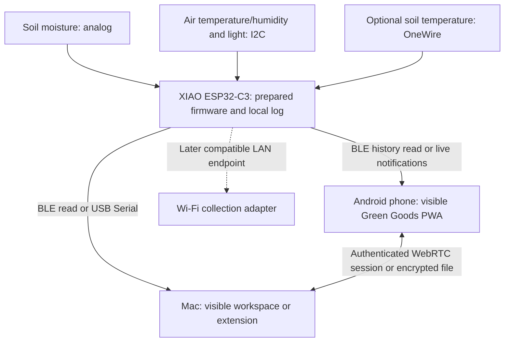
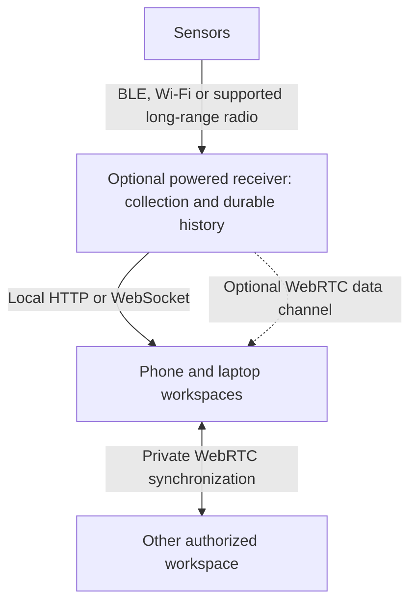

# Green Goods OS: community records and device collection

**Updated:** 9 October 2026 Pacific. **Status:** source-backed research and proposed architecture. No hardware, browser/device integration, model quality or field outcome is certified.

This supplement preserves the user's eight proposed capture areas and the subsequent questions about sensor delivery, additional Seeed hardware and browser defaults. It extends the [architecture exploration](architecture.md) and [sensor research](sensor-kit-research.md). It does not expand the accepted implementation scope, replace the synthetic input in the [prototype PRD](spec.md), or authorize purchases, firmware changes, software installation, provider processing or public publication.

## Evidence boundaries

- **Established:** named browser primitives, manufacturer interfaces, repository functions and source-listed sensor properties.
- **Proposed:** Green Goods capture templates, sensor firmware, collection protocols, private synchronization and community review.
- **Unresolved:** exact device/browser behavior, battery endurance, storage capacity, language quality, measurement usefulness, field durability and delivered costs.
- **Speculative:** automatic cultural interpretation, wellbeing inferred from behavior, or environmental outcomes inferred from inexpensive sensors alone.

Green Goods was inspected at `06a31dbf55c25e1edfca35423f0e3a7c77184c16`; the observed branch for this follow-up is `release/october-2-0-0`. Coop's separately inspected checkout is `chore/add-agpl-license` at `5b889eea30056877f1e3a0114e0cd4353a36cee4`. These are source inspections, not new product-wide or runtime audits. Existing source/capability claims remain in the [evidence register](evidence-register.md).

## Capture areas

These are domain views over connected records, not eight independently approved products.

| Area | Phone contributions | Laptop workspace or extension | Sensors and interpretation boundary |
|---|---|---|---|
| Agriculture and land stewardship | Planting, watering, harvests, pests, repeat photographs, voice observations and optional location | Field histories, experiments, selected guides and laboratory reports | Moisture, temperature, rainfall, light and water flow through named equipment. A moisture reading does not establish soil health or a regenerative outcome |
| Environmental health | Smoke, flooding, erosion and pollution observations | Trends, maintenance context and authorized external datasets | Temperature, humidity, particles, CO2 and other device-specific channels. Placement, calibration and reference comparison matter |
| Education | Demonstrations, questions, reflections and consented workshops | Selected pages, uploaded documents, annotations, meeting material and reviewed lessons | Instruments can support practical exercises. Attendance, browser activity and document opening are not evidence of learning |
| Waste and circular resources | Material categories, scale readings, collection events, contamination, repairs and compost activities | Audits, receipts and material histories | Connected scales, bin-fill sensors and compost temperature are separate extensions. Fill level is not mass or composition; collection is not proof of recycling |
| Clean energy | Meter photographs, equipment descriptions, maintenance and outages | Authorized meter/inverter exports and manuals | Power, energy, current and voltage require suitable equipment. Consumption, generation, renewable origin and avoided emissions are different quantities |
| Knowledge and experience | Advice, experiments, requests, corrections and lessons | Source-linked knowledge cards, selected references and retrieval | Measurements can support a lesson, but explanatory claims need context and review |
| Culture | Oral histories, language, food, land practices and consented gathering media | Community archives, approved transcripts, decisions and attribution | Recording media does not establish cultural meaning, authority or permission to reuse |
| Community wellbeing | Optional written/audio surveys, reflections and support needs | Restricted survey administration and reviewed aggregates | Environmental conditions supply context. Sensors and behavioral inference do not establish happiness or belonging |

Relevant primary precedents are farmOS's manual records and data streams [C01], EPA's air-sensor and waste-assessment methods [C02], and CoMapeo's native offline community observations [C03]. Their existence does not prove equivalent Green Goods browser functionality.

Additional useful views are water availability and use; biodiversity and habitat observations; maintenance, calibration and outages; and community coordination through offers, requests, shared resources and fulfillment. Preserve uncertainty in species identification and protect sensitive locations. Water-quality and carbon claims need methods suited to those claims.

## Device roles and consent

The phone is the proposed low-friction contribution interface: forms, photographs, audio, selected files, QR identifiers and optional location. Manual and written participation must remain available without sensors or AI. A browser does not automatically gain access to phone messages, other apps, all files or health databases.

The extension can deliberately capture an authorized page or selected passage, preserving source references and attribution. Prefer temporary access through `activeTab` over collecting every page by default. File storage is different from reliable PDF/OCR/document interpretation, which needs format-specific processing. Access does not create redistribution or training rights. [C04]

### Gathering capture

Recommend a host-started recording session that requires little interaction once started:

1. Declare what is recorded, the purpose, audience, retention and cultural authority.
2. Establish participant and collective permission, with a practical alternative for people who decline.
3. Record locally with visible status, pause, stop and interruption recovery.
4. Let participants or designated stewards correct transcripts, remove identifiers and choose excerpts.
5. Share only the approved material with an explicitly named audience.

Microphone permission and browser tab-capture invocation are technical gates, not complete multi-party consent. Phone suspension, screen locking, storage exhaustion and power failure can interrupt collection. Screen Wake Lock helps visible active sessions; it is not an unattended recorder guarantee. A later dedicated node still requires visible recording policy and community authority. [C04, C05]

Local Contexts provides reference protocols for attribution, cultural authority, seasonal restrictions and community-only use. Do not apply its labels on behalf of a community or assume labels technically prevent copying. [C06]

### Community wellbeing

Start with optional self-reports rather than clinical records or behavioral scoring. OECD's 2025 subjective-wellbeing guidance is a methodological reference for life evaluation, experience and meaning; question wording, language, response mode and sampling need testing. Preserve original audio answers and reviewed transcriptions as different records. [C07]

Restrict individual answers separately from ordinary land records. Voice, small groups and contextual details can identify respondents even when names are omitted. Review disclosure risk before publishing aggregates; no universal minimum group size establishes anonymity. Declining must not block ordinary participation. Do not infer emotions from voices/faces, score individuals for funding, or treat survey changes as proof that Green Goods caused an improvement.

### Coop patterns and gaps

At the pinned Coop checkout:

- `useCapture` / `startRecording` use `getUserMedia`, `MediaRecorder`, local saving and screen wake lock. [C08]
- `createReceiverCapture` supports audio, photo, file and link records, private intake and queue state. Pairing can queue a capture for synchronization; local capture permission and private sharing permission must remain distinguishable. [C08]
- `extractPageSnapshot` collects title, metadata, headings and paragraphs. It is a page-text function, not a meeting-audio recorder. [C08]
- `transcribeAudio` uses Transformers.js with a default `onnx-community/whisper-tiny.en` model. It is English-only; per-segment `confidence: 1.0` is a placeholder, not calibrated reliability. The presence of a WebGPU/WASM path does not prove quality on an actual phone or successful fallback after a GPU initialization error. [C08]

Learn from these patterns without adopting Coop as an architectural dependency. Its inspected Shared package declares AGPL-3.0-only; code reuse requires dependency/copyright/license review. No code is copied here. Browser speech recognition may process audio on a server; explicitly verified local processing and a no-cloud fallback policy are required. [C09]

The proposed Community Evidence Mesh envelope separates original observations, derived candidates, reviewed evidence and methodology-bound claims. RESR-79 remains an unresolved external-provider approval constraint. No gardener records, gathering recordings or wellbeing responses were processed in this research. [C10]

## How sensors reach the phone and extension

### Proposed starting path: local logging, BLE retrieval and USB recovery

Grove probes are wired peripherals. The XIAO microcontroller reads them and supplies the communication and storage behavior. The same firmware must own sample identifiers, sampling, clocks, calibration context, history and retrieval across transports. No such Green Goods firmware exists yet.

Recommended user experience:

1. Flash and provision the named board through USB in a supported desktop browser. The browser installs a prepared binary; maintainers compile it. Improv Serial is a possible Wi-Fi-provisioning component, not a measurement or history protocol. [C11]
2. The powered device records independently while browsers are closed. The kit's microSD/RTC makes this plausible, but firmware, clock setup and power continuity must be implemented and tested. The CR1220 backs the clock, not the whole device.
3. A participant opens Green Goods and selects the intended sensor through the native Bluetooth chooser. The browser is a BLE GATT client; the sensor exposes a documented GATT service. [C12]
4. Retrieve current values and a bounded history range. Proposed fields include installation/device ID, stream ID, boot/sequence identity, sample time and time quality, original value, unit, calibration version, firmware and missingness flags.
5. Save records durably before acknowledging receipt. Resume interrupted batches from a checkpoint; deduplicate the same sample whether received by phone, laptop, BLE or USB. Notifications alone do not provide historical delivery or backup.
6. Synchronize selected private records between active phone and laptop workspaces through authenticated WebRTC or an encrypted export. These are separate origins and stores, with separate authorization. [architecture A09-A10]

Use one active collector at a time initially. Do not assume the firmware accepts simultaneous phone/laptop BLE sessions. Other devices can retrieve the same stable sample IDs later. Browser selection/pairing is not complete device authentication; the firmware needs an admission and credential design. Physical access, false measurements and tampering remain possible.

### Transport comparison

| Path | Useful role | Required boundary |
|---|---|---|
| USB Serial | First firmware installation, provisioning, bench readings, bulk history and recovery | Data cable, supported browser, boot mode and exact board protocol. Best first implementation proof |
| BLE GATT | Nearby phone/laptop configuration and bounded history without internet or router | Supported browser, user selection, device service and authentication. Short-range coverage, batch speed and battery cost unmeasured |
| Local Wi-Fi HTTP/WebSocket | Larger histories and several accessible LAN devices | Router/hotspot or sensor AP, supported endpoint, authentication, CORS, secure-context/mixed-content behavior and local-network permissions |
| MQTT over WebSockets | Later broker-based sharing and continuously available collectors | An actual broker and WebSocket listener. A browser client is not itself a normal MQTT broker |
| LoRaWAN / ESP-NOW | Later distant or low-power radios | A compatible bridge/gateway. Phone/laptop browsers do not directly receive these radio frames |

A sensor cannot assume an ordinary closed browser is an available server to push into. BLE retrieval/live subscriptions work during active sessions; continuous history belongs on the sensor or an available gateway. The extension service worker is not the permanent BLE session owner. Prefer a visible collection surface initially and prove lifecycle behavior before moving any session into an offscreen document.

Wi-Fi remains a credible later adapter, not a promise that any `http://192.168...` endpoint works from the installed HTTPS PWA. Chrome's Local Network Access permission includes defined mixed-content exceptions; CORS and endpoint security remain separate concerns. Extensions have their own permitted-request boundary. Test each exact browser/endpoint pair. [C13]

### Stock assembled sensor correction

The assembled XIAO Soil Moisture Sensor has documented Wi-Fi/ESPHome behavior and a manufacturer browser firmware installer. It does not establish an already available Green Goods BLE history service, independent historian or phone dashboard. A C6 controller having a BLE radio is not proof of a usable stock BLE protocol. Do not assume its enclosure accepts the Grove add-ons below; those are proposed for the modular XIAO expansion kit. [sensor H30/H34; C14]

## Additional Seeed sensors for the bench prototype

Recommend moisture plus air temperature/humidity first. Light is a useful low-cost context channel; soil temperature is optional. These remain optional hardware exploration and do not automatically enter the two-week prototype.

| Component | SKU | Observed Seeed price | Connection and purpose |
|---|---|---:|---|
| [Grove AHT20](https://www.seeedstudio.com/Grove-AHT20-I2C-Industrial-grade-temperature-and-humidity-sensor-p-4497.html) | 101990644 | US$4.50 | I2C air temperature and relative humidity; useful context for drying, with protected placement |
| [Grove Digital Light Sensor TSL2561](https://www.seeedstudio.com/Grove-Digital-Light-Sensor-TSL2561.html) | 101020030 | US$6.50 | I2C light readings for shade/light context. Lux is not PAR; bright outdoor conditions can exceed the documented range |
| [Grove I2C Hub, six ports](https://www.seeedstudio.com/Grove-I2C-Hub-6-Port-p-4349.html) | 103020272 | US$1.70 | Connector expansion for the shared I2C bus, not a network gateway or address-conflict resolver |
| [Grove One Wire Temperature Sensor DS18B20](https://www.seeedstudio.com/One-Wire-Temperature-Sensor-p-1235.html) | 101990019 | US$8.99 | Optional soil, water or compost temperature; waterproof probe does not make the entire controller assembly waterproof |

All four listings showed in stock on 9 October 2026. Add-ons AHT20 + light + hub total **US$12.70**, excluding shipping, taxes, accessories and delivered-price changes. The earlier maker-listed C3/base/moisture core was US$27.39, giving an illustrative named-component subtotal of **US$40.09**, or **US$49.08** with DS18B20. Those totals combine observed listing prices, not a cart or delivered quote. [C15]

AHT20 is documented at I2C address `0x38`; the TSL2561 example uses `0x29`. They are plausible on a shared bus, but verify actual revisions, supply/logic voltage, onboard devices, wiring and library behavior. I2C is a short wired bus; Grove connector compatibility alone does not certify electrical or software compatibility. Assign DS18B20 only to a verified free GPIO. Do not blindly copy its vendor D2 example into the XIAO SD configuration, which uses D2 for card select. [C15; sensor H46-H47]

Keep exposed air/light boards protected from water and direct heating while preserving the intended measurement exposure. Retain installation depth, shade, calibration and missing samples. The initial question can remain inspection priority for a bed, without inferring irrigation prescriptions, water savings or outcomes from these channels alone.

[SenseCAP S2105](https://www.seeedstudio.com/SenseCAP-S2105-LoRaWAN-Soil-Temperature-Moisture-and-EC-Sensor-p-5358.html) is an assembled moisture/temperature/EC alternative, listed at US$146.00, but adds LoRaWAN network/gateway dependencies. Bluetooth app configuration does not prove browser measurement retrieval. EC is not an NPK assay. It remains deferred for the first browser/phone path. [C16]

## Browser support with default settings

“By default” means no experimental browser flag; it does not mean no HTTPS, browser/OS permission, user gesture, driver or supported hardware. No browser supplies every proposed API across phone and laptop. Web NFC is an Android-specific enhancement in current compatibility data; desktop Chrome itself lacks it. WebMCP remains a proposed standard with a Chrome origin trial from 149 and a local development flag. Keep both outside the required capture baseline. [C17-C18]

| Browser / environment | USB Serial | Web Bluetooth GATT | WebUSB | Assessment |
|---|---|---|---|---|
| Chrome desktop on macOS | Documented | Documented | Documented | Reference target; exact board and app behavior untested |
| Microsoft Edge desktop on macOS | Chromium-mirrored support | Chromium-mirrored support | Chromium-mirrored support | Strongest researched Chrome alternative for the proposed stable peripheral path |
| Opera desktop on macOS | Chromium-mirrored support | Chromium-mirrored support | Chromium-mirrored support | Candidate; extension integration, current version and device UX need testing |
| Brave desktop on macOS | Official deviations page lists OFF with advanced flag | Installed behavior not established here | Installed behavior not established here | Does not meet a claim of the whole peripheral path working with defaults |
| Firefox desktop | MDN data lists support from 151 | Not supported | Not supported | A serial-only fallback may be viable; not the full BLE/USB profile |
| Safari macOS/iOS | Not supported | Not supported | Not supported | Keep forms, media, documents and supported network/file routes; not direct ESP USB/BLE collection |
| Chrome Android | Full Serial API listed from 148 | Documented | Documented | Proposed phone collector. Actual mobile USB/firmware library support remains a separate gate |

The current MDN compatibility source was read through the public repository UI. `Serial.json` had latest visible commit `1d670c04036264aa68bd24a0ac8da6eca6896d48` dated 8 October 2026 Pacific. Its Firefox 151 entry is more specific/current than the Web Serial overview page's Firefox-cross badge. Likewise, Chrome Android 138-147 has only partial Bluetooth RFCOMM Serial support; full USB Serial is listed from 148. Do not turn the overview badge or a desktop table into a mobile compatibility claim. [C17]

WebGPU has separate OS/GPU limits. Current MDN data lists macOS/Windows Chrome and mirrored Edge support, Firefox support on selected Apple-silicon/macOS versions, no Firefox Intel-Mac support, and Safari support from 26. None establishes model memory, speed or output quality. Use WASM/manual alternatives and feature detection. [C17]

Android Edge's release 147 documents Web Serial, but the inspected desktop `edge` mirror does not establish Android Edge's whole Bluetooth/NFC/extension profile. Samsung Internet has several mirrored API entries, but no complete Green Goods profile was verified. Avoid certifying either as the all-API phone replacement. iOS browser labels do not establish these peripheral capabilities. [C19]

Recommend **Edge on the Mac plus current Chrome on Android** as the next defaults-based test combination, while retaining the user's Brave preference as an untested target with an explicit Serial restriction. This is a recommendation, not authorization to install or change settings. The proposed required core is storage, media/file capture, Web Crypto, WebRTC and recovery; Serial/BLE are supported-device adapters, WebGPU is optional acceleration, and NFC/WebMCP are enhancements.

## Passive capture, larger receivers and PDS boundaries

This section preserves the 9 October discussion about unattended readings, Bluetooth range, receiver scale, Wi-Fi/MQTT/WebRTC, Direct Sockets and browser-hosted PDS possibilities. Recommendations remain proposed; the source review did not operate hardware or change browser settings.

### Automate measurement, collection and sharing separately

| Step | Proposed behavior | Availability and authority boundary |
|---|---|---|
| Measure | Firmware samples at an agreed interval, timestamps readings and stores them locally | The sensor needs power, a clock strategy, recording firmware and capacity management |
| Collect | An active phone, extension or receiver retrieves new samples, saves durably, acknowledges and resumes | Browser closure, sleep and radio disconnection interrupt delivery; history must survive independently |
| Share | Previously authorized private synchronization can run automatically | Public AT publication and blockchain actions retain separate approval; collecting a reading does not authorize either |

Members approve the device, placement, sampling policy and intended use during setup rather than confirming every measurement. Without an available receiver, the sensor can keep recording and the workspace can retrieve missing history later. An established browser connection can ingest new samples without further taps. Automatic rediscovery/reconnection remains a browser- and firmware-specific proof requirement.

Deep sleep saves power but makes a sensor unavailable for connection until it wakes. Firmware needs collection windows, scheduled uploads or a button to wake the device. A continuously available receiver can improve delivery, but cannot receive from a radio that is asleep. Sampling, wake policy and power cost need testing.

### Bluetooth range

Bluetooth SIG describes implementations ranging from less than one metre to more than one kilometre. This is the technology's range of possibilities, not a forecast for the phone/XIAO pair. Antennas, transmit power, radio mode, both endpoints, vegetation, water, walls and interference affect usable coverage. [C20]

The selected kit's range remains unmeasured. **Ten metres is a proposed initial acceptance target, not an advertised or measured range.** Test greater distances and representative obstructions before deciding receiver placement. A Bluetooth version label alone does not establish long-range phone compatibility or farm-wide coverage.

### A WebRTC-capable receiver

A receiver can own continuous collection, durable history, clock management and delivery after outages. Its incoming radio could be supported BLE, Wi-Fi or a separate long-range interface. Its browser-facing transport need not be the same protocol.

Espressif's `esp_peer` documents a WebRTC stack with data channels, ICE, DTLS and SCTP; the solution repository includes local-signaling examples. This makes an embedded WebRTC receiver a credible extension. It does not establish the exact C3 board's supported build, memory needs, peer capacity, battery cost, license suitability or Green Goods interoperability. [C21]

For one local receiver, HTTP/WebSocket is the simpler first candidate. WebRTC becomes useful for direct peer exchange, remote access or a common receiver/workspace transport. It still needs signaling, authentication and connectivity negotiation. A receiver can provide local signaling; remote networks can require STUN and sometimes TURN. WebRTC does not itself provide discovery, offline delivery or durable history. [C21, architecture A09]

### Wi-Fi, MQTT and WebRTC

Wi-Fi supplies network connectivity. MQTT and WebRTC operate over network connections, including Wi-Fi; they are not three interchangeable choices at one layer.

| Approach | Strongest proposed role | Operating dependency |
|---|---|---|
| Wi-Fi plus HTTP/WebSocket | A few sensors or one receiver serving browsers | Compatible endpoint, authentication and local-network/browser security |
| Wi-Fi plus MQTT | Many sensors regularly publishing to a collector | Available broker, access controls and a recorder |
| WebRTC | Direct exchanges between workspaces or capable receivers | Signaling, active peers and sometimes relay infrastructure |

Proposed MQTT flow: **sensors -> local broker -> history recorder -> browser subscription or history API**. Ordinary browser MQTT clients use MQTT over WebSockets; a compatible broker exposes that listener. A local deployment can operate without internet. A broker on a laptop remains unavailable when that laptop is asleep or shut down. [C22]

MQTT is a strong candidate for many continuously reporting devices, while WebRTC can serve private workspace exchange. They can coexist. QoS 1 permits duplicates, retained messages are not complete history, and a broker acknowledgement is not an application storage receipt. Preserve sample IDs, recording, recovery and backups. Broker persistence and session policy must be configured and tested; do not assume defaults establish durable collection. [C22]

### Getting raw TCP/UDP access

Direct Sockets is available to **Isolated Web Apps**, not ordinary extension pages. Adding an extension permission or enabling a generic flag does not supply a normal extension with raw socket listeners. [C23, C24]

Three possible routes:

1. **Separate IWA:** package the networking application as an IWA, declare `direct-sockets` and required isolation policy, and add private-network/multicast policy where applicable. Use a controlled extension/IWA bridge; the IWA owns the sockets. Chrome documents a development route through `chrome://flags/#enable-isolated-web-app-dev-mode` and `chrome://web-app-internals`, as well as managed-deployment restrictions. This is not a default Brave or certified unmanaged-Mac deployment path. [C24]
2. **Native companion:** register a bounded OS application and communicate through native messaging. The companion owns the required network services. Operation after browser exit requires a separately designed persistent service, not merely a native-message connection. [C25]
3. **Hardware receiver:** put raw protocol handling on the receiver and expose supported HTTP, WebSocket or WebRTC interfaces to ordinary browsers.

Direct Sockets can provide TCP clients, incoming TCP listeners, bound UDP and multicast. Possible application work includes compatible MQTT or industrial clients, a local HTTP/server implementation and mDNS discovery. The API provides transport, not a complete MQTT broker, TLS deployment, device protocol, authentication, historian or recovery policy. It does not make a sleeping computer available. [C23]

The extension's service worker is event-driven. Chrome permits WebRTC in an offscreen document, and that reason has no fixed API lifetime timer, but browser exit, sleep, updates and crashes remain interruptions. This does not establish unattended BLE collection or a continuously available network server. [C28]

### Does this enable a PDS in the extension?

Raw listeners make an experimental browser-hosted server more conceivable, but do not make an ordinary extension a practical standalone PDS. A conformant service still needs account/authentication behavior, signed repositories, blob storage, synchronization endpoints, key management and recovery. AT peers communicate using HTTP and WebSockets rather than directly substituting a WebRTC peer connection. [C26, C27]

For public federation, other systems need a reachable HTTPS endpoint. The reference PDS deployment uses public DNS, public IPv4 and inbound TCP 80/443 with TLS. Those are reference-deployment requirements, not proof that every alternative implementation must use the same host or certificate workflow. NAT, carrier-grade NAT, changing networks, laptop sleep and browser closure still require a reachability/availability design. A reverse proxy or tunnel can be investigated, but remains additional persistent infrastructure. [C26, C27]

An IWA-based PDS experiment or a WebRTC-to-HTTPS gateway is a research option, not a validated stack. Official PDS deployment is not an extension drop-in. Local repository manipulation, caching or draft creation does not equal an available federation endpoint. Several disconnected writers do not automatically produce one authoritative signed repository; coordinate repository publication and signing authority without distributing one unrestricted key to every member.

Recommended direction: keep private knowledge and sensor history in controlled local/private storage; use the extension to review and publish approved records to a separately operated PDS. A community can later host that PDS on persistent equipment. Public repository records, private preferences and encrypted community collaboration are different data classes. Self-hosting does not itself make a public record private, and deleting it cannot recall disclosed copies. [C26, C27]

## Evidence and quality review

The eight domains and further views are preserved as proposals, with measurement, self-report, source material and interpretation kept distinct. Provider, cultural and survey boundaries were checked against the live Community Evidence Mesh document and RESR-79 during the preceding research. Current sensor prices/properties and browser compatibility were checked against primary sources on 9 October 2026.

Corrections carried forward: stock Wi-Fi is not stock BLE history; a wired probe needs a controller; an active browser subscription is not an unattended receiver; chip support is not a tested board firmware profile; Firefox Serial support must be versioned; and no browser meets the entire exploratory API list by default. A failed direct network read was replaced by public browser inspection of MDN's compatibility source. No browser flag, personal hardware or installed user-browser capability was changed or probed.

Before implementation: select the exact question and channels; accept a board/firmware profile and transport; prove USB installation/readback; prove independent history, BLE resume/deduplication and offline phone/laptop retrieval; test calibration/placement and useful interpretation; evaluate languages and review effort; demonstrate exact-content disclosure controls and restore. Cultural and wellbeing pilots require their own community-designed consent and access model.

**Passive-networking follow-up review:** carried forward automatic local sampling and deferred delivery, a measured-coverage gate, optional receiver architecture and separate MQTT/WebRTC roles. Direct Sockets was checked against current IWA documentation, not inferred from old Chrome Apps sockets. Espressif's data-channel component is feasibility evidence, not exact-board acceptance. The ten-metre Bluetooth target is explicitly a proposed test. Reference PDS deployment requirements are separated from protocol-level HTTPS, identity and signed-repository needs. No hardware range, power, uptime, broker persistence or browser-hosted PDS behavior was measured.

## Source-to-claim index

| ID | Primary source | Supported claim / limit |
|---|---|---|
| C01 | [farmOS data model](https://farmos.org/model/) | Manual logs, assets and sensor streams; not Green Goods implementation |
| C02 | [EPA air-sensor guide](https://www.epa.gov/air-sensor-toolbox/how-use-air-sensors-air-sensor-guidebook), [waste assessments](https://www.epa.gov/smm/instructions-conducting-waste-assessments), [OpenEnergyMonitor](https://docs.openenergymonitor.org/electricity-monitoring/ac-power-theory/introduction.html) | Methods and limits for measurement and interpretation |
| C03 | [CoMapeo core concepts](https://docs.comapeo.app/docs/understanding-comapeo-s-core-concepts-and-functions/) | Native offline media/location observations and local exchange; not a browser proof |
| C04 | [activeTab](https://developer.chrome.com/docs/extensions/develop/concepts/activeTab), [tab capture](https://developer.chrome.com/docs/extensions/reference/api/tabCapture) | Deliberate selected-page access and user-invoked tab media |
| C05 | [getUserMedia](https://developer.mozilla.org/en-US/docs/Web/API/MediaDevices/getUserMedia), [Screen Wake Lock](https://developer.mozilla.org/en-US/docs/Web/API/Screen_Wake_Lock_API) | Permissioned recording and visible-session lifecycle limits |
| C06 | [Local Contexts TK Labels](https://localcontexts.org/labels/traditional-knowledge-labels/) | Community authority, attribution and use protocols; integration/usage rights need separate review |
| C07 | [OECD wellbeing guidelines, 2025](https://www.oecd.org/en/publications/oecd-guidelines-on-measuring-subjective-well-being-2025-update_9203632a-en.html) | Self-report constructs, survey design and interpretation |
| C08 | Coop `packages/app/src/hooks/useCapture.ts` -> `useCapture`, `startRecording`; `packages/shared/src/modules/receiver/capture.ts` -> `createReceiverCapture`; `packages/extension/src/runtime/tab-capture.ts` -> `extractPageSnapshot`; `packages/shared/src/modules/transcribe/whisper.ts` -> `transcribeAudio`, `DEFAULT_MODEL_ID` | Exact inspected symbols at the pinned checkout; no tests run or device-quality claim |
| C09 | Coop `packages/shared/package.json`, `LICENSE`; [Web Speech](https://developer.mozilla.org/en-US/docs/Web/API/Web_Speech_API/Using_the_Web_Speech_API) | AGPL-3.0-only declaration and local/server speech distinction |
| C10 | [Community Evidence Mesh](https://linear.app/greenpill-dev-guild/document/community-evidence-mesh-evidence-model-privacy-and-trust-0045b35a9939), [RESR-79](https://linear.app/greenpill-dev-guild/issue/RESR-79) | Proposed evidence/authority boundaries and unresolved external-inference approval |
| C11 | [esptool-js](https://github.com/espressif/esptool-js), [ESP Web Tools](https://esphome.github.io/esp-web-tools/), [Improv Serial](https://www.improv-wifi.com/serial/) | Prepared-image browser flashing and Wi-Fi provisioning, not complete data logging |
| C12 | [Web Bluetooth](https://developer.chrome.com/docs/capabilities/bluetooth), [Espressif C3 GATT definitions](https://docs.espressif.com/projects/esp-idf/en/stable/esp32c3/api-reference/bluetooth/esp_gatt_defs.html) | GATT client/server building blocks; no Green Goods service or measured battery/range |
| C13 | [Local Network Access](https://developer.chrome.com/blog/local-network-access), [extension requests](https://developer.chrome.com/docs/extensions/develop/concepts/network-requests) | Permission, mixed-content and permitted-request constraints |
| C14 | [XIAO soil sensor documentation](https://wiki.seeedstudio.com/xiao_soil_moisture_sensor/), [manufacturer installer](https://gadgets.seeed.cc/) | Stock Wi-Fi/ESPHome and browser recovery, not stock BLE historian |
| C15 | Product links in the component table; [AHT20 documentation](https://wiki.seeedstudio.com/Grove-AHT20-I2C-Industrial-Grade-Temperature%26Humidity-Sensor/), [TSL2561 documentation](https://wiki.seeedstudio.com/Grove-Digital_Light_Sensor/), [DS18B20 documentation](https://wiki.seeedstudio.com/One-Wire-Temperature-Sensor-DS18B20/) | Exact prices/SKUs, I2C/OneWire interfaces, supply and exposure limits; assembly untested |
| C16 | [S2105](https://www.seeedstudio.com/SenseCAP-S2105-LoRaWAN-Soil-Temperature-Moisture-and-EC-Sensor-p-5358.html) | US$146.00 and three channels; network/browser dependencies remain |
| C17 | MDN [Serial](https://github.com/mdn/browser-compat-data/blob/main/api/Serial.json), [Bluetooth](https://github.com/mdn/browser-compat-data/blob/main/api/Bluetooth.json), [USB](https://github.com/mdn/browser-compat-data/blob/main/api/USB.json), [NDEFReader](https://github.com/mdn/browser-compat-data/blob/main/api/NDEFReader.json), [GPU](https://github.com/mdn/browser-compat-data/blob/main/api/GPU.json) | Source-listed versions, flags, platform limitations and Chromium mirrors; no installed-browser test |
| C18 | [WebMCP](https://developer.chrome.com/docs/ai/webmcp), [Brave deviations](https://github.com/brave/brave-browser/wiki/Deviations-from-Chromium-(features-we-disable-or-remove)) | Origin trial/development flag and documented Brave Serial default restriction |
| C19 | [Edge 147 platform release](https://learn.microsoft.com/en-us/Microsoft-Edge/web-platform/release-notes/147) | Android Serial support; not the entire phone peripheral profile |
| C20 | [Bluetooth SIG range](https://www.bluetooth.com/learn-about-bluetooth/key-attributes/range/) | Range depends on endpoints, PHY, power and environment; no selected-kit range established |
| C21 | [Espressif WebRTC](https://github.com/espressif/esp-webrtc-solution), [esp_peer](https://github.com/espressif/esp-webrtc-solution/blob/main/components/esp_peer/README.md) | Actual data-channel/ICE/DTLS/SCTP component and local-signaling examples; exact C3 fit unproved |
| C22 | [MQTT specification](https://docs.oasis-open.org/mqtt/mqtt/v5.0/os/mqtt-v5.0-os.html), [MQTT.js browser client](https://github.com/mqttjs/MQTT.js#browser), [Mosquitto configuration](https://mosquitto.org/man/mosquitto-conf-5.html) | QoS/duplicates, WebSocket listener and persistence configuration; not application history guarantees |
| C23 | [Direct Sockets](https://developer.chrome.com/docs/iwa/direct-sockets) | IWA TCP clients/listeners, UDP and multicast with permissions; not a normal extension server |
| C24 | [IWA introduction](https://developer.chrome.com/docs/iwa/introduction), [IWA-extension connection](https://developer.chrome.com/docs/iwa/connect-to-extensions) | Packaging, permission policy, development install and managed-deployment qualifications |
| C25 | [Native messaging](https://developer.chrome.com/docs/extensions/develop/concepts/native-messaging) | Registered OS host and extension bridge; persistent services require separate design |
| C26 | [Reference PDS](https://github.com/bluesky-social/pds), [AT stack](https://atproto.com/guides/the-at-stack) | Reference hosting, account services, storage, identity and synchronization; no extension deployment proven |
| C27 | [AT repository](https://atproto.com/specs/repository), [HTTP API/XRPC](https://atproto.com/specs/xrpc) | Signed commits and HTTPS interface; peer exchange is not authoritative repository publication |
| C28 | [Extension lifecycle](https://developer.chrome.com/docs/extensions/develop/concepts/service-workers/lifecycle), [offscreen API](https://developer.chrome.com/docs/extensions/reference/api/offscreen), [WebRTC connectivity](https://developer.mozilla.org/en-US/docs/Web/API/WebRTC_API/Connectivity) | Restartable extension contexts and signaling; no uninterrupted receiver guarantee |
