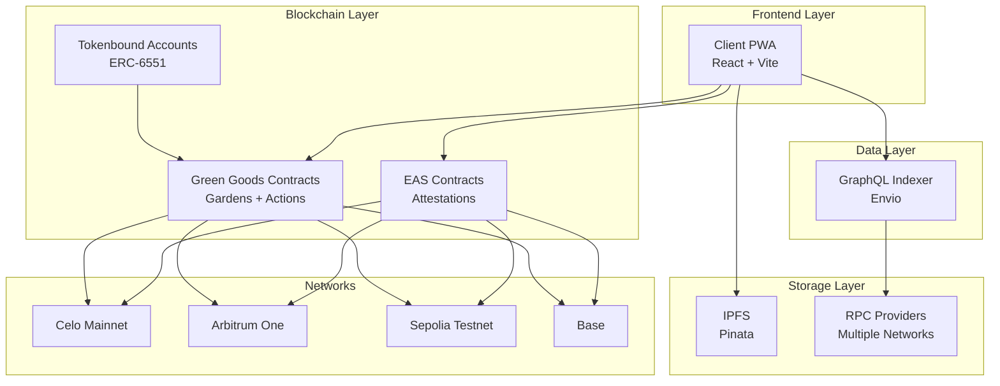
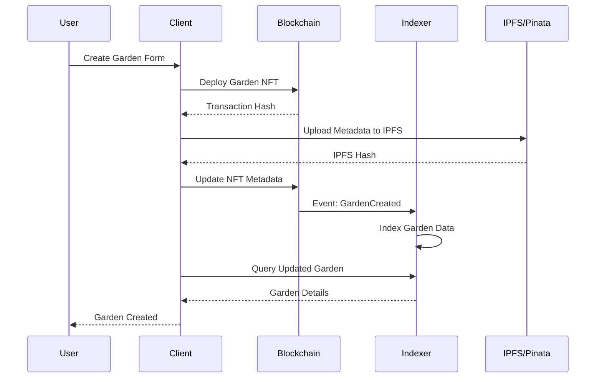
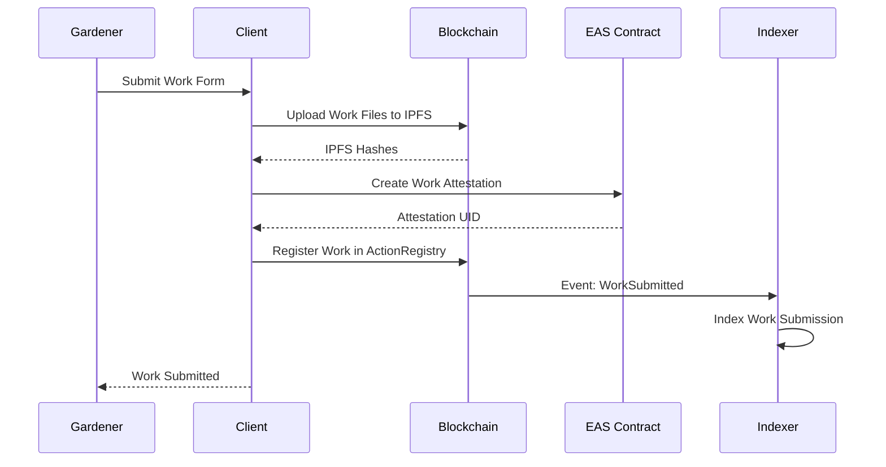
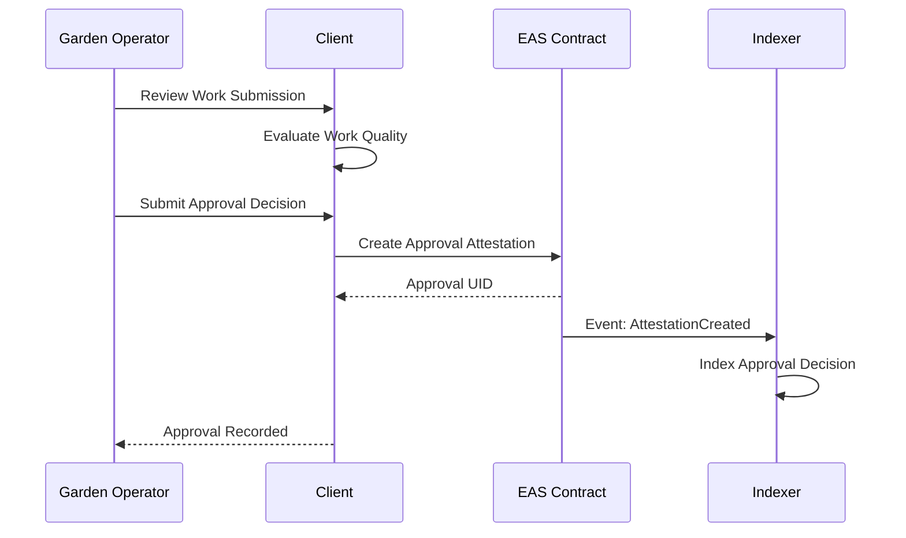

# Green Goods Architecture

This document provides a comprehensive overview of the Green Goods platform architecture, covering all components from the frontend to blockchain infrastructure.

## Quick Overview

- **Client**: React PWA frontend with offline support
- **Indexer**: GraphQL blockchain data indexer (Envio)
- **Contracts**: Solidity smart contracts with EAS integration
- **Networks**: Celo, Arbitrum, Base, Sepolia
- **Storage**: IPFS via Pinata for decentralized file storage

## 🏗️ System Overview

Green Goods is a decentralized platform for biodiversity conservation that enables Garden Operators and Gardeners to document and get approval for conservation work through blockchain-based attestations.

### High-Level Architecture



## 📦 Component Architecture

### Client (Progressive Web App)

**Technology Stack:**
- **Framework**: React 18 with TypeScript
- **Build Tool**: Vite with experimental Rolldown support
- **Styling**: Tailwind CSS v4 + Radix UI primitives
- **State Management**: TanStack Query + React Context
- **Authentication**: Privy for wallet management
- **Blockchain**: Viem + EAS SDK

**Key Features:**
- **PWA Capabilities**: Offline support, installable, mobile-optimized
- **Dynamic Imports**: Lazy-loaded views for optimal performance
- **Bundle Optimization**: 4.4MB main bundle with code splitting
- **Multi-language Support**: English, Spanish, Portuguese

**Component Structure:**
```
src/
├── components/           # Reusable UI components
│   ├── UI/              # Generic components (Button, Card, etc.)
│   ├── Garden/          # Garden-specific components
│   └── Layout/          # Navigation and layout
├── views/               # Main application views
│   ├── Home/            # Garden management hub
│   ├── Garden/          # Garden details and work flows
│   ├── Profile/         # User account management
│   ├── Landing/         # Public landing page
│   └── Login/           # Authentication flow
├── providers/           # React context providers
├── modules/             # Service integrations
├── utils/               # Utility functions
└── types/               # TypeScript definitions
```

### GraphQL Indexer

**Technology Stack:**
- **Framework**: Envio for blockchain indexing
- **Database**: PostgreSQL (managed by Envio)
- **API**: GraphQL with real-time subscriptions
- **Networks**: Multi-chain support (Celo, Arbitrum, Sepolia, Base)

**Data Entities:**
- **Gardens**: NFT-based garden representations
- **Work**: Task submissions with metadata
- **Assessments**: Biodiversity evaluations
- **Work Approvals**: Approval status and feedback
- **Attestations**: EAS-based verifiable credentials

**Event Processing:**
```typescript
// Key blockchain events indexed
- GardenCreated          // New garden registration
- GardenUpdated          // Metadata updates
- WorkSubmitted          // New work submissions
- WorkApproved           // Approval decisions
- AttestationCreated     // EAS attestations
- AttestationRevoked     // Revoked attestations
```

### Smart Contracts

**Contract Architecture:**

1. **Core Contracts**
   - `GardenToken` (ERC-721): Garden NFT with metadata
   - `GardenAccount` (ERC-6551): Tokenbound account implementation
   - `ActionRegistry`: Action definitions and work submissions
   - `DeploymentRegistry`: Network-specific contract addresses

2. **EAS Integration**
   - `WorkResolver`: Custom resolver for work attestations
   - `WorkApprovalResolver`: Custom resolver for approval attestations
   - Schema definitions for structured data

3. **Deployment System**
   - Multi-network deployment with profiles
   - Deterministic addresses using CREATE2
   - Automatic schema deployment and verification

**Supported Networks:**
- **Celo** (42220): Primary production network
- **Arbitrum One** (42161): Secondary production network
- **Sepolia** (11155111): Primary testnet
- **Base** (8453): Additional production network
- **Optimism** (10): Additional production network

## 🔄 Data Flow

### Garden Creation Flow



### Work Submission Flow



### Work Approval Flow



## 🛠️ Development Architecture

### Build System

**Frontend Build Pipeline:**
1. **TypeScript Compilation**: Strict type checking
2. **Vite Bundling**: Fast builds with HMR
3. **Code Splitting**: Dynamic imports for optimal loading
4. **PWA Generation**: Service worker and manifest
5. **Asset Optimization**: Image compression and caching

**Smart Contract Pipeline:**
1. **Foundry Compilation**: Solidity compilation with optimizations
2. **Testing**: Comprehensive test suite with gas reporting
3. **Deployment**: Multi-network deployment with verification
4. **Integration**: Automatic indexer configuration updates

### Quality Assurance

**Code Quality Stack:**
- **Biome**: Fast formatting (35x faster than Prettier)
- **0xlint**: Ultra-fast linting (30ms for entire codebase)
- **Husky**: Automated git hooks for quality checks
- **TypeScript**: Strict type checking across all packages

**Testing Strategy:**
- **Unit Tests**: Vitest for React components and utilities
- **Integration Tests**: Contract integration testing
- **E2E Tests**: Playwright for full user workflows
- **Contract Tests**: Foundry for smart contract logic

### Deployment Strategy

**Multi-Environment Setup:**
- **Development**: Local services with hot reload
- **Staging**: Testnet deployment for integration testing
- **Production**: Mainnet deployment with monitoring

**Infrastructure:**
- **Frontend**: Static hosting (Vercel, Netlify, Railway)
- **Indexer**: Envio Cloud or self-hosted
- **Contracts**: Deployed to multiple EVM networks

## 🔐 Security Architecture

### Authentication & Authorization

**User Authentication:**
- **Privy Integration**: Secure wallet connection and session management
- **Multi-wallet Support**: MetaMask, WalletConnect, email-based wallets
- **Session Management**: Secure token handling and refresh

**Role-based Access:**
- **Garden Operators**: Can approve work submissions
- **Gardeners**: Can submit work and create assessments
- **Public**: Read-only access to garden information

### Smart Contract Security

**Security Measures:**
- **Access Control**: Role-based permissions for critical functions
- **Reentrancy Protection**: SafeERC patterns and checks
- **Input Validation**: Comprehensive parameter validation
- **Upgrade Patterns**: Proxy contracts for safe upgrades

**Audit Considerations:**
- External security audits for production contracts
- Automated security scanning in CI/CD
- Bug bounty program for responsible disclosure

### Data Security

**IPFS Integration:**
- **Pinata Service**: Reliable IPFS pinning with redundancy
- **Content Addressing**: Tamper-proof file storage
- **Access Control**: Private and public content management

**Private Data Handling:**
- **Environment Variables**: Secure API key management
- **Client-side Encryption**: Sensitive data encryption before storage
- **HTTPS Everywhere**: All communications over TLS

## 📊 Performance Architecture

### Frontend Performance

**Optimization Strategies:**
- **Bundle Splitting**: Separate chunks for vendor libraries
- **Lazy Loading**: Dynamic imports for views and components
- **Tree Shaking**: Elimination of unused code
- **Image Optimization**: WebP format and responsive images

**Performance Metrics:**
- **Bundle Size**: 4.4MB main bundle with optimal chunking
- **Load Time**: <3s initial load on 3G networks
- **Core Web Vitals**: Optimized for Google's performance metrics

### Backend Performance

**API Optimization:**
- **Fastify Framework**: High-performance Node.js server
- **Connection Pooling**: Efficient database connections
- **Caching**: Redis for frequently accessed data
- **Rate Limiting**: Protection against abuse

**Indexer Performance:**
- **Real-time Indexing**: Sub-second event processing
- **Query Optimization**: Efficient GraphQL resolvers
- **Database Indexing**: Optimized PostgreSQL schemas
- **Horizontal Scaling**: Multi-instance deployment support

### Blockchain Performance

**Gas Optimization:**
- **Contract Optimization**: Minimal gas usage patterns
- **Batch Operations**: Multiple operations in single transaction
- **Gas Price Monitoring**: Dynamic gas price adjustment
- **Layer 2 Integration**: Reduced costs on Arbitrum and Base

## 🔄 Integration Architecture

### External Services

**Blockchain Infrastructure:**
- **RPC Providers**: Alchemy, Infura, public nodes
- **Block Explorers**: Etherscan family for contract verification
- **Gas Tracking**: Real-time gas price monitoring

**Storage Services:**
- **Pinata**: Primary IPFS provider for file storage
- **Backup Providers**: Secondary IPFS nodes for redundancy

**Authentication Services:**
- **Privy**: Primary authentication and wallet management
- **WalletConnect**: Multi-wallet support protocol

### Inter-component Communication

**Frontend ↔ Blockchain:**
- **Viem**: Type-safe Ethereum client
- **EAS SDK**: Direct attestation creation and querying
- **Contract ABIs**: Type-safe contract interactions

**Frontend ↔ Indexer:**
- **GraphQL**: Efficient data querying with gql.tada
- **Real-time Updates**: Subscriptions for live data
- **Caching**: TanStack Query for intelligent caching

**Contracts ↔ Indexer:**
- **Event Listening**: Real-time blockchain event processing
- **ABI Synchronization**: Automatic contract interface updates
- **Network Configuration**: Multi-chain indexing coordination

## 🚀 Scalability Architecture

### Horizontal Scaling

**Frontend Scaling:**
- **CDN Distribution**: Global content delivery network
- **Edge Caching**: Regional cache for faster access
- **Load Balancing**: Multiple deployment regions

**Backend Scaling:**
- **Microservices**: Independent service scaling
- **Database Sharding**: Horizontal database scaling
- **Queue Systems**: Asynchronous task processing

### Blockchain Scaling

**Multi-chain Strategy:**
- **Primary Networks**: Celo and Arbitrum for main operations
- **Secondary Networks**: Base and Optimism for expansion
- **Testnet Mirrors**: Parallel testing infrastructure

**Data Scaling:**
- **IPFS Distribution**: Decentralized file storage
- **Indexer Scaling**: Multiple indexer instances per network
- **Cache Layers**: Multi-level caching strategy

## 📈 Monitoring & Observability

### Application Monitoring

**Frontend Monitoring:**
- **Error Tracking**: Comprehensive error reporting
- **Performance Monitoring**: Core Web Vitals tracking
- **User Analytics**: Privacy-respecting usage analytics

### Blockchain Monitoring

**Contract Monitoring:**
- **Transaction Tracking**: Deployment and interaction monitoring
- **Gas Usage**: Transaction cost optimization
- **Event Monitoring**: Real-time event processing status

**Network Monitoring:**
- **RPC Health**: Provider reliability tracking
- **Block Progression**: Network synchronization status
- **Error Rates**: Failed transaction analysis

For implementation details, see:
- [Karma GAP Integration](./KARMA_GAP.md)
- [Karma GAP Implementation](./KARMA_GAP_IMPLEMENTATION.md)
- [Contract Upgrades](./UPGRADES.md)
- [Deployment Guide](./DEPLOYMENT.md)
- Individual package READMEs: [client](../packages/client/README.md), [contracts](../packages/contracts/README.md), [indexer](../packages/indexer/README.md) 