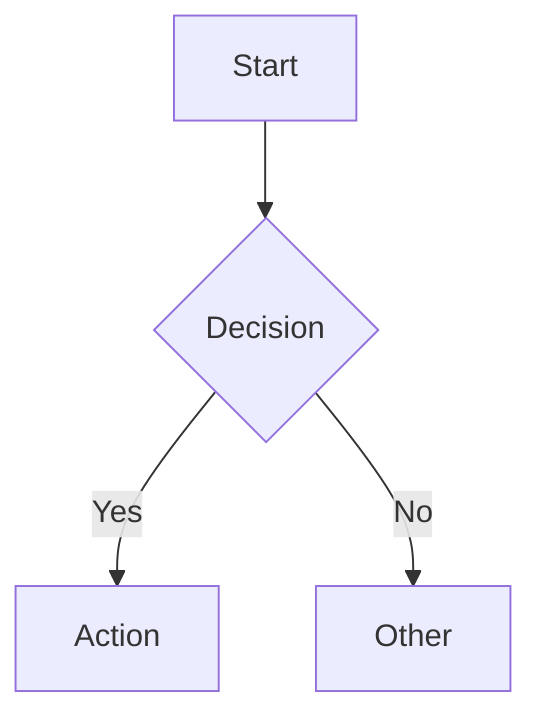

# Green Goods Documentation

This directory contains the Green Goods documentation site built with [Docusaurus](https://docusaurus.io/).

## Local Development

```bash
# From repository root
bun docs:dev

# Or from this directory
cd docs && bun start
```

This command starts a local development server and opens up a browser window. Most changes are reflected live without having to restart the server.

## Build

```bash
# From repository root
bun docs:build

# Or from this directory
cd docs && bun run build
```

This command generates static content into the `build` directory and can be served using any static contents hosting service.

## Deployment

The documentation site is configured for deployment to:
- GitHub Pages
- Vercel
- Netlify
- Any static hosting service

See [Docusaurus deployment docs](https://docusaurus.io/docs/deployment) for detailed instructions.

## Structure

```
docs/
├── docs/              # Documentation content (Markdown)
│   ├── welcome/       # Getting started guides
│   ├── concepts/      # Core concepts
│   ├── features/      # Product features
│   ├── guides/        # How-to guides by role
│   ├── developer/     # Developer documentation
│   └── reference/     # FAQ, glossary, credits
├── blog/              # Blog posts (optional)
├── src/               # Custom React components
├── static/            # Static assets (images, etc.)
├── docusaurus.config.ts  # Site configuration
└── sidebars.ts        # Sidebar navigation structure
```

## Adding Content

### New Documentation Page

1. Create a new `.md` file in the appropriate directory under `docs/`
2. Add frontmatter with metadata:
   ```markdown
   ---
   sidebar_position: 3
   title: My Page Title
   ---
   
   # My Page Title
   
   Content here...
   ```
3. Add the page to `sidebars.ts` if you want custom positioning

### New Blog Post

1. Create a new `.md` file in `blog/` with the format: `YYYY-MM-DD-post-title.md`
2. Add frontmatter:
   ```markdown
   ---
   slug: post-title
   title: Post Title
   authors: [username]
   tags: [release, feature]
   ---
   
   Content here...
   ```

## Documentation Guidelines

- **Markdown files**: Use standard Markdown with optional frontmatter
- **Links**: Use relative links without `.md` extension (e.g., `[link](../concepts/roles)`)
- **Images**: Store in `static/img/` and reference as `/img/filename.png`
- **Mermaid diagrams**: Fully supported - wrap in ` ```mermaid ` code blocks
- **Code blocks**: Specify language for syntax highlighting

## Mermaid Diagram Support

Mermaid diagrams are enabled. Example:

````markdown

````

For complex diagrams, consider using the ELK layout algorithm (requires `@mermaid-js/layout-elk`).

## Contributing

See [Contributing to Documentation](https://github.com/greenpill-dev-guild/green-goods/tree/main/docs/docs/developer/docs-contributing.md) for the full workflow and style guide.

## Troubleshooting

### Build Errors

```bash
# Clear cache and rebuild
rm -rf .docusaurus build
bun run build
```

### Broken Links

Run the build - Docusaurus will report all broken links and throw an error. Fix them before deploying.

### Port Already in Use

```bash
# Kill process on port 3000
lsof -i :3000
kill -9 <PID>
```

## Resources

- [Docusaurus Documentation](https://docusaurus.io/docs)
- [Markdown Features](https://docusaurus.io/docs/markdown-features)
- [Docusaurus Configuration](https://docusaurus.io/docs/api/docusaurus-config)
