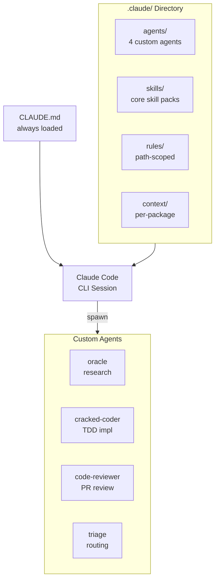

import {NextBestAction} from "@site/src/components/docs";

# Claude Code



Primary agentic development tool for Green Goods. Claude Code operates as a CLI-based AI assistant with deep project context, custom agents for specialized tasks, and a skill system for repeatable workflows. It is the main development interface for the team.

## How We Use It

- **Daily development** -- feature implementation, bug fixing, refactoring, code review, and documentation via the Claude Code CLI
- **CLAUDE.md** provides project-wide context that is always loaded: commands, architecture, key patterns, error handling conventions, git workflow, and build order
- **Custom agents** handle specialized workstreams that benefit from focused prompts and isolated context
- **Skills** encode common workflows (plan, debug, review, audit) as reusable prompt templates
- **Multi-agent teams** coordinate parallel work across packages using the TeamCreate skill

### Custom Agents

Four specialized agents are defined in `.claude/agents/`:

| Agent | Purpose |
|-------|---------|
| **oracle** | Architecture questions, codebase investigation, documentation |
| **cracked-coder** | Complex implementation with mandatory TDD, three-strike protocol |
| **code-reviewer** | PR review, audit, security analysis (always uses Opus model) |
| **triage** | Issue triage, bug categorization, priority assignment |

Story creation now routes through the `ui` skill. Cross-package breaking work now routes through `/plan` + `ops/migration` instead of a dedicated migration agent.

**Model selection matters**: Opus is required for any task requiring judgment (reviews, audits, architecture analysis). Haiku is only appropriate for simple lookups and factual queries -- it produces unacceptable false-positive rates on code review tasks.

## Configuration

The `.claude/` directory contains all agentic configuration:

```
.claude/
  agents/           # 4 custom agent definitions (.md files)
  context/          # Per-package and product context files
  evals/            # Runnable agent evals plus acceptance cases
  registry/         # Skill bundles and activation maps
  rules/            # Conditional rules loaded by file path
  scripts/          # Guidance and workflow checks
  settings.json     # Canonical Claude Code settings, hooks, env flags
  skills/           # Repo-local skill definitions organized by domain
    index.md        # Master skill index
    plan/           # Planning workflows
    debug/          # Debugging workflows
    review/         # Code review workflows
    audit/          # Security and quality audits
    contracts/      # Solidity-specific skills
    ...
  specs/            # Reusable task templates
```

Use `.plans/` for live plan hubs. `.claude/specs/` is reference-only and should not be used as a feature backlog.

`.claude/settings.json` is the canonical configuration surface for Claude Code in this repo, including hooks, environment flags, enabled plugins, and teammate mode.

**`CLAUDE.md`** (project root) is the primary context file, always loaded into every conversation. It defines:
- Build commands and package scripts
- Architecture principles and package boundaries
- Key patterns (hook boundary, barrel imports, error handling, query keys)
- Contract deployment workflow
- Git conventions (branch naming, commit format)
- Session continuity protocol

**`AGENTS.md`** is a compact runtime contract for automated agents, defining non-negotiable invariants and scope constraints.

## Patterns and Workflows

### Subagent discipline

Spawn teammates (subagents) when tasks can run in parallel, require isolated context, or involve independent workstreams. Work directly (no subagent) for single-file edits, sequential operations, or tasks needing fewer than 10 tool calls.

### Session continuity

Before context compaction or ending a long session, write a `session-state.md` capturing:
- Current task and progress
- Files modified and test status
- Next steps and blockers

For TDD workflows, also write `tests.json` with structured test state (total/passed/failed, failure details, hypotheses, next actions).

### Investigation protocol

Never speculate about code you haven't read. If referencing a specific file, read it first. This prevents hallucinated API suggestions and incorrect pattern assumptions.

### Three-strike protocol (cracked-coder agent)

1. **Strike 1**: Reassess approach, check assumptions
2. **Strike 2**: Question architecture, consider alternatives
3. **Strike 3**: STOP and escalate. Document what was tried.

### Team coordination

Multi-agent teams use the TeamCreate skill to spin up parallel workstreams. Each agent gets a focused task brief, and the team lead coordinates through the task system. Teams are used for large refactors, cross-package workstreams, and documentation sprints.

## References

- [Claude Code Documentation](https://docs.anthropic.com/en/docs/claude-code) -- official CLI docs
- [Core Philosophies](/builders/agentic/core-philosophies) -- agentic development principles

<NextBestAction
  title="Next best action"
  why="Compare with another AI coding tool used in the project."
  actionLabel="Codex"
  actionHref="./codex"
  alternatives={[
    {label: "OpenClaw", href: "./openclaw"},
    {label: "MCP Guide", href: "./mcp-guide"},
  ]}
/>
