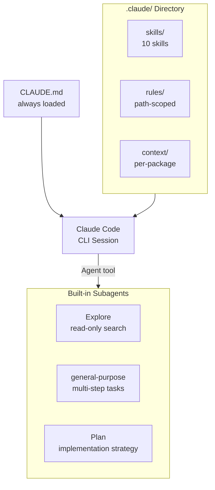

import {NextBestAction} from "@site/src/components/docs";

# Claude Code


```mermaid
graph TB
    subgraph Config[".claude/ Directory"]
        Skills["skills/\n10 skills"]
        Rules["rules/\npath-scoped"]
        Context["context/\nper-package"]
    end

    CLAUDE["CLAUDE.md\nalways loaded"] --> Session["Claude Code\nCLI Session"]
    Config --> Session

    subgraph Subagents["Built-in Subagents"]
        Explore["Explore\nread-only search"]
        General["general-purpose\nmulti-step tasks"]
        PlanAgent["Plan\nimplementation strategy"]
    end

    Session -->|Agent tool| Subagents
```

Primary agentic development tool for Green Goods. Claude Code operates as a CLI-based AI assistant with deep project context, built-in subagents for parallel and isolated work, and a lean skill system for repeatable workflows. It is the main development interface for the team.

## How We Use It

- **Daily development** -- feature implementation, bug fixing, refactoring, code review, and documentation via the Claude Code CLI
- **CLAUDE.md** provides project-wide context that is always loaded: commands, architecture, key patterns, error handling conventions, git workflow, and build order
- **Built-in subagents** handle parallel research and isolated workstreams, spawned per-task via the Agent tool
- **Skills** encode procedural workflows (review, ship, audit, qa-triage) with real orchestration; domain knowledge lives in `.claude/context/*.md` and `docs/` instead
- **Multi-agent teams** coordinate parallel work across packages through the `plan` skill's team lanes and the `.plans/` hub

### Subagents

The repo no longer commits custom agent definitions. Earlier iterations kept `.claude/agents/` files (most recently `cracked-coder` and `oracle`); the lean-skills consolidation retired them on the principle that stronger models need less scaffolding -- a task-scoped prompt to a built-in subagent type does the same job without a second home for guidance to drift in. Claude Code's built-in types cover the same ground:

| Built-in type | Use |
|-------|---------|
| **Explore** | Read-only fan-out search when only the conclusion matters, not the file dumps |
| **general-purpose** | Multi-step research or implementation tasks needing isolated context |
| **Plan** | Implementation-strategy design for a bounded task |

Each dispatch carries its own task-scoped prompt (paths, acceptance criteria, validation commands); durable knowledge stays in `CLAUDE.md`, `.claude/context/*.md`, and `docs/` rather than in per-agent spec files. The three-strike escalation protocol that `cracked-coder` carried now lives in the `debug` skill.

**Model selection matters**: Opus is required for any task requiring judgment (reviews, audits, architecture analysis). Haiku is only appropriate for simple lookups and factual queries -- it produces unacceptable false-positive rates on code review tasks.

## Configuration

The `.claude/` directory contains all agentic configuration:

```
.claude/
  skills/           # 10 skills -- the filesystem + SKILL.md frontmatter is the registry
    review/         # Full change review: regressions -> gaps -> production quality -> verdict
    ship/           # Pre-merge gate (format, lint, test, build, branch safety)
    status/         # Session resumption and quick orientation
    plan/           # Planning lifecycle: .plans hub + Codex lanes (passive)
    debug/          # Debugging workflows, incl. the three-strike protocol (passive)
    clean/          # 8-subagent codebase cleanup
    audit/          # Repo-health audit + drift classifier (/audit drift)
    qa-triage/      # Build sync QA notes -> Linear records + QA-sheet rows
    doc-feedback/   # Google Doc review feedback processing
    design/         # Design direction + implementation (design/implementation.md)
  rules/            # Conditional rules loaded by file path
    typescript.md   # TypeScript conventions (error handling, Address type, barrel imports)
    frontend-design.md  # UI/UX rules for admin dashboard
    contracts.md    # Solidity rules (always use bun scripts, never raw forge)
    react-patterns.md   # Hook and component conventions
    indexer.md      # Envio handler conventions
  context/          # Per-package context files
    shared.md       # Hook boundary, query keys, module patterns
    client.md       # PWA, offline-first, service worker
    admin.md        # Dashboard, operator workflows
    contracts.md    # Deploy scripts, resolver patterns
    indexer.md      # Envio handlers, event mapping
    agent.md        # Bot automation, Telegram integration
    testing.md      # Test patterns and TDD conventions (absorbed the old testing skill)
    validation-pipeline.md   # Single definition of the validation gate commands
    linear-routing-rules.md  # Shared Linear routing contract for all skills
    ...             # product.md, values.md, linear-project-template.md, ontology.md
  scripts/          # Hook helpers and Codex lane dispatch
  loop.md           # Maintenance loop: guidance consistency, stale references, build health
  launch.json       # Dev-server launch configs for the browser preview
  settings.json     # Claude Code project settings and tool hooks
```

There is no separate skills registry, index file, or per-skill version ceremony -- each skill's `SKILL.md` frontmatter description is what triggers it, and the filesystem is the count of record. Six skills are user-invocable slash commands advertised in the session banner (`/review /status /audit /clean /qa-triage /doc-feedback`); `plan` and `debug` fire passively from intent, and `ship` and `design` load when their triggers appear. The curated PostHog question library moved to `docs/routines/posthog-questions.md` -- it is a data dictionary, not a procedure. `.agents/skills` is a symlink to `.claude/skills`, so Codex sees the same set. `bun run check:codex-guidance` keeps Codex guidance in parity, and `scripts/quality/check-guidance-links.mjs` (run locally via `bun run drift:check` and in CI by the supply-chain workflow's guidance job) enforces link integrity, retired-name hygiene, and banner/frontmatter parity.

**`CLAUDE.md`** (project root) is the primary context file, always loaded into every conversation. It defines:
- Build commands and package scripts
- Architecture principles and package boundaries
- Key patterns (hook boundary, barrel imports, error handling, query keys)
- Contract deployment workflow
- Git conventions (branch naming, commit format)
- Session continuity protocol

**`AGENTS.md`** is a compact runtime contract for automated agents, defining non-negotiable invariants and scope constraints.

## Patterns and Workflows

### Subagent discipline

Spawn teammates (subagents) when tasks can run in parallel, require isolated context, or involve independent workstreams. Work directly (no subagent) for single-file edits, sequential operations, or tasks needing fewer than 10 tool calls.

### Session continuity

Before context compaction or ending a long session, write a `session-state.md` capturing:
- Current task and progress
- Files modified and test status
- Next steps and blockers

For TDD workflows, also write `tests.json` with structured test state (total/passed/failed, failure details, hypotheses, next actions).

### Investigation protocol

Never speculate about code you haven't read. If referencing a specific file, read it first. This prevents hallucinated API suggestions and incorrect pattern assumptions.

### Research-plan-implement loop

For ambiguous, multi-package, or high-risk work, run an explicit research phase first -- the built-in Explore and general-purpose subagents fan out well here -- then record evidence and human judgment points in the relevant `.plans/` hub before implementation.

### Three-strike protocol (debug skill)

The `debug` skill codifies the escalation ladder for failed fixes:

1. **Strike 1**: Reassess approach, check assumptions
2. **Strike 2**: Question architecture, consider alternatives
3. **Strike 3**: STOP and escalate. Document what was tried.

### Team coordination

Multi-agent teams spin up through the `plan` skill, which fires passively when you describe orchestration intent ("parallel lanes", "coordinate a team") and coordinates mixed Claude + Codex lanes through the `.plans/` hub. Each agent gets a focused task brief, and the coordinator runs validation checkpoints. Teams are used for large refactors, cross-package migrations, and documentation sprints.

## References

- [Claude Code Documentation](https://docs.anthropic.com/en/docs/claude-code) -- official CLI docs
- [Core Philosophies](/builders/agentic/core-philosophies) -- agentic development principles

<NextBestAction
  title="Next best action"
  why="Compare with another AI coding tool used in the project."
  actionLabel="Codex"
  actionHref="./codex"
  alternatives={[
    {label: "Gemini", href: "./gemini"},
    {label: "MCP Guide", href: "./mcp-guide"},
  ]}
/>
