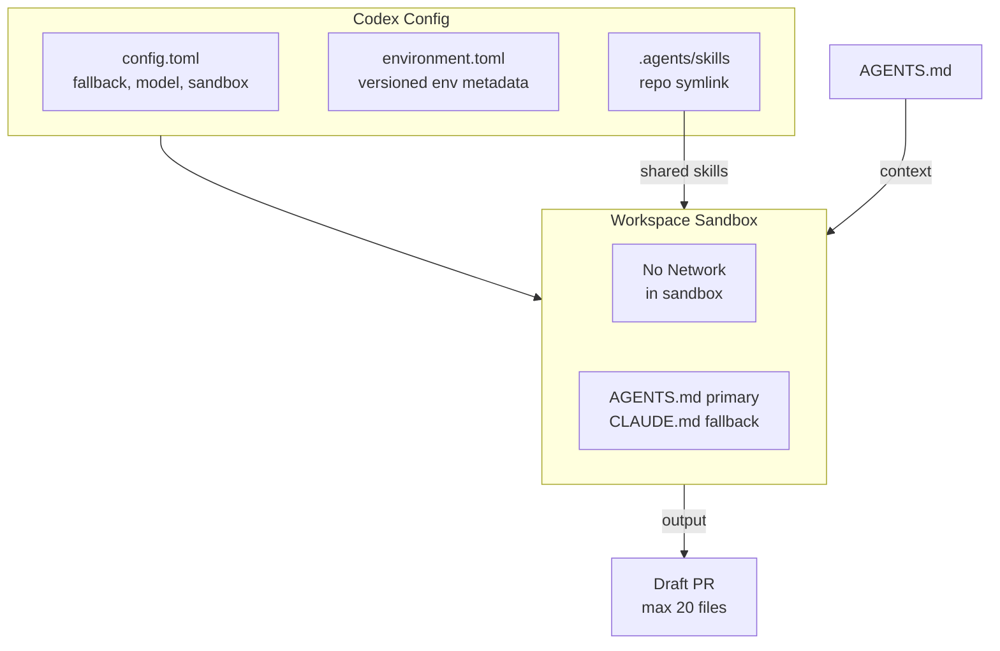

import {NextBestAction} from "@site/src/components/docs";

# Codex



OpenAI Codex is used for automated maintenance tasks in the Green Goods monorepo. The repo-scoped configuration is intentionally small: `AGENTS.md` is the primary context, `CLAUDE.md` is the fallback, the default model is GPT-5.4, and the workspace-write sandbox disables network access.

## Configuration

### `config.toml`

The main Codex configuration lives at `.codex/config.toml`:

```toml
# Use CLAUDE.md as context (AGENTS.md is the primary, CLAUDE.md is fallback)
project_doc_fallback_filenames = ["CLAUDE.md"]
project_doc_max_bytes = 40960

# Default model for automated tasks
model = "gpt-5.4"

# Sandbox: no network access during agent execution
[sandbox_workspace_write]
network_access = false
```

Key settings:
- **`project_doc_fallback_filenames`** -- Codex reads `AGENTS.md` by default; falls back to `CLAUDE.md` for directories without an `AGENTS.md`
- **`project_doc_max_bytes`** -- Up to 40 KB of project guidance is loaded when fallback docs are needed
- **`model`** -- `gpt-5.4` is the current project default for automation runs
- **`network_access = false`** -- The workspace-write sandbox has no internet access during execution

### Environment Metadata (`environment.toml`)

The checked-in environment file currently records only the environment identity:

```toml
version = 1
name = "green-goods"

[setup]
script = ""
```

There is no project-scoped bootstrap script defined in `.codex/environments/environment.toml` at the moment. Any additional setup is handled outside this file.

## Use Cases

Codex is used for tasks that benefit from sandboxed, automated execution:

- **Mechanical transforms** -- Renaming variables, updating imports across files
- **Test generation** -- Generating initial test scaffolds from existing patterns
- **Lint fixes** -- Automated formatting and lint rule application
- **Documentation updates** -- Updating code references in docs after refactors

## Scope Constraints

When running automated maintenance tasks via Codex (or any automated agent), constraints from `AGENTS.md` apply:

- Max 20 files changed per PR
- Never touch deployment scripts, contract upgrade scripts, or `.env` files
- Do not create new packages or top-level directories
- Do not modify `CLAUDE.md`, `AGENTS.md`, or files in `.claude/`
- All automated PRs must be created as drafts with appropriate labels

## Skills Discovery

Codex can discover the shared skill library through the repo symlink:

```bash
.agents/skills -> ../.claude/skills
```

This keeps the Codex-visible skill path aligned with the same `.claude/skills/` tree used by Claude Code.

## Relationship to Claude Code

Codex and Claude Code serve complementary roles:

| Aspect | Claude Code | Codex |
|--------|-------------|-------|
| Context source | `CLAUDE.md` + `.claude/` | `AGENTS.md` + `.codex/` |
| Execution | Local machine | Automated workspace task |
| Network | Full access | None (agent phase) |
| Model | Claude Opus/Sonnet/Haiku | GPT-5.4 |
| Best for | Interactive development | Automated maintenance |
| Memory | Session artifacts + tool-local conventions | Thread/automation memory |

<NextBestAction
  title="Next best action"
  why="Learn about the custom agentic pipeline for meeting-to-action workflows."
  actionLabel="OpenClaw"
  actionHref="./openclaw"
  alternatives={[
    {label: "Claude Code", href: "./claude-code"},
    {label: "Gemini", href: "./gemini"},
  ]}
/>
