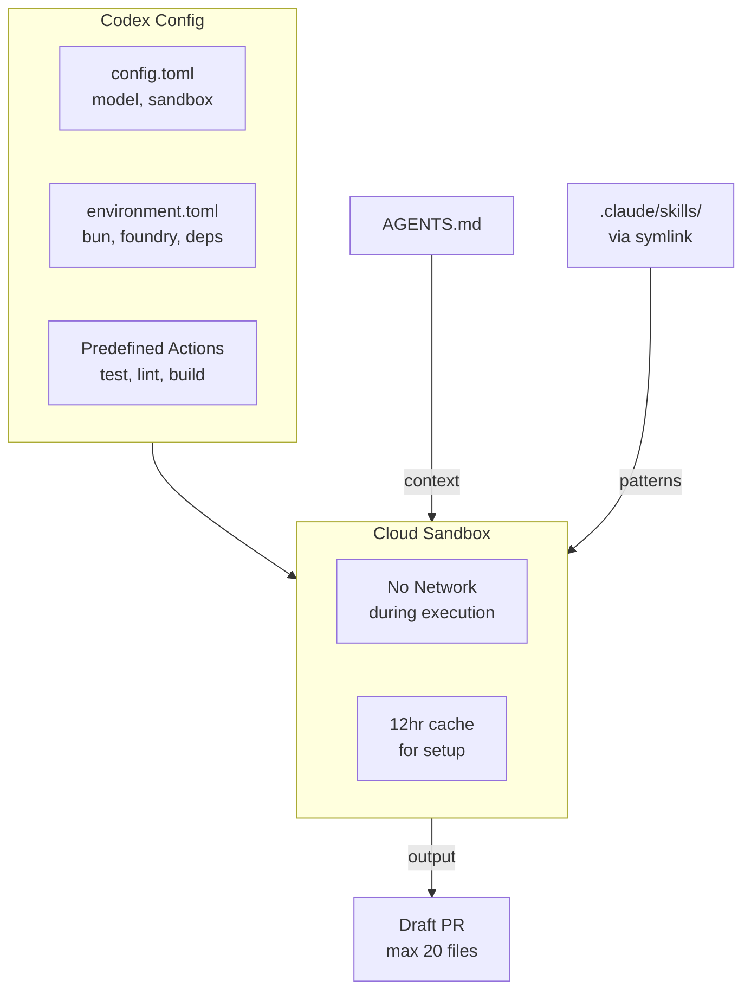

import {NextBestAction} from "@site/src/components/docs";

# Codex



OpenAI Codex is used for automated maintenance tasks in the Green Goods monorepo. It runs in a sandboxed environment with no network access during agent execution, while setup and maintenance scripts retain network access for dependency installation.

## Configuration

### `config.toml`

The main Codex configuration lives at `.codex/config.toml`:

```toml
# AGENTS.md files are primary. CLAUDE.md is only a fallback for directories
# without a local AGENTS.md.
project_doc_fallback_filenames = ["CLAUDE.md"]
project_doc_max_bytes = 40960

# Default model for automated tasks
model = "gpt-5.4"
model_reasoning_effort = "xhigh"

# Sandbox: no network access during agent execution
[sandbox_workspace_write]
network_access = false
```

Key settings:
- **`project_doc_fallback_filenames`** -- Codex reads the nearest `AGENTS.md` by default and only falls back to `CLAUDE.md` for directories without local Codex guidance
- **`model`** -- `gpt-5.4` is the default model for repository tasks.
- **`model_reasoning_effort`** -- `xhigh` is the default reasoning level.
- **`network_access = false`** -- The agent sandbox has no internet access, improving safety for automated tasks. Setup scripts retain network access for dependency installation.

### Environment Setup (`environment.toml`)

The cloud environment at `.codex/environments/environment.toml` defines one-time setup:

```toml
[setup]
script = """
# Install Bun (primary runtime)
curl -fsSL https://bun.sh/install | bash

# Install Node.js because repo scripts invoke `node` and `npx` directly
# ...

# Install Foundry (Solidity toolchain)
curl -L https://foundry.paradigm.xyz | bash
foundryup

# Initialize submodules, install deps, build foundation
git submodule update --init --recursive
bun install
VITE_CHAIN_ID=${VITE_CHAIN_ID:-11155111} bun run build:contracts
VITE_CHAIN_ID=${VITE_CHAIN_ID:-11155111} bun run build:shared

# Create skills symlink for Codex discovery
mkdir -p .agents
[ -L .agents/skills ] || ln -s ../.claude/skills .agents/skills
"""
```

The setup installs Bun, Node.js, and Foundry, initializes git submodules, installs dependencies with Bun, builds the foundation packages (`contracts -> shared`), and creates the `.agents/skills` symlink. This is cached for up to 12 hours.

### Predefined Actions

Codex exposes a small validation ladder directly in the cloud environment:

| Action | Command |
|--------|---------|
| Quick Verify | `node scripts/ci-local.js --quick` |
| Test Quality | `bash scripts/check-test-quality.sh` |
| Codex Drift | `node scripts/check-codex-consistency.js` |
| Test | `bun run test` |
| Lint Check | `bun run format:check && bun lint` |
| Lint Fix | `bun format && bun lint` |
| Build | `VITE_CHAIN_ID=11155111 bun run build` |

`Quick Verify` is the preferred first pass for Codex because it catches format, lint, typecheck,
and the fast package test path without paying the full monorepo cost up front.

## Use Cases

Codex is used for tasks that benefit from sandboxed, automated execution:

- **Mechanical transforms** -- Renaming variables, updating imports across files
- **Test generation** -- Generating initial test scaffolds from existing patterns
- **Lint fixes** -- Automated formatting and lint rule application
- **Documentation updates** -- Updating code references in docs after refactors

## Context Layout

Codex guidance is now layered to reduce fallback behavior:

- Root `AGENTS.md` defines repo-wide invariants and the validation ladder
- Package-local `AGENTS.md` files in `shared`, `client`, `admin`, `agent`, `indexer`, and `contracts` define package-specific rules
- `CLAUDE.md` remains available only as fallback context for uncovered directories

CI validates the Codex layer with `node scripts/check-codex-consistency.js`, which checks
action-table drift, package guide coverage, and package-guide command validity.

## Scope Constraints

When running automated maintenance tasks via Codex (or any automated agent), constraints from `AGENTS.md` apply:

- Max 20 files changed per PR
- Never touch deployment scripts, contract upgrade scripts, or `.env` files
- Do not create new packages or top-level directories
- Do not modify `AGENTS.md`, `.codex/**`, `CLAUDE.md`, or files in `.claude/` unless explicitly requested
- All automated PRs must be created as drafts with appropriate labels

## Skills Discovery

Codex discovers skills through a symlink:

```bash
# Created during environment setup
ln -s ../.claude/skills .agents/skills
```

This makes the same skill library available to Codex that Claude Code agents use, ensuring consistent patterns across both toolchains.

## Relationship to Claude Code

Codex and Claude Code serve complementary roles:

| Aspect | Claude Code | Codex |
|--------|-------------|-------|
| Context source | `CLAUDE.md` + `.claude/` | `AGENTS.md` + `.codex/` |
| Execution | Local machine | Cloud sandbox |
| Network | Full access | None (agent phase) |
| Model | Claude Opus/Sonnet | GPT-5.4 (`xhigh` default reasoning) |
| Best for | Interactive development, UI, multi-file refactors | Hooks, stores, tests, mechanical transforms |
| Memory | Persistent per-agent | Per-session |

<NextBestAction
  title="Next best action"
  why="Learn about the custom agentic pipeline for meeting-to-action workflows."
  actionLabel="OpenClaw"
  actionHref="./openclaw"
  alternatives={[
    {label: "Claude Code", href: "./claude-code"},
    {label: "Gemini", href: "./gemini"},
  ]}
/>
