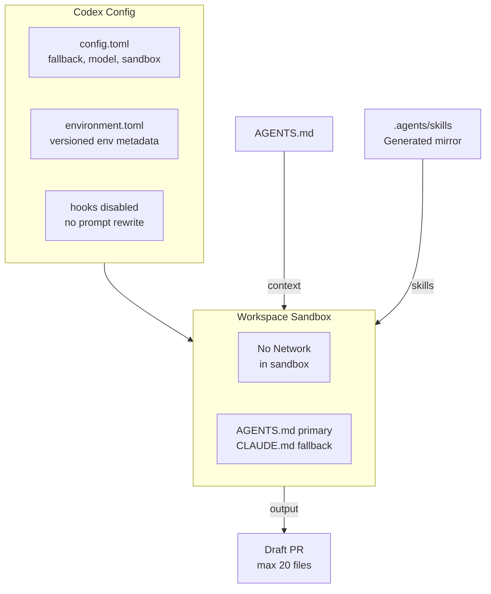

import {NextBestAction} from "@site/src/components/docs";

# Codex



OpenAI Codex is used for automated maintenance tasks in the Green Goods monorepo. The repo-scoped configuration is intentionally small: `AGENTS.md` is the primary context, `CLAUDE.md` is the fallback, the default model is GPT-5.5, Codex hooks are disabled by default, and the workspace-write sandbox disables network access.

## Configuration

### `config.toml`

The main Codex configuration lives at `.codex/config.toml`:

```toml
# Use CLAUDE.md as context (AGENTS.md is the primary, CLAUDE.md is fallback)
project_doc_fallback_filenames = ["CLAUDE.md"]
project_doc_max_bytes = 40960

# Default model for automated tasks
model = "gpt-5.5"
model_reasoning_effort = "xhigh"

[features]
codex_hooks = false

# Sandbox: no network access during agent execution
[sandbox_workspace_write]
network_access = false
```

Key settings:
- **`project_doc_fallback_filenames`** -- Codex reads `AGENTS.md` by default; falls back to `CLAUDE.md` for directories without an `AGENTS.md`
- **`project_doc_max_bytes`** -- Up to 40 KB of project guidance is loaded when fallback docs are needed
- **`model`** -- `gpt-5.5` is the current project default for automation runs
- **`codex_hooks = false`** -- prompt-submit rewriting is intentionally disabled; prompts are interpreted directly against `AGENTS.md`, package guides, and `.plans/`
- **`network_access = false`** -- The workspace-write sandbox has no internet access during execution

### Environment Metadata (`environment.toml`)

The checked-in environment file currently records only the environment identity:

```toml
version = 1
name = "green-goods"

[setup]
script = ""
```

There is no project-scoped bootstrap script defined in `.codex/environments/environment.toml` at the moment. Any additional setup is handled outside this file.

### Hooks

No project Codex hooks are currently registered. The previous prompt-submit normalization hook was removed because it could infer task contracts from pasted source material instead of the user's actual request. The shared rules live in `AGENTS.md`, package-local `AGENTS.md`, `.plans/`, and the builder docs.

## Use Cases

Codex is used for tasks that benefit from sandboxed, automated execution:

- **Mechanical transforms** -- Renaming variables, updating imports across files
- **Test generation** -- Generating initial test scaffolds from existing patterns
- **Lint fixes** -- Automated formatting and lint rule application
- **Documentation updates** -- Updating code references in docs after refactors

## Scope Constraints

When running automated maintenance tasks via Codex (or any automated agent), constraints from `AGENTS.md` apply:

- Max 20 files changed per PR
- Never touch deployment scripts, contract upgrade scripts, or `.env` files
- Do not create new packages or top-level directories
- Do not modify `CLAUDE.md`, `AGENTS.md`, or files in `.claude/`
- All automated PRs must be created as drafts with appropriate labels

## Skills Discovery

Codex discovers skills from its standard locations (`$HOME/.agents/skills`, bundled, admin paths, and the repo-scoped `.agents/skills` tree when present). Green Goods keeps Claude and Codex on the same shared skill surface through a generated mirror:

- Canonical source: `.claude/skills`
- Codex-visible mirror: `.agents/skills`
- Regenerate mirror: `bun run skills:sync`
- Check mirror drift: `bun run check:skills`

Do not hand-edit `.agents/skills`; changes there will be overwritten by the sync script. Do not replace `.agents/skills` with a symlink. A symlink would remove copy drift, but it also means accidental Codex skill imports or experiments under `.agents/skills` can mutate the canonical Claude tree directly.

For design-system work, Codex should still follow the repo design source path explicitly: start with `AGENTS.md`, then read the root `DESIGN.md`, the affected surface `DESIGN.md`, `.agents/skills/design/ARCHITECTURE.md`, and the relevant Storybook or package builder doc before editing UI.

## Relationship to Claude Code

Codex and Claude Code serve complementary roles:

| Aspect | Claude Code | Codex |
|--------|-------------|-------|
| Context source | `CLAUDE.md` + `.claude/` | `AGENTS.md` + `.codex/` |
| Execution | Local machine | Automated workspace task |
| Network | Full access | None (agent phase) |
| Model | Claude Opus/Sonnet/Haiku | GPT-5.5 |
| Best for | Interactive development | Automated maintenance |
| Memory | Session artifacts + tool-local conventions | Thread/automation memory |

<NextBestAction
  title="Next best action"
  why="Review the external AI reference page without treating it as project-local automation."
  actionLabel="Gemini"
  actionHref="./gemini"
  alternatives={[
    {label: "Claude Code", href: "./claude-code"},
    {label: "MCP Guide", href: "./mcp-guide"},
  ]}
/>
