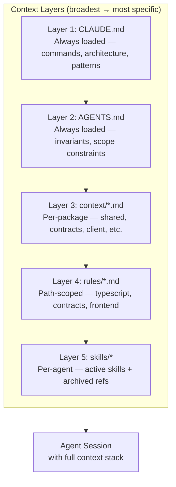

import {NextBestAction} from "@site/src/components/docs";

# Context Engineering



Context engineering is how we structure project knowledge so AI agents can work effectively with the Green Goods codebase. This goes beyond a single prompt -- it is the architecture of information that surrounds every agent interaction.

## The `.claude/` Directory

The `.claude/` directory is the central guidance store for agent tooling, paired with root `.plans/`
as the durable repo-truth planning and execution hub:

```
.claude/
  agents/          # Committed agent specifications (currently cracked-coder and oracle)
  context/         # Package and domain context files
  rules/           # Path-scoped coding rules
  skills/          # 19 active top-level skill dirs + _archived references
  registry/        # Skill bundles and activation configs
  scripts/         # Guidance consistency checks
  specs/           # Detailed feature specifications
  standards/       # Code standards documentation
  evals/           # Agent evaluation criteria
  hooks.json       # Tool execution hooks
  settings.json    # Global agent settings

.plans/            # Durable feature hub for briefs, specs, plan.todo, status, evals, and handoffs
```

## Context Layers

Context is loaded in layers, from broadest to most specific:

### Layer 1: `CLAUDE.md` (Always Loaded)

The root `CLAUDE.md` provides universal project context: commands, architecture, key patterns, git workflow, and non-negotiable rules. Every agent session starts with this context. Keep it under 4KB.

### Layer 2: `AGENTS.md` (Always Loaded)

A compact runtime contract for all agents -- non-negotiable invariants, code conventions, scope constraints, and pointers to canonical sources. Tools like OpenAI Codex use this as their primary context file.

### Layer 3: Package Context (`.claude/context/*.md`)

Loaded based on which files the agent is working with:

| File | Loaded When |
|------|-------------|
| `shared.md` | Editing `packages/shared/` |
| `contracts.md` | Editing `packages/contracts/` |
| `client.md` | Editing `packages/client/` |
| `admin.md` | Editing `packages/admin/` |
| `agent.md` | Editing `packages/agent/` |
| `indexer.md` | Editing `packages/indexer/` |
| `intent.md` | Making prioritization or UX decisions |
| `values.md` | Resolving conflicts between constraints |
| `product.md` | Feature planning and requirements |

### Layer 4: Rules (`.claude/rules/*.md`)

Path-scoped rules loaded conditionally based on the files being edited:

- `contracts.md` -- Solidity conventions, bun script requirements
- `typescript.md` -- Error handling, Address type, barrel imports
- `react-patterns.md` -- Hook patterns, component conventions
- `frontend-design.md` -- UI primitives, theme tokens, accessibility

### Layer 5: Skills (Loaded Per-Agent)

Each agent's specification lists the skills it needs. Skills provide detailed how-to instructions for specific domains.

## Session Continuity

### Repository Memory Surfaces

This repository does not currently commit a repo-authoritative `.claude/agent-memory/` tree. In-repo
continuity currently comes from checkpoint artifacts such as `session-state.md`, `tests.json`,
`.plans/`, and automation memory files outside the repo.

Treat any tool-local memory store as environment-specific unless it is explicitly checked into the
repository. `.plans/` is the durable repo truth for feature state, handoffs, and automation context;
`session-state.md` and `tests.json` are disposable local checkpoints and should not outrank the active
feature hub.

Do not promote `.claude/agent-memory/` into committed repo truth until freshness, expiry, and
ownership rules exist for that surface.

### Session State

For long sessions, agents may checkpoint local progress to `session-state.md`:

```markdown
## Session State
- **Current task**: [description]
- **Progress**: [what's done]
- **Files modified**: [list]
- **Tests**: [passing/failing/not written]
- **Next steps**: [immediate actions]
```

This enables context recovery after compaction or session handoff.

## Guidance Governance

A consistency check script validates that guidance across all context files does not contradict:

```bash
node .claude/scripts/check-guidance-consistency.js
```

This runs in CI to catch drift between `CLAUDE.md`, `AGENTS.md`, agent specs, and rules files.

## Design Principles

1. **Layered loading** -- Only load what is relevant to the current task
2. **Single source of truth** -- Each fact lives in one place, referenced from others
3. **Machine-readable structure** -- Use frontmatter, tables, and consistent headers
4. **Version controlled** -- All context files are committed to the repository
5. **Testable consistency** -- CI validates that guidance files do not contradict

<NextBestAction
  title="Next best action"
  why="Learn how to express intent clearly for AI-assisted development."
  actionLabel="Intent Engineering"
  actionHref="./intent-engineering"
  alternatives={[
    {label: "Prompt Engineering", href: "./prompt-engineering"},
    {label: "Spec Engineering", href: "./spec-engineering"},
  ]}
/>
