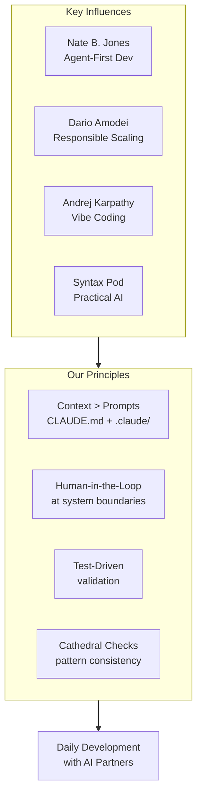

import {NextBestAction, StatusBadge} from "@site/src/components/docs";

# Core Philosophies

<StatusBadge status="Live" />

## Overview

Green Goods treats AI as a first-class development partner, not an afterthought bolted onto existing workflows. Every package in the monorepo ships with agent context files (`.claude/context/*.md`), structured rules, and machine-readable conventions that make it possible for AI agents to contribute meaningful code from day one.

This page documents the thinkers, ideas, and principles that shape how we work with AI-assisted development across contracts, indexers, and frontend packages.

## Key Influences

The following voices have shaped our approach to agentic development. Each brings a different lens -- from safety to pragmatism to workflow design.

### Nate B. Jones -- Agent-First Development

Nate B. Jones writes about treating AI coding agents as genuine collaborators rather than autocomplete tools. His work on agentic coding practices emphasizes structured context, explicit constraints, and designing repositories so that agents can navigate them autonomously.

Green Goods adopted his ideas directly: our `CLAUDE.md`, agent specs, and `.claude/context/` directory structure are all designed to give agents the same onboarding experience a human contributor would get -- except machine-parseable.

### Dario Amodei -- Responsible Scaling

Dario Amodei, CEO of Anthropic, articulated a vision for AI development that balances capability with safety in his essay "Machines of Loving Grace." His responsible scaling framework asks a simple question: as models become more capable, what guardrails keep them aligned with human intent?

For Green Goods, this translates to human-in-the-loop gates at every high-stakes boundary: contract deployments require explicit broadcast flags, migration scripts need manual approval, and agents cannot push to shared branches without review.

### Andrej Karpathy -- Vibe Coding

Andrej Karpathy, former Tesla AI director and OpenAI researcher, popularized the concept of "vibe coding" -- the practice of describing intent in natural language and letting AI translate it into working code. His practical approach to AI-assisted development focuses on iteration speed and trusting the model's output while maintaining human judgment on architecture.

Green Goods embraces this philosophy in day-to-day feature work while adding structure around it: TDD requirements ensure that vibes get validated by tests, and cathedral checks ensure that new code matches existing patterns rather than inventing new ones.

### Syntax Podcast -- Practical AI Tooling

The Syntax podcast, hosted by Wes Bos and Scott Tolinski, covers the intersection of modern web development and AI tooling. Their episodes on integrating AI into real development workflows -- from code generation to debugging to documentation -- provide grounded, practitioner-level guidance.

Their influence shows up in how Green Goods approaches developer experience: AI tools should reduce friction in the edit-test-build-lint cycle, not add a new layer of complexity on top of it.

## Our Principles

These are the operational principles that guide how Green Goods applies agentic development in practice.

### Context engineering over prompt engineering

Rather than crafting perfect one-shot prompts, we invest in structuring the repository so that any capable model can orient itself. This means:

- **`CLAUDE.md`** at the root defines commands, architecture, patterns, and constraints in a format agents can parse.
- **`.claude/context/*.md`** files provide package-specific context (shared hooks, contract patterns, indexer boundaries).
- **Agent specs** in `.claude/agents/` define role-specific behavior for code review, implementation, and documentation tasks.

The goal is that context does the heavy lifting, not the prompt.

### Human-in-the-loop at system boundaries

Agents operate freely within well-defined boundaries but require human approval at system edges:

- **Contract deployment**: Requires `--broadcast` flag and explicit network selection. Dry-run is the default.
- **Git operations**: Agents do not force-push, amend published commits, or push to main without review.
- **External services**: IPFS uploads, EAS attestations, and ENS registrations all go through explicit confirmation paths.

### Test-driven validation

AI-generated code must pass the same quality gates as human-written code. The TDD workflow (write failing test, implement, verify green) applies equally to agent-produced features. This is not optional -- it is enforced by the development process.

### Cathedral checks for consistency

Before implementing any new module, the agent (or human) finds the most similar existing file and uses it as a reference. This "cathedral check" pattern ensures that hooks, components, error handling, and barrel exports follow established conventions rather than introducing novel patterns.

## Resources

- **Nate B. Jones** -- Substack writings on agentic coding practices and agent-first repository design
- **Dario Amodei** -- "Machines of Loving Grace" essay on AI's potential for positive impact and responsible scaling
- **Andrej Karpathy** -- Talks and posts on practical AI for software development and the vibe coding philosophy
- **Syntax Podcast** -- Episodes on web development meets AI tooling, practical integration patterns
- **Anthropic documentation** -- Claude Code CLI and agent SDK guides for building with structured context
- **Green Goods `CLAUDE.md`** -- The living reference for how this project structures agent context (see root of this repository)

<NextBestAction
  title="Next best action"
  why="Learn how to write effective prompts for AI agents."
  actionLabel="Prompt Engineering"
  actionHref="./prompt-engineering"
  alternatives={[
    {label: "Context Engineering", href: "./context-engineering"},
    {label: "Spec Engineering", href: "./spec-engineering"},
  ]}
/>
